# A-MEM: Agentic Memory 设计文档

## 1. 系统架构总览

### 1.1 分层架构

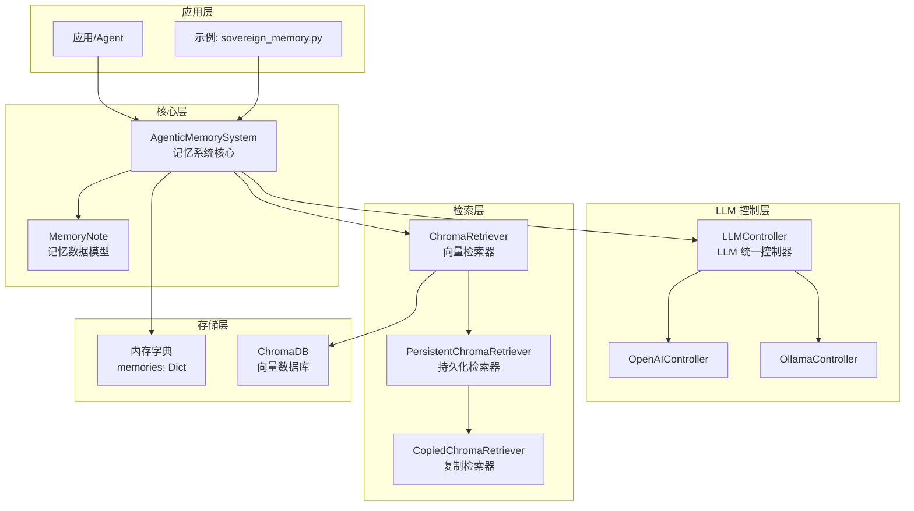

### 1.2 模块依赖关系

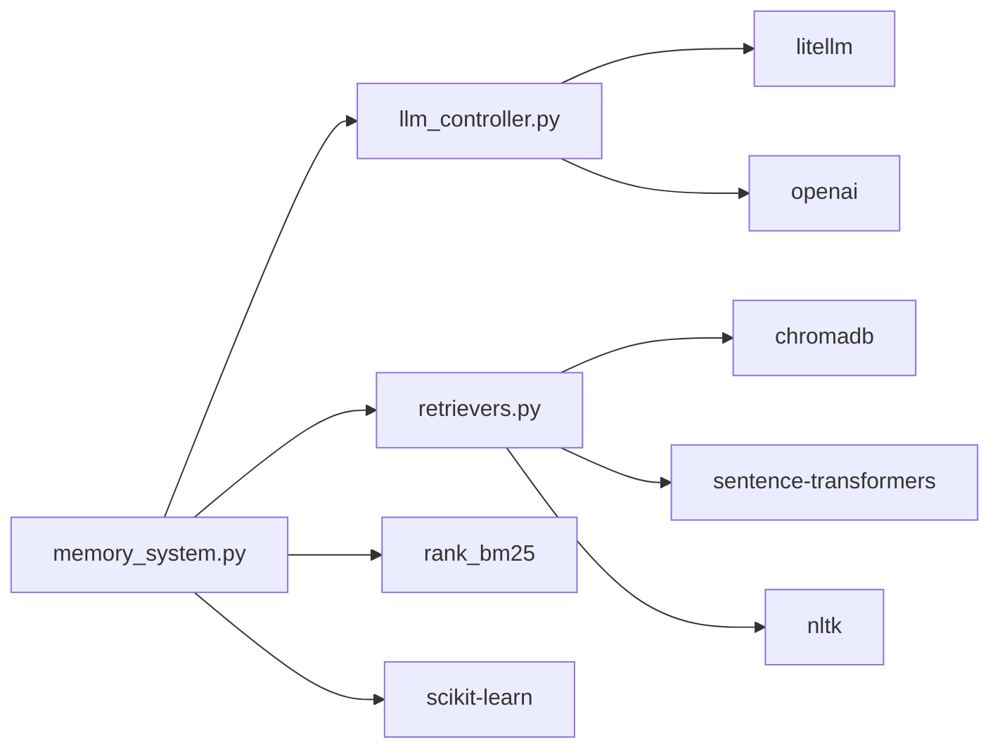

---

## 2. 核心流程设计

### 2.1 记忆添加流程

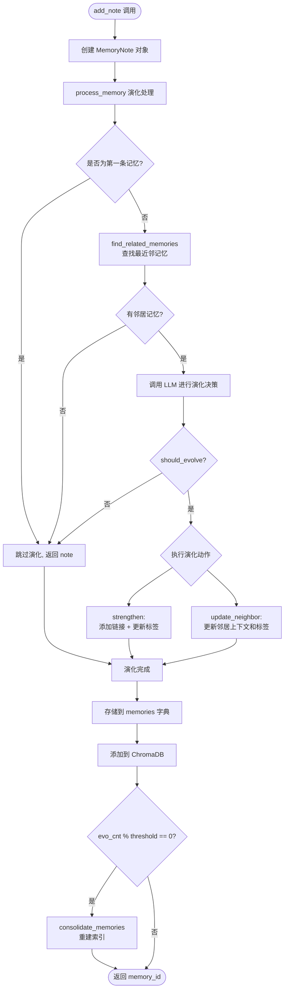

### 2.2 记忆演化决策流程

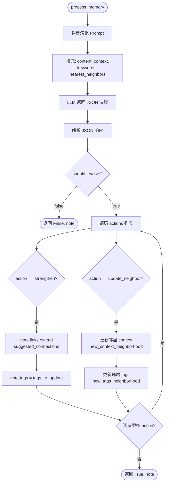

### 2.3 检索流程

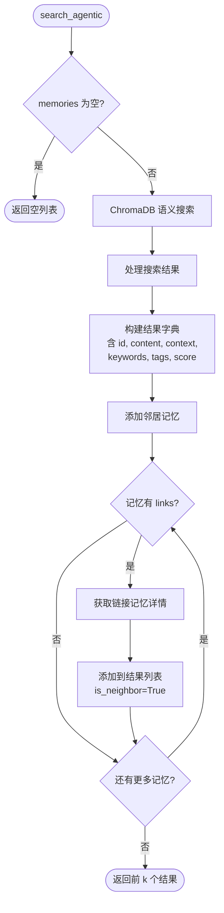

---

## 3. 类设计

### 3.1 类继承关系

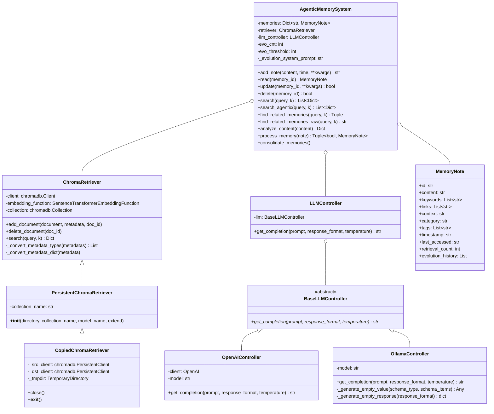

---

## 4. 数据流设计

### 4.1 记忆写入数据流

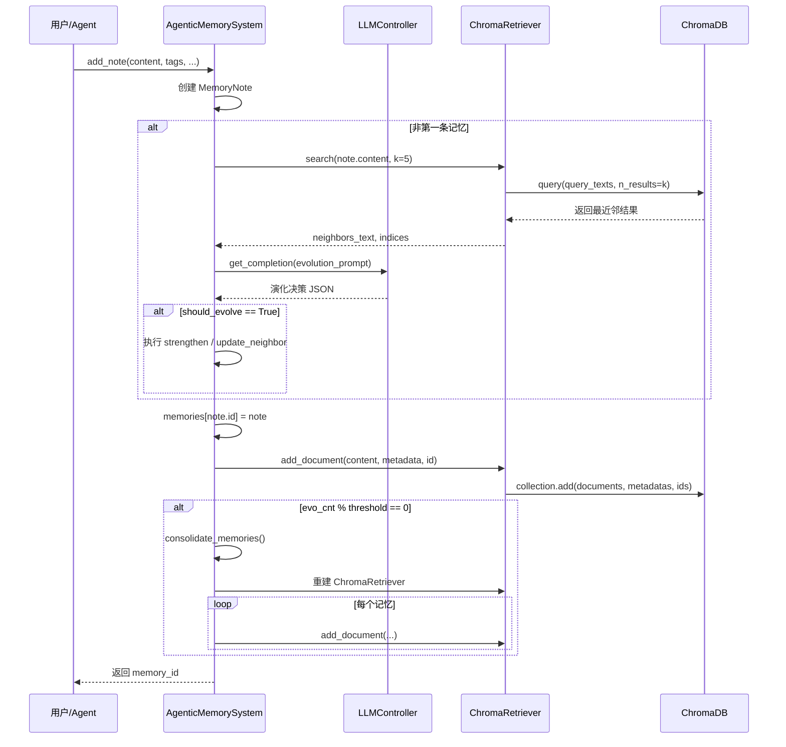

### 4.2 记忆检索数据流

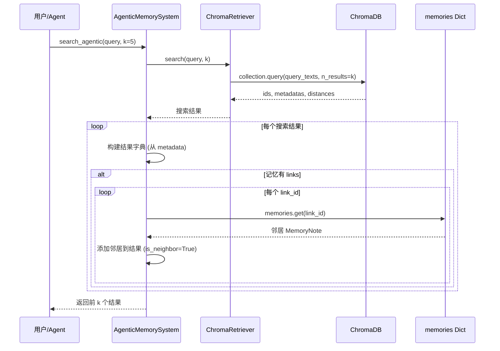

---

## 5. 存储设计

### 5.1 双重存储架构

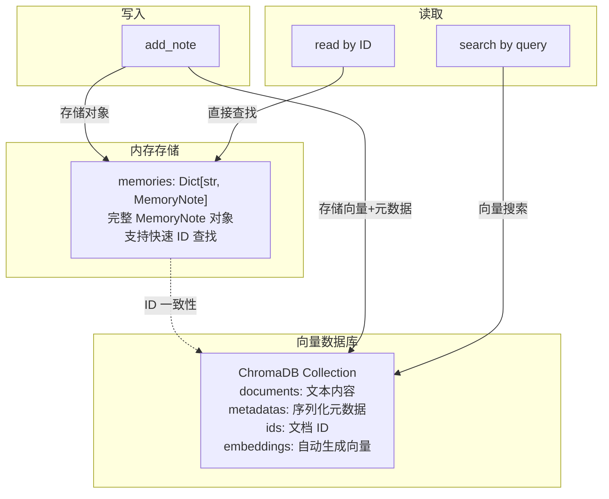

### 5.2 元数据序列化策略

| 字段类型 | 存储方式 | 反序列化方式 |
|----------|----------|--------------|
| `str` | 直接存储 | 直接读取 |
| `int` | `str(value)` | `ast.literal_eval()` |
| `List[str]` | `json.dumps()` | `ast.literal_eval()` |
| `Dict` | `json.dumps()` | `ast.literal_eval()` |

---

## 6. LLM 交互设计

### 6.1 Prompt 设计

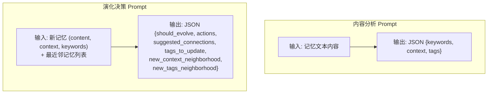

### 6.2 JSON Schema 约束

两个 LLM 调用均使用 `json_schema` 响应格式，确保输出严格遵循预定义的结构：

- **内容分析**: `keywords: array<string>`, `context: string`, `tags: array<string>`
- **演化决策**: `should_evolve: boolean`, `actions: array<string>`, `suggested_connections: array<string>`, `tags_to_update: array<string>`, `new_context_neighborhood: array<string>`, `new_tags_neighborhood: array<array<string>>`

---

## 7. 演化系统设计

### 7.1 演化生命周期

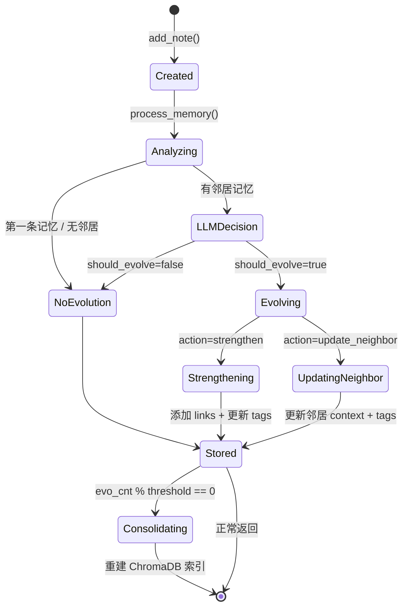

### 7.2 记忆整合机制

当演化计数达到阈值时，系统执行 `consolidate_memories()`：
1. 创建全新的 `ChromaRetriever` 实例（清空旧索引）
2. 遍历 `memories` 字典中所有记忆
3. 重新将每条记忆及其最新元数据写入 ChromaDB

---

## 8. 检索器继承体系

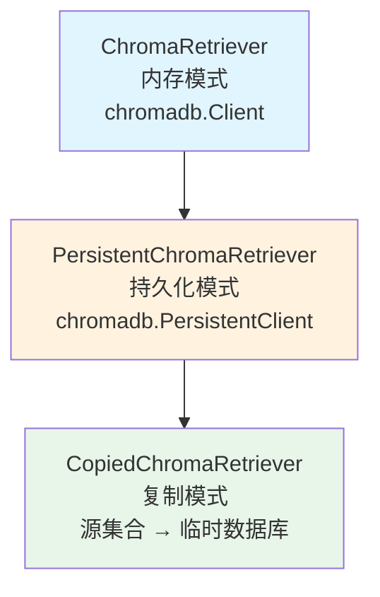

| 检索器 | 客户端类型 | 适用场景 |
|--------|-----------|----------|
| `ChromaRetriever` | `chromadb.Client` | 单会话、测试、临时使用 |
| `PersistentChromaRetriever` | `chromadb.PersistentClient` | 跨会话持久化、多 Agent 共享 |
| `CopiedChromaRetriever` | 临时 `PersistentClient` | 从共享集合创建隔离副本 |
