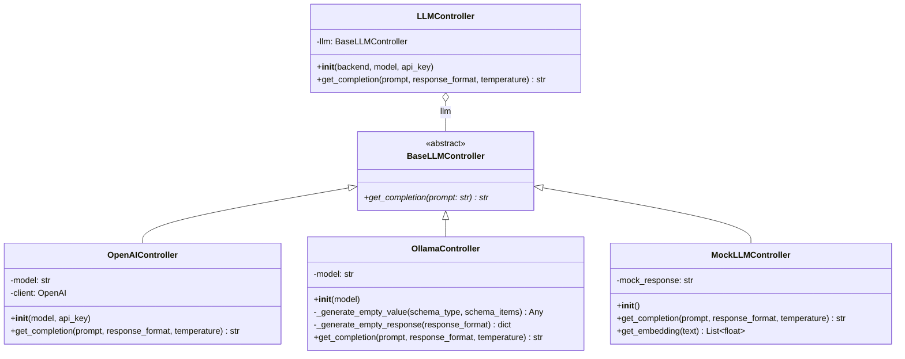
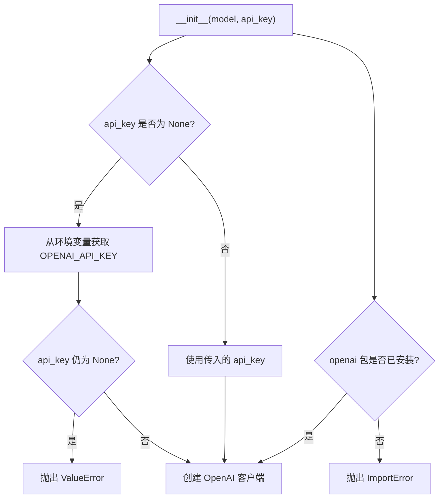
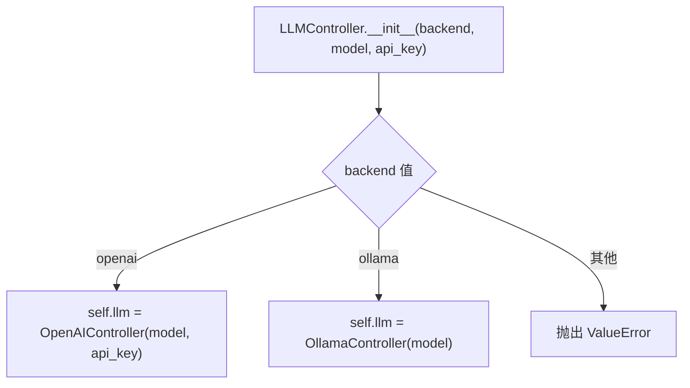
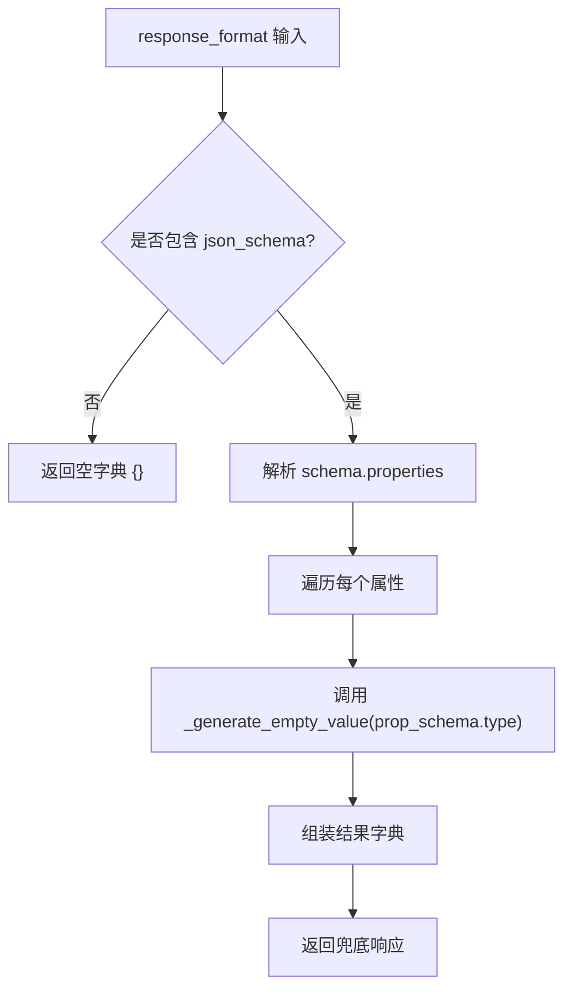
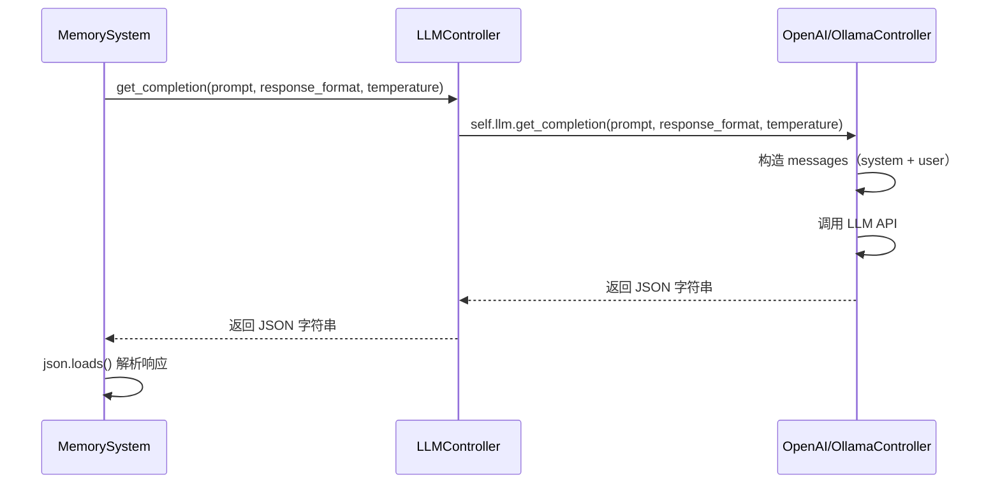
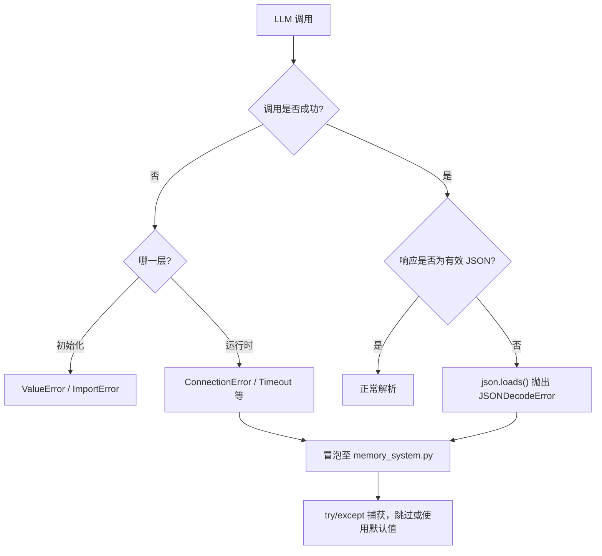
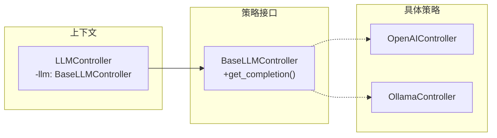
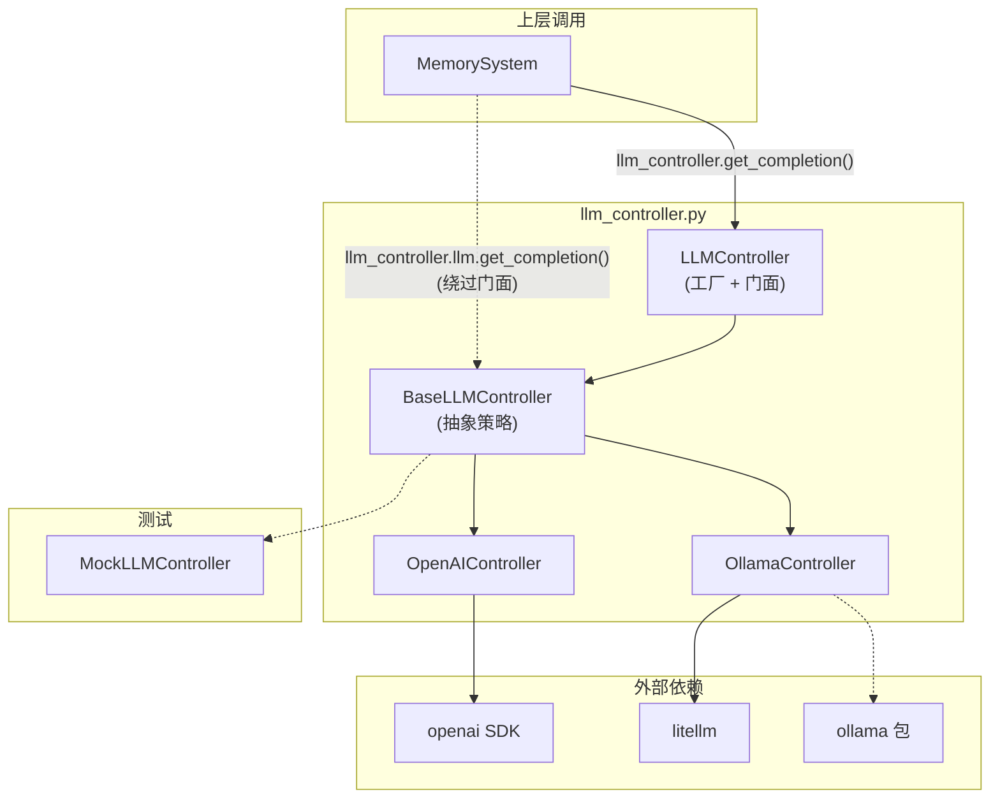

# llm_controller.py 模块深度分析

## 1. 模块职责概述

`llm_controller.py` 是 A-mem 系统的 LLM 调用抽象层，负责统一封装不同大语言模型后端（OpenAI、Ollama）的调用逻辑，为上层 `memory_system.py` 提供一致的 LLM 交互接口。其核心职责包括：

- **后端抽象**：屏蔽 OpenAI 与 Ollama 之间的 API 差异
- **结构化输出**：通过 JSON Schema 约束 LLM 返回格式化的 JSON 响应
- **工厂分发**：根据配置动态选择具体后端实现
- **兜底容错**：为 Ollama 本地模型提供空响应兜底机制

## 2. 类继承体系分析

### 2.1 类关系图



### 2.2 继承关系说明

| 类名 | 角色 | 说明 |
|------|------|------|
| `BaseLLMController` | 抽象基类 | 定义 `get_completion` 抽象方法，所有后端控制器必须实现 |
| `OpenAIController` | 具体策略 | 封装 OpenAI API 调用逻辑 |
| `OllamaController` | 具体策略 | 封装 Ollama 本地模型调用逻辑（通过 litellm 间接调用） |
| `LLMController` | 工厂 + 门面 | 根据后端类型创建具体控制器，对外暴露统一接口 |
| `MockLLMController` | 测试替身 | 继承基类用于单元测试，位于 `tests/test_utils.py` |

## 3. 每个类的详细分析

### 3.1 BaseLLMController

```python
class BaseLLMController(ABC):
    @abstractmethod
    def get_completion(self, prompt: str) -> str:
        pass
```

**属性**：无实例属性。

**方法**：

| 方法 | 签名 | 说明 |
|------|------|------|
| `get_completion` | `(prompt: str) -> str` | 抽象方法，子类必须实现。注意：基类签名仅含 `prompt`，但子类均扩展了 `response_format` 和 `temperature` 参数 |

**设计问题**：基类方法签名与子类实现不一致——基类声明 `get_completion(prompt)` 而子类实现为 `get_completion(prompt, response_format, temperature)`，违反了里氏替换原则（LSP）。

### 3.2 OpenAIController

**属性**：

| 属性 | 类型 | 说明 |
|------|------|------|
| `model` | `str` | 模型名称，默认 `"gpt-4"` |
| `client` | `OpenAI` | OpenAI SDK 客户端实例 |

**方法**：

| 方法 | 说明 |
|------|------|
| `__init__(model, api_key)` | 初始化 OpenAI 客户端，API Key 优先取参数，其次取环境变量 `OPENAI_API_KEY` |
| `get_completion(prompt, response_format, temperature)` | 调用 OpenAI Chat Completions API，强制 JSON 输出 |

**初始化流程**：



**get_completion 调用细节**：

- 系统消息固定为 `"You must respond with a JSON object."`
- 使用 `response_format` 参数实现结构化 JSON 输出（OpenAI 原生支持 JSON Schema 模式）
- `max_tokens` 硬编码为 1000
- `temperature` 默认 0.7

### 3.3 OllamaController

**属性**：

| 属性 | 类型 | 说明 |
|------|------|------|
| `model` | `str` | 本地模型名称，默认 `"llama2"` |

**注意**：`__init__` 中导入了 `ollama.chat` 但未赋值为实例属性，实际调用使用的是 `litellm.completion`。

**方法**：

| 方法 | 可见性 | 说明 |
|------|--------|------|
| `__init__(model)` | 公有 | 初始化模型名称，导入 ollama 包（仅做依赖检查） |
| `_generate_empty_value(schema_type, schema_items)` | 私有 | 根据 JSON Schema 类型生成对应的空值/默认值 |
| `_generate_empty_response(response_format)` | 私有 | 根据 response_format 中的 json_schema 生成完整的空响应对象 |
| `get_completion(prompt, response_format, temperature)` | 公有 | 通过 litellm 调用 Ollama 模型 |

**get_completion 调用细节**：

- 模型名称拼接为 `"ollama_chat/{model}"`，这是 litellm 的 Ollama 适配格式
- 系统消息同样固定为 `"You must respond with a JSON object."`
- 传递了 `response_format` 参数，但 `temperature` 参数**未被使用**（传入了但未传给 `completion()`）
- 异常允许向上冒泡（注释明确说明）

### 3.4 LLMController

**属性**：

| 属性 | 类型 | 说明 |
|------|------|------|
| `llm` | `BaseLLMController` | 具体后端控制器实例（多态） |

**方法**：

| 方法 | 说明 |
|------|------|
| `__init__(backend, model, api_key)` | 工厂方法，根据 backend 创建对应控制器 |
| `get_completion(prompt, response_format, temperature)` | 委托给内部 `self.llm` 执行 |

**工厂逻辑**：



## 4. 两种后端的差异对比（OpenAI vs Ollama）

| 维度 | OpenAIController | OllamaController |
|------|-------------------|-------------------|
| **调用方式** | 直接使用 `openai` SDK | 通过 `litellm` 间接调用 |
| **客户端初始化** | 创建 `OpenAI` 客户端实例 | 无客户端实例，仅记录模型名 |
| **认证方式** | 需要 API Key（参数或环境变量） | 无需认证（本地模型） |
| **模型前缀** | 无（直接使用模型名） | `ollama_chat/` 前缀 |
| **temperature 参数** | ✅ 传递给 API | ❌ 未传递（被忽略） |
| **max_tokens** | 硬编码 1000 | 未设置 |
| **JSON Schema 支持** | 原生支持 `response_format` | 通过 litellm 传递，支持程度取决于模型 |
| **空响应兜底** | 无 | 有（`_generate_empty_response`） |
| **依赖包** | `openai` | `ollama` + `litellm` |
| **导入检查** | try/except ImportError | 直接导入（失败即崩溃） |

## 5. OllamaController 的空响应兜底机制分析

OllamaController 提供了两个私有方法用于在 Ollama 模型返回空或无效响应时生成兜底数据：

### 5.1 `_generate_empty_value`

根据 JSON Schema 的 `type` 字段生成对应类型的空值：

| Schema Type | 返回值 |
|-------------|--------|
| `"array"` | `[]` |
| `"string"` | `""` |
| `"object"` | `{}` |
| `"number"` | `0` |
| `"boolean"` | `False` |
| 其他 | `None` |

### 5.2 `_generate_empty_response`

遍历 `response_format["json_schema"]["schema"]["properties"]`，为每个属性调用 `_generate_empty_value` 生成默认值，组装成完整对象。

### 5.3 兜底机制流程



### 5.4 关键问题

**兜底方法未被调用**：`_generate_empty_response` 和 `_generate_empty_value` 虽然已实现，但在 `get_completion` 方法中**没有任何调用点**。这意味着：

- 当 Ollama 模型返回空响应时，`response.choices[0].message.content` 可能返回 `None` 或空字符串
- 上层代码 `memory_system.py` 直接对返回值做 `json.loads()` 解析，将导致 `JSONDecodeError`
- 兜底代码形同虚设，属于**未完成的防御性编程**

### 5.5 嵌套 schema 支持不足

`_generate_empty_value` 对 `schema_items` 参数接收了但未使用。对于嵌套数组（如 `new_tags_neighborhood` 类型为 `array of array of string`），无法正确生成嵌套空值。

## 6. JSON Schema 响应格式的使用方式

### 6.1 格式结构

系统统一使用 OpenAI 的 JSON Schema 响应格式规范：

```python
response_format = {
    "type": "json_schema",
    "json_schema": {
        "name": "response",           # Schema 名称
        "schema": {
            "type": "object",
            "properties": { ... },     # 属性定义
            "required": [...],         # 必填字段
            "additionalProperties": False  # 禁止额外属性
        },
        "strict": True                 # 严格模式
    }
}
```

### 6.2 实际使用场景

在 `memory_system.py` 中有两处调用：

**场景一：记忆元数据生成**（`_generate_memory_metadata`）

```python
response_format = {
    "type": "json_schema",
    "json_schema": {
        "name": "response",
        "schema": {
            "type": "object",
            "properties": {
                "keywords": {"type": "array", "items": {"type": "string"}},
                "context": {"type": "string"},
                "tags": {"type": "array", "items": {"type": "string"}}
            },
            ...
        }
    }
}
```

**场景二：记忆演化决策**（`evolve_memory`）

```python
response_format = {
    "type": "json_schema",
    "json_schema": {
        "name": "response",
        "schema": {
            "type": "object",
            "properties": {
                "should_evolve": {"type": "boolean"},
                "actions": {"type": "array", "items": {"type": "string"}},
                "suggested_connections": {"type": "array", "items": {"type": "string"}},
                "new_context_neighborhood": {"type": "array", "items": {"type": "string"}},
                "tags_to_update": {"type": "array", "items": {"type": "string"}},
                "new_tags_neighborhood": {"type": "array", "items": {"type": "array", "items": {"type": "string"}}}
            },
            ...
        }
    }
}
```

### 6.3 调用链路



## 7. 错误处理策略

### 7.1 各层错误处理一览

| 层级 | 错误类型 | 处理方式 |
|------|----------|----------|
| `OpenAIController.__init__` | `ImportError` | 捕获并重新抛出，附带安装提示 |
| `OpenAIController.__init__` | API Key 缺失 | 抛出 `ValueError`，提示设置环境变量 |
| `OllamaController.__init__` | `ImportError` | **未捕获**，直接崩溃 |
| `OllamaController.get_completion` | 网络异常等 | **允许冒泡**（注释说明为便于调试） |
| `LLMController.__init__` | 无效 backend | 抛出 `ValueError` |
| `memory_system.py` 调用层 | LLM 异常 | try/except 捕获后跳过或使用默认值 |

### 7.2 错误处理流程



### 7.3 问题

- **错误处理不对称**：OpenAI 初始化有完善的错误提示，Ollama 初始化则无
- **缺少响应验证**：`get_completion` 返回后无 JSON 有效性校验
- **兜底机制断裂**：`_generate_empty_response` 已实现但未接入调用链

## 8. 设计模式分析

### 8.1 策略模式（Strategy Pattern）

`BaseLLMController` 定义策略接口，`OpenAIController` 和 `OllamaController` 为具体策略实现。`LLMController` 作为上下文（Context）持有策略引用。



**实现评价**：

- ✅ 策略接口抽象合理，便于扩展新后端
- ❌ 基类方法签名与子类不一致，破坏多态性
- ❌ `MockLLMController` 额外定义了 `get_embedding` 方法，但基类无此抽象

### 8.2 工厂模式（Factory Pattern）

`LLMController.__init__` 承担了简单工厂的职责，根据 `backend` 参数决定创建哪种控制器实例。

**实现评价**：

- ✅ 集中化创建逻辑，调用方无需关心具体类
- ❌ 工厂逻辑嵌入构造函数中，而非独立工厂方法/类，扩展性有限
- ❌ 新增后端需修改 `LLMController.__init__`，违反开闭原则

### 8.3 门面模式（Facade Pattern）

`LLMController` 同时充当门面，为上层提供简化的统一调用入口，屏蔽底层 API 差异。

## 9. 潜在问题与改进建议

### 9.1 关键问题

| # | 问题 | 严重程度 | 说明 |
|---|------|----------|------|
| 1 | 兜底方法未被调用 | 🔴 高 | `_generate_empty_response` 已实现但未接入，Ollama 空响应将导致上层崩溃 |
| 2 | 基类方法签名不一致 | 🟡 中 | 基类 `get_completion(prompt)` 与子类 `get_completion(prompt, response_format, temperature)` 签名不匹配 |
| 3 | Ollama temperature 被忽略 | 🟡 中 | `OllamaController.get_completion` 接收 `temperature` 但未传给 `litellm.completion` |
| 4 | Ollama 初始化缺少错误处理 | 🟡 中 | `from ollama import chat` 无 try/except，安装缺失时直接崩溃 |
| 5 | 无效 ollama 导入 | 🟠 低 | `__init__` 中 `from ollama import chat` 导入后未使用，实际使用 `litellm` |
| 6 | 嵌套 schema 兜底不完整 | 🟠 低 | `_generate_empty_value` 未处理嵌套类型（如 array of array） |
| 7 | max_tokens 硬编码 | 🟠 低 | OpenAI 控制器硬编码 `max_tokens=1000`，不可配置 |
| 8 | 直接访问内部属性 | 🟠 低 | `memory_system.py` 直接访问 `self.llm_controller.llm.get_completion()`，绕过了门面层 |

### 9.2 改进建议

**建议一：接入兜底机制**

在 `OllamaController.get_completion` 中添加空响应检测与兜底逻辑：

```python
def get_completion(self, prompt, response_format, temperature=0.7):
    try:
        response = completion(...)
        content = response.choices[0].message.content
        if not content or not content.strip():
            return json.dumps(self._generate_empty_response(response_format))
        return content
    except Exception:
        if response_format:
            return json.dumps(self._generate_empty_response(response_format))
        raise
```

**建议二：统一基类签名**

将 `BaseLLMController.get_completion` 的签名扩展为包含可选参数：

```python
class BaseLLMController(ABC):
    @abstractmethod
    def get_completion(self, prompt: str, response_format: dict = None,
                       temperature: float = 0.7) -> str:
        pass
```

**建议三：修复 Ollama temperature 传递**

```python
response = completion(
    model="ollama_chat/{}".format(self.model),
    messages=[...],
    response_format=response_format,
    temperature=temperature,  # 补充此参数
)
```

**建议四：移除无效导入**

`OllamaController.__init__` 中的 `from ollama import chat` 未被使用，应移除或替换为对 `litellm` 的依赖检查。

**建议五：统一访问路径**

`memory_system.py` 中应通过 `self.llm_controller.get_completion()` 调用，而非直接访问 `self.llm_controller.llm.get_completion()`，以保持门面模式的封装性。

**建议六：引入独立工厂**

将后端创建逻辑从 `LLMController.__init__` 中抽离为独立工厂函数或工厂类，便于扩展新后端而不修改现有代码。

### 9.3 调用关系总览


