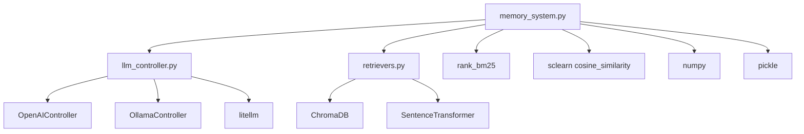
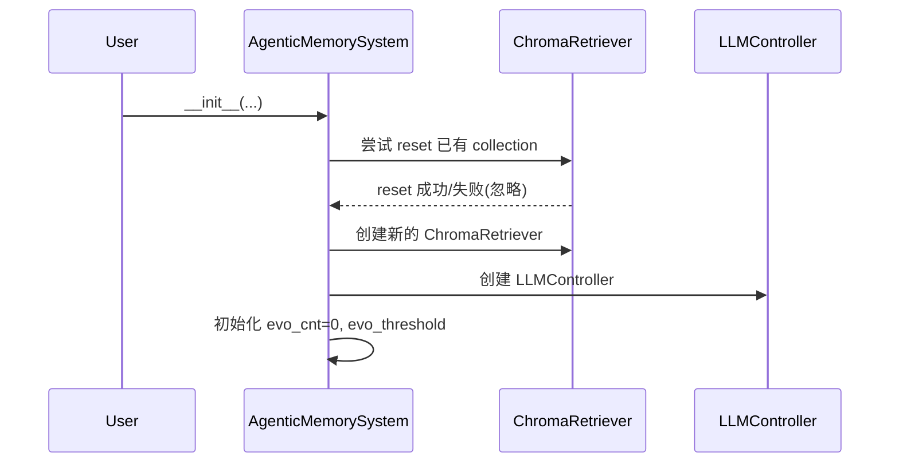
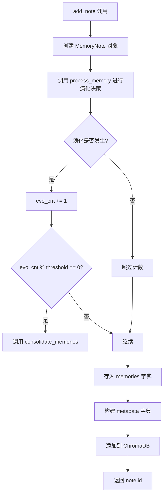
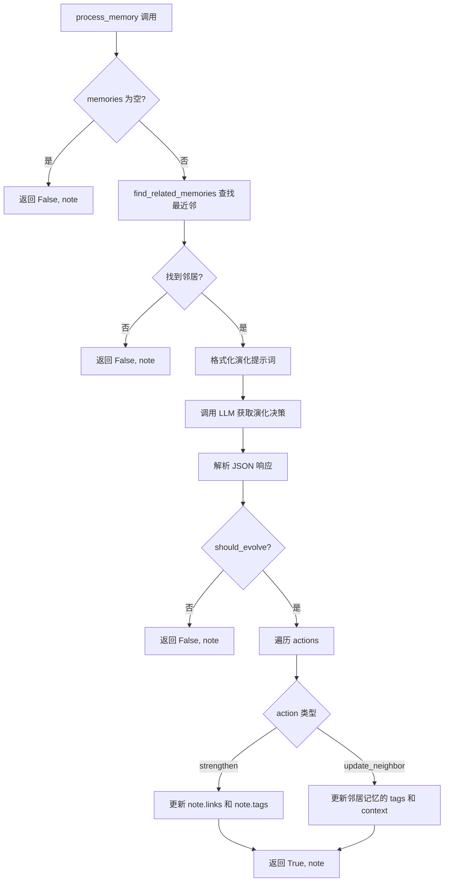
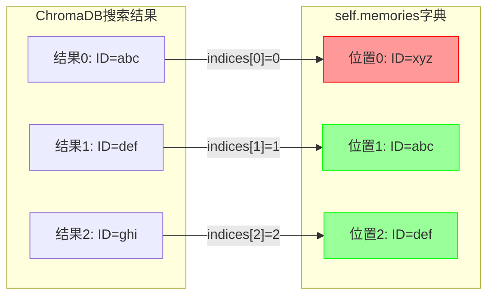
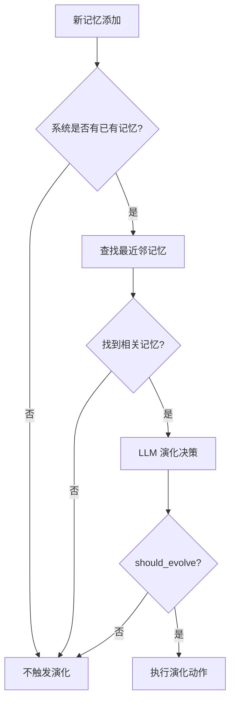
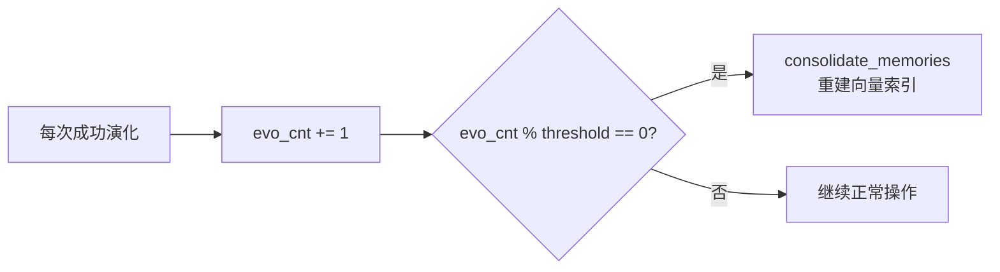
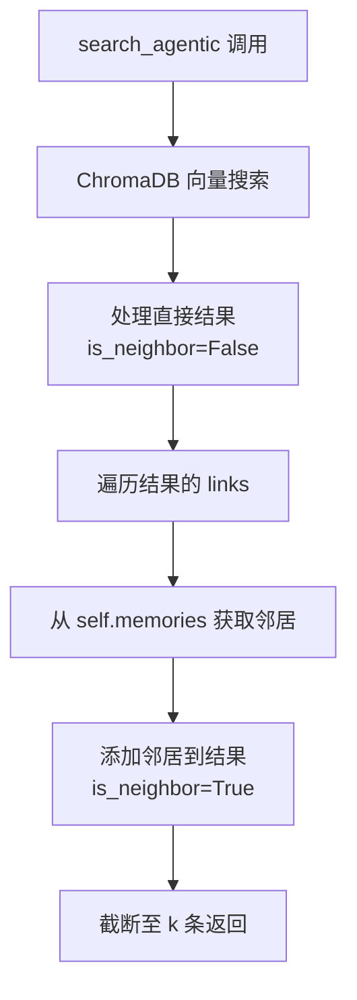
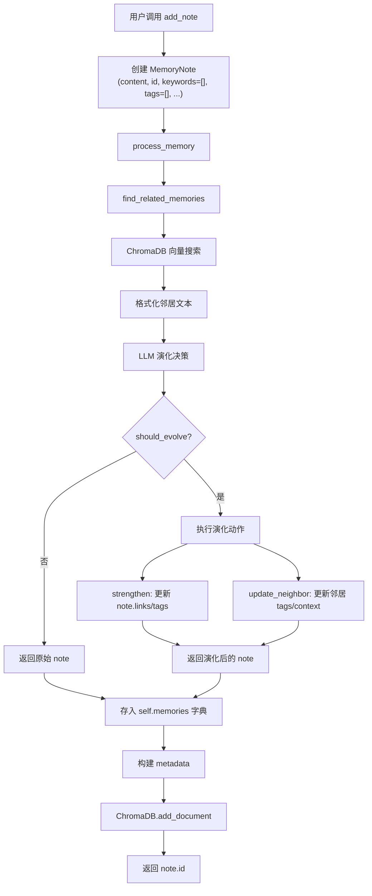
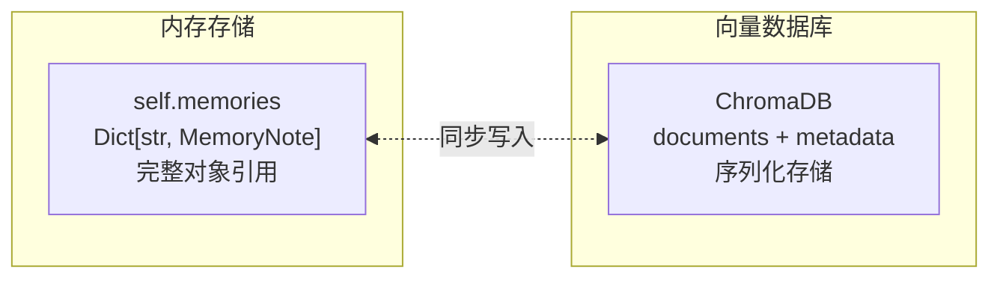

# memory_system.py 核心模块深度分析

> 分析对象：`/agentic_memory/memory_system.py`
> 分析日期：2026-06-07

---

## 1. 模块职责概述

`memory_system.py` 是 A-mem 项目的**核心记忆管理模块**，承担以下职责：

- **记忆的 CRUD 操作**：创建、读取、更新、删除记忆笔记（MemoryNote）
- **内容语义分析**：通过 LLM 提取记忆的关键词、上下文和标签
- **记忆演化机制**：基于 LLM 决策，自动判断新记忆是否需要与已有记忆建立关联或更新邻居记忆的元数据
- **混合检索能力**：基于 ChromaDB 向量数据库的语义搜索，支持多种搜索策略
- **记忆整合**：定期重建向量索引以保持索引一致性

### 依赖关系图



---

## 2. 核心类分析

### 2.1 MemoryNote 类

`MemoryNote` 是记忆系统的**数据模型**，封装了单条记忆的所有元数据。

#### 属性一览

| 属性 | 类型 | 默认值 | 说明 |
|------|------|--------|------|
| `content` | `str` | 必填 | 记忆正文内容 |
| `id` | `str` | `uuid.uuid4()` | 唯一标识符 |
| `keywords` | `List[str]` | `[]` | 从内容提取的关键词 |
| `links` | `List` | `[]` | 关联的其他记忆 ID 列表 |
| `context` | `str` | `"General"` | 记忆所属领域/主题 |
| `category` | `str` | `"Uncategorized"` | 分类类别 |
| `tags` | `List[str]` | `[]` | 分类标签 |
| `timestamp` | `str` | 当前时间 | 创建时间（格式 `YYYYMMDDHHMM`） |
| `last_accessed` | `str` | 当前时间 | 最后访问时间 |
| `retrieval_count` | `int` | `0` | 被检索次数 |
| `evolution_history` | `List` | `[]` | 演化变更历史 |

#### 设计特点

- **纯数据类**：无业务逻辑，仅负责数据封装
- **自动 ID 生成**：未提供 id 时自动生成 UUID
- **时间戳自动填充**：创建时自动设置 `timestamp` 和 `last_accessed`
- **类型标注不一致**：`links` 参数类型声明为 `Optional[Dict]`，但默认值为 `[]`（列表），实际使用中也作为列表操作（`extend`），存在类型声明与实际使用不匹配的问题

---

### 2.2 AgenticMemorySystem 类

`AgenticMemorySystem` 是记忆系统的**核心控制器**，管理记忆的完整生命周期。

#### 构造参数

| 参数 | 类型 | 默认值 | 说明 |
|------|------|--------|------|
| `model_name` | `str` | `'all-MiniLM-L6-v2'` | SentenceTransformer 嵌入模型名 |
| `llm_backend` | `str` | `"openai"` | LLM 后端（openai/ollama） |
| `llm_model` | `str` | `"gpt-4o-mini"` | LLM 模型名 |
| `evo_threshold` | `int` | `100` | 触发记忆整合的演化计数阈值 |
| `api_key` | `Optional[str]` | `None` | LLM API 密钥 |

#### 核心状态

| 属性 | 类型 | 说明 |
|------|------|------|
| `memories` | `Dict[str, MemoryNote]` | 内存中的记忆字典，key 为记忆 ID |
| `retriever` | `ChromaRetriever` | ChromaDB 向量检索器 |
| `llm_controller` | `LLMController` | LLM 控制器 |
| `evo_cnt` | `int` | 演化计数器 |
| `evo_threshold` | `int` | 整合触发阈值 |
| `_evolution_system_prompt` | `str` | 演化决策的系统提示词模板 |

#### 初始化流程



> **注意**：初始化时会尝试 `reset` ChromaDB，这意味着**每次创建系统实例都会清除所有已有向量数据**。这是一个有争议的设计——有利于测试，但不利于生产环境的持久化。

---

## 3. 关键方法详细说明

### 3.1 analyze_content(content: str) → Dict

**功能**：使用 LLM 分析文本内容，提取语义元数据。

**参数**：
- `content` (str)：待分析的文本内容

**返回值**：
- `Dict`：包含 `keywords`（关键词列表）、`context`（上下文描述）、`tags`（标签列表）

**处理流程**：
1. 构造分析提示词，要求 LLM 以 JSON 格式返回结构化分析结果
2. 使用 `json_schema` 约束 LLM 输出格式，确保返回合法 JSON
3. 解析 JSON 响应并返回
4. 异常时返回空默认值 `{"keywords": [], "context": "General", "tags": []}`

> **注意**：此方法在当前代码中**未被调用**。`add_note` 方法直接创建 `MemoryNote` 而未调用 `analyze_content` 来填充元数据，这意味着新添加的记忆默认 keywords/tags 为空，除非调用者显式传入。

---

### 3.2 add_note(content: str, time: str = None, **kwargs) → str

**功能**：添加新的记忆笔记。

**参数**：
- `content` (str)：记忆内容
- `time` (str, optional)：时间戳
- `**kwargs`：传递给 MemoryNote 的其他参数

**返回值**：
- `str`：新创建记忆的 ID

**处理流程**：



**关键问题**：
- `process_memory` 在记忆存入 `self.memories` **之前**调用，但 `process_memory` 内部的 `update_neighbor` 动作需要通过 `self.memories` 查找邻居记忆——这意味着**新记忆本身不在 memories 中时，其邻居可以被更新，但新记忆的 links 指向的 ID 可能尚未验证存在性**
- 演化后的 `note` 对象（可能已修改 tags/links）被存入 `self.memories`，但 ChromaDB 中存入的是**演化后的** metadata——这是一致的

---

### 3.3 process_memory(note: MemoryNote) → Tuple[bool, MemoryNote]

**功能**：处理记忆笔记，决定是否进行演化。这是整个系统的**核心决策方法**。

**参数**：
- `note` (MemoryNote)：待处理的记忆笔记

**返回值**：
- `Tuple[bool, MemoryNote]`：(是否发生演化, 处理后的笔记)

**完整流程**：



#### 演化决策逻辑详解

LLM 返回的 JSON 结构：

```json
{
    "should_evolve": true/false,
    "actions": ["strengthen", "update_neighbor"],
    "suggested_connections": ["neighbor_memory_id_1", ...],
    "tags_to_update": ["tag_1", "tag_2", ...],
    "new_context_neighborhood": ["new context 1", "new context 2", ...],
    "new_tags_neighborhood": [["tag_a", "tag_b"], ["tag_c", "tag_d"], ...]
}
```

#### strengthen 动作

**目的**：加强新记忆与相关记忆之间的连接。

**操作**：
1. 将 `suggested_connections` 中的 ID 添加到 `note.links`（使用 `extend`，可重复添加）
2. 用 `tags_to_update` 替换 `note.tags`

**问题**：
- `suggested_connections` 中的 ID 是 LLM 生成的，**可能不存在于实际记忆中**，缺乏验证
- `links` 使用 `extend` 而非去重合并，可能导致**重复链接**
- `tags` 直接替换而非合并，可能**丢失原有标签**

#### update_neighbor 动作

**目的**：基于新记忆的理解，更新邻居记忆的上下文和标签。

**操作**：
1. 获取 `self.memories` 的值列表和键列表
2. 遍历 `indices`（来自 `find_related_memories` 的返回值），按索引更新对应记忆

**严重问题**：
- `indices` 是 `find_related_memories` 返回的**序号索引**（0, 1, 2...），而非记忆 ID
- 但 `noteslist = list(self.memories.values())` 的顺序**不保证**与 ChromaDB 搜索结果的顺序一致
- 使用 `noteslist[memorytmp_idx]` 按位置索引访问，**可能更新错误的记忆**
- 这是一个**索引一致性 Bug**：ChromaDB 返回的序号与 `self.memories` 字典的遍历顺序无对应关系



> 红色表示错误的映射：ChromaDB 结果0 对应 ID=abc，但 memories 位置0 是 ID=xyz

---

### 3.4 read(memory_id: str) → Optional[MemoryNote]

**功能**：通过 ID 获取记忆笔记。

**参数**：`memory_id` (str) - 记忆 ID

**返回值**：找到返回 `MemoryNote`，否则返回 `None`

**注意**：此方法**不更新** `last_accessed` 和 `retrieval_count`，与记忆访问统计的设计意图不符。

---

### 3.5 update(memory_id: str, **kwargs) → bool

**功能**：更新记忆笔记的字段。

**参数**：
- `memory_id` (str)：记忆 ID
- `**kwargs`：要更新的字段键值对

**返回值**：更新成功返回 `True`，记忆不存在返回 `False`

**处理流程**：
1. 检查记忆是否存在
2. 使用 `setattr` 更新指定字段
3. 删除 ChromaDB 中的旧文档
4. 重新添加更新后的文档到 ChromaDB

**注意**：更新操作采用"删除+重新添加"策略，而非 ChromaDB 的 `update` 方法，效率较低。

---

### 3.6 delete(memory_id: str) → bool

**功能**：删除指定记忆。

**参数**：`memory_id` (str) - 记忆 ID

**返回值**：删除成功返回 `True`，记忆不存在返回 `False`

**注意**：删除记忆时**不会清理**其他记忆中指向该记忆的 `links` 引用，可能导致**悬空链接**。

---

### 3.7 consolidate_memories()

**功能**：整合记忆，重建 ChromaDB 索引。

**处理流程**：
1. 创建全新的 `ChromaRetriever` 实例（丢弃旧索引）
2. 遍历 `self.memories` 中所有记忆，重新添加到 ChromaDB

**触发条件**：`evo_cnt % evo_threshold == 0` 时自动触发

**问题**：
- 重建期间，旧索引被丢弃，新索引尚未完成——**存在短暂的不可用窗口**
- 每次重建都是全量重建，对于大量记忆效率低下

---

## 4. 记忆演化机制深入分析

### 4.1 演化触发条件



### 4.2 演化系统提示词分析

演化提示词模板 `_evolution_system_prompt` 的核心逻辑：

1. **输入**：新记忆的内容、上下文、关键词 + 最近邻记忆列表
2. **决策**：是否应该演化（`should_evolve`）
3. **动作选择**：
   - `strengthen`：建立新记忆与邻居的连接，更新新记忆的标签
   - `update_neighbor`：更新邻居记忆的上下文和标签
4. **约束**：`new_tags_neighborhood` 和 `new_context_neighborhood` 的长度必须等于邻居数量

### 4.3 演化计数与整合机制



**设计意图**：定期重建索引以反映演化带来的元数据变更（如 tags、context 更新后，向量索引可能不再准确）。

**问题**：
- 整合只重建向量索引，**不重新计算嵌入**——ChromaDB 的 `add_document` 会自动计算嵌入，但基于的是 `content` 而非 metadata，所以 tags/context 的更新**不会影响向量检索结果**
- 整合的触发条件仅基于演化次数，不考虑记忆总量或时间因素

---

## 5. 搜索机制对比

系统提供了三种搜索方法和两个辅助方法，各有不同用途：

### 5.1 方法对比表

| 特性 | `search` | `search_agentic` | `find_related_memories` |
|------|----------|-------------------|------------------------|
| **返回类型** | `List[Dict]` | `List[Dict]` | `Tuple[str, List[int]]` |
| **数据来源** | ChromaDB + self.memories | ChromaDB metadata | ChromaDB metadata |
| **包含邻居** | 否 | 是（通过 links） | 否 |
| **返回字段** | id, content, context, keywords, score | id, content, context, keywords, tags, timestamp, category, is_neighbor, score | 格式化字符串 + 索引列表 |
| **用途** | 基础搜索 | 增强搜索（含关联记忆） | 演化系统内部使用 |
| **空结果处理** | 返回空列表 | 返回空列表 | 返回空字符串和空列表 |
| **异常处理** | 无 | 有 try-except | 有 try-except |

### 5.2 search 方法

```python
def search(self, query: str, k: int = 5) -> List[Dict[str, Any]]
```

**特点**：
- 从 ChromaDB 获取搜索结果
- 通过 `doc_id` 从 `self.memories` 字典获取完整记忆对象
- 返回结果包含 `score`（距离值）
- **不包含** tags、timestamp、category 等元数据

### 5.3 search_agentic 方法

```python
def search_agentic(self, query: str, k: int = 5) -> List[Dict[str, Any]]
```

**特点**：
- 从 ChromaDB 的 metadata 中获取记忆信息（而非 `self.memories`）
- 额外包含**关联邻居记忆**（通过 links 字段）
- 邻居记忆标记 `is_neighbor: True`
- 结果总数限制为 k（包含邻居）
- 更完整的元数据返回

**流程**：



### 5.4 find_related_memories 方法

```python
def find_related_memories(self, query: str, k: int = 5) -> Tuple[str, List[int]]
```

**特点**：
- 返回**格式化字符串**而非结构化数据
- 同时返回序号索引列表 `indices`（0, 1, 2...）
- 专供 `process_memory` 内部使用
- 索引列表用于 `update_neighbor` 动作中定位邻居记忆

### 5.5 _search 和 _search_raw（内部方法）

- `_search`：声称结合 ChromaDB 和嵌入检索，但实际**两次调用同一个** `self.retriever.search`，没有实现真正的混合检索——这是一个**无效的冗余实现**
- `_search_raw`：返回 ChromaDB 原始结果（id + score），当前未被使用

---

## 6. 数据流分析

### 6.1 记忆添加完整数据流



### 6.2 双存储架构

系统维护了**两个数据存储**：



**同步机制**：
- **写入**：`add_note` 和 `update` 同时写入两处
- **删除**：`delete` 同时从两处删除
- **读取**：`read` 仅从内存读取；搜索方法从 ChromaDB 读取
- **整合**：`consolidate_memories` 以内存为准，重建 ChromaDB

**一致性风险**：
- `update_neighbor` 动作修改了 `self.memories` 中的邻居记忆，但**未同步更新 ChromaDB**
- 直到下一次 `consolidate_memories` 才会同步，期间两处数据不一致

### 6.3 元数据序列化

ChromaDB 仅支持 `str`/`int`/`float`/`bool` 类型的 metadata 值，因此列表和字典需要序列化：


**问题**：`ast.literal_eval` 的还原逻辑不够健壮——如果值本身是字符串但恰好符合 Python 字面量语法（如 `"True"`），会被错误转换。

---

## 7. 潜在问题与改进建议

### 7.1 索引一致性 Bug（严重）

**问题**：`update_neighbor` 动作使用 `find_related_memories` 返回的序号索引（0, 1, 2...）来定位 `self.memories` 中的记忆，但 `list(self.memories.values())` 的顺序与 ChromaDB 搜索结果的顺序**无对应关系**，导致可能**更新错误的记忆**。

**改进建议**：
- `find_related_memories` 应返回记忆 ID 而非序号索引
- `update_neighbor` 应通过 ID 直接查找记忆，而非通过位置索引

```python
# 改进后的 find_related_memories 返回值
def find_related_memories(self, query: str, k: int = 5) -> Tuple[str, List[str]]:
    # ...
    memory_ids = []
    for i, doc_id in enumerate(results['ids'][0]):
        memory_ids.append(doc_id)  # 返回实际 ID
    return memory_str, memory_ids
```

### 7.2 双存储不一致（严重）

**问题**：`update_neighbor` 修改了 `self.memories` 中的邻居记忆，但未同步更新 ChromaDB。在 `consolidate_memories` 触发之前，搜索结果中的 metadata 是**过时的**。

**改进建议**：
- 在 `update_neighbor` 修改记忆后，立即调用 `update` 方法同步 ChromaDB
- 或引入事务机制，确保两处存储的原子性更新

### 7.3 links 类型声明错误（中等）

**问题**：`MemoryNote.__init__` 中 `links` 参数类型声明为 `Optional[Dict]`，但默认值为 `[]`，实际使用中通过 `extend` 操作作为列表使用。

**改进建议**：将类型声明修正为 `Optional[List[str]]`。

### 7.4 链接去重与验证（中等）

**问题**：
- `strengthen` 动作使用 `extend` 添加链接，可能导致重复链接
- `suggested_connections` 中的 ID 由 LLM 生成，可能不存在

**改进建议**：
- 使用集合去重：`note.links = list(set(note.links + suggested_connections))`
- 验证 ID 存在性：`note.links = [lid for lid in suggested_connections if lid in self.memories]`

### 7.5 并发安全（中等）

**问题**：系统无任何并发保护机制。在多线程/多进程环境下：
- `self.memories` 字典的读写不是线程安全的
- ChromaDB 操作不是原子的
- `evo_cnt` 计数器存在竞态条件

**改进建议**：
- 引入 `threading.Lock` 保护关键操作
- 或使用线程安全的数据结构

### 7.6 _search 方法的冗余实现（低）

**问题**：`_search` 方法声称结合 ChromaDB 和嵌入检索，但两次调用的是同一个 `self.retriever.search`，第二次的结果与第一次完全相同，去重后无新增结果。

**改进建议**：移除此方法，或实现真正的混合检索（如结合 BM25 关键词检索）。

### 7.7 analyze_content 未被调用（低）

**问题**：`analyze_content` 方法实现了完整的 LLM 内容分析功能，但 `add_note` 中未调用它，导致新记忆的 keywords/tags 默认为空。

**改进建议**：在 `add_note` 中调用 `analyze_content` 自动填充元数据：

```python
def add_note(self, content: str, time: str = None, **kwargs) -> str:
    if 'keywords' not in kwargs and 'tags' not in kwargs:
        analysis = self.analyze_content(content)
        kwargs.setdefault('keywords', analysis['keywords'])
        kwargs.setdefault('context', analysis['context'])
        kwargs.setdefault('tags', analysis['tags'])
    # ...
```

### 7.8 删除时的悬空链接（低）

**问题**：删除记忆时不清理其他记忆中指向该记忆的 `links` 引用。

**改进建议**：在 `delete` 方法中遍历所有记忆，移除指向被删除记忆的链接。

### 7.9 read 方法不更新访问统计（低）

**问题**：`read` 方法不更新 `last_accessed` 和 `retrieval_count`。

**改进建议**：在 `read` 中更新访问统计：

```python
def read(self, memory_id: str) -> Optional[MemoryNote]:
    note = self.memories.get(memory_id)
    if note:
        note.last_accessed = datetime.now().strftime("%Y%m%d%H%M")
        note.retrieval_count += 1
    return note
```

### 7.10 整合期间的不可用窗口（低）

**问题**：`consolidate_memories` 重建索引时，旧索引被丢弃，新索引尚未完成，搜索请求可能返回空结果。

**改进建议**：使用"先建后删"策略——先创建新索引，完成后再替换旧索引。

### 7.11 未使用的导入（低）

**问题**：模块导入了 `keyword`、`uuid`（已使用）、`BM25Okapi`、`SentenceTransformer`、`numpy`、`cosine_similarity`、`AutoModel`、`AutoTokenizer`、`word_tokenize`、`pickle`、`Path`、`time` 等，但其中多数未在代码中使用（如 `BM25Okapi`、`SentenceTransformer`、`numpy`、`cosine_similarity`、`AutoModel`、`AutoTokenizer`、`pickle`、`time`）。

**改进建议**：清理未使用的导入，保持代码整洁。

---

## 8. 总结

`memory_system.py` 实现了一个具有**自主演化能力**的记忆管理系统，其核心创新在于通过 LLM 驱动的演化决策，使记忆能够自动建立关联和更新元数据。然而，系统存在若干需要关注的问题：

| 优先级 | 问题 | 影响 |
|--------|------|------|
| 🔴 严重 | update_neighbor 索引映射错误 | 可能更新错误的记忆 |
| 🔴 严重 | 双存储不一致 | 搜索结果过时 |
| 🟡 中等 | links 类型声明错误 | 类型检查误导 |
| 🟡 中等 | 链接去重与验证缺失 | 数据冗余/悬空引用 |
| 🟡 中等 | 无并发保护 | 多线程下数据损坏 |
| 🟢 低 | _search 冗余实现 | 代码冗余 |
| 🟢 低 | analyze_content 未调用 | 元数据缺失 |
| 🟢 低 | 删除悬空链接 | 数据一致性 |
| 🟢 低 | read 不更新统计 | 统计不准确 |
| 🟢 低 | 整合不可用窗口 | 短暂搜索失败 |
| 🟢 低 | 未使用的导入 | 代码整洁度 |
