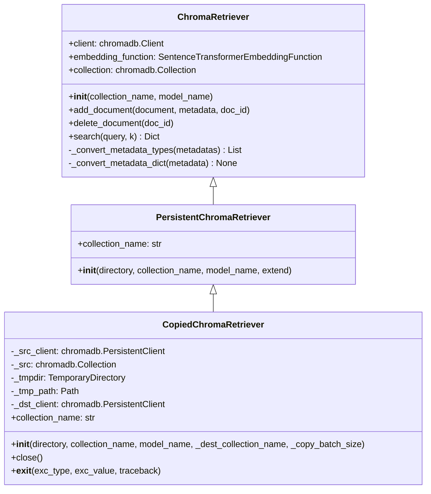
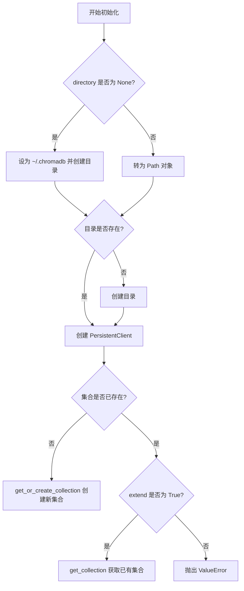
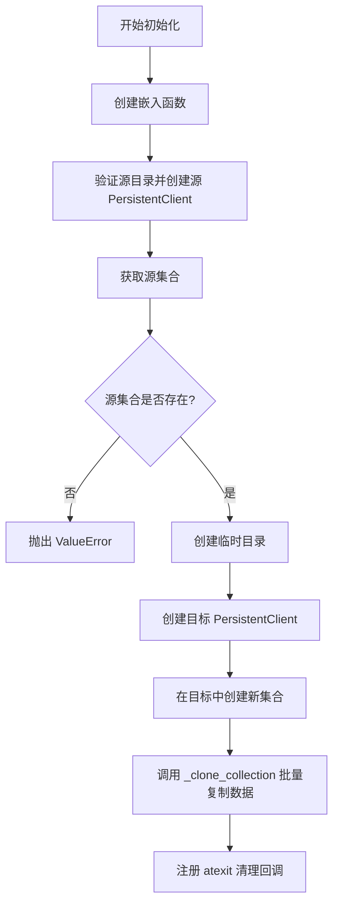
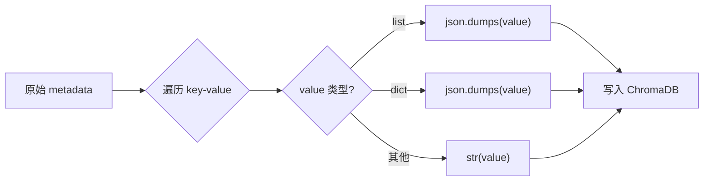
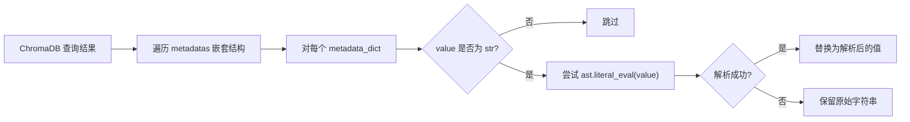
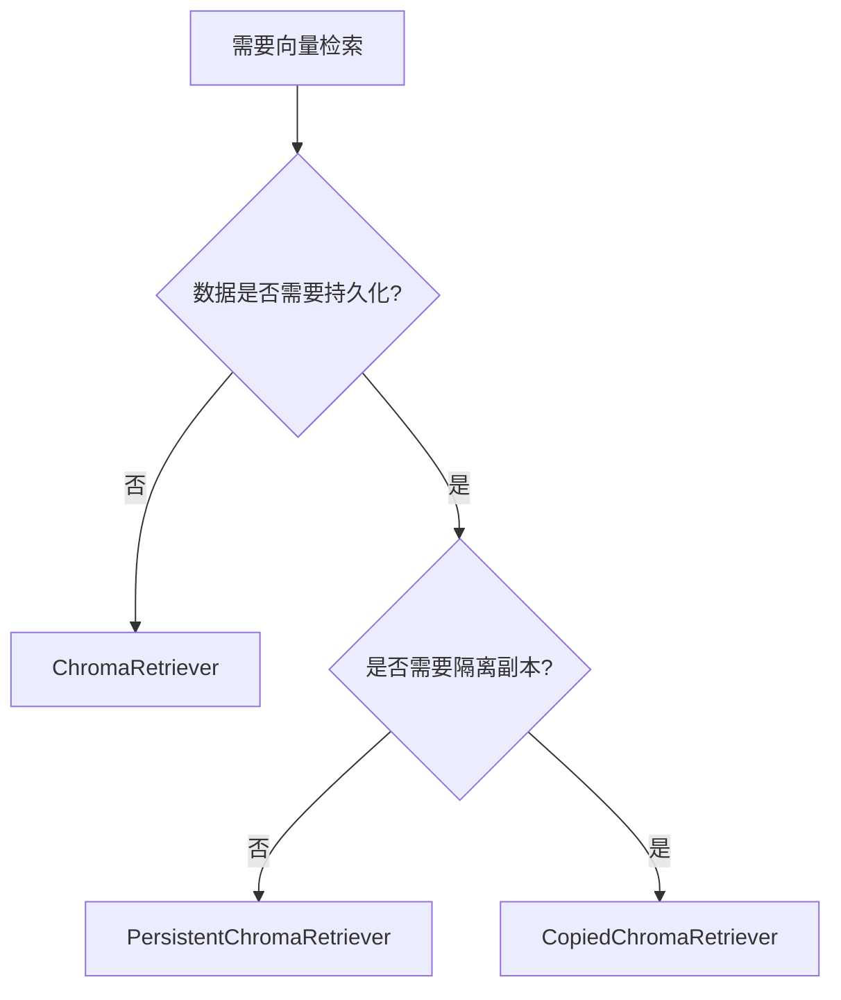
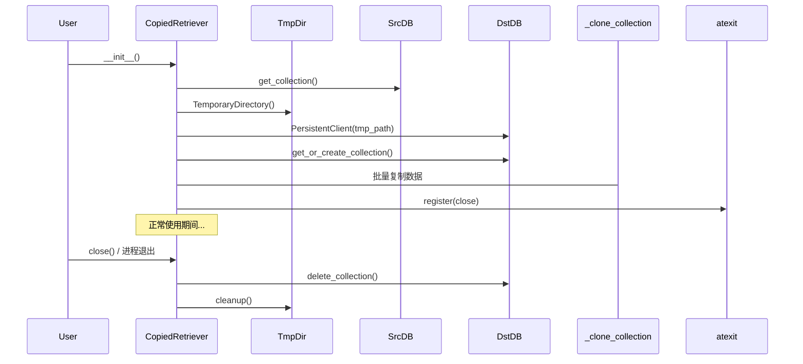
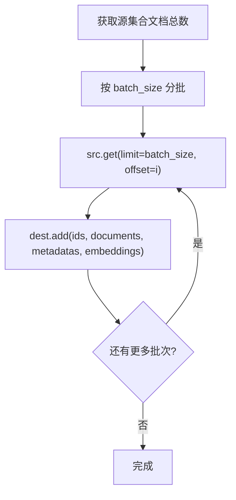

# retrievers.py 模块深度分析

## 1. 模块职责概述

`agentic_memory/retrievers.py` 是 A-mem 项目的**向量检索核心模块**，负责基于 ChromaDB 实现记忆的向量存储、检索与管理。该模块为记忆系统（`MemorySystem`）提供向量数据库的增删查能力，支撑语义搜索和相似度检索。

模块的核心设计思路是：通过类继承体系，从最基础的内存型检索器逐步扩展出持久化检索器和副本检索器，以覆盖单会话、跨会话共享、隔离副本三种使用场景。

**主要依赖：**
- `chromadb`：向量数据库引擎
- `SentenceTransformerEmbeddingFunction`：基于 SentenceTransformer 的嵌入函数
- `nltk.tokenize.word_tokenize`：文本分词
- `ast.literal_eval`：安全的 Python 字面量求值
- `tempfile` / `atexit`：临时目录与退出清理

---

## 2. 类继承体系分析



**继承逻辑说明：**

| 层级 | 类名 | 核心变化 |
|------|------|---------|
| L0 | `ChromaRetriever` | 使用内存型 `chromadb.Client`，数据不持久化 |
| L1 | `PersistentChromaRetriever` | 改用 `chromadb.PersistentClient`，数据落盘，增加 `extend` 机制 |
| L2 | `CopiedChromaRetriever` | 从源持久化集合复制到临时目录中的新集合，实现隔离副本 |

每一层仅**覆写 `__init__`**，所有业务方法（`add_document`、`delete_document`、`search`、元数据转换）均继承自 `ChromaRetriever`。

---

## 3. 每个类的详细分析

### 3.1 ChromaRetriever

**职责：** 基础向量检索器，使用内存型 ChromaDB 客户端，适用于单会话场景。

#### 属性

| 属性 | 类型 | 说明 |
|------|------|------|
| `client` | `chromadb.Client` | 内存型 ChromaDB 客户端，启用 `allow_reset=True` |
| `embedding_function` | `SentenceTransformerEmbeddingFunction` | 嵌入函数，默认模型 `all-MiniLM-L6-v2` |
| `collection` | `chromadb.Collection` | 当前操作的集合 |

#### 初始化参数

| 参数 | 类型 | 默认值 | 说明 |
|------|------|--------|------|
| `collection_name` | `str` | `"memories"` | 集合名称 |
| `model_name` | `str` | `"all-MiniLM-L6-v2"` | SentenceTransformer 模型名 |

#### 方法

| 方法 | 签名 | 说明 |
|------|------|------|
| `add_document` | `(document: str, metadata: Dict, doc_id: str) -> None` | 添加文档，自动序列化元数据中的 list/dict 类型 |
| `delete_document` | `(doc_id: str) -> None` | 按 ID 删除文档 |
| `search` | `(query: str, k: int = 5) -> Dict` | 语义搜索，返回 top-k 结果，自动反序列化元数据 |
| `_convert_metadata_types` | `(metadatas: List[List[Dict]]) -> List[List[Dict]]` | 批量转换元数据类型（遍历嵌套结构） |
| `_convert_metadata_dict` | `(metadata: Dict) -> None` | 原地转换单个元数据字典中的字符串值 |

---

### 3.2 PersistentChromaRetriever

**职责：** 持久化检索器，数据存储到磁盘，支持跨会话共享。

#### 额外属性

| 属性 | 类型 | 说明 |
|------|------|------|
| `collection_name` | `str` | 保存集合名称（父类未显式保存） |

#### 初始化参数

| 参数 | 类型 | 默认值 | 说明 |
|------|------|--------|------|
| `directory` | `Optional[str]` | `None` | 持久化目录，默认 `~/.chromadb` |
| `collection_name` | `str` | `"memories"` | 集合名称 |
| `model_name` | `str` | `"all-MiniLM-L6-v2"` | 嵌入模型名 |
| `extend` | `bool` | `False` | 是否允许扩展已有集合 |

#### 初始化流程



---

### 3.3 CopiedChromaRetriever

**职责：** 从已有持久化集合创建隔离副本，副本存储在临时目录中，进程退出时自动清理。

#### 额外属性

| 属性 | 类型 | 说明 |
|------|------|------|
| `_src_client` | `chromadb.PersistentClient` | 源持久化客户端 |
| `_src` | `chromadb.Collection` | 源集合引用 |
| `_tmpdir` | `tempfile.TemporaryDirectory` | 临时目录对象 |
| `_tmp_path` | `Path` | 临时目录路径 |
| `_dst_client` | `chromadb.PersistentClient` | 目标持久化客户端 |
| `collection_name` | `str` | 目标集合名称 |

#### 初始化参数

| 参数 | 类型 | 默认值 | 说明 |
|------|------|--------|------|
| `directory` | `Optional[str]` | `None` | 源 ChromaDB 目录 |
| `collection_name` | `str` | `"memories"` | 源集合名称 |
| `model_name` | `str` | `"all-MiniLM-L6-v2"` | 嵌入模型名 |
| `_dest_collection_name` | `Optional[str]` | `None` | 目标集合名，默认 `{collection_name}__clone` |
| `_copy_batch_size` | `int` | `10` | 批量复制大小 |

#### 初始化流程



#### 方法

| 方法 | 签名 | 说明 |
|------|------|------|
| `close` | `() -> None` | 删除目标集合并清理临时目录 |
| `__exit__` | `(exc_type, exc_value, traceback)` | 支持上下文管理器协议 |

---

## 4. 元数据序列化/反序列化机制

ChromaDB 的元数据系统**仅支持 `str`、`int`、`float`、`bool` 四种基本类型**，不支持 `list` 和 `dict`。因此模块实现了完整的序列化/反序列化流程。

### 4.1 序列化（写入时）：`add_document`



**序列化规则：**

| 原始类型 | 转换方式 | 示例 |
|---------|---------|------|
| `list` | `json.dumps()` | `["a","b"]` → `'["a", "b"]'` |
| `dict` | `json.dumps()` | `{"k":1}` → `'{"k": 1}'` |
| `int` | `str()` | `42` → `'42'` |
| `float` | `str()` | `3.14` → `'3.14'` |
| `bool` | `str()` | `True` → `'True'` |
| `str` | `str()`（原样） | `"hello"` → `'hello'` |

### 4.2 反序列化（读取时）：`_convert_metadata_types` / `_convert_metadata_dict`



**反序列化逻辑：** 对所有字符串类型的元数据值尝试 `ast.literal_eval()`，成功则替换为解析后的 Python 对象，失败则保留原字符串。

**关键问题：** `ast.literal_eval` 与 `json.dumps` 并非完全对称。详见第 9 节。

---

## 5. 三种检索器适用场景对比

| 维度 | ChromaRetriever | PersistentChromaRetriever | CopiedChromaRetriever |
|------|----------------|--------------------------|----------------------|
| **存储位置** | 内存 | 磁盘（指定目录） | 临时目录 |
| **持久性** | 进程结束即丢失 | 跨会话持久化 | 进程结束自动清理 |
| **数据来源** | 从空集合开始 | 从空集合或已有集合开始 | 从已有集合复制 |
| **多 Agent 共享** | 不支持 | 支持（共享同一目录） | 不支持（隔离副本） |
| **数据安全** | 无风险 | 需注意 extend 参数 | 副本操作不影响源 |
| **典型场景** | 单 Agent 单会话实验 | 多 Agent 协作共享记忆 | Agent 独立启动时的记忆快照 |
| **资源开销** | 最低 | 中等 | 最高（需完整复制） |
| **初始化速度** | 快 | 快 | 慢（需批量复制数据） |

**选择建议：**



---

## 6. PersistentChromaRetriever 的 extend 机制分析

`extend` 参数控制当目标集合已存在时的行为：

| `extend` 值 | 集合已存在时行为 | 集合不存在时行为 |
|-------------|----------------|----------------|
| `False`（默认） | 抛出 `ValueError` | 创建新集合 |
| `True` | 获取已有集合（`get_collection`） | 创建新集合 |

**设计意图：** 防止意外覆盖已有集合中的数据。当 `extend=False` 时，如果集合已存在，说明可能有其他 Agent 正在使用该集合，直接操作可能导致数据冲突。

**注意事项：**

1. **`extend=True` 时 `embedding_function` 不一致问题：** 当使用 `get_collection` 获取已有集合时，不会传入 `embedding_function` 参数。这意味着如果新实例使用了不同的嵌入模型，查询时可能产生不一致的结果，但 ChromaDB 不会报错。
2. **并发安全：** ChromaDB 的 `PersistentClient` 不支持多进程并发写入，多个 Agent 同时 `extend` 同一集合可能导致数据损坏。

---

## 7. CopiedChromaRetriever 的集合复制机制和临时目录管理

### 7.1 集合复制机制

CopiedChromaRetriever 不继承父类的 `__init__`，而是自行实现完整的初始化流程：

1. **连接源：** 创建源 `PersistentClient`，获取源集合引用
2. **验证源集合存在：** 若不存在则抛出 `ValueError`
3. **创建临时目标：** 使用 `tempfile.TemporaryDirectory` 创建临时目录
4. **创建目标集合：** 在临时目录中创建新集合，复制源集合的 `metadata`
5. **批量复制数据：** 调用 `_clone_collection` 逐批复制文档、元数据和嵌入向量
6. **注册清理：** 通过 `atexit.register` 确保进程退出时清理临时资源

### 7.2 临时目录管理



**清理机制双重保障：**
- `atexit.register(self.close)`：进程正常退出时自动清理
- `__exit__` 方法：支持 `with` 语句上下文管理器协议

**但缺少 `__enter__` 方法**，因此 `with` 语句实际上无法正常使用。详见第 9 节。

---

## 8. `_clone_collection` 辅助函数分析

```python
def _clone_collection(
    src: chromadb.Collection,
    dest: chromadb.Collection,
    batch_size: int = 10
):
```

**功能：** 将源集合的所有数据（文档、元数据、嵌入向量）逐批复制到目标集合。

**实现逻辑：**



**关键细节：**

| 方面 | 说明 |
|------|------|
| **获取内容** | `include=["metadatas", "documents", "embeddings"]`，包含嵌入向量以避免目标端重新计算 |
| **默认批次大小** | `batch_size=10`，偏保守 |
| **不复制的内容** | 未包含 `uris` 和 `data` 字段 |
| **错误处理** | 无，异常直接上抛 |

---

## 9. 潜在问题与改进建议

### 9.1 元数据类型安全问题（高优先级）

**问题：** 序列化使用 `json.dumps()`，反序列化使用 `ast.literal_eval()`，两者并非完全对称。

| 场景 | 序列化结果 | `ast.literal_eval` 反序列化结果 | 正确？ |
|------|-----------|-------------------------------|--------|
| `list`: `["a","b"]` | `'["a", "b"]'` | `["a", "b"]` | ✅ |
| `dict`: `{"k":1}` | `'{"k": 1}'` | `{"k": 1}` | ✅ |
| `int`: `42` | `'42'` | `42` | ✅ |
| `float`: `3.14` | `'3.14'` | `3.14` | ✅ |
| `bool`: `True` | `'True'` | `True` | ✅ |
| `bool`: `False` | `'False'` | `False` | ✅（但 `False` 不是 Python 关键字的 literal） |
| `str`: `"hello"` | `'hello'` | 尝试解析失败，保留 `'hello'` | ✅ |
| `str`: `"[1,2]"` | `'"[1,2]"'` → `'"[1,2]"'` | `[1,2]`（被误解析为列表） | ❌ |
| `str`: `"123"` | `'"123"'` → `'123'` | `123`（被误解析为整数） | ❌ |
| `str`: `"True"` | `'"True"'` → `'True'` | `True`（被误解析为布尔值） | ❌ |

**核心问题：** `ast.literal_eval` 无法区分"原始就是字符串 `123`"和"原始是整数 `123` 被序列化为字符串 `'123'`"。任何看起来像 Python 字面量的字符串都会被错误转换。

**改进建议：**
1. 在序列化时为非基本类型添加类型标记前缀，如 `__json__:{"k":1}`
2. 反序列化时只对带有标记前缀的值使用 `json.loads()`，其余保持原样
3. 或者统一使用 `json.dumps()` / `json.loads()` 配对，并存储原始类型信息

### 9.2 批量操作性能问题（中优先级）

**问题：**
1. `add_document` 每次只添加**单条文档**，在 `consolidate_memories` 中需要循环调用，无法利用 ChromaDB 的批量插入能力
2. `_clone_collection` 的默认 `batch_size=10` 过小，对于大规模集合复制效率低
3. `_clone_collection` 使用 `offset` 分页，ChromaDB 的 `offset` 在大数据量时性能会退化

**改进建议：**
1. 增加 `add_documents`（复数）批量方法
2. 增大默认 `batch_size` 或使用游标式分页
3. 考虑使用 ChromaDB 的导出/导入功能（如果未来 API 支持）

### 9.3 资源清理不完整（中优先级）

**问题：**
1. `CopiedChromaRetriever` 定义了 `__exit__` 但**未定义 `__enter__`**，因此无法作为上下文管理器使用
2. `atexit` 注册的 `close()` 方法在异常退出时可能不被调用（如 `os._exit()` 或 SIGKILL）
3. 如果进程崩溃，临时目录不会被清理，造成磁盘空间泄漏

**改进建议：**
1. 添加 `__enter__` 方法：`def __enter__(self): return self`
2. 在 `close()` 中增加幂等性保护，避免重复清理
3. 考虑使用 `tempfile.mkdtemp()` 配合手动清理，或在临时目录名中包含时间戳以便后续清理脚本识别

### 9.4 CopiedChromaRetriever 继承设计问题（低优先级）

**问题：** `CopiedChromaRetriever` 继承自 `PersistentChromaRetriever` 但完全覆写了 `__init__`，没有调用 `super().__init__()`。这意味着：
- 父类的初始化逻辑被完全绕过
- 继承关系仅用于获取 `add_document`、`delete_document`、`search` 等方法
- 如果未来 `PersistentChromaRetriever` 增加新属性或逻辑，`CopiedChromaRetriever` 不会自动获得

**改进建议：**
1. 考虑将 `CopiedChromaRetriever` 改为继承自 `ChromaRetriever` 而非 `PersistentChromaRetriever`，因为它不使用父类的持久化初始化逻辑
2. 或者通过组合模式替代继承，将公共方法提取为 mixin

### 9.5 嵌入函数一致性问题（低优先级）

**问题：** `PersistentChromaRetriever` 在 `extend=True` 时使用 `get_collection()` 获取已有集合，但未传入 `embedding_function`。ChromaDB 的 `get_collection` 不会验证嵌入函数是否与原集合一致，可能导致查询时使用不同的嵌入空间。

**改进建议：**
1. 在 `get_collection` 时也传入 `embedding_function`
2. 或在文档中明确说明 `extend=True` 时必须使用与原集合相同的 `model_name`

### 9.6 缺少 `__enter__` 方法（低优先级）

**问题：** `CopiedChromaRetriever` 实现了 `__exit__` 但缺少 `__enter__`，导致无法使用 `with` 语句：

```python
# 当前无法使用：
with CopiedChromaRetriever(...) as retriever:
    retriever.search("query")
```

**改进建议：** 添加 `__enter__` 方法：

```python
def __enter__(self):
    return self
```

### 9.7 `_clone_collection` 缺少进度反馈（低优先级）

**问题：** 大集合复制时无进度指示，可能长时间无响应。

**改进建议：** 添加可选的 `callback` 参数或日志输出。

---

## 附录：数据流总览

```mermaid
flowchart TB
    subgraph 写入流程
        A1[MemoryNote 对象] --> A2[提取 metadata dict]
        A2 --> A3["add_document()"]
        A3 --> A4{metadata 值类型判断}
        A4 -- list/dict --> A5["json.dumps()"]
        A4 -- 其他 --> A6["str()"]
        A5 --> A7["collection.add()"]
        A6 --> A7
    end

    subgraph 查询流程
        B1["search(query, k)"] --> B2["collection.query()"]
        B2 --> B3[ChromaDB 返回原始结果]
        B3 --> B4["_convert_metadata_types()"]
        B4 --> B5["遍历 metadatas 嵌套结构"]
        B5 --> B6["_convert_metadata_dict()"]
        B6 --> B7{"ast.literal_eval()"}
        B7 -- 成功 --> B8[替换为解析值]
        B7 -- 失败 --> B9[保留原字符串]
        B8 --> B10[返回转换后结果]
        B9 --> B10
    end

    subgraph 复制流程
        C1[CopiedChromaRetriever.__init__] --> C2[连接源集合]
        C2 --> C3[创建临时目标集合]
        C3 --> C4["_clone_collection()"]
        C4 --> C5["逐批 src.get() → dest.add()"]
        C5 --> C6[注册 atexit 清理]
    end
```


