# A-MEM (AgenticMemory) 架构设计文档

## 1. 系统架构总览

A-MEM 是一个基于 LLM 的智能记忆管理系统，核心思想是将记忆视为可进化的实体——新记忆加入时，系统自动检索相关记忆、通过 LLM 决策进化策略，并执行记忆间的连接增强与邻居更新。项目采用双层架构：标准层依赖 JSON Schema 约束 LLM 输出，鲁棒层使用纯文本 prompt + section-marker 解析，兼容更多 LLM 后端。

### 1.1 系统架构图

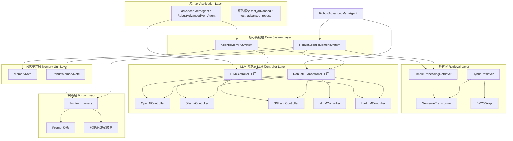

### 1.2 数据流总览

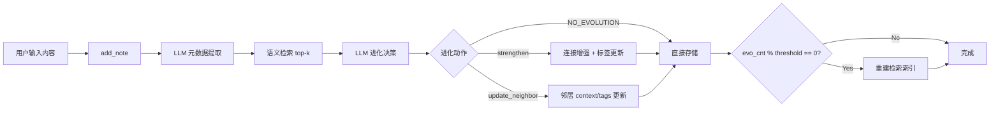

---

## 2. 模块划分与职责

### 2.1 模块依赖关系图

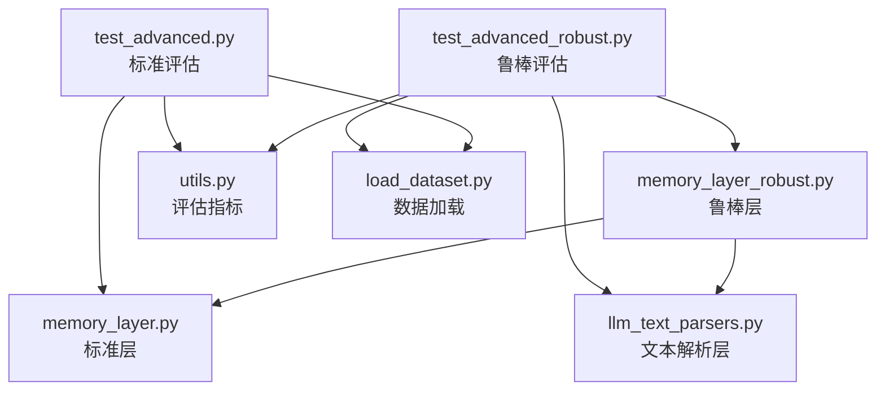

### 2.2 各模块职责

| 模块 | 文件 | 职责 |
|------|------|------|
| **标准层** | `memory_layer.py` | 完整的记忆管理系统，依赖 JSON Schema 约束 LLM 输出。包含 LLM 控制器族、MemoryNote、检索器、AgenticMemorySystem |
| **鲁棒层** | `memory_layer_robust.py` | 标准层的鲁棒替代，使用纯文本 prompt + section-marker 解析，无 JSON Schema 依赖。支持 vLLM 后端，增加重试机制和优雅降级 |
| **文本解析层** | `llm_text_parsers.py` | 鲁棒层的 prompt 模板和解析器。定义 5 个 prompt 模板、4 个解析函数、验证/启发式修复逻辑 |
| **标准评估** | `test_advanced.py` | 基于 LoComo 数据集的标准层评估框架，包含 advancedMemAgent |
| **鲁棒评估** | `test_advanced_robust.py` | 鲁棒层评估框架，包含 RobustAdvancedMemAgent |
| **评估指标** | `utils.py` | ROUGE、BLEU、BERTScore、METEOR、SBERT 相似度等评估指标计算 |
| **数据加载** | `load_dataset.py` | LoComo 数据集加载，定义 QA、Turn、Session、Conversation 数据结构 |

---

## 3. 核心流程设计

### 3.1 记忆添加与进化流程（标准版）

```mermaid
sequenceDiagram
    participant User
    participant System as AgenticMemorySystem
    participant Note as MemoryNote
    participant LLM as LLMController
    participant Retriever as SimpleEmbeddingRetriever

    User->>System: add_note(content)
    System->>Note: 创建 MemoryNote(content, llm_controller)
    Note->>LLM: analyze_content(prompt + JSON Schema)
    LLM-->>Note: {keywords, context, tags}
    Note-->>System: 返回完整 Note

    System->>Retriever: search(note.content, k=5)
    Retriever-->>System: top-k indices + memory_str

    System->>LLM: process_memory(evolution_prompt + JSON Schema)
    Note over LLM: 单次调用决定所有进化策略
    LLM-->>System: {should_evolve, actions, connections, tags, neighborhoods}

    alt should_evolve == true
        alt actions 包含 "strengthen"
            System->>System: note.links.extend(connections)
            System->>System: note.tags = new_tags
        end
        alt actions 包含 "update_neighbor"
            System->>System: 更新邻居的 context 和 tags
        end
    end

    System->>System: memories[note.id] = note
    System->>Retriever: add_documents(组合文档)
    System->>System: evo_cnt++, 检查是否触发 consolidate
```

### 3.2 记忆添加与进化流程（鲁棒版）

```mermaid
sequenceDiagram
    participant User
    participant System as RobustAgenticMemorySystem
    participant Note as RobustMemoryNote
    participant LLM as RobustLLMController
    participant Retriever as SimpleEmbeddingRetriever
    participant Parser as llm_text_parsers

    User->>System: add_note(content)
    System->>Note: 创建 RobustMemoryNote(content, llm_controller)
    Note->>LLM: get_completion(ANALYZE_CONTENT_PROMPT)
    LLM-->>Parser: 纯文本响应
    Parser->>Parser: parse_analyze_content (JSON fallback + section-marker)
    Parser-->>Note: {keywords, context, tags}
    Note-->>System: 返回完整 Note

    System->>Retriever: search(note.content, k=5)
    Retriever-->>System: top-k indices + memory_str

    alt 无相关记忆 (indices 为空)
        System-->>System: 直接存储，不进化
    else 有相关记忆
        rect rgb(230, 245, 255)
            Note over System,LLM: Call 1: 进化决策
            System->>LLM: get_completion(EVOLUTION_DECISION_PROMPT)
            LLM-->>Parser: 纯文本响应
            Parser->>Parser: parse_evolution_decision
            Parser-->>System: {decision, reason}
        end

        alt decision == NO_EVOLUTION
            System-->>System: 直接存储
        else decision 包含 STRENGTHEN
            rect rgb(255, 245, 230)
                Note over System,LLM: Call 2: 加强细节
                System->>LLM: get_completion(STRENGTHEN_DETAILS_PROMPT)
                LLM-->>Parser: 纯文本响应
                Parser->>Parser: parse_strengthen_details
                Parser-->>System: {connections, tags}
                System->>System: note.links.extend(connections)
                System->>System: note.tags = tags
            end
        else decision 包含 UPDATE_NEIGHBOR
            rect rgb(230, 255, 230)
                Note over System,LLM: Call 3: 更新邻居
                System->>LLM: get_completion(UPDATE_NEIGHBORS_PROMPT)
                LLM-->>Parser: 纯文本响应
                Parser->>Parser: parse_update_neighbors
                Parser-->>System: [{context, tags}, ...]
                System->>System: 更新每个邻居的 context 和 tags
            end
        end
    end

    System->>System: memories[note.id] = note
    System->>Retriever: add_documents(组合文档)
    System->>System: evo_cnt++, 检查是否触发 consolidate
```

### 3.3 问答评估流程

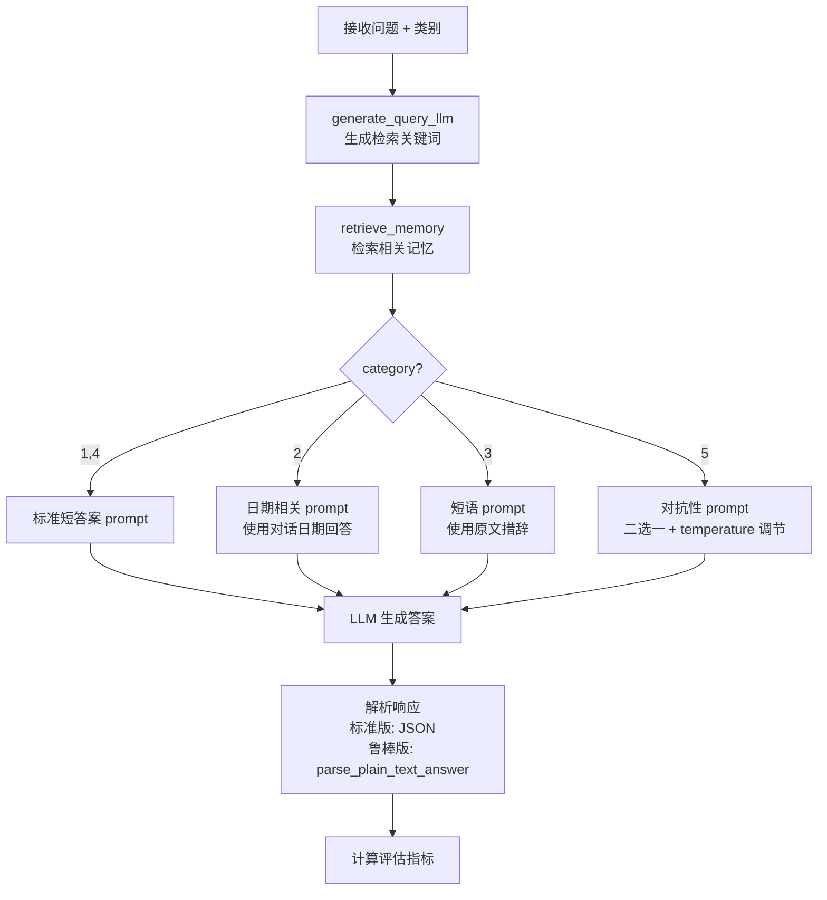

### 3.4 记忆整合流程

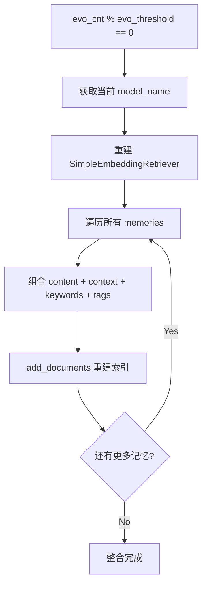

---

## 4. 数据模型设计

### 4.1 核心类图

```mermaid
classDiagram
    class BaseLLMController {
        <<abstract>>
        +get_completion(prompt, response_format, temperature) str
    }

    class OpenAIController {
        -model: str
        -client: OpenAI
        +get_completion(prompt, response_format, temperature) str
    }

    class OllamaController {
        -model: str
        +get_completion(prompt, response_format, temperature) str
        -_generate_empty_value(schema_type) Any
        -_generate_empty_response(response_format) dict
    }

    class SGLangController {
        -model: str
        -base_url: str
        +get_completion(prompt, response_format, temperature) str
        -_generate_empty_value(schema_type) Any
        -_generate_empty_response(response_format) dict
    }

    class LiteLLMController {
        -model: str
        -api_base: str
        -api_key: str
        +get_completion(prompt, response_format, temperature) str
        -_generate_empty_value(schema_type) Any
        -_generate_empty_response(response_format) dict
    }

    class LLMController {
        -llm: BaseLLMController
        +__init__(backend, model, api_key, api_base, sglang_host, sglang_port)
    }

    BaseLLMController <|-- OpenAIController
    BaseLLMController <|-- OllamaController
    BaseLLMController <|-- SGLangController
    BaseLLMController <|-- LiteLLMController
    LLMController --> BaseLLMController : creates

    class RobustBaseLLMController {
        <<abstract>>
        +SYSTEM_MESSAGE: str
        +get_completion(prompt, temperature) str
        +check_connectivity()
    }

    class RobustOpenAIController {
        -model: str
        -client: OpenAI
        +get_completion(prompt, temperature) str
    }

    class RobustOllamaController {
        -model: str
        +get_completion(prompt, temperature) str
    }

    class RobustSGLangController {
        -model: str
        -base_url: str
        +get_completion(prompt, temperature) str
    }

    class RobustVLLMController {
        -model: str
        -base_url: str
        +get_completion(prompt, temperature) str
    }

    class RobustLiteLLMController {
        -model: str
        -api_base: str
        -api_key: str
        +get_completion(prompt, temperature) str
    }

    class RobustLLMController {
        -llm: RobustBaseLLMController
        +__init__(backend, model, api_key, api_base, sglang_host, sglang_port, check_connection)
    }

    RobustBaseLLMController <|-- RobustOpenAIController
    RobustBaseLLMController <|-- RobustOllamaController
    RobustBaseLLMController <|-- RobustSGLangController
    RobustBaseLLMController <|-- RobustVLLMController
    RobustBaseLLMController <|-- RobustLiteLLMController
    RobustLLMController --> RobustBaseLLMController : creates
```

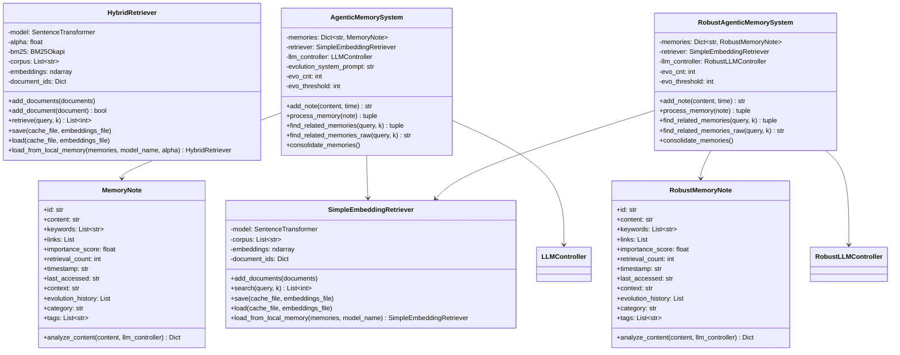

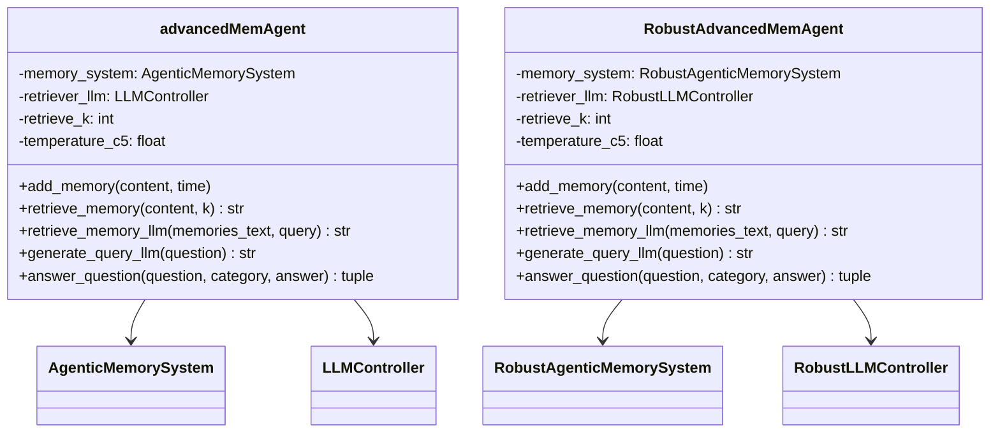

### 4.2 MemoryNote 数据模型

| 属性 | 类型 | 默认值 | 说明 |
|------|------|--------|------|
| `id` | `str` | `uuid.uuid4()` | 唯一标识符 |
| `content` | `str` | 必填 | 记忆原始内容 |
| `keywords` | `List[str]` | `[]` | LLM 提取的关键词 |
| `links` | `List` | `[]` | 连接的邻居记忆索引 |
| `importance_score` | `float` | `1.0` | 重要性评分 |
| `retrieval_count` | `int` | `0` | 被检索次数 |
| `timestamp` | `str` | 当前时间 | 创建时间（格式 `%Y%m%d%H%M`） |
| `last_accessed` | `str` | 当前时间 | 最后访问时间 |
| `context` | `str` | `"General"` | LLM 提取的上下文摘要 |
| `evolution_history` | `List` | `[]` | 进化历史记录 |
| `category` | `str` | `"Uncategorized"` | 分类 |
| `tags` | `List[str]` | `[]` | LLM 提取的分类标签 |

### 4.3 检索索引文档结构

检索器索引的文档由记忆的多个字段拼接而成：

```
content:{content} context:{context} keywords: {keyword1}, {keyword2}, ... tags: {tag1}, {tag2}, ...
```

整合时使用更丰富的拼接：

```
{content} , {context} {keyword1} {keyword2} ... {tag1} {tag2} ...
```

### 4.4 持久化数据结构

| 文件 | 格式 | 内容 |
|------|------|------|
| `memory_cache_sample_{idx}.pkl` | Pickle | `Dict[str, MemoryNote]` 记忆字典 |
| `retriever_cache_sample_{idx}.pkl` | Pickle | `{alpha, bm25, corpus, document_ids, model_name}` |
| `retriever_cache_embeddings_sample_{idx}.npy` | NumPy | embeddings 矩阵 |

---

## 5. 设计模式说明

### 5.1 工厂模式（Factory Pattern）

LLMController 和 RobustLLMController 采用工厂模式，根据 `backend` 参数创建对应的控制器实例：

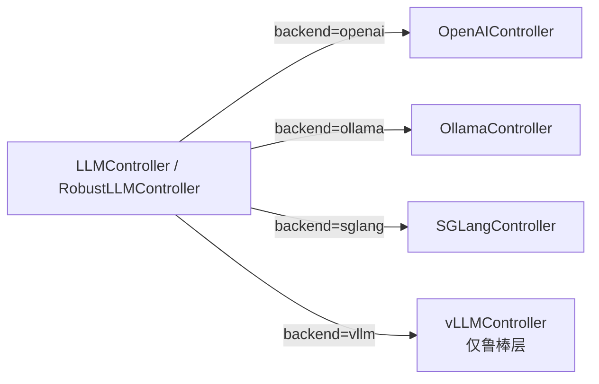

**优势**：调用方只需指定 backend 类型，无需关心具体实现细节，新增后端只需添加新的 Controller 类和工厂分支。

### 5.2 策略模式（Strategy Pattern）

检索器设计体现了策略模式：

- **SimpleEmbeddingRetriever**：纯语义检索策略
- **HybridRetriever**：BM25 + 语义混合检索策略（通过 `alpha` 参数调节权重）

```mermaid
flowchart TD
    subgraph "检索策略"
        S1[SimpleEmbeddingRetriever<br/>纯语义检索]
        S2[HybridRetriever<br/>混合检索<br/>alpha * BM25 + (1-alpha) * Semantic]
    end
```

### 5.3 模板方法模式（Template Method Pattern）

BaseLLMController / RobustBaseLLMController 定义了抽象接口 `get_completion`，各具体控制器实现各自的调用逻辑。标准版和鲁棒版的接口签名不同：

- 标准版：`get_completion(prompt, response_format, temperature)` — 需要 JSON Schema
- 鲁棒版：`get_completion(prompt, temperature)` — 纯文本输入输出

### 5.4 装饰器模式（Decorator Pattern）

鲁棒层使用 `retry_llm_call` 装饰器为所有 LLM 调用添加重试逻辑：

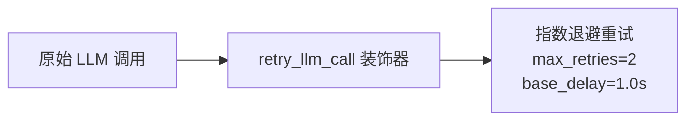

### 5.5 优雅降级模式（Graceful Degradation）

鲁棒层在多个层面实现降级：

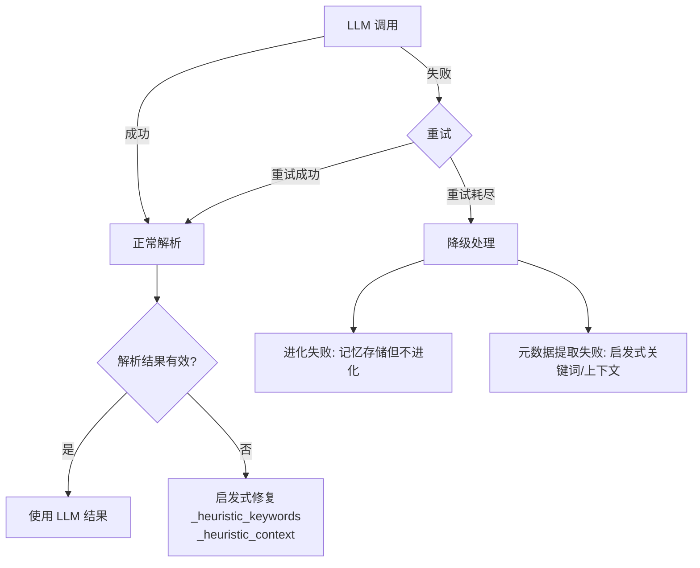

---

## 6. 标准层 vs 鲁棒层对比

### 6.1 架构对比图

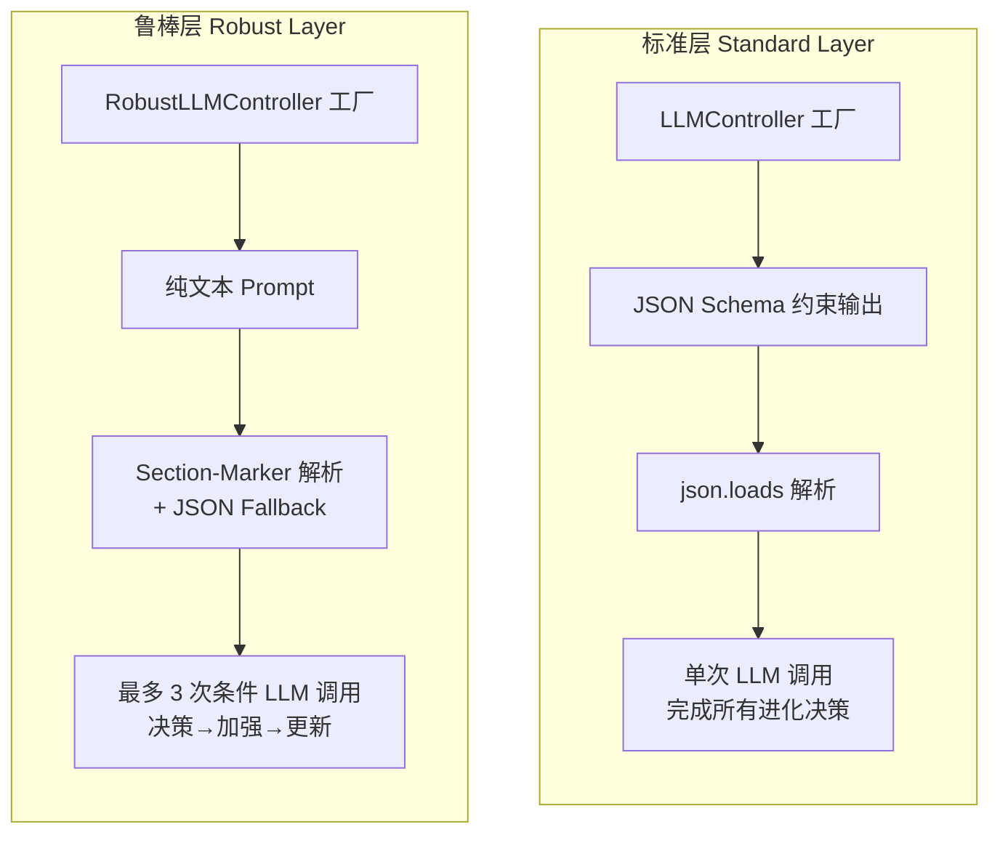

### 6.2 详细对比表

| 维度 | 标准层 | 鲁棒层 |
|------|--------|--------|
| **LLM 输出约束** | JSON Schema (`response_format`) | 纯文本 + section-marker |
| **LLM 调用签名** | `get_completion(prompt, response_format, temperature)` | `get_completion(prompt, temperature)` |
| **进化调用次数** | 1 次（单次调用决定所有策略） | 最多 3 次（条件调用） |
| **解析策略** | `json.loads` + 清洗 | JSON 优先 + section-marker 降级 |
| **支持后端** | openai, ollama, sglang | openai, ollama, sglang, **vllm** |
| **重试机制** | 无 | `retry_llm_call` 装饰器（指数退避） |
| **连接检查** | 无 | `check_connectivity()` |
| **降级策略** | 返回空默认值 | 启发式修复 + 记忆存储但不进化 |
| **日志系统** | `print()` | `logging` 结构化日志 |
| **关键词提取失败** | 返回空列表 | 启发式提取 + focused retry |
| **LLM 兼容性** | 需支持 JSON Schema/structured output | 任何能输出文本的 LLM |

### 6.3 进化流程对比

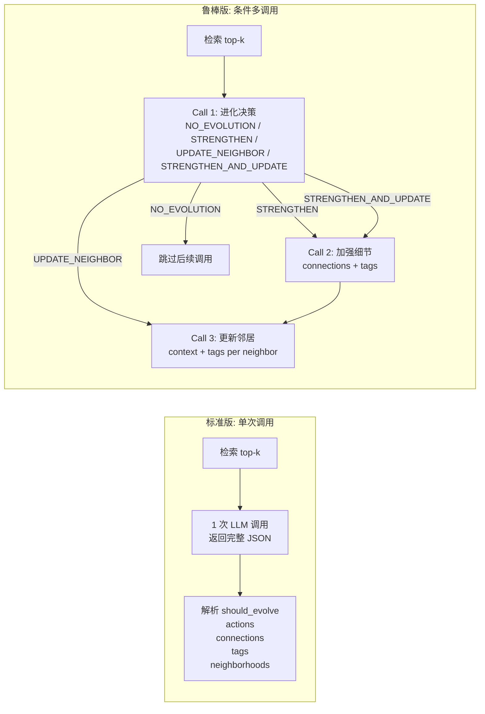

### 6.4 解析策略对比

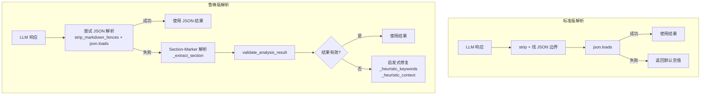

---

## 7. 扩展性设计

### 7.1 LLM 后端扩展

新增 LLM 后端只需：

1. 继承 `BaseLLMController`（标准层）或 `RobustBaseLLMController`（鲁棒层）
2. 实现 `get_completion` 方法
3. 在工厂类中添加分支

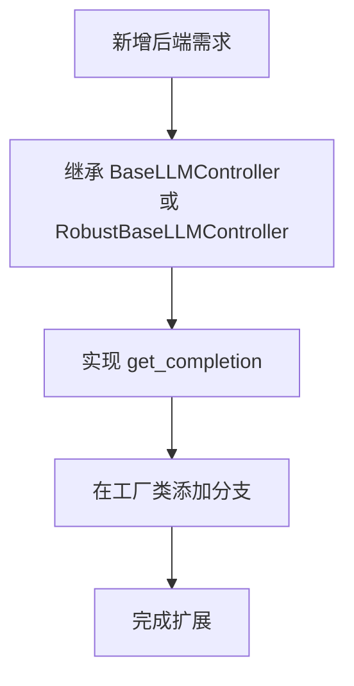

### 7.2 检索器扩展

系统已预留检索器替换能力：

- 当前使用 `SimpleEmbeddingRetriever`
- `HybridRetriever` 已实现但未在系统类中默认使用
- 可通过修改 `AgenticMemorySystem.__init__` 中的 retriever 切换

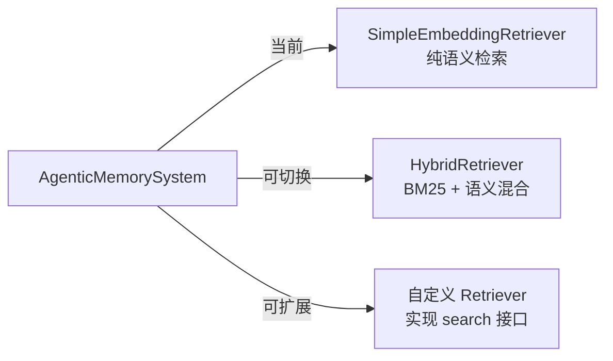

### 7.3 进化策略扩展

当前进化动作包括 `strengthen` 和 `update_neighbor`，可通过以下方式扩展：

1. 在进化决策 prompt 中增加新动作类型
2. 在 `process_memory` 中添加新动作的处理逻辑
3. 在 JSON Schema（标准版）或 section-marker（鲁棒版）中增加对应字段

### 7.4 Prompt 模板扩展

鲁棒层的 prompt 模板集中在 `llm_text_parsers.py` 中，以常量形式定义：

| 模板常量 | 用途 |
|----------|------|
| `ANALYZE_CONTENT_PROMPT` | 记忆元数据提取 |
| `EVOLUTION_DECISION_PROMPT` | 进化决策 |
| `STRENGTHEN_DETAILS_PROMPT` | 加强连接细节 |
| `UPDATE_NEIGHBORS_PROMPT` | 更新邻居信息 |
| `FOCUSED_KEYWORDS_PROMPT` | 关键词提取重试 |

新增 prompt 只需添加常量 + 对应解析函数，遵循 section-marker 格式约定。

### 7.5 评估框架扩展

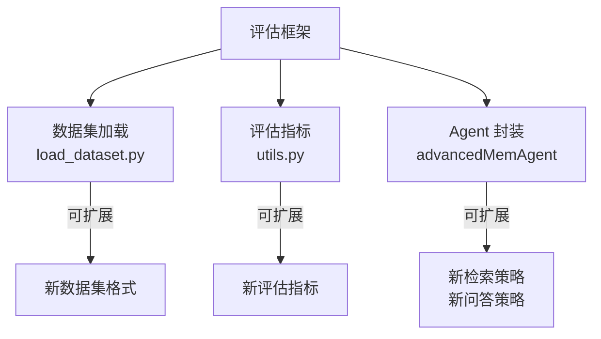

### 7.6 系统配置参数

| 参数 | 位置 | 默认值 | 说明 |
|------|------|--------|------|
| `model_name` | AgenticMemorySystem | `all-MiniLM-L6-v2` | 嵌入模型名称 |
| `llm_backend` | AgenticMemorySystem | `sglang` | LLM 后端类型 |
| `llm_model` | AgenticMemorySystem | `gpt-4o-mini` | LLM 模型名称 |
| `evo_threshold` | AgenticMemorySystem | `100` | 整合触发阈值 |
| `alpha` | HybridRetriever | `0.5` | BM25/语义权重 |
| `k` | find_related_memories | `5` | 检索 top-k 数量 |
| `max_retries` | retry_llm_call | `2` | LLM 调用重试次数 |
| `base_delay` | retry_llm_call | `1.0` | 重试基础延迟（秒） |
| `retrieve_k` | advancedMemAgent | `10` | 评估时检索数量 |
| `temperature_c5` | advancedMemAgent | `0.5` | 对抗性问题温度 |

---

## 附录：文件结构

```
AgenticMemory/
├── memory_layer.py              # 标准层：LLM 控制器、MemoryNote、检索器、记忆系统
├── memory_layer_robust.py       # 鲁棒层：鲁棒 LLM 控制器、RobustMemoryNote、鲁棒记忆系统
├── llm_text_parsers.py          # 纯文本 prompt 模板、section-marker 解析器、验证逻辑
├── test_advanced.py             # 标准层评估框架 + advancedMemAgent
├── test_advanced_robust.py      # 鲁棒层评估框架 + RobustAdvancedMemAgent
├── utils.py                     # 评估指标计算（ROUGE, BLEU, BERTScore, METEOR, SBERT）
├── load_dataset.py              # LoComo 数据集加载
├── data/
│   └── locomo10.json            # LoComo 评估数据集
├── Figure/                      # 论文图表
├── requirements.txt             # Python 依赖
└── run_all_experiments.sh       # 实验运行脚本
```
