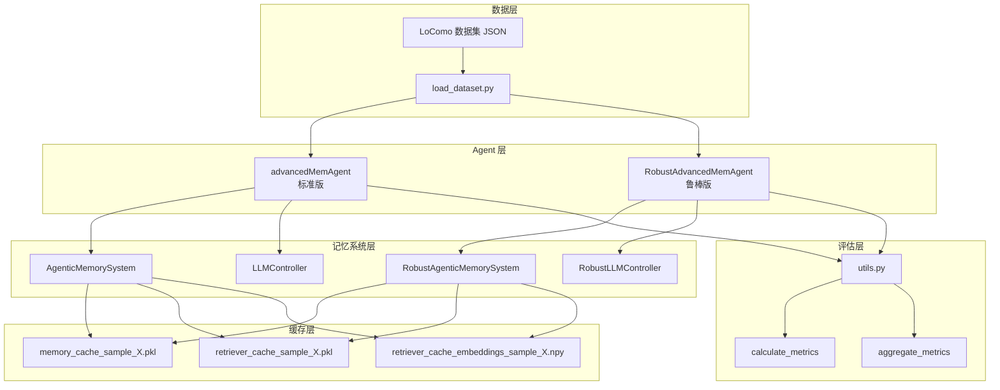
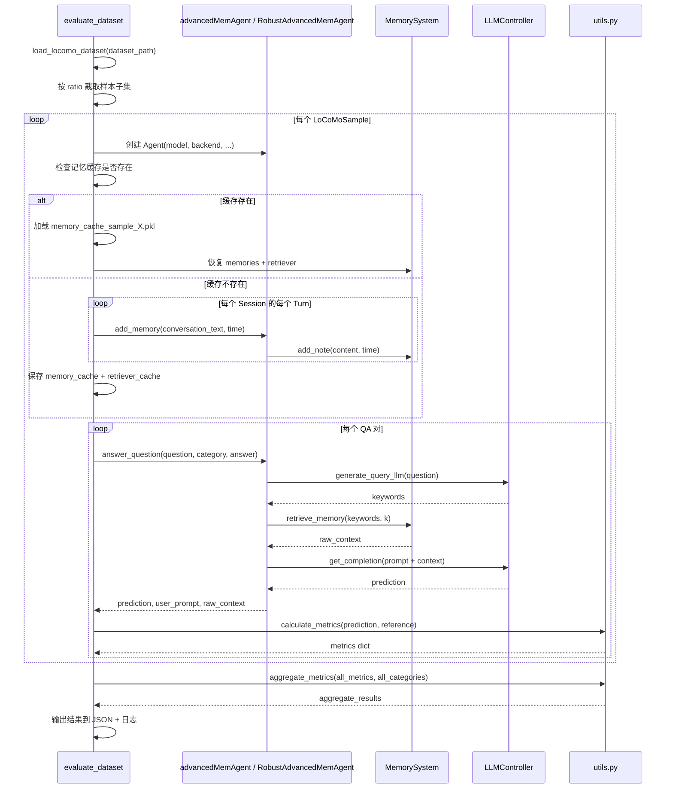
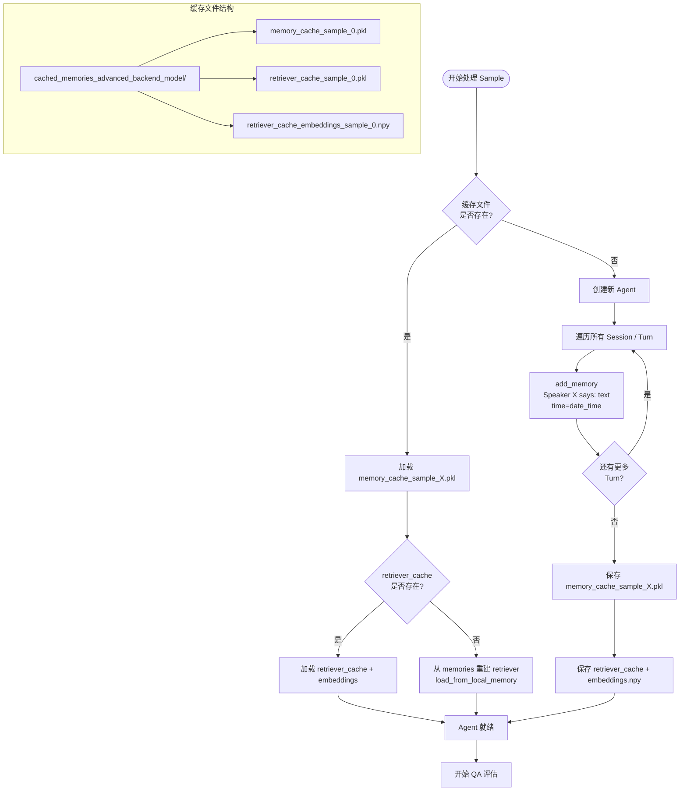
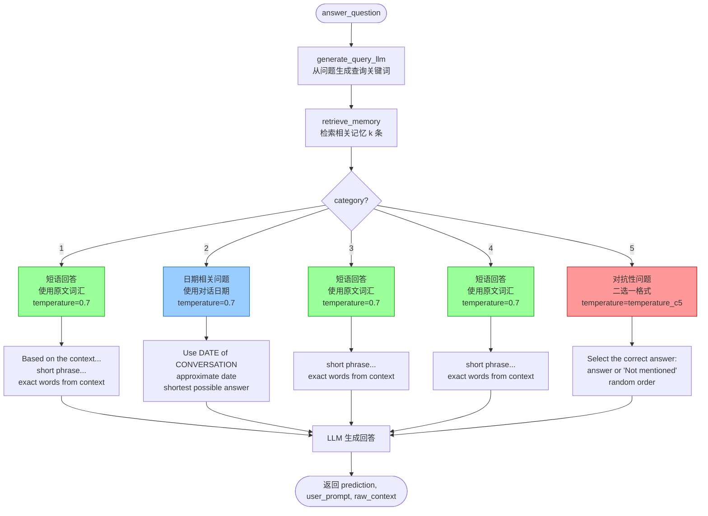
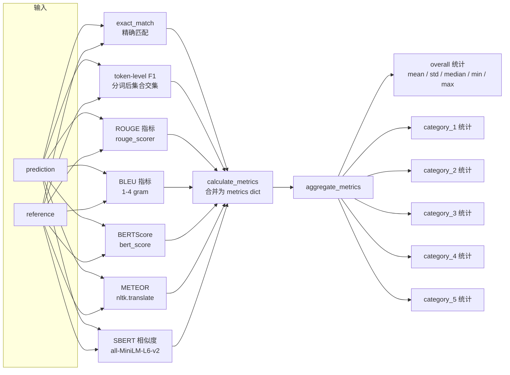
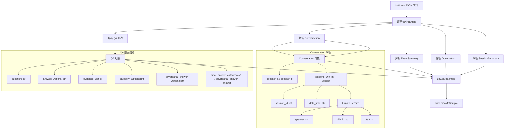
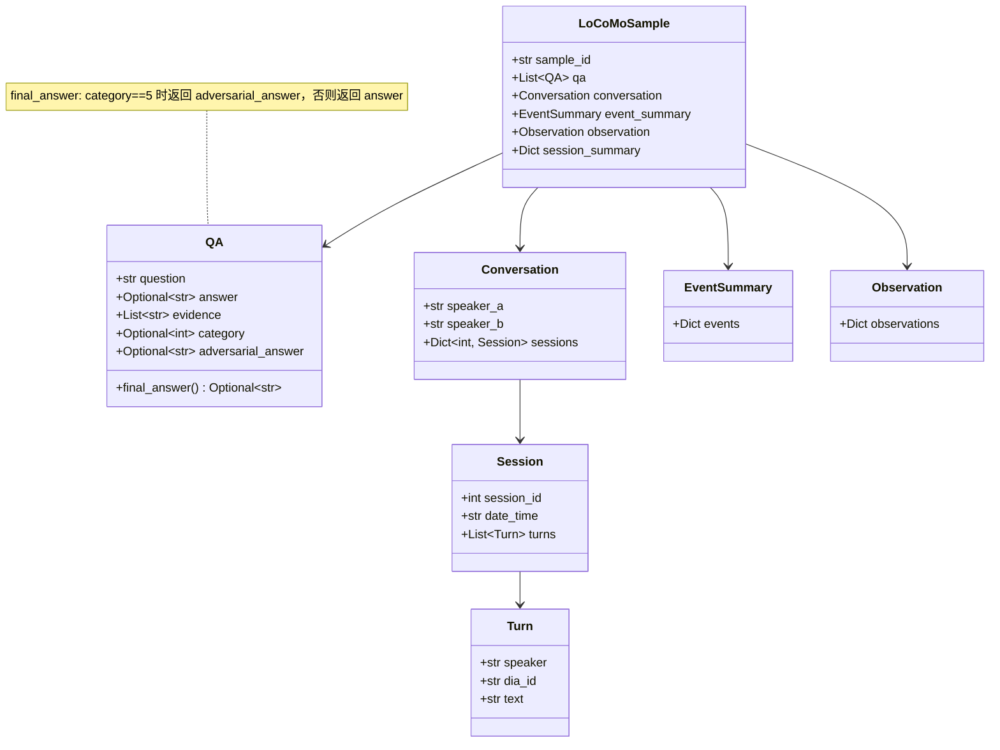
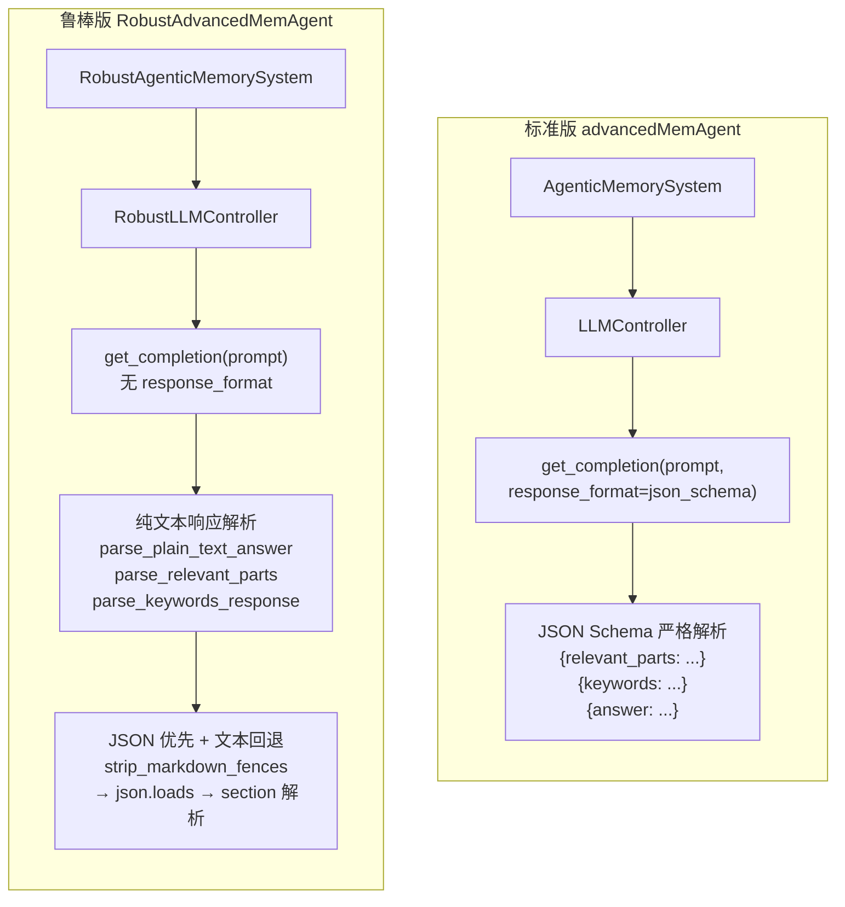
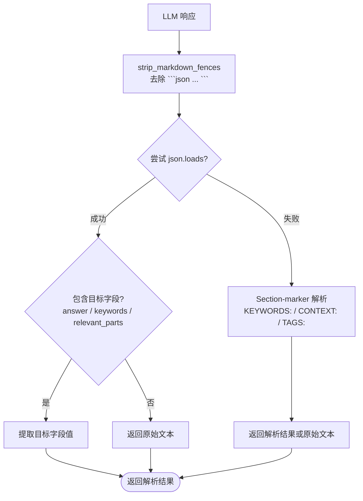
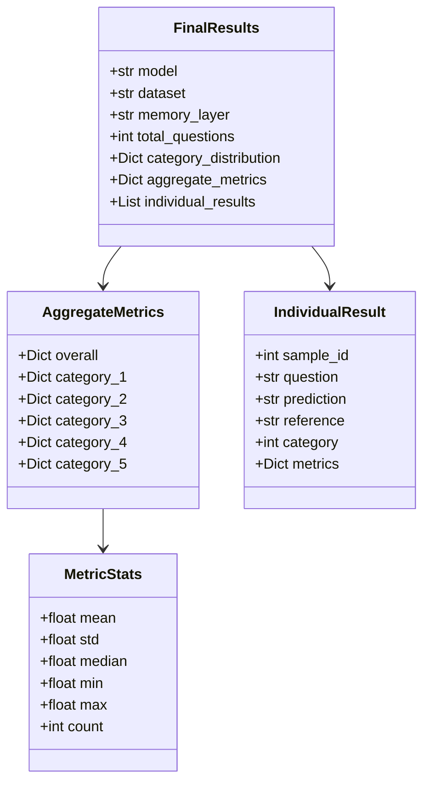

# 评估系统模块设计文档

## 1. 模块概述

评估系统在 LoComo 基准数据集上评估 A-MEM 系统的问答性能。系统包含两种评估 Agent 实现（标准版与鲁棒版），通过多维度指标（精确匹配、F1、ROUGE、BLEU、BERTScore、METEOR、SBERT 相似度）对预测答案与参考答案进行量化评估，并按问题类别聚合统计结果。

### 核心文件

| 文件 | 职责 |
|------|------|
| `test_advanced.py` | 标准版评估 Agent 与评估流程 |
| `test_advanced_robust.py` | 鲁棒版评估 Agent（无 JSON Schema 依赖） |
| `utils.py` | 评估指标计算与聚合 |
| `load_dataset.py` | LoComo 数据集加载与解析 |
| `llm_text_parsers.py` | 纯文本 LLM 响应解析器（鲁棒版专用） |

---

## 2. 评估系统整体架构

---

## 3. 问答评估时序图

---

## 4. 记忆缓存流程

---

## 5. answer_question 类别处理流程

### 类别详细说明

| 类别 | 描述 | Prompt 策略 | 温度 |
|------|------|-------------|------|
| 1 | 单跳事实回忆 | 短语回答，使用原文词汇 | 0.7 |
| 2 | 时间推理 | 使用对话日期回答近似日期，避免主语 | 0.7 |
| 3 | 多跳推理 | 短语回答，使用原文词汇 | 0.7 |
| 4 | 对话开集问答 | 短语回答，使用原文词汇 | 0.7 |
| 5 | 对抗性问题 | 二选一格式（正确答案 vs "Not mentioned"），随机排列 | `temperature_c5`（可配置） |

---

## 6. 评估指标计算流程

### 指标详情

| 指标 | 类型 | 说明 |
|------|------|------|
| `exact_match` | 精确匹配 | 预测与参考完全一致（忽略大小写） |
| `f1` | Token F1 | 分词后计算 Precision / Recall / F1 |
| `rouge1_f` | ROUGE-1 | 单字重叠 F 值 |
| `rouge2_f` | ROUGE-2 | 二元组重叠 F 值 |
| `rougeL_f` | ROUGE-L | 最长公共子序列 F 值 |
| `bleu1` ~ `bleu4` | BLEU | 1~4 gram BLEU 分数（SmoothingFunction） |
| `bert_f1` | BERTScore | 基于 BERT 的语义相似度 F1 |
| `meteor` | METEOR | 考虑同义词的翻译评估指标 |
| `sbert_similarity` | SBERT | SentenceTransformer 余弦相似度 |

### 聚合统计量

每个指标在每个分组（overall + 各 category）下计算以下统计量：

- **mean**: 均值
- **std**: 标准差（样本数 ≤ 1 时为 0）
- **median**: 中位数
- **min / max**: 最小 / 最大值
- **count**: 样本数

---

## 7. 数据集加载与解析流程

### 数据类关系

---

## 8. 标准版 vs 鲁棒版评估对比

### 关键差异对比

| 维度 | 标准版 (`advancedMemAgent`) | 鲁棒版 (`RobustAdvancedMemAgent`) |
|------|---------------------------|----------------------------------|
| 记忆系统 | `AgenticMemorySystem` | `RobustAgenticMemorySystem` |
| LLM 控制器 | `LLMController` | `RobustLLMController` |
| LLM 调用方式 | `get_completion(prompt, response_format=json_schema)` | `get_completion(prompt)` 无 JSON Schema |
| 响应解析 | 直接 `json.loads` 取字段 | `parse_plain_text_answer` 等：JSON 优先 + 纯文本回退 |
| 查询关键词生成 | JSON Schema 强制 `{"keywords": "..."}` | 逗号分隔关键词 + `parse_keywords_response` |
| 记忆筛选 | JSON Schema 强制 `{"relevant_parts": "..."}` | 纯文本 prompt + `parse_relevant_parts` |
| 答案生成 | JSON Schema 强制 `{"answer": "..."}` | 纯文本 + `parse_plain_text_answer` |
| 缓存目录 | `cached_memories_advanced_{backend}_{model}/` | `cached_memories_robust_{backend}_{model}/` |
| 日志前缀 | `eval_ours_` | `eval_robust_` |
| 后端兼容性 | 仅支持 JSON Schema 的后端（OpenAI 等） | 任意后端（OpenAI / Ollama / SGLang / vLLM） |
| 错误处理 | JSON 解析失败时记录错误数 | 异常捕获返回空字符串 |

### 鲁棒版解析策略

---

## 9. 评估流程参数

| 参数 | 默认值 | 说明 |
|------|--------|------|
| `--dataset` | `data/locomo10.json` | 数据集文件路径 |
| `--model` | `gpt-4o-mini` | LLM 模型名称 |
| `--output` | None | 结果输出路径 |
| `--ratio` | 1.0 | 评估样本比例（0.0~1.0） |
| `--backend` | `openai` / `sglang` | LLM 后端 |
| `--temperature_c5` | 0.5 | 类别 5 问题的温度参数 |
| `--retrieve_k` | 10 | 检索记忆数量 |
| `--sglang_host` | `http://localhost` | SGLang 服务器地址 |
| `--sglang_port` | 30000 | SGLang 服务器端口 |

---

## 10. 输出结构

