# 记忆进化与演化模块设计文档

## 1. 模块概述

记忆进化是 A-MEM 系统的核心创新机制，使记忆能够自动关联、更新和演化。当新记忆进入系统时，系统会检索与之语义最相近的邻居记忆，由 LLM 判断是否需要进化，并执行相应的进化动作（建立连接、更新邻居），从而实现记忆网络的自我组织和持续优化。

系统提供两种进化实现：

| 版本 | 文件 | LLM 调用方式 | 特点 |
|------|------|-------------|------|
| 标准版 | `memory_layer.py` | 单次调用 + JSON Schema 约束 | 简洁高效，依赖模型 JSON 输出能力 |
| 鲁棒版 | `memory_layer_robust.py` | 3 步顺序纯文本调用 | 容错性强，适配任意 LLM 后端 |

---

## 2. 记忆进化整体流程

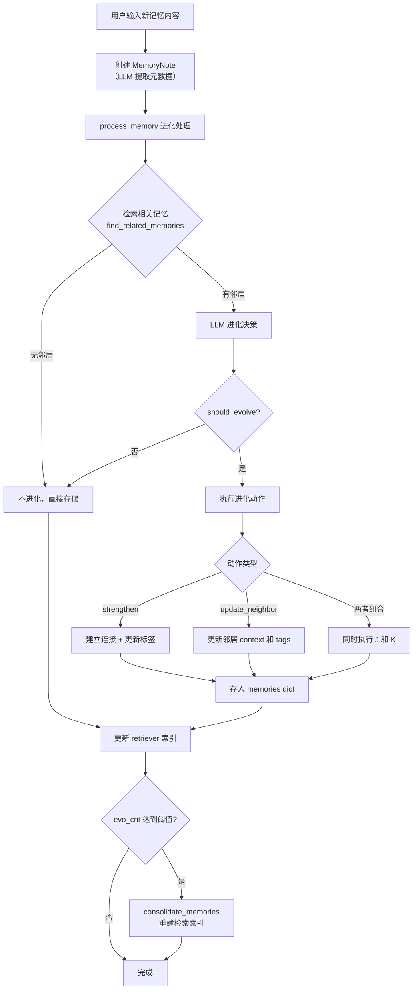

---

## 3. add_note 时序图

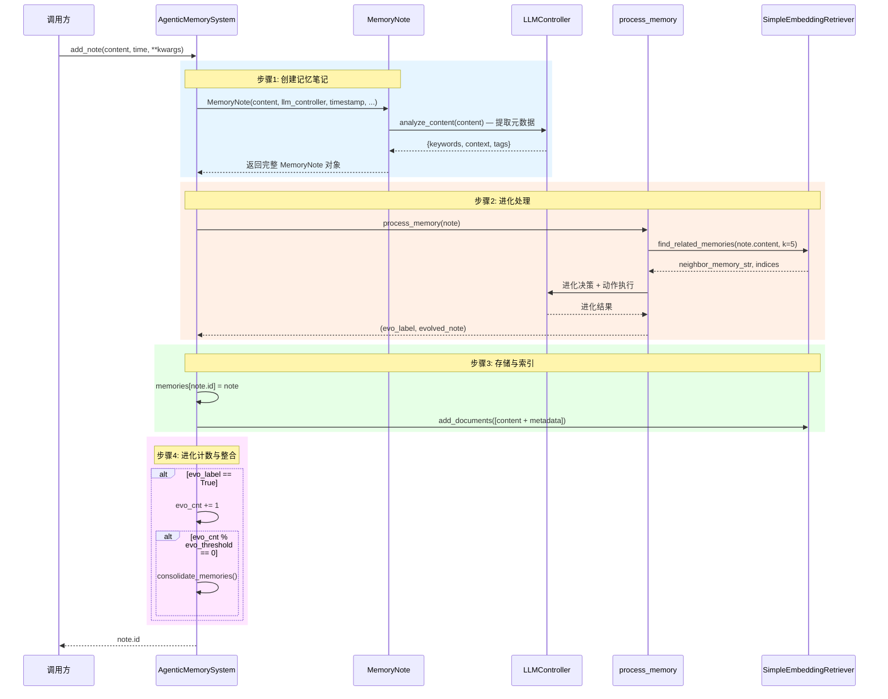

---

## 4. 标准版 process_memory 时序图

标准版通过**单次 LLM 调用**完成进化决策与动作执行，依赖 JSON Schema 约束输出格式。

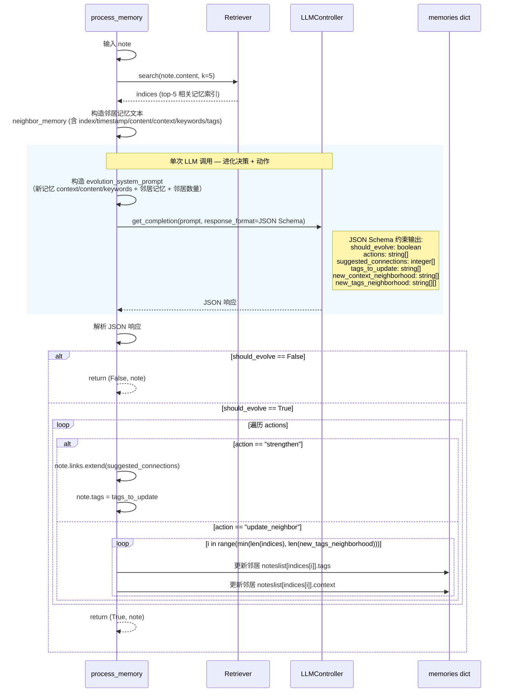

### 标准版 evolution_system_prompt 结构

```
You are an AI memory evolution agent responsible for managing and evolving a knowledge base.

The new memory context:
{context}
content: {content}
keywords: {keywords}

The nearest neighbors memories:
{nearest_neighbors_memories}

Return JSON:
{
    "should_evolve": True/False,
    "actions": ["strengthen", "update_neighbor"],
    "suggested_connections": [neighbor_index, ...],
    "tags_to_update": ["tag1", ...],
    "new_context_neighborhood": ["ctx1", ...],
    "new_tags_neighborhood": [["tag1", ...], ...]
}
```

---

## 5. 鲁棒版 process_memory 时序图（3 步调用）

鲁棒版将进化过程拆分为 **3 步顺序 LLM 调用**，每步使用纯文本 prompt + 段落标记解析，不依赖 JSON Schema，适配任意 LLM 后端。

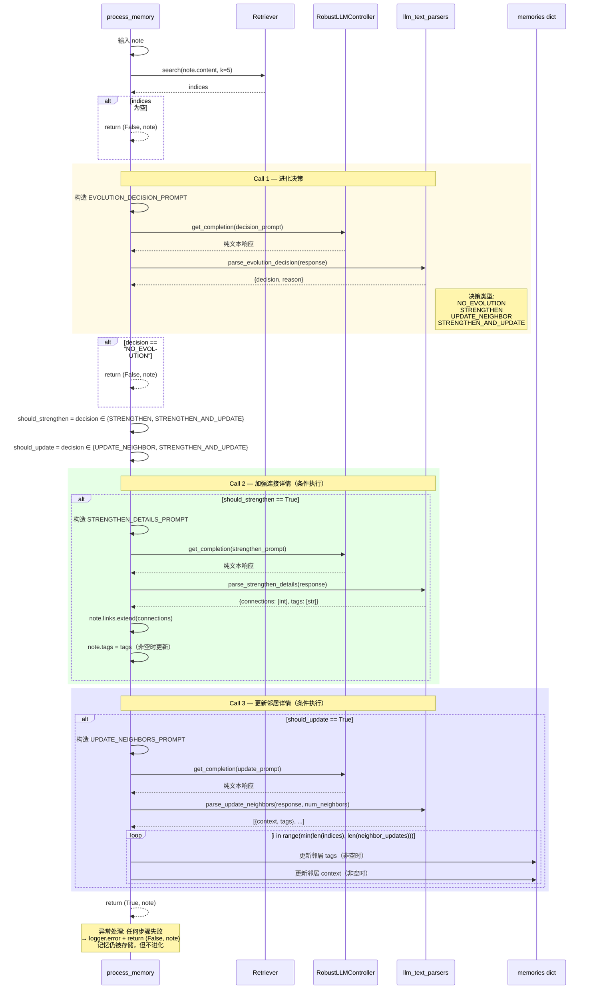

### 鲁棒版 3 步 Prompt 模板

| 步骤 | Prompt 常量 | 输入 | 输出格式 |
|------|------------|------|---------|
| Call 1 | `EVOLUTION_DECISION_PROMPT` | context, content, keywords, neighbors | `DECISION: <类型>`<br/>`REASON: <原因>` |
| Call 2 | `STRENGTHEN_DETAILS_PROMPT` | content, keywords, neighbors | `CONNECTIONS: 0, 2, 3`<br/>`TAGS: tag1, tag2, tag3` |
| Call 3 | `UPDATE_NEIGHBORS_PROMPT` | content, context, neighbors, count | `NEIGHBOR 0:`<br/>`CONTEXT: ...`<br/>`TAGS: ...` |

### 解析策略：JSON 优先 + 段落标记兜底

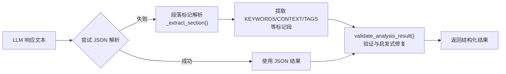

---

## 6. 进化决策状态机图

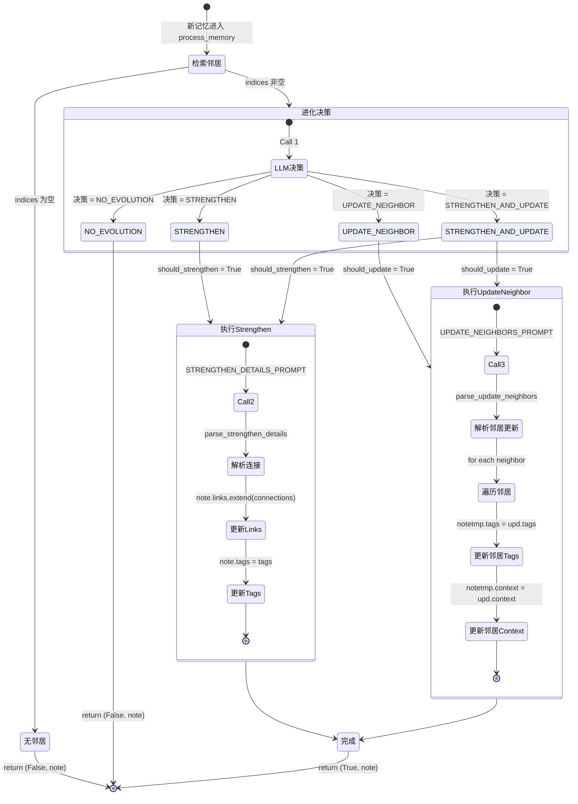

---

## 7. consolidate_memories 流程图

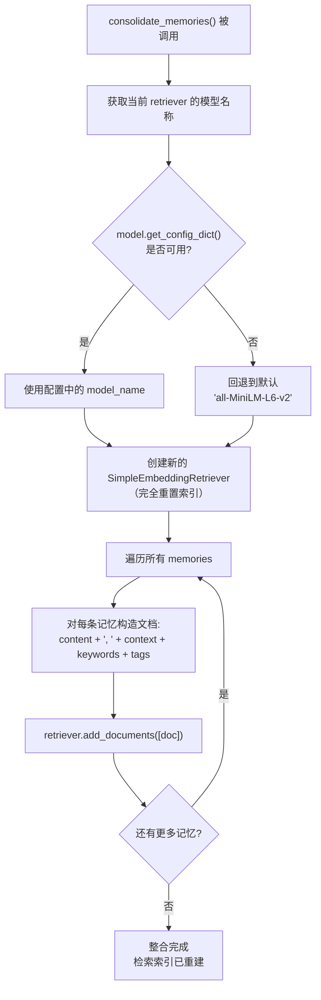

### 触发条件

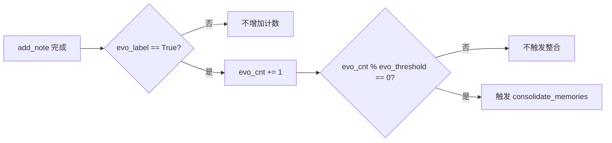

---

## 8. 进化动作详解

### 8.1 strengthen — 建立连接与标签更新

`strengthen` 动作在新记忆与相关邻居之间建立显式连接，并更新新记忆的分类标签。

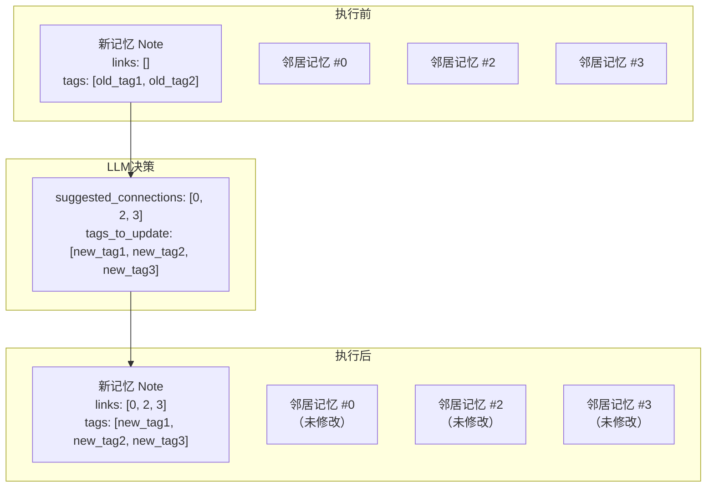

**代码实现（标准版）：**

```python
if action == "strengthen":
    suggest_connections = response_json["suggested_connections"]
    new_tags = response_json["tags_to_update"]
    note.links.extend(suggest_connections)  # 添加邻居索引到连接列表
    note.tags = new_tags                     # 替换标签
```

**代码实现（鲁棒版）：**

```python
# Call 2: STRENGTHEN_DETAILS_PROMPT
strengthen = parse_strengthen_details(response)
note.links.extend(strengthen["connections"])  # 添加邻居索引
if strengthen["tags"]:
    note.tags = strengthen["tags"]             # 非空时替换标签
```

### 8.2 update_neighbor — 更新邻居记忆

`update_neighbor` 动作根据新记忆带来的新理解，更新邻居记忆的上下文描述和分类标签。

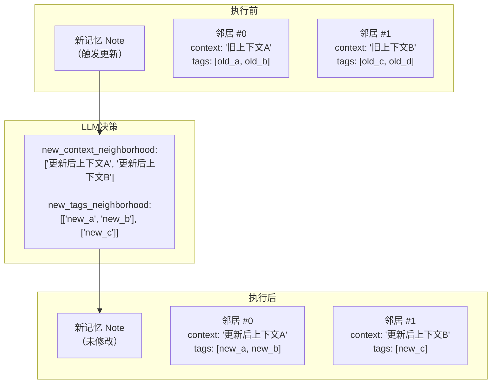

**代码实现（标准版）：**

```python
elif action == "update_neighbor":
    new_context_neighborhood = response_json["new_context_neighborhood"]
    new_tags_neighborhood = response_json["new_tags_neighborhood"]
    noteslist = list(self.memories.values())
    notes_id = list(self.memories.keys())
    for i in range(min(len(indices), len(new_tags_neighborhood))):
        tag = new_tags_neighborhood[i]
        context = new_context_neighborhood[i] if i < len(new_context_neighborhood) else noteslist[indices[i]].context
        notetmp = noteslist[indices[i]]
        notetmp.tags = tag
        notetmp.context = context
        self.memories[notes_id[memorytmp_idx]] = notetmp
```

**代码实现（鲁棒版）：**

```python
# Call 3: UPDATE_NEIGHBORS_PROMPT
neighbor_updates = parse_update_neighbors(response, len(indices))
noteslist = list(self.memories.values())
notes_id = list(self.memories.keys())
for i in range(min(len(indices), len(neighbor_updates))):
    upd = neighbor_updates[i]
    memorytmp_idx = indices[i]
    if memorytmp_idx >= len(noteslist):
        continue
    notetmp = noteslist[memorytmp_idx]
    if upd["tags"]:
        notetmp.tags = upd["tags"]
    if upd["context"]:
        notetmp.context = upd["context"]
    self.memories[notes_id[memorytmp_idx]] = notetmp
```

### 8.3 动作组合执行

`strengthen` 和 `update_neighbor` 可以组合执行（actions 同时包含两者，或鲁棒版决策为 `STRENGTHEN_AND_UPDATE`）：

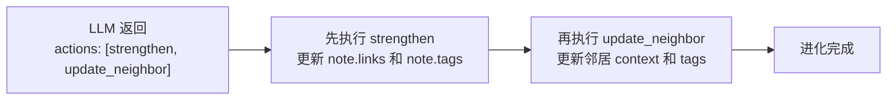

---

## 9. 进化计数与整合触发机制

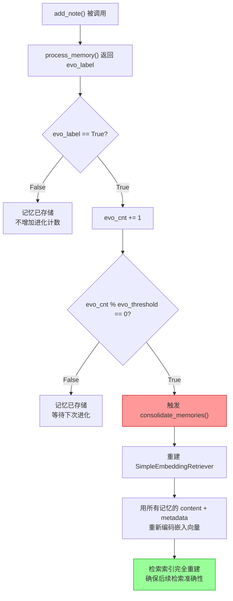

### 参数说明

| 参数 | 默认值 | 说明 |
|------|--------|------|
| `evo_cnt` | 0 | 进化计数器，每次成功进化 +1 |
| `evo_threshold` | 100 | 整合阈值，每 N 次进化触发一次索引重建 |

### 为什么需要 consolidate_memories？

在多次进化过程中，记忆的 `context`、`tags`、`keywords` 等元数据会被不断更新，但 retriever 中缓存的嵌入向量仍基于旧数据。当进化次数累积到阈值时，系统需要重建索引，确保检索结果反映记忆的最新状态。

---

## 10. 标准版与鲁棒版对比

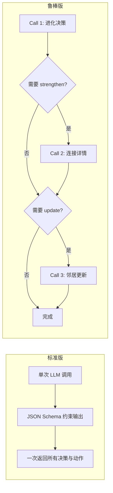

| 对比维度 | 标准版 | 鲁棒版 |
|---------|--------|--------|
| LLM 调用次数 | 1 次 | 1-3 次（条件执行） |
| 输出格式 | JSON Schema（严格约束） | 纯文本 + 段落标记 |
| 解析策略 | JSON 解析 | JSON 优先 + 段落标记兜底 |
| 容错能力 | JSON 解析失败则不进化 | 重试机制 + 启发式修复 + 优雅降级 |
| 适配范围 | 支持 JSON Schema 的模型 | 任意 LLM 后端 |
| 失败处理 | `return (False, note)` | `logger.error` + `return (False, note)` |
| 重试机制 | 无 | `@retry_llm_call(max_retries=2)` |
| 连接检查 | 无 | `check_connectivity()` 可选 |

---

## 11. 关键数据结构

### MemoryNote 字段

| 字段 | 类型 | 说明 | 进化影响 |
|------|------|------|---------|
| `id` | str | UUID 唯一标识 | - |
| `content` | str | 记忆原文 | - |
| `keywords` | List[str] | LLM 提取的关键词 | - |
| `context` | str | 上下文描述 | update_neighbor 可修改 |
| `tags` | List[str] | 分类标签 | strengthen / update_neighbor 可修改 |
| `links` | List[int] | 连接的邻居记忆索引 | strengthen 可修改 |
| `importance_score` | float | 重要性评分（默认 1.0） | - |
| `retrieval_count` | int | 被检索次数（默认 0） | - |
| `timestamp` | str | 创建时间 | - |
| `last_accessed` | str | 最后访问时间 | - |
| `evolution_history` | List | 进化历史记录 | - |
| `category` | str | 分类（默认 "Uncategorized"） | - |

### AgenticMemorySystem 核心属性

| 属性 | 类型 | 说明 |
|------|------|------|
| `memories` | Dict[str, MemoryNote] | ID → 记忆笔记映射 |
| `retriever` | SimpleEmbeddingRetriever | 嵌入向量检索器 |
| `llm_controller` | LLMController / RobustLLMController | LLM 控制器 |
| `evo_cnt` | int | 进化计数器 |
| `evo_threshold` | int | 整合阈值 |
