# LLM 控制器模块设计文档

> 源文件：`memory_layer.py`（标准版）、`memory_layer_robust.py`（鲁棒版）、`llm_text_parsers.py`（鲁棒版解析器）

## 1. 模块架构总览

LLM 控制器模块是 AgenticMemory 系统的 LLM 调用抽象层，负责屏蔽不同 LLM 后端的通信差异，为上层记忆系统提供统一的调用接口。模块提供两套并行实现：

- **标准版**（`memory_layer.py`）：依赖 `response_format` / JSON Schema 强制结构化输出
- **鲁棒版**（`memory_layer_robust.py`）：纯文本 prompt + section-marker 解析，兼容性更强

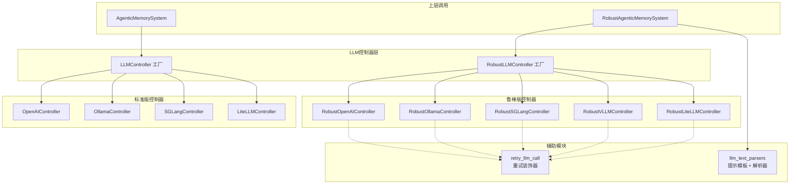

## 2. 类继承关系

### 2.1 标准版类图

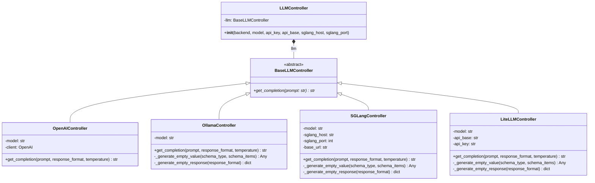

### 2.2 鲁棒版类图

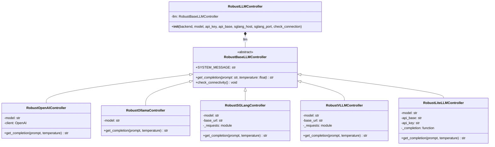

## 3. 工厂模式流程

### 3.1 标准版工厂 `LLMController`

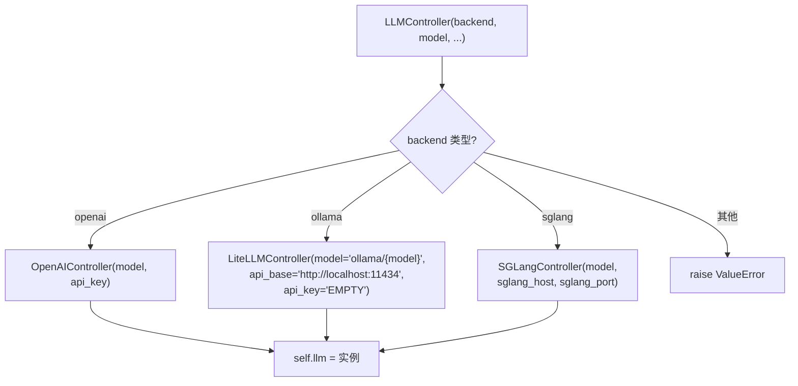

> **注意**：标准版 `backend="ollama"` 实际创建的是 `LiteLLMController`（使用 `ollama/` 前缀通过 LiteLLM 代理），而非 `OllamaController`（使用 `ollama_chat/` 前缀）。

### 3.2 鲁棒版工厂 `RobustLLMController`

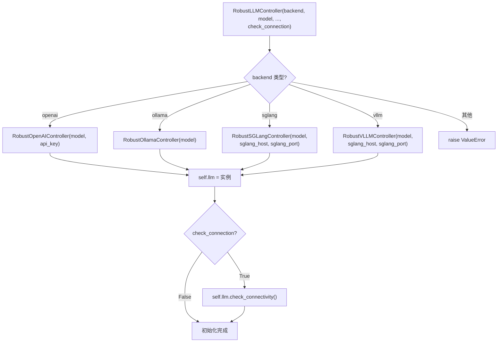

## 4. 重试机制流程

鲁棒版通过 `retry_llm_call` 装饰器为所有控制器的 `get_completion` 方法提供指数退避重试：

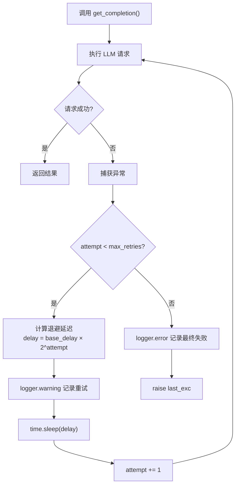

**参数说明**：

| 参数 | 默认值 | 说明 |
|------|--------|------|
| `max_retries` | 2 | 最大重试次数（不含首次调用，即总共最多 3 次调用） |
| `base_delay` | 1.0s | 基础退避延迟（秒） |

**退避时间表**（默认参数）：

| 尝试序号 | 延迟 |
|----------|------|
| 第 1 次失败后 | 1.0s |
| 第 2 次失败后 | 2.0s |
| 第 3 次失败后 | 抛出异常 |

## 5. 连接检查流程

鲁棒版 `RobustBaseLLMController.check_connectivity()` 在工厂创建控制器后可选执行：

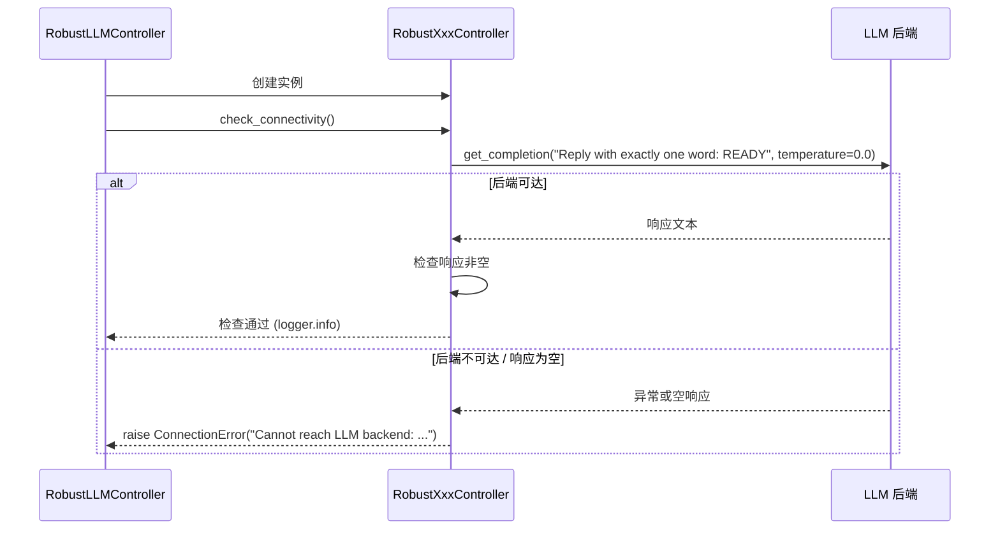

**连接检查特点**：
- 使用 `temperature=0.0` 确保确定性响应
- 发送极简 prompt 降低 token 消耗
- 失败时抛出 `ConnectionError` 并附带原始异常信息
- 仅在 `check_connection=True` 时触发，默认关闭

## 6. 标准版 vs 鲁棒版调用时序对比

### 6.1 标准版调用时序（单次 LLM 调用）

标准版在内容分析和记忆进化中均依赖 `response_format` 参数强制 JSON Schema 输出：

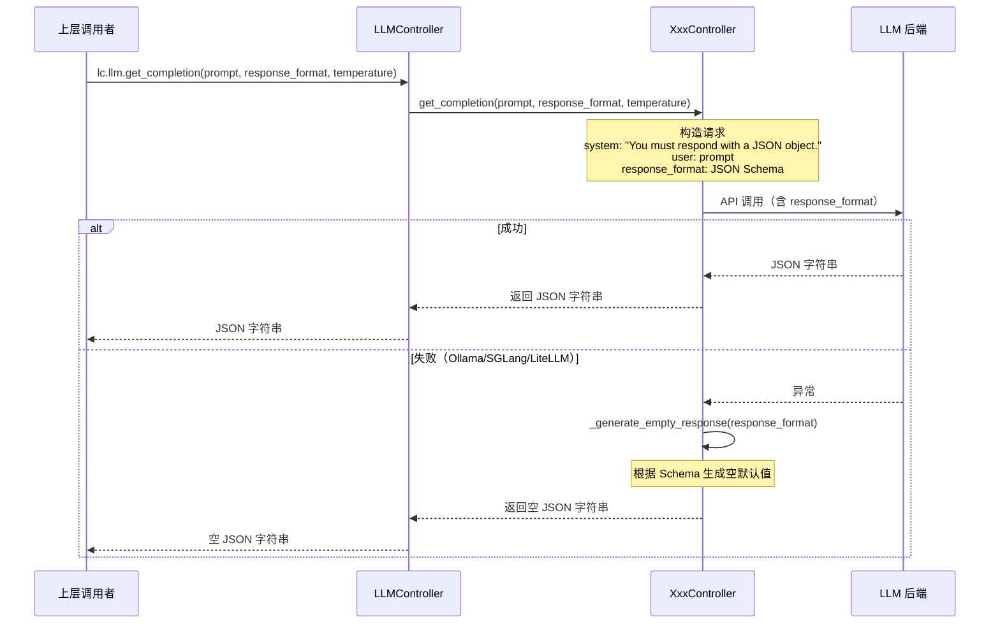

### 6.2 鲁棒版调用时序（内容分析）

鲁棒版使用纯文本 prompt + section-marker 解析，并支持 JSON 回退：

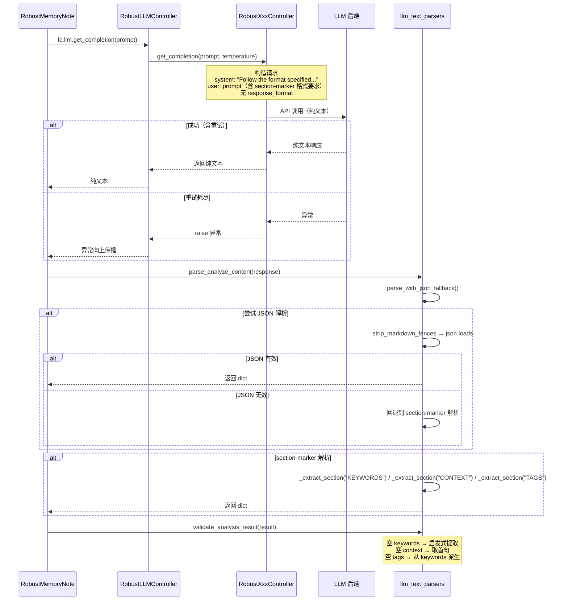

### 6.3 鲁棒版调用时序（记忆进化 — 三步条件调用）

鲁棒版将标准版的单次进化调用拆分为最多 3 次条件性调用：

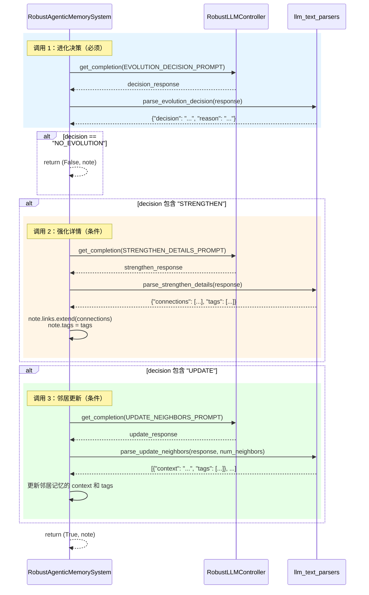

## 7. 关键差异对比

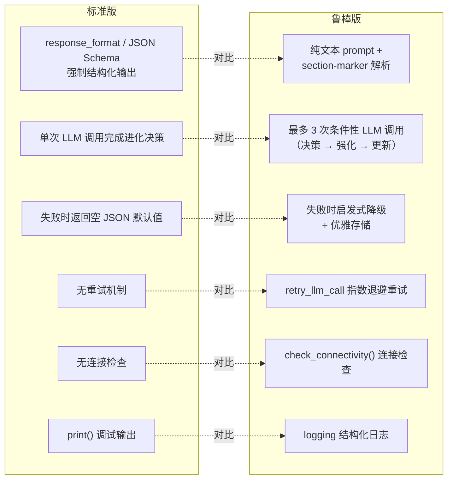

### 详细对比表

| 维度 | 标准版 | 鲁棒版 |
|------|--------|--------|
| **结构化输出方式** | `response_format` JSON Schema | 纯文本 prompt + section-marker 解析 |
| **`get_completion` 签名** | `(prompt, response_format, temperature)` | `(prompt, temperature)` |
| **System Message** | `"You must respond with a JSON object."` | `"Follow the format specified in the prompt exactly. Do not add extra commentary."` |
| **支持后端** | openai, ollama, sglang | openai, ollama, sglang, vllm |
| **Ollama 实现** | LiteLLM 代理 (`ollama/` 前缀) | 直接 Ollama chat API |
| **进化调用次数** | 1 次（单 prompt 含全部逻辑） | 最多 3 次（决策 → 强化 → 更新） |
| **失败处理** | 返回空 JSON 默认值 | 启发式降级 + 优雅存储（不丢失记忆） |
| **重试机制** | 无 | `retry_llm_call` 指数退避（默认 2 次重试） |
| **连接检查** | 无 | `check_connectivity()` 可选 |
| **日志** | `print()` | `logging` 结构化日志 |
| **解析兼容** | 仅 JSON | JSON 优先 + section-marker 回退 |

## 8. 各后端通信协议

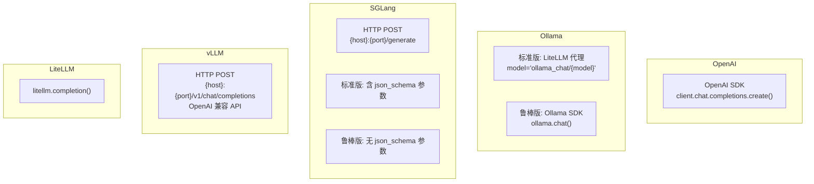

### 各后端请求参数对比

| 后端 | 标准版关键参数 | 鲁棒版关键参数 |
|------|---------------|---------------|
| **OpenAI** | `model`, `messages`, `response_format`, `temperature`, `max_tokens=1000` | `model`, `messages`, `temperature`, `max_tokens=1000` |
| **Ollama** | LiteLLM: `model="ollama_chat/{model}"`, `response_format` | Ollama SDK: `model`, `messages`, `options={"temperature": ...}` |
| **SGLang** | `text`, `sampling_params={temperature, max_new_tokens, json_schema}` | `text`, `sampling_params={temperature, max_new_tokens}` |
| **vLLM** | — | `model`, `messages`, `temperature`, `max_tokens=1000` |
| **LiteLLM** | `model`, `messages`, `response_format`, `temperature`, `api_base`, `api_key` | `model`, `messages`, `temperature`, `api_base`, `api_key` |

## 9. 优雅降级策略

鲁棒版在 LLM 调用失败时采用多层降级策略，确保记忆不丢失：

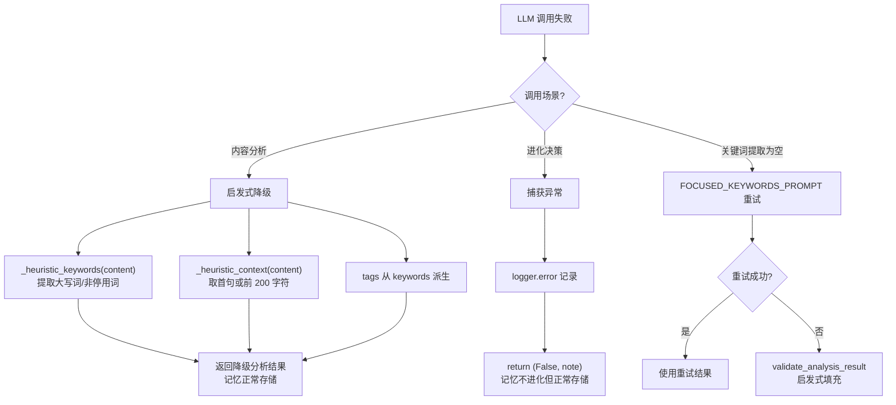
