# 记忆笔记与元数据提取模块设计文档

## 1. 模块概述

MemoryNote / RobustMemoryNote 是 AgenticMemory 系统的基本记忆单元，负责存储记忆内容和元数据，并通过 LLM 自动提取元数据（关键词、上下文、标签）。系统提供两个实现版本：

- **标准版** (`MemoryNote`)：依赖 JSON Schema 强制结构化输出，适用于支持 `response_format` 的 LLM 后端（如 OpenAI）
- **鲁棒版** (`RobustMemoryNote`)：使用纯文本 Prompt + Section-Marker 解析，兼容任意 LLM 后端，具备多层降级策略

---

## 2. MemoryNote 数据模型

### 2.1 类图

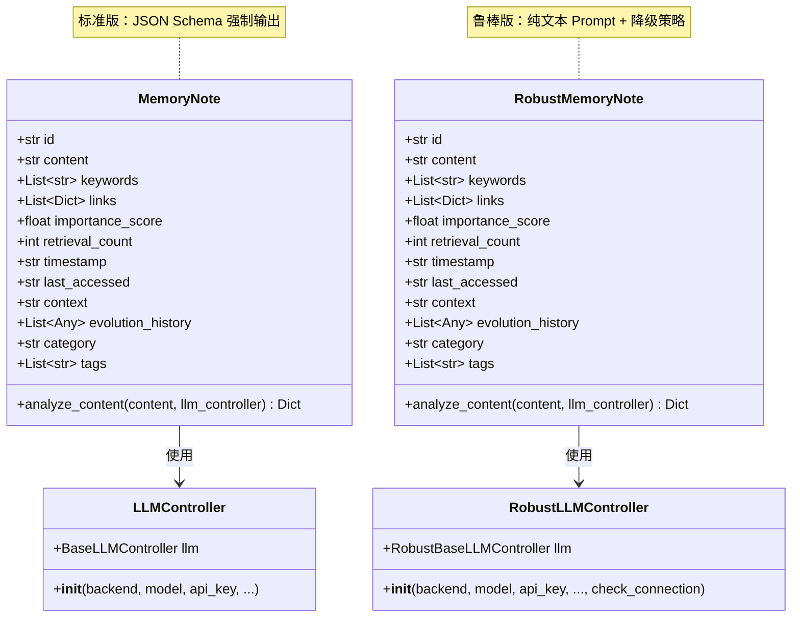

### 2.2 属性说明

| 属性 | 类型 | 默认值 | 说明 |
|------|------|--------|------|
| `id` | `str` | `uuid.uuid4()` | 唯一标识符 |
| `content` | `str` | 必填 | 记忆内容 |
| `keywords` | `List[str]` | `[]` | 关键词列表 |
| `links` | `List[Dict]` | `[]` | 连接的其他记忆 ID 列表 |
| `importance_score` | `float` | `1.0` | 重要性评分 |
| `retrieval_count` | `int` | `0` | 被检索次数 |
| `timestamp` | `str` | 当前时间 | 创建时间（格式 `%Y%m%d%H%M`） |
| `last_accessed` | `str` | 当前时间 | 最后访问时间 |
| `context` | `str` | `"General"` | 上下文描述（若为 list 则自动 join） |
| `evolution_history` | `List[Any]` | `[]` | 进化历史 |
| `category` | `str` | `"Uncategorized"` | 分类 |
| `tags` | `List[str]` | `[]` | 标签列表 |

### 2.3 构造函数元数据提取逻辑

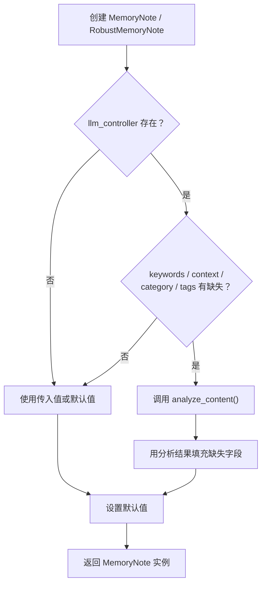

---

## 3. 元数据提取流程

### 3.1 标准版提取流程（时序图）

```mermaid
sequenceDiagram
    participant Note as MemoryNote.__init__
    participant Analyze as MemoryNote.analyze_content
    participant LLM as LLMController
    participant Backend as OpenAI / Ollama / SGLang

    Note->>Analyze: 调用 analyze_content(content, llm_controller)
    Analyze->>Analyze: 构造 Prompt（含 JSON 格式要求）
    Analyze->>LLM: get_completion(prompt, response_format)
    LLM->>Backend: 请求（带 JSON Schema 约束）
    Backend-->>LLM: JSON 字符串响应
    LLM-->>Analyze: 返回 response 字符串

    alt JSON 解析成功
        Analyze->>Analyze: json.loads(response)
        Analyze-->>Note: 返回 {"keywords", "context", "tags"}
    else JSON 解析失败
        Analyze->>Analyze: 返回空默认值<br/>{"keywords": [], "context": "General", "tags": []}
    end

    alt LLM 调用异常
        Analyze->>Analyze: 返回空默认值<br/>含 "category": "Uncategorized"
    end
```

### 3.2 鲁棒版提取流程（时序图）

```mermaid
sequenceDiagram
    participant Note as RobustMemoryNote.__init__
    participant Analyze as RobustMemoryNote.analyze_content
    participant LLM as RobustLLMController
    participant Parser as llm_text_parsers
    participant Backend as OpenAI / Ollama / SGLang / vLLM

    Note->>Analyze: 调用 analyze_content(content, llm_controller)
    Analyze->>Analyze: 构造 Prompt（ANALYZE_CONTENT_PROMPT）
    Analyze->>LLM: get_completion(prompt)
    LLM->>Backend: 请求（纯文本，无 JSON Schema）
    Backend-->>LLM: 纯文本响应
    LLM-->>Analyze: 返回 response 字符串

    Analyze->>Parser: parse_analyze_content(response, content)

    alt 尝试 JSON 解析
        Parser->>Parser: strip_markdown_fences → json.loads
    else JSON 失败，回退 Section-Marker
        Parser->>Parser: _extract_section("KEYWORDS")<br/>_extract_section("CONTEXT")<br/>_extract_section("TAGS")
    end

    Parser->>Parser: validate_analysis_result(result, content)

    alt keywords 仍为空
        Analyze->>LLM: get_completion(FOCUSED_KEYWORDS_PROMPT)
        LLM->>Backend: 重试请求
        Backend-->>LLM: 响应
        LLM-->>Analyze: retry_response
        Analyze->>Parser: _parse_list_items(retry_response)
    end

    Analyze->>Parser: validate_analysis_result(analysis, content)
    Parser-->>Analyze: 最终结果

    alt 全部失败（异常）
        Analyze->>Parser: _heuristic_keywords(content)
        Analyze->>Parser: _heuristic_context(content)
        Analyze-->>Note: 返回启发式结果
    else 正常
        Analyze-->>Note: 返回 {"keywords", "context", "tags"}
    end
```

---

## 4. 标准版 vs 鲁棒版提取对比

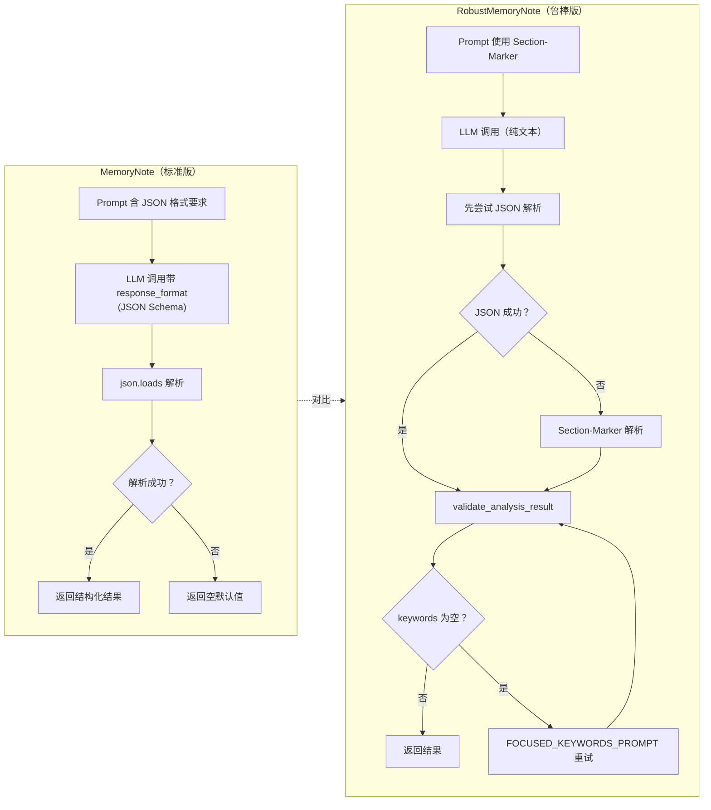

### 关键差异对照表

| 维度 | 标准版 (MemoryNote) | 鲁棒版 (RobustMemoryNote) |
|------|---------------------|---------------------------|
| **Prompt 格式** | 内联 JSON 格式要求 | `ANALYZE_CONTENT_PROMPT` 模板 |
| **LLM 调用参数** | `response_format` (JSON Schema) | 纯文本，无 `response_format` |
| **响应解析** | `json.loads` | 先 JSON → 回退 Section-Marker |
| **关键词为空处理** | 无重试 | `FOCUSED_KEYWORDS_PROMPT` 重试 |
| **验证修复** | 无 | `validate_analysis_result` |
| **最终降级** | 返回空默认值 | 启发式方法 (`_heuristic_*`) |
| **LLM 后端支持** | OpenAI, Ollama, SGLang | OpenAI, Ollama, SGLang, vLLM |
| **重试机制** | 无 | `retry_llm_call` 装饰器（指数退避） |
| **连接检查** | 无 | `check_connectivity()` |
| **日志** | `print()` | `logging` 结构化日志 |

---

## 5. 鲁棒版降级策略流程图

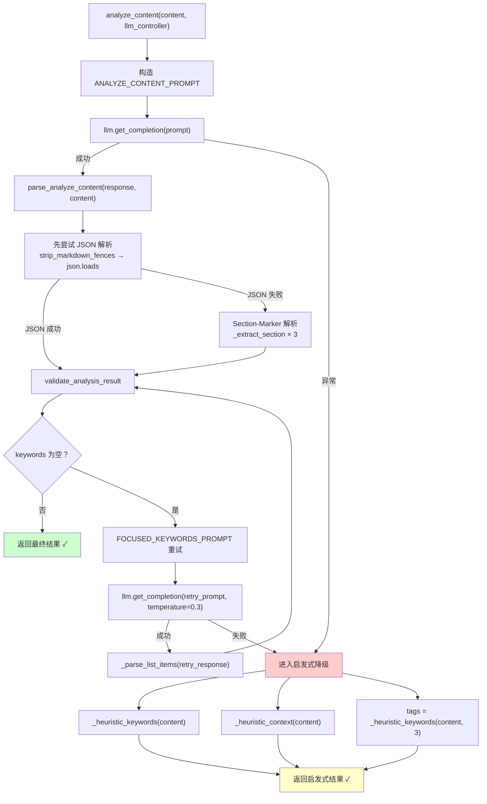

### 降级层级说明

| 层级 | 策略 | 触发条件 |
|------|------|----------|
| **L1** | JSON 解析 | LLM 返回有效 JSON（即使未要求 JSON Schema） |
| **L2** | Section-Marker 解析 | JSON 解析失败，使用 `KEYWORDS:` / `CONTEXT:` / `TAGS:` 标记 |
| **L3** | FOCUSED_KEYWORDS 重试 | keywords 解析后为空，使用聚焦 Prompt 重新请求 LLM |
| **L4** | 启发式方法 | LLM 调用完全失败，基于规则提取关键词和上下文 |

---

## 6. 验证与修复流程

### 6.1 validate_analysis_result 流程图

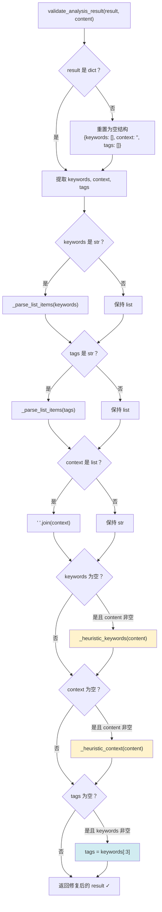

### 6.2 启发式方法详解

#### _heuristic_keywords

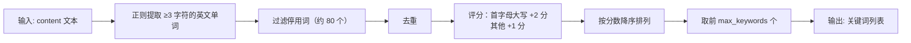

**停用词列表涵盖**：冠词、连词、介词、代词、助动词、常见副词等（如 `the`, `is`, `have`, `about`, `said`, `speaker` 等）。

#### _heuristic_context

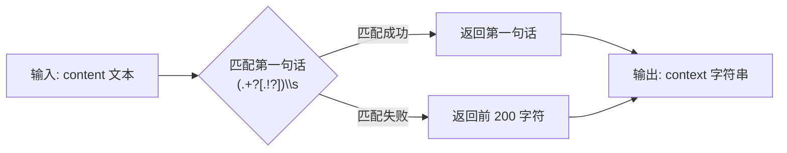

---

## 7. LLM 控制器架构

### 7.1 标准版控制器

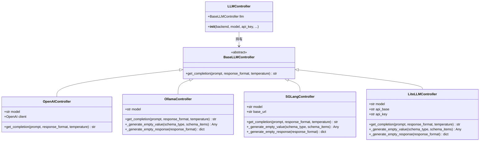

### 7.2 鲁棒版控制器

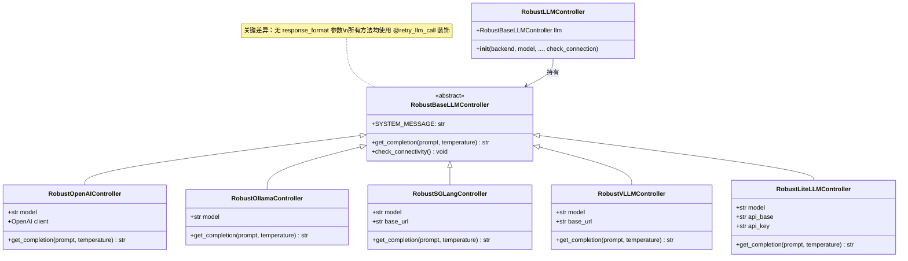

---

## 8. 解析工具链（llm_text_parsers.py）

### 8.1 解析函数总览

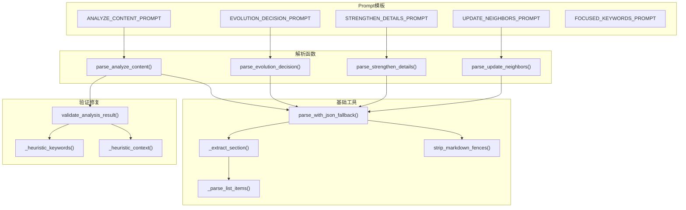

### 8.2 parse_with_json_fallback 通用解析策略

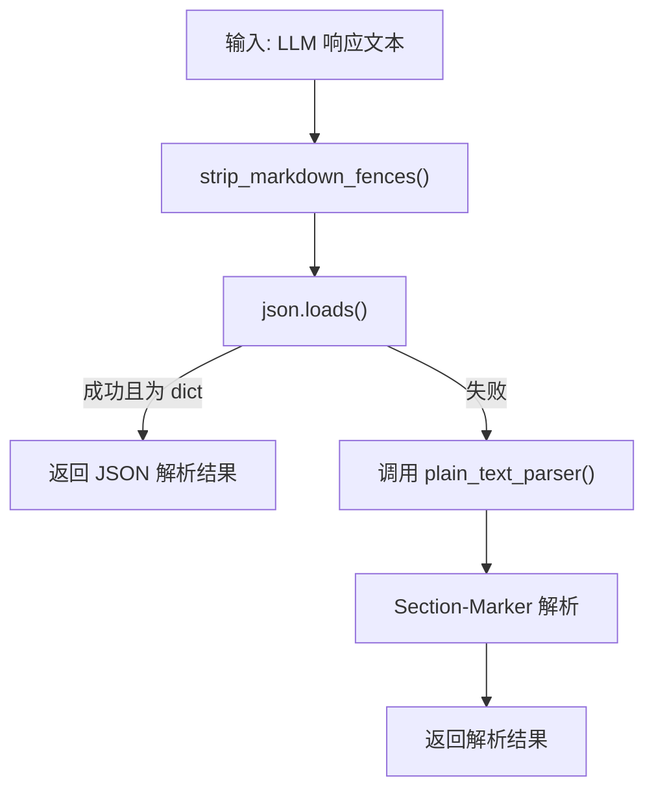

### 8.3 _extract_section 工作原理

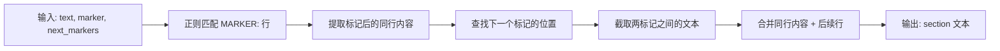

---

## 9. 源文件索引

| 文件 | 核心类/函数 | 说明 |
|------|------------|------|
| `memory_layer.py` | `MemoryNote`, `LLMController` | 标准版记忆单元与 LLM 控制器 |
| `memory_layer_robust.py` | `RobustMemoryNote`, `RobustLLMController` | 鲁棒版记忆单元与 LLM 控制器 |
| `llm_text_parsers.py` | Prompt 模板、`parse_*`、`validate_*`、`_heuristic_*` | 纯文本解析、验证与启发式修复 |
