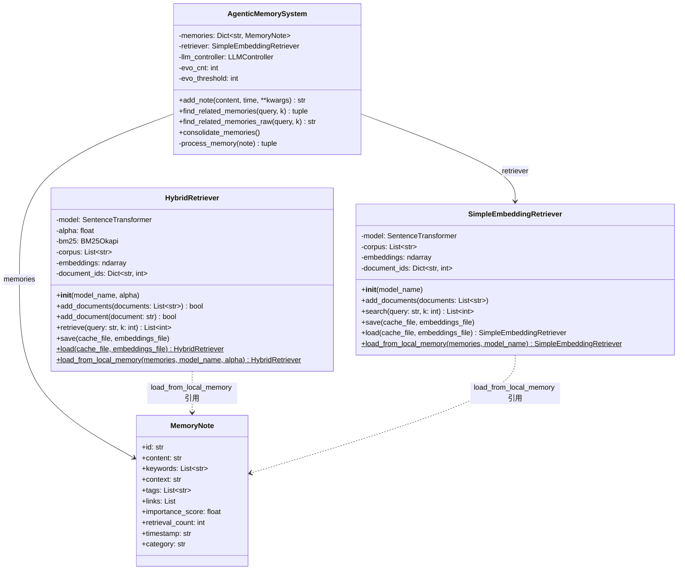
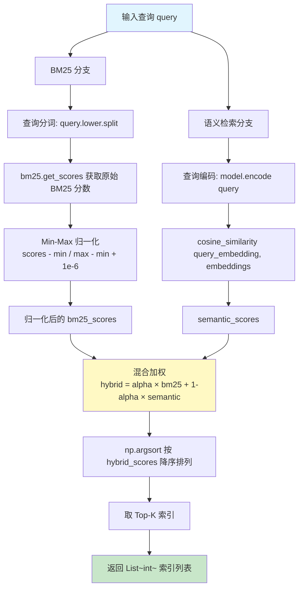
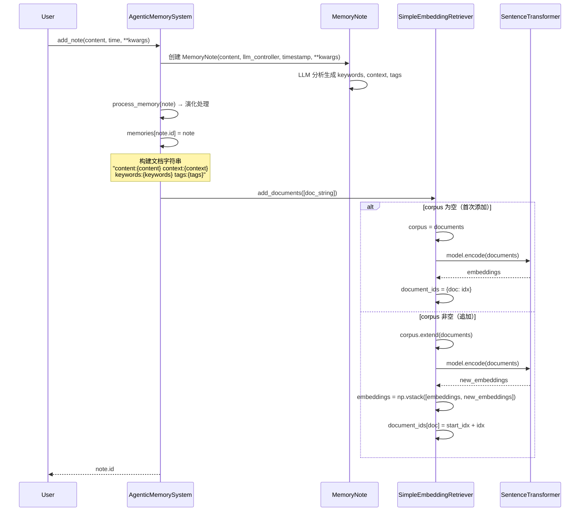
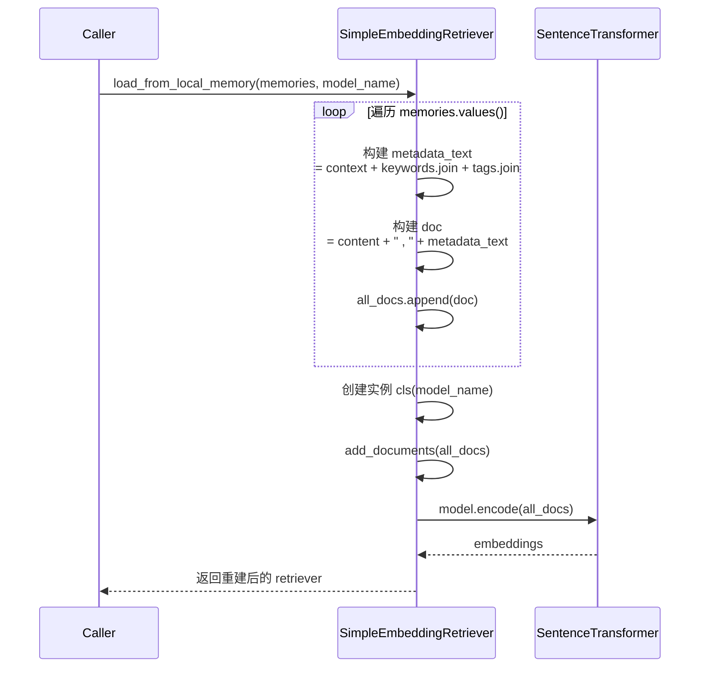
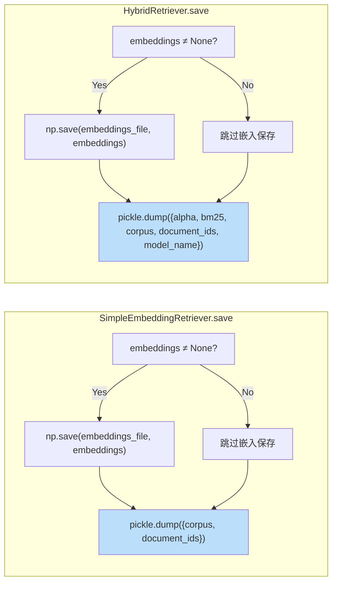
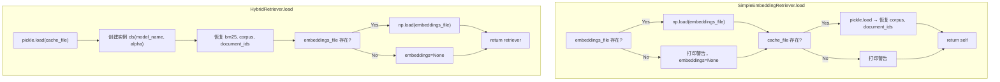
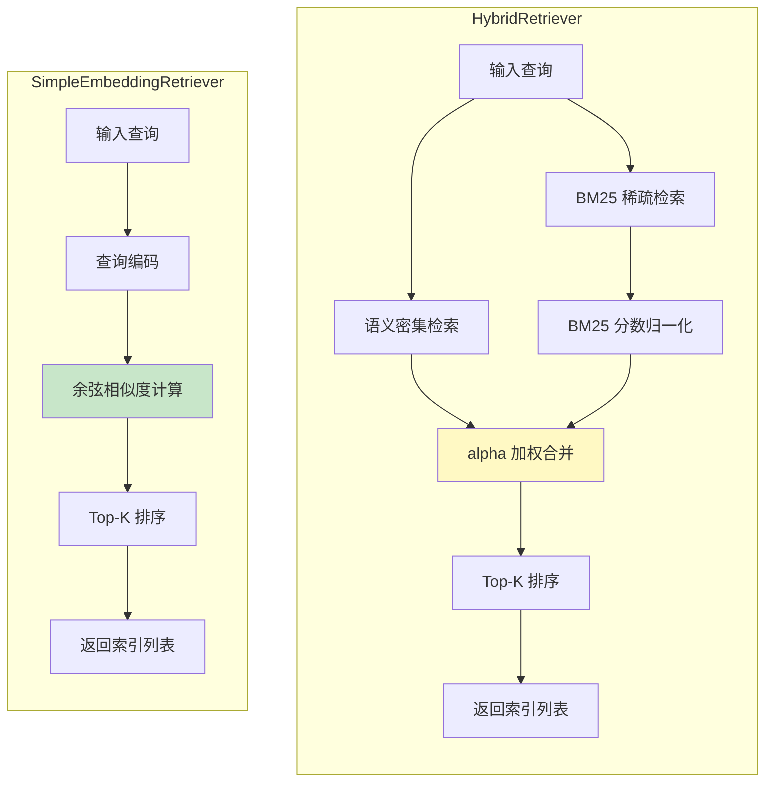
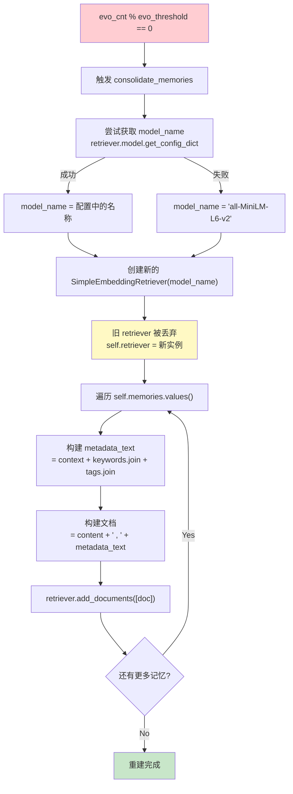
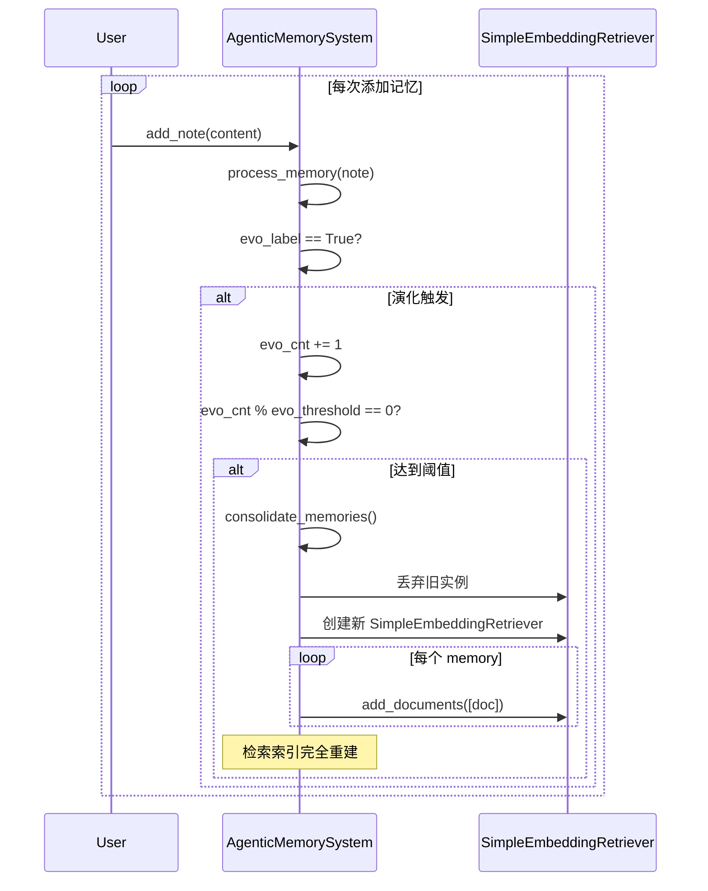

# 检索系统模块设计文档（Module Retriever）

## 1. 模块概述

检索系统是 AgenticMemory 项目的核心组件，负责从记忆库中高效地找到与查询最相关的记忆条目。系统提供两种检索策略：

- **HybridRetriever**：混合检索，结合 BM25 关键词匹配与语义嵌入检索，通过 `alpha` 参数灵活控制权重
- **SimpleEmbeddingRetriever**：纯语义嵌入检索，仅基于 SentenceTransformer 嵌入的余弦相似度

当前 `AgenticMemorySystem` 默认使用 `SimpleEmbeddingRetriever`。

**源文件**：`memory_layer.py`

**核心依赖**：
| 依赖 | 用途 |
|------|------|
| `rank_bm25.BM25Okapi` | BM25 关键词检索算法 |
| `sentence_transformers.SentenceTransformer` | 语义嵌入模型（默认 `all-MiniLM-L6-v2`） |
| `sklearn.metrics.pairwise.cosine_similarity` | 余弦相似度计算 |
| `nltk.tokenize.word_tokenize` | 文本分词 |
| `numpy` | 嵌入向量存储与运算 |
| `pickle` | 检索器状态序列化 |

---

## 2. 检索系统类图



---

## 3. 混合检索评分流程图

`HybridRetriever.retrieve()` 方法将 BM25 稀疏检索与语义密集检索融合，通过 `alpha` 参数加权合并得分。



**alpha 权重说明**：

| alpha 值 | 行为 | 适用场景 |
|-----------|------|----------|
| `0.0` | 纯 BM25 关键词匹配 | 精确关键词检索 |
| `0.5`（默认） | 均衡混合 | 通用场景 |
| `1.0` | 纯语义检索 | 语义相似但词汇不同 |

**BM25 分数归一化**：由于 BM25 原始分数范围不固定，而余弦相似度在 `[-1, 1]` 之间，必须对 BM25 分数做 Min-Max 归一化到 `[0, 1]` 后才能与语义分数加权合并。分母加 `1e-6` 防止除零。

---

## 4. 文档索引构建时序图

### 4.1 增量添加（add_note → add_documents）

当 `AgenticMemorySystem.add_note()` 被调用时，系统会构建包含内容与元数据的文档字符串并添加到检索器。



### 4.2 从记忆字典重建索引（load_from_local_memory）



**文档构建格式对比**：

| 场景 | 文档格式 | 代码位置 |
|------|----------|----------|
| `add_note` 增量添加 | `"content:{content} context:{context} keywords:{kw} tags:{tags}"` | `AgenticMemorySystem.add_note()` |
| `load_from_local_memory` 重建 | `"{content} , {context} {keywords} {tags}"` | `SimpleEmbeddingRetriever.load_from_local_memory()` |
| `consolidate_memories` 重建 | `"{content} , {context} {keywords} {tags}"` | `AgenticMemorySystem.consolidate_memories()` |

> ⚠️ 注意：`add_note` 与 `load_from_local_memory`/`consolidate_memories` 的文档拼接格式存在差异，前者使用 `content:`/`context:`/`keywords:`/`tags:` 前缀标签，后者使用逗号分隔。这可能导致同一记忆在不同阶段生成的嵌入向量不一致。

---

## 5. 持久化存储流程

### 5.1 保存流程



### 5.2 加载流程



**存储文件说明**：

| 文件 | 格式 | 内容 | 适用检索器 |
|------|------|------|------------|
| `retriever_cache_*.pkl` | Pickle | corpus, document_ids, alpha, bm25, model_name | 两者共用 |
| `retriever_cache_embeddings_*.npy` | NumPy | embeddings 矩阵 | 两者共用 |

> 💡 `SimpleEmbeddingRetriever.load()` 是实例方法（返回 `self`），而 `HybridRetriever.load()` 是类方法（返回新实例）。

---

## 6. 两种检索器对比



| 特性 | HybridRetriever | SimpleEmbeddingRetriever |
|------|-----------------|--------------------------|
| **检索方法** | BM25 + 语义嵌入混合 | 纯语义嵌入 |
| **权重控制** | `alpha` 参数（0=纯BM25, 1=纯语义） | 无 |
| **检索入口** | `retrieve(query, k)` | `search(query, k)` |
| **增量添加** | `add_document()` 支持单文档增量 | `add_documents()` 仅批量（追加模式） |
| **BM25 索引** | 需要，增量时调用 `bm25.add_document()` | 不需要 |
| **嵌入存储** | `torch.Tensor`（add_document 用 `torch.cat`） | `numpy.ndarray`（用 `np.vstack` 追加） |
| **load 方法** | `@classmethod`，返回新实例 | 实例方法，返回 `self` |
| **load_from_local_memory 文档** | 仅使用 `keywords` | 使用 `content + context + keywords + tags` |
| **当前使用** | 未被 `AgenticMemorySystem` 使用 | ✅ 默认检索器 |
| **复杂度** | 较高，需维护 BM25 + 嵌入双索引 | 较低，仅维护嵌入索引 |

---

## 7. consolidate_memories 重建流程

`consolidate_memories()` 在演化计数达到阈值时触发，完全重建检索索引以确保所有记忆的元数据（经过演化更新后的 context、tags 等）被正确反映到检索空间中。



### 重建触发机制



**重建的必要性**：记忆演化（`process_memory`）会修改记忆的 `context`、`tags`、`links` 等元数据，但增量添加时文档字符串是固定的，不会随演化更新。因此需要定期重建索引，将演化后的最新元数据重新编码到嵌入空间中。

**重建代价**：每次重建需要对所有记忆重新编码嵌入，时间复杂度为 O(N)，其中 N 为记忆总数。`evo_threshold`（默认 100）控制重建频率。

---

## 8. 关键实现细节

### 8.1 文档索引映射

两个检索器均使用 `document_ids: Dict[str, int]` 维护文档内容到索引的映射，用于去重和定位：

```
document_ids = {
    "content:xxx context:yyy keywords:kkk tags:ttt": 0,
    "content:aaa context:bbb keywords:ccc tags:ddd": 1,
    ...
}
```

### 8.2 嵌入向量存储差异

| 操作 | HybridRetriever | SimpleEmbeddingRetriever |
|------|-----------------|--------------------------|
| 批量添加 | `model.encode()` → numpy | `model.encode()` → numpy |
| 增量添加 | `torch.cat([old, new])` → Tensor | `np.vstack([old, new])` → ndarray |

> ⚠️ `HybridRetriever.add_document()` 使用 `convert_to_tensor=True` 编码，导致增量添加后 `embeddings` 为 `torch.Tensor`，而批量添加时为 `numpy.ndarray`。这可能引发类型不一致问题。

### 8.3 检索结果使用方式

`AgenticMemorySystem` 通过检索器返回的索引列表，直接按索引访问 `list(self.memories.values())` 获取对应的 `MemoryNote` 对象：

```python
indices = self.retriever.search(query, k)
all_memories = list(self.memories.values())
for i in indices:
    memory = all_memories[i]
```

> ⚠️ 此设计假设检索器中文档的顺序与 `self.memories.values()` 的顺序一致。在 `consolidate_memories` 重建后，由于逐个调用 `add_documents`，顺序与字典插入顺序一致，可保证正确性。但 `load_from_local_memory` 重建时，顺序取决于 `memories.values()` 的迭代顺序。
