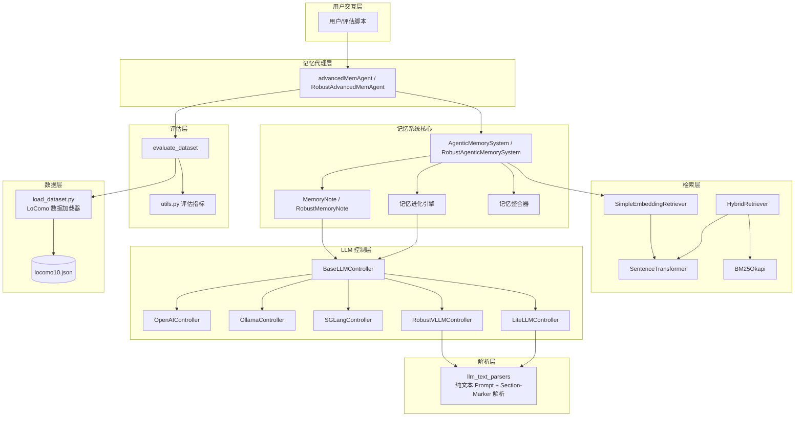
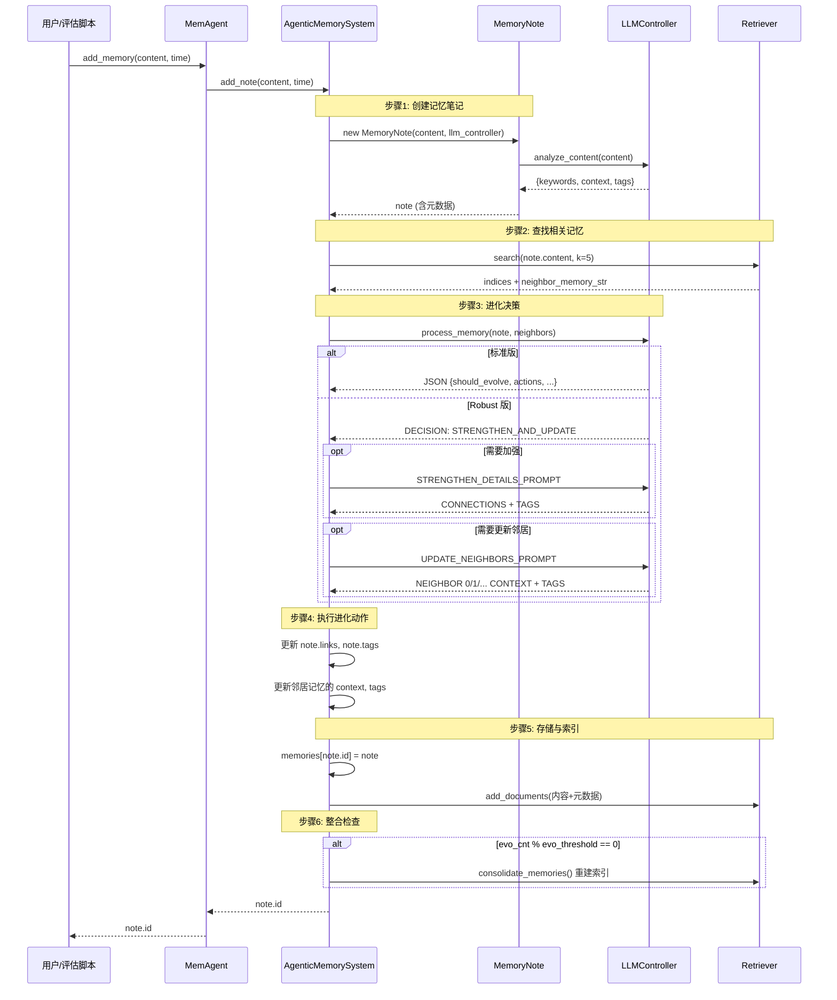
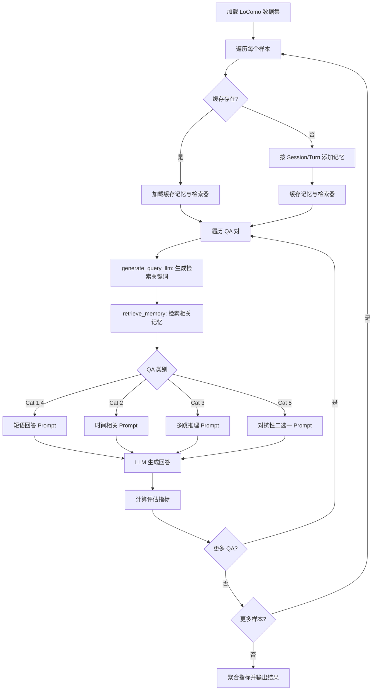
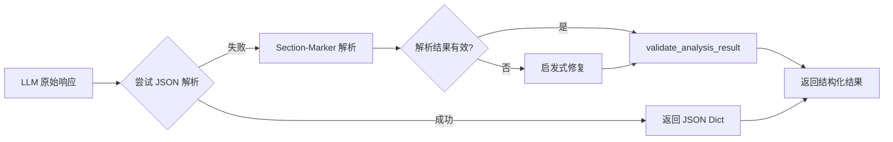

# AgenticMemory (A-MEM) 项目规格说明

## 1. 项目概述

AgenticMemory（A-MEM）是一个基于大语言模型（LLM）的智能记忆管理系统，实现了论文 *"A-MEM: Agentic Memory"* 中提出的方法。系统的核心思想是让记忆具备**自主进化能力**——当新记忆被写入时，系统能够自动发现记忆间的关联、更新已有记忆的元数据、建立记忆间的链接，从而使记忆库随使用不断演化，而非静态存储。

系统在 **LoComo 基准数据集**上进行评估，该数据集包含多会话对话及5类问答任务，用于验证长对话记忆管理的效果。

### 1.1 系统架构总览



### 1.2 双轨实现

项目提供两套并行的实现：

| 维度 | 标准版 (`memory_layer.py`) | Robust 版 (`memory_layer_robust.py`) |
|------|--------------------------|--------------------------------------|
| LLM 输出格式 | JSON Schema 约束 (`response_format`) | 纯文本 Prompt + Section-Marker 解析 |
| 进化调用 | 单次 LLM 调用，返回完整 JSON | 3 步顺序调用：决策 → 加强 → 更新邻居 |
| 兼容性 | 依赖模型 JSON Schema 能力 | 适用于任意 LLM 后端 |
| 容错 | JSON 解析失败则跳过进化 | JSON 回退 + Section-Marker + 启发式修复 |
| 重试 | 无 | 指数退避重试 (`retry_llm_call`) |
| 连接检查 | 无 | 可选 `check_connectivity()` |
| 日志 | `print()` | `logging` 结构化日志 |

---

## 2. 功能需求

### FR-1 记忆笔记管理

**FR-1.1 创建记忆笔记**

系统应支持通过纯文本内容创建记忆笔记，自动调用 LLM 提取以下元数据：

| 字段 | 类型 | 默认值 | 说明 |
|------|------|--------|------|
| `id` | `str` | UUID4 | 唯一标识符 |
| `content` | `str` | 必填 | 记忆原始内容 |
| `keywords` | `List[str]` | `[]` | LLM 提取的关键词（名词、动词、核心概念） |
| `context` | `str` | `"General"` | LLM 生成的一句话上下文摘要 |
| `tags` | `List[str]` | `[]` | LLM 生成的分类标签 |
| `links` | `List` | `[]` | 关联记忆的索引列表 |
| `importance_score` | `float` | `1.0` | 重要性评分 |
| `retrieval_count` | `int` | `0` | 被检索次数 |
| `timestamp` | `str` | 当前时间 | 创建时间（格式 `YYYYMMDDHHmm`） |
| `last_accessed` | `str` | 当前时间 | 最后访问时间 |
| `evolution_history` | `List` | `[]` | 进化历史记录 |
| `category` | `str` | `"Uncategorized"` | 分类 |

**FR-1.2 元数据自动提取**

- 标准版：通过 JSON Schema 约束 LLM 返回 `{"keywords": [...], "context": "...", "tags": [...]}` 结构
- Robust 版：使用 `ANALYZE_CONTENT_PROMPT` 纯文本 Prompt，通过 Section-Marker（`KEYWORDS:`, `CONTEXT:`, `TAGS:`）解析；若关键词为空则使用 `FOCUSED_KEYWORDS_PROMPT` 重试

**FR-1.3 启发式降级**

当 LLM 调用失败时，Robust 版应降级为启发式提取：
- 关键词：从内容中提取大写词和去停用词后的高频词
- 上下文：取内容首句或前 200 字符
- 标签：从关键词中取前 3 个

### FR-2 记忆检索

**FR-2.1 语义嵌入检索**

`SimpleEmbeddingRetriever` 应支持：
- 基于 SentenceTransformer（默认 `all-MiniLM-L6-v2`）的文档嵌入
- 余弦相似度排序，返回 Top-K 结果
- 增量添加文档（`add_documents`）
- 持久化存储与加载（`save` / `load`）
- 从已有记忆字典重建索引（`load_from_local_memory`）

**FR-2.2 混合检索**

`HybridRetriever` 应支持：
- BM25 关键词检索 + 语义嵌入检索的加权融合
- 通过 `alpha` 参数控制权重（0=纯 BM25，1=纯语义）
- 持久化存储与加载

**FR-2.3 相关记忆查找**

`find_related_memories` 应返回：
- 格式化的记忆字符串（包含索引、时间、内容、上下文、关键词、标签）
- 对应的记忆索引列表

`find_related_memories_raw` 应额外展开记忆的邻居链接（`links`），返回包含邻居信息的完整字符串。

### FR-3 记忆进化

**FR-3.1 进化触发**

每次通过 `add_note` 添加新记忆时，应自动触发 `process_memory` 进行进化决策。

**FR-3.2 进化决策（标准版）**

单次 LLM 调用，输入新记忆的上下文、内容、关键词及最近邻记忆，返回 JSON：
```json
{
  "should_evolve": true,
  "actions": ["strengthen", "update_neighbor"],
  "suggested_connections": [0, 2],
  "tags_to_update": ["tag1", "tag2"],
  "new_context_neighborhood": ["new ctx 0", "new ctx 1"],
  "new_tags_neighborhood": [["t1","t2"], ["t3","t4"]]
}
```

**FR-3.3 进化决策（Robust 版）**

3 步顺序 LLM 调用：

1. **进化决策**（`EVOLUTION_DECISION_PROMPT`）：返回 `NO_EVOLUTION | STRENGTHEN | UPDATE_NEIGHBOR | STRENGTHEN_AND_UPDATE`
2. **加强细节**（`STRENGTHEN_DETAILS_PROMPT`，条件执行）：返回连接索引和更新标签
3. **更新邻居**（`UPDATE_NEIGHBORS_PROMPT`，条件执行）：返回每个邻居的更新上下文和标签

**FR-3.4 进化动作**

| 动作 | 效果 |
|------|------|
| `strengthen` | 将 `suggested_connections` 中的索引加入新记忆的 `links`；更新新记忆的 `tags` |
| `update_neighbor` | 按顺序更新邻居记忆的 `context` 和 `tags` |

**FR-3.5 记忆整合**

每 `evo_threshold` 次成功进化后（默认 100 次），触发 `consolidate_memories`：
- 重建 `SimpleEmbeddingRetriever` 索引
- 将所有记忆的内容 + 上下文 + 关键词 + 标签重新编入索引

### FR-4 LLM 控制器

**FR-4.1 后端支持**

| 后端 | 标准版控制器 | Robust 版控制器 | 通信方式 |
|------|-------------|----------------|----------|
| OpenAI | `OpenAIController` | `RobustOpenAIController` | OpenAI Python SDK |
| Ollama | `OllamaController`（经 LiteLLM） | `RobustOllamaController`（原生 SDK） | LiteLLM / ollama SDK |
| SGLang | `SGLangController` | `RobustSGLangController` | HTTP POST `/generate` |
| vLLM | — | `RobustVLLMController` | HTTP POST `/v1/chat/completions` |
| LiteLLM | `LiteLLMController` | `RobustLiteLLMController` | LiteLLM 代理 |

**FR-4.2 工厂模式**

`LLMController` / `RobustLLMController` 作为工厂类，根据 `backend` 参数实例化对应的控制器实现。

**FR-4.3 重试机制（Robust 版）**

`retry_llm_call` 装饰器提供：
- 最多 `max_retries` 次重试（默认 2 次）
- 指数退避延迟（`base_delay * 2^attempt`）
- 结构化日志记录

**FR-4.4 连接检查（Robust 版）**

`check_connectivity()` 方法在初始化时可选执行，发送测试 Prompt 验证后端可达性。

### FR-5 文本解析器

**FR-5.1 Section-Marker 解析**

`_extract_section` 函数应从 LLM 纯文本响应中提取指定标记（如 `KEYWORDS:`、`CONTEXT:`）后的内容，直到下一个已知标记或文本结尾。

**FR-5.2 JSON 回退解析**

`parse_with_json_fallback` 应优先尝试 JSON 解析（许多模型即使无 Schema 约束也会返回 JSON），失败后回退到 Section-Marker 解析。

**FR-5.3 列表项解析**

`_parse_list_items` 应支持：
- 项目符号列表（`-`、`*`、编号）
- 逗号分隔值
- 每行一项

**FR-5.4 验证与修复**

`validate_analysis_result` 应对解析结果进行验证：
- 空 keywords → 启发式提取
- 空 context → 取内容首句
- 空 tags → 从 keywords 派生前 3 个

### FR-6 数据加载

**FR-6.1 LoComo 数据集加载**

`load_locomo_dataset` 应从 JSON 文件加载 LoComo 数据集，解析为 `LoCoMoSample` 列表，每个样本包含：
- `sample_id`: 样本标识
- `qa`: QA 问答对列表
- `conversation`: 多会话对话
- `event_summary`: 事件摘要
- `observation`: 观察记录
- `session_summary`: 会话摘要

**FR-6.2 数据结构**

| 数据类 | 关键字段 |
|--------|----------|
| `QA` | `question`, `answer`, `evidence`, `category`, `adversarial_answer` |
| `Turn` | `speaker`, `dia_id`, `text` |
| `Session` | `session_id`, `date_time`, `turns` |
| `Conversation` | `speaker_a`, `speaker_b`, `sessions` |

**FR-6.3 图像处理**

对于包含 `img_url` 和 `blip_caption` 的 Turn，应将图像描述以 `[Image: caption]` 格式合并到文本中。

### FR-7 评估系统

**FR-7.1 评估代理**

`advancedMemAgent` / `RobustAdvancedMemAgent` 应提供：
- `add_memory(content, time)`: 添加记忆
- `retrieve_memory(content, k)`: 检索相关记忆
- `retrieve_memory_llm(memories_text, query)`: LLM 辅助筛选相关部分
- `generate_query_llm(question)`: 从问题生成检索关键词
- `answer_question(question, category, answer)`: 基于记忆上下文回答问题

**FR-7.2 问答类别处理**

| 类别 | 说明 | Prompt 策略 |
|------|------|-------------|
| 1 | 单跳事实问答 | 短语回答，尽量使用原文用词 |
| 2 | 时间相关问答 | 使用对话日期给出近似时间 |
| 3 | 多跳推理问答 | 短语回答，尽量使用原文用词 |
| 4 | 对话行为问答 | 短语回答，尽量使用原文用词 |
| 5 | 对抗性问答 | 二选一格式（正确答案 vs "Not mentioned"），随机排列 |

**FR-7.3 记忆缓存**

评估系统应支持记忆缓存机制：
- 按 `sample_idx` 缓存记忆（`.pkl`）和检索器（`.pkl` + `.npy`）
- 存在缓存时直接加载，避免重复构建
- 缓存目录：`cached_memories_advanced_{backend}_{model}/` 或 `cached_memories_robust_{backend}_{model}/`

### FR-8 评估指标

**FR-8.1 指标计算**

`calculate_metrics` 应对每对预测-参考答案计算以下指标：

| 指标 | 说明 |
|------|------|
| `exact_match` | 精确匹配（大小写不敏感） |
| `f1` | Token 级 F1 分数 |
| `rouge1_f` / `rouge2_f` / `rougeL_f` | ROUGE 评分 |
| `bleu1` ~ `bleu4` | BLEU 评分（1-4 gram） |
| `bert_f1` | BERTScore F1 |
| `meteor` | METEOR 评分 |
| `sbert_similarity` | SBERT 余弦相似度 |

**FR-8.2 聚合统计**

`aggregate_metrics` 应按总体和按类别（1-5）分别计算每个指标的均值、标准差、中位数、最小值、最大值和计数。

---

## 3. 非功能需求

### NFR-1 兼容性

- **NFR-1.1** 系统应支持 Python 3.8+ 运行环境
- **NFR-1.2** Robust 版应兼容所有不支持 JSON Schema 约束的 LLM 后端（包括本地部署的开源模型）
- **NFR-1.3** 标准版和 Robust 版应提供对等的功能接口，可互换使用

### NFR-2 可靠性

- **NFR-2.1** LLM 调用失败时，系统应优雅降级而非崩溃（存储记忆但不进化）
- **NFR-2.2** Robust 版应提供最多 2 次重试的指数退避机制
- **NFR-2.3** JSON 解析失败时，Robust 版应回退到 Section-Marker 解析
- **NFR-2.4** 所有解析失败时，应使用启发式方法生成默认元数据

### NFR-3 可扩展性

- **NFR-3.1** LLM 控制器应通过继承 `BaseLLMController` / `RobustBaseLLMController` 扩展新后端
- **NFR-3.2** 检索器应支持替换嵌入模型（通过 `model_name` 参数）
- **NFR-3.3** 进化阈值 `evo_threshold` 应可配置

### NFR-4 性能

- **NFR-4.1** 记忆检索应在秒级完成（基于预计算嵌入）
- **NFR-4.2** 记忆整合（`consolidate_memories`）应仅在达到阈值时触发，避免频繁重建索引
- **NFR-4.3** 评估过程应支持记忆缓存，避免重复构建

### NFR-5 可观测性

- **NFR-5.1** Robust 版应使用 `logging` 模块输出结构化日志
- **NFR-5.2** 评估过程应记录每个问题的预测、参考答案、Prompt 和原始上下文
- **NFR-5.3** 评估结果应支持输出到 JSON 文件

### NFR-6 安全性

- **NFR-6.1** API Key 应通过环境变量传入，不应硬编码
- **NFR-6.2** 记忆缓存文件不应包含敏感凭证信息

---

## 4. 数据流描述

### 4.1 记忆写入与进化流程



### 4.2 问答评估流程



### 4.3 Robust 版 LLM 解析流程



---

## 5. 接口规格

### 5.1 LLM 控制器接口

```python
class BaseLLMController(ABC):
    @abstractmethod
    def get_completion(self, prompt: str, response_format: dict,
                       temperature: float = 0.7) -> str:
        """标准版：返回 JSON 格式字符串"""
        pass

class RobustBaseLLMController(ABC):
    SYSTEM_MESSAGE = "Follow the format specified in the prompt exactly. Do not add extra commentary."

    @abstractmethod
    def get_completion(self, prompt: str,
                       temperature: float = 0.7) -> str:
        """Robust版：返回纯文本字符串"""
        pass

    def check_connectivity(self) -> None:
        """验证后端可达性，失败抛出 ConnectionError"""
        pass
```

### 5.2 记忆笔记接口

```python
class MemoryNote:
    def __init__(self,
                 content: str,
                 id: Optional[str] = None,
                 keywords: Optional[List[str]] = None,
                 links: Optional[Dict] = None,
                 importance_score: Optional[float] = None,
                 retrieval_count: Optional[int] = None,
                 timestamp: Optional[str] = None,
                 last_accessed: Optional[str] = None,
                 context: Optional[str] = None,
                 evolution_history: Optional[List] = None,
                 category: Optional[str] = None,
                 tags: Optional[List[str]] = None,
                 llm_controller: Optional[LLMController] = None):

    @staticmethod
    def analyze_content(content: str,
                        llm_controller: LLMController) -> Dict:
        """返回 {"keywords": [...], "context": "...", "tags": [...]}"""
```

### 5.3 记忆系统接口

```python
class AgenticMemorySystem:
    def __init__(self,
                 model_name: str = 'all-MiniLM-L6-v2',
                 llm_backend: str = "sglang",
                 llm_model: str = "gpt-4o-mini",
                 evo_threshold: int = 100,
                 api_key: Optional[str] = None,
                 api_base: Optional[str] = None,
                 sglang_host: str = "http://localhost",
                 sglang_port: int = 30000):

    def add_note(self, content: str, time: str = None, **kwargs) -> str:
        """添加记忆笔记，返回 note.id"""

    def process_memory(self, note: MemoryNote) -> tuple[bool, MemoryNote]:
        """进化决策与执行，返回 (should_evolve, note)"""

    def find_related_memories(self, query: str, k: int = 5) -> tuple[str, List[int]]:
        """查找相关记忆，返回 (格式化字符串, 索引列表)"""

    def find_related_memories_raw(self, query: str, k: int = 5) -> str:
        """查找相关记忆（含邻居展开），返回格式化字符串"""

    def consolidate_memories(self) -> None:
        """重建检索器索引"""
```

### 5.4 检索器接口

```python
class SimpleEmbeddingRetriever:
    def __init__(self, model_name: str = 'all-MiniLM-L6-v2'):

    def add_documents(self, documents: List[str]) -> None:
        """批量添加文档到索引"""

    def search(self, query: str, k: int = 5) -> List[int]:
        """语义检索，返回 Top-K 索引"""

    def save(self, retriever_cache_file: str,
             retriever_cache_embeddings_file: str) -> None:
        """持久化存储"""

    def load(self, retriever_cache_file: str,
             retriever_cache_embeddings_file: str) -> 'SimpleEmbeddingRetriever':
        """从磁盘加载"""

    @classmethod
    def load_from_local_memory(cls, memories: Dict,
                                model_name: str) -> 'SimpleEmbeddingRetriever':
        """从记忆字典重建索引"""
```

### 5.5 评估代理接口

```python
class advancedMemAgent:
    def __init__(self, model: str, backend: str, retrieve_k: int,
                 temperature_c5: float,
                 sglang_host: str = "http://localhost",
                 sglang_port: int = 30000):

    def add_memory(self, content: str, time: str = None) -> None:
        """添加记忆"""

    def retrieve_memory(self, content: str, k: int = 10) -> str:
        """检索相关记忆"""

    def answer_question(self, question: str, category: int,
                        answer: str) -> tuple[str, str, str]:
        """回答问题，返回 (prediction, user_prompt, raw_context)"""
```

### 5.6 数据加载接口

```python
def load_locomo_dataset(file_path: Union[str, Path]) -> List[LoCoMoSample]:
    """加载 LoComo 数据集"""

def get_dataset_statistics(samples: List[LoCoMoSample]) -> Dict:
    """获取数据集统计信息"""
```

### 5.7 评估指标接口

```python
def calculate_metrics(prediction: str, reference: str) -> Dict[str, float]:
    """计算单个预测的综合评估指标"""

def aggregate_metrics(all_metrics: List[Dict[str, float]],
                      all_categories: List[int]) -> Dict:
    """按总体和类别聚合评估指标"""
```

### 5.8 文本解析器接口

```python
def parse_analyze_content(response: str, content: str = "") -> Dict[str, Any]:
    """解析内容分析响应 → {"keywords": [...], "context": "...", "tags": [...]}"""

def parse_evolution_decision(response: str) -> Dict[str, str]:
    """解析进化决策响应 → {"decision": "...", "reason": "..."}"""

def parse_strengthen_details(response: str) -> Dict[str, Any]:
    """解析加强细节响应 → {"connections": [int], "tags": [str]}"""

def parse_update_neighbors(response: str, num_neighbors: int) -> List[Dict[str, Any]]:
    """解析邻居更新响应 → [{"context": "...", "tags": [...]}, ...]"""

def parse_plain_text_answer(response: str) -> str:
    """解析纯文本回答"""

def parse_relevant_parts(response: str) -> str:
    """解析相关部分检索响应"""

def parse_keywords_response(response: str) -> str:
    """解析关键词生成响应"""

def validate_analysis_result(result: Dict[str, Any],
                             content: str = "") -> Dict[str, Any]:
    """验证并修复分析结果"""
```

---

## 6. 约束与假设

### 6.1 约束

| 编号 | 约束描述 |
|------|----------|
| C-1 | 标准版 LLM 控制器依赖模型支持 `response_format`（JSON Schema 约束），仅适用于 OpenAI 等支持该特性的后端 |
| C-2 | SGLang 后端需预先启动推理服务器（默认 `localhost:30000`） |
| C-3 | vLLM 后端需预先启动 OpenAI 兼容 API 服务器（默认 `localhost:30000`） |
| C-4 | Ollama 后端需本地运行 Ollama 服务（默认 `localhost:11434`） |
| C-5 | 嵌入模型 `all-MiniLM-L6-v2` 首次使用需下载（约 80MB） |
| C-6 | BERTScore 计算需下载 RoBERTa 模型，首次运行较慢 |
| C-7 | 记忆索引基于内存存储（`Dict[str, MemoryNote]`），大规模数据集需考虑内存限制 |
| C-8 | `HybridRetriever` 的 `add_document` 方法引用了 `torch`，但项目未在 `requirements.txt` 中显式声明 torch 依赖（仅通过 `sentence-transformers` 间接引入） |
| C-9 | 进化过程中邻居索引基于 `list(self.memories.values())` 的顺序，记忆删除操作可能导致索引偏移 |

### 6.2 假设

| 编号 | 假设描述 |
|------|----------|
| A-1 | LLM 后端服务在系统运行期间保持可用 |
| A-2 | 输入的对话内容为英文（Prompt 模板和停用词表均为英文设计） |
| A-3 | LoComo 数据集 JSON 文件格式符合预期结构 |
| A-4 | 记忆一旦创建不会被删除（仅更新元数据和链接） |
| A-5 | 同一 `add_note` 调用中，检索到的邻居记忆在进化执行期间不会被其他并发操作修改（单线程假设） |
| A-6 | 评估时每个样本使用独立的 Agent 实例，样本间记忆不共享 |
| A-7 | `evo_threshold` 设置合理，整合频率不会过于频繁影响性能 |

---

## 7. 术语表

| 术语 | 英文 | 定义 |
|------|------|------|
| 记忆笔记 | Memory Note | 系统中记忆的基本单元，包含内容、元数据和链接关系 |
| 记忆进化 | Memory Evolution | 新记忆写入时，通过 LLM 决策自动更新记忆间关联和元数据的过程 |
| 加强 | Strengthen | 进化动作之一，建立新记忆与邻居记忆的链接并更新标签 |
| 更新邻居 | Update Neighbor | 进化动作之一，更新邻居记忆的上下文和标签 |
| 记忆整合 | Consolidation | 定期重建检索索引，确保检索系统反映记忆的最新状态 |
| Section-Marker | Section Marker | Robust 版使用的文本解析标记（如 `KEYWORDS:`、`CONTEXT:`），用于从纯文本 LLM 响应中提取结构化数据 |
| JSON 回退 | JSON Fallback | 解析策略：优先尝试 JSON 解析，失败后回退到 Section-Marker 解析 |
| 启发式修复 | Heuristic Repair | 当 LLM 解析完全失败时，使用规则方法（如提取大写词、取首句）生成默认元数据 |
| 混合检索 | Hybrid Retrieval | 结合 BM25 关键词检索和语义嵌入检索的混合检索方法 |
| LoComo | LoComo | Long Conversational Memory 基准数据集，用于评估长对话记忆管理能力 |
| 对抗性问答 | Adversarial QA | 类别 5 问答，问题设计用于测试模型是否会产生幻觉，正确答案可能是"对话中未提及" |
| 进化阈值 | Evolution Threshold | 触发记忆整合所需的成功进化次数（`evo_threshold`） |
| 检索器 | Retriever | 负责从记忆库中检索相关记忆的组件，支持语义检索和混合检索 |
| LLM 控制器 | LLM Controller | 封装与大语言模型交互逻辑的组件，支持多种后端 |
| Robust 版 | Robust Version | 不依赖 JSON Schema 约束的实现版本，使用纯文本 Prompt 和 Section-Marker 解析 |
| 指数退避 | Exponential Backoff | 重试策略，每次重试的等待时间按指数增长 |
| 语义嵌入 | Semantic Embedding | 将文本转换为高维向量表示，用于计算语义相似度 |
| BM25 | BM25 | Best Matching 25，一种基于词频的经典信息检索算法 |
| SBERT | Sentence-BERT | 基于 BERT 的句子嵌入模型，用于计算句子级语义相似度 |
