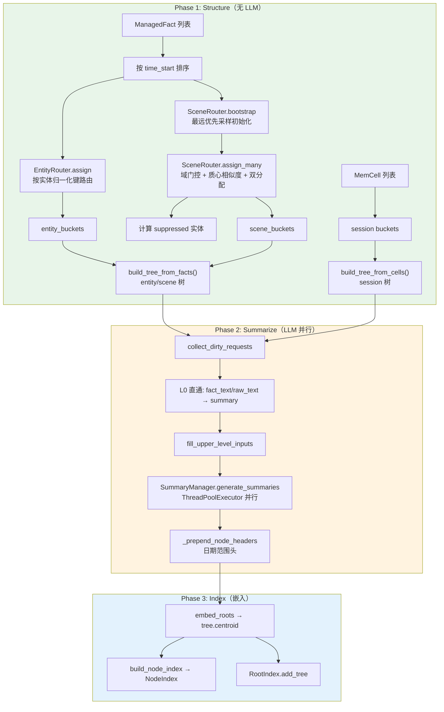
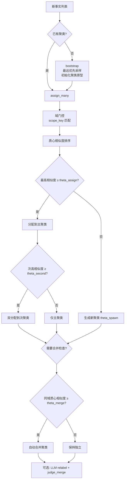
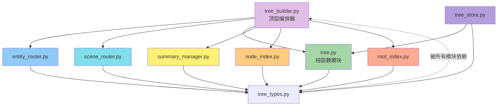

# MemForest Build 模块深入分析

## 1. 模块概述

`src/build/` 模块是 MemForest 系统的**核心构建引擎**，负责将提取后的记忆事实（`ManagedFact`）和会话片段（`MemCell`）组织成多维度、层次化的记忆树（`MemTree`）。其核心职责包括：

- **路由（Routing）**：将事实按实体（entity）、场景（scene）、会话（session）三个维度分发到对应的树
- **树构建（Tree Building）**：自底向上构建 B+ 树风格的层次结构，支持批量构建和增量插入
- **摘要生成（Summarization）**：通过 LLM 并行生成各层节点的摘要，实现信息压缩
- **索引（Indexing）**：基于 FAISS 构建向量索引，支持语义检索和浏览导航
- **持久化（Persistence）**：树的序列化/反序列化、路由状态保存与恢复

---

## 2. 每个文件的核心类/函数及其职责

### 2.1 `tree_types.py` — 数据结构定义

| 类/数据类 | 职责 |
|---|---|
| `MemTreeNode` | 树节点，level=0 为叶节点（单 payload），level>0 为内部节点 |
| `SessionLeaf` | 会话树叶节点载荷，包含 cell_id、raw_turns、raw_text、fact_ids |
| `MemTree` | 完整的记忆树，包含 nodes 字典、root_node_id、session_leaves 等 |
| `SceneCluster` | 场景路由器管理的动态聚类 |
| `TreeCard` | 轻量级树描述符，存入 FAISS 根索引用于粗排召回 |
| `EntityCandidate` | 实体路由器追踪的候选实体，含生命周期状态 |

### 2.2 `entity_router.py` — 实体路由

| 类/函数 | 职责 |
|---|---|
| `EntityRouter` | 核心路由器，将事实按实体分发到对应树，管理 lazy/active/suppressed 生命周期 |
| `assign(fact)` | 观察一个事实，返回该事实应归属的活跃实体树 ID 列表 |
| `apply_suppression()` | 根据场景覆盖关系，将被场景完全包含的小实体标记为 suppressed |

### 2.3 `scene_router.py` — 场景路由

| 类/函数 | 职责 |
|---|---|
| `SceneRouter` | 数据驱动的在线场景路由器，通过嵌入相似度将事实分配到动态聚类 |
| `bootstrap()` | 用初始事实集通过最远优先采样初始化场景原型 |
| `assign()` / `assign_many()` | 将事实路由到场景聚类，支持域门控和双分配 |
| `merge_clusters()` | 合并同域且质心相似度超过 theta_merge 的聚类 |
| `relabel_clusters()` | 用 LLM 为聚类生成更精确的标签 |
| `judge_merge_candidates()` | 用 LLM 裁决边界带的聚类对是否应合并 |

### 2.4 `tree.py` — 树构建核心逻辑

| 函数 | 职责 |
|---|---|
| `build_tree_from_facts()` | 从时间排序的 ManagedFact 列表自底向上构建 entity/scene 树 |
| `build_tree_from_cells()` | 从 MemCell 列表构建 session 树 |
| `insert_fact()` | 增量插入一个事实到已有树中（B+ 树插入+分裂） |
| `insert_cell()` | 增量插入一个 MemCell 到已有 session 树 |
| `delete_fact()` / `delete_cell()` | 删除叶节点并向上再平衡 |
| `collect_dirty_requests()` | 收集所有脏节点的摘要请求 |

### 2.5 `summary_manager.py` — 摘要生成

| 类/函数 | 职责 |
|---|---|
| `SummaryManager` | 并行 LLM 摘要调度器，跨树跨层级并行 |
| `generate_summaries()` | 执行所有摘要请求，使用 ThreadPoolExecutor 并行 |

### 2.6 `tree_builder.py` — 构建管线编排

| 类/函数 | 职责 |
|---|---|
| `TreeBuilder` | 三阶段构建管线的顶层编排器 |
| `build_structure()` | Phase 1：路由 + 构建所有树结构（无 LLM） |
| `flush()` | Phase 2：为所有脏节点生成摘要（LLM） |
| `embed_roots()` | Phase 3：嵌入根摘要用于 FAISS 召回 |
| `build_node_index()` | Phase 3：构建完整 FAISS 节点索引 |

### 2.7 `tree_store.py` — 持久化与浏览

| 类/函数 | 职责 |
|---|---|
| `TreeStore` | 树的持久化、加载与浏览 |
| `save_tree()` / `load_tree()` | 序列化/反序列化 |
| `browse_tree()` | 自顶向下 DFS 遍历，支持时间过滤 |
| `get_cell_context()` | 返回指定 Cell 及其相邻 Cell |

### 2.8 `node_index.py` / `root_index.py` — FAISS 向量索引

| 类 | 职责 |
|---|---|
| `NodeIndex` | 双用途 FAISS 索引：根节点搜索 + 全节点嵌入浏览 |
| `RootIndex` | 基于 FAISS 的根摘要嵌入索引，用于粗排召回 |

---

## 3. 数据流：从 Facts 到构建 MemTree



---

## 4. 关键数据结构

### 4.1 MemTree

```
MemTree
├── tree_id: str              # "entity:user", "scene:c3a1_fitness", "session:sess_0001"
├── tree_type: str            # "session" | "entity" | "scene"
├── tree_key: str             # 实体键 / 聚类ID / 会话ID
├── k: int                    # 内部节点扇出上限
├── root_node_id: str
├── nodes: dict[str, MemTreeNode]
├── session_leaves: dict[str, SessionLeaf]  # 仅 session 树
├── fact_ids_ordered: list[str]             # 时间排序的 fact_id
├── centroid: list[float] | None            # 根摘要嵌入向量
├── dirty_l0_node_ids: set[str]
└── dirty_internal_node_ids_by_level: dict[int, set[str]]
```

### 4.2 MemTreeNode

```
MemTreeNode
├── node_id: str              # "{tree_id}:L{level}:{index}"
├── level: int                # 0=叶节点, 1+=内部节点
├── summary: str              # LLM 生成的摘要（L0 为原始文本直通）
├── summary_dirty: bool       # 子节点变更后需重新生成
├── child_ids: list[str]      # level>0: 子 node_id; level=0: [fact_id 或 cell_id]
├── parent_id: str | None
├── prev_leaf_id / next_leaf_id: str | None  # L0 双向链表
└── item_count: int
```

---

## 5. 三种树视图的构建逻辑差异

| 维度 | Session 树 | Entity 树 | Scene 树 |
|------|-----------|-----------|----------|
| **路由方式** | 按 session_id 直接映射 | EntityRouter 基于实体名归一化 | SceneRouter 基于嵌入相似度在线聚类 |
| **叶节点载荷** | SessionLeaf（cell 级） | fact_id | fact_id |
| **构建函数** | `build_tree_from_cells()` | `build_tree_from_facts()` | `build_tree_from_facts()` |
| **扇出 k** | 3 | user=10, entity=8 | 10 |
| **L0 摘要** | 直通 cell raw_text | 直通 fact_text | 直通 fact_text |
| **生命周期** | 随会话创建 | lazy → active → suppressed | bootstrap → 动态分配/合并 |
| **特殊功能** | cell 上下文浏览 | entity:user 全局树 | 域门控 + 双分配 |

---

## 6. 场景路由器核心逻辑



---

## 7. 模块间依赖关系



---

## 8. 增量构建流程

增量构建（`ingest_structure`）与批量构建的区别：

- 不重新 bootstrap 场景路由器（除非尚无聚类）
- 对已有树调用 `insert_fact()` / `insert_cell()` 进行 B+ 树式增量插入
- 新实体/新场景聚类会创建新树
- 实体树增量插入时，如果该实体已有候选但树尚未创建，会用候选的全部 fact_ids 重建整棵树

---

## 9. L0 摘要直通策略

所有树类型的 L0 节点均不调用 LLM，直接将原始文本作为 summary。这是因为：
- entity/scene L0 是单个原子事实，无需压缩
- session L0 的 LLM 摘要实际会膨胀文本（0.7x 压缩比）
- 真正的压缩从 L1 开始（k 个子节点合并）
