# MemForest 架构设计文档

## 1. 系统架构全景

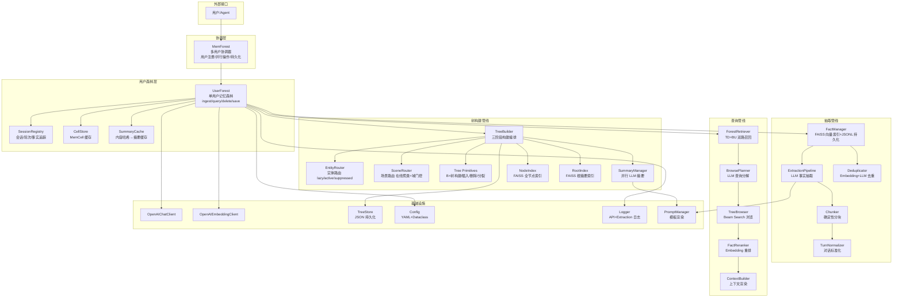

---

## 2. 写入路径设计（Ingest Pipeline）

### 2.1 完整写入流程

```mermaid
flowchart TD
    INPUT["输入: session_id + turns"] --> NORM["normalize_turns<br/>字段归一化 + 时间解析"]

    NORM --> CHK["chunk_session<br/>按 max_turns/max_chars/time_gap/hard_boundary 切分"]
    CHK --> CELLS["MemCell 列表"]

    CELLS --> SCHED["ExtractionManager<br/>max_inflight 并发调度"]
    SCHED --> EXT["ChunkExtractionPipeline._extract_cell_impl<br/>渲染 Prompt → 调用 LLM → 解析 JSON"]
    EXT --> ITEMS["MemoryItem 列表"]

    ITEMS --> AGG["聚合为 SessionExtractionResult"]
    AGG --> FM_ADD["FactManager.add_session_result"]

    FM_ADD --> TIME_FB["_apply_cell_time_fallbacks<br/>时间信息回退"]
    TIME_FB --> DEDUP_FLOW["add_memory_items 三阶段去重"]

    subgraph 三阶段去重
        DEDUP_FLOW --> PA["Phase A: 候选收集<br/>精确匹配 + FAISS 近邻 + 批内配对"]
        PA --> PB["Phase B: LLM 判定<br/>LLMFactEquivalenceJudge<br/>并查集合并等价组"]
        PB --> PC["Phase C: 应用决策<br/>插入新事实 / 合并到已有事实"]
    end

    PC --> FACT_IDS["canonical_fact_ids"]
    FACT_IDS --> C2F["构建 cell_to_facts 映射"]

    C2F --> TB_ING["TreeBuilder.ingest_session"]

    subgraph 树构建三阶段
        TB_ING --> P1["Phase 1: Structure<br/>EntityRouter + SceneRouter 路由<br/>insert_fact / insert_cell"]
        P1 --> P2["Phase 2: Summarize<br/>L0 直通 + L1+ LLM 并行摘要"]
        P2 --> P3["Phase 3: Index<br/>embed_roots + build_node_index"]
    end

    P3 --> SAVE["TreeStore.save_tree + SessionRegistry.register"]
    SAVE --> REWIRE["_rewire_query_pipeline<br/>确保查询管线引用最新索引"]

    style 三阶段去重 fill:#fff9c4
    style 树构建三阶段 fill:#e8f5e9
```

### 2.2 事实去重策略

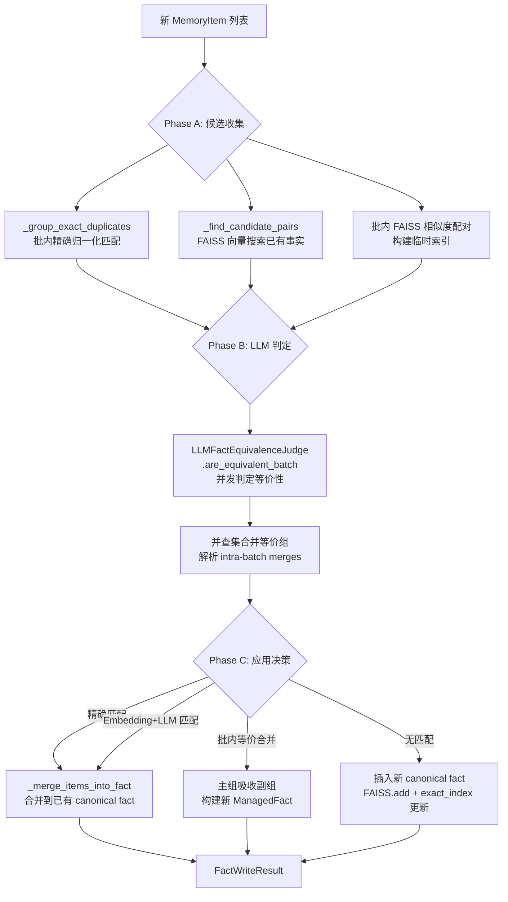

---

## 3. 树构建设计（Tree Building）

### 3.1 三阶段构建管线

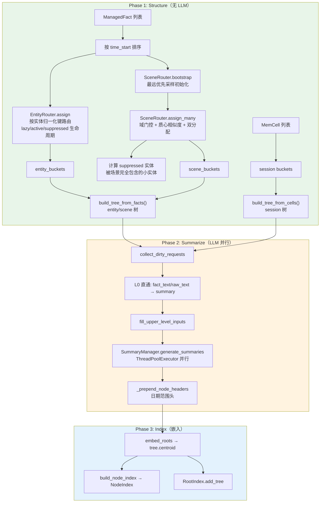

### 3.2 MemTree 内部结构

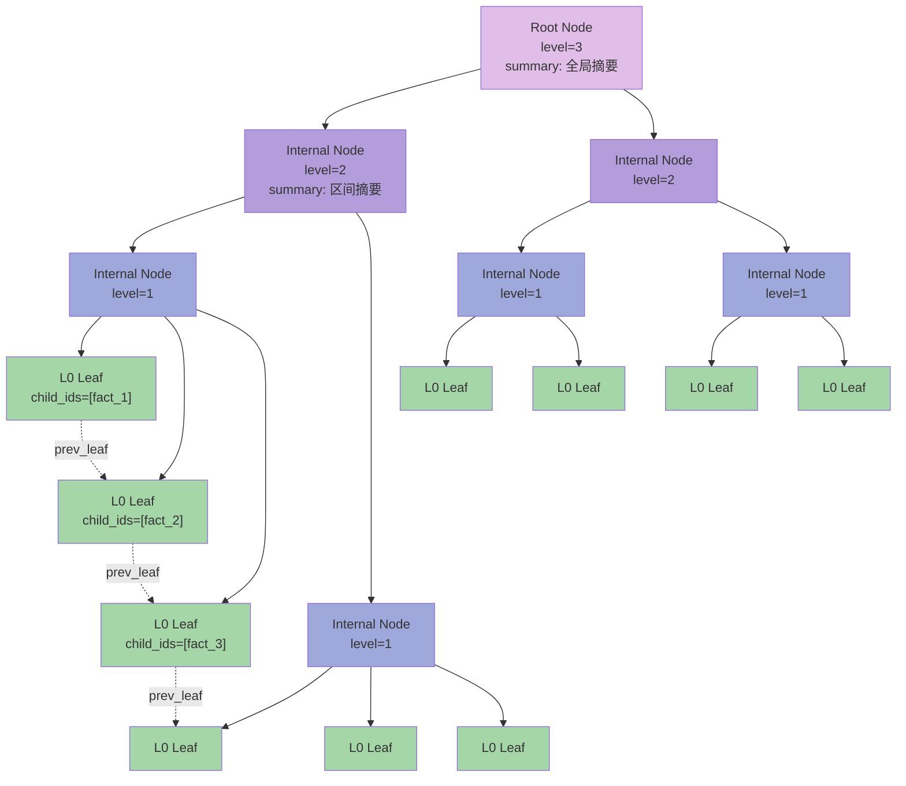

### 3.3 场景路由器核心逻辑

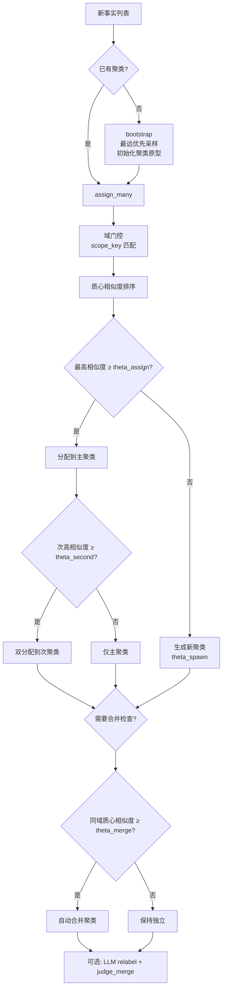

---

## 4. 查询路径设计（Query Pipeline）

### 4.1 五阶段查询流水线

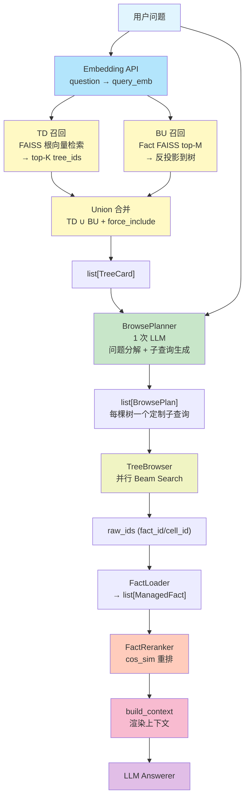

### 4.2 Beam Search 内部流程

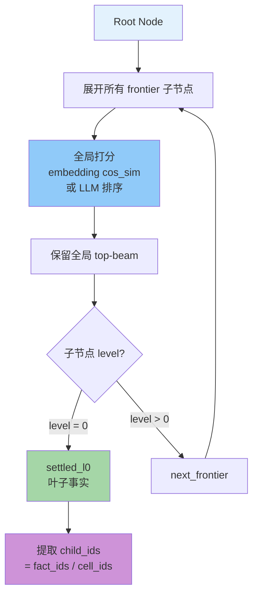

### 4.3 两种运行模式对比

| 维度 | Lightweight | Agentic |
|------|------------|---------|
| Planner | 关闭 | 开启（1 次 LLM） |
| Beam Width | 3 | 10 |
| LLM Browse | 关闭 | 开启 |
| LLM 调用次数 | 1（仅 answer） | 2 + N_nodes |
| 目标场景 | 低延迟、低成本 | 高精度、复杂问题 |

---

## 5. 删除与维护设计

### 5.1 删除流程

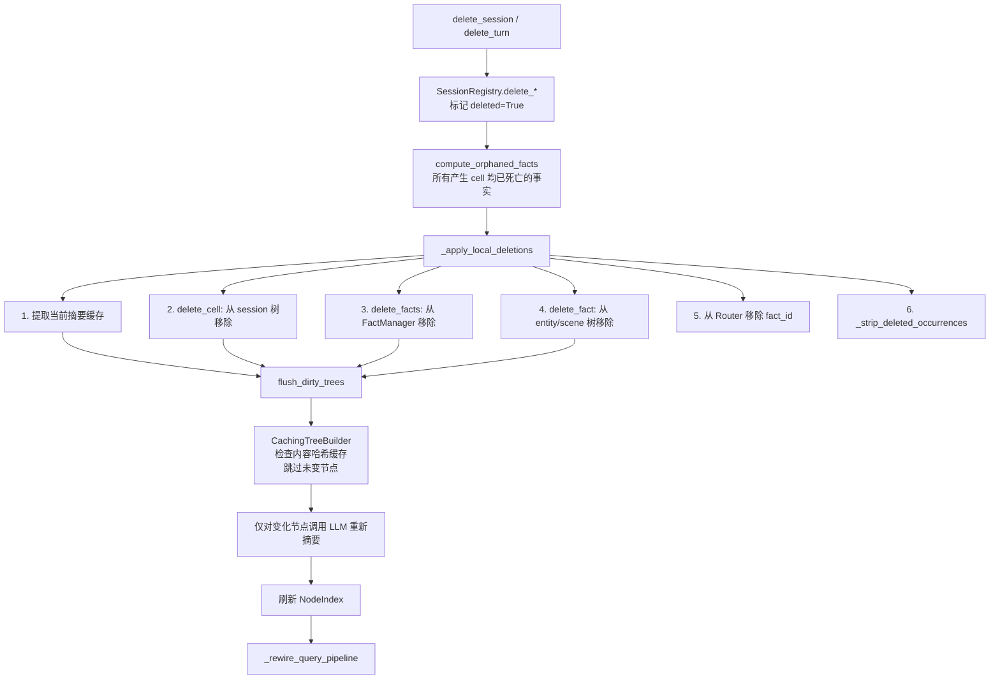

### 5.2 摘要缓存优化

删除重建时，`CachingTreeBuilder` 通过内容哈希缓存避免冗余 LLM 调用：

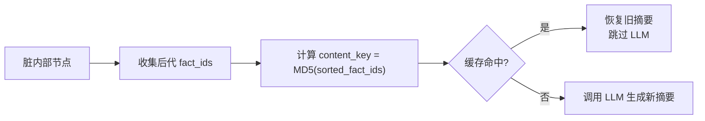

---

## 6. 森林合并设计（Forest Merge）

### 6.1 七步合并流水线

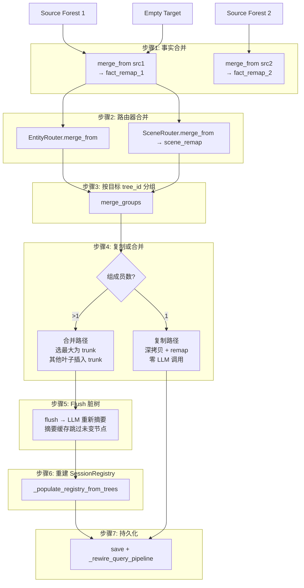

### 6.2 合并优化要点

| 优化 | 说明 |
|------|------|
| 复制路径零 LLM | 单成员树深拷贝，摘要和嵌入原封不动 |
| 仅 flush 合并树 | 只有吸收了新叶子的 trunk 需要 LLM 重新摘要 |
| 摘要缓存复用 | CachingTreeBuilder 检查内容哈希，未变节点跳过 LLM |
| FAISS 向量直传 | NodeIndex 条目直接复制嵌入向量 |
| 精确+余弦双路映射 | fact_remap 先精确文本匹配，再 FAISS 余弦回退 |

---

## 7. 实体生命周期管理

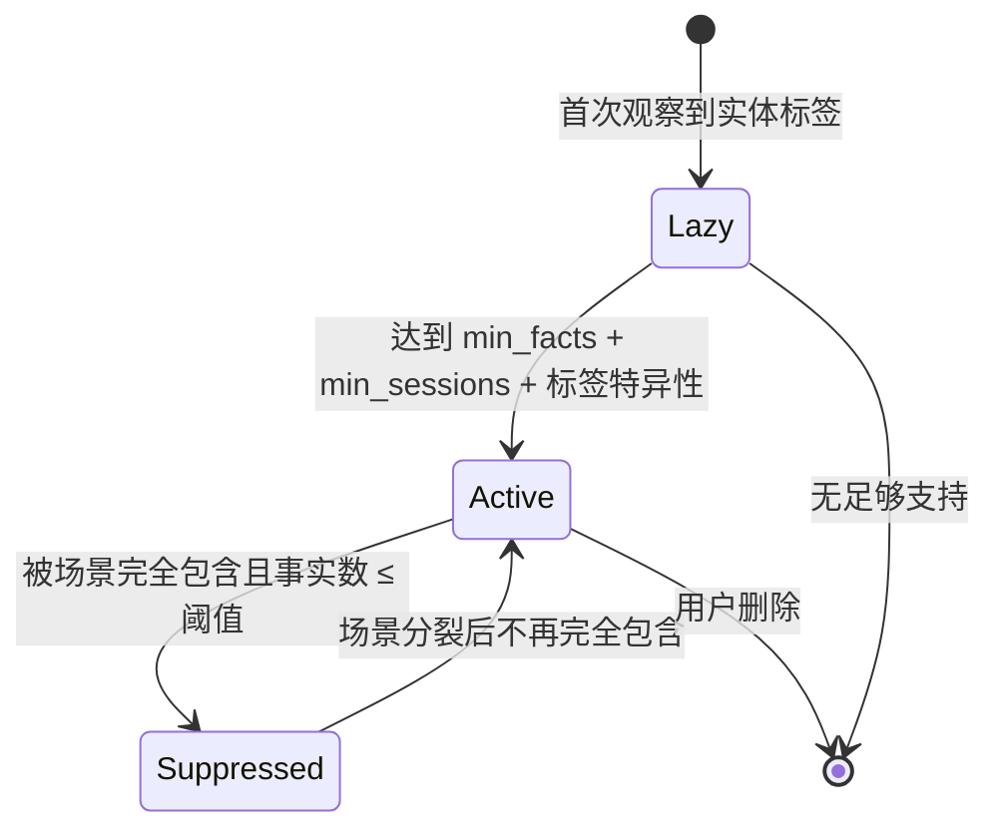

---

## 8. ID 生成策略

所有 ID 均为确定性生成（基于内容哈希），确保幂等处理：

| ID 类型 | 生成规则 |
|---------|---------|
| `turn_id` | `{session_id}#turn_{idx:04d}` 或 `content_id` |
| `cell_id` | `{session_id}#cell_{chunk_index:04d}_{md5_digest[:12]}` |
| `item_id` | `item_{md5(prefix\|seed\|index\|value)[:16]}` |
| `fact_id` | `fact_{md5(session_id\|cell_id\|item_id\|fact_text)[:16]}` |
| `node_id` | `{tree_id}:L{level}:{index}` |
| `tree_id` | `entity:{key}` / `scene:{label}_{uuid8}` / `session:{id}` |

---

## 9. 持久化策略

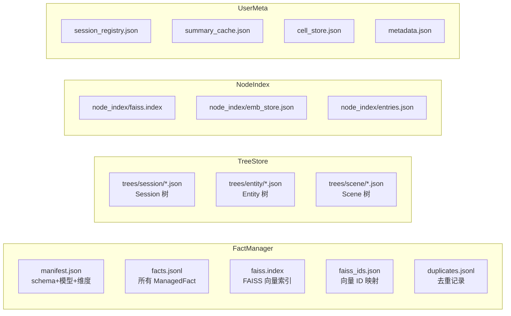

---

## 10. 关键设计决策

### 10.1 为什么使用三种树视图？

- **Session 树**：保留对话的原始时序结构和上下文，支持 cell 级精确检索
- **Entity 树**：按实体聚合跨会话事实，解决"关于 X 的一切"类查询
- **Scene 树**：数据驱动的主题聚类，捕获隐含的语义关联，弥补实体路由的盲区

### 10.2 为什么 L0 摘要直通？

Entity/Scene L0 是单个原子事实，无需压缩；Session L0 的 LLM 摘要实际会膨胀文本（0.7x 压缩比），真正的压缩从 L1 开始（k 个子节点合并）。

### 10.3 为什么使用 Union 召回？

TD（根向量检索）速度快但可能遗漏深层事实；BU（事实级检索再聚合）精度高但需 FactManager。Union 合并在 K=10 时达到 100% essential fact coverage。

### 10.4 为什么使用全局 Beam Search？

旧实现按父节点保留 top-beam（导致 beam^depth 复杂度），新实现全局 top-beam（保证最终 L0 集合不超过 beam 个节点），更可控。
