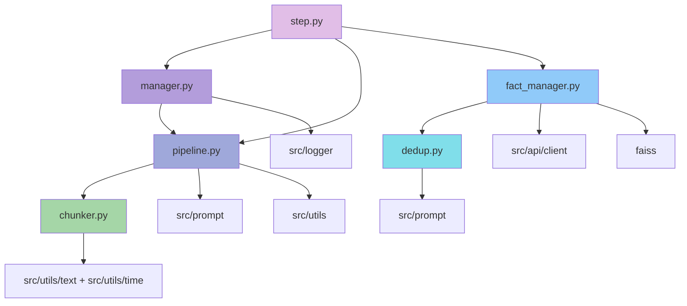

# MemForest Extraction 模块深入分析

## 1. 模块概述

`src/extraction/` 模块是 MemForest 系统的**记忆抽取核心引擎**，负责将原始对话（多轮会话）转化为结构化的、去重的、持久化的 canonical facts（规范事实）。其核心职责包括：

- **对话标准化与分块**：将原始对话轮次归一化为统一格式，并按语义/时间/长度边界切分为 `MemCell`
- **LLM 事实抽取**：对每个 `MemCell` 调用 LLM 提取结构化的 `MemoryItem`
- **事实去重**：通过 Embedding 相似度 + LLM 判定，识别并合并语义等价的事实
- **规范事实持久化**：将去重后的事实存入 FAISS 向量索引 + JSONL 文件，支持增量写入与跨会话合并
- **并发调度**：支持多请求、多 cell 级别的并行抽取

---

## 2. 每个文件的核心类/函数及其职责

### 2.1 `chunker.py` — 对话标准化与确定性分块

| 类/函数 | 职责 |
|---|---|
| `normalize_turns(session_id, turns)` | 将原始 turn 字典列表归一化为 `NormalizedTurn` 列表，统一 speaker_tag/speaker_name/text/timestamp 等字段 |
| `chunk_session(session_id, turns, *, config)` | 将一个会话按 `ChunkingConfig` 确定性切分为 `MemCell` 列表。切分依据：最大轮次数、最大字符数、最大时间间隔、硬边界标记 |
| `_render_chunk_text(turns)` | 将轮次列表渲染为 `[timestamp] speaker: text` 格式的文本 |

### 2.2 `dedup.py` — Embedding 优先、LLM 确认的事实去重

| 类/函数 | 职责 |
|---|---|
| `FactEquivalenceJudge` (Protocol) | 事实等价判定协议接口 |
| `LLMFactEquivalenceJudge` | 基于 LLM 的事实等价判定器 |
| `deduplicate_fact_texts(...)` | 对文本列表执行去重：精确匹配 → Embedding 候选 → LLM 判定 → 并查集合并 |
| `deduplicate_memory_items(...)` | 对 `MemoryItem` 列表执行去重 |
| `_UnionFind` | 并查集实现，用于合并等价索引 |

### 2.3 `fact_manager.py` — 持久化规范事实管理器

| 类/函数 | 职责 |
|---|---|
| `FactManager` | 核心事实存储管理器，基于 FAISS 向量索引 + JSONL 持久化 |
| `add_session_result(result)` | 接收 `SessionExtractionResult`，应用 cell 时间回退后写入事实库 |
| `add_memory_items(items)` | **核心方法**：三阶段去重写入 |
| `merge_from(other)` | 合并另一个 FactManager 的事实 |
| `search_similar_fact_text/b_by_vector` | 向量/文本搜索相似事实 |

### 2.4 `manager.py` — 请求级抽取调度器

| 类/函数 | 职责 |
|---|---|
| `ExtractionManager` | 抽取请求调度器，协调 pipeline 的分块与抽取，支持请求级并发 |
| `extract_requests(requests)` | 批量处理抽取请求，按 `max_inflight_requests` 并发调度 |

### 2.5 `pipeline.py` — 单次 MemCell 抽取管线

| 类/函数 | 职责 |
|---|---|
| `ChunkExtractionPipeline` | 核心抽取管线，将 MemCell 转化为 `MemoryItem` 列表 |
| `extract_session(session_id, turns)` | 完整会话抽取（分块 -> 逐 cell 抽取） |
| `extract_cell(cell)` | 单 cell 抽取：渲染 prompt → 调用 LLM → 解析响应 |

### 2.6 `runner.py` — LongMemEval 批量抽取运行器

| 类/函数 | 职责 |
|---|---|
| `run_longmemeval_parallel(...)` | 加载 LongMemEval 数据集，构建抽取请求，并行执行 |

### 2.7 `step.py` — 端到端抽取入口

| 类/函数 | 职责 |
|---|---|
| `ExtractionStep` | 顶层入口类，将 config/prompt/backend/pipeline/manager/fact_manager 全部串联 |
| `run(session_id, turns)` | 执行一次完整的会话抽取 |

---

## 3. 数据流：从输入对话到输出 Canonical Facts

```mermaid
flowchart TD
    subgraph Input["输入层"]
        A[原始对话 turns\nlist of dict] --> B[ExtractionStep.run\nsession_id + turns]
    end

    subgraph Chunking["分块层 (chunker.py)"]
        B --> C[normalize_turns\n字段归一化 + 时间解析]
        C --> D[NormalizedTurn 列表]
        D --> E[chunk_session\n按 max_turns / max_chars / time_gap / hard_boundary 切分]
        E --> F[MemCell 列表\n每个 cell 含 1~N 个 turns]
    end

    subgraph Scheduling["调度层 (manager.py)"]
        F --> G[ExtractionManager.extract_requests]
        G --> H{max_inflight > 1?}
        H -- 是 --> I[ThreadPoolExecutor\n并发调度 cell 级任务]
        H -- 否 --> J[顺序执行 cell 级任务]
        I --> K[CellExtractionRequest]
        J --> K
    end

    subgraph Extraction["抽取层 (pipeline.py)"]
        K --> L[ChunkExtractionPipeline._extract_cell_impl]
        L --> M[PromptManager.render\n渲染 unified_memory_extraction prompt]
        M --> N[JsonExtractionBackend.generate_json\n调用 LLM]
        N --> O[_parse_cell_response\n解析 JSON 为 MemoryItem 列表]
        O --> P[CellExtractionResult\ncell_summary + memory_items]
    end

    subgraph Aggregation["聚合层"]
        P --> Q[聚合所有 cell 结果]
        Q --> R[SessionExtractionResult\nsession_id + cells + memory_items]
    end

    subgraph FactStore["事实存储层 (fact_manager.py)"]
        R --> S{write_facts?}
        S -- 否 --> T[返回 SessionExtractionResult]
        S -- 是 --> U[FactManager.add_session_result]
        U --> V[_apply_cell_time_fallbacks\n时间信息回退]
        V --> W[add_memory_items\n三阶段去重写入]

        subgraph PhaseA["Phase A: 候选收集"]
            W --> W1[_group_exact_duplicates\n批内精确归一化匹配]
            W1 --> W2[_find_candidate_pairs\nFAISS 向量搜索已有事实]
            W2 --> W3[批内 FAISS 相似度配对]
        end

        subgraph PhaseB["Phase B: LLM 判定"]
            W3 --> W4[LLMFactEquivalenceJudge\n.are_equivalent_batch]
            W4 --> W5[并查集合并等价组]
        end

        subgraph PhaseC["Phase C: 应用决策"]
            W5 --> W6{判定结果}
            W6 -- 精确匹配 --> W7[_merge_items_into_fact]
            W6 -- Embedding+LLM 匹配 --> W7
            W6 -- 批内等价合并 --> W8[构建新 ManagedFact]
            W6 -- 无匹配 --> W9[插入新 canonical fact]
        end

        W7 --> W10[FactWriteResult]
        W8 --> W10
        W9 --> W10
        W10 --> W11[FactManager.save\n持久化到磁盘]
    end

    subgraph Persistence["持久化文件"]
        W11 --> X1[manifest.json]
        W11 --> X2[facts.jsonl]
        W11 --> X3[faiss.index]
        W11 --> X4[faiss_ids.json]
        W11 --> X5[duplicates.jsonl]
    end

    style Input fill:#e1f5fe
    style Chunking fill:#f3e5f5
    style Scheduling fill:#fff3e0
    style Extraction fill:#e8f5e9
    style Aggregation fill:#fce4ec
    style FactStore fill:#fff8e1
    style PhaseA fill:#fff9c4
    style PhaseB fill:#fff9c4
    style PhaseC fill:#fff9c4
    style Persistence fill:#efebe9
```

---

## 4. 关键数据结构

| 数据结构 | 定义位置 | 说明 |
|---|---|---|
| `ChunkingConfig` | `src/utils/types.py` | 分块配置：max_turns, max_chars, max_time_gap_seconds, hard_boundary_markers |
| `NormalizedTurn` | `src/utils/types.py` | 归一化对话轮次 |
| `MemCell` | `src/utils/types.py` | 内存单元（分块结果） |
| `MemoryItem` | `src/utils/types.py` | 抽取出的记忆项 |
| `ManagedFact` | `src/utils/types.py` | 持久化规范事实 |
| `FactOccurrence` | `src/utils/types.py` | 事实出现记录 |
| `DuplicateFactRecord` | `src/utils/types.py` | 去重记录 |
| `FactWriteResult` | `src/utils/types.py` | 写入结果 |
| `DedupDecision` | `src/extraction/dedup.py` | 去重判定结果 |

---

## 5. 模块间依赖关系

---

## 6. 并发策略

- **请求级并发**：`ExtractionManager` 通过 `ThreadPoolExecutor` 实现 cell 级并行，`max_inflight_requests` 控制最大并发数
- **LLM 判定并发**：`LLMFactEquivalenceJudge.are_equivalent_batch` 通过 `ThreadPoolExecutor` 并发调用 LLM（最大 64 workers）
- **线程安全**：`FactManager` 使用 `threading.RLock` 保护内部状态

---

## 7. ID 生成策略

所有 ID 均为确定性生成（基于内容的 MD5/SHA1 哈希），确保相同输入产生相同 ID，支持幂等处理：

| ID 类型 | 生成规则 |
|---------|---------|
| `turn_id` | `{session_id}#turn_{idx:04d}` 或 `content_id` |
| `cell_id` | `{session_id}#cell_{chunk_index:04d}_{md5_digest[:12]}` |
| `item_id` | `item_{md5(prefix\|seed\|index\|value)[:16]}` |
| `fact_id` | `fact_{md5(session_id\|cell_id\|item_id\|fact_text)[:16]}` |
