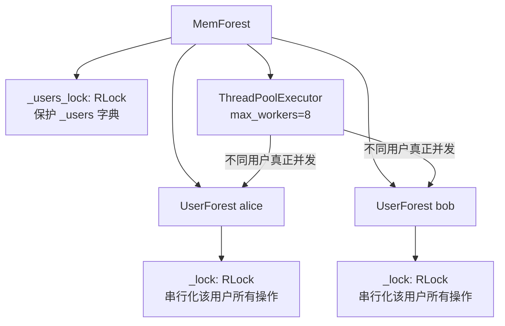
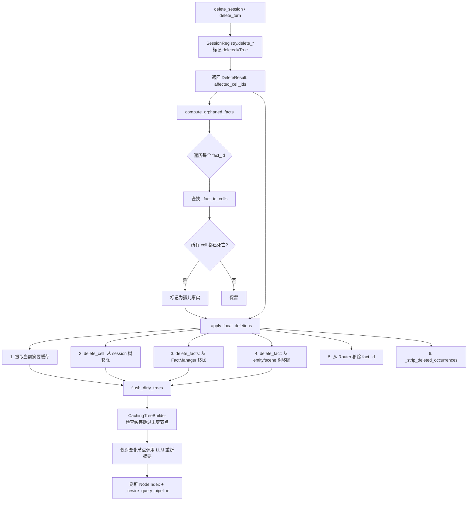
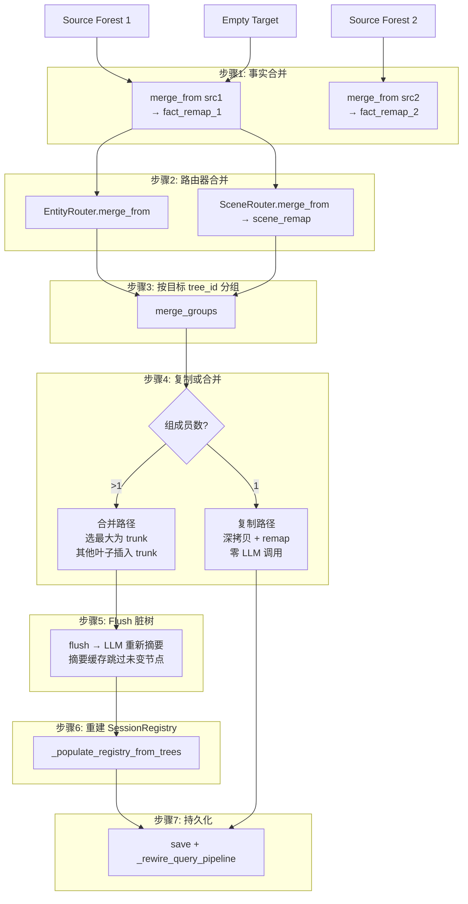
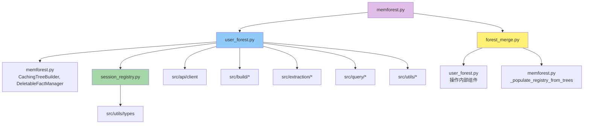

# MemForest Forest 模块深入分析

## 1. 模块概述

`src/forest/` 是 MemForest 系统的**多用户记忆森林协调层**，核心职责包括：

- **多用户隔离管理**：为每个用户维护独立的记忆森林（UserForest），用户间数据完全隔离
- **完整生命周期管理**：覆盖从对话摄入、事实提取与去重、树构建与增量更新、查询召回，到会话/轮次删除与树重建的全流程
- **高效多森林合并**：支持将多个用户的森林合并为一个目标森林
- **线程安全的并行操作**：通过 RLock + ThreadPoolExecutor 实现多用户并行查询与摄入
- **持久化与恢复**：所有组件均可序列化到磁盘并从磁盘恢复

---

## 2. 每个文件的核心类/函数及其职责

### 2.1 `memforest.py` — 多用户协调器与增强组件

| 类/函数 | 职责 |
|---------|------|
| `DeletableFactManager(FactManager)` | 扩展 FactManager，增加 `delete_facts()` 和 `load_managed_facts()` |
| `CachingTreeBuilder(TreeBuilder)` | 扩展 TreeBuilder，在 flush 时检查内容哈希缓存，避免冗余 LLM 调用 |
| `MemForest` | 顶层多用户协调器，提供用户注册、单用户操作、并行操作、持久化、legacy 导入、森林合并等 API |
| `ImportResult` | legacy 导入结果数据类 |

### 2.2 `user_forest.py` — 单用户记忆森林

| 类/函数 | 职责 |
|---------|------|
| `UserForest` | 封装单个用户的所有记忆组件，所有公开方法由 RLock 保护 |
| `IngestResult` | 摄入结果数据类 |
| `ingest_session(session_id, turns)` | 完整摄入流水线（8 步） |
| `delete_session(session_id)` | 标记会话删除 + 孤儿检测 + 局部树重建 |
| `delete_turn(session_id, turn_id)` | 标记轮次删除 + 孤儿检测 + 局部树重建 |
| `query(question, ...)` | 运行查询流水线 |
| `save()` / `load()` | 持久化/恢复 7 类数据 |

**UserForest 拥有的组件**：

| 组件 | 类型 | 职责 |
|------|------|------|
| `_fact_manager` | DeletableFactManager | 事实存储 + FAISS 去重 + 删除 |
| `_tree_builder` | CachingTreeBuilder | 增量树构建 + 摘要缓存 |
| `_tree_store` | TreeStore | 树 JSON 持久化 |
| `_node_index` | NodeIndex | FAISS 索引（recall + browse） |
| `_query_pipeline` | ForestQuery | recall → plan → browse 查询流水线 |
| `_extraction_pipeline` | ChunkExtractionPipeline | turns → MemCells → MemoryItems |
| `_registry` | SessionRegistry | session/turn/fact 追踪 + 删除簿记 |
| `_cell_store` | dict[str, MemCell] | 内存中的 cell 缓存 |
| `_summary_cache` | dict[str, str] | 内容哈希 → 摘要缓存 |

### 2.3 `session_registry.py` — 会话/轮次/事实追踪

| 类/函数 | 职责 |
|---------|------|
| `SessionRegistry` | 单用户的 session/cell/turn/fact 追踪器，线程安全 |
| `register_session(session_id, cells, cell_to_facts)` | 记录新摄入的会话 |
| `delete_session(session_id)` | 标记整个会话及其所有 turn 为已删除 |
| `delete_turn(session_id, turn_id)` | 标记单个 turn 为已删除 |
| `compute_orphaned_facts(all_fact_ids)` | 计算所有产生 cell 均已死亡的事实 |

### 2.4 `forest_merge.py` — 多森林高效合并

| 类/函数 | 职责 |
|---------|------|
| `merge_user_forests(sources, target)` | 主入口，将多个源 UserForest 合并到空的目标 UserForest |
| `ForestMergeResult` | 合并结果数据类 |
| `_build_fact_remap(source_fm, target_fm)` | 构建源事实 ID → 目标事实 ID 的映射 |
| `_rekey_tree(tree, new_tree_id)` | 深拷贝树并重写 tree_id |
| `_remap_tree_fact_ids(tree, fact_remap)` | 将树内 fact_id 引用重映射 |

---

## 3. UserForest 完整生命周期

```mermaid
flowchart TD
    subgraph 注册阶段
        A[MemForest.register_user] --> B[创建 UserForest 实例]
        B --> C{磁盘有数据?}
        C -->|是| D[uf.load 恢复全部状态]
        C -->|否| E[空森林就绪]
        D --> E
    end

    subgraph 摄入阶段
        F[ingest_session] --> G[ChunkExtractionPipeline.extract_session]
        G --> H[得到 cells + memory_items]
        H --> I[FactManager.add_session_result]
        I --> J[FAISS去重 + LLM等价判断]
        J --> K[构建 cell_to_facts 映射]
        K --> L[TreeBuilder.ingest_session]
        L --> M[EntityRouter/SceneRouter 路由]
        M --> N[insert_fact / insert_cell]
        N --> O[flush dirty ancestors]
        O --> P[TreeStore 持久化树]
        P --> Q[重建 NodeIndex]
        Q --> R[SessionRegistry.register_session]
        R --> S[缓存 cells 到 cell_store]
    end

    subgraph 查询阶段
        T[query] --> U[_rewire_query_pipeline]
        U --> V[ForestQuery.query]
        V --> W[Recall → Plan → Browse]
        W --> X[返回 QueryResult]
    end

    subgraph 删除阶段
        AA[delete_session / delete_turn] --> AB[SessionRegistry.delete_*]
        AB --> AC[compute_orphaned_facts]
        AC --> AD[_apply_local_deletions]
        AD --> AE[delete_cell / delete_facts / delete_fact]
        AE --> AF[flush_dirty_trees]
        AF --> AG[摘要缓存: 保留未变节点摘要]
        AG --> AH[刷新 NodeIndex + _rewire]
    end

    subgraph 持久化阶段
        AL[save] --> AM[FactManager.save]
        AM --> AN[TreeStore.save_tree]
        AN --> AO[NodeIndex.save]
        AO --> AP[SessionRegistry.save]
        AP --> AQ[summary_cache.json]
        AQ --> AR[cell_store.json]
        AR --> AS[metadata.json]
    end

    E --> F
    S --> T
    S --> AA
    T --> AL
    AH --> AL
```

---

## 4. 多用户并行机制

- **不同用户**：真正并发（独立 RLock）
- **同一用户**：操作串行化（共享 RLock）
- **API 客户端**：OpenAI SDK 连接池线程安全，所有用户共享

---

## 5. 删除与孤儿检测流程

---

## 6. Forest Merge 七步流水线

---

## 7. 合并优化要点

| 优化 | 说明 |
|------|------|
| **复制路径零 LLM** | 单成员树深拷贝后直接使用，摘要和嵌入原封不动 |
| **仅 flush 合并树** | 只有吸收了新叶子的 trunk 才需要 LLM 重新摘要 |
| **摘要缓存复用** | CachingTreeBuilder 在 flush 时检查内容哈希缓存，未变化的节点跳过 LLM |
| **FAISS 向量直传** | NodeIndex 条目直接复制嵌入向量，无需重新嵌入 |
| **精确+余弦双路映射** | fact_remap 先精确文本匹配，再 FAISS 余弦回退，最大化去重率 |

---

## 8. 模块间依赖关系

