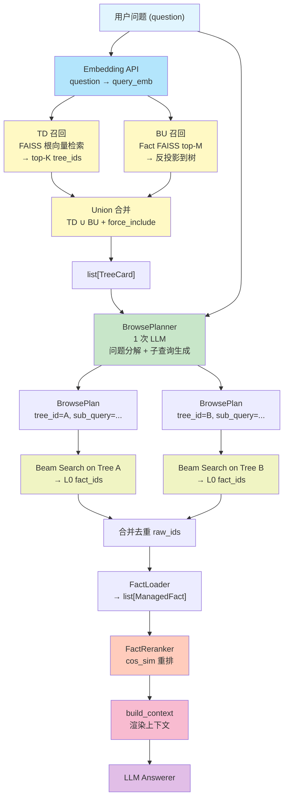
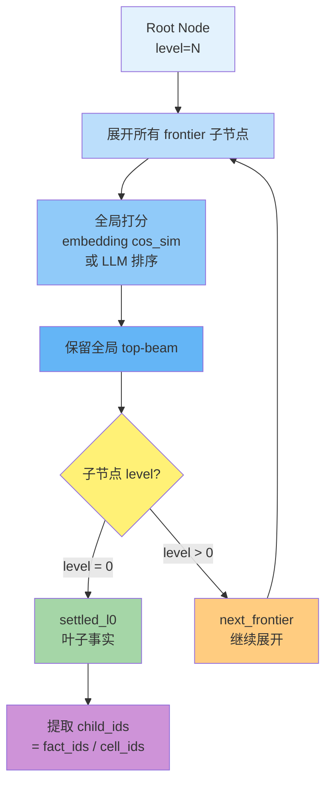
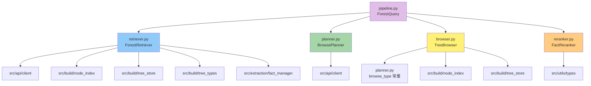

# MemForest Query 模块深入分析

## 1. 模块概述

`src/query/` 模块是 MemForest 系统的**查询层**，负责将用户的自然语言问题转化为可执行的检索计划，在多棵记忆树中进行定向搜索，并返回最相关的事实。

核心职责是编排一条 **recall → plan → browse → rerank → answer** 的五阶段流水线，从粗粒度（树级召回）到细粒度（事实级精排），逐层缩小检索范围。

---

## 2. 每个文件的核心类/函数及其职责

### 2.1 `retriever.py` — ForestRetriever

| 类/函数 | 职责 |
|---------|------|
| `ForestRetriever` | 多方向树级召回器，从整个记忆森林中召回与问题最相关的 top-K 棵树 |
| `recall(question, top_k)` | 返回 top-K 棵 `TreeCard` |
| `_recall_td(query_emb, top_k)` | **自顶向下（TD）**：基于根节点 embedding 的 FAISS 检索 |
| `_recall_bu(query_emb, top_k)` | **自底向上（BU）**：先检索 fact 级 FAISS top-M 条事实，再反投影到所属树 |
| `_force_include(selected)` | 强制包含 `entity:user` 树 |
| `_merge_preserving_order(a, b)` | 合并 TD 和 BU 结果，保留 TD 优先级 |

**三种召回方向**：
- `td`：经典根向量检索，速度快
- `bu`：事实级细粒度检索再聚合到树，精度高
- `union`（默认）：TD top-K 并集 BU top-K

### 2.2 `planner.py` — BrowsePlanner

| 类/函数 | 职责 |
|---------|------|
| `BrowsePlan` (dataclass) | 浏览指令：`(tree_id, sub_query, browse_type, anchor_label)` |
| `DecompositionResult` (dataclass) | 规划器对问题的自分析结果 |
| `BrowsePlanner` | 查询分解规划器，1 次 LLM 调用 |
| `plan(question, tree_cards)` | 为所有召回树生成 `BrowsePlan` 列表 |

**五种浏览类型**：`direct` | `anchor_a` | `anchor_b` | `aggregate` | `preference`

### 2.3 `browser.py` — TreeBrowser

| 类/函数 | 职责 |
|---------|------|
| `TreeBrowser` | 在单棵记忆树上执行 beam search，从根节点下降到 L0 叶子事实 |
| `browse(plan, query_emb, beam_width)` | 对单个 BrowsePlan 执行 beam search |
| `browse_all(plans, query_emb, beam_width, max_workers)` | 并行执行多个 plan |
| `_rank_children_llm(tree, node, question)` | LLM 引导的子节点排序 |

### 2.4 `reranker.py` — FactReranker

| 类/函数 | 职责 |
|---------|------|
| `FactReranker` | 基于 embedding 余弦相似度的事实重排器，零 API 调用 |
| `rerank(facts, query_emb, top_k)` | 返回 top_k 个 `ManagedFact` |

### 2.5 `pipeline.py` — ForestQuery

| 类/函数 | 职责 |
|---------|------|
| `QueryResult` (dataclass) | 一次查询的完整输出 |
| `ForestQuery` | 流水线编排器，组合 Retriever、Planner、Browser、Reranker |
| `query(question, ...)` | 执行完整五阶段流水线 |
| `build_context(result)` | 将 `QueryResult` 渲染为文本上下文块 |
| `FactLoader` (抽象类) | fact_id/cell_id → `ManagedFact` 的加载接口 |

---

## 3. 数据流：从用户查询到返回结果

---

## 4. Beam Search 内部流程

**核心算法**：
1. 初始化 frontier = [root]，settled_l0 = []
2. 每轮：展开所有 frontier 节点的子节点，全局打分排序
3. 保留全局 top-(beam - |settled_l0|) 个子节点
4. L0 子节点进入 settled_l0，内部节点进入下一轮 frontier
5. 重复直到 frontier 为空或 beam 预算耗尽
6. 从 settled_l0 节点的 child_ids 中提取最终 fact/cell id

---

## 5. 关键数据结构

| 数据结构 | 定义位置 | 说明 |
|----------|---------|------|
| `QueryResult` | `pipeline.py` | 一次查询的完整输出，包含所有中间结果 |
| `BrowsePlan` | `planner.py` | 浏览指令：`(tree_id, sub_query, browse_type, anchor_label)` |
| `DecompositionResult` | `planner.py` | 规划器自分析结果：`question_type`, `sub_queries` |

---

## 6. 模块间依赖关系

---

## 7. 两种运行模式对比

| 维度 | Lightweight | Agentic |
|------|------------|---------|
| Planner | 关闭（sub_query = 原始问题） | 开启（1 次 LLM 分解） |
| Beam Width | 3 | 10 |
| LLM Browse | 关闭 | 开启（所有 browse_type） |
| max_facts | 20 | 0（不截断） |
| LLM 调用次数 | 1（仅 answer） | 2 + N_nodes |
| 目标场景 | 低延迟、低成本 | 高精度、复杂问题 |

---

## 8. 关键设计决策

1. **始终下降到 L0**：内部层会压缩掉约 43% 的事实，必须到达叶子层才能获取完整事实
2. **Union 召回**：TD+BU 合并在 K=10 时达到 100% essential fact coverage
3. **全局 Beam Search**：保证最终 L0 集合不超过 beam 个节点
4. **Embedding 排序 vs LLM 排序**：纯 embedding 排序与根引导排序差异 < 0.8pp，但 LLM 排序在 agentic 模式下显著提升
5. **LLM Rerank（recall 阶段）**：消融显示净收益为零，默认关闭
