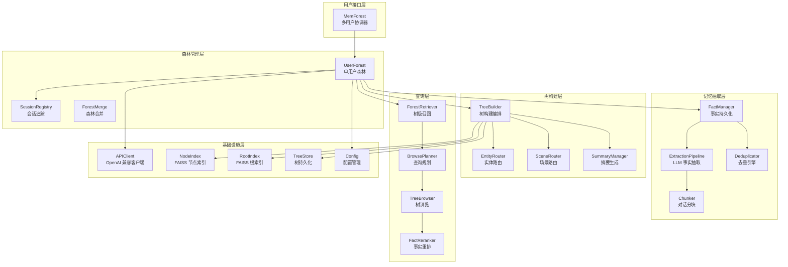
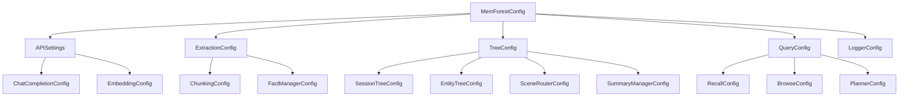
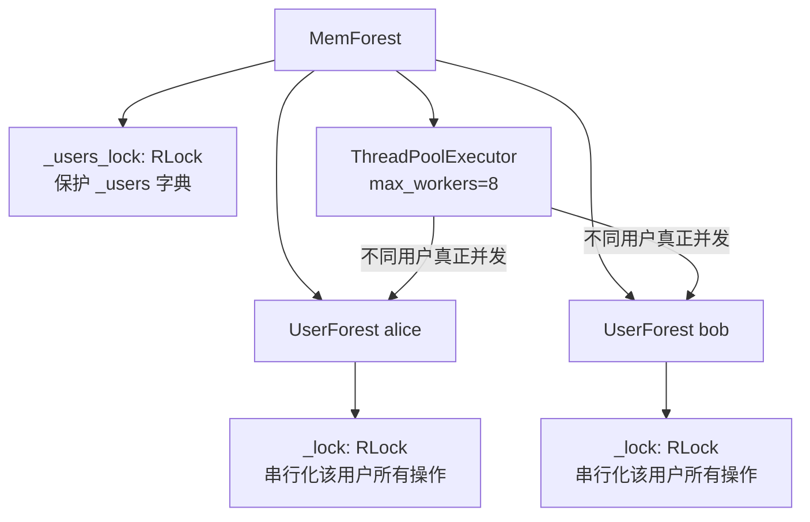

# MemForest 项目规格说明

## 1. 项目概述

**MemForest** 是一个面向长上下文 LLM Agent 的持久化记忆系统，发表于 VLDB 2027。其核心思想是将对话会话转化为规范事实（Canonical Facts），通过分层时序索引（MemTree）组织记忆，并通过粗到细的检索策略（Recall → Browse）实现高效记忆召回。

### 核心设计理念

- **Canonical Facts**：稳定的、带时间锚定的写入单元，从对话中提取
- **MemTree**：带作用域的时序索引，叶子保留时间局部证据，内部节点汇总连续区间
- **三棵互补树视图**：Session 树、Entity 树、Scene 树
- **局部化维护**：更新仅刷新受影响的树路径和派生构件
- **粗到细检索**：查询先召回相关树，再从区间摘要浏览到叶子证据

---

## 2. 系统架构总览



---

## 3. 核心数据流

### 3.1 写入路径（Ingest）


### 3.2 读取路径（Query）


---

## 4. 模块职责矩阵

| 模块 | 路径 | 核心职责 |
|------|------|----------|
| **api** | `src/api/` | OpenAI 兼容的 Chat/Embedding 客户端封装 |
| **build** | `src/build/` | 树构建、路由、摘要、索引、持久化 |
| **config** | `src/config/` | YAML 配置加载与类型化数据类 |
| **extraction** | `src/extraction/` | 分块、抽取、去重、事实存储管理 |
| **forest** | `src/forest/` | 多用户协调、单用户森林、会话追踪、森林合并 |
| **logger** | `src/logger/` | API 调用日志与抽取阶段日志 |
| **prompt** | `src/prompt/` | 抽取/去重/摘要/回答/Judge 的 Prompt 模板 |
| **query** | `src/query/` | 召回、规划、浏览、重排、回答流水线 |
| **utils** | `src/utils/` | 共享数据类、时间工具、文本工具 |

---

## 5. 关键数据结构

### 5.1 核心实体

| 数据结构 | 说明 |
|----------|------|
| `NormalizedTurn` | 归一化对话轮次 |
| `MemCell` | 内存单元（分块结果），含 1~N 个 turns |
| `MemoryItem` | LLM 抽取的原始记忆项 |
| `ManagedFact` | 持久化规范事实（去重后），含 fact_id、embedding、occurrences |
| `FactOccurrence` | 事实出现记录，链接到原始提取项 |

### 5.2 树结构

| 数据结构 | 说明 |
|----------|------|
| `MemTree` | 完整记忆树，含 nodes、session_leaves、centroid |
| `MemTreeNode` | 树节点，level=0 为叶子，level>0 为内部节点 |
| `SessionLeaf` | Session 树叶节点载荷（cell 级） |
| `TreeCard` | 轻量级树描述符，存入 FAISS 根索引 |

### 5.3 路由结构

| 数据结构 | 说明 |
|----------|------|
| `EntityCandidate` | 实体路由器追踪的候选实体（lazy/active/suppressed） |
| `SceneCluster` | 场景路由器的动态聚类 |

### 5.4 查询结构

| 数据结构 | 说明 |
|----------|------|
| `BrowsePlan` | 浏览指令（tree_id, sub_query, browse_type） |
| `DecompositionResult` | 规划器问题分解结果 |
| `QueryResult` | 一次查询的完整输出 |

---

## 6. 三种树视图对比

| 维度 | Session 树 | Entity 树 | Scene 树 |
|------|-----------|-----------|----------|
| **路由方式** | 按 session_id 直接映射 | EntityRouter 基于实体名归一化 | SceneRouter 基于嵌入相似度在线聚类 |
| **叶节点载荷** | SessionLeaf（cell 级） | fact_id | fact_id |
| **扇出 k** | 3 | user=10, entity=8 | 10 |
| **L0 摘要** | 直通 cell raw_text | 直通 fact_text | 直通 fact_text |
| **生命周期** | 随会话创建 | lazy → active → suppressed | bootstrap → 动态分配/合并 |
| **特殊功能** | cell 上下文浏览 | entity:user 全局树 | 域门控 + 双分配 |

---

## 7. 配置体系

配置通过 YAML 文件加载，支持 30B 和 4B 两种实验设置：

- `src/config/default.yaml` — Qwen3-30B 设置
- `src/config/default_4b.yaml` — Qwen3-4B 设置

### 配置结构



---

## 8. 运行时数据布局

```
<snapshot_dir>/<user_id>/
├── sqlite/        # Fact 和 turn 存储
├── index/         # FAISS 索引和 sidecar 元数据
├── trees/         # 序列化的 session/entity/scene 树
└── logs/          # 检索追踪和每步 API 日志
```

持久化状态包含：规范事实、作用域分配、树结构、源会话引用。摘要、嵌入和检索索引行是可从持久化状态重新生成的派生构件。

---

## 9. 线程安全与并发模型



- **不同用户**：真正并发（独立 RLock）
- **同一用户**：操作串行化（共享 RLock）
- **API 客户端**：OpenAI SDK 连接池线程安全，所有用户共享

---

## 10. 基准测试与评估

| 基准 | 模型 | 文件 |
|------|------|------|
| LoCoMo | Qwen3-30B | `benchmark/locomo_per_question_30b.csv` |
| LoCoMo | Qwen3-4B | `benchmark/locomo_per_question_4b.csv` |
| LongMemEval-S | Qwen3-30B | `benchmark/longmemeval_per_question_30b.csv` |
| LongMemEval-S | Qwen3-4B | `benchmark/longmemeval_per_question_4b.csv` |

主要指标：pass@1（主指标）和 pass@1--8 曲线。

---

## 11. 依赖项

- Python 3.10+
- FAISS（向量索引）
- OpenAI-compatible Chat Completion 端点
- OpenAI-compatible Embedding 端点
- 实验模型：Qwen3-30B-A3B-Instruct-2507、Qwen3-4B-Instruct-2507、Qwen3-Embedding-0.6B
