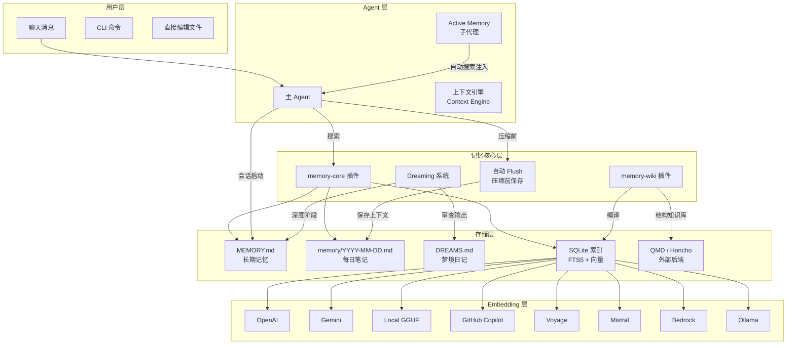
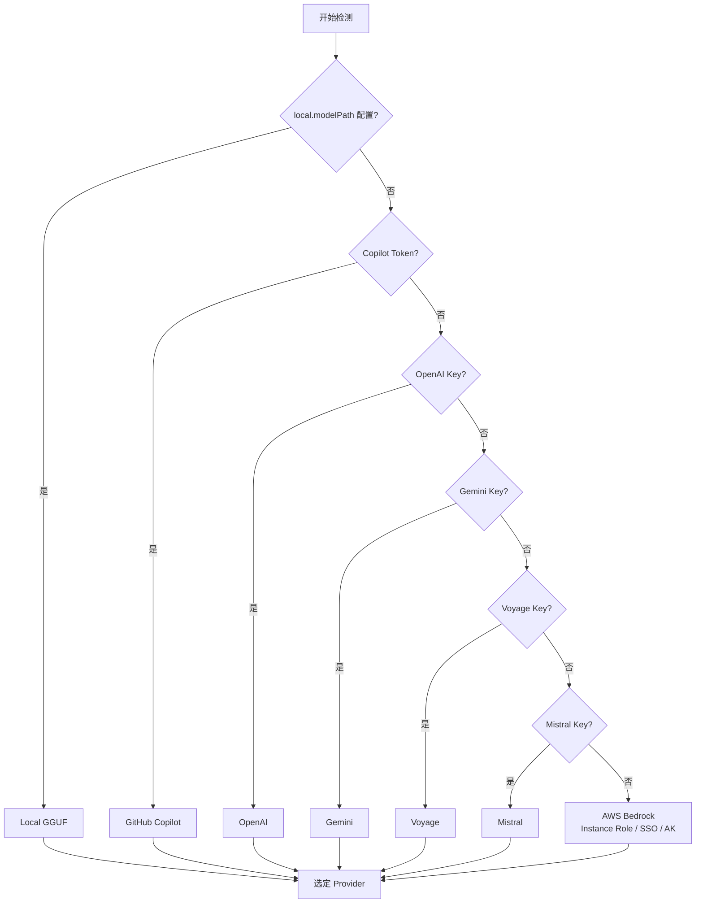
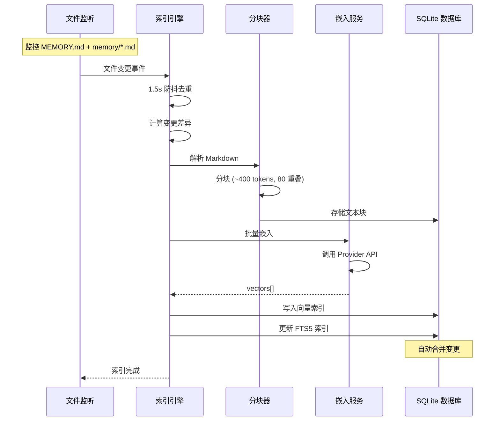
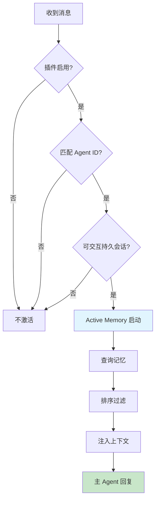
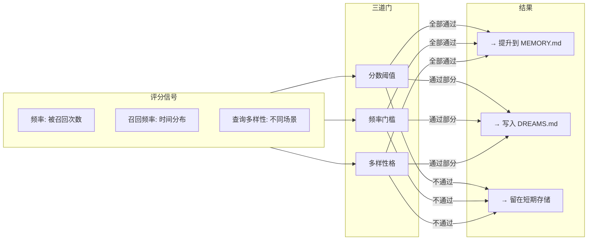
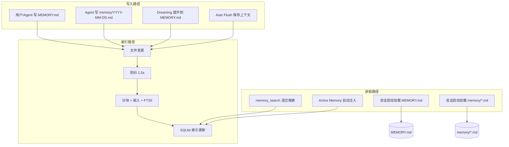

# OpenClaw 记忆模块 — 设计文档 (Design)

> 版本: v2026.6 | 基于 OpenClaw 官方文档分析

---

## 一、系统总体架构



---

## 二、核心模块设计

### 2.1 嵌入 Provider 自动检测优先级



### 2.2 索引管道



### 2.3 Active Memory 激活模型

Active Memory 采用**二门控模型**：



### 2.4 Dreaming 评分模型



---

## 三、记忆文件生命周期

```mermaid
stateDiagram-v2
    [*] --> 会话启动

    会话启动 --> 加载 MEMORY.md
    加载 MEMORY.md --> 加载昨日 memory/YYYY-MM-DD.md
    加载昨日 memory/YYYY-MM-DD.md --> 加载今日 memory/YYYY-MM-DD.md

    加载今日 memory/YYYY-MM-DD.md --> 会话进行中

    会话进行中 --> 用户主动记忆 : ask Agent to remember
    用户主动记忆 --> 写入 MEMORY.md

    会话进行中 --> 自动观察 : Agent 捕获上下文
    自动观察 --> 写入 memory/YYYY-MM-DD.md

    会话进行中 --> 压缩触发 : context window full
    压缩触发 --> 自动 Flush : 保存未持久化上下文
    自动 Flush --> 写入 memory/YYYY-MM-DD.md

    压缩触发 --> 压缩完成

    压缩完成 --> 会话进行中

    会话进行中 --> Dreaming 触发 : 定时/bg
    Dreaming 触发 --> 评分审核
    评分审核 --> 写入 MEMORY.md
    评分审核 --> 写入 DREAMS.md

    会话进行中 --> 会话结束
    会话结束 --> 写入 memory/YYYY-MM-DD.md
    会话结束 --> [*]
```

---

## 四、搜索算法详解

### 4.1 混合搜索评分

```
Score = w_vector × vectorSimilarity + w_bm25 × bm25Score

其中:
- w_vector 和 w_bm25 由配置决定，自动归一化
- vectorSimilarity = cosine(queryEmbedding, docEmbedding)
- bm25Score = Σ IDF(qi) × TF(qi, d) × (k1+1) / (TF(qi,d) + k1 × (1-b + b × |d|/avgdl))
```

### 4.2 后处理管道

```
Raw Results
  → 时间衰减: score × e^(-λ × daysSinceIndexed)
  → MMR 多样化: 惩罚与已选结果相似度高的候选
  → Top-K 截断
  → 返回
```

---

## 五、插件架构

```mermaid
flowchart TB
    subgraph Plugins["记忆插件体系"]
        MC["memory-core<br/>主动记忆 + 召回 + Dreaming"]
        MW["memory-wiki<br/>编译知识库 + 结构文档"]
    end

    subgraph Slots["插件槽位"]
        CE["contextEngine<br/>上下文引擎"]
        AM_SLOT["active-memory<br/>主动记忆子代理"]
    end

    subgraph Ext["外部集成"]
        QMD_P["QMD Provider"]
        HONCHO_P["Honcho Provider"]
    end

    MC -->|提供工具| memory_search
    MC -->|提供工具| memory_get
    MC -->|管理| Dreaming
    MC -->|管理| 自动 Flush

    MW -->|注册| wiki_search
    MW -->|注册| wiki_get
    MW -->|注册| wiki_apply
    MW -->|注册| wiki_lint

    MW -->|输出| OBSIDIAN[Obsidian 兼容]
    MW -->|输出| DASH[Dashboard]

    MC --> QMD_P & HONCHO_P
```

---

## 六、关键设计决策

### 6.1 为什么用文件而不是数据库？

| 维度 | 文件方案 | 纯数据库方案 |
|------|----------|-------------|
| 透明性 | 用户可直接编辑和查看 | 需工具访问 |
| 兼容性 | 版本控制友好 (git) | 需导出 |
| Agent 操控 | Agent 可直接读写 Markdown | 需 API |
| 搜索 | 依赖索引层 | 内置搜索 |

**决策**：文件作为持久化层 + SQLite 作为搜索索引，兼顾透明性和搜索性能。

### 6.2 为什么 Hybrid 搜索？

- 向量搜索擅长语义匹配但不擅长精确查找（ID、错误码）
- BM25 关键词擅长精确匹配但不理解语义
- 两者融合覆盖更广的查询场景

### 6.3 Active Memory 为什么是插件？

- 不是所有用户都需要主动记忆注入
- LLM 调用有额外成本（token + 延迟）
- 可配置性：目标 Agent、会话类型、超时时间、fallback 模型

---

## 七、数据流汇总


