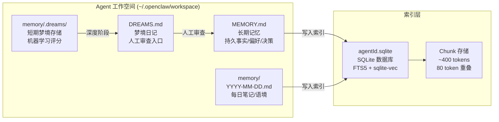
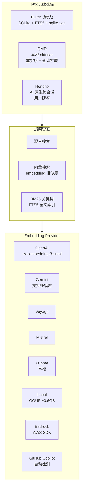
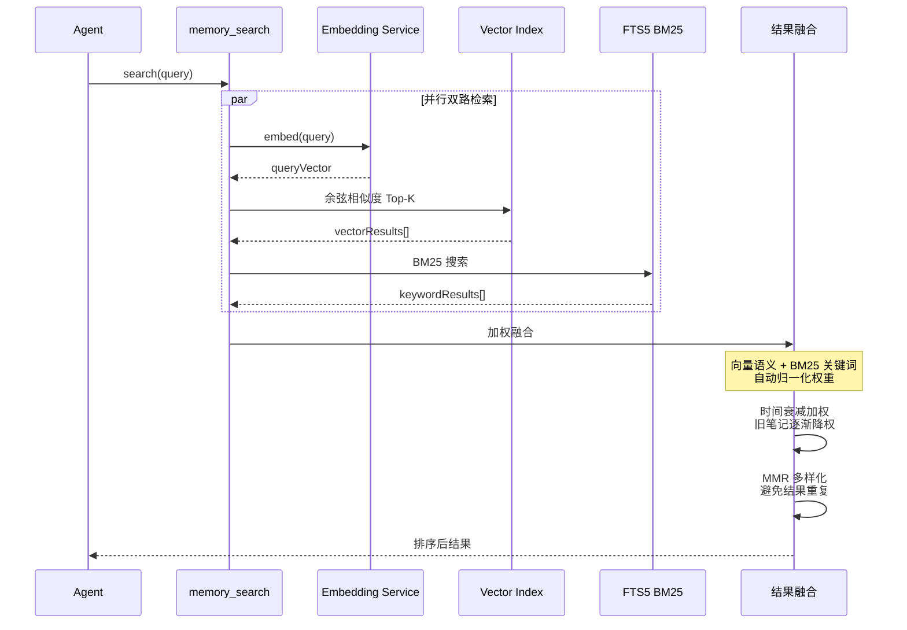
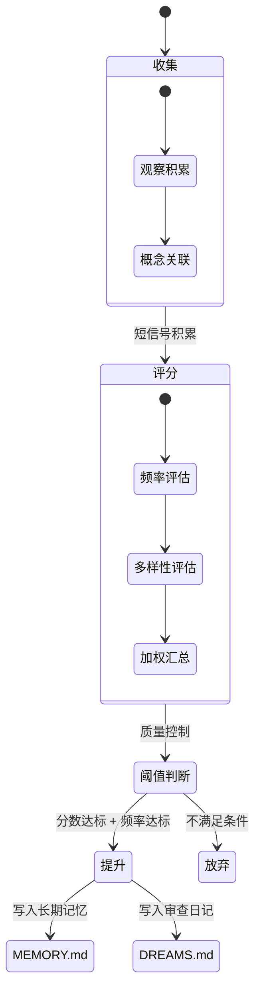
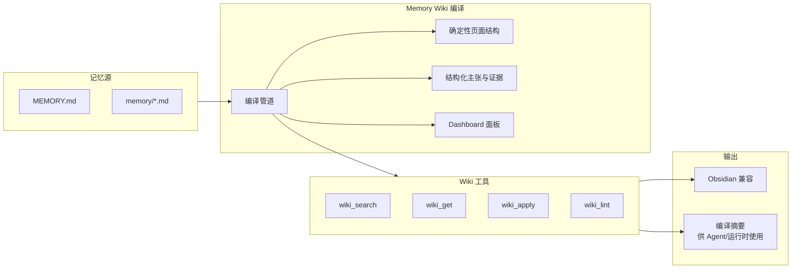

# OpenClaw 记忆模块 — 规格说明书 (Specification)

> 版本: v2026.6 | 基于 OpenClaw 官方文档分析

---

## 一、概述

OpenClaw 的记忆系统是一个**基于文件的持久化记忆架构**，采用"写入磁盘即记住"的设计哲学——模型没有隐藏状态，所有记忆通过读写 Markdown 文件实现持久化。

### 核心设计原则

- **透明性**：所有记忆内容对用户完全可见，存储在 `MEMORY.md` 和 `memory/` 目录中
- **自动持久化**：会话压缩前自动触发记忆保存，防止上下文丢失
- **多后端可选**：Builtin (默认 SQLite) / QMD (本地高阶) / Honcho (AI 原生) 三种后端
- **混合搜索**：向量语义搜索 + BM25 关键词搜索并行融合
- **插件扩展**：Active Memory 子代理、Memory Wiki 知识库等可插拔

---

## 二、记忆文件体系



### 2.1 MEMORY.md — 长期记忆
- 存储持久事实、用户偏好、决策记录
- 每个 DM 会话启动时自动加载
- 格式：纯 Markdown，由 Agent 自行维护

### 2.2 memory/YYYY-MM-DD.md — 每日笔记
- 运行上下文和观察记录
- 自动加载今天和昨天的笔记
- 按日期组织，便于回溯

### 2.3 DREAMS.md — 梦境日记（可选）
- Dreaming 系统的审查入口
- 包含背景回填和深度阶段摘要
- 用户可在此审查哪些内容应提升到 MEMORY.md

---

## 三、记忆后端架构



### 3.1 Builtin 后端（默认）
- **存储**：`~/.openclaw/memory/<agentId>.sqlite` 每个 Agent 独立数据库
- **关键词搜索**：FTS5 全文索引，BM25 评分算法
- **向量搜索**：支持 8 种 Embedding Provider
- **CJK 支持**：三元组分词，中日韩文本兼容
- **加速**：可选 `sqlite-vec` 实现数据库内向量查询
- **索引策略**：
  - 文件变更触发防抖重索引（1.5 秒）
  - Provider/模型变更自动全量重建
  - 手动重建：`openclaw memory index --force`

### 3.2 QMD 后端
- 本地优先 sidecar 模式
- 支持重排序（Cross-Encoder）
- 支持查询扩展（LLM 改写）
- 可索引工作区外目录

### 3.3 Honcho 后端
- AI 原生跨会话记忆
- 用户建模和语义搜索
- 多 Agent 感知

---

## 四、混合搜索管道



### 搜索特性

| 特性 | 说明 |
|------|------|
| 向量搜索 | 语义相似度匹配，"gateway host" ≈ "the machine running OpenClaw" |
| BM25 关键词 | 精确匹配 ID、错误字符串、配置键 |
| 混合融合 | 双路并行、加权合并，单路不可用时另一路独立运行 |
| 时间衰减 | 旧笔记逐渐降低排名权重 |
| MMR 多样化 | 最大边际相关性，避免结果重复 |
| Embedding 自动检测 | 按优先级：Local→Copilot→OpenAI→Gemini→Voyage→Mistral→Bedrock |
| 分词增强 | CJK 三元组分词 + 英文词干提取 |

---

## 五、Active Memory 子代理

```mermaid
flowchart TB
    subgraph Session["可交互会话"]
        MSG[用户消息]
        MAIN[主 Agent 回复]
    end

    subgraph AM["Active Memory 插件"]
        QUERY[查询阶段<br/>queryMode: recent/hybrid]
        RANK[排序阶段<br/>相关性 + 时效性]
        INJECT[注入阶段<br/>maxSummaryChars: 220]
    end

    subgraph Store["记忆存储"]
        MEM[MEMORY.md]
        DAILY[memory/*.md]
        INDEX[SQLite 索引]
    end

    MSG -->|匹配条件| AM
    AM -->|搜索| INDEX
    INDEX --> MEM & DAILY
    AM -->|注入上下文| MAIN

    Note over AM: 超时控制: 15s<br/>fallback 模型: gemini-3-flash<br/>仅在 direct chat 生效
```

### 配置参数

| 参数 | 默认值 | 说明 |
|------|--------|------|
| enabled | true | 启用 Active Memory |
| agents | ["main"] | 目标 Agent |
| allowedChatTypes | ["direct"] | 允许的会话类型 |
| modelFallback | "google/gemini-3-flash" | 回退模型 |
| queryMode | "recent" | 查询模式 |
| promptStyle | "balanced" | 提示风格 |
| timeoutMs | 15000 | 超时控制 |
| maxSummaryChars | 220 | 摘要最大字符数 |

---

## 六、Dreaming（梦境系统）



### 核心流程
1. **收集**：短期信号积累到 `memory/.dreams/`
2. **评分**：频率、召回次数、查询多样性三维评分
3. **阈值判断**：必须通过分数、频率、多样性三道门槛
4. **提升**：合格项写入 `MEMORY.md`，同时写入 `DREAMS.md` 供人工审查

### 背景回填（Grounded Backfill）
- 可重放历史 `memory/YYYY-MM-DD.md` 笔记
- 回填结果写入短期梦境存储（不直接提升到 MEMORY.md）
- 支持回滚：`openclaw memory rem-backfill --rollback`

---

## 七、Memory Wiki 知识库层



### 核心能力
- 确定性页面结构，非原始笔记平铺
- 结构化主张与证据，含矛盾追踪和新鲜度检查
- 生成 Dashboard 面板
- 编译摘要供 Agent 和运行时消费
- 原生工具：`wiki_search`, `wiki_get`, `wiki_apply`, `wiki_lint`

---

## 八、CLI 工具

| 命令 | 功能 |
|------|------|
| `openclaw memory status` | 检查索引状态和 Provider |
| `openclaw memory search "query"` | 命令行搜索 |
| `openclaw memory index --force` | 强制重建索引 |
| `openclaw memory rem-backfill` | 背景回填历史笔记 |

---

## 九、关键技术指标

| 指标 | 说明 |
|------|------|
| Chunk 大小 | ~400 tokens，80 token 重叠 |
| 索引变更响应 | 1.5 秒防抖 |
| Embedding 自动检测 | 8 种 Provider 优先级链 |
| Active Memory 超时 | 15 秒 |
| 搜索模式 | 混合（向量 + BM25）+ 时间衰减 + MMR |
| 多后端 | Builtin / QMD / Honcho |
| 插件层 | Active Memory / Memory Wiki |
| Agent 隔离 | 每个 Agent 独立 SQLite 数据库 |
