# SimpleMem 系统设计文档 (Design)

## 1. 系统架构总览

SimpleMem 采用**分层路由架构**，统一入口通过自动路由机制分发到不同的后端实现。

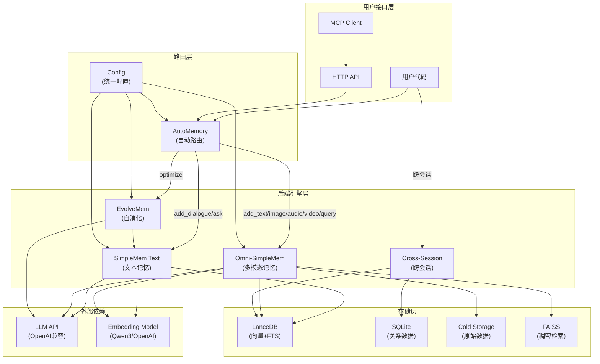

## 2. 核心设计原则

### 2.1 语义无损压缩 (Semantic Lossless Compression)

系统不丢弃任何语义信息，而是通过结构化重述将非结构化交互转换为紧凑的、自包含的记忆单元：

- **代词消解 (Φ_coref)**: 禁止使用代词，所有指代必须显式化
- **时间绝对化 (Φ_time)**: 相对时间转换为 ISO 8601 绝对时间
- **完整主语**: 每条记忆必须包含完整的主语、宾语、时间、地点

### 2.2 多视图索引 (Multi-View Indexing)

每条记忆通过三个互补的索引层进行检索：

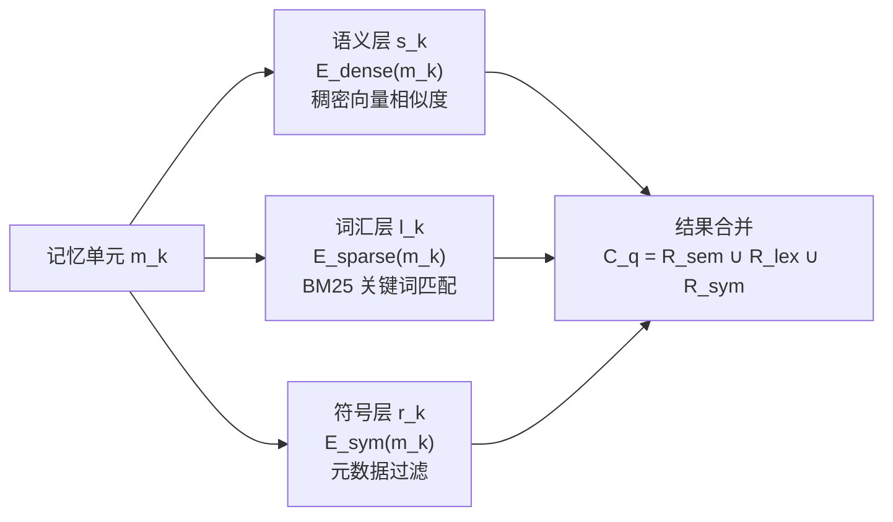

### 2.3 写时合并 (Online Semantic Synthesis)

记忆在写入时即进行冗余合并，而非在查询时去重：

- 滑动窗口处理确保信息完整覆盖
- 前一窗口的记忆条目作为去重上下文
- 生成足够多的记忆条目确保所有信息被捕获

### 2.4 意图感知检索 (Intent-Aware Retrieval Planning)

检索不是简单的向量搜索，而是多步规划过程：

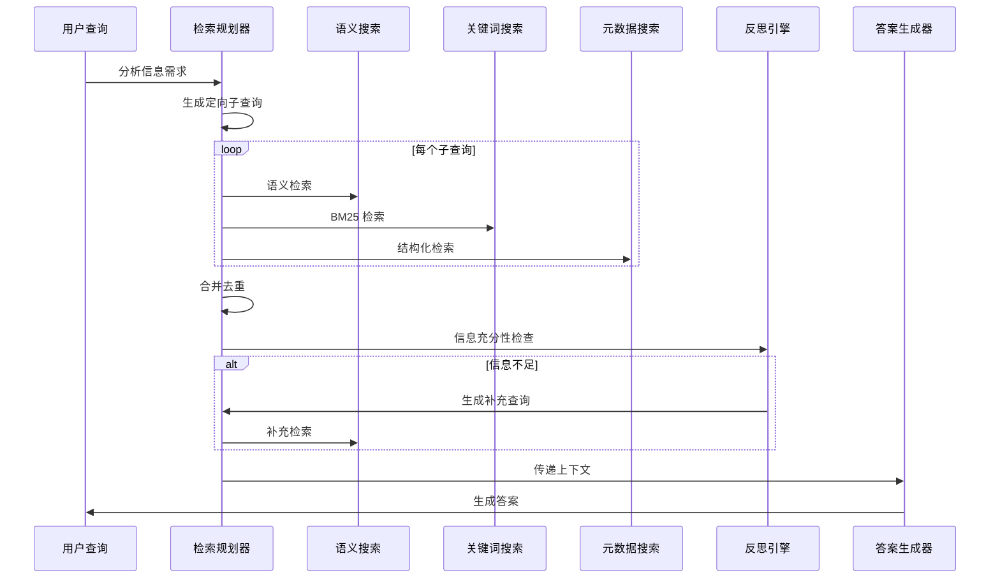

## 3. 模块间交互设计

### 3.1 自动路由机制

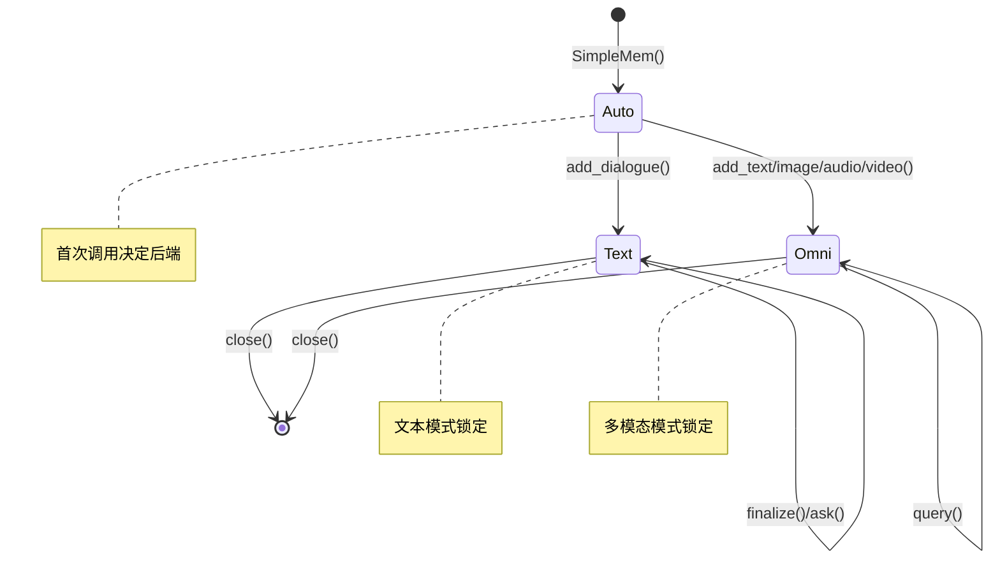

路由逻辑基于**首次调用方法**自动选择后端：
- `add_dialogue()` → Text 后端
- `add_text()` / `add_image()` / `add_audio()` / `add_video()` → Omni 后端
- 一旦选定，生命周期内不可切换

### 3.2 文本记忆三阶段流水线

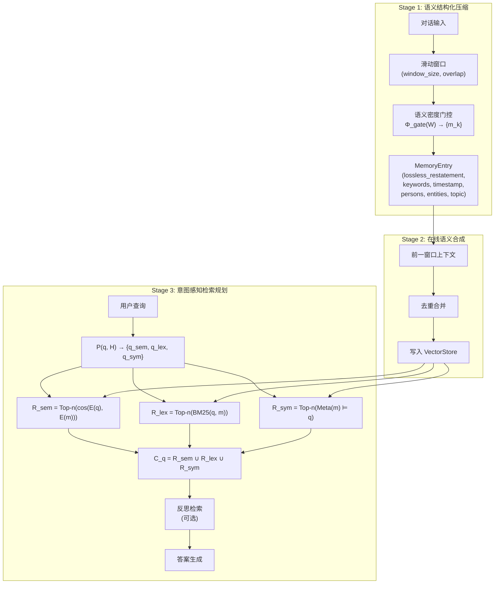

### 3.3 多模态记忆架构

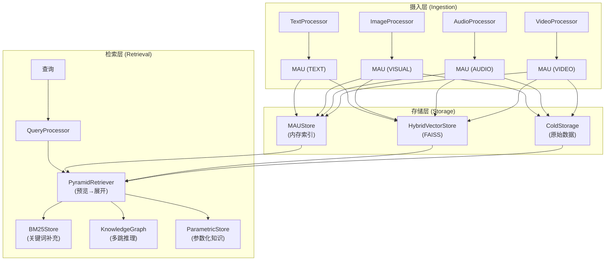

### 3.4 自演化闭环

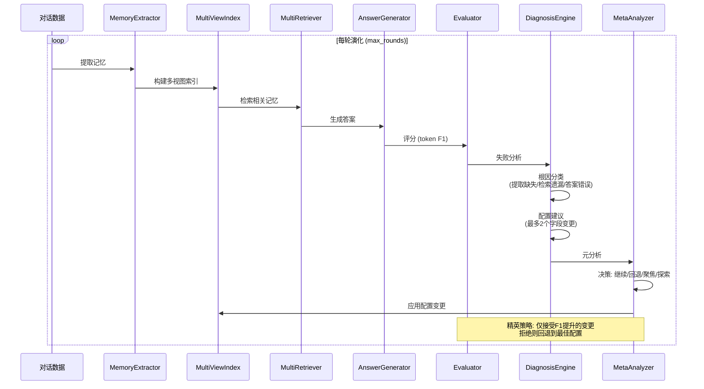

## 4. 存储架构

### 4.1 文本记忆存储

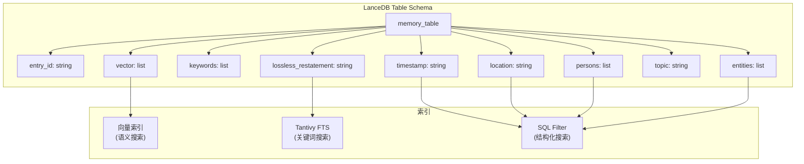

### 4.2 多模态存储

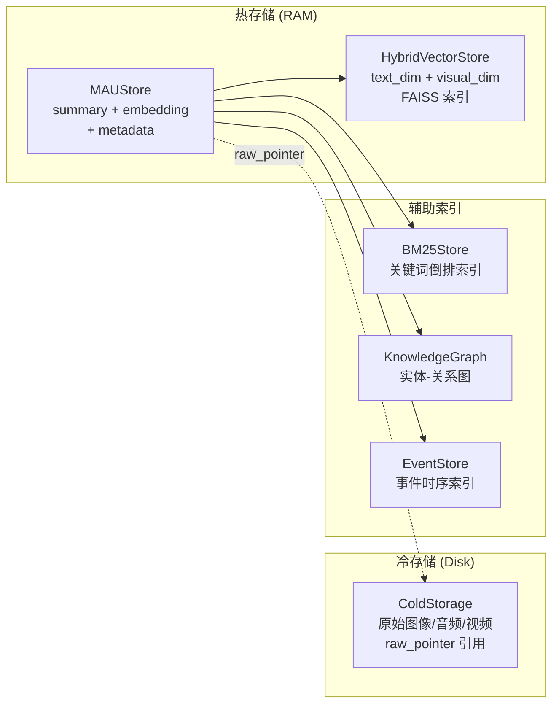

### 4.3 跨会话存储

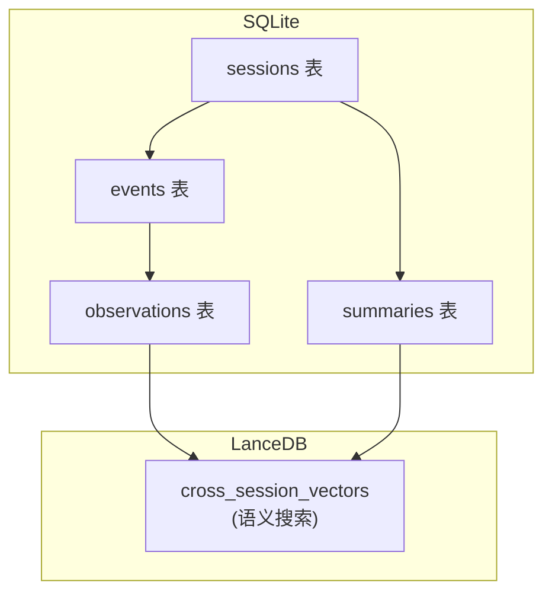

## 5. 关键算法设计

### 5.1 滑动窗口与语义密度门控

```
输入: 对话序列 D = {d_1, d_2, ..., d_n}, 窗口大小 W, 重叠 O
输出: 记忆条目集合 {m_k}

step_size = W - O
for pos = 0; pos + W <= n; pos += step_size:
    window = D[pos : pos + W]
    entries = LLM_extract(window, context=previous_entries)
    VectorStore.add(entries)
    previous_entries = entries
```

### 5.2 混合检索融合

```
输入: 查询 q, 配置 config
输出: 合并上下文 C_q

1. 分析查询: analysis = LLM_analyze(q) → {keywords, persons, time, location, entities}
2. 语义检索: R_sem = VectorStore.semantic_search(q, top_k=config.k_sem)
3. 关键词检索: R_lex = VectorStore.keyword_search(analysis.keywords, top_k=config.k_kw)
4. 结构化检索: R_sym = VectorStore.structured_search(persons, time_range, location, entities)
5. 融合合并:
   - first_found: 按 structured > semantic > keyword 优先级去重
   - rrf: Reciprocal Rank Fusion
   - weighted_sum: 加权分数合并
6. (可选) 反思: 检查信息充分性, 补充检索
```

### 5.3 精英演化策略

```
输入: 初始配置 C_0, QA 对, 最大轮数 R
输出: 最优配置 C*

best_f1 = -∞, best_config = C_0
for round = 0 to R:
    memories = extract(sessions)
    index = build_index(memories)
    qa_results = evaluate(index, qa_pairs, C_current)
    f1 = mean(r.f1 for r in qa_results)

    if round > 0:
        delta = f1 - best_f1
        if delta > acceptance_threshold:
            best_f1 = f1; best_config = C_current  # 接受
        else:
            C_current = best_config  # 回退

    report = diagnose(qa_results, memories, C_current)
    C_current = adjust(report, C_current, max_changes=2)
```

## 6. 配置体系

### 6.1 统一配置 (Config)

```python
@dataclass
class Config:
    # 检索通道 top-k
    k_sem: int = 0
    k_kw: int = 5
    k_str: int = 0
    # 上下文预算
    context_budget: int = 8
    # 融合模式
    fusion_mode: str = "sum"  # sum | weighted | rrf
    fusion_weights: Dict[str, float] = {"semantic": 1.0, "keyword": 1.0, "structured": 1.0}
    # 答案风格
    answer_style: str = "concise"
    # 增强能力
    enable_entity_swap: bool = False
    enable_query_decomposition: bool = False
    enable_answer_verification: bool = False
    # 分类覆盖
    category_overrides: Dict[str, Any] = {}
    # 演化元数据
    evolved: bool = False
    evolution_rounds: int = 0
```

### 6.2 配置流转

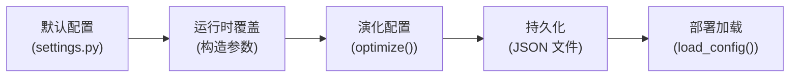

## 7. 部署架构

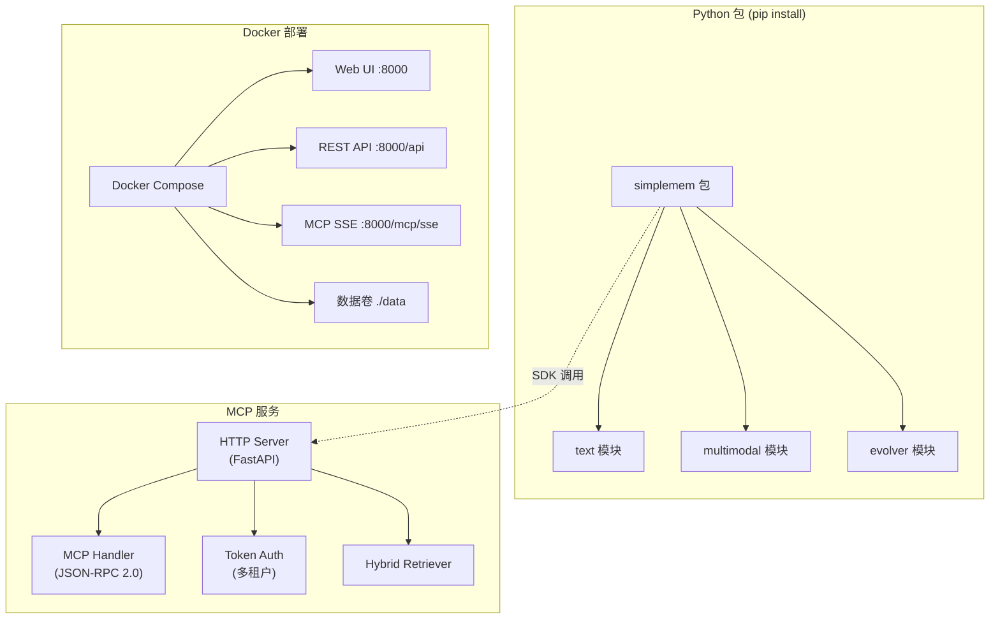

## 8. 错误处理策略

| 层级 | 策略 |
|:--|:--|
| LLM 调用 | 3 次重试，JSON 解析失败自动重试 |
| 并行处理 | 异常自动降级为串行处理 |
| 向量搜索 | 空结果返回空列表，不抛异常 |
| 演化引擎 | 精英策略拒绝回退，连续拒绝触发早停 |
| MCP 服务 | Token 认证失败返回 401，数据隔离异常不泄露 |

## 9. 扩展点

| 扩展点 | 机制 | 示例 |
|:--|:--|:--|
| 新后端 | `register(mode, module_path, class_name)` | 自定义记忆后端 |
| 新基准 | `BenchmarkAdapter` 子类 | LoCoMo / MemBench / LongMemEval |
| 新模态 | `Processor` 子类 + `ModalityType` 扩展 | 未来传感器数据 |
| 新检索策略 | `RetrievalConfig` 新字段 + 诊断规则 | MMR / KG 扩展 |
| 新食谱 | `evolution_cookbook.py` 添加条目 | 症状匹配的预编译配置组合 |
