# 核心模块设计: Cross-Session Memory (跨会话记忆)

> 源码路径: `cross/`

## 1. 模块概述

Cross-Session Memory 实现了跨对话会话的记忆持久化与上下文注入，使 Agent 能够在不同会话间保持记忆连续性。核心能力：

1. **会话生命周期管理**: start → record → stop(finalize) → end
2. **自动记忆提取**: 会话结束时自动提取关键观察
3. **上下文注入**: 基于 token 预算的智能上下文组装
4. **语义搜索**: 跨所有会话的向量相似度检索

## 2. 模块架构

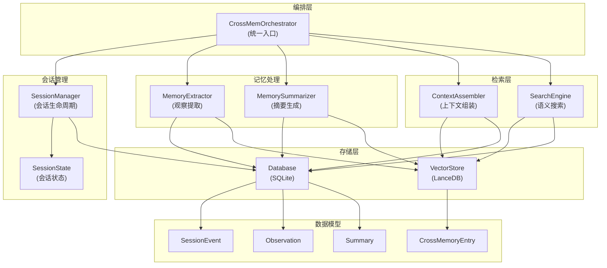

## 3. 会话生命周期

### 3.1 状态机

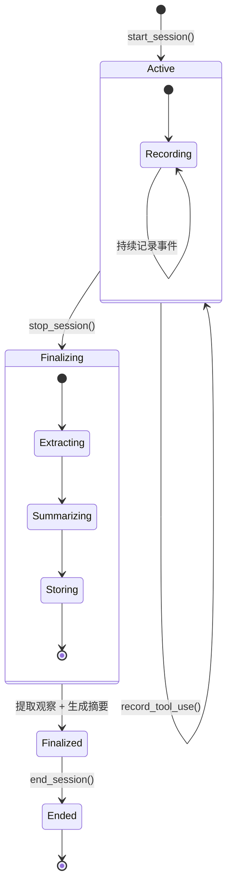

### 3.2 完整生命周期时序

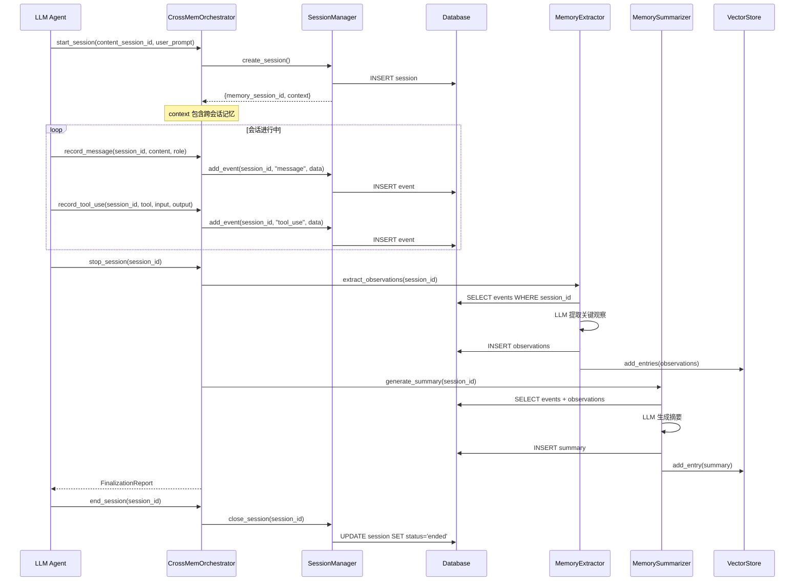

## 4. 数据模型

### 4.1 SQLite 表结构

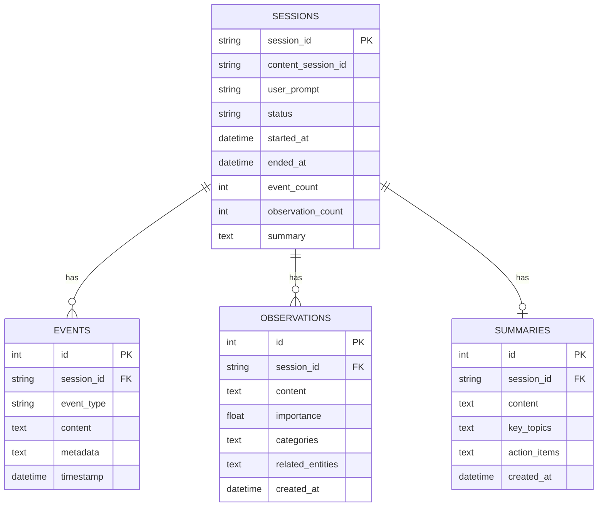

### 4.2 CrossMemoryEntry (向量存储)

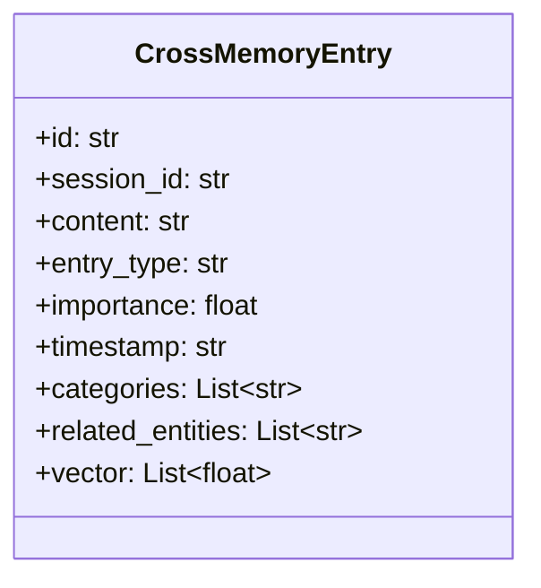

## 5. 上下文注入

### 5.1 ContextAssembler

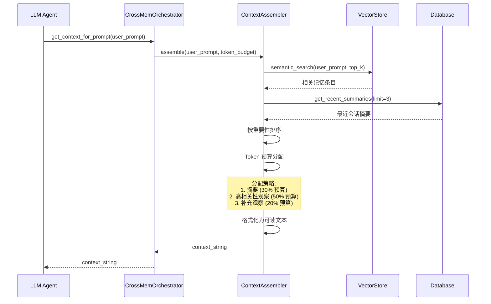

### 5.2 Token 预算分配

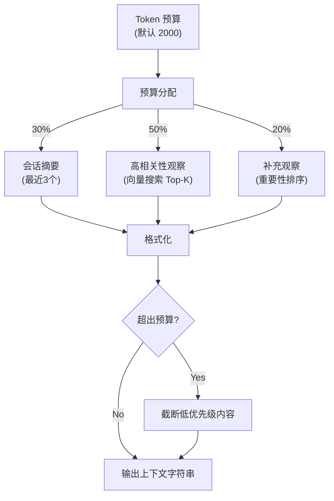

## 6. 语义搜索

### 6.1 搜索流程

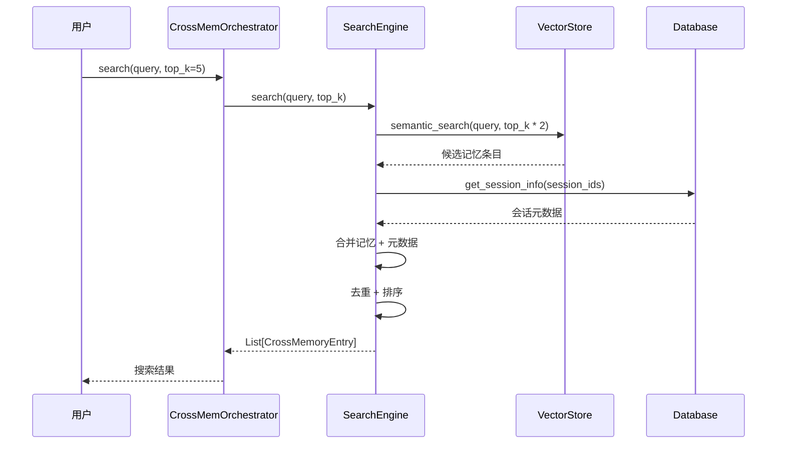

## 7. 记忆提取

### 7.1 观察提取流程

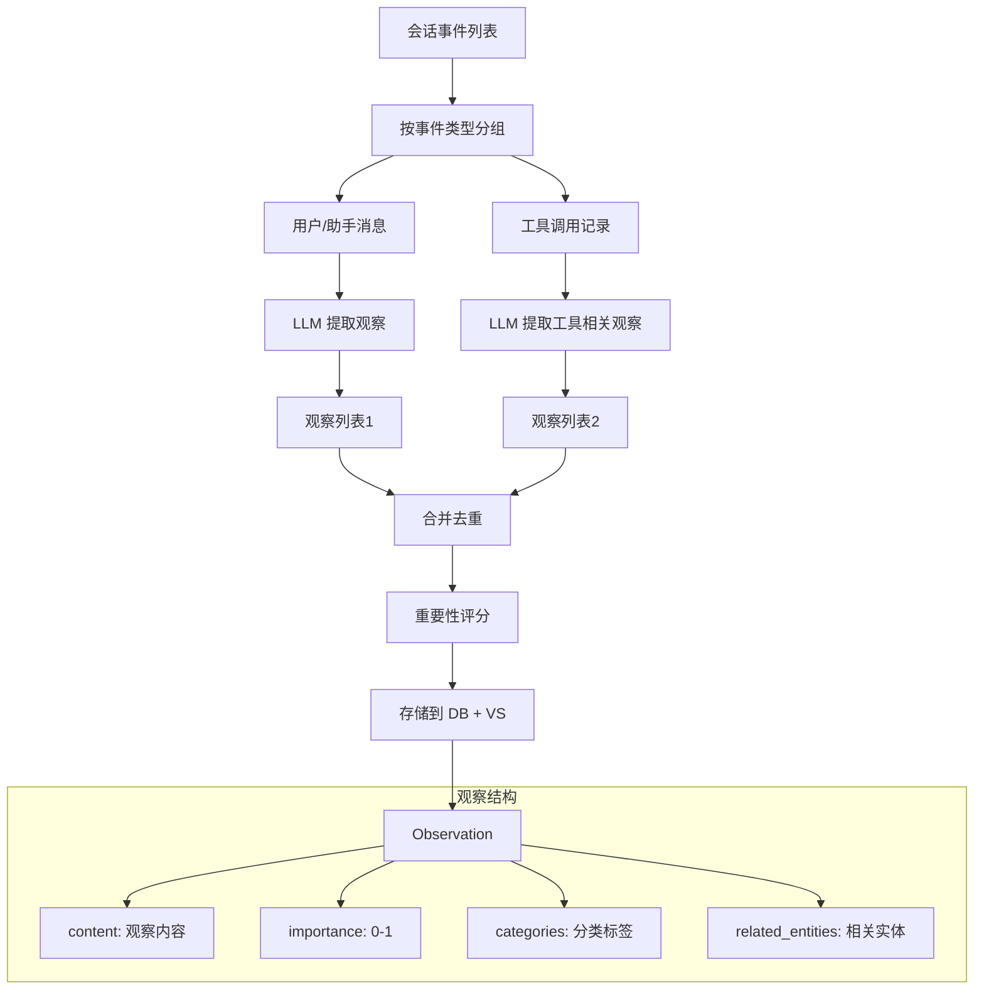

## 8. 多租户隔离

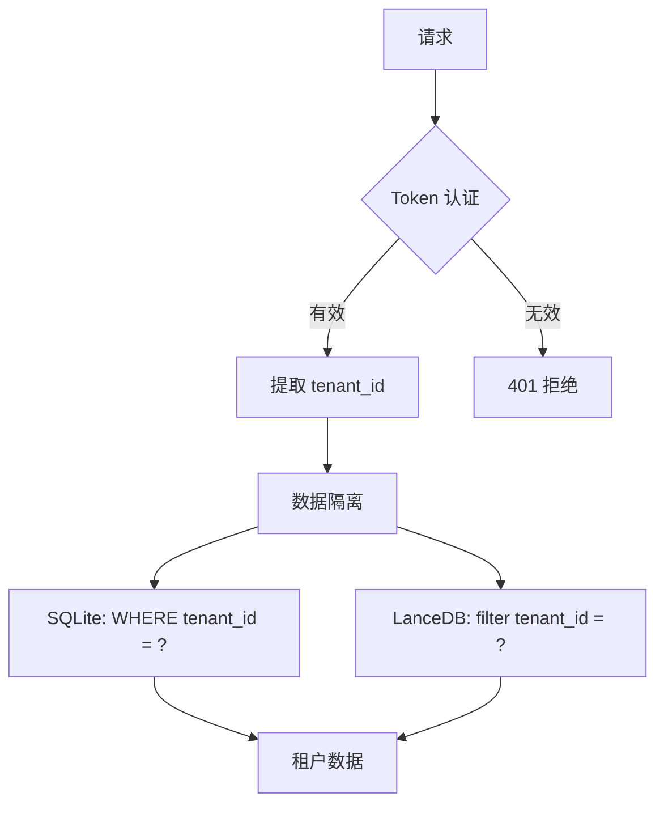

## 9. MCP 集成

### 9.1 MCP 工具映射

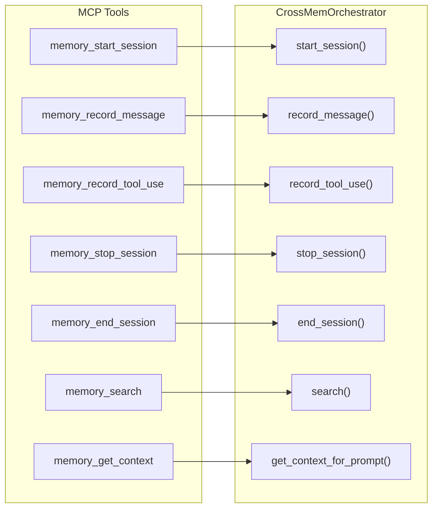

### 9.2 MCP 请求处理时序

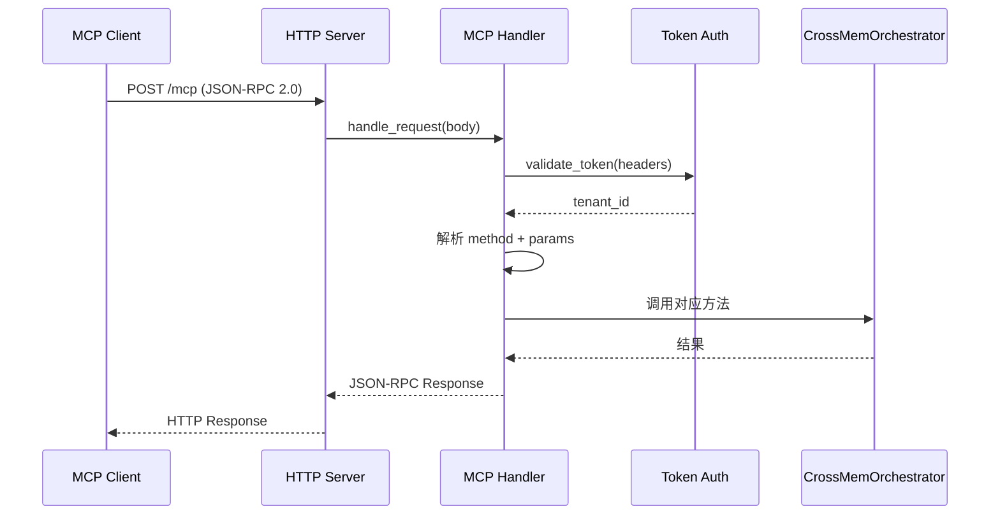

## 10. 配置

| 参数 | 默认值 | 描述 |
|:--|:--|:--|
| db_path | ./data/cross_memory.db | SQLite 数据库路径 |
| vector_db_path | ./data/cross_vectors | LanceDB 向量存储路径 |
| embedding_model | Qwen3-Embedding | 嵌入模型 |
| token_budget | 2000 | 上下文注入 token 预算 |
| max_recent_summaries | 3 | 最近摘要数量 |
| search_top_k | 5 | 搜索返回数量 |
| observation_importance_threshold | 0.3 | 观察重要性阈值 |
