# 核心模块设计: EvolveMem (自演化检索)

> 源码路径: `simplemem/evolver/`

## 1. 模块概述

EvolveMem 实现了论文中的闭环自演化框架，核心思想是：**检索基础设施本身应通过 LLM 驱动的诊断自动演化**。它通过 Extract → Index → Retrieve → Answer → Evaluate → Diagnose → Adjust 的闭环，持续优化检索配置。

### 核心创新

1. **LLM 驱动诊断**: 不依赖人工规则，由 LLM 分析失败案例并定位根因
2. **精英演化策略**: 严格爬山，仅接受 F1 提升的配置变更
3. **食谱系统**: 预编译的能力组合，症状匹配后原子化应用
4. **元分析**: 跨轮次元演化，支持回退/聚焦/探索策略

## 2. 模块架构

```mermaid
graph TB
    subgraph "公共入口"
        OPT["optimize()<br/>(顶层函数)"]
    end

    subgraph "演化引擎"
        EE["EvolutionEngine<br/>(主循环)"]
    end

    subgraph "闭环组件"
        EXT["MemoryExtractor<br/>(提取)"]
        IDX["MultiViewIndex<br/>(索引)"]
        RET["MultiRetriever<br/>(检索)"]
        ANS["AnswerGenerator<br/>(答案)"]
        EVAL["Evaluator<br/>(评估)"]
        DIAG["DiagnosisEngine<br/>(诊断)"]
        META["MetaAnalyzer<br/>(元分析)"]
    end

    subgraph "配置"
        RC["RetrievalConfig<br/>(检索配置)"]
        CB["Cookbook<br/>(食谱系统)"]
    end

    subgraph "基准适配"
        BA["BenchmarkAdapter<br/>(抽象基类)"]
        LC["LoCoMoAdapter"]
        MB["MemBenchAdapter"]
        LME["LongMemEvalAdapter"]
    end

    OPT --> EE
    EE --> EXT & IDX & RET & ANS & EVAL & DIAG & META
    EE --> RC & CB
    EE --> BA
    BA <|-- LC
    BA <|-- MB
    BA <|-- LME

    EXT --> IDX --> RET --> ANS --> EVAL --> DIAG --> META --> RC
```

## 3. 闭环演化流程

### 3.1 完整闭环时序

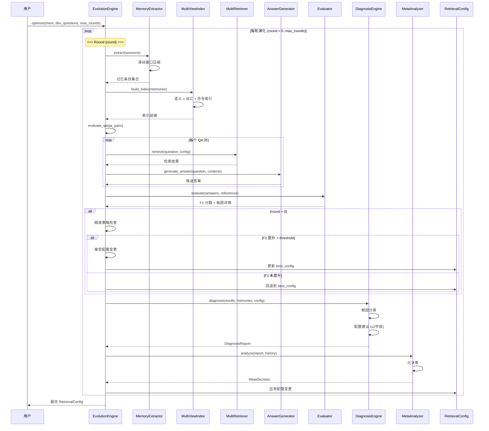
```mermaid
sequenceDiagram
    participant User as 用户
    participant EE as EvolutionEngine
    participant EXT as MemoryExtractor
    participant IDX as MultiViewIndex
    participant RET as MultiRetriever
    participant ANS as AnswerGenerator
    participant EVAL as Evaluator
    participant DIAG as DiagnosisEngine
    participant META as MetaAnalyzer
    participant RC as RetrievalConfig

    User->>EE: optimize(mem, dev_questions, max_rounds)

    loop 每轮演化 (round = 0..max_rounds)
        Note over EE: === Round {round} ===

        EE->>EXT: extract(sessions)
        EXT->>EXT: 滑动窗口压缩
        EXT-->>EE: 记忆条目集合

        EE->>IDX: build_index(memories)
        IDX->>IDX: 语义 + 词汇 + 符号索引
        IDX-->>EE: 索引就绪

        EE->>EE: evaluate_qa(qa_pairs)
        loop 每个 QA 对
            EE->>RET: retrieve(question, config)
            RET-->>EE: 检索结果
            EE->>ANS: generate_answer(question, contexts)
            ANS-->>EE: 候选答案
        end

        EE->>EVAL: evaluate(answers, references)
        EVAL-->>EE: F1 分数 + 每题详情

        alt round > 0
            EE->>EE: 精英策略检查
            alt F1 提升 > threshold
                EE->>EE: 接受配置变更
                EE->>RC: 更新 best_config
            else F1 未提升
                EE->>RC: 回退到 best_config
            end
        end

        EE->>DIAG: diagnose(results, memories, config)
        DIAG->>DIAG: 根因分类
        DIAG->>DIAG: 配置建议 (≤2字段)
        DIAG-->>EE: DiagnosisReport

        EE->>META: analyze(report, history)
        META->>META: 元决策
        META-->>EE: MetaDecision

        EE->>RC: 应用配置变更
    end

    EE-->>User: 最优 RetrievalConfig
```

### 3.2 精英演化策略

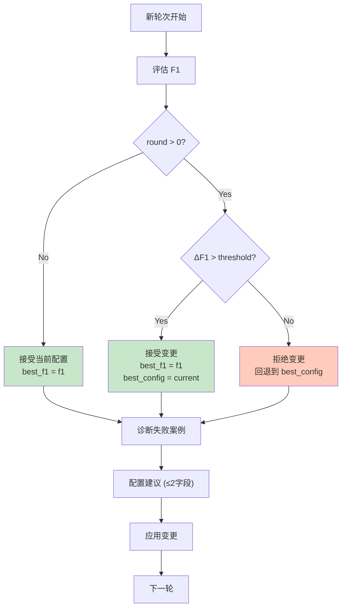
```mermaid
flowchart TB
    Start["新轮次开始"] --> Eval["评估 F1"]
    Eval --> Check{"round > 0?"}

    Check -->|No| Accept["接受当前配置<br/>best_f1 = f1"]
    Check -->|Yes| Delta{"ΔF1 > threshold?"}

    Delta -->|Yes| Accept2["接受变更<br/>best_f1 = f1<br/>best_config = current"]
    Delta -->|No| Reject["拒绝变更<br/>回退到 best_config"]

    Accept --> Diag["诊断失败案例"]
    Accept2 --> Diag
    Reject --> Diag

    Diag --> Suggest["配置建议 (≤2字段)"]
    Suggest --> Apply["应用变更"]
    Apply --> Next["下一轮"]

    style Accept fill:#c8e6c9
    style Accept2 fill:#c8e6c9
    style Reject fill:#ffccbc
```

## 4. 诊断引擎

### 4.1 根因分类

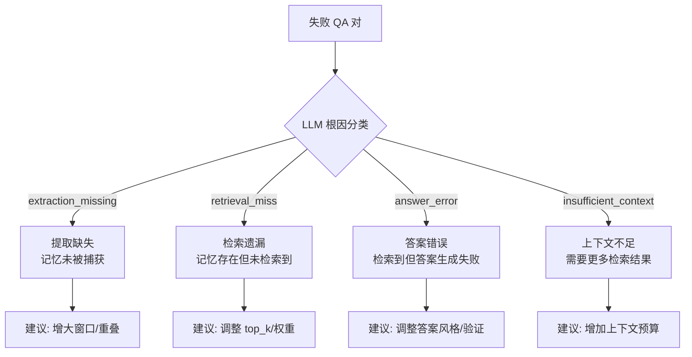
```mermaid
flowchart TB
    Failed["失败 QA 对"] --> Classify{"LLM 根因分类"}

    Classify -->|"extraction_missing"| EM["提取缺失<br/>记忆未被捕获"]
    Classify -->|"retrieval_miss"| RM["检索遗漏<br/>记忆存在但未检索到"]
    Classify -->|"answer_error"| AE["答案错误<br/>检索到但答案生成失败"]
    Classify -->|"insufficient_context"| IC["上下文不足<br/>需要更多检索结果"]

    EM --> Fix1["建议: 增大窗口/重叠"]
    RM --> Fix2["建议: 调整 top_k/权重"]
    AE --> Fix3["建议: 调整答案风格/验证"]
    IC --> Fix4["建议: 增加上下文预算"]
```

### 4.2 诊断时序

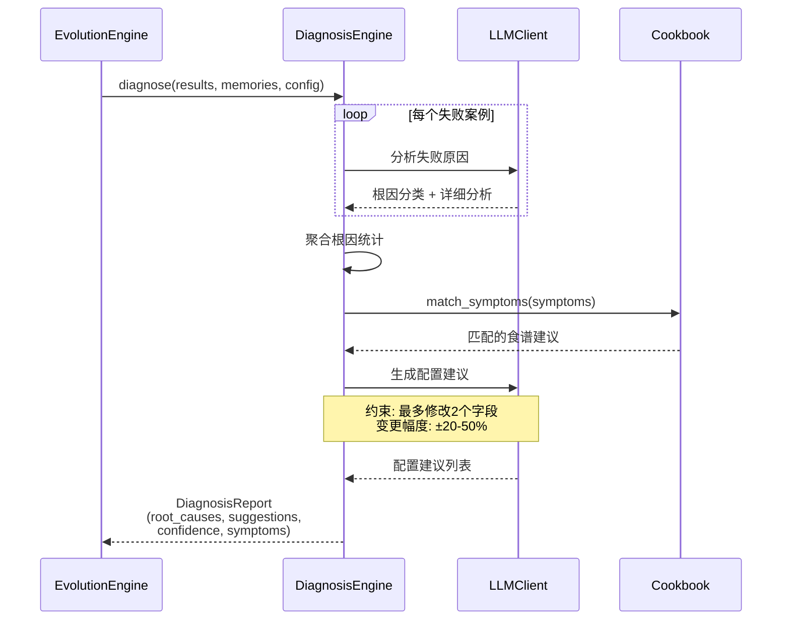
```mermaid
sequenceDiagram
    participant EE as EvolutionEngine
    participant DIAG as DiagnosisEngine
    participant LLM as LLMClient
    participant CB as Cookbook

    EE->>DIAG: diagnose(results, memories, config)

    loop 每个失败案例
        DIAG->>LLM: 分析失败原因
        LLM-->>DIAG: 根因分类 + 详细分析
    end

    DIAG->>DIAG: 聚合根因统计

    DIAG->>CB: match_symptoms(symptoms)
    CB-->>DIAG: 匹配的食谱建议

    DIAG->>LLM: 生成配置建议
    Note over DIAG,LLM: 约束: 最多修改2个字段<br/>变更幅度: ±20-50%
    LLM-->>DIAG: 配置建议列表

    DIAG-->>EE: DiagnosisReport<br/>(root_causes, suggestions,<br/>confidence, symptoms)
```

## 5. 食谱系统 (Cookbook)

### 5.1 食谱结构

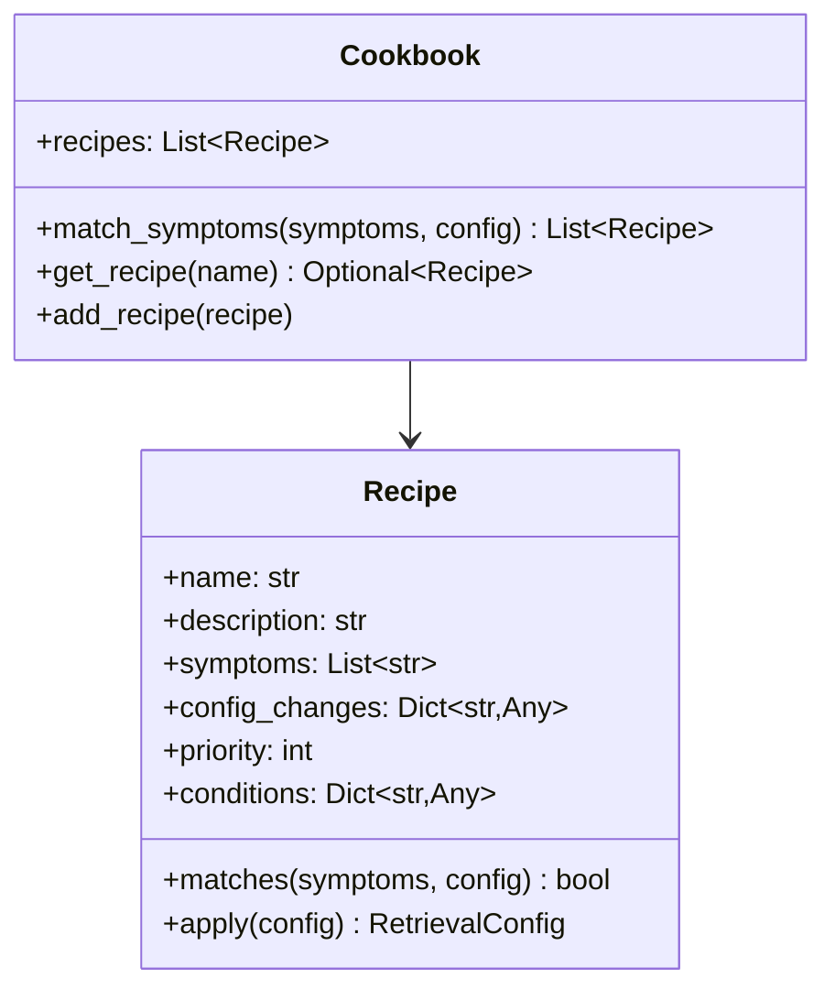
```mermaid
classDiagram
    class Recipe {
        +name: str
        +description: str
        +symptoms: List~str~
        +config_changes: Dict~str,Any~
        +priority: int
        +conditions: Dict~str,Any~
        +matches(symptoms, config) bool
        +apply(config) RetrievalConfig
    }

    class Cookbook {
        +recipes: List~Recipe~
        +match_symptoms(symptoms, config) List~Recipe~
        +get_recipe(name) Optional~Recipe~
        +add_recipe(recipe)
    }

    Cookbook --> Recipe
```

### 5.2 预编译食谱

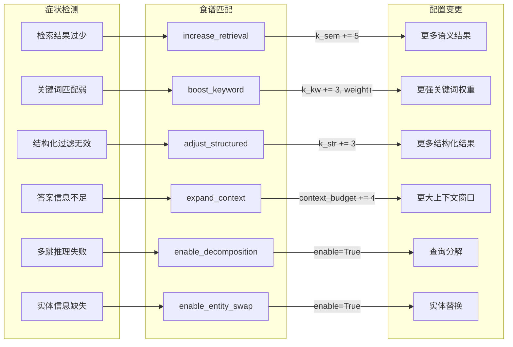
```mermaid
flowchart LR
    subgraph "症状检测"
        S1["检索结果过少"]
        S2["关键词匹配弱"]
        S3["结构化过滤无效"]
        S4["答案信息不足"]
        S5["多跳推理失败"]
        S6["实体信息缺失"]
    end

    subgraph "食谱匹配"
        S1 --> R1["increase_retrieval"]
        S2 --> R2["boost_keyword"]
        S3 --> R3["adjust_structured"]
        S4 --> R4["expand_context"]
        S5 --> R5["enable_decomposition"]
        S6 --> R6["enable_entity_swap"]
    end

    subgraph "配置变更"
        R1 -->|"k_sem += 5"| C1["更多语义结果"]
        R2 -->|"k_kw += 3, weight↑"| C2["更强关键词权重"]
        R3 -->|"k_str += 3"| C3["更多结构化结果"]
        R4 -->|"context_budget += 4"| C4["更大上下文窗口"]
        R5 -->|"enable=True"| C5["查询分解"]
        R6 -->|"enable=True"| C6["实体替换"]
    end
```

## 6. 元分析器

### 6.1 元决策类型

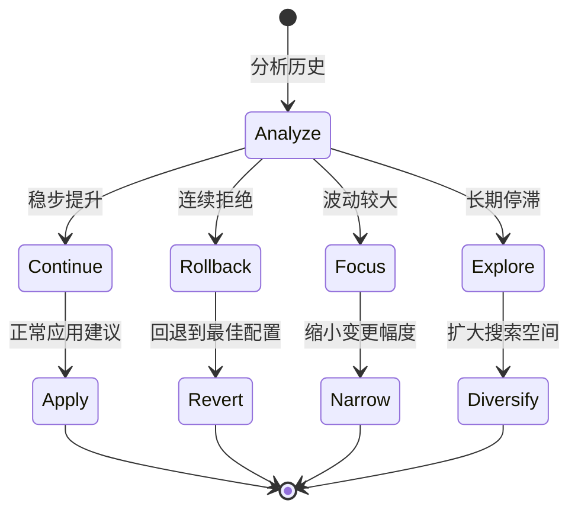
```mermaid
stateDiagram-v2
    [*] --> Analyze: 分析历史

    Analyze --> Continue: 稳步提升
    Analyze --> Rollback: 连续拒绝
    Analyze --> Focus: 波动较大
    Analyze --> Explore: 长期停滞

    Continue --> Apply: 正常应用建议
    Rollback --> Revert: 回退到最佳配置
    Focus --> Narrow: 缩小变更幅度
    Explore --> Diversify: 扩大搜索空间

    Apply --> [*]
    Revert --> [*]
    Narrow --> [*]
    Diversify --> [*]
```

### 6.2 元分析时序

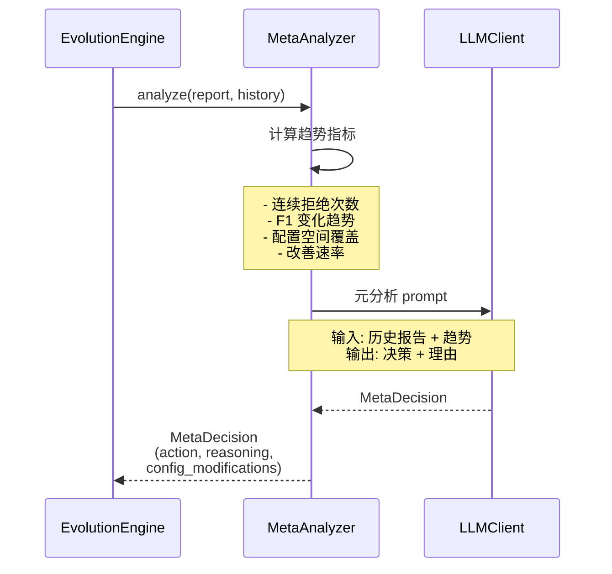
```mermaid
sequenceDiagram
    participant EE as EvolutionEngine
    participant META as MetaAnalyzer
    participant LLM as LLMClient

    EE->>META: analyze(report, history)

    META->>META: 计算趋势指标
    Note over META: - 连续拒绝次数<br/>- F1 变化趋势<br/>- 配置空间覆盖<br/>- 改善速率

    META->>LLM: 元分析 prompt
    Note over META,LLM: 输入: 历史报告 + 趋势<br/>输出: 决策 + 理由
    LLM-->>META: MetaDecision

    META-->>EE: MetaDecision<br/>(action, reasoning,<br/>config_modifications)
```

## 7. 检索配置 (RetrievalConfig)

### 7.1 配置字段

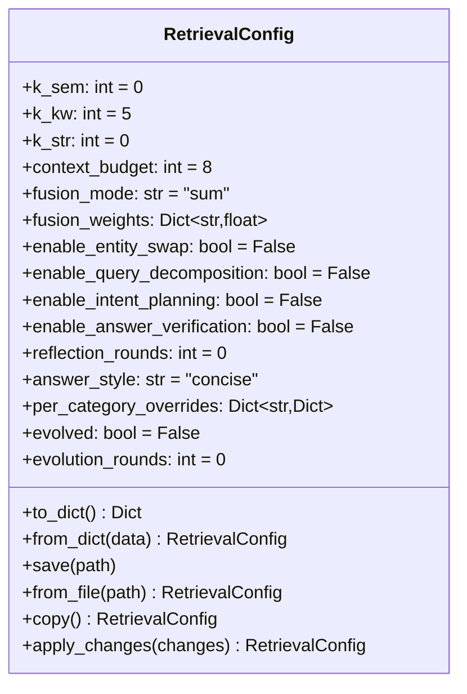
```mermaid
classDiagram
    class RetrievalConfig {
        +k_sem: int = 0
        +k_kw: int = 5
        +k_str: int = 0
        +context_budget: int = 8
        +fusion_mode: str = "sum"
        +fusion_weights: Dict~str,float~
        +enable_entity_swap: bool = False
        +enable_query_decomposition: bool = False
        +enable_intent_planning: bool = False
        +enable_answer_verification: bool = False
        +reflection_rounds: int = 0
        +answer_style: str = "concise"
        +per_category_overrides: Dict~str,Dict~
        +evolved: bool = False
        +evolution_rounds: int = 0
        +to_dict() Dict
        +from_dict(data) RetrievalConfig
        +save(path)
        +from_file(path) RetrievalConfig
        +copy() RetrievalConfig
        +apply_changes(changes) RetrievalConfig
    }
```

### 7.2 配置演化约束

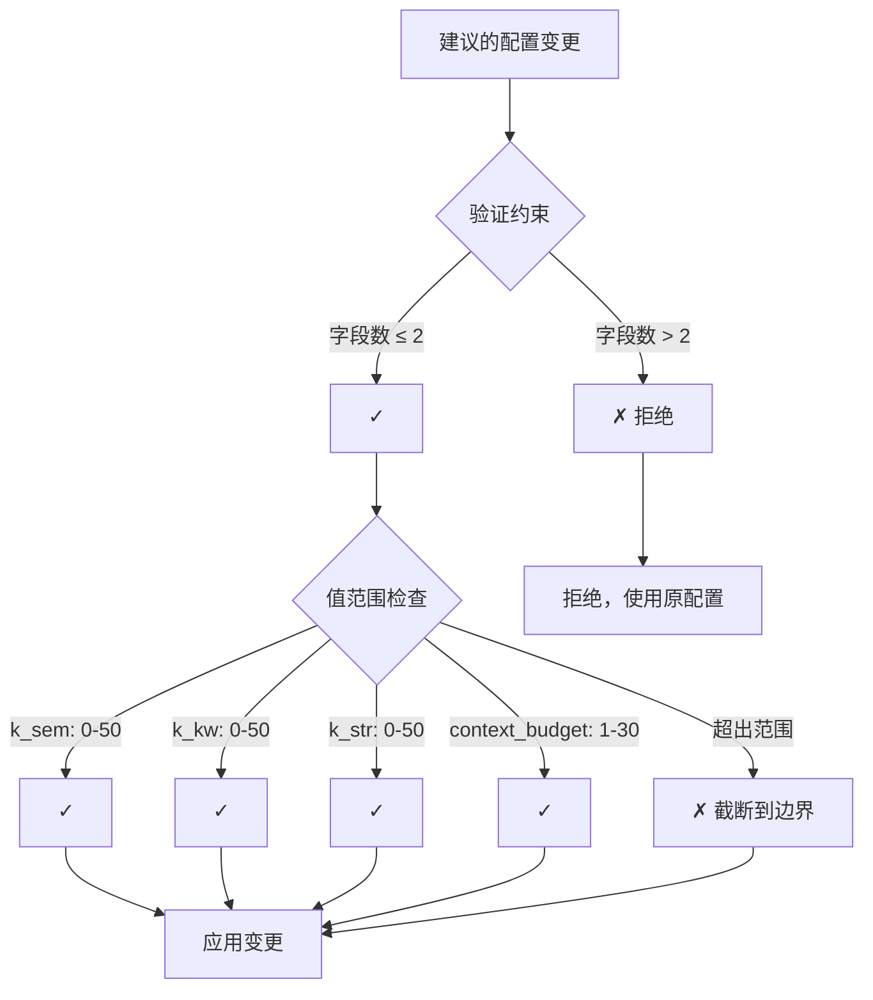
```mermaid
flowchart TB
    Changes["建议的配置变更"] --> Validate{"验证约束"}

    Validate -->|"字段数 ≤ 2"| V1[✓]
    Validate -->|"字段数 > 2"| V2[✗ 拒绝]

    V1 --> Range{"值范围检查"}
    Range -->|"k_sem: 0-50"| R1[✓]
    Range -->|"k_kw: 0-50"| R2[✓]
    Range -->|"k_str: 0-50"| R3[✓]
    Range -->|"context_budget: 1-30"| R4[✓]
    Range -->|"超出范围"| R5[✗ 截断到边界]

    R1 & R2 & R3 & R4 --> Apply["应用变更"]
    R5 --> Apply
    V2 --> Reject["拒绝，使用原配置"]
```

## 8. 基准适配器

### 8.1 适配器架构

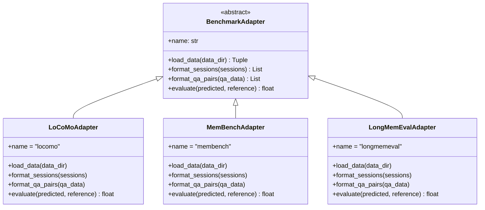
```mermaid
classDiagram
    class BenchmarkAdapter {
        <<abstract>>
        +name: str
        +load_data(data_dir) Tuple
        +format_sessions(sessions) List
        +format_qa_pairs(qa_data) List
        +evaluate(predicted, reference) float
    }

    class LoCoMoAdapter {
        +name = "locomo"
        +load_data(data_dir)
        +format_sessions(sessions)
        +format_qa_pairs(qa_data)
        +evaluate(predicted, reference) float
    }

    class MemBenchAdapter {
        +name = "membench"
        +load_data(data_dir)
        +format_sessions(sessions)
        +format_qa_pairs(qa_data)
        +evaluate(predicted, reference) float
    }

    class LongMemEvalAdapter {
        +name = "longmemeval"
        +load_data(data_dir)
        +format_sessions(sessions)
        +format_qa_pairs(qa_data)
        +evaluate(predicted, reference) float
    }

    BenchmarkAdapter <|-- LoCoMoAdapter
    BenchmarkAdapter <|-- MemBenchAdapter
    BenchmarkAdapter <|-- LongMemEvalAdapter
```

### 8.2 评估流程

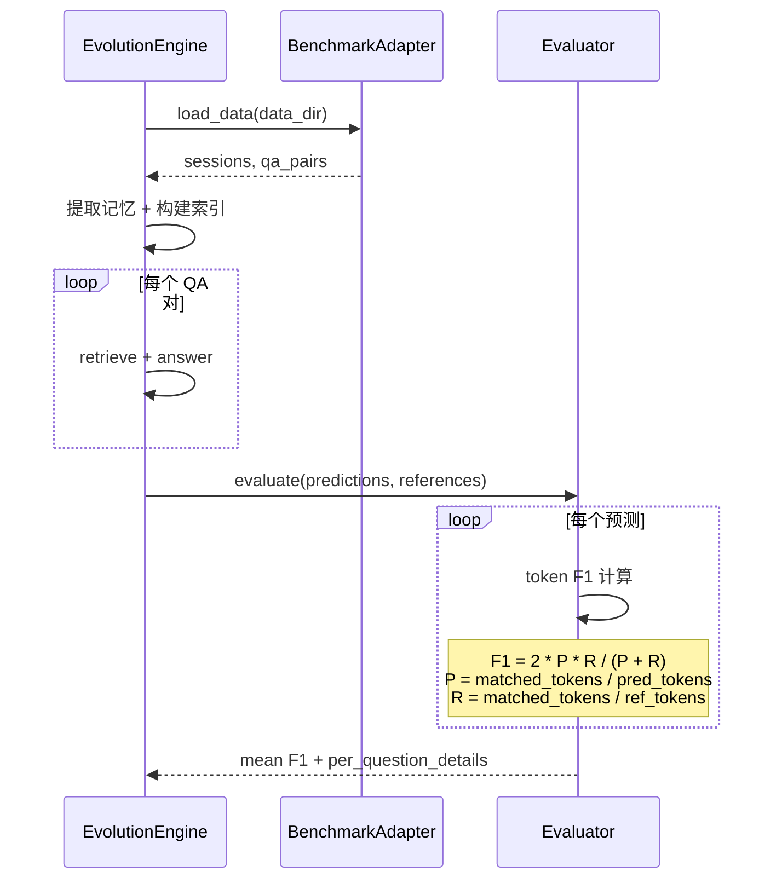
```mermaid
sequenceDiagram
    participant EE as EvolutionEngine
    participant BA as BenchmarkAdapter
    participant EVAL as Evaluator

    EE->>BA: load_data(data_dir)
    BA-->>EE: sessions, qa_pairs

    EE->>EE: 提取记忆 + 构建索引

    loop 每个 QA 对
        EE->>EE: retrieve + answer
    end

    EE->>EVAL: evaluate(predictions, references)

    loop 每个预测
        EVAL->>EVAL: token F1 计算
        Note over EVAL: F1 = 2 * P * R / (P + R)<br/>P = matched_tokens / pred_tokens<br/>R = matched_tokens / ref_tokens
    end

    EVAL-->>EE: mean F1 + per_question_details
```

## 9. 增强能力

### 9.1 意图规划 (Intent Planning)

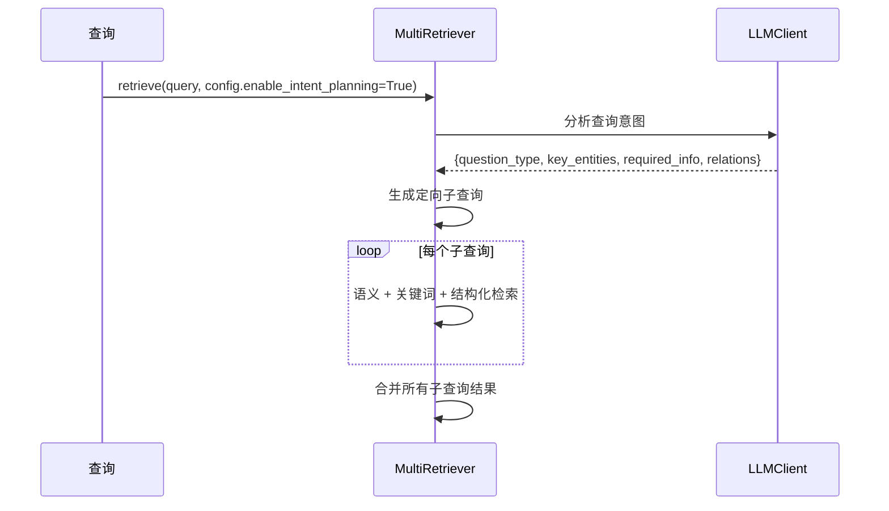
```mermaid
sequenceDiagram
    participant Q as 查询
    participant RET as MultiRetriever
    participant LLM as LLMClient

    Q->>RET: retrieve(query, config.enable_intent_planning=True)
    RET->>LLM: 分析查询意图
    LLM-->>RET: {question_type, key_entities, required_info, relations}

    RET->>RET: 生成定向子查询
    loop 每个子查询
        RET->>RET: 语义 + 关键词 + 结构化检索
    end

    RET->>RET: 合并所有子查询结果
```

### 9.2 查询分解 (Query Decomposition)

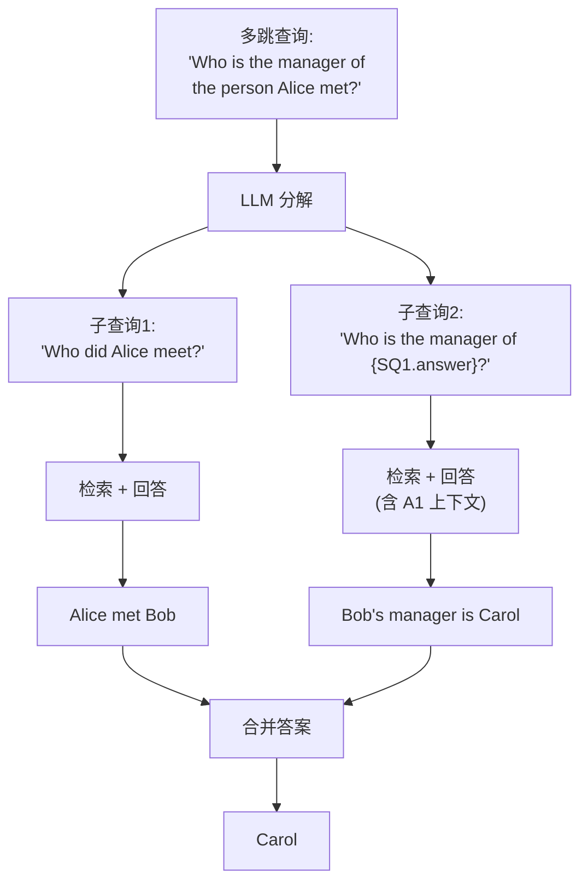
```mermaid
flowchart TB
    Q["多跳查询:<br/>'Who is the manager of<br/>the person Alice met?'"] --> LLM["LLM 分解"]
    LLM --> SQ1["子查询1:<br/>'Who did Alice meet?'"]
    LLM --> SQ2["子查询2:<br/>'Who is the manager of {SQ1.answer}?'"]

    SQ1 --> R1["检索 + 回答"]
    R1 --> A1["Alice met Bob"]
    SQ2 --> R2["检索 + 回答<br/>(含 A1 上下文)"]
    R2 --> A2["Bob's manager is Carol"]

    A1 & A2 --> MERGE["合并答案"]
    MERGE --> FINAL["Carol"]
```

### 9.3 答案验证 (Answer Verification)

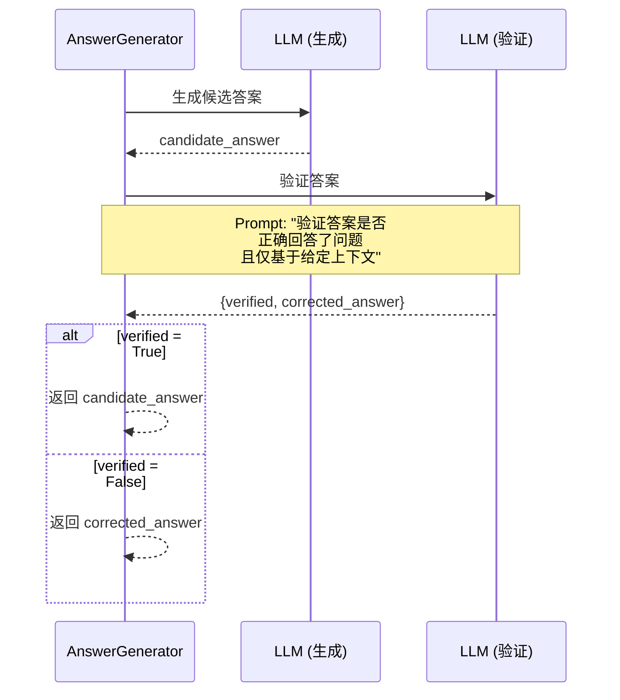
```mermaid
sequenceDiagram
    participant ANS as AnswerGenerator
    participant LLM1 as LLM (生成)
    participant LLM2 as LLM (验证)

    ANS->>LLM1: 生成候选答案
    LLM1-->>ANS: candidate_answer

    ANS->>LLM2: 验证答案
    Note over ANS,LLM2: Prompt: "验证答案是否<br/>正确回答了问题<br/>且仅基于给定上下文"
    LLM2-->>ANS: {verified, corrected_answer}

    alt verified = True
        ANS-->>ANS: 返回 candidate_answer
    else verified = False
        ANS-->>ANS: 返回 corrected_answer
    end
```

## 10. 演化收敛与早停

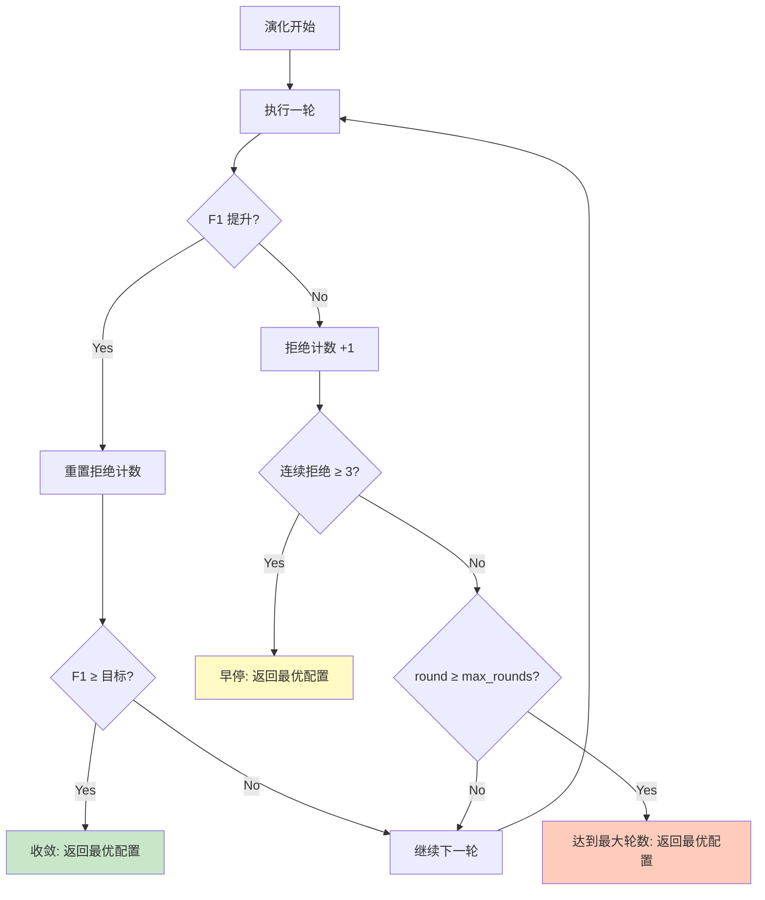
```mermaid
flowchart TB
    Start["演化开始"] --> Round["执行一轮"]
    Round --> Check1{"F1 提升?"}

    Check1 -->|Yes| Reset["重置拒绝计数"]
    Check1 -->|No| Incr["拒绝计数 +1"]

    Reset --> Check2{"F1 ≥ 目标?"}
    Incr --> Check3{"连续拒绝 ≥ 3?"}

    Check2 -->|Yes| Converge["收敛: 返回最优配置"]
    Check2 -->|No| Next["继续下一轮"]

    Check3 -->|Yes| EarlyStop["早停: 返回最优配置"]
    Check3 -->|No| Check4{"round ≥ max_rounds?"}

    Check4 -->|Yes| MaxRound["达到最大轮数: 返回最优配置"]
    Check4 -->|No| Next

    Next --> Round

    style Converge fill:#c8e6c9
    style EarlyStop fill:#fff9c4
    style MaxRound fill:#ffccbc
```
