# 核心模块设计: Omni-SimpleMem (多模态记忆)

> 源码路径: `simplemem/multimodal/`

## 1. 模块概述

Omni-SimpleMem 将 SimpleMem 的压缩优先哲学扩展到四种模态（文本、图像、音频、视频），基于三大原则：
1. **选择性摄入 (Selective Ingestion)**: 每种模态的熵驱动过滤
2. **渐进式检索 (Progressive Retrieval)**: FAISS + BM25 混合检索，金字塔 token 预算扩展
3. **知识图谱增强 (Knowledge Graph Augmentation)**: 多跳跨模态推理

## 2. 模块架构

```mermaid
graph TB
    subgraph "编排层"
        ORC["OmniMemoryOrchestrator<br/>(统一入口)"]
    end

    subgraph "处理层 (Processors)"
        TP["TextProcessor"]
        IP["ImageProcessor"]
        AP["AudioProcessor"]
        VP["VideoProcessor"]
    end

    subgraph "核心数据"
        MAU["MAU<br/>(多模态原子单元)"]
        EVT["EventNode<br/>(事件节点)"]
    end

    subgraph "存储层"
        MS["MAUStore<br/>(内存索引)"]
        HVS["HybridVectorStore<br/>(FAISS)"]
        CS["ColdStorage<br/>(原始数据)"]
        ES["EventStore<br/>(事件存储)"]
        BM25["BM25Store<br/>(关键词)"]
    end

    subgraph "检索层"
        PR["PyramidRetriever<br/>(金字塔检索)"]
        QP["QueryProcessor"]
        EM["ExpansionManager"]
    end

    subgraph "知识层"
        KG["KnowledgeGraph"]
        EE["EntityExtractor"]
        GR["GraphRetriever"]
    end

    subgraph "参数化层"
        PS["ParametricMemoryStore"]
        MC["MemoryConsolidator"]
        MD["MemoryDistiller"]
    end

    subgraph "演化层 (可选)"
        MEC["MetaController"]
        EXP["ExperienceEngine"]
        SO["StrategyOptimizer"]
    end

    ORC --> TP & IP & AP & VP
    TP & IP & AP & VP --> MAU
    ORC --> MS & HVS & CS & ES & BM25
    ORC --> PR & QP & EM
    ORC --> KG & EE & GR
    ORC --> PS & MC & MD
    ORC -.-> MEC & EXP & SO
```

## 3. 核心数据模型: MAU

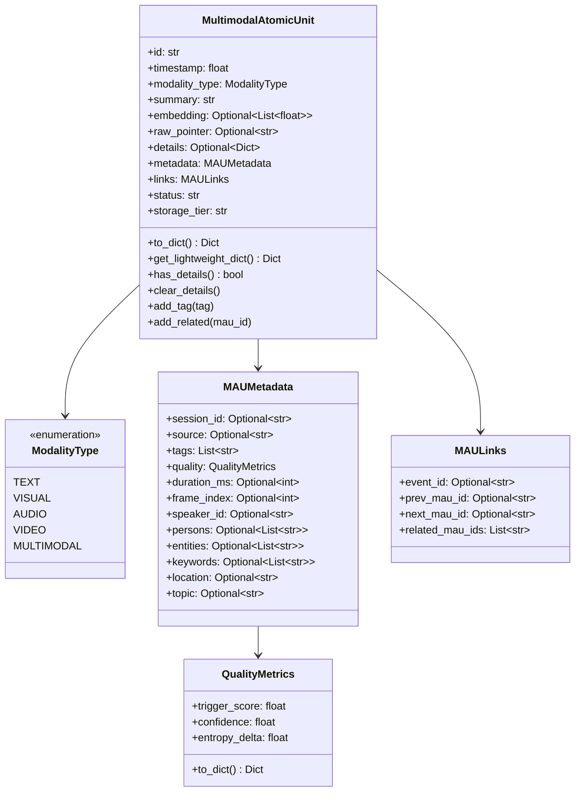

**MAU 的内存-计算解耦设计**:

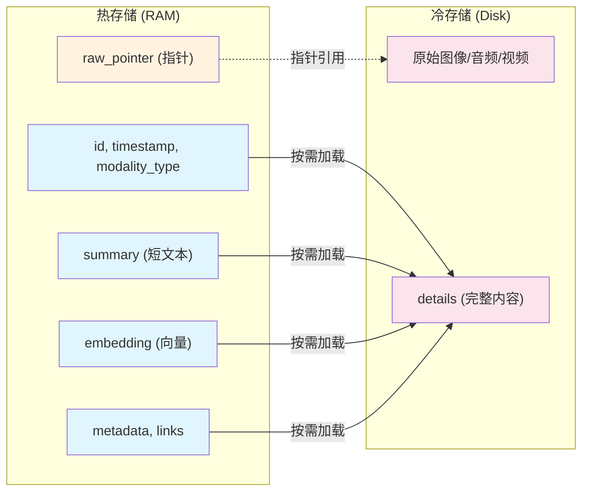

## 4. 处理器设计

### 4.1 处理器基类与继承

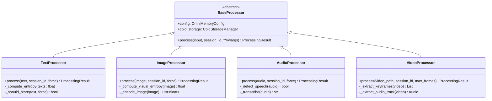

### 4.2 熵触发机制

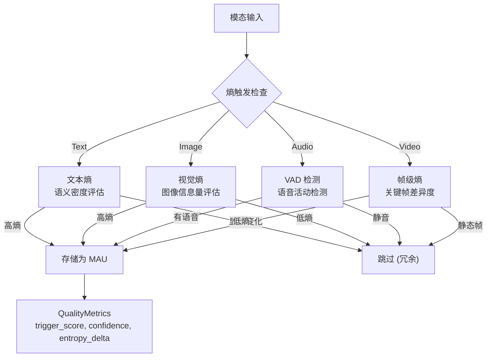

## 5. 金字塔检索

### 5.1 检索层级

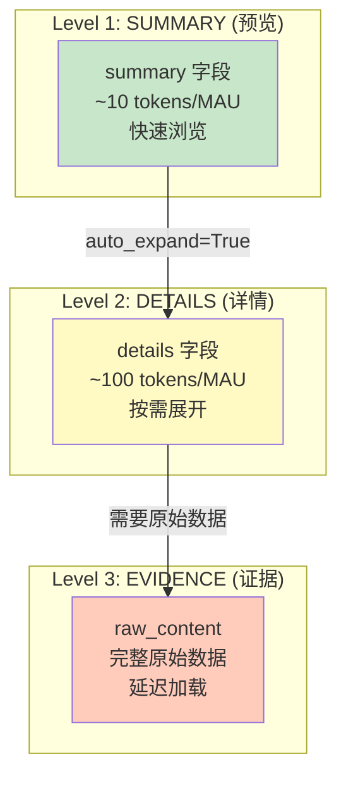

### 5.2 检索流程

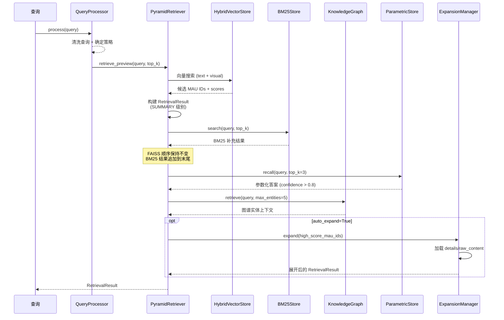

## 6. 知识图谱

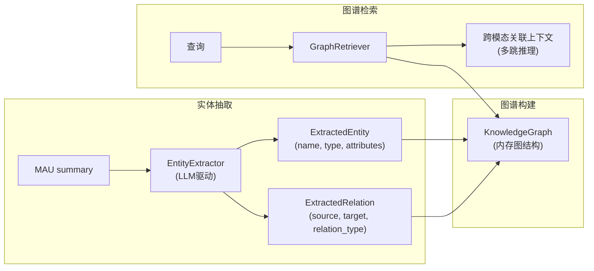

## 7. 参数化记忆

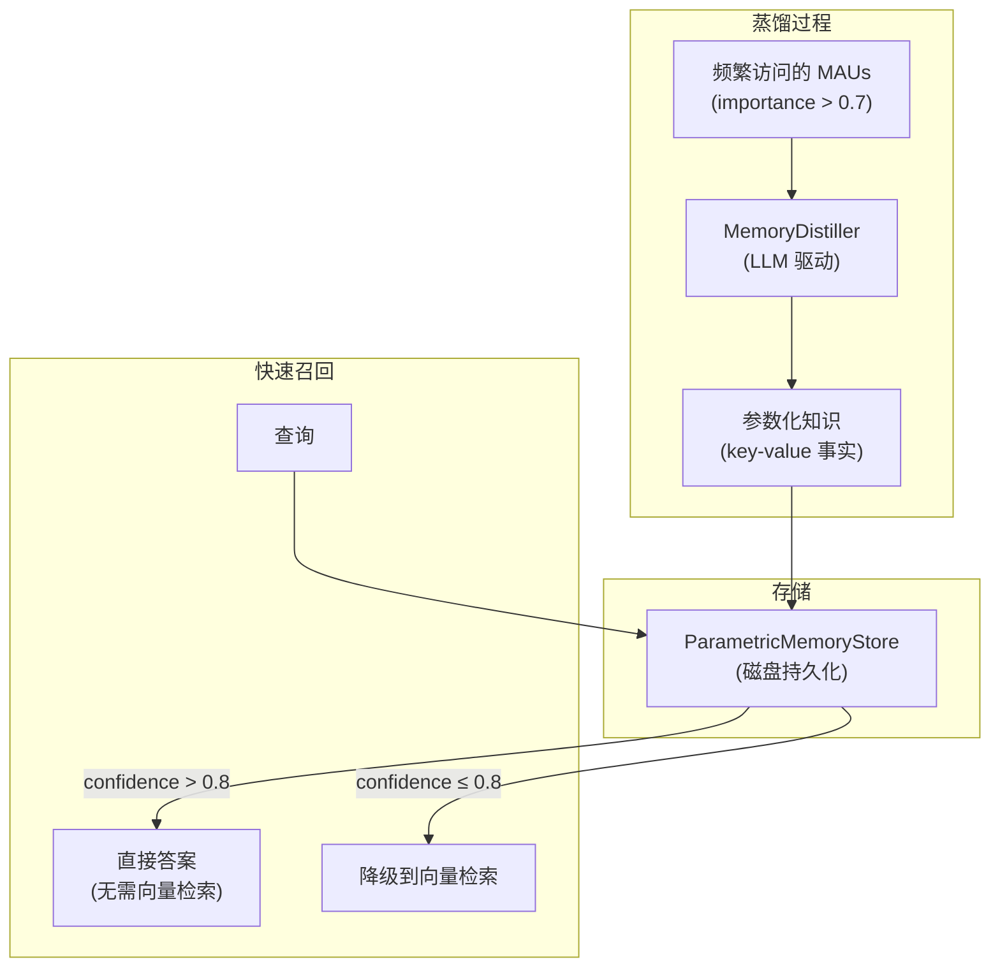

## 8. 记忆合并与归档

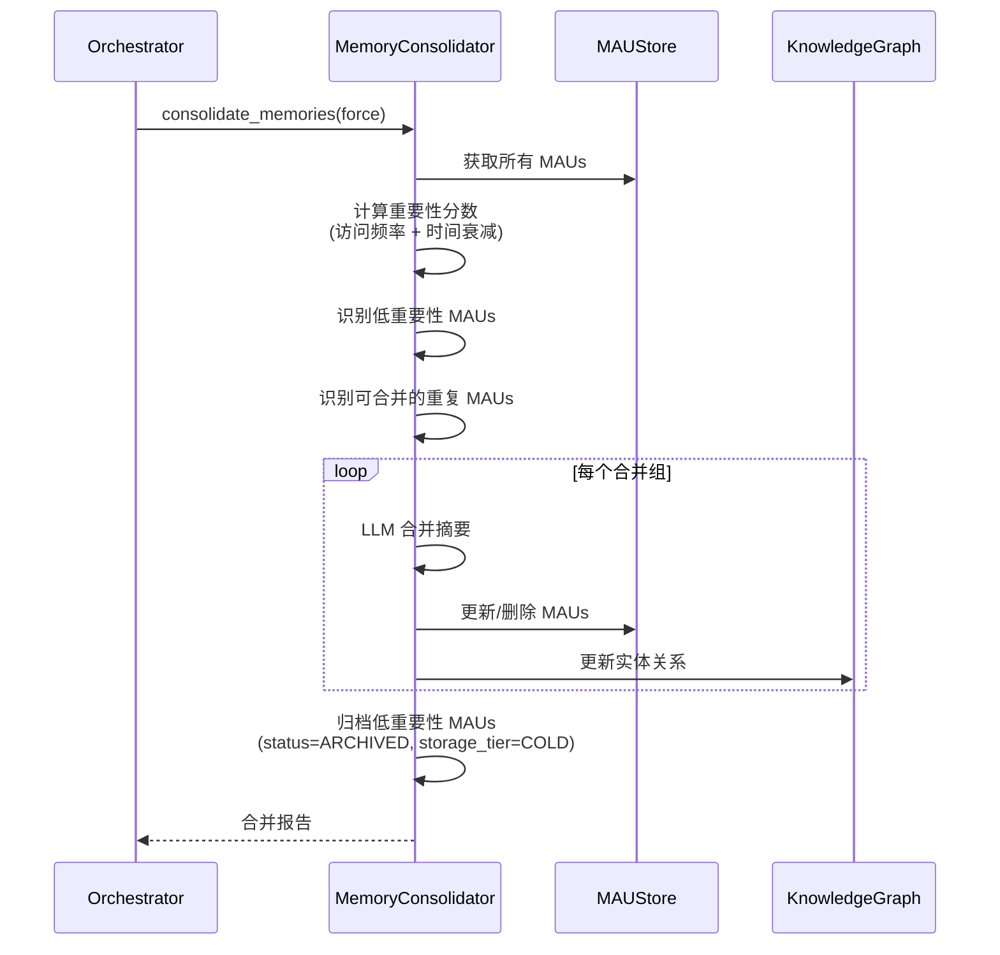

## 9. 多模态摄入策略

### 9.1 图像摄入

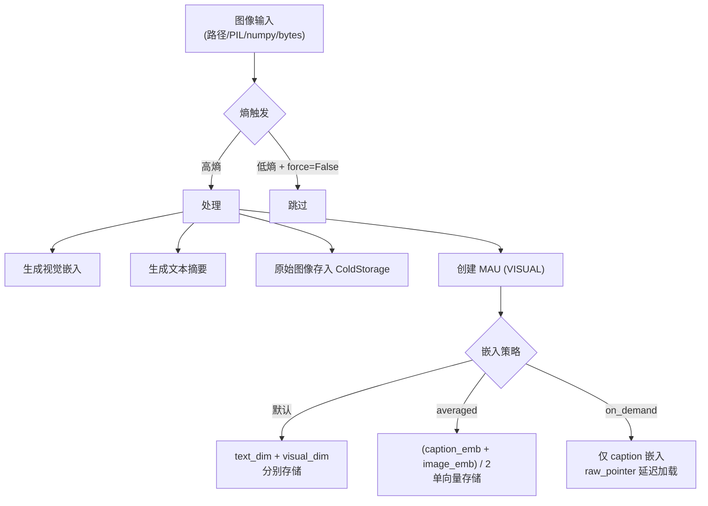

### 9.2 视频摄入

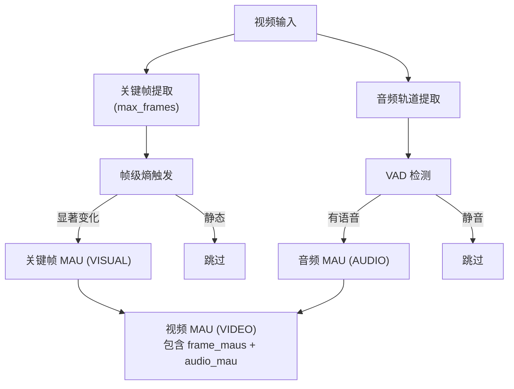

## 10. 自演化集成 (可选)

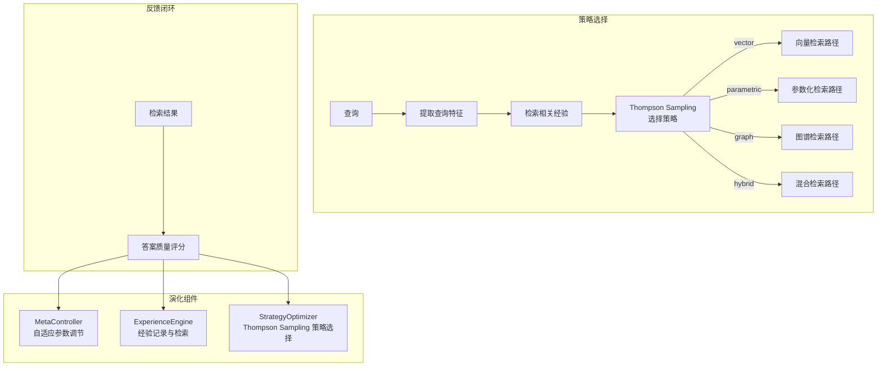

## 11. 会话管理

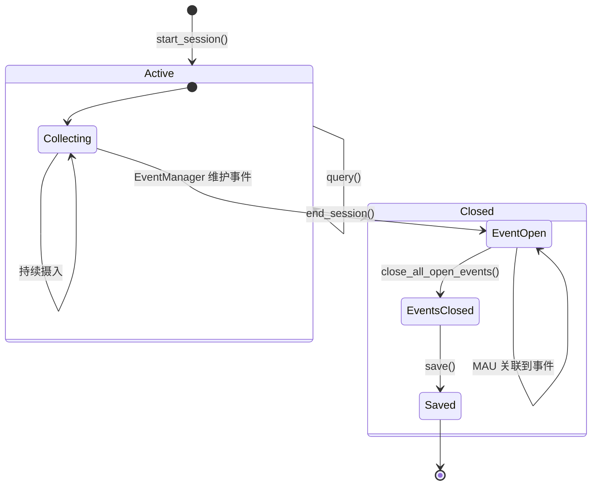

## 12. 配置体系

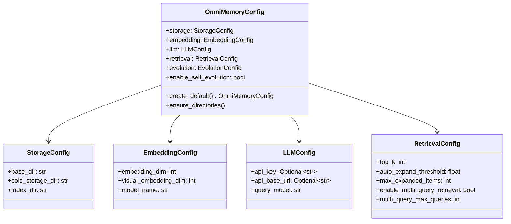
