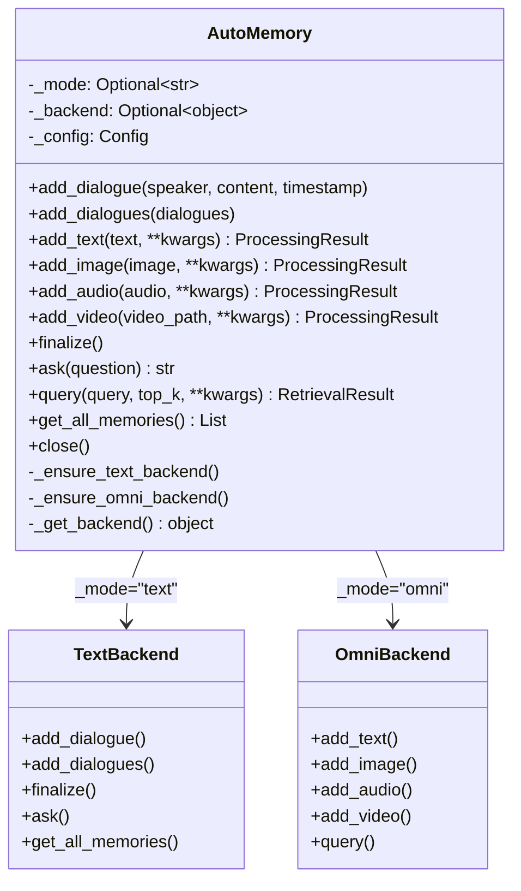
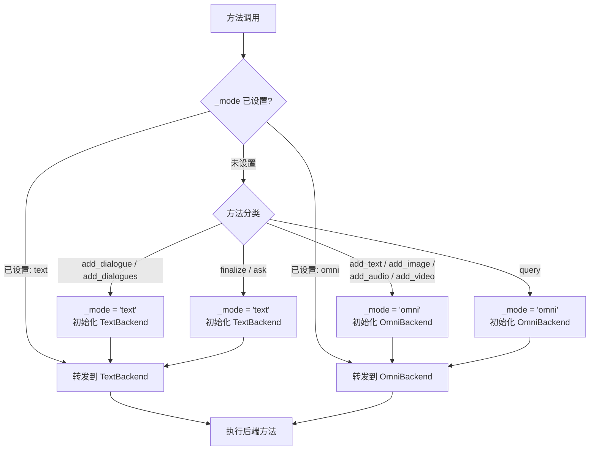
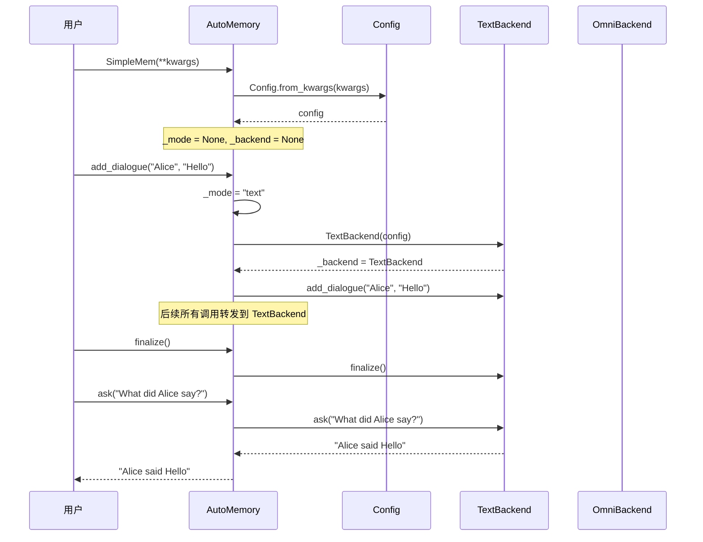
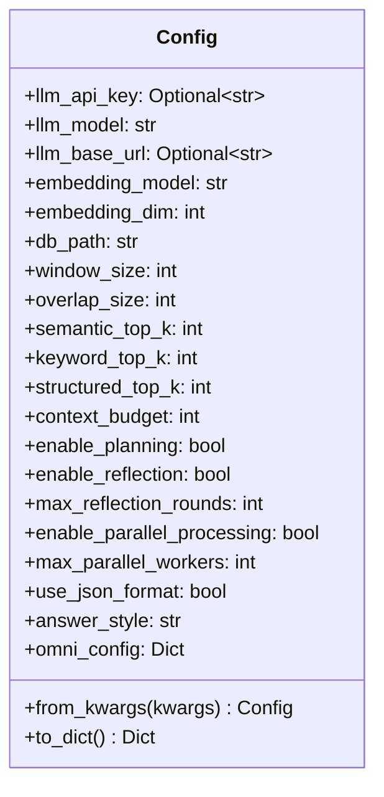
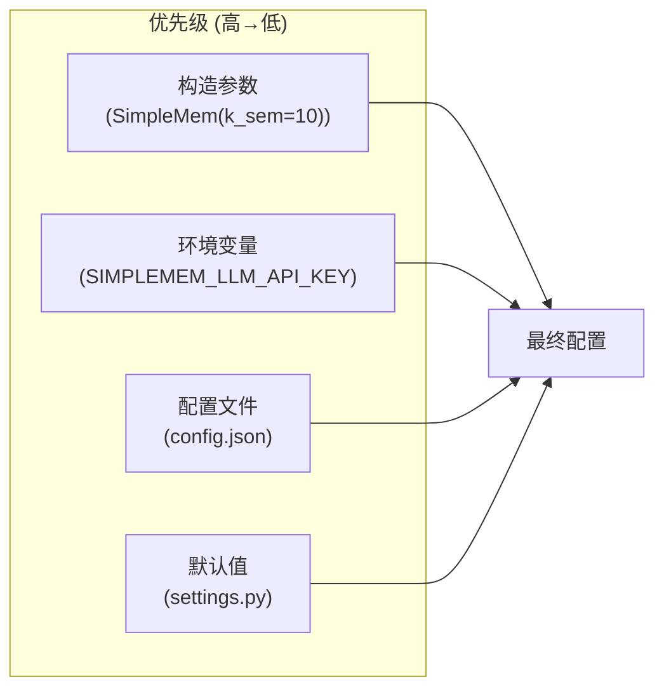
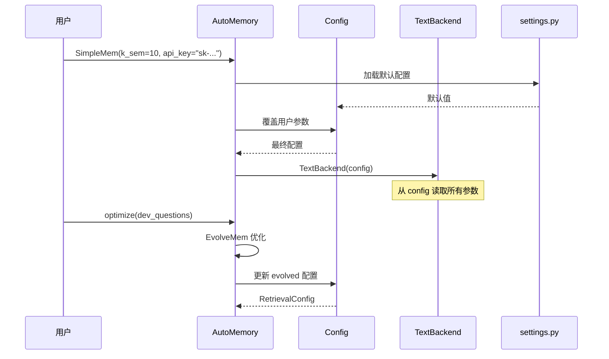
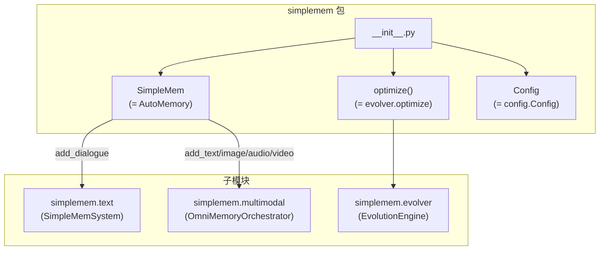
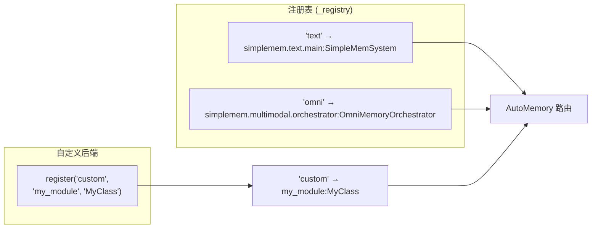
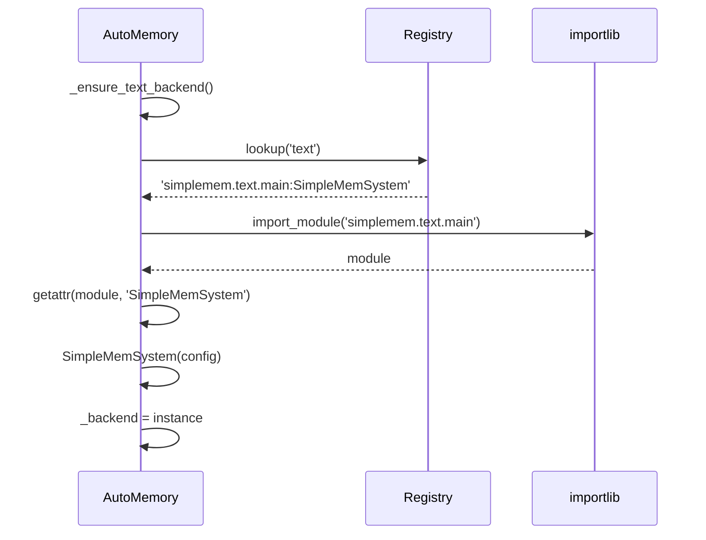

# 核心模块设计: Router & Config (路由与配置)

> 源码路径: `simplemem/router.py`, `simplemem/config.py`, `simplemem/__init__.py`

## 1. 模块概述

Router & Config 是 SimpleMem 统一包的粘合层，提供：
1. **自动路由**: 根据首次调用方法自动选择后端引擎
2. **统一配置**: 跨所有后端的参数管理与覆盖
3. **包入口**: `from simplemem import SimpleMem` 的统一 API

## 2. AutoMemory 路由器

### 2.1 类设计



### 2.2 路由决策流程



### 2.3 后端初始化时序



## 3. 配置体系

### 3.1 Config 类



### 3.2 配置优先级



### 3.3 配置流转



## 4. 包入口设计

### 4.1 公开 API



### 4.2 导入映射

```python
# simplemem/__init__.py
from simplemem.router import AutoMemory as SimpleMem
from simplemem.config import Config
from simplemem.evolver import optimize

__all__ = ["SimpleMem", "Config", "optimize"]
```

## 5. 后端注册机制

### 5.1 注册表



### 5.2 延迟导入



## 6. 错误处理

### 6.1 路由错误

| 场景 | 处理 |
|:--|:--|
| 混合调用 (text + omni) | 抛出 ValueError，提示模式已锁定 |
| 未知方法 | 抛出 AttributeError |
| 后端初始化失败 | 抛出原始异常，附带模式信息 |

### 6.2 配置错误

| 场景 | 处理 |
|:--|:--|
| 缺少 API Key | 抛出 ValueError，提示设置环境变量 |
| 无效参数值 | 抛出 TypeError/ValueError |
| 未知参数 | 忽略并打印警告 |

## 7. 使用示例

### 7.1 文本模式

```python
from simplemem import SimpleMem

mem = SimpleMem(api_key="sk-...", model="gpt-4o")
mem.add_dialogue("Alice", "Let's meet at 2pm", "2025-11-15T14:30:00")
mem.add_dialogue("Bob", "Sure, see you then!", "2025-11-15T14:31:00")
mem.finalize()
answer = mem.ask("When will they meet?")
# → "16 November 2025 at 2:00 PM"
```

### 7.2 多模态模式

```python
from simplemem import SimpleMem

mem = SimpleMem(api_key="sk-...", model="gpt-4o")
mem.add_text("User loves hiking.", tags=["session_id:D1"])
mem.add_image("photo.jpg", tags=["session_id:D1"])
result = mem.query("What does the user enjoy?", top_k=5)
```

### 7.3 检索优化

```python
import simplemem

mem = simplemem.SimpleMem(api_key="sk-...")
# ... 添加对话 ...
config = simplemem.optimize(mem, dev_questions, max_rounds=3)
config.save("my_config.json")
```
