# 核心模块设计: Text Memory Core (文本记忆核心)

> 源码路径: `simplemem/core/`, `simplemem/text/`

## 1. 模块概述

Text Memory Core 是 SimpleMem 的基础引擎，实现了论文中的三阶段流水线：
1. **语义结构化压缩** (Section 3.1): 将对话压缩为紧凑的记忆单元
2. **在线语义合成** (Section 3.2): 写入时合并冗余
3. **意图感知检索规划** (Section 3.3): 推断查询意图，多视图检索

## 2. 模块架构

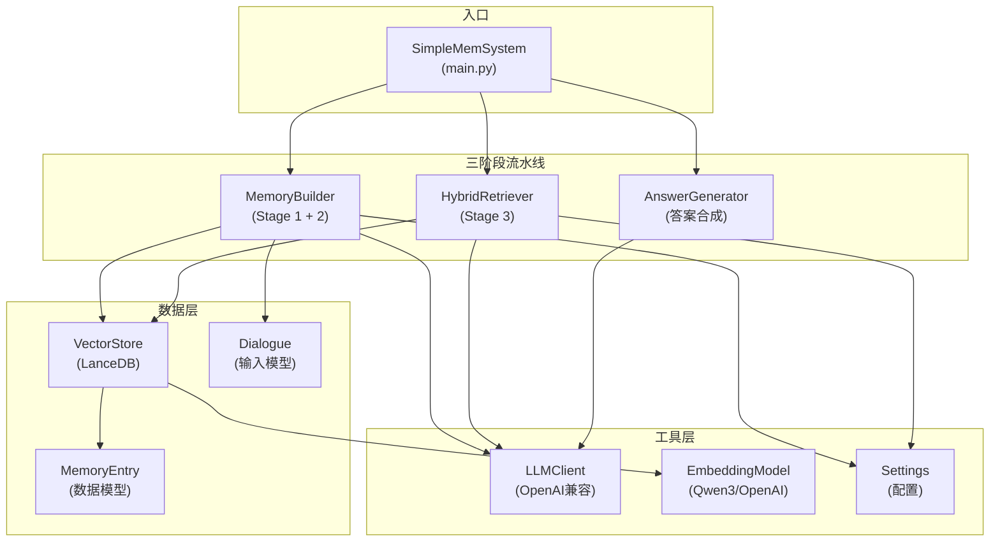

## 3. 核心类设计

### 3.1 SimpleMemSystem (系统入口)

**职责**: 组装三大模块，提供统一的 `add_dialogue` / `ask` 接口

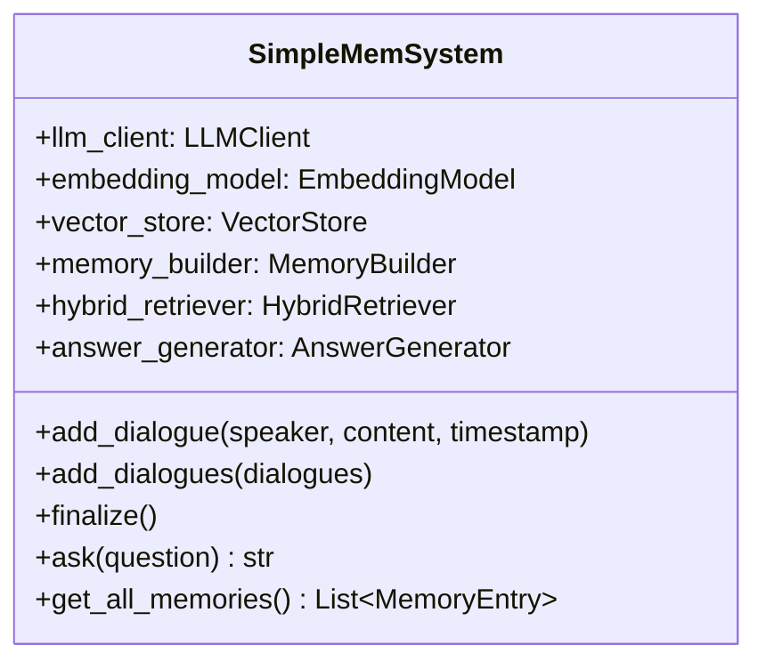

**初始化流程**:

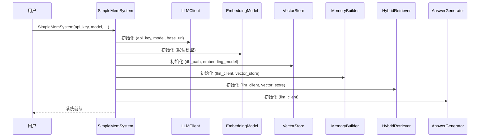

### 3.2 MemoryBuilder (记忆构建器)

**职责**: Stage 1 (语义结构化压缩) + Stage 2 (在线语义合成)

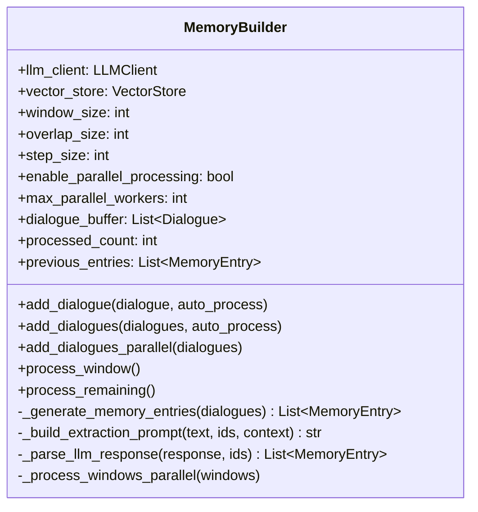

**滑动窗口处理时序**:

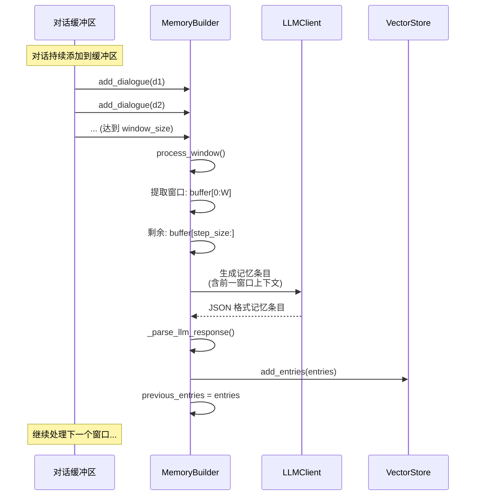

**并行处理流程**:

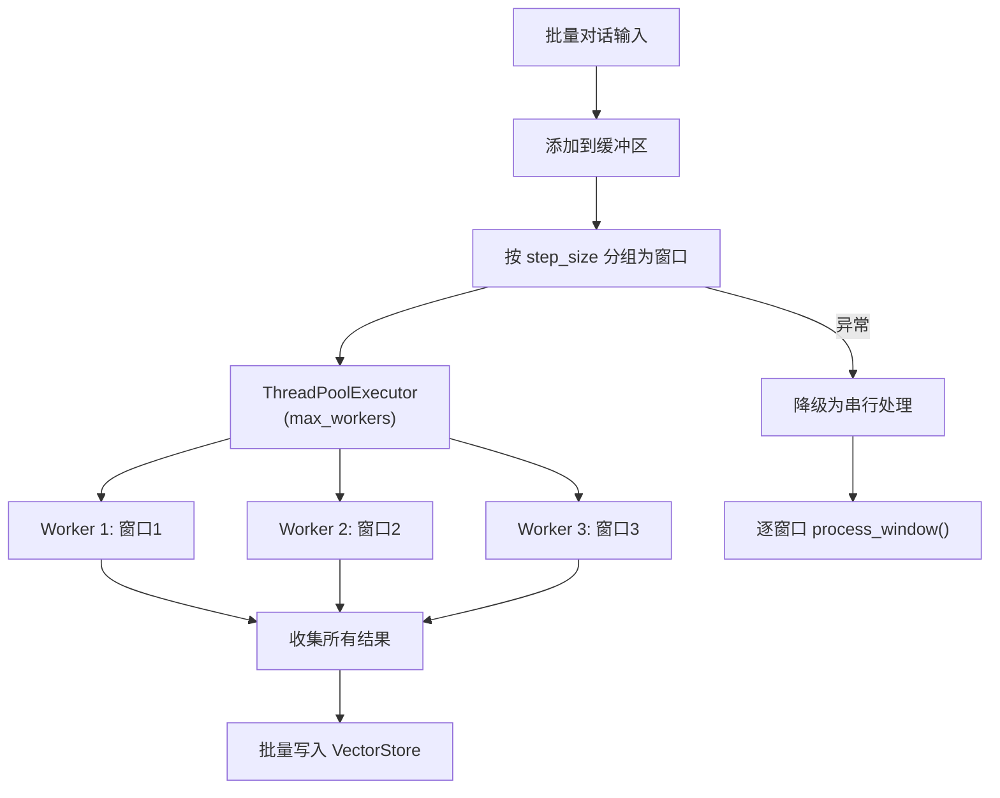

### 3.3 HybridRetriever (混合检索器)

**职责**: Stage 3 (意图感知检索规划)，实现多视图检索与反思

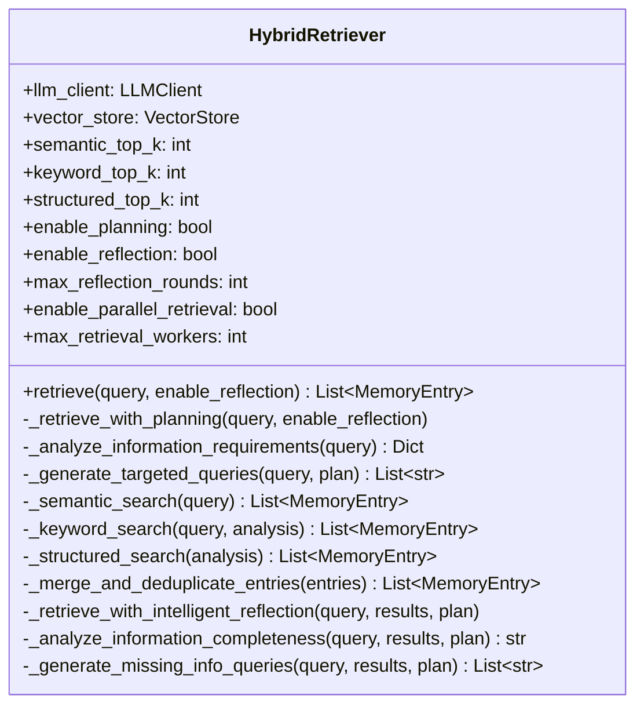

**检索规划详细时序**:

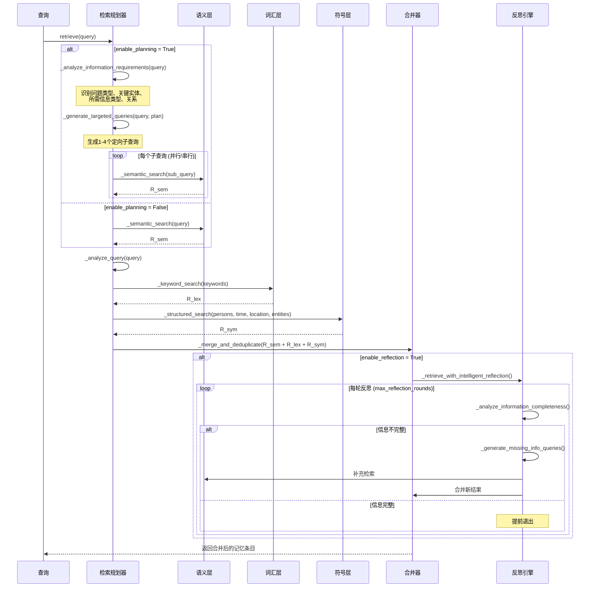

### 3.4 VectorStore (向量存储)

**职责**: 三层索引的存储与检索

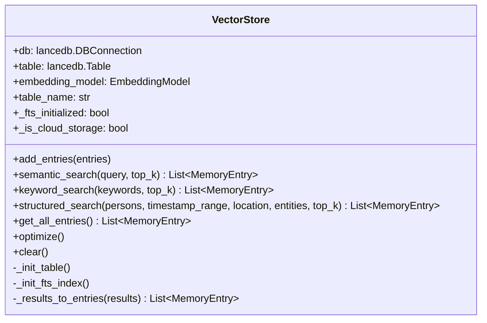

**三层索引检索示意**:

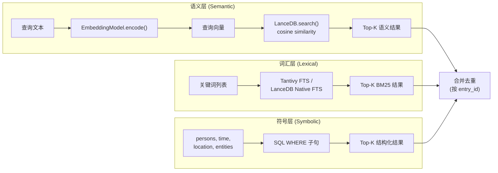

### 3.5 AnswerGenerator (答案生成器)

**职责**: 基于检索上下文生成简洁答案

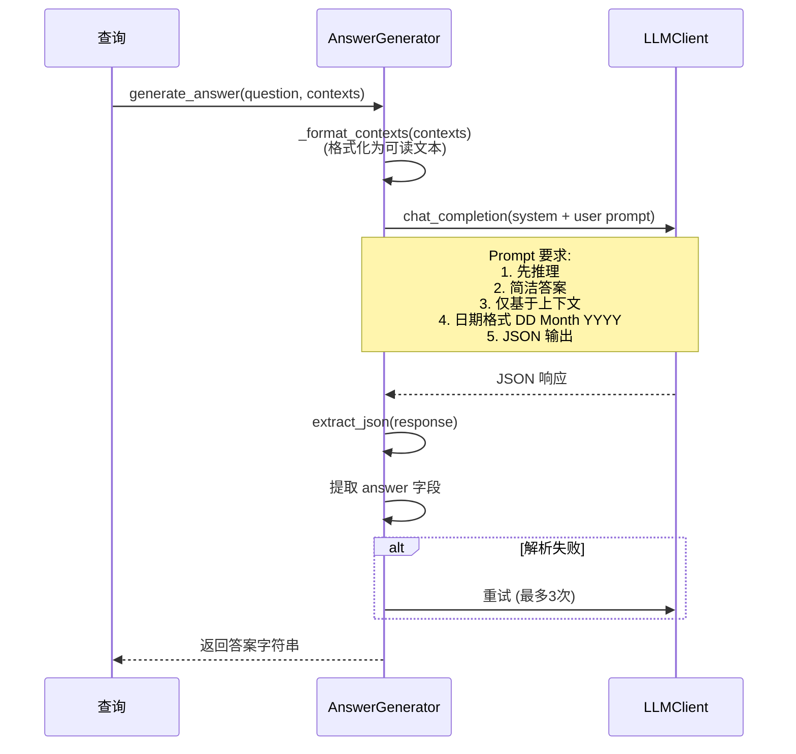

## 4. 数据模型

### 4.1 MemoryEntry

```mermaid
classDiagram
    class MemoryEntry {
        +entry_id: str (UUID)
        +lossless_restatement: str
        +keywords: List~str~
        +timestamp: Optional~str~
        +location: Optional~str~
        +persons: List~str~
        +entities: List~str~
        +topic: Optional~str~
    }

    class Dialogue {
        +dialogue_id: int
        +speaker: str
        +content: str
        +timestamp: Optional~str~
        +__str__() str
    }

    Dialogue -->|"压缩转换"| MemoryEntry : MemoryBuilder
```

**索引映射**:

| MemoryEntry 字段 | 索引层 | 检索方式 |
|:--|:--|:--|
| lossless_restatement | 语义层 | 向量相似度 (cos) |
| lossless_restatement | 词汇层 | BM25 全文搜索 |
| keywords | 词汇层 | BM25 关键词匹配 |
| timestamp | 符号层 | 时间范围过滤 |
| location | 符号层 | LIKE 模糊匹配 |
| persons | 符号层 | array_has_any |
| entities | 符号层 | array_has_any |
| topic | 符号层 | 精确匹配 |

## 5. 关键交互流程

### 5.1 完整问答流程

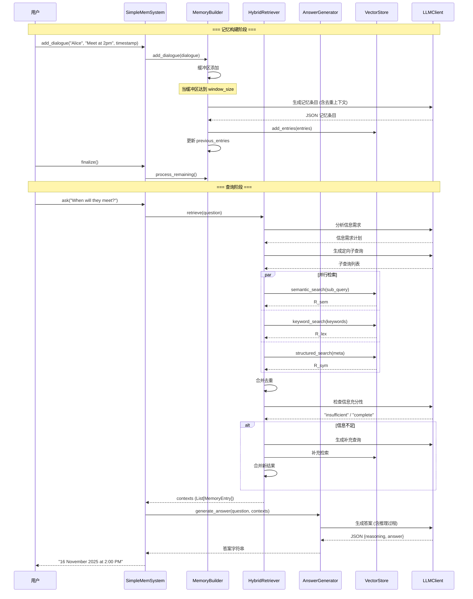

## 6. 配置参数

| 参数 | 默认值 | 描述 |
|:--|:--|:--|
| WINDOW_SIZE | 配置文件 | 滑动窗口大小 |
| OVERLAP_SIZE | 0 | 窗口重叠对话数 |
| SEMANTIC_TOP_K | 配置文件 | 语义检索 top-k |
| KEYWORD_TOP_K | 配置文件 | 关键词检索 top-k |
| STRUCTURED_TOP_K | 配置文件 | 结构化检索 top-k |
| ENABLE_PLANNING | True | 启用检索规划 |
| ENABLE_REFLECTION | True | 启用反思检索 |
| MAX_REFLECTION_ROUNDS | 2 | 最大反思轮数 |
| ENABLE_PARALLEL_PROCESSING | True | 启用并行记忆构建 |
| MAX_PARALLEL_WORKERS | 4 | 最大并行工作线程 |
| ENABLE_PARALLEL_RETRIEVAL | True | 启用并行检索 |
| MAX_RETRIEVAL_WORKERS | 3 | 最大检索工作线程 |
| USE_JSON_FORMAT | 配置文件 | LLM 输出 JSON 格式 |

## 7. 错误处理

| 场景 | 处理策略 |
|:--|:--|
| LLM 响应解析失败 | 最多重试 3 次，每次重新调用 LLM |
| 并行处理异常 | 自动降级为串行处理，恢复缓冲区状态 |
| 向量搜索异常 | 返回空列表，打印错误信息 |
| 空检索结果 | 答案生成器返回 "No relevant information found" |
| 时间表达式解析失败 | 跳过时间范围过滤 |
