# TencentDB Agent Memory — 整体架构设计文档

## 1. 架构总览

TencentDB Agent Memory 是一个宿主无关的 AI Agent 记忆系统，为 OpenClaw 插件和 Standalone/Gateway 两种宿主环境提供统一的记忆能力。系统采用四层记忆金字塔（L0→L1→L2→L3）实现从原始对话到用户画像的渐进式提取，并通过上下文卸载（Offload）模块实现短期记忆的多级压缩。

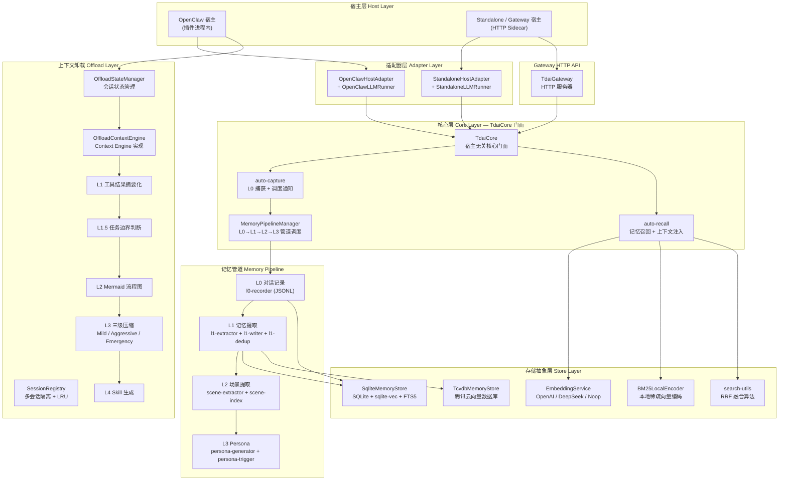
```mermaid
graph TB
    subgraph "宿主层 Host Layer"
        OC["OpenClaw 宿主<br/>(插件进程内)"]
        GW["Standalone / Gateway 宿主<br/>(HTTP Sidecar)"]
    end

    subgraph "适配器层 Adapter Layer"
        OCA["OpenClawHostAdapter<br/>+ OpenClawLLMRunner"]
        STA["StandaloneHostAdapter<br/>+ StandaloneLLMRunner"]
    end

    subgraph "核心层 Core Layer — TdaiCore 门面"
        TC["TdaiCore<br/>宿主无关核心门面"]
        AC["auto-capture<br/>L0 捕获 + 调度通知"]
        AR["auto-recall<br/>记忆召回 + 上下文注入"]
        PM["MemoryPipelineManager<br/>L0→L1→L2→L3 管道调度"]
    end

    subgraph "记忆管道 Memory Pipeline"
        L0["L0 对话记录<br/>l0-recorder (JSONL)"]
        L1["L1 记忆提取<br/>l1-extractor + l1-writer + l1-dedup"]
        L2["L2 场景提取<br/>scene-extractor + scene-index"]
        L3["L3 Persona<br/>persona-generator + persona-trigger"]
    end

    subgraph "存储抽象层 Store Layer"
        SS["SqliteMemoryStore<br/>SQLite + sqlite-vec + FTS5"]
        TV["TcvdbMemoryStore<br/>腾讯云向量数据库"]
        ES["EmbeddingService<br/>OpenAI / DeepSeek / Noop"]
        BM["BM25LocalEncoder<br/>本地稀疏向量编码"]
        SU["search-utils<br/>RRF 融合算法"]
    end

    subgraph "上下文卸载 Offload Layer"
        OSM["OffloadStateManager<br/>会话状态管理"]
        SR["SessionRegistry<br/>多会话隔离 + LRU"]
        OCE["OffloadContextEngine<br/>Context Engine 实现"]
        OL1["L1 工具结果摘要化"]
        OL15["L1.5 任务边界判断"]
        OL2["L2 Mermaid 流程图"]
        OL3["L3 三级压缩<br/>Mild / Aggressive / Emergency"]
        OL4["L4 Skill 生成"]
    end

    subgraph "Gateway HTTP API"
        GS["TdaiGateway<br/>HTTP 服务器"]
    end

    OC --> OCA --> TC
    GW --> STA --> TC
    TC --> AC --> PM
    TC --> AR
    PM --> L0 --> L1 --> L2 --> L3
    L0 --> SS
    L1 --> SS
    L1 --> TV
    AR --> ES
    AR --> BM
    AR --> SU
    OC --> OSM --> OCE
    OCE --> OL1 --> OL15 --> OL2 --> OL3 --> OL4
    GW --> GS --> TC
```

---

## 2. 核心设计原则

### 2.1 依赖倒置

Core 层仅依赖抽象接口（`HostAdapter`、`LLMRunner`、`IMemoryStore`），不依赖具体宿主或存储后端。所有宿主特定逻辑通过适配器注入。

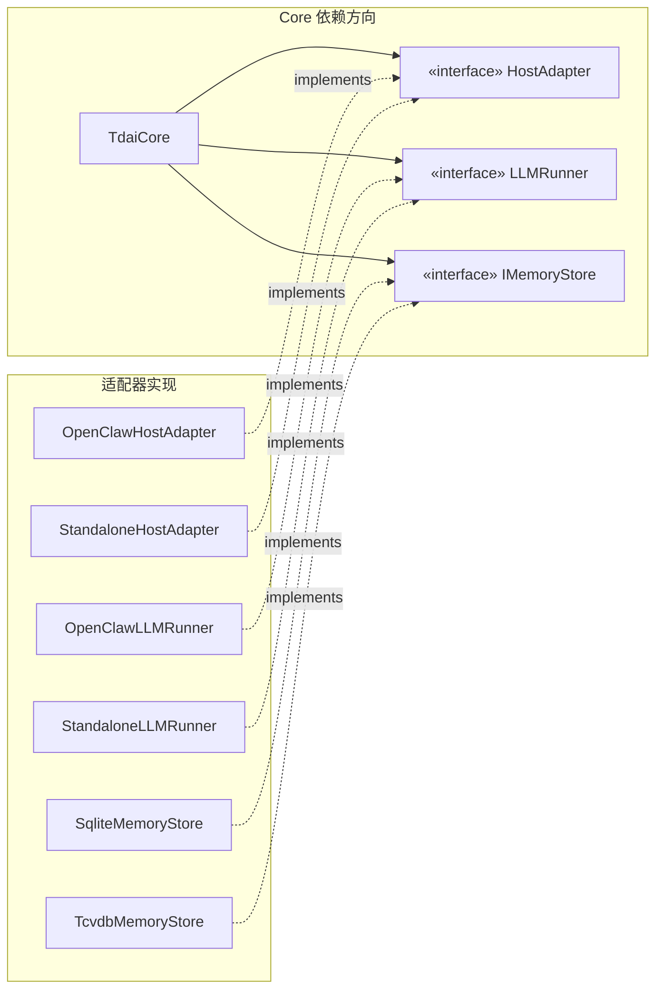
```mermaid
graph LR
    subgraph "Core 依赖方向"
        TC["TdaiCore"] --> HA["«interface» HostAdapter"]
        TC --> LR["«interface» LLMRunner"]
        TC --> MS["«interface» IMemoryStore"]
    end

    subgraph "适配器实现"
        OCA["OpenClawHostAdapter"] -.->|implements| HA
        STA["StandaloneHostAdapter"] -.->|implements| HA
        OLR["OpenClawLLMRunner"] -.->|implements| LR
        SLR["StandaloneLLMRunner"] -.->|implements| LR
        SQL["SqliteMemoryStore"] -.->|implements| MS
        TCV["TcvdbMemoryStore"] -.->|implements| MS
    end
```

### 2.2 适配器模式

通过 `HostAdapter` 隔离 OpenClaw 和 Standalone/Gateway 两种宿主环境，Core 层无需感知宿主差异：

| 职责 | HostAdapter 方法 | OpenClaw 实现 | Standalone 实现 |
|------|------------------|--------------|----------------|
| 身份识别 | `getRuntimeContext()` | 从 pluginConfig/sessionKey 构建 | 从 HTTP 请求参数构建 |
| LLM 调用 | `getLLMRunnerFactory()` | 桥接 CleanContextRunner | Vercel AI SDK 直调 |
| 日志 | `getLogger()` | OpenClaw Plugin Logger | Console Logger |

### 2.3 工厂模式

`StoreBundle` 工厂根据配置创建存储后端 + 嵌入服务 + BM25 编码器：

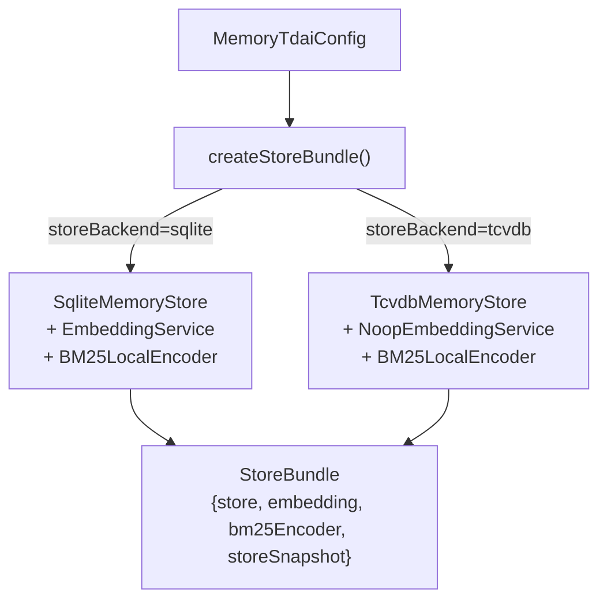
```mermaid
graph TD
    CFG["MemoryTdaiConfig"] --> F["createStoreBundle()"]
    F -->|storeBackend=sqlite| SQL["SqliteMemoryStore<br/>+ EmbeddingService<br/>+ BM25LocalEncoder"]
    F -->|storeBackend=tcvdb| TCV["TcvdbMemoryStore<br/>+ NoopEmbeddingService<br/>+ BM25LocalEncoder"]
    SQL --> BUNDLE["StoreBundle<br/>{store, embedding, bm25Encoder, storeSnapshot}"]
    TCV --> BUNDLE
```

### 2.4 管道模式

L0→L1→L2→L3 四层记忆提取管道，由 `MemoryPipelineManager` 统一调度：

- **L0（捕获）**：对话消息本地写入，无远程调用
- **L1（批量提取）**：LLM 提取结构化记忆 + 去重
- **L2（场景提取）**：LLM 生成场景文件 + 导航索引
- **L3（Persona 生成）**：LLM 生成/更新用户画像

### 2.5 容错设计

所有后端均遵循**错误时返回空结果/false**，绝不向上层抛出异常：

- `IMemoryStore` 所有方法返回空数组或 `false`，而非 throw
- `EmbeddingService` 嵌入失败时写入 metadata-only，后台重试
- `auto-recall` 超时后返回 `undefined`，不阻塞用户请求
- L1 Runner 失败后消息回退到 buffer，自动重试（最多 5 次）
- L1.5 判断失败后激活 fail-safe，标记为 short 任务

---

## 3. 模块职责与边界

### 3.1 模块层次图

```mermaid
graph TD
    subgraph "入口层"
        IDX["index.ts<br/>OpenClaw 插件入口（薄壳层）"]
        CFG["config.ts<br/>配置类型与解析器"]
    end

    subgraph "核心层 core/"
        TDC["tdai-core.ts<br/>TdaiCore 门面类"]
        TYP["types.ts<br/>核心抽象接口"]
        CONV["conversation/<br/>L0 对话记录"]
        HOOK["hooks/<br/>自动钩子"]
        REC["record/<br/>L1 记忆处理"]
        PROM["prompts/<br/>LLM 提示词模板"]
        SCEN["scene/<br/>L2 场景管理"]
        PERS["persona/<br/>L3 Persona"]
        PROF["profile/<br/>Profile 同步"]
        STOR["store/<br/>存储抽象层"]
        TOOL["tools/<br/>Agent 工具"]
        SEED["seed/<br/>种子数据管道"]
        RPT["report/<br/>指标上报"]
    end

    subgraph "适配器层 adapters/"
        OCA2["openclaw/<br/>OpenClaw 适配"]
        STA2["standalone/<br/>Standalone/Gateway 适配"]
    end

    subgraph "Gateway 层 gateway/"
        SRV["server.ts<br/>HTTP 服务器"]
        GCFG["config.ts<br/>Gateway 配置"]
        GTYP["types.ts<br/>API 类型"]
    end

    subgraph "上下文卸载 offload/"
        OIDX["index.ts<br/>模块入口 + Context Engine"]
        OTYP["types.ts<br/>核心类型"]
        OSM2["state-manager.ts<br/>会话状态管理"]
        OSES["session-registry.ts<br/>会话注册表"]
        OHOOK["hooks/<br/>OpenClaw 钩子实现"]
        OLLM["local-llm/<br/>本地 LLM 客户端"]
        OPIPE["pipelines/<br/>L2 MMD 生成"]
    end

    subgraph "工具层 utils/"
        PF["pipeline-factory.ts<br/>管道工厂"]
        PM2["pipeline-manager.ts<br/>管道调度器"]
        CP["checkpoint.ts<br/>检查点管理"]
        BK["backup.ts<br/>备份管理"]
        SQ["serial-queue.ts<br/>串行队列"]
        MT["managed-timer.ts<br/>托管定时器"]
        SF["session-filter.ts<br/>会话过滤"]
    end

    IDX --> TDC
    IDX --> OCA2
    IDX --> OIDX
    TDC --> HOOK
    TDC --> STOR
    TDC --> PM2
    SRV --> TDC
```

### 3.2 模块职责表

| 模块 | 职责 | 对外接口 | 依赖方向 |
|------|------|---------|---------|
| `TdaiCore` | 宿主无关核心门面 | `handleBeforeRecall()`, `handleTurnCommitted()`, `searchMemories()`, `searchConversations()`, `handleSessionEnd()` | → HostAdapter, IMemoryStore, PipelineManager |
| `auto-capture` | L0 捕获 + 调度通知 | `performAutoCapture()` | → l0-recorder, PipelineManager, IMemoryStore |
| `auto-recall` | 记忆召回 + 上下文注入 | `performAutoRecall()` | → IMemoryStore, EmbeddingService, scene-index |
| `MemoryPipelineManager` | L0→L1→L2→L3 管道调度 | `notifyConversation()`, `flushSession()`, `destroy()` | → L1Runner, L2Runner, L3Runner, CheckpointManager |
| `IMemoryStore` | 存储抽象接口 | `upsertL1/L0`, `searchL1Vector/Fts/Hybrid`, `pullProfiles/syncProfiles` | ← SqliteMemoryStore, TcvdbMemoryStore |
| `StoreBundle Factory` | 创建存储后端组合 | `createStoreBundle()` | → SqliteMemoryStore, TcvdbMemoryStore, EmbeddingService |
| `OffloadContextEngine` | 上下文卸载引擎 | `bootstrap()`, `assemble()`, `compact()`, `afterTurn()` | → OffloadStateManager, SessionRegistry, BackendClient |
| `TdaiGateway` | HTTP API 服务 | `/recall`, `/capture`, `/search/memories`, `/search/conversations`, `/session/end` | → TdaiCore |

---

## 4. 数据流设计

### 4.1 记忆提取数据流

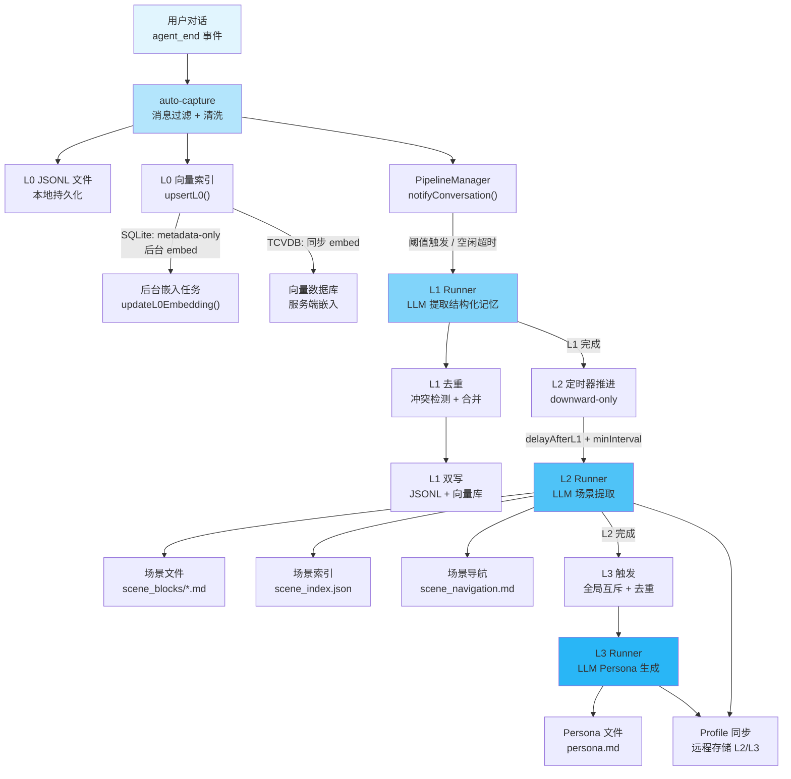
```mermaid
flowchart TD
    UE["用户对话<br/>agent_end 事件"] --> CAP["auto-capture<br/>消息过滤 + 清洗"]

    CAP --> JSONL["L0 JSONL 文件<br/>本地持久化"]
    CAP --> VEC["L0 向量索引<br/>upsertL0()"]

    VEC -->|SQLite: metadata-only<br/>后台 embed| BG["后台嵌入任务<br/>updateL0Embedding()"]
    VEC -->|TCVDB: 同步 embed| VDB["向量数据库<br/>服务端嵌入"]

    CAP --> NOTIFY["PipelineManager<br/>notifyConversation()"]

    NOTIFY -->|阈值触发 / 空闲超时| L1R["L1 Runner<br/>LLM 提取结构化记忆"]
    L1R --> DEDUP["L1 去重<br/>冲突检测 + 合并"]
    DEDUP --> L1W["L1 双写<br/>JSONL + 向量库"]

    L1R -->|L1 完成| L2ADV["L2 定时器推进<br/>downward-only"]
    L2ADV -->|delayAfterL1 + minInterval| L2R["L2 Runner<br/>LLM 场景提取"]
    L2R --> SCENE["场景文件<br/>scene_blocks/*.md"]
    L2R --> SIDX["场景索引<br/>scene_index.json"]
    L2R --> NAV["场景导航<br/>scene_navigation.md"]

    L2R -->|L2 完成| L3TR["L3 触发<br/>全局互斥 + 去重"]
    L3TR --> L3R["L3 Runner<br/>LLM Persona 生成"]
    L3R --> PERS["Persona 文件<br/>persona.md"]

    L2R --> PSYNC["Profile 同步<br/>远程存储 L2/L3"]
    L3R --> PSYNC

    style UE fill:#e1f5fe
    style CAP fill:#b3e5fc
    style L1R fill:#81d4fa
    style L2R fill:#4fc3f7
    style L3R fill:#29b6f6
```

### 4.2 记忆召回数据流

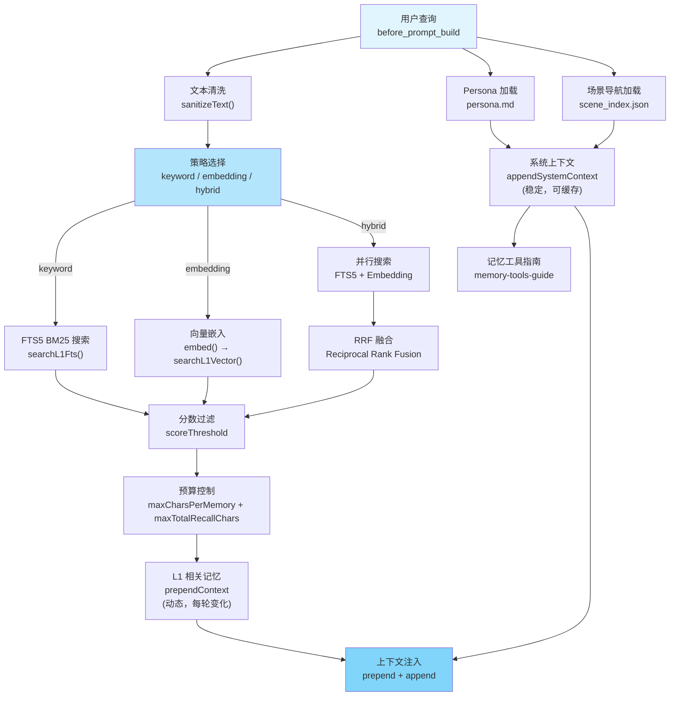
```mermaid
flowchart TD
    UQ["用户查询<br/>before_prompt_build"] --> SAN["文本清洗<br/>sanitizeText()"]

    SAN --> STRAT["策略选择<br/>keyword / embedding / hybrid"]

    STRAT -->|keyword| FTS["FTS5 BM25 搜索<br/>searchL1Fts()"]
    STRAT -->|embedding| EMB["向量嵌入<br/>embed() → searchL1Vector()"]
    STRAT -->|hybrid| PAR["并行搜索<br/>FTS5 + Embedding"]

    PAR --> RRF["RRF 融合<br/>Reciprocal Rank Fusion"]
    FTS --> FILT["分数过滤<br/>scoreThreshold"]
    EMB --> FILT
    RRF --> FILT

    FILT --> BUDGET["预算控制<br/>maxCharsPerMemory + maxTotalRecallChars"]
    BUDGET --> L1CTX["L1 相关记忆<br/>prependContext<br/>(动态，每轮变化)"]

    UQ --> PERS["Persona 加载<br/>persona.md"]
    UQ --> SCENE["场景导航加载<br/>scene_index.json"]

    PERS --> SYSCTX["系统上下文<br/>appendSystemContext<br/>(稳定，可缓存)"]
    SCENE --> SYSCTX
    SYSCTX --> GUIDE["记忆工具指南<br/>memory-tools-guide"]

    L1CTX --> INJECT["上下文注入<br/>prepend + append"]
    SYSCTX --> INJECT

    style UQ fill:#e1f5fe
    style STRAT fill:#b3e5fc
    style INJECT fill:#81d4fa
```

---

## 5. 关键交互时序

### 5.1 对话捕获与记忆提取时序

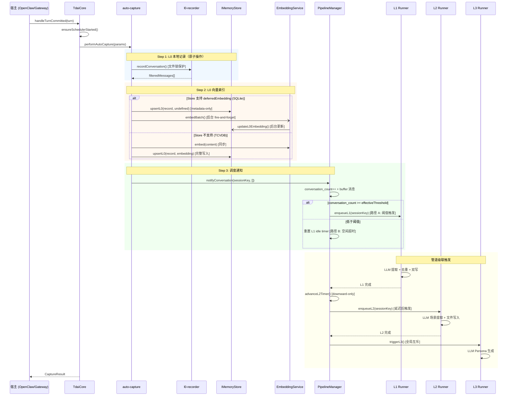
```mermaid
sequenceDiagram
    participant Host as 宿主 (OpenClaw/Gateway)
    participant Core as TdaiCore
    participant Capture as auto-capture
    participant L0 as l0-recorder
    participant Store as IMemoryStore
    participant Embed as EmbeddingService
    participant PM as PipelineManager
    participant L1 as L1 Runner
    participant L2 as L2 Runner
    participant L3 as L3 Runner

    Host->>Core: handleTurnCommitted(turn)
    Core->>Core: ensureSchedulerStarted()
    Core->>Capture: performAutoCapture(params)

    rect rgb(240, 248, 255)
        Note over Capture,Store: Step 1: L0 本地记录（原子操作）
        Capture->>L0: recordConversation() [文件锁保护]
        L0-->>Capture: filteredMessages[]
    end

    rect rgb(255, 248, 240)
        Note over Capture,Embed: Step 2: L0 向量索引
        alt Store 支持 deferredEmbedding (SQLite)
            Capture->>Store: upsertL0(record, undefined) [metadata-only]
            Capture-)Embed: embedBatch() [后台 fire-and-forget]
            Embed-)Store: updateL0Embedding() [后台更新]
        else Store 不支持 (TCVDB)
            Capture->>Embed: embed(content) [同步]
            Capture->>Store: upsertL0(record, embedding) [完整写入]
        end
    end

    rect rgb(240, 255, 240)
        Note over Capture,PM: Step 3: 调度通知
        Capture->>PM: notifyConversation(sessionKey, [])
        PM->>PM: conversation_count++ + buffer 消息
        alt conversation_count >= effectiveThreshold
            PM->>L1: enqueueL1(sessionKey) [路径 A: 阈值触发]
        else 低于阈值
            PM->>PM: 重置 L1 idle timer [路径 B: 空闲超时]
        end
    end

    rect rgb(255, 255, 240)
        Note over L1,L3: 管道级联触发
        L1->>L1: LLM 提取 + 去重 + 双写
        L1-->>PM: L1 完成
        PM->>PM: advanceL2Timer() [downward-only]
        PM->>L2: enqueueL2(sessionKey) [延迟后触发]
        L2->>L2: LLM 场景提取 + 文件写入
        L2-->>PM: L2 完成
        PM->>L3: triggerL3() [全局互斥]
        L3->>L3: LLM Persona 生成
    end

    Core-->>Host: CaptureResult
```

### 5.2 记忆召回时序

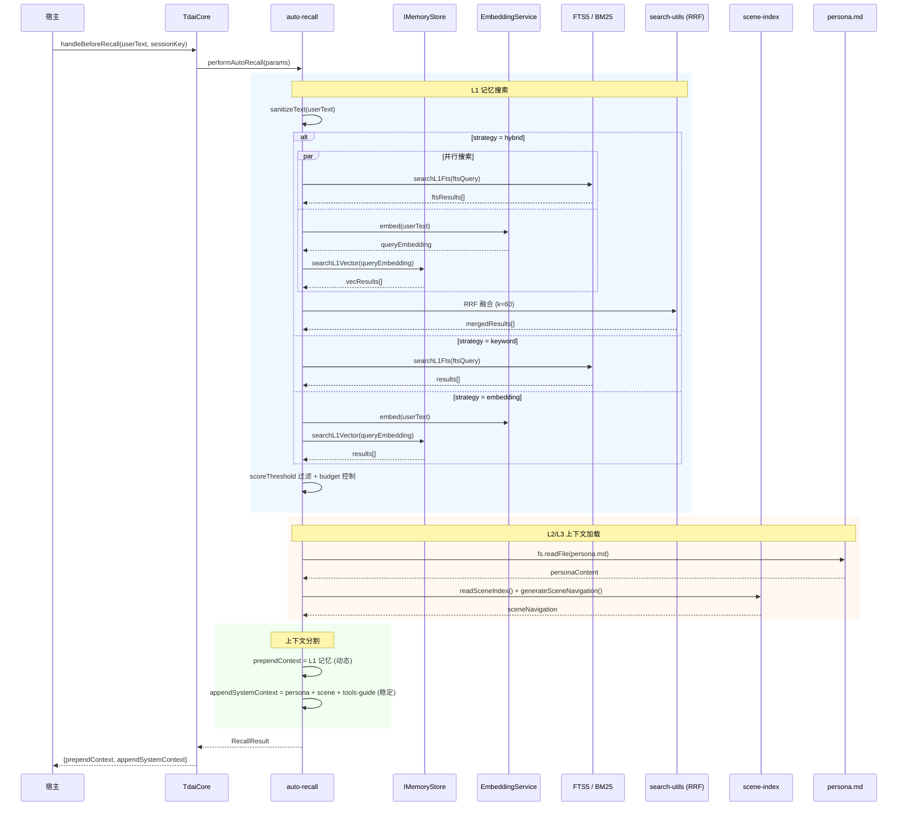
```mermaid
sequenceDiagram
    participant Host as 宿主
    participant Core as TdaiCore
    participant Recall as auto-recall
    participant Store as IMemoryStore
    participant Embed as EmbeddingService
    participant BM25 as FTS5 / BM25
    participant RRF as search-utils (RRF)
    participant Scene as scene-index
    participant Persona as persona.md

    Host->>Core: handleBeforeRecall(userText, sessionKey)
    Core->>Recall: performAutoRecall(params)

    rect rgb(240, 248, 255)
        Note over Recall,RRF: L1 记忆搜索
        Recall->>Recall: sanitizeText(userText)

        alt strategy = hybrid
            par 并行搜索
                Recall->>BM25: searchL1Fts(ftsQuery)
                BM25-->>Recall: ftsResults[]
            and
                Recall->>Embed: embed(userText)
                Embed-->>Recall: queryEmbedding
                Recall->>Store: searchL1Vector(queryEmbedding)
                Store-->>Recall: vecResults[]
            end
            Recall->>RRF: RRF 融合 (k=60)
            RRF-->>Recall: mergedResults[]
        else strategy = keyword
            Recall->>BM25: searchL1Fts(ftsQuery)
            BM25-->>Recall: results[]
        else strategy = embedding
            Recall->>Embed: embed(userText)
            Recall->>Store: searchL1Vector(queryEmbedding)
            Store-->>Recall: results[]
        end

        Recall->>Recall: scoreThreshold 过滤 + budget 控制
    end

    rect rgb(255, 248, 240)
        Note over Recall,Persona: L2/L3 上下文加载
        Recall->>Persona: fs.readFile(persona.md)
        Persona-->>Recall: personaContent
        Recall->>Scene: readSceneIndex() + generateSceneNavigation()
        Scene-->>Recall: sceneNavigation
    end

    rect rgb(240, 255, 240)
        Note over Recall: 上下文分割
        Recall->>Recall: prependContext = L1 记忆 (动态)
        Recall->>Recall: appendSystemContext = persona + scene + tools-guide (稳定)
    end

    Recall-->>Core: RecallResult
    Core-->>Host: {prependContext, appendSystemContext}
```

### 5.3 上下文卸载压缩时序

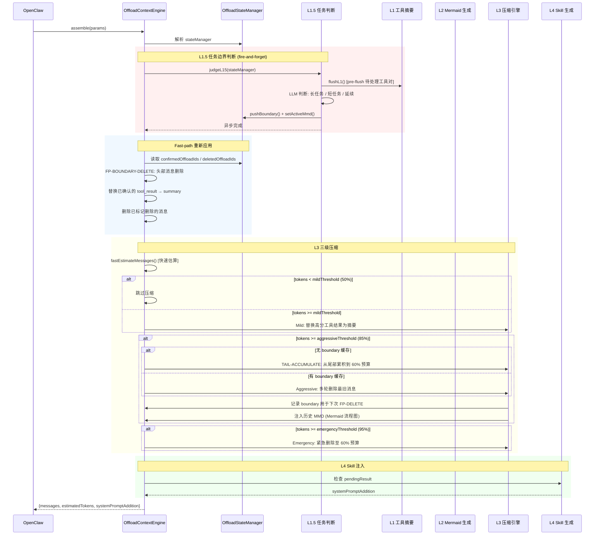
```mermaid
sequenceDiagram
    participant Host as OpenClaw
    participant CE as OffloadContextEngine
    participant SM as OffloadStateManager
    participant L15 as L1.5 任务判断
    participant L1 as L1 工具摘要
    participant L2 as L2 Mermaid 生成
    participant L3 as L3 压缩引擎
    participant L4 as L4 Skill 生成

    Host->>CE: assemble(params)
    CE->>SM: 解析 stateManager

    rect rgb(255, 240, 240)
        Note over CE,L15: L1.5 任务边界判断 (fire-and-forget)
        CE->>L15: judgeL15(stateManager)
        L15->>L1: flushL1() [pre-flush 待处理工具对]
        L15->>L15: LLM 判断: 长任务 / 短任务 / 延续
        L15->>SM: pushBoundary() + setActiveMmd()
        L15-->>CE: 异步完成
    end

    rect rgb(240, 248, 255)
        Note over CE,SM: Fast-path 重新应用
        CE->>SM: 读取 confirmedOffloadIds / deletedOffloadIds
        CE->>CE: FP-BOUNDARY-DELETE: 头部消息删除
        CE->>CE: 替换已确认的 tool_result → summary
        CE->>CE: 删除已标记删除的消息
    end

    rect rgb(255, 255, 240)
        Note over CE,L3: L3 三级压缩
        CE->>CE: fastEstimateMessages() [快速估算]

        alt tokens < mildThreshold (50%)
            CE->>CE: 跳过压缩
        else tokens >= mildThreshold
            CE->>L3: Mild: 替换高分工具结果为摘要
        end

        alt tokens >= aggressiveThreshold (85%)
            alt 无 boundary 缓存
                CE->>L3: TAIL-ACCUMULATE: 从尾部累积到 60% 预算
            else 有 boundary 缓存
                CE->>L3: Aggressive: 多轮删除最旧消息
            end
            L3->>CE: 记录 boundary 用于下次 FP-DELETE
            L3->>CE: 注入历史 MMD (Mermaid 流程图)
        end

        alt tokens >= emergencyThreshold (95%)
            CE->>L3: Emergency: 紧急删除至 60% 预算
        end
    end

    rect rgb(240, 255, 240)
        Note over CE,L4: L4 Skill 注入
        CE->>L4: 检查 pendingResult
        L4-->>CE: systemPromptAddition
    end

    CE-->>Host: {messages, estimatedTokens, systemPromptAddition}
```

### 5.4 管道调度时序

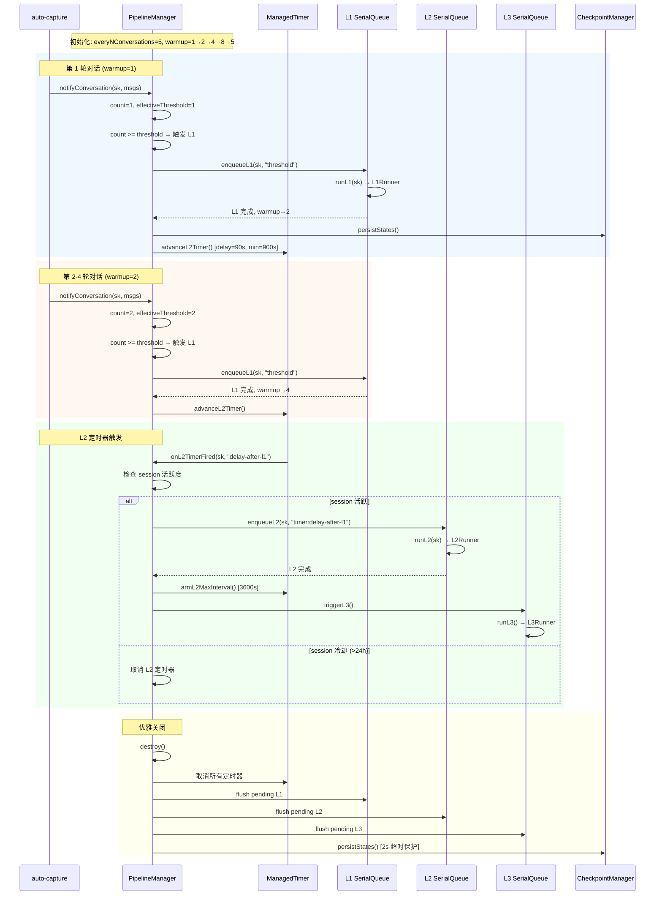
```mermaid
sequenceDiagram
    participant Capture as auto-capture
    participant PM as PipelineManager
    participant Timer as ManagedTimer
    participant L1Q as L1 SerialQueue
    participant L2Q as L2 SerialQueue
    participant L3Q as L3 SerialQueue
    participant CP as CheckpointManager

    Note over PM: 初始化: everyNConversations=5, warmup=1→2→4→8→5

    rect rgb(240, 248, 255)
        Note over Capture,PM: 第 1 轮对话 (warmup=1)
        Capture->>PM: notifyConversation(sk, msgs)
        PM->>PM: count=1, effectiveThreshold=1
        PM->>PM: count >= threshold → 触发 L1
        PM->>L1Q: enqueueL1(sk, "threshold")
        L1Q->>L1Q: runL1(sk) → L1Runner
        L1Q-->>PM: L1 完成, warmup→2
        PM->>CP: persistStates()
        PM->>Timer: advanceL2Timer() [delay=90s, min=900s]
    end

    rect rgb(255, 248, 240)
        Note over Capture,PM: 第 2-4 轮对话 (warmup=2)
        Capture->>PM: notifyConversation(sk, msgs)
        PM->>PM: count=2, effectiveThreshold=2
        PM->>PM: count >= threshold → 触发 L1
        PM->>L1Q: enqueueL1(sk, "threshold")
        L1Q-->>PM: L1 完成, warmup→4
        PM->>Timer: advanceL2Timer()
    end

    rect rgb(240, 255, 240)
        Note over Capture,PM: L2 定时器触发
        Timer->>PM: onL2TimerFired(sk, "delay-after-l1")
        PM->>PM: 检查 session 活跃度
        alt session 活跃
            PM->>L2Q: enqueueL2(sk, "timer:delay-after-l1")
            L2Q->>L2Q: runL2(sk) → L2Runner
            L2Q-->>PM: L2 完成
            PM->>Timer: armL2MaxInterval() [3600s]
            PM->>L3Q: triggerL3()
            L3Q->>L3Q: runL3() → L3Runner
        else session 冷却 (>24h)
            PM->>PM: 取消 L2 定时器
        end
    end

    rect rgb(255, 255, 240)
        Note over PM: 优雅关闭
        PM->>PM: destroy()
        PM->>Timer: 取消所有定时器
        PM->>L1Q: flush pending L1
        PM->>L2Q: flush pending L2
        PM->>L3Q: flush pending L3
        PM->>CP: persistStates() [2s 超时保护]
    end
```

---

## 6. 存储架构设计

### 6.1 存储接口类图

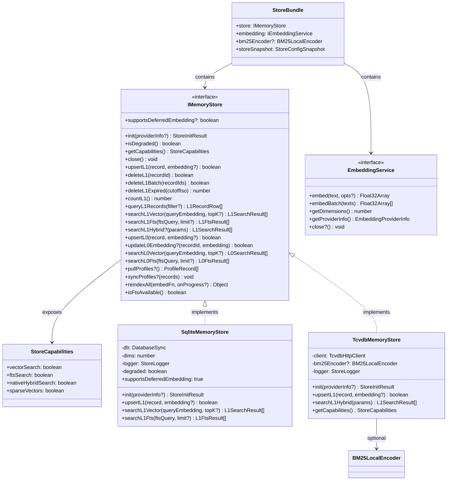
```mermaid
classDiagram
    class IMemoryStore {
        <<interface>>
        +supportsDeferredEmbedding?: boolean
        +init(providerInfo?) StoreInitResult
        +isDegraded() boolean
        +getCapabilities() StoreCapabilities
        +close() void
        +upsertL1(record, embedding?) boolean
        +deleteL1(recordId) boolean
        +deleteL1Batch(recordIds) boolean
        +deleteL1Expired(cutoffIso) number
        +countL1() number
        +queryL1Records(filter?) L1RecordRow[]
        +searchL1Vector(queryEmbedding, topK?) L1SearchResult[]
        +searchL1Fts(ftsQuery, limit?) L1FtsResult[]
        +searchL1Hybrid?(params) L1SearchResult[]
        +upsertL0(record, embedding?) boolean
        +updateL0Embedding?(recordId, embedding) boolean
        +searchL0Vector(queryEmbedding, topK?) L0SearchResult[]
        +searchL0Fts(ftsQuery, limit?) L0FtsResult[]
        +pullProfiles?() ProfileRecord[]
        +syncProfiles?(records) void
        +reindexAll(embedFn, onProgress?) Object
        +isFtsAvailable() boolean
    }

    class StoreCapabilities {
        +vectorSearch: boolean
        +ftsSearch: boolean
        +nativeHybridSearch: boolean
        +sparseVectors: boolean
    }

    class SqliteMemoryStore {
        -db: DatabaseSync
        -dims: number
        -logger: StoreLogger
        -degraded: boolean
        +init(providerInfo?) StoreInitResult
        +upsertL1(record, embedding?) boolean
        +searchL1Vector(queryEmbedding, topK?) L1SearchResult[]
        +searchL1Fts(ftsQuery, limit?) L1FtsResult[]
        +supportsDeferredEmbedding: true
    }

    class TcvdbMemoryStore {
        -client: TcvdbHttpClient
        -bm25Encoder?: BM25LocalEncoder
        -logger: StoreLogger
        +init(providerInfo?) StoreInitResult
        +upsertL1(record, embedding?) boolean
        +searchL1Hybrid(params) L1SearchResult[]
        +getCapabilities() StoreCapabilities
    }

    class EmbeddingService {
        <<interface>>
        +embed(text, opts?) Float32Array
        +embedBatch(texts) Float32Array[]
        +getDimensions() number
        +getProviderInfo() EmbeddingProviderInfo
        +close?() void
    }

    class StoreBundle {
        +store: IMemoryStore
        +embedding: IEmbeddingService
        +bm25Encoder?: BM25LocalEncoder
        +storeSnapshot: StoreConfigSnapshot
    }

    IMemoryStore <|.. SqliteMemoryStore : implements
    IMemoryStore <|.. TcvdbMemoryStore : implements
    IMemoryStore --> StoreCapabilities : exposes
    StoreBundle --> IMemoryStore : contains
    StoreBundle --> EmbeddingService : contains
    TcvdbMemoryStore --> BM25LocalEncoder : optional
```

### 6.2 存储后端对比

| 特性 | SqliteMemoryStore | TcvdbMemoryStore |
|------|-------------------|------------------|
| 向量搜索 | sqlite-vec (本地) | 腾讯云向量数据库 (服务端) |
| FTS 搜索 | FTS5 BM25 (本地) | 服务端 BM25 |
| 混合搜索 | 客户端 RRF 融合 | 服务端原生 hybridSearch |
| 嵌入方式 | 客户端嵌入 + 后台更新 | 服务端嵌入 (NoopEmbeddingService) |
| 延迟嵌入 | ✅ supportsDeferredEmbedding | ❌ 同步嵌入 |
| 稀疏向量 | BM25LocalEncoder (可选) | BM25LocalEncoder (可选) |
| Profile 同步 | 本地文件 | pullProfiles/syncProfiles |
| 部署依赖 | 无 (纯本地) | 腾讯云向量数据库实例 |

---

## 7. 适配器模式设计

### 7.1 适配器类图

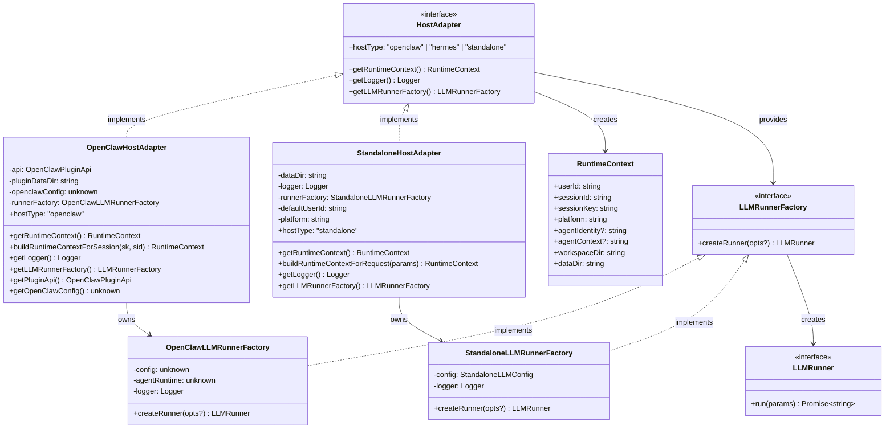
```mermaid
classDiagram
    class HostAdapter {
        <<interface>>
        +hostType: "openclaw" | "hermes" | "standalone"
        +getRuntimeContext() RuntimeContext
        +getLogger() Logger
        +getLLMRunnerFactory() LLMRunnerFactory
    }

    class LLMRunnerFactory {
        <<interface>>
        +createRunner(opts?) LLMRunner
    }

    class LLMRunner {
        <<interface>>
        +run(params) Promise~string~
    }

    class RuntimeContext {
        +userId: string
        +sessionId: string
        +sessionKey: string
        +platform: string
        +agentIdentity?: string
        +agentContext?: string
        +workspaceDir: string
        +dataDir: string
    }

    class OpenClawHostAdapter {
        -api: OpenClawPluginApi
        -pluginDataDir: string
        -openclawConfig: unknown
        -runnerFactory: OpenClawLLMRunnerFactory
        +hostType: "openclaw"
        +getRuntimeContext() RuntimeContext
        +buildRuntimeContextForSession(sk, sid) RuntimeContext
        +getLogger() Logger
        +getLLMRunnerFactory() LLMRunnerFactory
        +getPluginApi() OpenClawPluginApi
        +getOpenClawConfig() unknown
    }

    class StandaloneHostAdapter {
        -dataDir: string
        -logger: Logger
        -runnerFactory: StandaloneLLMRunnerFactory
        -defaultUserId: string
        -platform: string
        +hostType: "standalone"
        +getRuntimeContext() RuntimeContext
        +buildRuntimeContextForRequest(params) RuntimeContext
        +getLogger() Logger
        +getLLMRunnerFactory() LLMRunnerFactory
    }

    class OpenClawLLMRunnerFactory {
        -config: unknown
        -agentRuntime: unknown
        -logger: Logger
        +createRunner(opts?) LLMRunner
    }

    class StandaloneLLMRunnerFactory {
        -config: StandaloneLLMConfig
        -logger: Logger
        +createRunner(opts?) LLMRunner
    }

    HostAdapter <|.. OpenClawHostAdapter : implements
    HostAdapter <|.. StandaloneHostAdapter : implements
    LLMRunnerFactory <|.. OpenClawLLMRunnerFactory : implements
    LLMRunnerFactory <|.. StandaloneLLMRunnerFactory : implements
    HostAdapter --> RuntimeContext : creates
    HostAdapter --> LLMRunnerFactory : provides
    LLMRunnerFactory --> LLMRunner : creates
    OpenClawHostAdapter --> OpenClawLLMRunnerFactory : owns
    StandaloneHostAdapter --> StandaloneLLMRunnerFactory : owns
```

### 7.2 LLM Runner 选择策略

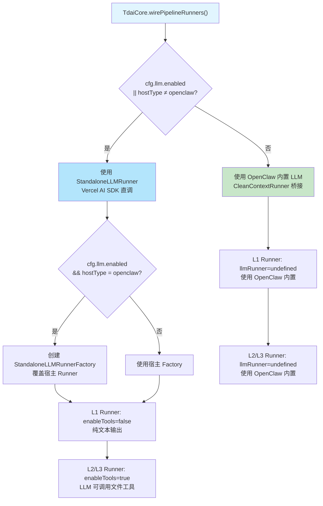
```mermaid
flowchart TD
    START["TdaiCore.wirePipelineRunners()"] --> CHECK{"cfg.llm.enabled<br/>|| hostType ≠ openclaw?"}

    CHECK -->|是| STANDALONE["使用 StandaloneLLMRunner<br/>Vercel AI SDK 直调"]
    CHECK -->|否| OPENCLAW["使用 OpenClaw 内置 LLM<br/>CleanContextRunner 桥接"]

    STANDALONE --> CHECK2{"cfg.llm.enabled<br/>&& hostType = openclaw?"}
    CHECK2 -->|是| OVERRIDE["创建 StandaloneLLMRunnerFactory<br/>覆盖宿主 Runner"]
    CHECK2 -->|否| USE_FACTORY["使用宿主 Factory"]

    OVERRIDE --> L1R["L1 Runner: enableTools=false<br/>纯文本输出"]
    USE_FACTORY --> L1R
    OPENCLAW --> L1R_UNDEF["L1 Runner: llmRunner=undefined<br/>使用 OpenClaw 内置"]

    L1R --> L2L3["L2/L3 Runner: enableTools=true<br/>LLM 可调用文件工具"]
    L1R_UNDEF --> L2L3_UNDEF["L2/L3 Runner: llmRunner=undefined<br/>使用 OpenClaw 内置"]

    style START fill:#e1f5fe
    style STANDALONE fill:#b3e5fc
    style OPENCLAW fill:#c8e6c9
```

---

## 8. 管道调度设计

### 8.1 管道状态机

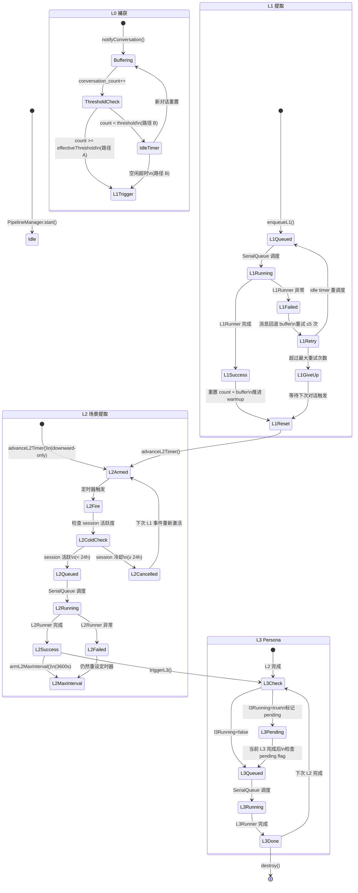
```mermaid
stateDiagram-v2
    [*] --> Idle: PipelineManager.start()

    state "L0 捕获" as L0 {
        [*] --> Buffering: notifyConversation()
        Buffering --> ThresholdCheck: conversation_count++
        ThresholdCheck --> L1Trigger: count >= effectiveThreshold\n(路径 A)
        ThresholdCheck --> IdleTimer: count < threshold\n(路径 B)
        IdleTimer --> L1Trigger: 空闲超时\n(路径 B)
        IdleTimer --> Buffering: 新对话重置
    }

    state "L1 提取" as L1 {
        [*] --> L1Queued: enqueueL1()
        L1Queued --> L1Running: SerialQueue 调度
        L1Running --> L1Success: L1Runner 完成
        L1Running --> L1Failed: L1Runner 异常
        L1Success --> L1Reset: 重置 count + buffer\n推进 warmup
        L1Failed --> L1Retry: 消息回退 buffer\n重试 ≤5 次
        L1Retry --> L1Queued: idle timer 重调度
        L1Retry --> L1GiveUp: 超过最大重试次数
        L1GiveUp --> L1Reset: 等待下次对话触发
    }

    state "L2 场景提取" as L2 {
        [*] --> L2Armed: advanceL2Timer()\n(downward-only)
        L2Armed --> L2Fire: 定时器触发
        L2Fire --> L2ColdCheck: 检查 session 活跃度
        L2ColdCheck --> L2Queued: session 活跃\n(< 24h)
        L2ColdCheck --> L2Cancelled: session 冷却\n(≥ 24h)
        L2Queued --> L2Running: SerialQueue 调度
        L2Running --> L2Success: L2Runner 完成
        L2Running --> L2Failed: L2Runner 异常
        L2Success --> L2MaxInterval: armL2MaxInterval()\n(3600s)
        L2Failed --> L2MaxInterval: 仍然重设定时器
        L2Cancelled --> L2Armed: 下次 L1 事件重新激活
    }

    state "L3 Persona" as L3 {
        [*] --> L3Check: L2 完成
        L3Check --> L3Queued: l3Running=false
        L3Check --> L3Pending: l3Running=true\n标记 pending
        L3Queued --> L3Running: SerialQueue 调度
        L3Running --> L3Done: L3Runner 完成
        L3Pending --> L3Queued: 当前 L3 完成后\n检查 pending flag
        L3Done --> L3Check: 下次 L2 完成
    }

    L1Reset --> L2Armed: advanceL2Timer()
    L2Success --> L3Check: triggerL3()
    L3Done --> [*]: destroy()
```

### 8.2 Warm-up 模式

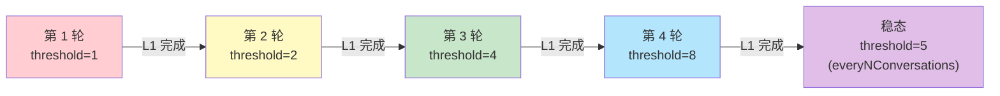
```mermaid
flowchart LR
    S1["第 1 轮<br/>threshold=1"] -->|L1 完成| S2["第 2 轮<br/>threshold=2"]
    S2 -->|L1 完成| S3["第 3 轮<br/>threshold=4"]
    S3 -->|L1 完成| S4["第 4 轮<br/>threshold=8"]
    S4 -->|L1 完成| S5["稳态<br/>threshold=5<br/>(everyNConversations)"]

    style S1 fill:#ffcdd2
    style S2 fill:#fff9c4
    style S3 fill:#c8e6c9
    style S4 fill:#b3e5fc
    style S5 fill:#e1bee7
```

### 8.3 L2 向下只进定时器

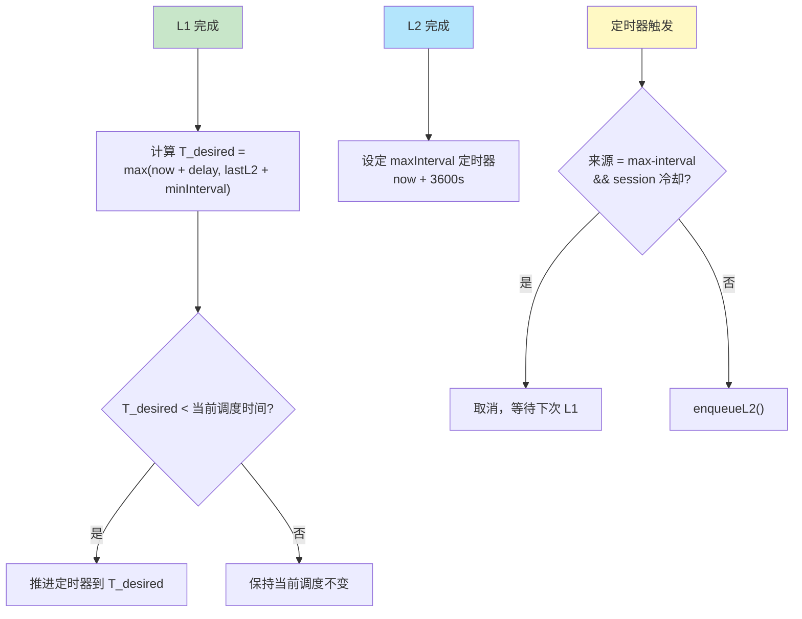
```mermaid
flowchart TD
    L1_DONE["L1 完成"] --> COMPUTE["计算 T_desired =<br/>max(now + delay, lastL2 + minInterval)"]

    COMPUTE --> COMPARE{"T_desired < 当前调度时间?"}
    COMPARE -->|是| ADVANCE["推进定时器到 T_desired"]
    COMPARE -->|否| KEEP["保持当前调度不变"]

    L2_DONE["L2 完成"] --> ARM["设定 maxInterval 定时器<br/>now + 3600s"]

    FIRE["定时器触发"] --> COLD{"来源 = max-interval<br/>&& session 冷却?"}
    COLD -->|是| CANCEL["取消，等待下次 L1"]
    COLD -->|否| ENQUEUE["enqueueL2()"]

    style L1_DONE fill:#c8e6c9
    style L2_DONE fill:#b3e5fc
    style FIRE fill:#fff9c4
```

---

## 9. 容错与降级设计

### 9.1 容错策略总览

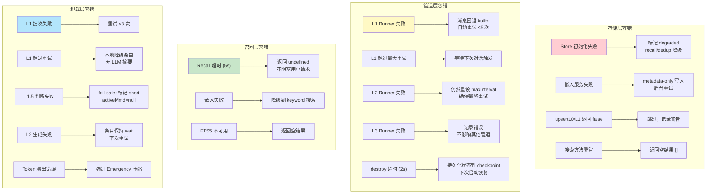
```mermaid
flowchart TD
    subgraph "存储层容错"
        S_INIT["Store 初始化失败"] --> S_DEG["标记 degraded<br/>recall/dedup 降级"]
        S_EMBED["嵌入服务失败"] --> S_META["metadata-only 写入<br/>后台重试"]
        S_UPSERT["upsertL0/L1 返回 false"] --> S_SKIP["跳过，记录警告"]
        S_SEARCH["搜索方法异常"] --> S_EMPTY["返回空结果 []"]
    end

    subgraph "管道层容错"
        P_L1["L1 Runner 失败"] --> P_BUF["消息回退 buffer<br/>自动重试 ≤5 次"]
        P_L1_MAX["L1 超过最大重试"] --> P_WAIT["等待下次对话触发"]
        P_L2["L2 Runner 失败"] --> P_ARM["仍然重设 maxInterval<br/>确保最终重试"]
        P_L3["L3 Runner 失败"] --> P_LOG["记录错误<br/>不影响其他管道"]
        P_DESTROY["destroy 超时 (2s)"] --> P_CP["持久化状态到 checkpoint<br/>下次启动恢复"]
    end

    subgraph "召回层容错"
        R_TIMEOUT["Recall 超时 (5s)"] --> R_SKIP["返回 undefined<br/>不阻塞用户请求"]
        R_EMBED_FAIL["嵌入失败"] --> R_KW["降级到 keyword 搜索"]
        R_FTS_FAIL["FTS5 不可用"] --> R_EMPTY["返回空结果"]
    end

    subgraph "卸载层容错"
        O_L1_FAIL["L1 批次失败"] --> O_RETRY["重试 ≤3 次"]
        O_L1_MAX["L1 超过重试"] --> O_FALLBACK["本地降级条目<br/>无 LLM 摘要"]
        O_L15_FAIL["L1.5 判断失败"] --> O_SAFE["fail-safe: 标记 short<br/>activeMmd=null"]
        O_L2_FAIL["L2 生成失败"] --> O_WAIT2["条目保持 wait<br/>下次重试"]
        O_TOKEN["Token 溢出错误"] --> O_EMERG["强制 Emergency 压缩"]
    end

    style S_INIT fill:#ffcdd2
    style P_L1 fill:#fff9c4
    style R_TIMEOUT fill:#c8e6c9
    style O_L1_FAIL fill:#b3e5fc
```

### 9.2 降级等级

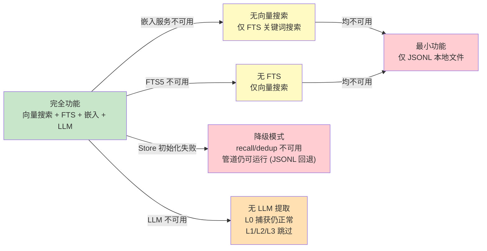
```mermaid
graph LR
    FULL["完全功能<br/>向量搜索 + FTS + 嵌入 + LLM"] -->|嵌入服务不可用| NO_VEC["无向量搜索<br/>仅 FTS 关键词搜索"]
    FULL -->|FTS5 不可用| NO_FTS["无 FTS<br/>仅向量搜索"]
    NO_VEC -->|均不可用| MINIMAL["最小功能<br/>仅 JSONL 本地文件"]
    NO_FTS -->|均不可用| MINIMAL

    FULL -->|Store 初始化失败| DEG["降级模式<br/>recall/dedup 不可用<br/>管道仍可运行 (JSONL 回退)"]

    FULL -->|LLM 不可用| NO_LLM["无 LLM 提取<br/>L0 捕获仍正常<br/>L1/L2/L3 跳过"]

    style FULL fill:#c8e6c9
    style NO_VEC fill:#fff9c4
    style NO_FTS fill:#fff9c4
    style MINIMAL fill:#ffcdd2
    style DEG fill:#ffcdd2
    style NO_LLM fill:#ffe0b2
```

### 9.3 关键容错机制

| 场景 | 机制 | 影响 |
|------|------|------|
| Store 初始化失败 | `TdaiCore.initStores()` catch 后标记 degraded，管道仍可运行 | recall/dedup 降级 |
| 嵌入 API 超时 | SQLite: metadata-only 写入 + 后台重试；TCVDB: 跳过嵌入 | 向量搜索暂时不可用 |
| L1 Runner 失败 | 消息回退到 buffer，idle timer 自动重试（≤5 次，30s 间隔） | 记忆提取延迟 |
| L1 超过最大重试 | 放弃自动重试，等待下次用户对话触发 | 记忆提取暂停 |
| Recall 超时 | `Promise.race` + 5s 超时，返回 `undefined` | 不注入记忆，不阻塞 |
| 嵌入不可用 | hybrid/embedding 策略降级到 keyword | 搜索质量降低 |
| L1.5 判断失败 | fail-safe: 标记 short + activeMmd=null | 不构建 MMD |
| L1 批次失败 | 重试 3 次后生成本地降级条目（无 LLM 摘要） | 摘要质量降低 |
| Token 溢出 | 强制 Emergency 压缩 + 设置 `_forceEmergencyNext` | 上下文被截断 |
| destroy 超时 | 2s 超时保护 + 持久化 checkpoint 供下次恢复 | 待处理工作可恢复 |
| Session GC | 每 50 次通知清理冷却 > 3×activeWindow 的 session | 内存不无限增长 |

### 9.4 优雅关闭流程

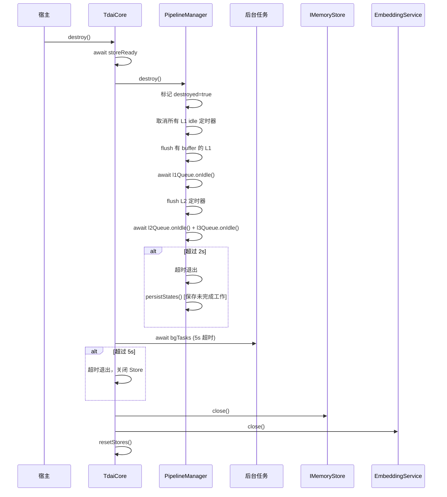
```mermaid
sequenceDiagram
    participant Host as 宿主
    participant Core as TdaiCore
    participant PM as PipelineManager
    participant BG as 后台任务
    participant Store as IMemoryStore
    participant Embed as EmbeddingService

    Host->>Core: destroy()
    Core->>Core: await storeReady

    Core->>PM: destroy()
    PM->>PM: 标记 destroyed=true
    PM->>PM: 取消所有 L1 idle 定时器
    PM->>PM: flush 有 buffer 的 L1
    PM->>PM: await l1Queue.onIdle()
    PM->>PM: flush L2 定时器
    PM->>PM: await l2Queue.onIdle() + l3Queue.onIdle()

    alt 超过 2s
        PM->>PM: 超时退出
        PM->>PM: persistStates() [保存未完成工作]
    end

    Core->>BG: await bgTasks (5s 超时)
    alt 超过 5s
        Core->>Core: 超时退出，关闭 Store
    end

    Core->>Store: close()
    Core->>Embed: close()
    Core->>Core: resetStores()
```
