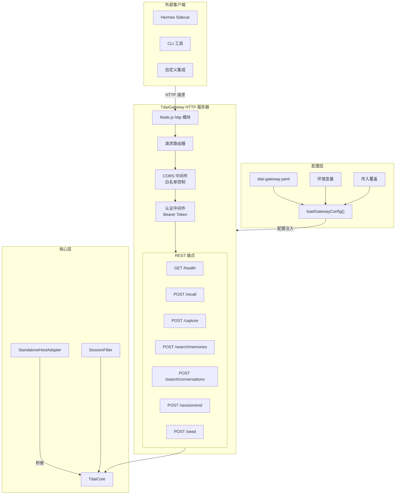
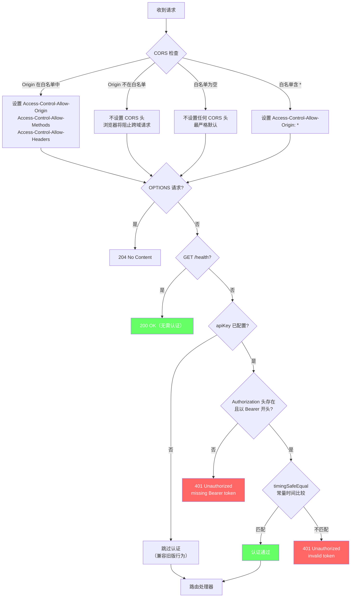
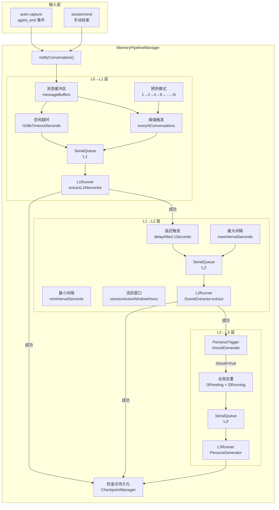
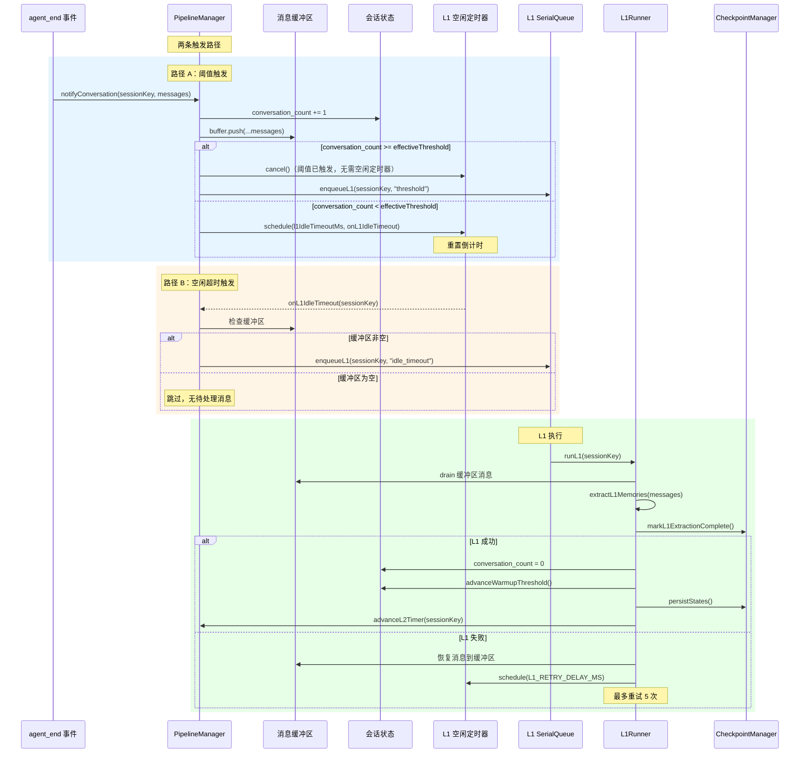
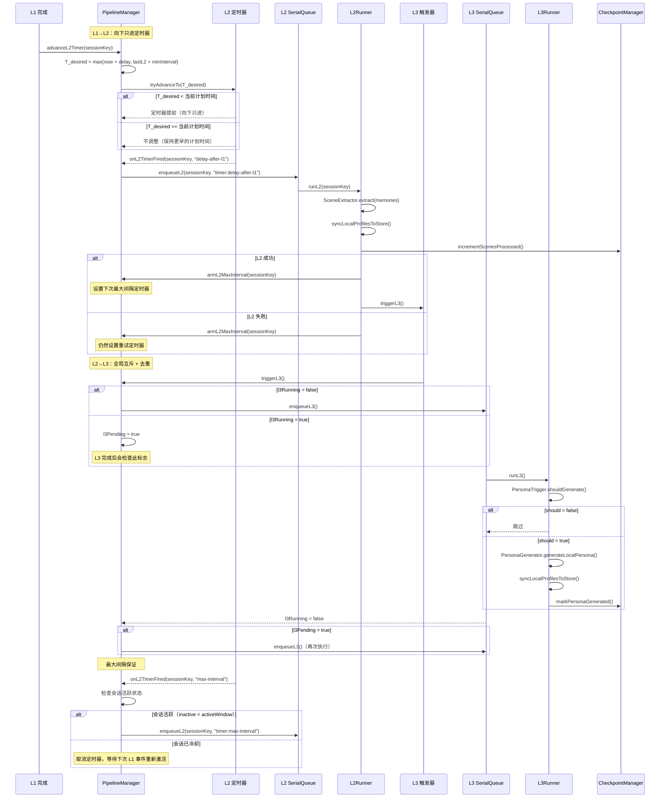
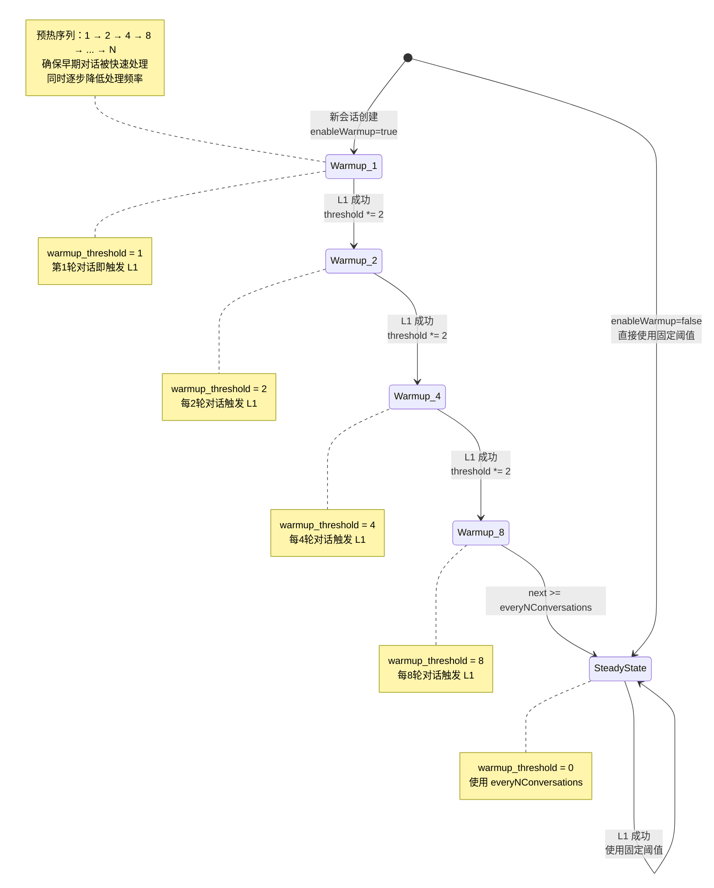
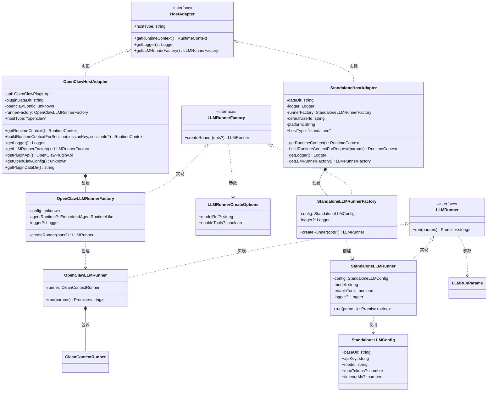
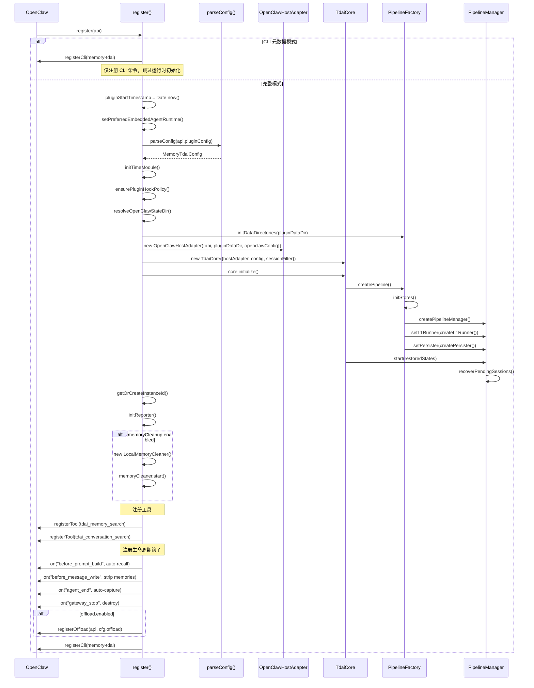
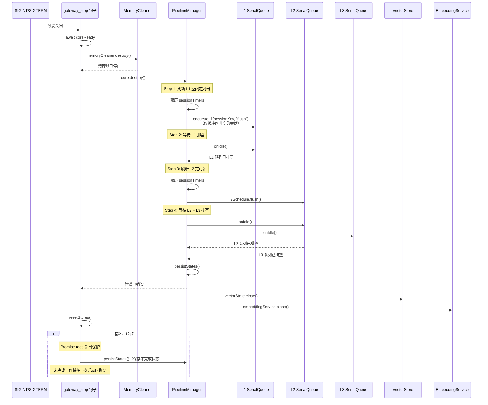
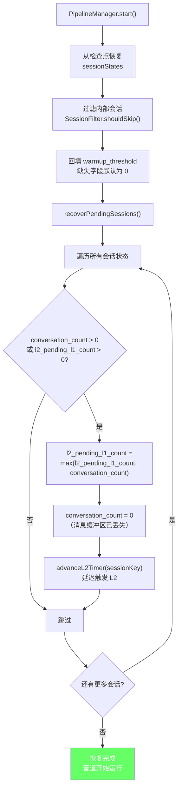

# Gateway + Pipeline 模块设计文档

## 1. 模块概述

Gateway 模块提供 HTTP 服务，将 TdaiCore 的记忆能力暴露为 REST API，使外部客户端（如 Hermes Sidecar）能够通过标准 HTTP 协议进行记忆召回、对话捕获、记忆搜索等操作。Pipeline 模块管理 L0→L1→L2→L3 四层记忆提取的调度，负责阈值触发、空闲超时、预热模式、向下只进定时器等核心调度逻辑。

**核心设计原则：**

- **主机无关**：TdaiCore 通过 HostAdapter 接口与宿主环境解耦，Gateway（Standalone）和 OpenClaw 各自提供适配器实现
- **串行保证**：同层任务通过 SerialQueue 保证不并发，避免竞态条件
- **优雅降级**：VectorStore 不可用时自动回退到 JSONL 文件读取
- **检查点恢复**：所有管道状态持久化到检查点文件，重启后自动恢复未完成的工作

---

## 2. Gateway 架构设计



**关键组件说明：**

| 组件 | 文件 | 职责 |
|------|------|------|
| TdaiGateway | `src/gateway/server.ts` | HTTP 服务器，路由分发，请求/响应序列化 |
| loadGatewayConfig | `src/gateway/config.ts` | 多源配置合并（文件→环境变量→覆盖） |
| API 类型 | `src/gateway/types.ts` | 请求/响应 TypeScript 接口定义 |
| StandaloneHostAdapter | `src/adapters/standalone/host-adapter.ts` | 无 OpenClaw 依赖的 HostAdapter 实现 |

---

## 3. Gateway 请求处理流程

以 `/recall` 端点为例，展示完整的请求处理时序：

```mermaid
sequenceDiagram
    participant C as 客户端
    participant H as HTTP Server
    participant R as 路由器
    participant CORS as CORS 中间件
    participant A as 认证中间件
    participant H as /recall 处理器
    participant TC as TdaiCore
    participant VS as VectorStore
    participant ES as EmbeddingService

    C->>H: POST /recall<br/>Authorization: Bearer xxx<br/>{"query": "...", "session_key": "..."}

    H->>R: handleRequest(req, res)
    R->>CORS: applyCorsHeaders(req, res)
    CORS-->>R: Origin 匹配 / 拒绝

    alt OPTIONS 请求
        R-->>C: 204 No Content
    end

    R->>A: checkAuth(req, res)
    alt 无 apiKey 配置
        A-->>R: true（跳过认证）
    else apiKey 已配置
        alt Bearer Token 有效
            A-->>R: true
        else Token 缺失/无效
            A-->>C: 401 Unauthorized
        end
    end

    R->>H: handleRecall(req, res)
    H->>H: parseJsonBody&lt;RecallRequest&gt;(req)

    alt 缺少必填字段
        H-->>C: 400 Bad Request
    end

    H->>TC: handleBeforeRecall(query, sessionKey)
    TC->>ES: 查询嵌入向量
    ES-->>TC: 嵌入结果
    TC->>VS: 向量搜索 L1 记忆
    VS-->>TC: 匹配的记忆列表
    TC-->>H: RecallResult

    H->>H: 构建 RecallResponse
    H-->>C: 200 OK<br/>{"context": "...", "strategy": "...", "memory_count": 5}
```

**端点一览：**

| 端点 | 方法 | 认证 | 功能 | 核心调用 |
|------|------|------|------|----------|
| `/health` | GET | 否 | 健康检查 | `core.getVectorStore()` |
| `/recall` | POST | 是 | 记忆召回 | `core.handleBeforeRecall()` |
| `/capture` | POST | 是 | 对话捕获 | `core.handleTurnCommitted()` |
| `/search/memories` | POST | 是 | L1 记忆搜索 | `core.searchMemories()` |
| `/search/conversations` | POST | 是 | L0 对话搜索 | `core.searchConversations()` |
| `/session/end` | POST | 是 | 会话结束 | `core.handleSessionEnd()` |
| `/seed` | POST | 是 | 批量种子导入 | `executeSeed()` |

---

## 4. Gateway 认证与安全设计



**安全设计要点：**

1. **常量时间比较**：使用 `crypto.timingSafeEqual` 防止时序攻击，攻击者无法通过响应时间推断 API Key 前缀
2. **/health 免认证**：健康检查端点始终可访问，支持 k8s liveness probe 和 Docker health-check
3. **启动安全态势报告**：`logSecurityPosture()` 在启动时输出认证状态、绑定地址、CORS 配置，特别警告非回环地址绑定且未设置 apiKey 的情况
4. **CORS 白名单**：默认空列表（最严格），支持精确域名匹配和 `*` 通配符（仅限开发环境）
5. **配置优先级**：YAML 中的 `corsOrigins` 优先于环境变量 `TDAI_CORS_ORIGINS`

---

## 5. Pipeline 调度架构



**管道工厂核心方法：**

| 方法 | 功能 |
|------|------|
| `initDataDirectories()` | 确保 conversations/records/scene_blocks/.metadata/.backup 子目录存在 |
| `initStores()` | 初始化 VectorStore + EmbeddingService（按 dataDir 缓存单例） |
| `createL1Runner()` | 读取 L0 → 按 sessionId 分组 → extractL1Memories → 更新检查点 |
| `createL2Runner()` | 读取 L1 → SceneExtractor.extract → 同步 Profile → 更新检查点 |
| `createL3Runner()` | PersonaTrigger.shouldGenerate → PersonaGenerator.generateLocalPersona → 同步 Profile → 更新检查点 |
| `createPipelineManager()` | 创建 MemoryPipelineManager 调度器 |

---

## 6. L0→L1 调度流程



**L1 调度关键参数：**

| 参数 | 默认值 | 说明 |
|------|--------|------|
| `everyNConversations` | 5 | 触发 L1 批处理的对话轮次阈值 |
| `l1IdleTimeoutSeconds` | 60 | 空闲超时（秒），用户停止对话后触发 L1 |
| `L1_RETRY_DELAY_MS` | 30,000 | L1 失败后重试延迟 |
| `L1_MAX_RETRIES` | 5 | 最大连续重试次数 |

---

## 7. L1→L2→L3 调度流程



**L2/L3 调度关键参数：**

| 参数 | 默认值 | 说明 |
|------|--------|------|
| `delayAfterL1Seconds` | 90 | L1 完成后延迟触发 L2（秒） |
| `minIntervalSeconds` | 900 | L2 最小间隔（秒），防止过于频繁 |
| `maxIntervalSeconds` | 3600 | L2 最大间隔（秒），保证活跃会话定期提取 |
| `sessionActiveWindowHours` | 24 | 会话活跃窗口（小时），超过则停止 L2 轮询 |

---

## 8. 预热模式设计



**预热模式设计意图：**

- **早期快速处理**：新会话的第 1 轮对话立即触发 L1 提取，用户能尽快看到记忆效果
- **逐步收敛**：阈值指数增长（1→2→4→8→...），逐步降低处理频率，减少资源消耗
- **平滑过渡**：当 `warmup_threshold * 2 >= everyNConversations` 时，标记预热完成（`warmup_threshold = 0`），切换到稳态阈值
- **向后兼容**：旧检查点文件缺少 `warmup_threshold` 字段时，默认为 0（视为已完成预热）

---

## 9. 适配器模式设计



**两种适配器对比：**

| 特性 | OpenClawHostAdapter | StandaloneHostAdapter |
|------|---------------------|----------------------|
| 宿主环境 | OpenClaw 插件系统 | Gateway / Hermes Sidecar |
| LLM 调用 | CleanContextRunner → runEmbeddedPiAgent | Vercel AI SDK → OpenAI 兼容 API |
| 工具支持 | OpenClaw 内置工具循环 | 沙盒文件工具（read/write/replace） |
| 上下文来源 | OpenClaw 事件 ctx | HTTP 请求参数 |
| 日志来源 | api.logger | console logger |
| 配置来源 | api.pluginConfig | tdai-gateway.yaml + 环境变量 |

---

## 10. 插件注册流程



**钩子处理流程：**

| 钩子 | 触发时机 | 核心操作 |
|------|----------|----------|
| `before_prompt_build` | 每轮对话前 | 缓存原始提示 → handleBeforeRecall → 注入记忆上下文 |
| `before_message_write` | 消息持久化前 | 剥离 `<relevant-memories>` 标签，防止污染历史记录 |
| `agent_end` | Agent 回复完成后 | handleTurnCommitted → L0 记录 → 通知调度器 → 上报指标 |
| `gateway_stop` | 网关关闭时 | destroy → 停止清理器 → 排空管道 → 关闭存储 |

---

## 11. 优雅关闭与恢复设计

### 11.1 优雅关闭流程



### 11.2 恢复流程



**关闭与恢复设计要点：**

1. **分层排空**：L1→L2→L3 依次排空，保证数据完整性
2. **超时保护**：管道排空 2s 超时，网关关闭 3s 超时，确保进程不会无限挂起
3. **状态持久化**：无论排空成功与否，始终持久化当前状态到检查点
4. **消息丢失容忍**：重启后内存消息缓冲区为空，但 L0 JSONL 文件中的数据不会丢失；恢复时通过 `advanceL2Timer` 触发 L2 重新处理
5. **会话 GC**：定期清理长期不活跃的会话（3 倍 activeWindow），防止内存无限增长；被清理的会话可从检查点恢复
