# Offload 上下文卸载模块设计文档

## 1. 模块概述

Offload 模块实现了一套**四层递进式上下文压缩系统**，旨在通过 Mermaid 符号图和工具日志卸载来减少 LLM 上下文窗口的 token 使用量，使 Agent 能够在长任务中持续运行而不超出上下文限制。

### 1.1 核心目标

- **延长 Agent 运行时间**：通过分层压缩策略，使 Agent 在 200K token 上下文窗口下可持续运行数千轮工具调用
- **保留任务方向感**：通过 Mermaid 流程图（MMD）为 LLM 提供任务进度的可视化摘要
- **最小化信息损失**：优先替换可恢复的工具结果，保留关键用户消息和当前任务上下文
- **异步非阻塞**：L1/L1.5/L2 均为异步执行，不阻塞主 LLM 调用路径

### 1.2 四层架构总览

| 层级 | 名称 | 触发时机 | 核心功能 | 执行方式 |
|------|------|----------|----------|----------|
| **L1** | 摘要化 | after_tool_call / assemble | 工具调用+结果 → LLM 摘要 + score | 异步（fire-and-forget） |
| **L1.5** | 任务边界判断 | assemble / before_prompt_build | 判断任务完成/延续/新任务，管理 MMD 文件 | 异步（fire-and-forget） |
| **L2** | Mermaid 生成 | 轮询调度（null 条目数/超时） | 将 offload 条目归入 MMD 节点，生成/更新流程图 | 异步（后台轮询） |
| **L3** | 上下文压缩 | assemble / after_tool_call / before_prompt_build | Mild 替换 / Aggressive 删除 / Emergency 截断 | 同步（阻塞式） |
| **L4** | Skill 生成 | before_agent_start（/create-skill 命令） | 从 MMD + offload 条目生成可复用 Skill | 同步 |

### 1.3 源码结构

```
src/offload/
├── index.ts                  # 模块入口与编排中心
├── types.ts                  # 核心类型定义
├── state-manager.ts          # 会话状态管理
├── storage.ts                # 文件 I/O 层
├── session-registry.ts       # 会话注册表（LRU）
├── reclaimer.ts              # 过期数据回收
├── mmd-injector.ts           # MMD 注入器
├── mmd-meta.ts               # MMD 元数据解析
├── context-token-tracker.ts  # tiktoken 精确计数
├── fast-token-estimate.ts    # 快速 Token 估算
├── l3-helpers.ts             # L3 压缩辅助函数
├── l3-token-counter.ts       # L3 Token 计数器
├── l3-token-helpers.ts       # L3 Token 辅助
├── backend-client.ts         # 远程后端 HTTP 客户端
├── opik-tracer.ts            # Opik 链路追踪
├── state-reporter.ts         # 状态上报
├── time-utils.ts             # 时间工具
├── user-id.ts                # 用户标识解析
├── hooks/
│   ├── after-tool-call.ts    # after_tool_call 钩子
│   ├── before-agent-start.ts # L1.5 任务转换处理
│   ├── before-prompt-build.ts# before_prompt_build 钩子
│   ├── llm-input-l3.ts       # L3 压缩核心算法
│   └── llm-output.ts         # L1 强制触发判断
├── local-llm/
│   ├── index.ts              # 本地 LLM 客户端入口
│   ├── llm-caller.ts         # Vercel AI SDK 封装
│   ├── parsers/
│   │   ├── json-utils.ts     # JSON 解析工具
│   │   ├── l1-parser.ts      # L1 响应解析
│   │   ├── l15-parser.ts     # L1.5 响应解析
│   │   └── l2-parser.ts      # L2 响应解析
│   └── prompts/
│       ├── l1-prompt.ts      # L1 提示词模板
│       ├── l15-prompt.ts     # L1.5 提示词模板
│       └── l2-prompt.ts      # L2 提示词模板
└── pipelines/
    └── l2-mermaid.ts         # L2 Mermaid 流水线
```

---

## 2. 架构设计

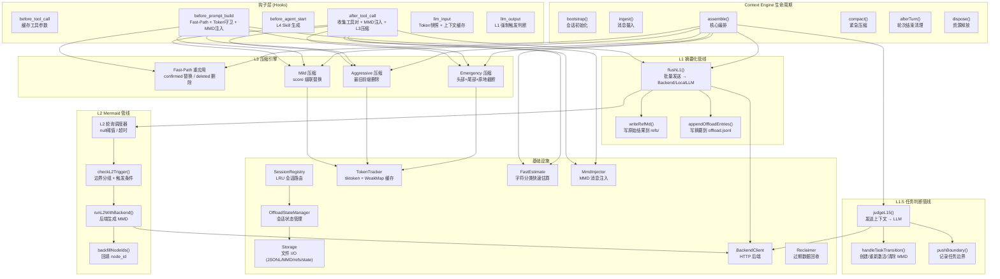

---

## 3. 上下文卸载整体流程

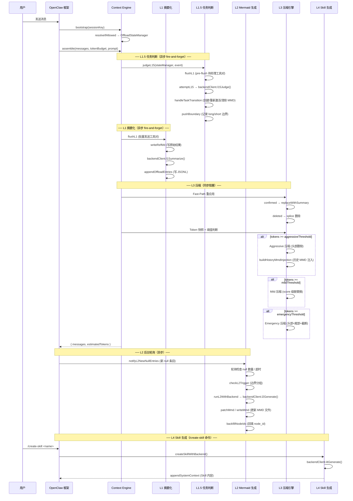

---

## 4. L1 摘要化流程

L1 负责将工具调用+结果对发送给 LLM，生成摘要并持久化。

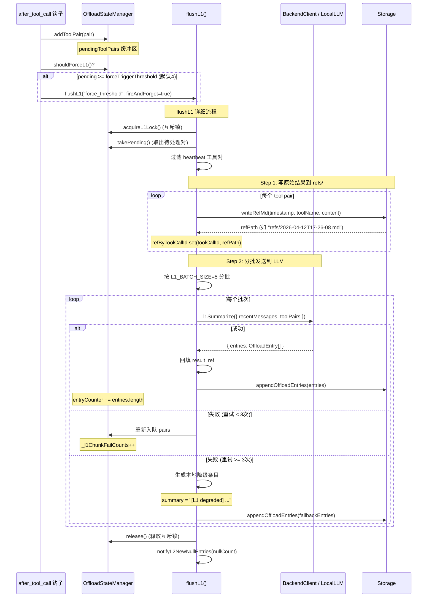

### 4.1 OffloadEntry 数据结构

```typescript
interface OffloadEntry {
  timestamp: string;        // ISO 时间戳
  node_id: string | null;   // L2 分配的 Mermaid 节点 ID
  tool_call: string;        // 工具调用描述
  summary: string;          // LLM 生成的摘要
  result_ref: string;       // 原始结果的 refs/ 路径
  tool_call_id: string;     // 原始工具调用 ID
  session_key?: string;     // 所属会话
  score?: number;           // 可替换性评分 (0-10)
}
```

---

## 5. L1.5 任务边界判断流程

L1.5 判断当前用户消息是否标志着任务切换、延续或新任务开始。

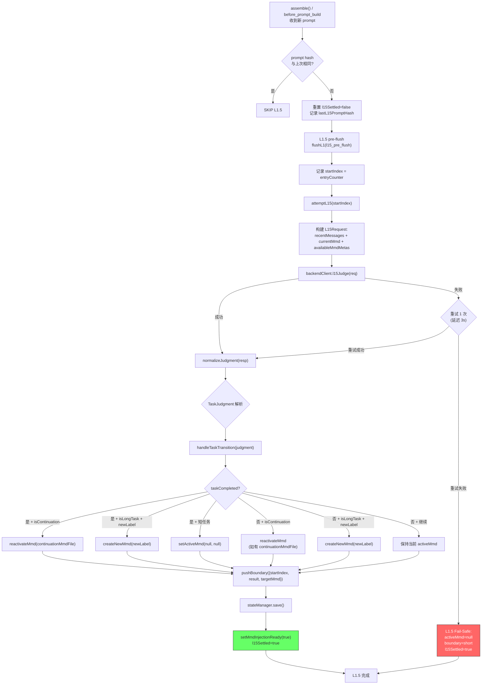

### 5.1 TaskJudgment 数据结构

```typescript
interface TaskJudgment {
  taskCompleted: boolean;       // 当前任务是否完成
  isContinuation: boolean;     // 是否为近期任务的延续
  continuationMmdFile?: string;// 延续的 MMD 文件名
  newTaskLabel?: string;       // 新任务标签（用于 MMD 文件名）
  isLongTask: boolean;         // 是否为长任务（vs 闲聊）
}
```

### 5.2 L15Boundary 数据结构

```typescript
interface L15Boundary {
  startIndex: number;              // entryCounter 值
  result: "long" | "short" | "pending";
  targetMmd: string | null;       // 目标 MMD 文件
}
```

---

## 6. L2 Mermaid 生成流程

L2 独立于 L1 运行，通过后台轮询调度器触发。

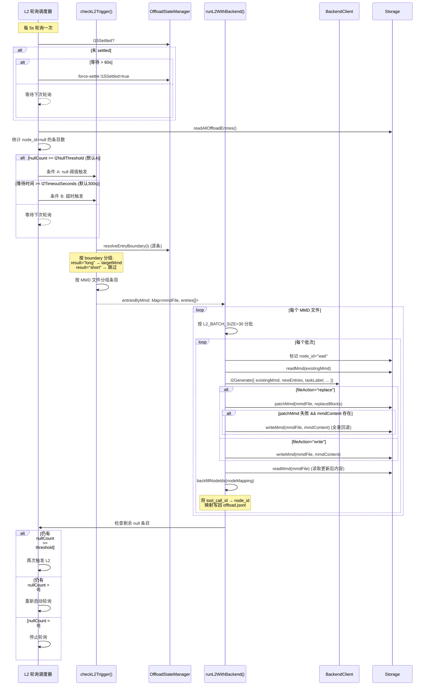

---

## 7. L3 压缩算法设计

L3 是同步阻塞式压缩，在三个触发点执行：`assemble()`、`after_tool_call`、`before_prompt_build`。

```mermaid
flowchart TD
    START["L3 压缩入口"] --> FP["Fast-Path 重应用"]

    FP --> FP_DEL{"deletedOffloadIds<br/>非空?"}
    FP_DEL -->|是| DEL["删除已标记消息<br/>（splice by toolCallId）"]
    FP_DEL -->|否| FP_CON
    DEL --> FP_CON{"confirmedOffloadIds<br/>非空?"}
    FP_CON -->|是| REPL["replaceWithSummary<br/>（tool result → 摘要）"]
    FP_CON -->|否| FP_DONE
    REPL --> FP_DONE["Fast-Path 完成"]

    FP_DONE --> EST{"快速 Token 估算<br/>fastEstimateMessages()"}
    EST -->|fastEst < aggressive × 0.85| SKIP_TIK["跳过 tiktoken<br/>直接用估算值"]
    EST -->|fastEst >= aggressive × 0.85| TIK["精确 tiktoken 计数<br/>buildTiktokenContextSnapshot()"]

    SKIP_TIK --> AGG_CHECK
    TIK --> AGG_CHECK{"tokens >=<br/>aggressiveThreshold<br/>(默认 85%)"}

    AGG_CHECK -->|否| MILD_CHECK
    AGG_CHECK -->|是| AGG["Aggressive 压缩"]

    subgraph "Aggressive 压缩策略"
        AGG --> AGG_TAIL{"有 boundary 缓存?"}
        AGG_TAIL -->|否| TAIL_ACC["TAIL-ACCUMULATE<br/>从尾部累积 token<br/>直到 60% budget<br/>删除头部"]
        AGG_TAIL -->|是| STD_AGG["标准 Aggressive<br/>computeAggressiveDeleteCount<br/>一次性计算删除数量"]

        TAIL_ACC --> AGG_SPLICE["splice(0, keepFrom)<br/>删除头部消息"]
        STD_AGG --> AGG_SPLICE2["splice(0, deleteCount)<br/>删除头部消息"]

        AGG_SPLICE --> AGG_MMD["buildHistoryMmdInjection<br/>注入历史 MMD"]
        AGG_SPLICE2 --> AGG_MMD

        AGG_MMD --> AGG_BOUND["记录 _lastAggressiveBoundary<br/>(originalIndex + fingerprint)"]
    end

    AGG_BOUND --> MILD_CHECK
    AGG_SPLICE --> MILD_CHECK
    AGG_SPLICE2 --> MILD_CHECK

    MILD_CHECK{"tokens >=<br/>mildThreshold<br/>(默认 50%)"} -->|否| EMG_CHECK
    MILD_CHECK -->|是| MILD["Mild 压缩"]

    subgraph "Mild 压缩策略 (score 级联)"
        MILD --> SCAN["扫描 scanRatio=70% 范围内的消息"]
        SCAN --> CAND["收集候选: toolResult + assistant(tool_use)<br/>按 score 降序排列"]
        CAND --> CASCADE["级联替换: score 7→6→5→...→1"]
        CASCADE --> REPLACE["replaceWithSummary(msg, entry)<br/>tool result → 摘要文本"]
        REPLACE --> ASST["replaceAssistantToolUseWithSummary<br/>tool_use input → 紧凑摘要"]
        ASST --> MIN{"replacedCount >=<br/>MILD_CASCADE_MIN_COUNT (10)?"}
        MIN -->|是| MILD_DONE["Mild 完成"]
        MIN -->|否| CASCADE
    end

    MILD_DONE --> EMG_CHECK
    CASCADE -->|"score 降至 1"| MILD_DONE2["Mild 完成 (最低级)"]
    MILD_DONE2 --> EMG_CHECK

    EMG_CHECK{"tokens >=<br/>emergencyThreshold<br/>(默认 95%)<br/>或 _forceEmergencyNext?"} -->|否| DONE["L3 完成"]
    EMG_CHECK -->|是| EMG["Emergency 压缩"]

    subgraph "Emergency 压缩策略"
        EMG --> HEAD["头部删除<br/>按 excessRatio 计算删除量"]
        HEAD --> HEAD_OK{"头部删除成功?"}
        HEAD_OK -->|是| EMG_LOOP{"tokens <= target?"}
        HEAD_OK -->|否 (用户消息阻挡)| TAIL_DEL["尾部删除<br/>按 token 大小删除最大工具对组"]
        TAIL_DEL --> TAIL_OK{"尾部删除成功?"}
        TAIL_OK -->|否| TRUNC["原地截断<br/>最大消息 → 短桩文本"]
        TAIL_OK -->|是| EMG_LOOP
        TRUNC --> EMG_LOOP
        EMG_LOOP -->|否| HEAD
        EMG_LOOP -->|是| EMG_DONE["Emergency 完成"]
    end

    EMG_DONE --> DONE

    style EMG fill:#f66,stroke:#333,color:#fff
    style AGG fill:#fa0,stroke:#333
    style MILD fill:#6f6,stroke:#333
```

### 7.1 三级压缩对比

| 特性 | Mild | Aggressive | Emergency |
|------|------|------------|-----------|
| **触发阈值** | 50% contextWindow | 85% contextWindow | 95% contextWindow |
| **目标** | 替换可替换的工具结果 | 删除最旧的消息前缀 | 删除至 60% contextWindow |
| **操作** | tool result → 摘要文本 | splice(0, N) 头部删除 | 头部+尾部+原地截断 |
| **信息保留** | 保留摘要 + result_ref | 保留 MMD 流程图 | 仅保留最小消息集 |
| **可逆性** | 可通过 result_ref 恢复 | 不可逆 | 不可逆 |
| **用户消息保护** | N/A | 保护最后一条用户消息 | 保护最后一条用户消息 |
| **工具对完整性** | 保持 tool_use/tool_result 配对 | 调整删除边界保持配对 | 尾部删除按工具对组删除 |

---

## 8. MMD 注入机制

MMD 注入分为两种模式：全量注入（assemble/before_prompt_build）和增量更新（after_tool_call）。

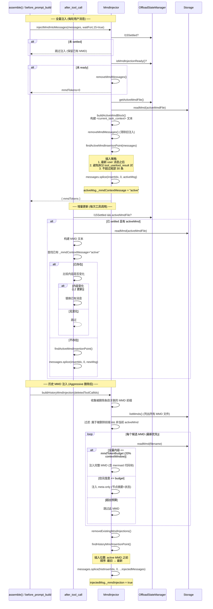

---

## 9. 会话管理设计

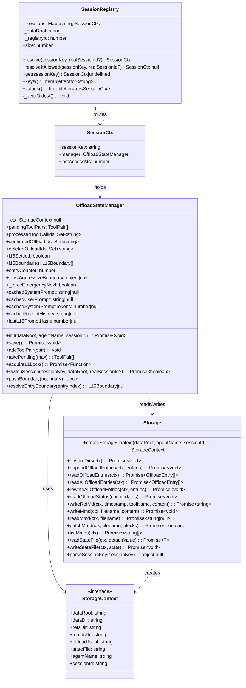

### 9.1 存储路径隔离

```
~/.openclaw/context-offload/
└── {agentName}/                          # 每个 Agent 独立目录
    ├── offload-{sessionId}.jsonl         # 每会话独立 JSONL
    ├── offload-{sessionId2}.jsonl
    ├── state.json                        # Agent 级共享状态
    ├── sessions-registry.json            # sessionKey → sessionId 映射
    ├── refs/                             # 工具结果原始文件
    │   └── 2026-04-12T17-26-08-123p08-00.md
    └── mmds/                             # Mermaid 流程图文件
        ├── 001-database-debug.mmd
        ├── 002-api-refactor.mmd
        └── 003-perf-optimization.mmd
```

### 9.2 LRU 淘汰策略

- `SessionRegistry` 最多缓存 20 个会话（`MAX_CACHED_SESSIONS`）
- 每次访问更新 `lastAccessMs`
- 超出上限时淘汰最久未访问的会话

---

## 10. Token 计数设计

### 10.1 双层计数架构

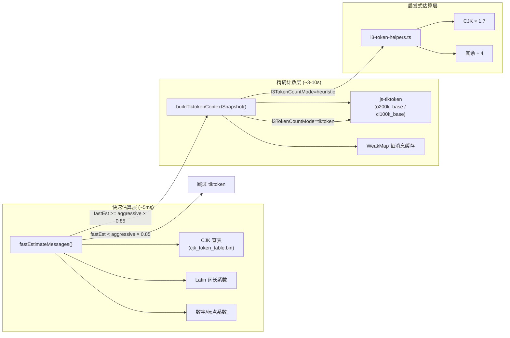

### 10.2 快速估算算法

`fastEstimateTokens()` 采用单遍字符分类 + 每类别系数：

| 字符类别 | 系数 | 示例 |
|----------|------|------|
| CJK 汉字 | 查表 (1-3 tok/char) | 中文汉字 |
| Latin 单词 | 按词长分段 (1.0-1.5+0.3/char) | English |
| 日文假名 | 按连续长度分段 | あいう |
| 韩文 | 1.4 tok/char | 한글 |
| 西里尔 | 0.55 tok/char | Русский |
| 阿拉伯 | 0.82 tok/char | العربية |
| 数字 | 按格式分段 | 1,234.56 |
| ASCII 标点 | 0.6 tok/char | {}[]() |
| 其他 Unicode | 2.5 tok/char | Emoji |

### 10.3 性能优化策略

1. **Quick-SKIP**：`after_tool_call` 中使用启发式估算，连续 5 次跳过后强制精确计算
2. **Boundary 增量估算**：有 `_lastAggressiveBoundary` 时，仅估算新增消息的 token 增量
3. **WeakMap 缓存**：每消息对象缓存 token 计数，内容变更时自动失效
4. **JSON Replacer**：序列化时剔除 `_offloaded`/`_mmdContextMessage` 等内部标记

---

## 11. 容错与降级设计

### 11.1 L1 容错

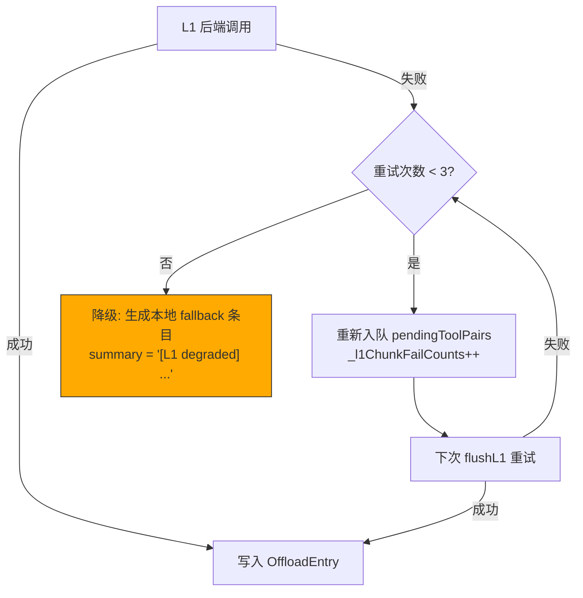

### 11.2 L1.5 容错

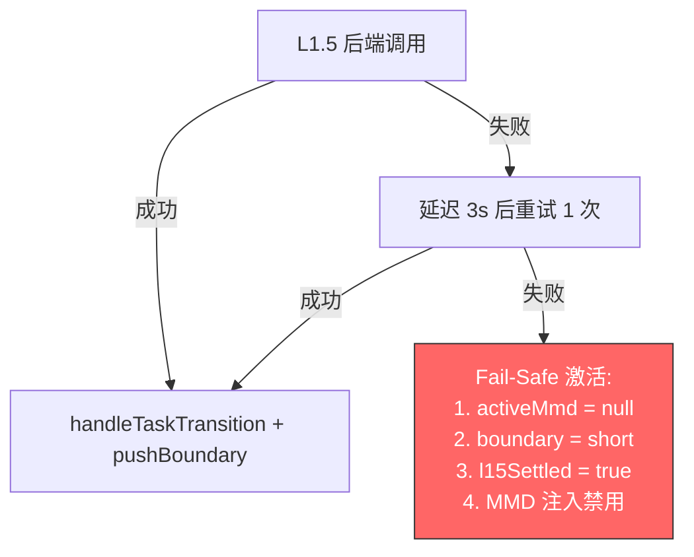

**Fail-Safe 影响**：
- L2 不会触发（无 activeMmd）
- 所有 null 条目标记为 short（不参与未来 L2）
- 当前轮次无 MMD 构建
- L3 压缩仍正常工作

### 11.3 L2 容错

```mermaid
flowchart TD
    L2_CALL["L2 后端调用"] -->|成功| L2_OK["patchMmd / writeMmd + backfillNodeIds"]
    L2_CALL -->|失败| L2_SKIP["跳过此批次<br/>条目保持 node_id='wait'"]
    L2_CALL -->|降级响应<br/>(fileAction 为空)| L2_FALLBACK["fallback backfill<br/>使用 MMD 中最大 node_id"]
    L2_SKIP --> L2_RETRY["下次轮询重试<br/>(wait 条目超时后)"]

    style L2_FALLBACK fill:#fa0,stroke:#333
```

### 11.4 L3 容错

| 场景 | 处理策略 |
|------|----------|
| Aggressive 被用户消息阻挡 | `stalledByUserMsg=true` → 强制 Emergency |
| Emergency 头部删除被阻挡 | 尾部删除最大工具对组 |
| 尾部删除仍不足 | 原地截断最大消息（保留 tool_use 结构） |
| Token 溢出错误检测 | `isTokenOverflowError()` → `_forceEmergencyNext=true` |
| tiktoken 计数超时 | 回退到 `Math.ceil(text.length / 4)` |

### 11.5 降级模式

| 模式 | L1 | L1.5 | L2 | L3 | L4 | 说明 |
|------|----|------|----|----|----|------|
| **backend** | ✅ | ✅ | ✅ | ✅ | ✅ | 完整功能 |
| **local** | ✅ | ✅ | ✅ | ✅ | ✅ | 使用本地 LLM |
| **collect** | ✅ | ✅ | ✅ | ❌ | ❌ | 仅收集数据，不压缩 |
| **无 LLM 客户端** | ❌ | ❌ | ❌ | ✅ | ❌ | 仅 L3 压缩可用 |

### 11.6 数据回收

`Reclaimer` 每 24 小时执行 5 步清理：

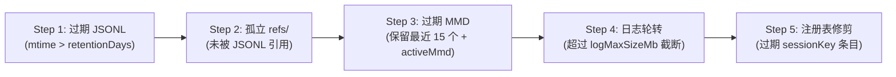

### 11.7 JSONL 防御层

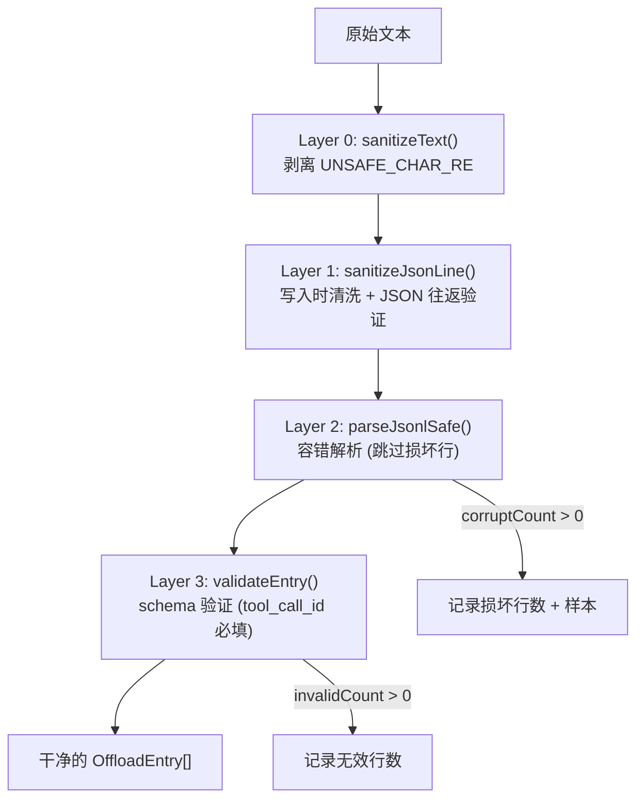
