# Record + Hooks 模块设计文档

## 1. 模块概述

Record + Hooks 是 TencentDB-Agent-Memory 系统中负责**对话捕获、记忆提取、去重写入和智能召回**的核心模块。它实现了从原始对话到结构化记忆的完整生命周期管理，以及从用户输入到上下文注入的实时召回链路。

### 核心职责

| 子模块 | 文件 | 职责 |
|--------|------|------|
| L0 对话记录器 | `l0-recorder.ts` | 原始对话的增量捕获、去重、清洗和 JSONL 持久化 |
| L1 记忆提取编排器 | `l1-extractor.ts` | 编排完整的 L1 提取流水线：质量门控 → 场景切分 → LLM 提取 → 类型归一化 → 批量去重 → 持久化写入 |
| L1 记忆持久化写入器 | `l1-writer.ts` | 根据 DedupDecision 执行 store/update/merge/skip，双写 JSONL + 向量库 |
| L1 记忆读取器 | `l1-reader.ts` | 双路径读取：SQLite 优先 / JSONL 回退 |
| L1 批量冲突检测器 | `l1-dedup.ts` | 两阶段去重：候选召回（向量/FTS）→ 批量 LLM 判决，三级降级策略 |
| 自动捕获钩子 | `auto-capture.ts` | agent_end 触发：L0 写入 + 向量索引 + 调度通知 |
| 自动召回钩子 | `auto-recall.ts` | before_prompt_build 触发：多策略搜索 + L3 人设 + L2 场景导航 + 上下文注入 |
| 提取提示词 | `prompts/l1-extraction.ts` | 场景切分 + 记忆提取的 System/User Prompt 模板 |
| 去重提示词 | `prompts/l1-dedup.ts` | 批量冲突检测的 System/User Prompt 模板 |

### 关键数据流概览

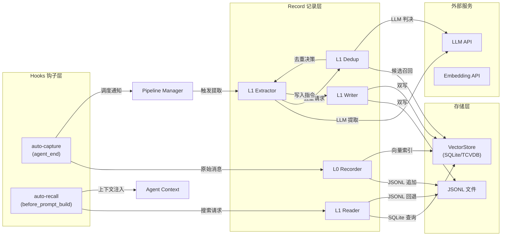

---

## 2. 架构设计

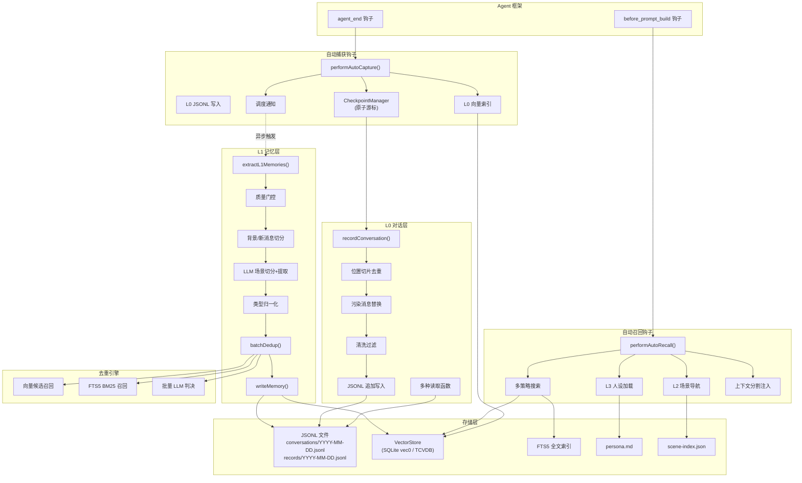

---

## 3. L0 对话捕获流程

L0 捕获由 `auto-capture` 钩子在 `agent_end` 事件触发，负责将原始对话消息增量写入 JSONL 文件和向量索引。

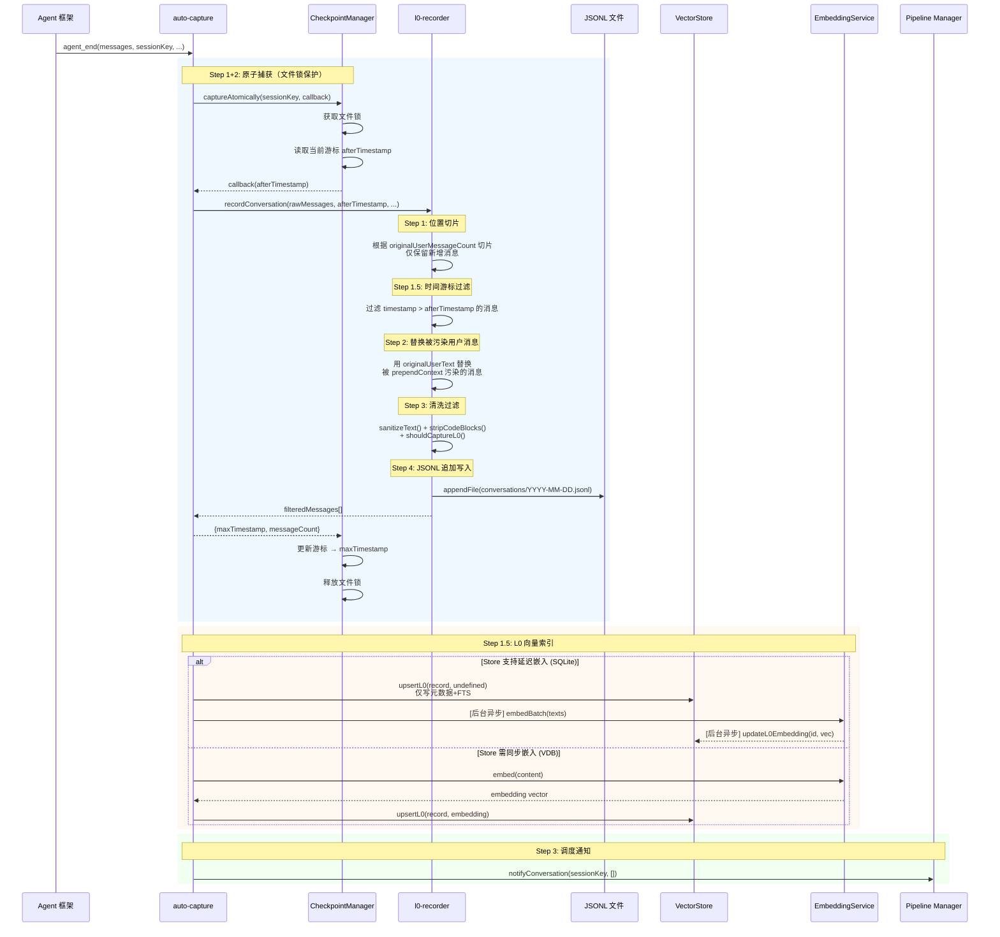

### 增量去重双重保障

| 层级 | 机制 | 适用场景 |
|------|------|----------|
| **Layer 1: 位置切片** | `originalUserMessageCount` 缓存于 `before_prompt_build`，切片 `rawMessages[originalUserMessageCount:]` | 免疫网关重启后的时间戳漂移 |
| **Layer 2: 时间游标** | `afterTimestamp` 过滤 `timestamp > cursor` | 位置切片不可用时的回退（缓存过期、进程重启） |

### 污染消息替换策略

框架在 `before_prompt_build` 之后将 `prependContext` 注入用户消息，导致 `rawMessages` 中的用户消息被污染。替换策略：

1. 位置切片激活时：`slicedMessages[0]` 即被污染的用户消息
2. 否则回退到 `rawMessages[originalUserMessageCount]`
3. 匹配时间戳后在 `extracted` 中替换为 `originalUserText`
4. 匹配失败时，`sanitizeText()` 作为安全兜底

---

## 4. L1 记忆提取流程

L1 提取由 Pipeline Manager 异步触发，编排完整的记忆提取流水线。

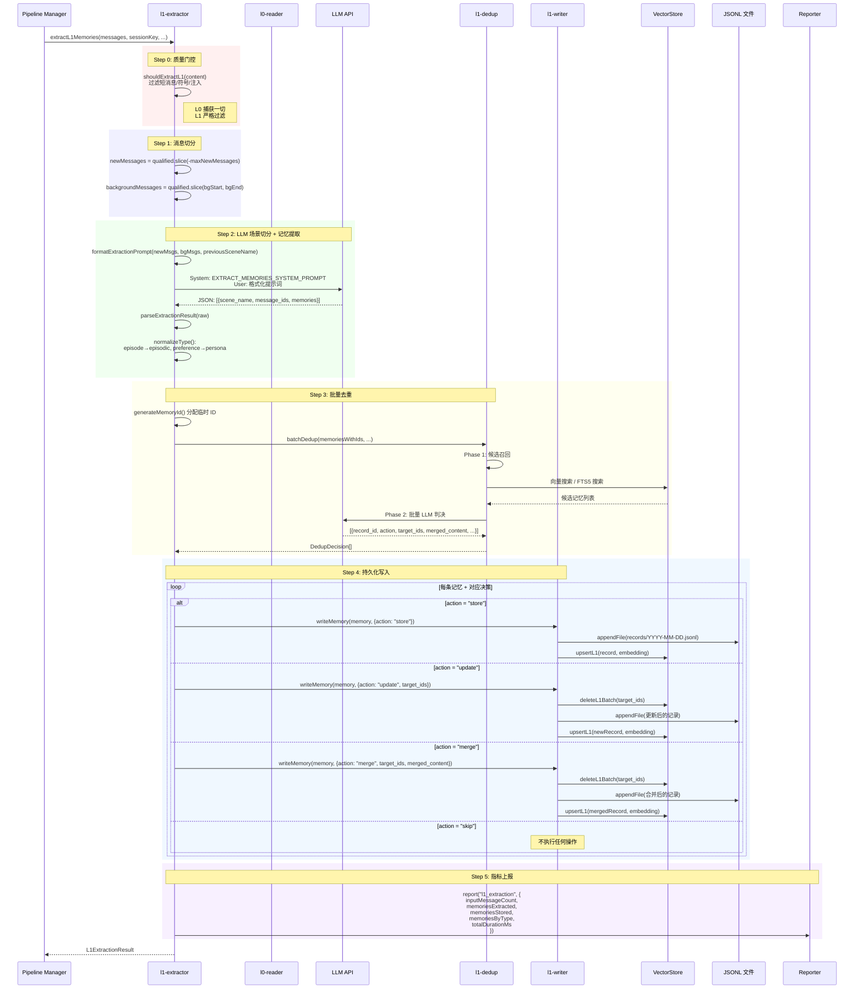

### 质量门控规则

L0 阶段捕获一切原始对话，L1 阶段通过 `shouldExtractL1()` 进行严格过滤：

- 消息长度不足（过短）
- 纯符号/表情
- 疑似提示注入
- 其他低质量信号

### 消息切分策略

```
qualifiedMessages: [bg...bg | new...new]
                   ← maxBgMessages → ← maxNewMessages →
```

- **newMessages**：最近 N 条消息，LLM 从中提取记忆
- **backgroundMessages**：更早的 M 条消息，仅供 LLM 理解上下文，**严禁从中提取记忆**

### 类型归一化映射

| LLM 输出类型 | 归一化后 | 说明 |
|-------------|---------|------|
| `persona` | `persona` | 用户稳定属性/偏好 |
| `episodic` | `episodic` | 客观事件记忆 |
| `instruction` | `instruction` | 全局行为指令 |
| `episode` | `episodic` | 旧版兼容 |
| `instruct` | `instruction` | 旧版兼容 |
| `preference` | `persona` | 偏好折叠为人设 |

---

## 5. L1 去重算法设计

L1 去重采用**两阶段策略**：先快速召回候选，再批量 LLM 精确判决。同时设计了三级降级保障可用性。

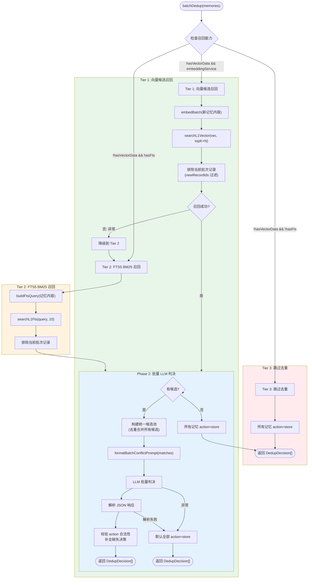

### 三级降级策略详解

| 等级 | 召回方式 | 前置条件 | 精度 | 性能 |
|------|---------|---------|------|------|
| **Tier 1** | 向量余弦相似度搜索 | `vectorStore` + `embeddingService` 可用，且库中有数据 | 最高 | 需嵌入计算 |
| **Tier 2** | FTS5 BM25 关键词搜索 | `vectorStore` 可用且 FTS 索引就绪 | 中等 | 快速，无需嵌入 |
| **Tier 3** | 跳过去重 | 以上均不可用 | 最低（允许重复） | 零开销 |

### 去重决策类型

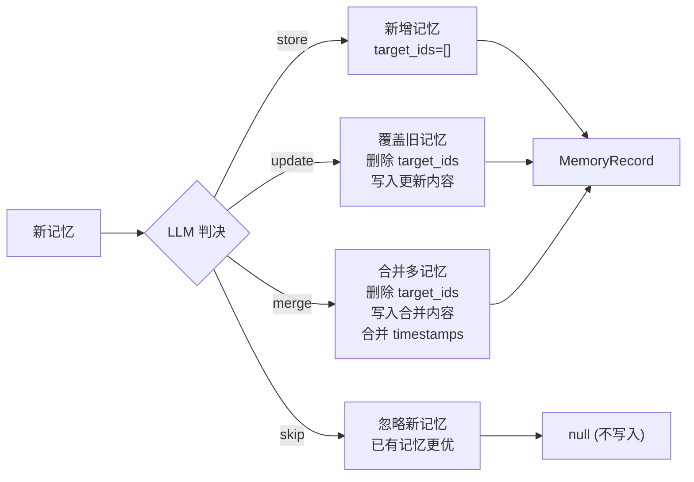

### 向量候选召回细节

```
新记忆 batch → embedBatch() → 逐条 searchL1Vector(vec, topK+N)
                                      ↓
                              排除当前批次自身 (newRecordIds 过滤)
                                      ↓
                              截取 topK 条候选
```

请求 `topK + batch.size` 条结果，过滤掉当前批次自身后截取 `topK` 条，避免自我匹配。

---

## 6. L1 记忆召回流程

L1 召回由 `auto-recall` 钩子在 `before_prompt_build` 事件触发，负责搜索相关记忆并注入 Agent 上下文。

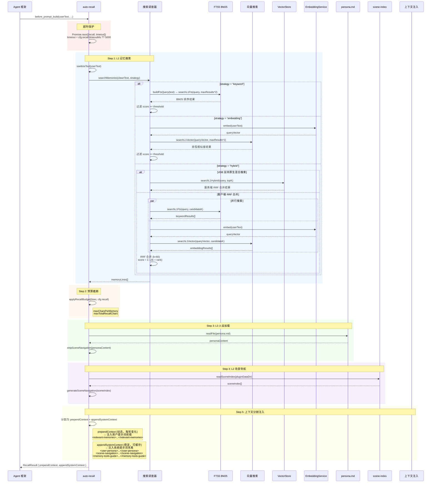

### 三种搜索策略对比

| 策略 | 召回方式 | 合并算法 | 依赖 | 适用场景 |
|------|---------|---------|------|---------|
| **keyword** | FTS5 BM25 | 无需合并 | VectorStore + FTS 索引 | 精确关键词匹配 |
| **embedding** | 向量余弦相似度 | 无需合并 | VectorStore + EmbeddingService | 语义相似匹配 |
| **hybrid** | FTS5 + 向量并行 | RRF (k=60) 或原生混合 | 全部 | 综合最优，默认策略 |

### RRF (Reciprocal Rank Fusion) 算法

```
RRF_score(record) = Σ 1 / (k + rank_i)    其中 k = 60

对每条记录：
  - 在关键词结果中的排名 rank_kw → 贡献 1/(60 + rank_kw)
  - 在向量结果中的排名 rank_vec → 贡献 1/(60 + rank_vec)
  - 若同时出现在两个列表，分数相加
```

### 上下文分割设计

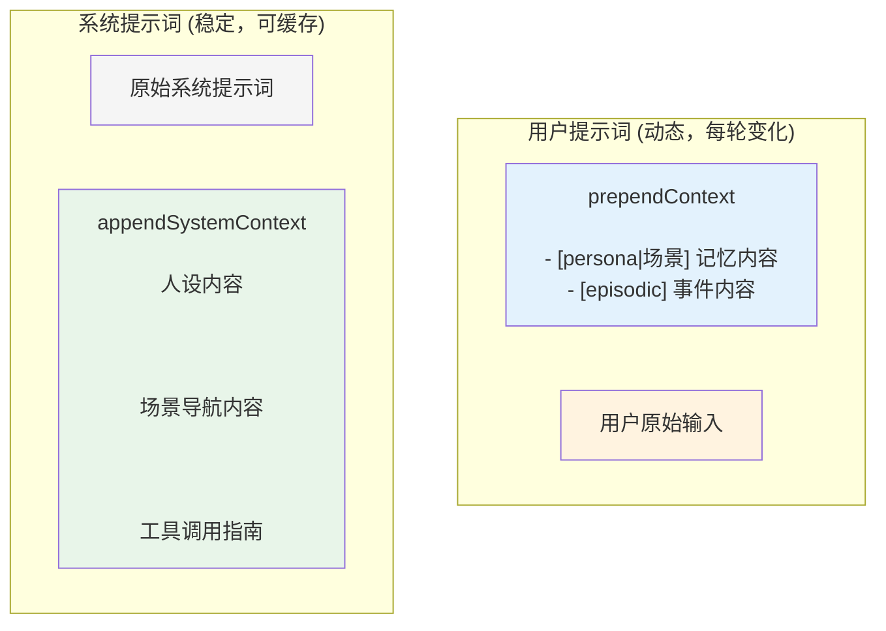

**设计意图**：将频繁变化的 L1 记忆放在用户提示词中，稳定的人设/场景/工具指南放在系统提示词中，最大化利用 LLM 提供商的 Prompt Caching 机制。

---

## 7. 数据模型设计

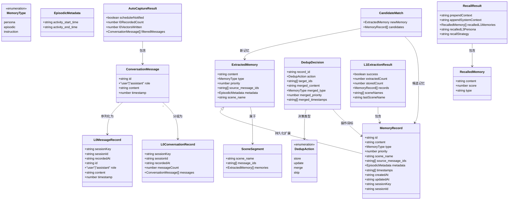

### MemoryRecord v3 持久化结构

MemoryRecord 是 L1 记忆的最终持久化形态，v3 版本的关键变更：

| 字段 | v2 | v3 | 说明 |
|------|----|----|------|
| `importance` | `"high"|"medium"|"low"` | 移除 | 改用 `priority` 数值 |
| `priority` | 无 | `number (0-100, -1)` | 更精细的优先级控制 |
| `scene_name` | 无 | `string` | 场景归属 |
| `source_message_ids` | 无 | `string[]` | 溯源到 L0 消息 |
| `metadata` | 无 | `EpisodicMetadata` | 类型特定元数据 |
| `timestamps` | 无 | `string[]` | 合并历史时间线 |
| `keywords` | `string[]` | 移除 | 从 content 重建 |
| MemoryType | 4 种 | 3 种 | `preference` 折叠为 `persona` |

### 优先级评分标准

| 范围 | persona | episodic | instruction |
|------|---------|----------|-------------|
| **-1** | - | - | 极严格全局死命令 |
| **80-100** | 健康/禁忌/核心特质 | 重要事件/计划 | 核心行为规则 |
| **60-79** | 一般喜好/技能 | 一般完整活动 | 重要要求 |
| **<60** | 模糊次要（可丢弃） | 琐碎事项（直接丢弃） | 临时要求（直接丢弃） |

---

## 8. 提示词工程设计

### 8.1 L1 记忆提取提示词 (`prompts/l1-extraction.ts`)

#### System Prompt 结构

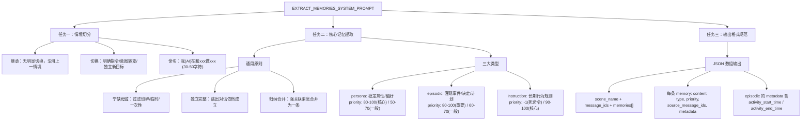

#### User Prompt 模板

```
**{时区描述}**
**输出语言**：根据用户发言的主导语言书写

【上一个情境】：{previousSceneName}

【背景对话】（仅供理解上下文，严禁提取记忆）：
[{id}] [{role}] [{timestamp}]: {content}
...

━━━━━━━━━━━━━━━━━━━━━━━━━━━━━━━━━━━━━━━

【待提取的新消息】（只从这里提取记忆！）：
[{id}] [{role}] [{timestamp}]: {content}
...
```

### 8.2 L1 冲突检测提示词 (`prompts/l1-dedup.ts`)

#### System Prompt 核心规则

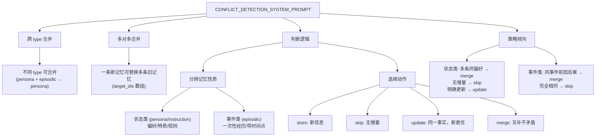

#### User Prompt 结构（统一候选池模式）

```
## 统一候选记忆池（共 N 条已有记忆）
[
  {record_id, content, type, priority, scene_name, timestamps},
  ...
]

════════════════════════════════════════════════

## 待判断的新记忆（共 M 条）

### 第 1 条新记忆 (record_id: xxx)
{record_id, content, type, priority, scene_name}

【关联候选 ID】["id1", "id2"]

━━━━━━━━━━━━━━━━━━━━━━━━━━━━━━━━━━━━━━━

### 第 2 条新记忆 ...
```

**设计优势**：统一候选池让 LLM 看到全局视图，支持跨记忆去重判断，一次 LLM 调用处理所有新记忆。

---

## 9. 容错与降级设计

### 9.1 整体容错架构

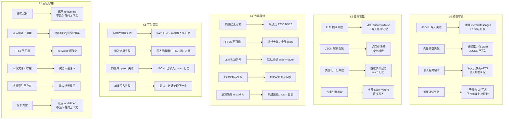

### 9.2 降级策略矩阵

| 组件 | 故障场景 | 降级行为 | 影响范围 |
|------|---------|---------|---------|
| **L0 捕获** | JSONL 写入失败 | 返回已过滤消息，L1 仍可处理 | 无数据丢失 |
| **L0 向量索引** | 嵌入超时 | SQLite: 写元数据+FTS，后台补嵌入；VDB: 写元数据 | 召回可能延迟 |
| **L1 提取** | LLM 调用失败 | 返回 success=false，不写入 | 本轮无新记忆 |
| **L1 去重** | 向量搜索失败 | 降级 FTS5 → 跳过去重 | 可能产生重复记忆 |
| **L1 写入** | 向量库 upsert 失败 | JSONL 已写入，向量缺失 | 向量搜索可能遗漏 |
| **L1 召回** | 整体超时 | 返回 undefined，不注入 | 无记忆增强 |
| **L1 召回** | 嵌入不可用 | 降级到 keyword | 语义召回不可用 |
| **L1 读取** | VectorStore 不可用 | 回退到 JSONL 全扫描 | 性能下降 |

### 9.3 数据一致性保障

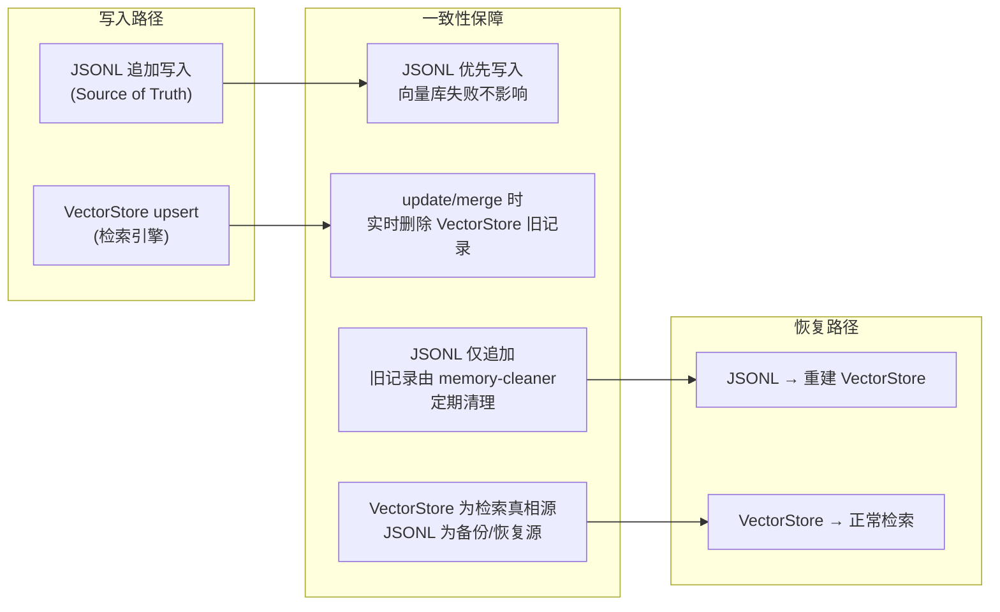

**双写策略核心原则**：
1. **JSONL 是持久化真相源**：所有写入先确保 JSONL 成功
2. **VectorStore 是检索引擎**：写入失败仅 warn，不阻塞主流程
3. **update/merge 实时删除**：旧记录从 VectorStore 立即删除，保证检索准确性
4. **JSONL 仅追加**：旧记录留在文件中，由 `memory-cleaner` 定期对账清理
5. **恢复路径**：可从 JSONL 重建整个 VectorStore

### 9.4 并发安全

| 场景 | 保护机制 |
|------|---------|
| 多个 agent_end 并发写入 L0 | `CheckpointManager.captureAtomically()` 文件锁保护读游标→写记录→更新游标的原子性 |
| 同一消息被重复捕获 | 位置切片 + 时间游标双重去重 |
| L1 提取与 L0 写入并发 | L1 从 VectorStore/JSONL 读取，与 L0 写入无锁竞争 |
| 向量索引后台嵌入 | `bgTaskRegistry` 跟踪后台任务，`TdaiCore.destroy()` 等待完成后再关闭连接 |
