# Scene + Persona 模块设计文档

## 1. 模块概述

Scene + Persona 模块是记忆系统的 L2/L3 层核心组件，负责将 L1 原始记忆碎片提炼为结构化的场景叙事（L2）和用户画像（L3）。

| 层级 | 模块 | 职责 | 核心文件 |
|------|------|------|----------|
| L2 | Scene | 场景块的提取、格式化、索引和导航 | `scene-extractor.ts`, `scene-format.ts`, `scene-index.ts`, `scene-navigation.ts`, `filename-normalizer.ts` |
| L3 | Persona | 用户画像的生成和触发 | `persona-generator.ts`, `persona-trigger.ts` |
| 同步 | Profile Sync | L2/L3 本地与远程双向同步 | `profile-sync.ts` |
| 提示词 | Prompts | 场景提取 & Persona 生成的系统提示词 | `scene-extraction.ts`, `persona-generation.ts` |

### 核心设计原则

- **LLM Agent 驱动**：场景提取和 Persona 生成均由 LLM Agent 通过文件工具自主完成，工程侧仅负责编排和后处理
- **沙箱隔离**：LLM Agent 的文件操作被严格限定在沙箱目录内，系统文件对 LLM 不可见
- **软删除机制**：LLM 无法直接删除文件，通过写入 `[DELETED]` 标记实现，工程侧负责清理
- **幂等安全**：文件名归一化、索引同步等操作均为幂等设计，可安全重复执行

---

## 2. 架构设计

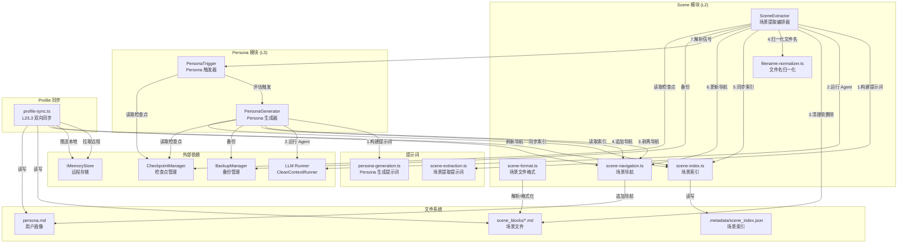

---

## 3. 场景提取流程

`SceneExtractor.extract()` 实现了一个 8 阶段流水线，将原始记忆批量转化为场景块文件：

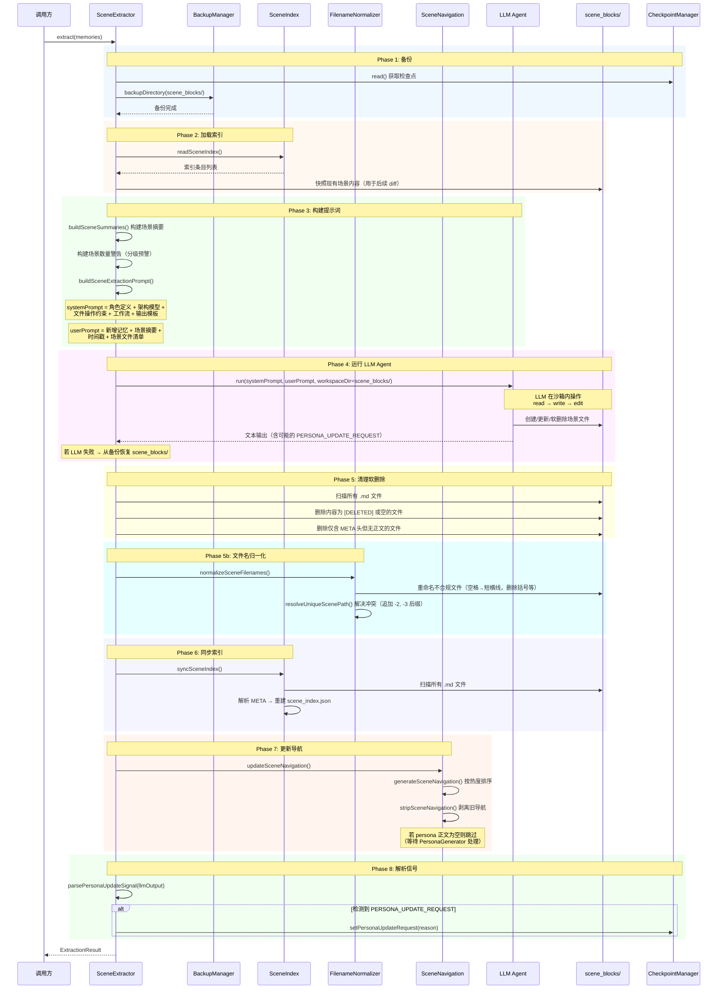

### 8 阶段流水线详解

| 阶段 | 名称 | 说明 | 失败处理 |
|------|------|------|----------|
| 1 | 备份 | 使用 BackupManager 备份 scene_blocks/ 目录 | — |
| 2 | 加载索引 | 读取 scene_index.json，快照现有场景内容和索引 | 返回空列表 |
| 3 | 构建提示词 | 组装 systemPrompt + userPrompt，含场景数量分级预警 | — |
| 4 | 运行 LLM Agent | 沙箱限定 scene_blocks/，LLM 自主读写场景文件 | 从备份恢复 scene_blocks/ |
| 5 | 清理软删除 | 删除 `[DELETED]` 标记文件和 META-only 文件 | 非致命，继续执行 |
| 5b | 文件名归一化 | 修正 LLM 产生的不合规文件名 | 非致命，继续执行 |
| 6 | 同步索引 | 扫描磁盘重建 scene_index.json | — |
| 7 | 更新导航 | 更新 persona.md 末尾的场景导航区段 | 非致命，继续执行 |
| 8 | 解析信号 | 解析 LLM 输出中的 PERSONA_UPDATE_REQUEST 信号 | — |

### 场景数量分级预警

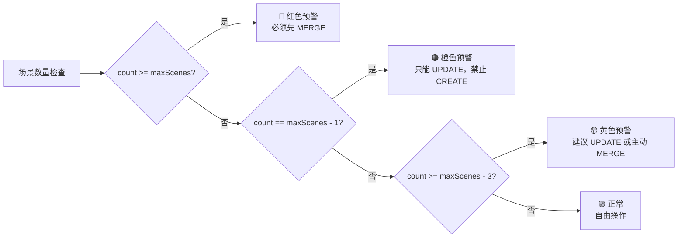

---

## 4. 场景文件格式设计

### 数据结构

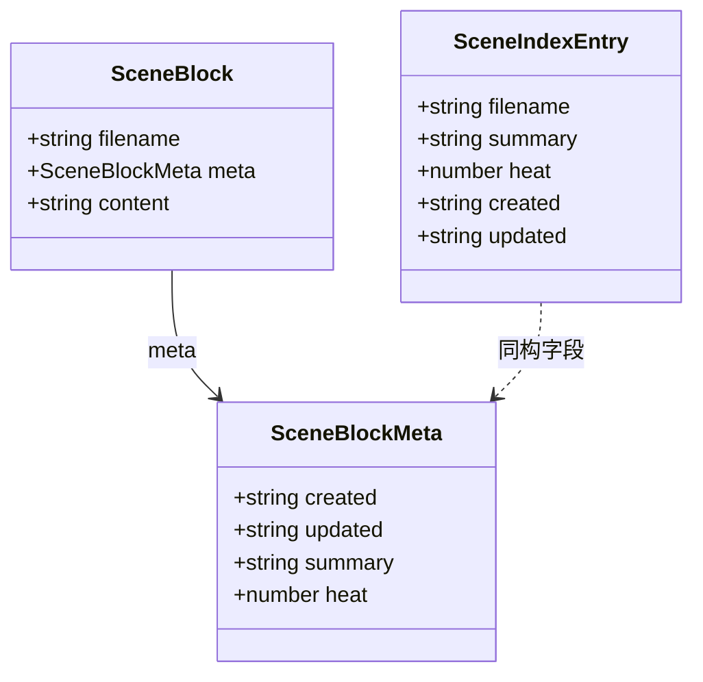

### 文件格式示例

```markdown
-----META-START-----
created: 2026-01-10T08:30:00Z
updated: 2026-03-15T14:20:00Z
summary: 用户在后端开发领域的技能栈与学习轨迹，涵盖 Python 异步框架和 Rust 探索
heat: 42
-----META-END-----

## 用户核心特征
用户在后端开发方面表现出对 Python 的强烈偏好...

## 用户偏好
- 偏好异步编程模型
- 代码洁癖，拒绝打补丁

## 隐性信号
从 Python 向 Rust 的转型意图暗示对系统级编程的渴望

## 核心叙事
本周用户主要集中在后端重构上...

## 演变轨迹
- [2026-01-10]: 从 "反对加班" 转向 "接受弹性工作"

## 待确认/矛盾点
- 对 Rust 的兴趣是长期转型还是短期探索？
```

### 解析与格式化流程

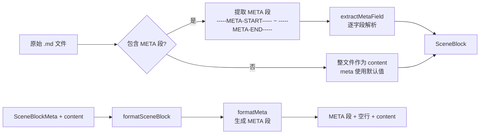

---

## 5. 场景索引与导航设计

### 场景索引

场景索引存储在 `.metadata/scene_index.json`，是场景块的快速查找表，**由工程侧独占写入**，LLM 无法访问。

```mermaid
flowchart TB
    subgraph "读取路径"
        A1[readSceneIndex] --> A2[读取 .metadata/scene_index.json]
        A2 --> A3[JSON.parse + 类型校验]
        A3 --> A4[SceneIndexEntry[]]
    end

    subgraph "同步路径（重建）"
        B1[syncSceneIndex] --> B2[扫描 scene_blocks/*.md]
        B2 --> B3[逐文件 parseSceneBlock]
        B3 --> B4[提取 meta 字段]
        B4 --> B5[writeSceneIndex<br/>原子写入 scene_index.json]
    end

    subgraph "写入路径"
        C1[writeSceneIndex] --> C2[JSON.stringify(entries)]
        C2 --> C3[fs.writeFile<br/>scene_index.json]
    end

    B5 --> C1
```

### 场景导航

场景导航是追加在 `persona.md` 末尾的索引区段，按热度降序排列，提供场景的绝对路径以便 Agent 直接 `read_file`。

```mermaid
flowchart TB
    subgraph "导航生成"
        A1[SceneIndexEntry[]] --> A2[按 heat 降序排序]
        A2 --> A3[生成热度 emoji<br/>🔥 × 热度等级]
        A3 --> A4[生成 Markdown 导航块]
        A4 --> A5[NAV_HEADER + 条目列表 + NAV_FOOTER]
    end

    subgraph "导航追加到 persona.md"
        B1[读取 persona.md] --> B2[stripSceneNavigation<br/>剥离旧导航]
        B2 --> B3{正文为空?}
        B3 -->|是| B4[跳过，等待 PersonaGenerator]
        B3 -->|否| B5[正文 + 新导航 → 写入]
    end

    subgraph "导航剥离"
        C1[persona.md 内容] --> C2[查找 NAV_HEADER 位置]
        C2 --> C3{找到?}
        C3 -->|是| C4[截取 NAV_HEADER 之前的内容]
        C3 -->|否| C5[原样返回]
    end
```

### 热度 emoji 映射

| 热度范围 | emoji | 含义 |
|----------|-------|------|
| ≥ 1000 | 🔥🔥🔥🔥🔥 | 极高 |
| ≥ 500 | 🔥🔥🔥🔥 | 很高 |
| ≥ 200 | 🔥🔥🔥 | 高 |
| ≥ 100 | 🔥🔥 | 中 |
| ≥ 50 | 🔥 | 低 |
| < 50 | （无） | 极低 |

---

## 6. Persona 生成流程

`PersonaGenerator.generateLocalPersona()` 实现了四层深度扫描模型，支持首次生成和增量更新两种模式：

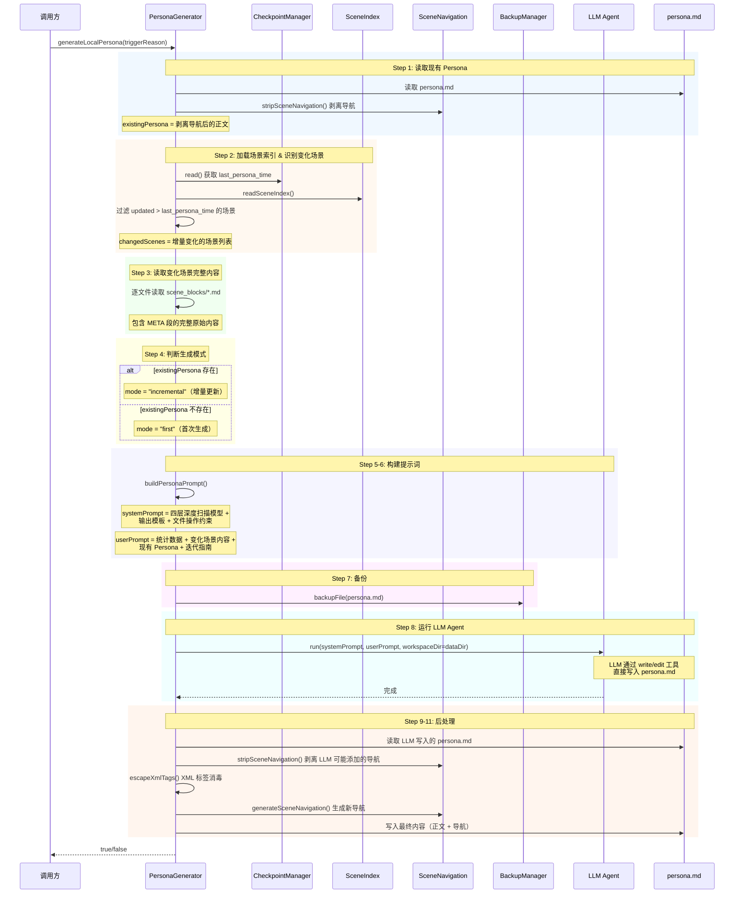

### 四层深度扫描模型

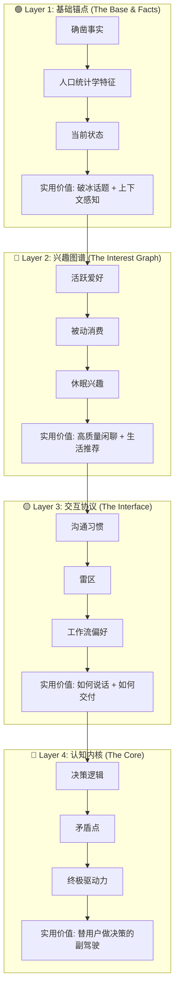

### Persona 输出模板结构

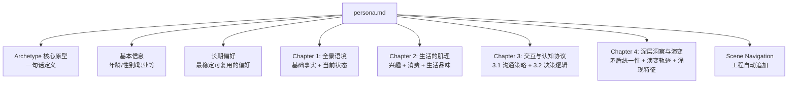

---

## 7. Persona 触发条件设计

`PersonaTrigger.shouldGenerate()` 实现了 5 级优先级触发条件评估：

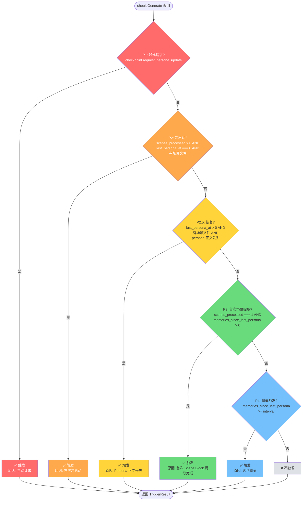

### 5 级优先级详解

| 优先级 | 名称 | 条件 | 触发原因示例 |
|--------|------|------|-------------|
| P1 | 显式请求 | `checkpoint.request_persona_update === true` | LLM 在场景提取时发出 `PERSONA_UPDATE_REQUEST` 信号 |
| P2 | 冷启动 | `scenes_processed > 0` 且 `last_persona_at === 0` 且有场景文件 | 首次提取完成，从未生成过 Persona |
| P2.5 | 恢复 | `last_persona_at > 0` 且有场景文件且 `persona.md` 正文为空 | Persona 文件损坏或丢失 |
| P3 | 首次场景提取 | `scenes_processed === 1` 且 `memories_since_last_persona > 0` | 第一个场景块提取完成 |
| P4 | 阈值触发 | `memories_since_last_persona >= interval` | 新记忆数量达到配置的间隔阈值 |

### PERSONA_UPDATE_REQUEST 信号流

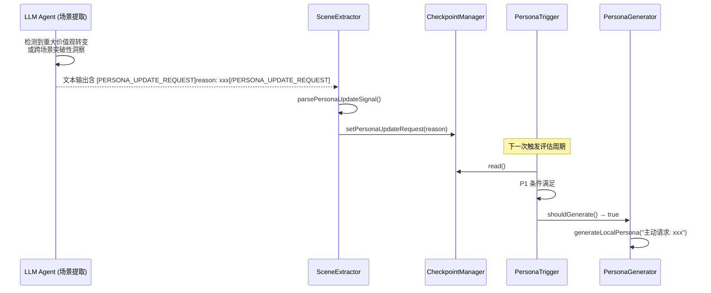

---

## 8. Profile 同步设计

`profile-sync.ts` 实现 L2/L3 本地与远程的双向同步，支持拉取（远程→本地）和推送（本地→远程）。

### 拉取流程（远程 → 本地）

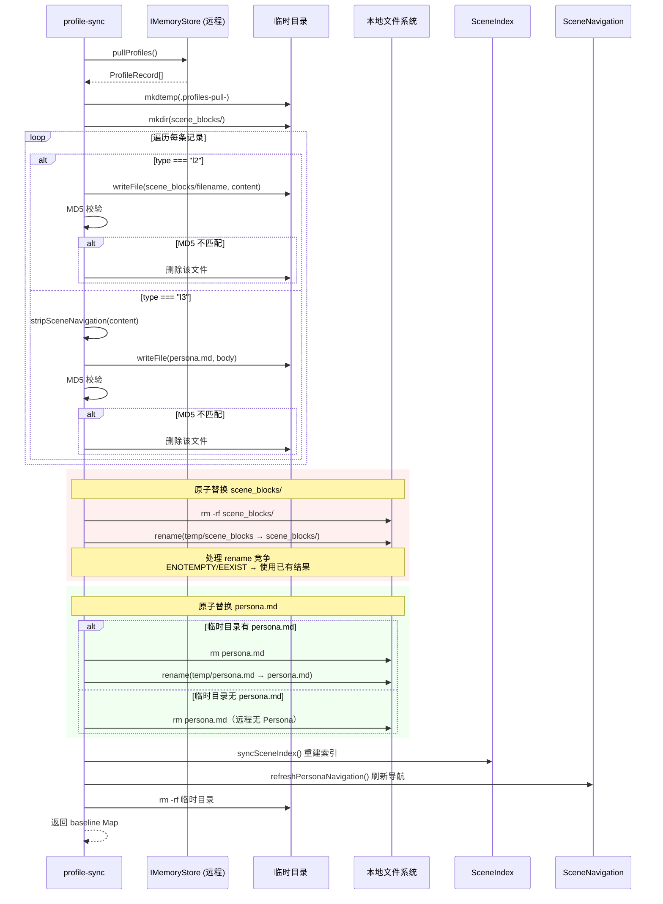

### 推送流程（本地 → 远程）

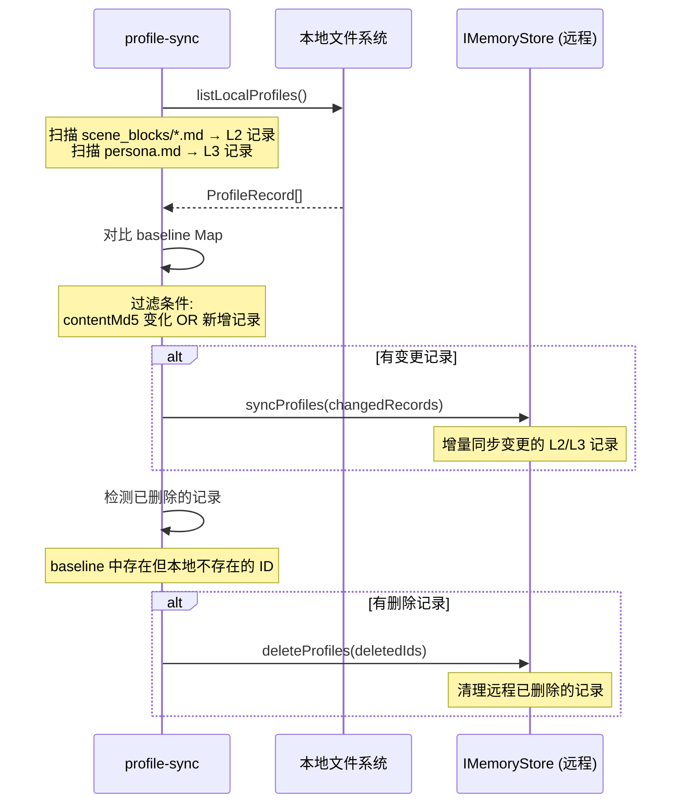

### Profile 记录结构

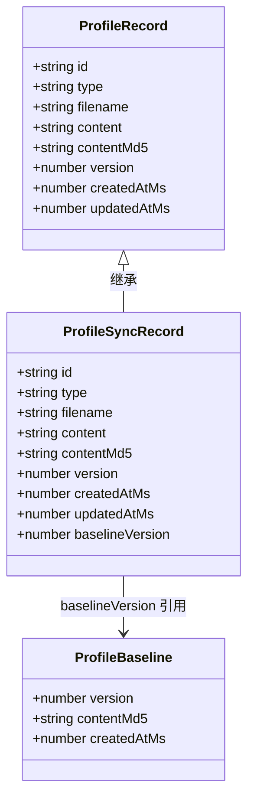

### ID 生成规则

Profile 记录使用确定性 ID，基于 `scope + type + filename` 的 SHA-256 哈希：

```
id = "profile:v1:" + sha256(scope + "\u0000" + type + "\u0000" + filename)
```

---

## 9. LLM Agent 沙箱设计

### 沙箱隔离架构

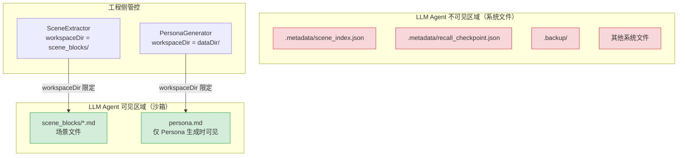

### 两种沙箱模式对比

| 维度 | 场景提取 (SceneExtractor) | Persona 生成 (PersonaGenerator) |
|------|--------------------------|-------------------------------|
| workspaceDir | `scene_blocks/` | `dataDir/` |
| 可操作文件 | 仅 `*.md` 场景文件 | 仅 `persona.md` |
| 不可见文件 | checkpoint, scene_index, persona.md | scene_blocks/, .metadata/ |
| 文件工具 | read, write, edit | write, edit（无需 read） |
| 删除方式 | write `[DELETED]` 标记 | 不涉及删除 |

### 安全机制

```mermaid
flowchart TB
    A[LLM Agent 执行] --> B{文件操作类型}

    B -->|read| C{文件在沙箱内?}
    C -->|是| D[✅ 允许读取]
    C -->|否| E[❌ 拒绝：文件不存在]

    B -->|write| F{内容为空/纯空白?}
    F -->|是| G[❌ 拒绝：参数校验失败]
    F -->|否| H{内容为 '[DELETED]'?}
    H -->|是| I[✅ 软删除标记]
    H -->|否| J[✅ 正常写入]

    B -->|edit| K{目标文件在沙箱内?}
    K -->|是| L[✅ 允许编辑]
    K -->|否| M[❌ 拒绝：文件不存在]

    I --> N[工程侧后续清理<br/>fs.unlink 删除文件]
```

### 软删除流程

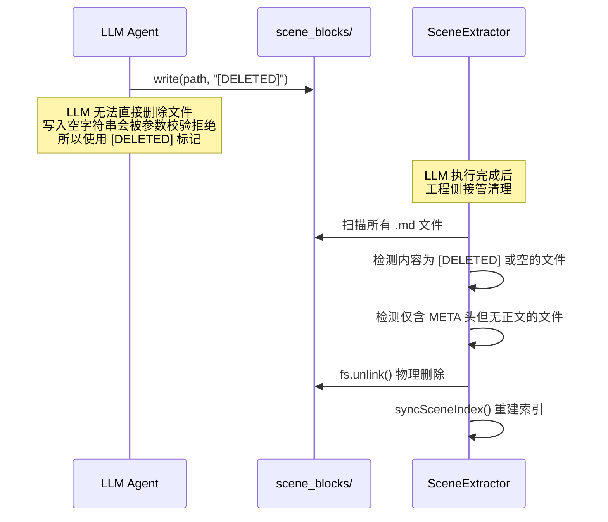

### 错误恢复机制

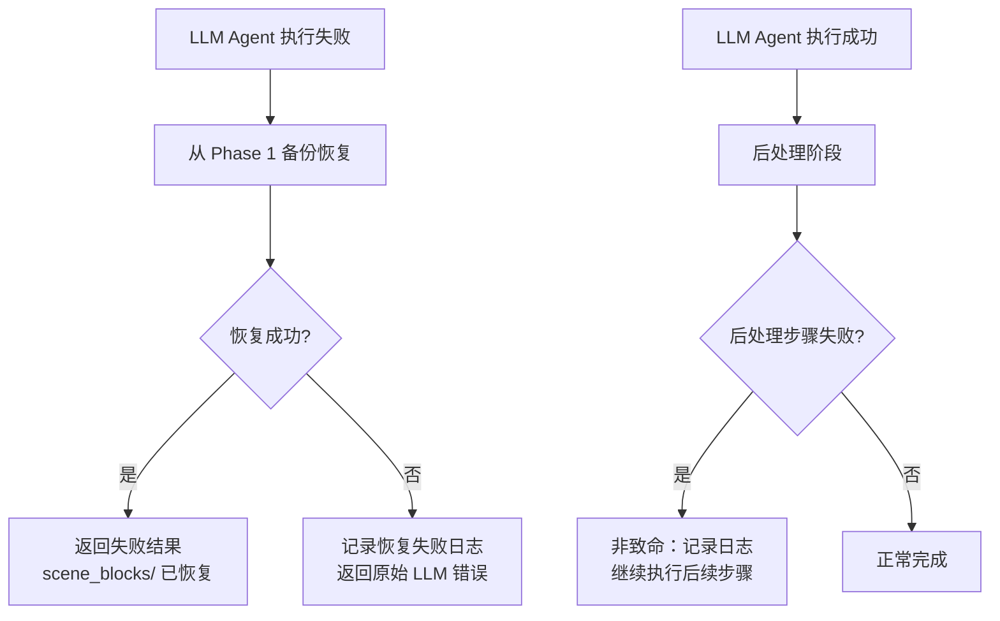
