# TencentDB Agent Memory — 项目规格说明文档

> **版本**: 0.3.6 | **包名**: `@tencentdb-agent-memory/memory-tencentdb` | **许可证**: MIT
> **引擎**: Node.js >= 22.16.0 | **模块类型**: ESM

---

## 1. 项目概述

TencentDB Agent Memory 是一个四层本地记忆系统插件，为 **OpenClaw** 和 **Hermes Agent** 提供 Agent 记忆能力。系统通过记忆分层与符号记忆两大核心支柱，实现从原始对话到用户画像的渐进式信息提炼，并在上下文溢出时通过 Context Offload 机制保持 Agent 的长期记忆连续性。

### 1.1 设计目标

- **记忆持久化**：将 Agent 的对话经验转化为可检索的结构化记忆
- **上下文压缩**：在 Token 预算有限时智能压缩上下文，保留关键信息
- **跨会话连续**：通过用户画像和场景块实现跨会话的个性化体验
- **灵活适配**：支持 OpenClaw 与 Standalone/Gateway 两种宿主模式

### 1.2 系统架构总览

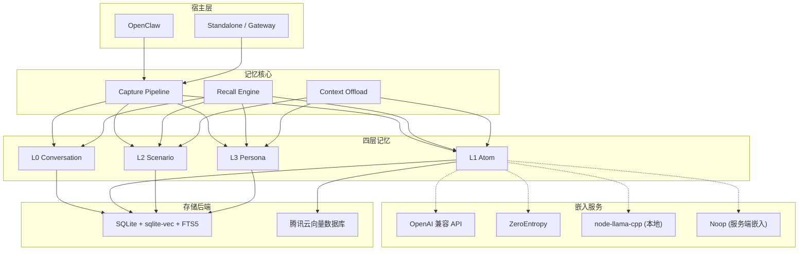

---

## 2. 核心概念

### 2.1 记忆分层（Memory Layering）

系统将记忆按抽象程度分为四个层级，信息从底层原始数据逐层提炼为高层符号化知识：

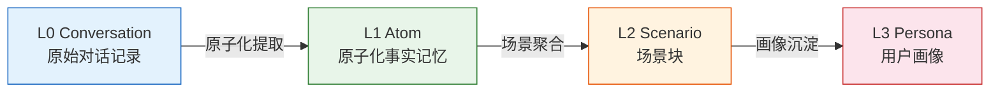

| 层级 | 名称 | 格式 | 存储路径 | 说明 |
|------|------|------|----------|------|
| L0 | Conversation | JSONL | `conversations/YYYY-MM-DD.jsonl` | 原始对话记录，按日归档 |
| L1 | Atom | JSONL + 向量索引 | `records/YYYY-MM-DD.jsonl` | 原子化事实记忆，结构化记录 |
| L2 | Scenario | Markdown | `scene_blocks/*.md` | 场景块，包含 Mermaid 流程图 |
| L3 | Persona | Markdown | `persona.md` | 用户画像，持续演化的个人知识 |

### 2.2 符号记忆（Symbolic Memory）

符号记忆是系统的高阶抽象能力，将低层记忆转化为可推理、可检索的符号化表示：

- **L2 场景块**：以 Markdown 文档形式组织，内嵌 Mermaid 流程图描述任务流程
- **L3 用户画像**：以 `persona.md` 文件持续维护，记录用户偏好、习惯和关键特征
- **符号提炼**：通过 LLM 驱动的 Pipeline 自动从 L0/L1 提炼 L2/L3

### 2.3 Context Offload（上下文卸载）

当对话上下文接近 Token 预算上限时，系统启动 Context Offload 机制，逐级压缩上下文：

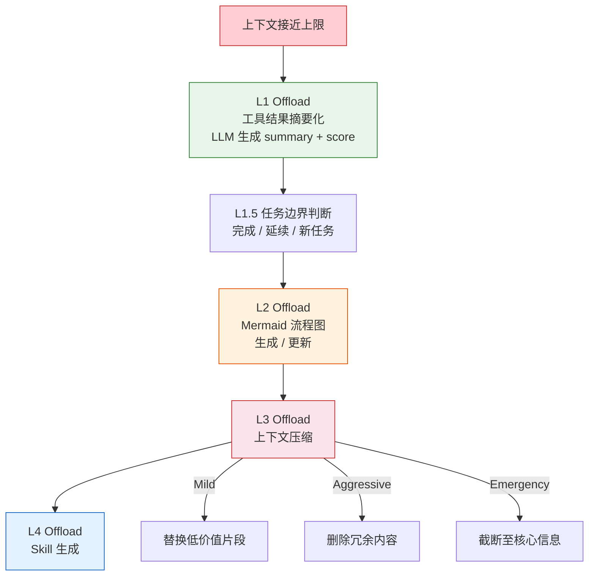

#### L3 压缩策略

| 策略 | 触发条件 | 行为 |
|------|----------|------|
| Mild | 上下文轻度溢出 | 替换低价值片段为摘要 |
| Aggressive | 上下文中度溢出 | 删除冗余内容，保留关键信息 |
| Emergency | 上下文严重溢出 | 截断至核心信息，最大程度压缩 |

---

## 3. 功能规格

### 3.1 记忆捕获（Capture Pipeline）

Capture Pipeline 负责将对话数据逐层提炼为结构化记忆：

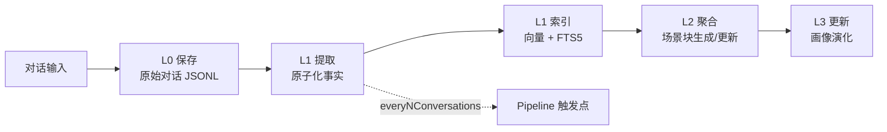

- Pipeline 按 `pipeline.everyNConversations` 配置的频率触发
- 支持 `pipeline.enableWarmup` 预热已有记忆
- L1 空闲超时由 `l1IdleTimeoutSeconds` 控制

### 3.2 记忆召回（Recall Engine）

Recall Engine 提供三种搜索策略，支持从 L0 和 L1 层级检索记忆：

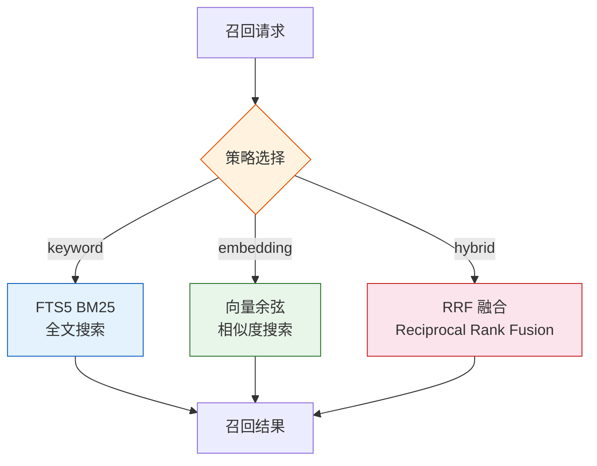

| 策略 | 算法 | 适用场景 |
|------|------|----------|
| keyword | FTS5 BM25 全文搜索 | 精确关键词匹配 |
| embedding | 向量余弦相似度 | 语义相似性搜索 |
| hybrid | RRF（Reciprocal Rank Fusion） | 综合关键词与语义的最佳召回 |

### 3.3 Agent 工具

系统为宿主 Agent 提供两个记忆检索工具：

| 工具名 | 功能 | 搜索层级 |
|--------|------|----------|
| `tdai_memory_search` | L1 结构化记忆搜索 | L1 Atom |
| `tdai_conversation_search` | L0 原始对话搜索 | L0 Conversation |

### 3.4 宿主适配

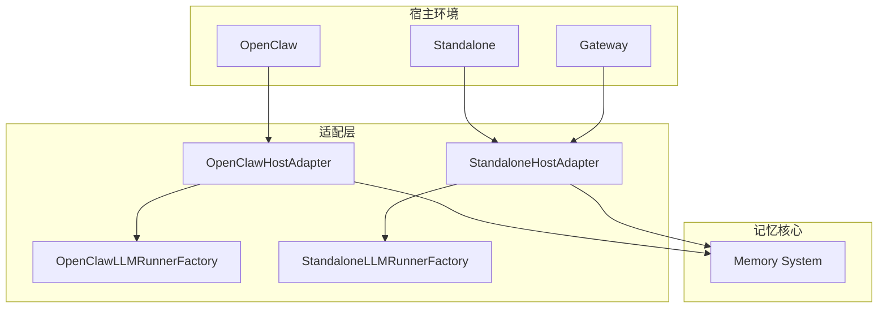

---

## 4. 数据规格

### 4.1 数据目录结构

```
~/.openclaw/memory-tdai/
├── conversations/          # L0 原始对话 JSONL
│   └── YYYY-MM-DD.jsonl
├── records/                # L1 原子化事实 JSONL
│   └── YYYY-MM-DD.jsonl
├── scene_blocks/           # L2 场景块 Markdown
│   └── *.md
├── persona.md              # L3 用户画像
├── .metadata/              # 索引和检查点
├── .backup/                # 备份
└── memory.db               # SQLite 数据库
```

### 4.2 L0 Conversation 数据格式

L0 层以 JSONL 格式按日归档原始对话记录：

```jsonl
{"role":"user","content":"...","timestamp":"2025-01-15T10:30:00+08:00","sessionId":"..."}
{"role":"assistant","content":"...","timestamp":"2025-01-15T10:30:05+08:00","sessionId":"..."}
```

### 4.3 L1 Atom 数据格式

L1 层以 JSONL 格式存储原子化事实记忆，同时维护向量索引：

```jsonl
{"id":"atom-xxx","fact":"...","source":"L0","tags":["..."],"score":0.85,"timestamp":"...","embedding":[...]}
```

### 4.4 L2 Scenario 数据格式

L2 层以 Markdown 文件存储场景块，内嵌 Mermaid 流程图：

```markdown
# 场景：数据库性能调优

## 概述
...

## 流程
​```mermaid
flowchart TD
    A[问题发现] --> B[指标分析]
    B --> C[参数调优]
​```

## 关键决策
...
```

### 4.5 L3 Persona 数据格式

L3 层以 `persona.md` 文件持续维护用户画像：

```markdown
# 用户画像

## 偏好
- ...

## 技术背景
- ...

## 沟通风格
- ...
```

### 4.6 存储后端规格

| 后端 | 操作模式 | 向量支持 | 全文搜索 | 适用场景 |
|------|----------|----------|----------|----------|
| SQLite | 同步 | sqlite-vec | FTS5 | 本地单机部署 |
| TCVDB | 异步 | 服务端嵌入 | - | 云端大规模部署 |

---

## 5. 接口规格

### 5.1 Gateway API 端点

Gateway 模式通过 HTTP API 对外暴露记忆服务：

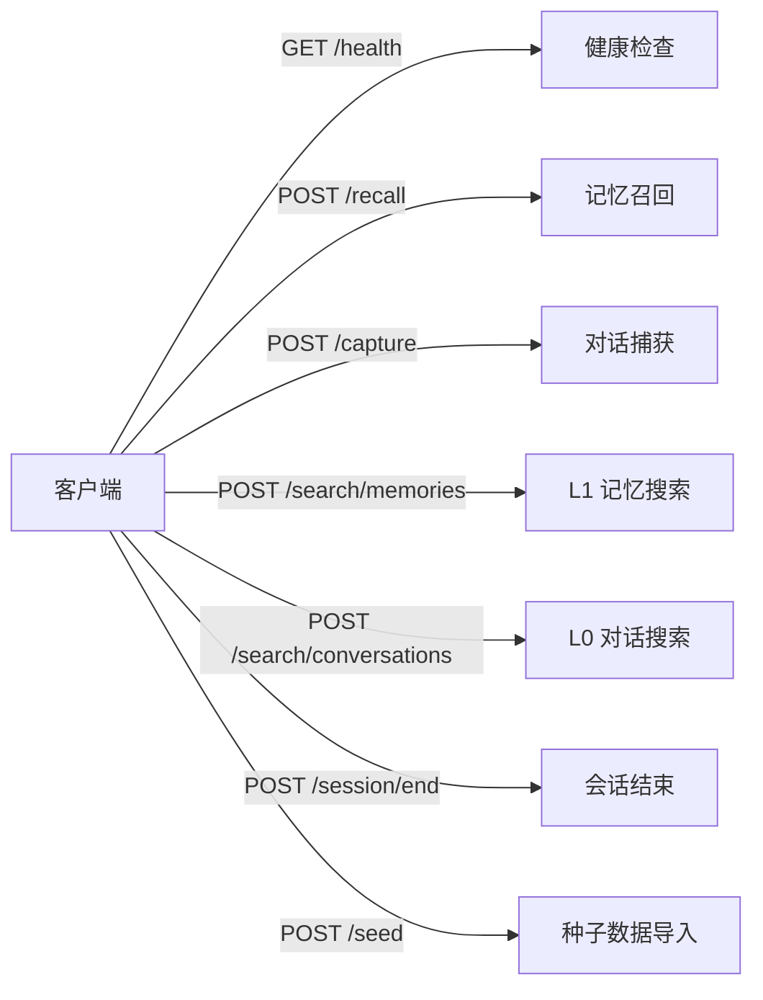

#### 5.1.1 GET /health

健康检查端点。

**响应**：

```json
{
  "status": "ok",
  "version": "0.3.6"
}
```

#### 5.1.2 POST /recall

记忆召回，从 L0-L3 各层检索相关记忆。

**请求体**：

```json
{
  "query": "数据库连接池配置",
  "strategy": "hybrid",
  "limit": 10
}
```

**响应**：

```json
{
  "results": [
    {
      "layer": "L1",
      "content": "...",
      "score": 0.92,
      "timestamp": "..."
    }
  ]
}
```

#### 5.1.3 POST /capture

捕获对话数据，触发 Capture Pipeline。

**请求体**：

```json
{
  "messages": [
    {"role": "user", "content": "..."},
    {"role": "assistant", "content": "..."}
  ],
  "sessionId": "..."
}
```

#### 5.1.4 POST /search/memories

L1 结构化记忆搜索。

**请求体**：

```json
{
  "query": "...",
  "strategy": "embedding",
  "limit": 5
}
```

#### 5.1.5 POST /search/conversations

L0 原始对话搜索。

**请求体**：

```json
{
  "query": "...",
  "limit": 10
}
```

#### 5.1.6 POST /session/end

标记会话结束，触发任务边界判断和记忆沉淀。

**请求体**：

```json
{
  "sessionId": "..."
}
```

#### 5.1.7 POST /seed

导入种子数据，用于初始化或批量注入记忆。

**请求体**：

```json
{
  "memories": [
    {"layer": "L1", "content": "...", "tags": ["..."]}
  ]
}
```

---

## 6. 配置规格

### 6.1 三级配置体系

系统采用三级配置体系，从日常调优到完整参数逐层深入：

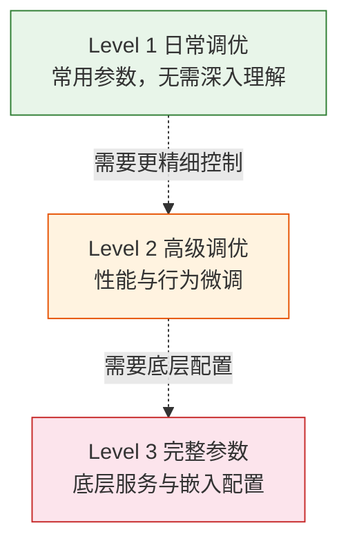

### 6.2 Level 1 — 日常调优

| 参数 | 类型 | 默认值 | 说明 |
|------|------|--------|------|
| `timezone` | string | `"Asia/Shanghai"` | 时区设置 |
| `storeBackend` | `"sqlite"` \| `"tcvdb"` | `"sqlite"` | 存储后端选择 |
| `recall.strategy` | `"keyword"` \| `"embedding"` \| `"hybrid"` | `"hybrid"` | 召回搜索策略 |
| `pipeline.everyNConversations` | number | - | 每隔 N 轮对话触发 Pipeline |
| `offload.enabled` | boolean | `true` | 是否启用 Context Offload |

### 6.3 Level 2 — 高级调优

| 参数 | 类型 | 默认值 | 说明 |
|------|------|--------|------|
| `pipeline.enableWarmup` | boolean | `false` | 是否预热已有记忆 |
| `l1IdleTimeoutSeconds` | number | - | L1 空闲超时时间（秒） |
| `offload.mildOffloadRatio` | number | - | Mild 策略压缩比例 |
| `bm25.language` | string | - | BM25 全文搜索语言设置 |

### 6.4 Level 3 — 完整参数

| 参数 | 类型 | 说明 |
|------|------|------|
| `embedding.*` | object | 嵌入服务完整配置 |
| `llm.*` | object | LLM 服务完整配置 |
| `offload.backendUrl` | string | Offload 后端服务 URL |

### 6.5 嵌入服务配置

| 服务 | 说明 | 维度 |
|------|------|------|
| OpenAI 兼容 API | 支持 qclaw 代理 | 由模型决定 |
| ZeroEntropy 原生 API | ZeroEntropy 服务 | 由模型决定 |
| node-llama-cpp (本地) | embeddinggemma-300m | 768 |
| Noop | 服务端嵌入后端（TCVDB） | - |

---

## 7. 性能规格

### 7.1 核心性能指标

基于实际测试数据，系统在 OpenClaw 集成后取得以下性能提升：

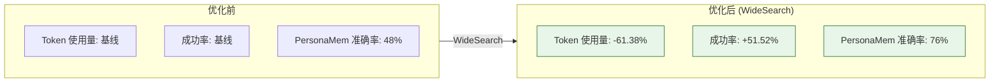

| 指标 | 优化前 | 优化后 | 变化 |
|------|--------|--------|------|
| Token 使用量 | 基线 | -61.38% | 显著降低 |
| 成功率 | 基线 | +51.52% | 显著提升 |
| PersonaMem 准确率 | 48% | 76% | +28pp |

### 7.2 性能优化策略

- **Context Offload**：通过 L1-L4 逐级压缩，减少 Token 消耗
- **Hybrid Search**：RRF 融合策略兼顾精确匹配与语义相似性
- **Pipeline 批处理**：按 `everyNConversations` 批量处理，减少 LLM 调用频次
- **本地嵌入**：node-llama-cpp 本地嵌入避免网络延迟

---

## 8. 安全规格

### 8.1 安全机制总览

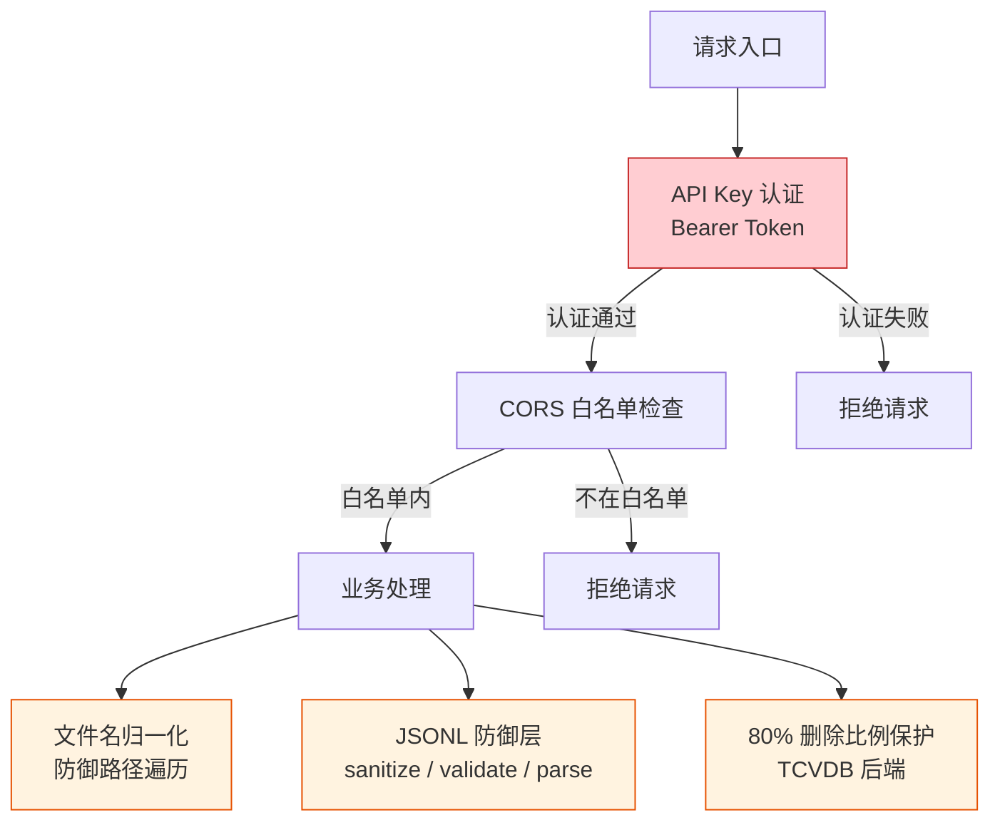

### 8.2 认证机制

- **API Key 认证**：Gateway 模式下所有 API 请求需携带 Bearer Token
- **CORS 白名单**：仅允许白名单内的来源访问 API

### 8.3 数据安全

| 机制 | 说明 |
|------|------|
| 文件名归一化 | 防御路径遍历攻击，确保文件名不包含 `..`、`/` 等危险字符 |
| JSONL 防御层 | 三层防御：sanitize（清洗）→ validate（校验）→ parse（解析） |
| 80% 删除比例保护 | TCVDB 后端下，单次删除操作不得超过总数据量的 80%，防止误删 |

### 8.4 JSONL 防御层详解

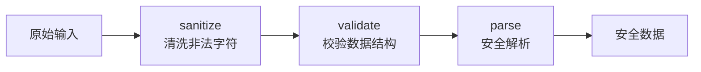

---

## 9. 部署规格

### 9.1 运行环境

| 项目 | 要求 |
|------|------|
| Node.js | >= 22.16.0 |
| 模块系统 | ESM |
| 操作系统 | macOS / Linux / Windows |
| 磁盘空间 | 依记忆数据量增长，建议预留 1GB+ |

### 9.2 部署模式

```mermaid
graph TB
    subgraph Mode1["模式一：OpenClaw 内嵌"]
        OC["OpenClaw Agent"] --> ADAPTER["OpenClawHostAdapter"]
        ADAPTER --> MEM["Memory System"]
        MEM --> SQL["SQLite (本地)"]
    end

    subgraph Mode2["模式二：Standalone"]
        APP["应用程序"] --> SA["StandaloneHostAdapter"]
        SA --> MEM2["Memory System"]
        MEM2 --> SQL2["SQLite (本地)"]
    end

    subgraph Mode3["模式三：Gateway"]
        CLIENT["远程客户端"] -->|"HTTP API"| GW["Gateway Server"]
        GW --> MEM3["Memory System"]
        MEM3 --> TCV["TCVDB (云端)"]
    end

    style Mode1 fill:#e3f2fd,stroke:#1565c0
    style Mode2 fill:#e8f5e9,stroke:#2e7d32
    style Mode3 fill:#fff3e0,stroke:#e65100
```

### 9.3 依赖服务

| 部署模式 | 必需依赖 | 可选依赖 |
|----------|----------|----------|
| OpenClaw 内嵌 | OpenClaw 运行时 | LLM API、嵌入服务 |
| Standalone | Node.js 运行时 | LLM API、嵌入服务 |
| Gateway | Node.js 运行时 | TCVDB、LLM API、嵌入服务 |

### 9.4 存储后端选择指南

| 场景 | 推荐后端 | 理由 |
|------|----------|------|
| 本地开发 / 单机使用 | SQLite | 零配置，同步操作，低延迟 |
| 团队共享 / 大规模部署 | TCVDB | 服务端嵌入，异步操作，水平扩展 |

### 9.5 初始化流程

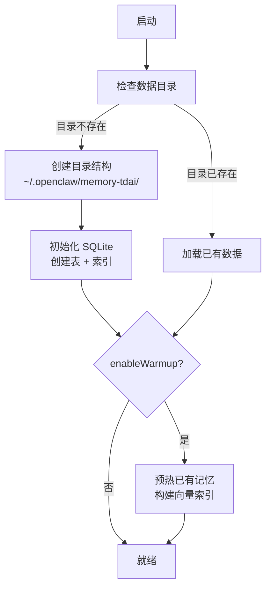

---

> **文档版本**: 1.0 | **生成日期**: 2026-06-07 | **对应包版本**: 0.3.6
