# Store 存储模块设计文档

## 1. 模块概述

Store 模块是 TencentDB Agent Memory 的**存储抽象层**，通过 `IMemoryStore` 接口实现存储后端的可插拔替换。上层模块（hooks、tools、pipeline、record）仅依赖接口，不依赖具体实现，遵循**依赖倒置原则**。

### 核心设计原则

| 原则 | 说明 |
|------|------|
| **后端无关** | 上层仅依赖 `IMemoryStore` 接口，从不直接引用 `VectorStore` 或 `TcvdbMemoryStore` |
| **能力驱动** | 通过 `StoreCapabilities` 标志位表达后端能力，调用方据此选择搜索策略并优雅降级 |
| **容错优先** | 所有方法失败时返回空结果或 `false`，而非抛出异常（除非显式文档说明） |
| **同步/异步统一** | `MaybePromise<T>` 类型统一 SQLite 同步与 TCVDB 异步返回，调用方始终 `await` |

### 支持的后端

| 后端 | 类 | 存储 | 嵌入方式 | 搜索能力 |
|------|-----|------|----------|----------|
| SQLite | `VectorStore` | 本地文件 | 客户端嵌入 | 向量搜索 + FTS5 |
| TCVDB | `TcvdbMemoryStore` | 腾讯云向量数据库 | 服务端嵌入 | 向量 + 稀疏向量 + 原生混合搜索 |

### 文件结构

```
src/core/store/
├── types.ts          # 核心接口与类型定义
├── factory.ts        # 存储后端工厂（StoreBundle 组装）
├── sqlite.ts         # SQLite 本地向量存储实现
├── tcvdb.ts          # 腾讯云向量数据库实现
├── tcvdb-client.ts   # TCVDB HTTP 客户端
├── embedding.ts      # 嵌入服务（OpenAI / Local / ZeroEntropy / Noop）
├── bm25-local.ts     # 本地 BM25 稀疏向量编码器
├── bm25-client.ts    # BM25 远程客户端（旧版）
└── search-utils.ts   # 搜索工具（RRF 融合算法）
```

---

## 2. 架构设计

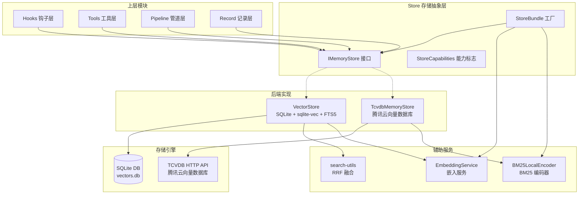

---

## 3. IMemoryStore 接口设计

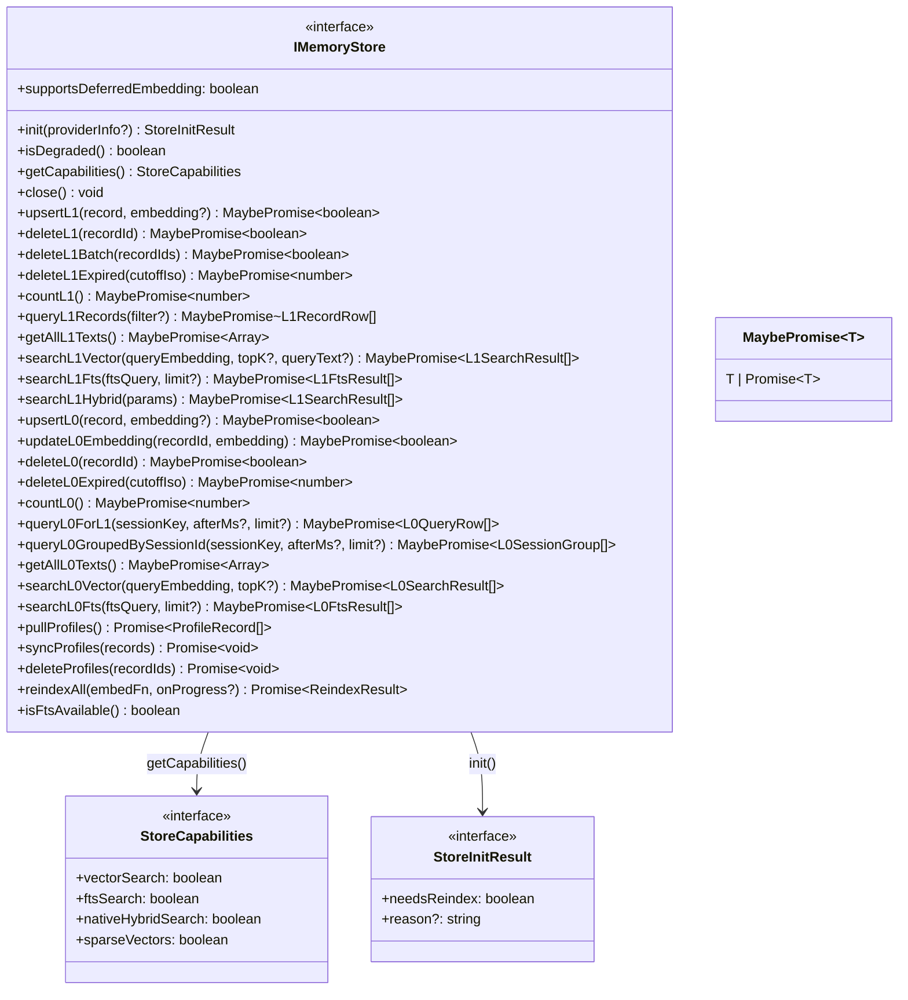

### 接口分组说明

| 分组 | 方法 | 说明 |
|------|------|------|
| **生命周期** | `init` / `isDegraded` / `getCapabilities` / `close` | 初始化、状态查询、关闭 |
| **L1 写入** | `upsertL1` / `deleteL1` / `deleteL1Batch` / `deleteL1Expired` | 结构化记忆的增删改 |
| **L1 读取** | `countL1` / `queryL1Records` / `getAllL1Texts` | 记录查询与统计 |
| **L1 搜索** | `searchL1Vector` / `searchL1Fts` / `searchL1Hybrid` | 向量/关键词/混合搜索 |
| **L0 写入** | `upsertL0` / `updateL0Embedding` / `deleteL0` / `deleteL0Expired` | 原始对话的增删改 |
| **L0 读取** | `countL0` / `queryL0ForL1` / `queryL0GroupedBySessionId` / `getAllL0Texts` | 对话查询与分组 |
| **L0 搜索** | `searchL0Vector` / `searchL0Fts` | 向量/关键词搜索 |
| **Profile 同步** | `pullProfiles` / `syncProfiles` / `deleteProfiles` | L2/L3 画像同步（仅 TCVDB） |
| **重建索引** | `reindexAll` / `isFtsAvailable` | 全量重建与 FTS 状态 |

### 能力标志对比

| 能力 | SQLite | TCVDB |
|------|--------|-------|
| `vectorSearch` | ✅（vec0 表就绪时） | ✅（服务端嵌入） |
| `ftsSearch` | ✅（FTS5 可用时） | ✅（BM25 编码器可用时） |
| `nativeHybridSearch` | ❌ | ✅（BM25 编码器可用时） |
| `sparseVectors` | ❌ | ✅（BM25 编码器可用时） |

---

## 4. SQLite 后端设计

### 4.1 表结构设计

```mermaid
erDiagram
    l1_records {
        TEXT record_id PK
        TEXT content
        TEXT type
        INTEGER priority
        TEXT scene_name
        TEXT session_key
        TEXT session_id
        TEXT timestamp_str
        TEXT timestamp_start
        TEXT timestamp_end
        TEXT created_time
        TEXT updated_time
        TEXT metadata_json
    }

    l1_vec {
        TEXT record_id PK
        BLOB embedding
        TEXT updated_time
    }

    l1_fts {
        TEXT content "分词后文本(索引用)"
        TEXT content_original UNINDEXED "原始文本(展示用)"
        TEXT record_id UNINDEXED
        TEXT type UNINDEXED
        INTEGER priority UNINDEXED
        TEXT scene_name UNINDEXED
        TEXT session_key UNINDEXED
        TEXT session_id UNINDEXED
        TEXT timestamp_str UNINDEXED
        TEXT timestamp_start UNINDEXED
        TEXT timestamp_end UNINDEXED
        TEXT metadata_json UNINDEXED
    }

    l0_conversations {
        TEXT record_id PK
        TEXT session_key
        TEXT session_id
        TEXT role
        TEXT message_text
        TEXT recorded_at
        INTEGER timestamp
    }

    l0_vec {
        TEXT record_id PK
        BLOB embedding
        TEXT recorded_at
    }

    l0_fts {
        TEXT message_text "分词后文本(索引用)"
        TEXT message_text_original UNINDEXED "原始文本(展示用)"
        TEXT record_id UNINDEXED
        TEXT session_key UNINDEXED
        TEXT session_id UNINDEXED
        TEXT role UNINDEXED
        TEXT recorded_at UNINDEXED
        INTEGER timestamp UNINDEXED
    }

    embedding_meta {
        TEXT key PK
        TEXT value
    }

    l1_records ||--o{ l1_vec : "record_id"
    l1_records ||--o{ l1_fts : "record_id"
    l0_conversations ||--o{ l0_vec : "record_id"
    l0_conversations ||--o{ l0_fts : "record_id"
```

### 4.2 写入流程

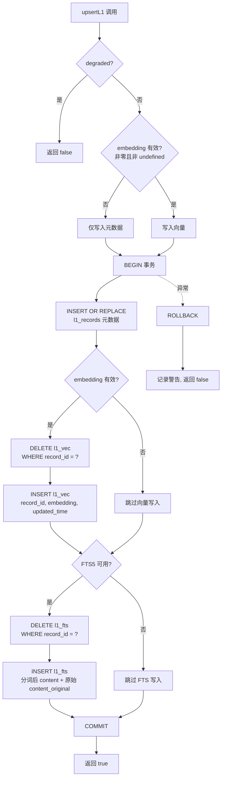

### 4.3 向量搜索流程

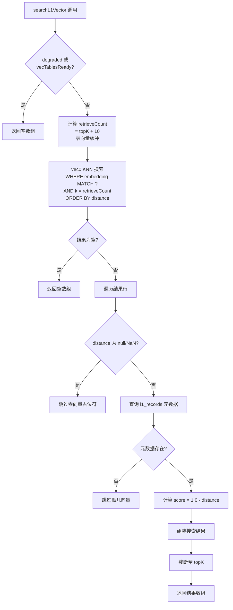

### 4.4 FTS5 搜索流程

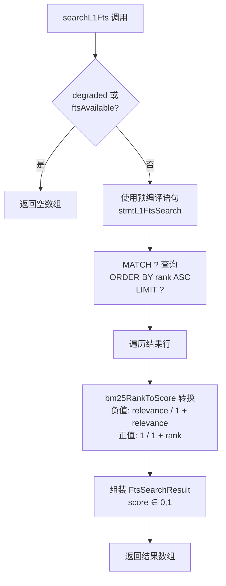

### 4.5 FTS5 中文分词策略

```mermaid
flowchart LR
    subgraph 写入侧 tokenizeForFts
        A[原始文本] --> B{jieba 可用?}
        B -->|是| C[jieba.cutForSearch<br/>搜索引擎模式分词]
        B -->|否| D[保留原文]
        C --> E[空格连接分词结果<br/>unicode61 二次切分]
        D --> E
    end

    subgraph 查询侧 buildFtsQuery
        F[查询文本] --> G{jieba 可用?}
        G -->|是| H[jieba.cutForSearch<br/>+ 停用词过滤<br/>+ 去重]
        G -->|否| I[Unicode 正则切分<br/>/\\p{L}\\p{N}_+/gu]
        H --> J[引号包裹 + OR 连接<br/>"词1" OR "词2" OR ...]
        I --> J
    end

    E --> K[l1_fts.content<br/>l0_fts.message_text]
    J --> L[MATCH 表达式]
```

### 4.6 重建索引流程

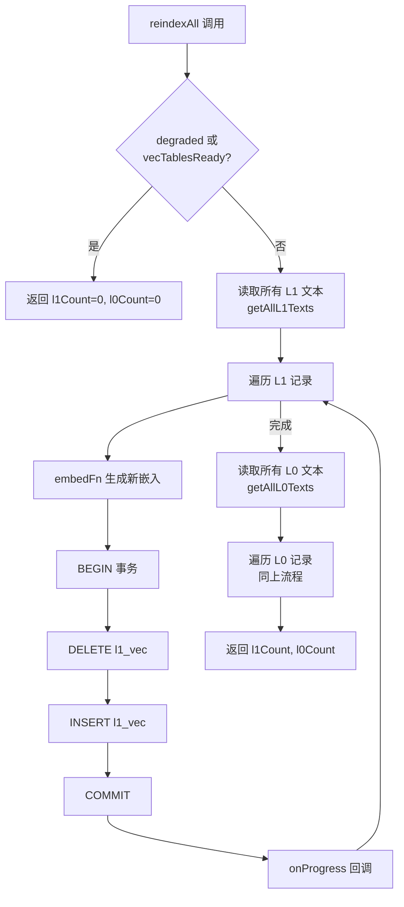

---

## 5. TCVDB 后端设计

### 5.1 初始化流程

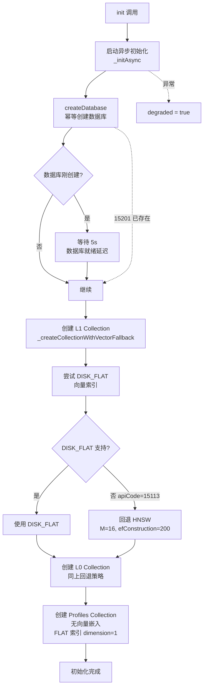

### 5.2 Collection 结构

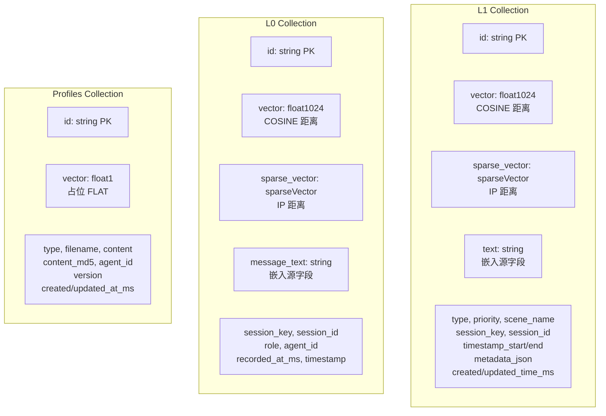

### 5.3 混合搜索流程

```mermaid
flowchart TD
    A[searchL1HybridAsync 调用] --> B[_ensureInit]
    B --> C{degraded?}
    C -->|是| D[返回空数组]
    C -->|否| E{bm25Encoder 可用?}

    E -->|是| F[构建完整混合搜索]
    E -->|否| G[仅密集向量搜索]

    F --> H[ann: fieldName=text<br/>data=queryText<br/>服务端嵌入]
    F --> I[match: fieldName=sparse_vector<br/>data=BM25 编码结果]
    F --> J[rerank: method=rrf<br/>k=60]

    H --> K[hybridSearch API]
    I --> K
    J --> K

    G --> L[search API<br/>embeddingItems=queryText<br/>服务端嵌入]

    K --> M[解析搜索结果<br/>_parseL1SearchResults]
    L --> M

    M --> N[返回 L1SearchResult[]]
```

### 5.4 Profile 同步流程

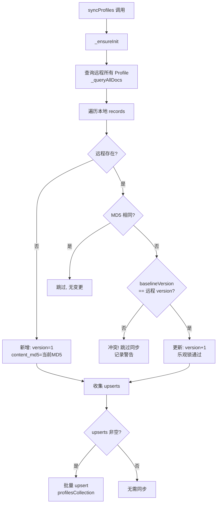

---

## 6. 嵌入服务设计

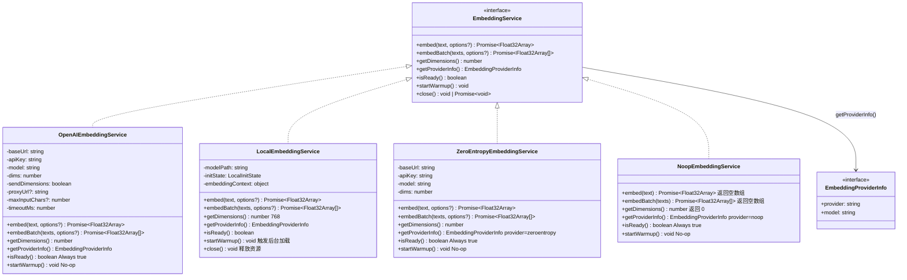

### 嵌入服务对比

| 特性 | OpenAI | Local | ZeroEntropy | Noop |
|------|--------|-------|-------------|------|
| **维度** | 可配置 | 768 | 可配置 | 0 |
| **模型** | 用户指定 | embeddinggemma-300m | zembed-1 | 无 |
| **就绪状态** | 始终就绪 | 需后台加载 | 始终就绪 | 始终就绪 |
| **预热** | 无需 | `startWarmup()` | 无需 | 无需 |
| **用途** | SQLite 后端 | SQLite 后端 | SQLite 后端 | TCVDB 后端 |
| **API 端点** | `/embeddings` | 本地推理 | `/models/embed` | 无 |
| **特殊参数** | `dimensions` | 无 | `input_type` | 无 |

### LocalEmbeddingService 状态机

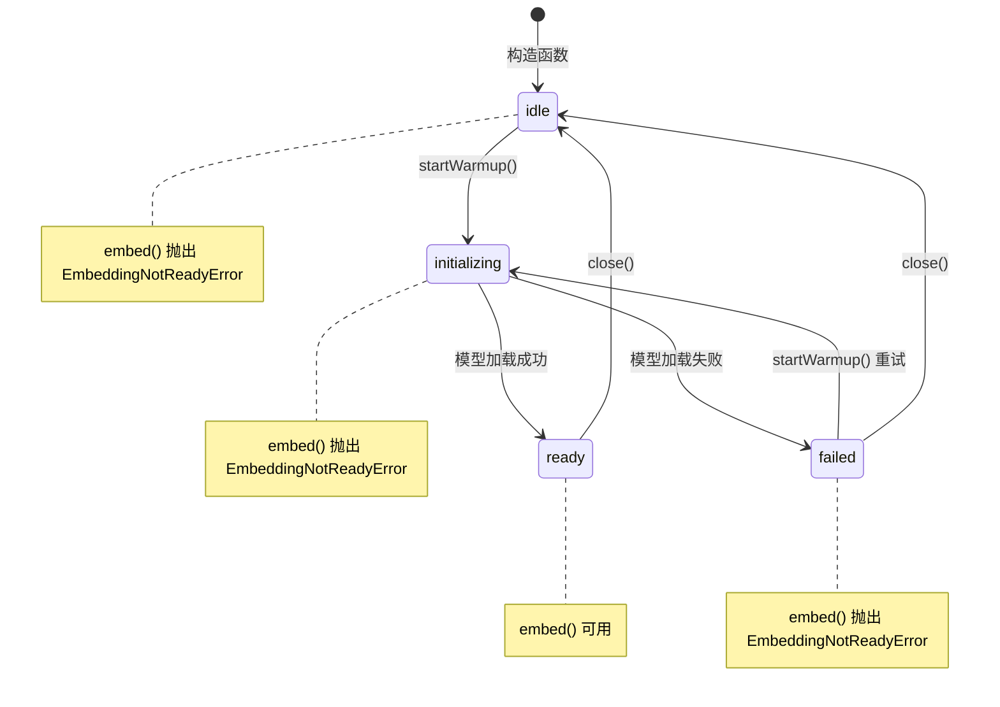

---

## 7. 搜索策略设计

### 7.1 三种搜索路径

```mermaid
flowchart TD
    A[搜索请求] --> B{搜索类型?}

    B -->|keyword| C[关键词搜索路径]
    B -->|embedding| D[向量搜索路径]
    B -->|hybrid| E[混合搜索路径]

    subgraph 关键词搜索
        C --> C1{后端类型?}
        C1 -->|SQLite| C2[buildFtsQuery<br/>jieba 分词 + OR 连接]
        C2 --> C3[FTS5 MATCH 搜索<br/>BM25 排序]
        C3 --> C4[bm25RankToScore<br/>归一化 0-1]

        C1 -->|TCVDB| C5[BM25 encodeQueries<br/>稀疏向量编码]
        C5 --> C6[hybridSearch<br/>sparse-only 路径]
    end

    subgraph 向量搜索
        D --> D1{后端类型?}
        D1 -->|SQLite| D2[客户端 embed<br/>生成 queryEmbedding]
        D2 --> D3[vec0 KNN 搜索<br/>cosine distance]
        D3 --> D4[score = 1.0 - distance<br/>过滤零向量]

        D1 -->|TCVDB| D5[服务端嵌入<br/>embeddingItems]
        D5 --> D6[/document/search<br/>服务端向量匹配]
    end

    subgraph 混合搜索
        E --> E1{后端类型?}
        E1 -->|SQLite| E2[并行: 向量搜索 + FTS 搜索]
        E2 --> E3[rrfMerge 融合<br/>k=60]
        E3 --> E4[按 RRF 分数排序]

        E1 -->|TCVDB| E5[ann: 服务端密集向量]
        E5 --> E6[match: BM25 稀疏向量]
        E6 --> E7[rerank: RRF k=60]
        E7 --> E8[/document/hybridSearch]
    end
```

### 7.2 RRF 融合算法

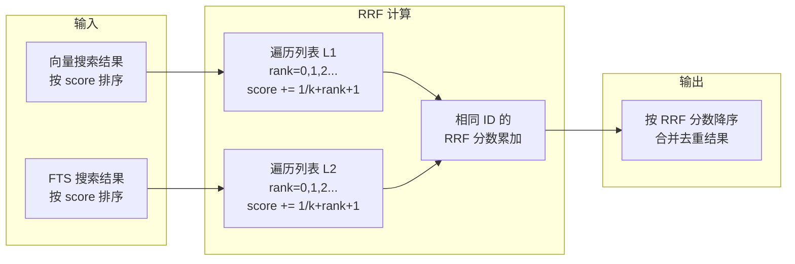

**RRF 公式**：`score(d) = Σ 1/(k + rank(d) + 1)`，其中 `k = 60`

---

## 8. 工厂模式设计

### 8.1 StoreBundle 组装流程

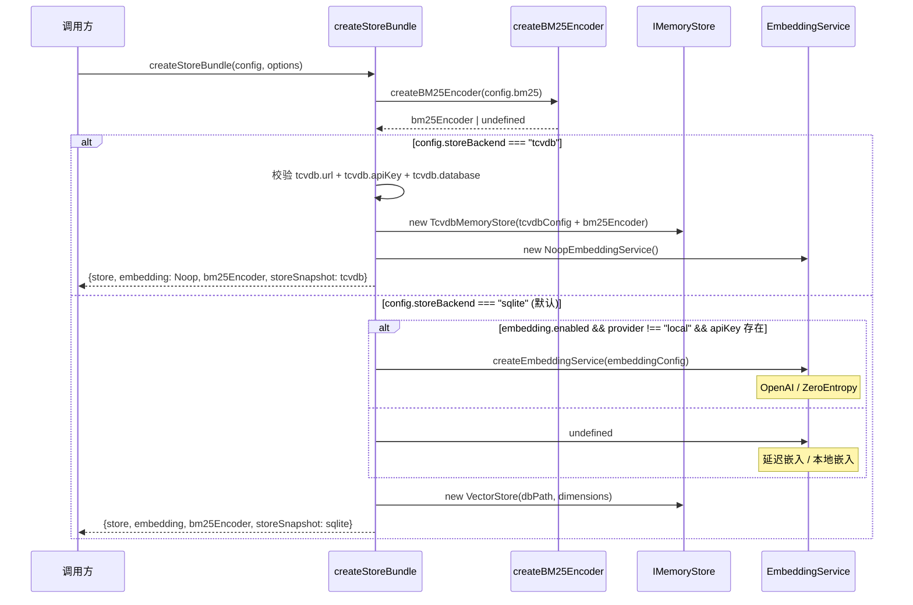

### 8.2 StoreBundle 结构

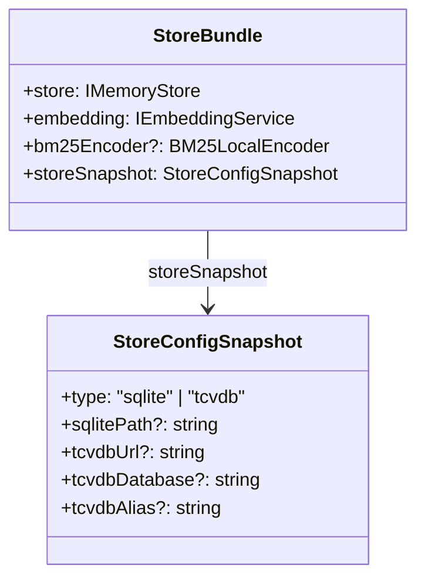

---

## 9. 容错与降级设计

### 9.1 降级策略总览

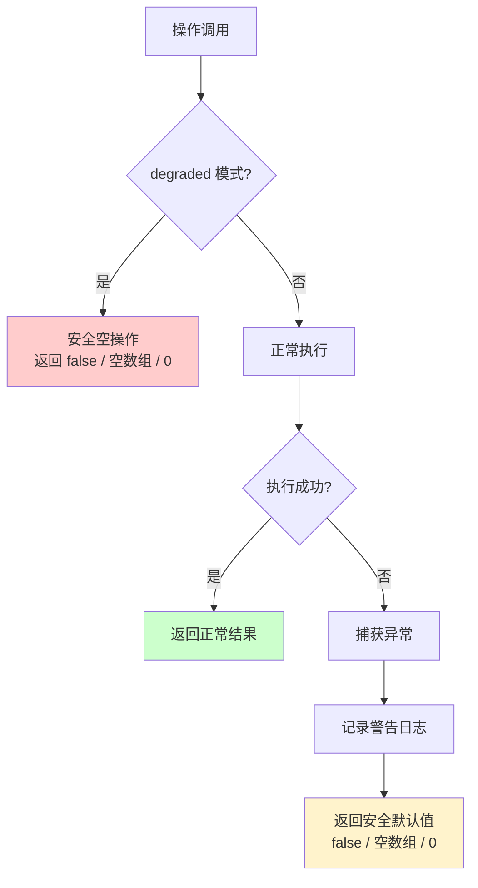

### 9.2 各组件降级行为

| 组件 | 触发条件 | 降级行为 |
|------|----------|----------|
| **VectorStore** | sqlite-vec 加载失败 | `degraded = true`，所有操作返回空/false |
| **VectorStore** | FTS5 不可用 | `ftsAvailable = false`，FTS 搜索返回空数组 |
| **VectorStore** | dimensions = 0 | `vecTablesReady = false`，跳过向量读写 |
| **TcvdbMemoryStore** | 初始化失败 | `degraded = true`，所有操作返回空/false |
| **TcvdbMemoryStore** | BM25 不可用 | `nativeHybridSearch = false`，回退到纯密集搜索 |
| **TcvdbMemoryStore** | DISK_FLAT 不支持 | 自动回退到 HNSW 索引 |
| **LocalEmbeddingService** | 模型加载失败 | `initState = "failed"`，embed() 抛出 EmbeddingNotReadyError |
| **OpenAIEmbeddingService** | API 调用失败 | 抛出异常，由调用方决定降级 |
| **BM25LocalEncoder** | 编码失败 | 返回空数组，TCVDB 跳过稀疏向量 |

### 9.3 删除保护机制

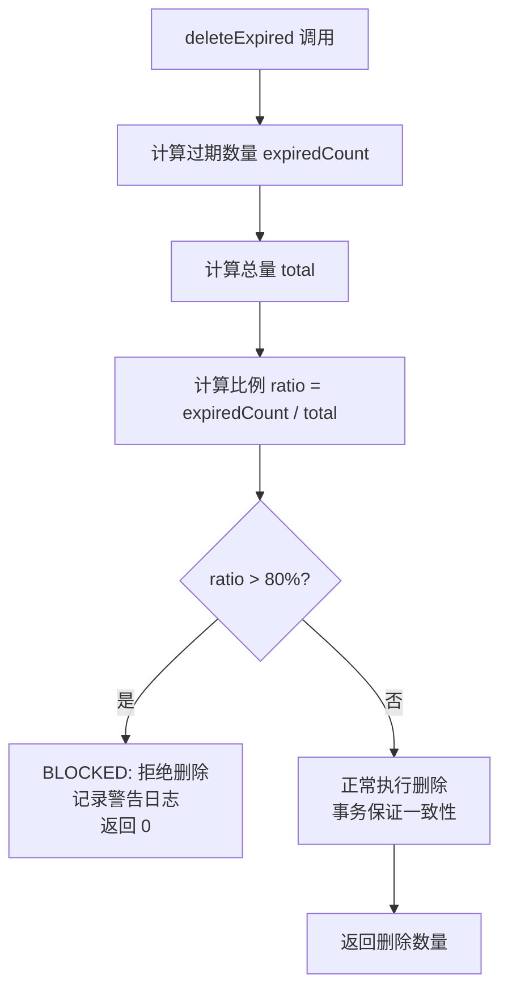

### 9.4 TCVDB 客户端重试机制

```mermaid
flowchart TD
    A[HTTP 请求] --> B[发送请求<br/>attempt = 0]
    B --> C{响应状态?}

    C -->|code = 0| D[成功返回]
    C -->|4xx 非 429| E[客户端错误<br/>立即抛出 TcvdbApiError]
    C -->|5xx / 超时 / 429| F{attempt < MAX_RETRIES?}

    F -->|是| G[指数退避等待<br/>delay = 500 * attempt+1<br/>ms]
    G --> H[attempt++<br/>重试请求]
    H --> C

    F -->|否| I[抛出最后一个错误]

    C -->|网络异常| F
```

**重试参数**：最大重试 2 次，退避间隔 500ms / 1000ms

### 9.5 SQLite 事务安全

```mermaid
flowchart TD
    A[BEGIN 事务] --> B[元数据写入]
    B --> C[向量写入]
    C --> D[FTS 写入]
    D --> E[COMMIT]

    A -.->|任意步骤异常| F[ROLLBACK]
    F --> G[记录警告]
    G --> H[返回 false]

    E --> I[返回 true]
```

**关键设计**：
- vec0 不支持 `ON CONFLICT`，upsert 采用 `DELETE + INSERT` 策略
- FTS 写入失败为非致命错误，不影响主事务
- 零向量不写入 vec0 表，避免 KNN 搜索返回 null/NaN 距离
- KNN 搜索额外获取 10 条结果（`ZERO_VEC_BUFFER`）补偿遗留零向量
