# agentmemory 设计文档 (Design Document)

> 版本: v0.9.27 | 更新日期: 2026-06-06

---

## 1. 系统总体架构

agentmemory 采用分层架构，自上而下分为集成层、路由层、业务逻辑层、存储层和基础设施层。

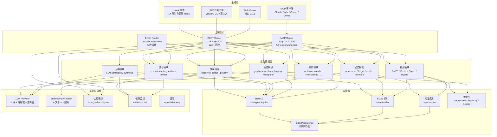
```mermaid
flowchart TB
    subgraph Integration_Layer["集成层"]
        direction LR
        MCP_CLIENT[MCP 客户端<br/>Claude Code / Cursor / Codex]
        HOOK_SCRIPT[Hook 脚本<br/>14 种生命周期 Hook]
        REST_CLIENT[REST 客户端<br/>Viewer / CLI / 第三方]
        VIEWER[Web Viewer<br/>端口 3113]
    end

    subgraph Routing_Layer["路由层"]
        direction LR
        MCP_ROUTER[MCP Router<br/>mcp::tools::call<br/>53 tools switch-case]
        REST_ROUTER[REST Router<br/>128 endpoints<br/>api::* 函数]
        EVENT_ROUTER[Event Router<br/>durable::subscriber<br/>5 种事件]
    end

    subgraph Business_Layer["业务逻辑层"]
        direction LR
        CAPTURE[捕获模块<br/>observe / dedup / privacy]
        COMPRESS_MOD[压缩模块<br/>LLM compress / synthetic]
        MEMORY_MOD[记忆模块<br/>remember / forget / evict / retention]
        SEARCH_MOD[搜索模块<br/>BM25 / Vector / Graph / Hybrid]
        CONSOLIDATE_MOD[整合模块<br/>consolidate / crystallize / reflect]
        GRAPH_MOD[图谱模块<br/>graph-extract / graph-query / temporal]
        ORCHESTRATE[编排模块<br/>actions / signals / checkpoints / ...]
    end

    subgraph Storage_Layer["存储层"]
        direction LR
        STATE_KV[StateKV<br/>iii-engine SQLite]
        BM25_IDX[BM25 索引<br/>SearchIndex]
        VEC_IDX[向量索引<br/>VectorIndex]
        GRAPH_IDX[图索引<br/>NameIndex / EdgeKey / Degree]
        PERSIST[IndexPersistence<br/>分片持久化]
    end

    subgraph Infra_Layer["基础设施层"]
        direction LR
        LLM_PROV[LLM Provider<br/>7 种 + 降级链 + 熔断器]
        EMB_PROV[Embedding Provider<br/>6 文本 + 1 图片]
        AUTH_MOD[认证模块<br/>timingSafeCompare]
        HEALTH[健康监控<br/>HealthMonitor]
        TELEMETRY[遥测<br/>OpenTelemetry]
    end

    MCP_CLIENT --> MCP_ROUTER
    HOOK_SCRIPT --> REST_ROUTER
    REST_CLIENT --> REST_ROUTER
    VIEWER --> REST_ROUTER

    MCP_ROUTER --> CAPTURE & MEMORY_MOD & SEARCH_MOD & CONSOLIDATE_MOD & GRAPH_MOD & ORCHESTRATE
    REST_ROUTER --> CAPTURE & COMPRESS_MOD & MEMORY_MOD & SEARCH_MOD & CONSOLIDATE_MOD & GRAPH_MOD & ORCHESTRATE
    EVENT_ROUTER --> CAPTURE & CONSOLIDATE_MOD

    CAPTURE --> STATE_KV & BM25_IDX
    COMPRESS_MOD --> STATE_KV & LLM_PROV
    MEMORY_MOD --> STATE_KV & BM25_IDX & VEC_IDX
    SEARCH_MOD --> BM25_IDX & VEC_IDX & GRAPH_IDX & EMB_PROV
    CONSOLIDATE_MOD --> STATE_KV & LLM_PROV
    GRAPH_MOD --> STATE_KV & LLM_PROV & GRAPH_IDX
    ORCHESTRATE --> STATE_KV

    STATE_KV --> PERSIST
    BM25_IDX --> PERSIST
    VEC_IDX --> PERSIST

    REST_ROUTER --> AUTH_MOD
    MCP_ROUTER --> AUTH_MOD
    CAPTURE & COMPRESS_MOD & CONSOLIDATE_MOD --> HEALTH
```

---

## 2. 核心模块设计

### 2.1 存储层 (State & Storage)

存储层是整个系统的基础，提供 KV 存储、全文索引、向量索引和图索引四种存储原语。

#### 2.1.1 存储层架构图

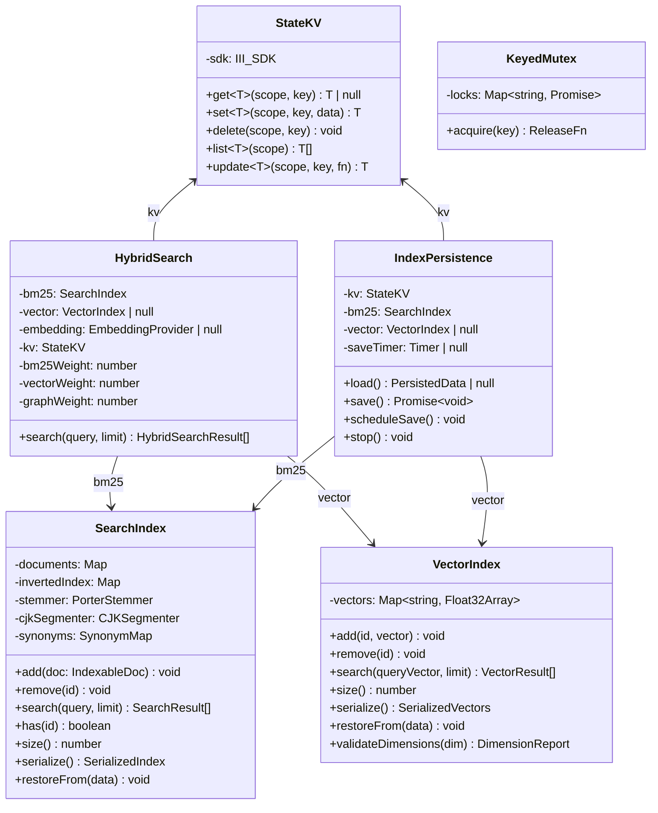
```mermaid
classDiagram
    class StateKV {
        -sdk: III_SDK
        +get~T~(scope, key) T | null
        +set~T~(scope, key, data) T
        +delete(scope, key) void
        +list~T~(scope) T[]
        +update~T~(scope, key, fn) T
    }

    class SearchIndex {
        -documents: Map
        -invertedIndex: Map
        -stemmer: PorterStemmer
        -cjkSegmenter: CJKSegmenter
        -synonyms: SynonymMap
        +add(doc: IndexableDoc) void
        +remove(id) void
        +search(query, limit) SearchResult[]
        +has(id) boolean
        +size() number
        +serialize() SerializedIndex
        +restoreFrom(data) void
    }

    class VectorIndex {
        -vectors: Map~string, Float32Array~
        +add(id, vector) void
        +remove(id) void
        +search(queryVector, limit) VectorResult[]
        +size() number
        +serialize() SerializedVectors
        +restoreFrom(data) void
        +validateDimensions(dim) DimensionReport
    }

    class HybridSearch {
        -bm25: SearchIndex
        -vector: VectorIndex | null
        -embedding: EmbeddingProvider | null
        -kv: StateKV
        -bm25Weight: number
        -vectorWeight: number
        -graphWeight: number
        +search(query, limit) HybridSearchResult[]
    }

    class IndexPersistence {
        -kv: StateKV
        -bm25: SearchIndex
        -vector: VectorIndex | null
        -saveTimer: Timer | null
        +load() PersistedData | null
        +save() Promise~void~
        +scheduleSave() void
        +stop() void
    }

    class KeyedMutex {
        -locks: Map~string, Promise~
        +acquire(key) ReleaseFn
    }

    HybridSearch --> SearchIndex : bm25
    HybridSearch --> VectorIndex : vector
    IndexPersistence --> SearchIndex : bm25
    IndexPersistence --> VectorIndex : vector
    StateKV <-- IndexPersistence : kv
    StateKV <-- HybridSearch : kv
```

#### 2.1.2 混合搜索时序图

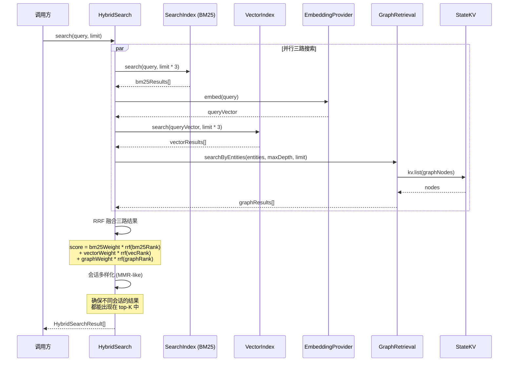
```mermaid
sequenceDiagram
    participant Caller as 调用方
    participant HS as HybridSearch
    participant BM25 as SearchIndex (BM25)
    participant Vec as VectorIndex
    participant Emb as EmbeddingProvider
    participant GR as GraphRetrieval
    participant KV as StateKV

    Caller->>HS: search(query, limit)

    par 并行三路搜索
        HS->>BM25: search(query, limit * 3)
        BM25-->>HS: bm25Results[]

        HS->>Emb: embed(query)
        Emb-->>HS: queryVector
        HS->>Vec: search(queryVector, limit * 3)
        Vec-->>HS: vectorResults[]

        HS->>GR: searchByEntities(entities, maxDepth, limit)
        GR->>KV: kv.list(graphNodes)
        KV-->>GR: nodes
        GR-->>HS: graphResults[]
    end

    HS->>HS: RRF 融合三路结果
    Note over HS: score = bm25Weight * rrf(bm25Rank)<br/>+ vectorWeight * rrf(vecRank)<br/>+ graphWeight * rrf(graphRank)

    HS->>HS: 会话多样化 (MMR-like)
    Note over HS: 确保不同会话的结果<br/>都能出现在 top-K 中

    HS-->>Caller: HybridSearchResult[]
```

#### 2.1.3 索引持久化状态机

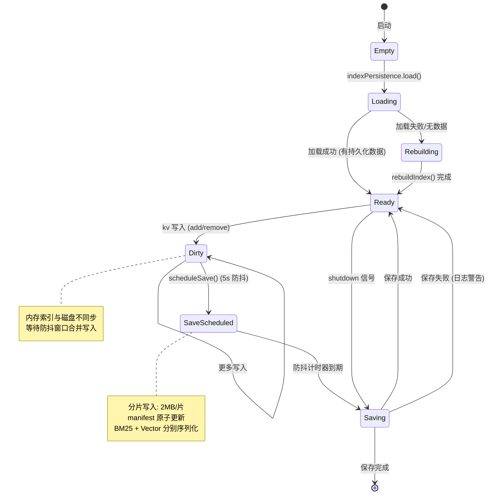
```mermaid
stateDiagram-v2
    [*] --> Empty: 启动

    Empty --> Loading: indexPersistence.load()
    Loading --> Ready: 加载成功 (有持久化数据)
    Loading --> Rebuilding: 加载失败/无数据

    Rebuilding --> Ready: rebuildIndex() 完成
    Ready --> Dirty: kv 写入 (add/remove)

    Dirty --> Dirty: 更多写入
    Dirty --> SaveScheduled: scheduleSave() (5s 防抖)
    SaveScheduled --> Saving: 防抖计时器到期

    Saving --> Ready: 保存成功
    Saving --> Ready: 保存失败 (日志警告)

    Ready --> Saving: shutdown 信号
    Saving --> [*]: 保存完成

    note right of Dirty
        内存索引与磁盘不同步
        等待防抖窗口合并写入
    end note

    note right of SaveScheduled
        分片写入: 2MB/片
        manifest 原子更新
        BM25 + Vector 分别序列化
    end note
```

---

### 2.2 记忆函数层 (Memory Functions)

记忆函数层实现了完整的认知架构——从观察到遗忘的记忆生命周期。

#### 2.2.1 记忆生命周期流程图

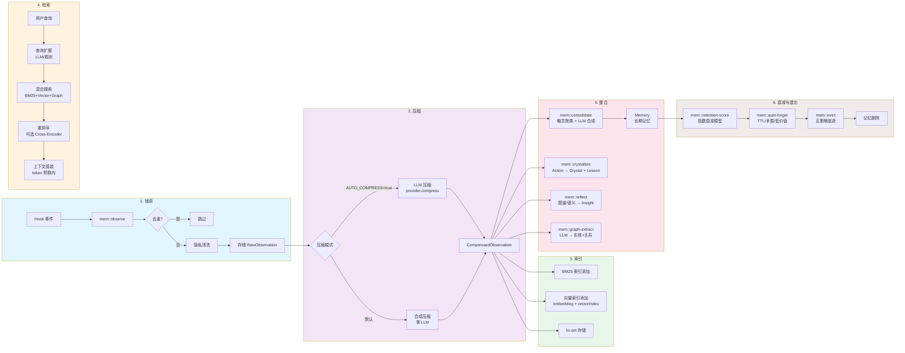
```mermaid
flowchart LR
    subgraph Capture["1. 捕获"]
        HOOK[Hook 事件] --> OBSERVE[mem::observe]
        OBSERVE --> DEDUP{去重?}
        DEDUP -->|是| SKIP[跳过]
        DEDUP -->|否| PRIVACY[隐私清洗]
        PRIVACY --> RAW[存储 RawObservation]
    end

    subgraph Compress["2. 压缩"]
        RAW --> COMPRESS_TYPE{压缩模式}
        COMPRESS_TYPE -->|AUTO_COMPRESS=true| LLM_COMP[LLM 压缩<br/>provider.compress]
        COMPRESS_TYPE -->|默认| SYNTH_COMP[合成压缩<br/>零 LLM]
        LLM_COMP --> COMPRESSED[CompressedObservation]
        SYNTH_COMP --> COMPRESSED
    end

    subgraph Index["3. 索引"]
        COMPRESSED --> BM25_ADD[BM25 索引添加]
        COMPRESSED --> VEC_ADD[向量索引添加<br/>embedding + vectorIndex]
        COMPRESSED --> KV_STORE[kv.set 存储]
    end

    subgraph Recall["4. 检索"]
        QUERY[用户查询] --> EXPAND[查询扩展<br/>LLM/规则]
        EXPAND --> HYBRID[混合搜索<br/>BM25+Vector+Graph]
        HYBRID --> RERANK[重排序<br/>可选 Cross-Encoder]
        RERANK --> CONTEXT[上下文组装<br/>token 预算内]
    end

    subgraph Consolidate["5. 整合"]
        COMPRESSED --> CONSOLIDATE[mem::consolidate<br/>概念聚类 + LLM 合成]
        CONSOLIDATE --> MEMORY[Memory<br/>长期记忆]
        COMPRESSED --> CRYSTALLIZE[mem::crystallize<br/>Action → Crystal + Lesson]
        COMPRESSED --> REFLECT[mem::reflect<br/>图谱/语义 → Insight]
        COMPRESSED --> GRAPH_EXT[mem::graph-extract<br/>LLM → 实体+关系]
    end

    subgraph Decay["6. 衰减与遗忘"]
        MEMORY --> RETENTION[mem::retention-score<br/>指数衰减模型]
        RETENTION --> AUTO_FORGET[mem::auto-forget<br/>TTL/矛盾/低价值]
        AUTO_FORGET --> EVICT[mem::evict<br/>五策略驱逐]
        EVICT --> GONE[记忆删除]
    end

    style Capture fill:#e1f5fe
    style Compress fill:#f3e5f5
    style Index fill:#e8f5e9
    style Recall fill:#fff3e0
    style Consolidate fill:#fce4ec
    style Decay fill:#efebe9
```

#### 2.2.2 观察到记忆的时序图

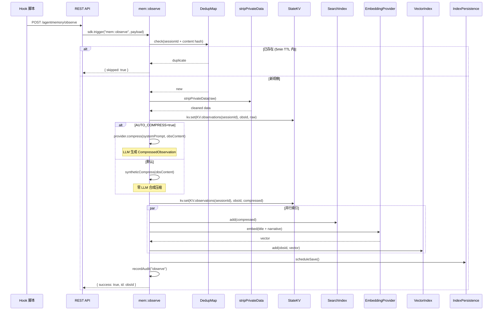
```mermaid
sequenceDiagram
    participant Hook as Hook 脚本
    participant REST as REST API
    participant Observe as mem::observe
    participant Dedup as DedupMap
    participant Privacy as stripPrivateData
    participant KV as StateKV
    participant BM25 as SearchIndex
    participant Emb as EmbeddingProvider
    participant Vec as VectorIndex
    participant Persist as IndexPersistence

    Hook->>REST: POST /agentmemory/observe
    REST->>Observe: sdk.trigger("mem::observe", payload)

    Observe->>Dedup: check(sessionId + content hash)
    alt 已存在 (5min TTL 内)
        Dedup-->>Observe: duplicate
        Observe-->>REST: { skipped: true }
    else 新观察
        Dedup-->>Observe: new

        Observe->>Privacy: stripPrivateData(raw)
        Privacy-->>Observe: cleaned data

        Observe->>KV: kv.set(KV.observations(sessionId), obsId, raw)

        alt AUTO_COMPRESS=true
            Observe->>Observe: provider.compress(systemPrompt, obsContent)
            Note over Observe: LLM 生成 CompressedObservation
        else 默认
            Observe->>Observe: syntheticCompress(obsContent)
            Note over Observe: 零 LLM 合成压缩
        end

        Observe->>KV: kv.set(KV.observations(sessionId), obsId, compressed)

        par 并行索引
            Observe->>BM25: add(compressed)
            Observe->>Emb: embed(title + narrative)
            Emb-->>Observe: vector
            Observe->>Vec: add(obsId, vector)
        end

        Observe->>Persist: scheduleSave()

        Observe->>Observe: recordAudit("observe")

        Observe-->>REST: { success: true, id: obsId }
    end
```

#### 2.2.3 整合管道数据流图

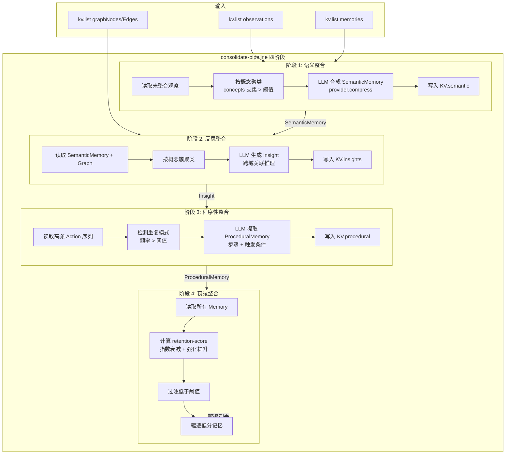
```mermaid
flowchart TD
    subgraph Input["输入"]
        OBS[kv.list observations]
        MEM[kv.list memories]
        GRAPH[kv.list graphNodes/Edges]
    end

    subgraph Pipeline["consolidate-pipeline 四阶段"]

        subgraph Stage1["阶段 1: 语义整合"]
            S1_READ[读取未整合观察]
            S1_CLUSTER[按概念聚类<br/>concepts 交集 > 阈值]
            S1_LLM[LLM 合成 SemanticMemory<br/>provider.compress]
            S1_WRITE[写入 KV.semantic]
            S1_READ --> S1_CLUSTER --> S1_LLM --> S1_WRITE
        end

        subgraph Stage2["阶段 2: 反思整合"]
            S2_READ[读取 SemanticMemory + Graph]
            S2_CLUSTER[按概念簇聚类]
            S2_LLM[LLM 生成 Insight<br/>跨域关联推理]
            S2_WRITE[写入 KV.insights]
            S2_READ --> S2_CLUSTER --> S2_LLM --> S2_WRITE
        end

        subgraph Stage3["阶段 3: 程序性整合"]
            S3_READ[读取高频 Action 序列]
            S3_PATTERN[检测重复模式<br/>频率 > 阈值]
            S3_LLM[LLM 提取 ProceduralMemory<br/>步骤 + 触发条件]
            S3_WRITE[写入 KV.procedural]
            S3_READ --> S3_PATTERN --> S3_LLM --> S3_WRITE
        end

        subgraph Stage4["阶段 4: 衰减整合"]
            S4_READ[读取所有 Memory]
            S4_SCORE[计算 retention-score<br/>指数衰减 + 强化提升]
            S4_FILTER[过滤低于阈值]
            S4_EVICT[驱逐低分记忆]
            S4_READ --> S4_SCORE --> S4_FILTER --> S4_EVICT
        end
    end

    OBS --> Stage1
    MEM --> Stage1
    GRAPH --> Stage2

    Stage1 -->|SemanticMemory| Stage2
    Stage2 -->|Insight| Stage3
    Stage3 -->|ProceduralMemory| Stage4
    Stage4 -->|驱逐列表| S4_EVICT
```

---

### 2.3 MCP 与 REST API 层

#### 2.3.1 API 层架构图

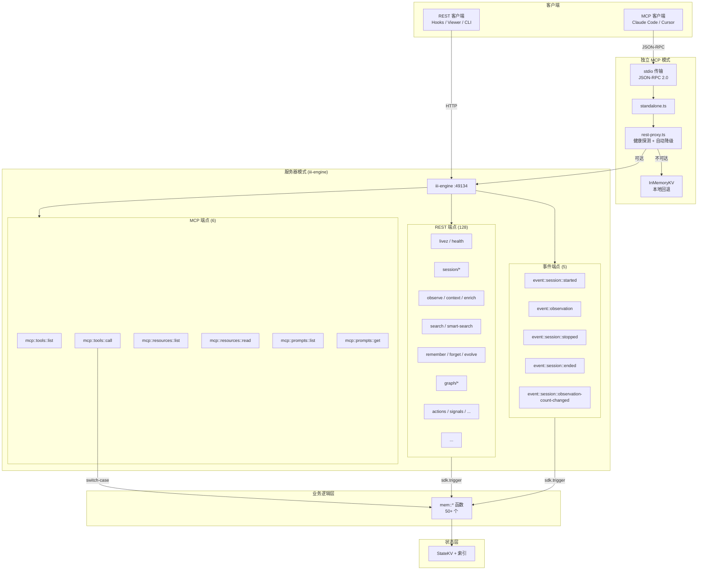
```mermaid
flowchart TB
    subgraph Clients["客户端"]
        MCP_C[MCP 客户端<br/>Claude Code / Cursor]
        REST_C[REST 客户端<br/>Hooks / Viewer / CLI]
    end

    subgraph Standalone["独立 MCP 模式"]
        STDIO[stdio 传输<br/>JSON-RPC 2.0]
        STANDALONE[standalone.ts]
        PROXY[rest-proxy.ts<br/>健康探测 + 自动降级]
        LOCAL_KV[InMemoryKV<br/>本地回退]
    end

    subgraph Server["服务器模式 (iii-engine)"]
        ENGINE[iii-engine :49134]

        subgraph MCP_Endpoints["MCP 端点 (6)"]
            MCP_TL[mcp::tools::list]
            MCP_TC[mcp::tools::call]
            MCP_RL[mcp::resources::list]
            MCP_RR[mcp::resources::read]
            MPL[mcp::prompts::list]
            MPG[mcp::prompts::get]
        end

        subgraph REST_Endpoints["REST 端点 (128)"]
            R_LIVE[livez / health]
            R_SESSION[session/*]
            R_OBS[observe / context / enrich]
            R_SEARCH[search / smart-search]
            R_MEM[remember / forget / evolve]
            R_GRAPH[graph/*]
            R_ORCH[actions / signals / ...]
            R_MORE[...]
        end

        subgraph Event_Endpoints["事件端点 (5)"]
            E_START[event::session::started]
            E_OBS[event::observation]
            E_STOP[event::session::stopped]
            E_END[event::session::ended]
            E_COUNT[event::session::observation-count-changed]
        end
    end

    subgraph Business["业务逻辑层"]
        MEM_FUNCS[mem::* 函数<br/>50+ 个]
    end

    subgraph State["状态层"]
        STATE_KV[StateKV + 索引]
    end

    MCP_C -->|JSON-RPC| STDIO
    STDIO --> STANDALONE
    STANDALONE --> PROXY
    PROXY -->|可达| ENGINE
    PROXY -->|不可达| LOCAL_KV
    REST_C -->|HTTP| ENGINE

    ENGINE --> MCP_Endpoints & REST_Endpoints & Event_Endpoints
    MCP_TC -->|switch-case| MEM_FUNCS
    REST_Endpoints -->|sdk.trigger| MEM_FUNCS
    Event_Endpoints -->|sdk.trigger| MEM_FUNCS
    MEM_FUNCS --> STATE_KV
```

#### 2.3.2 MCP 工具调用时序图

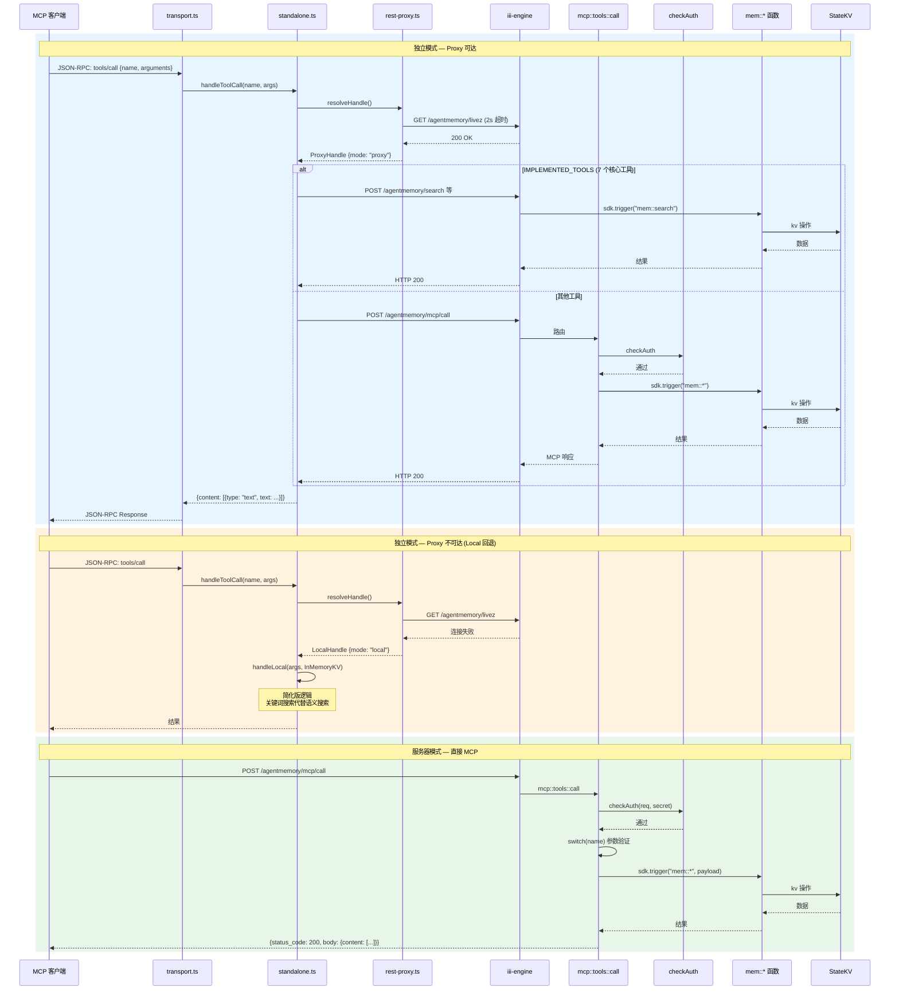
```mermaid
sequenceDiagram
    participant Client as MCP 客户端
    participant Transport as transport.ts
    participant Standalone as standalone.ts
    participant Proxy as rest-proxy.ts
    participant Engine as iii-engine
    participant McpCall as mcp::tools::call
    participant Auth as checkAuth
    participant MemFunc as mem::* 函数
    participant KV as StateKV

    rect rgb(230, 245, 255)
        Note over Client,KV: 独立模式 — Proxy 可达
        Client->>Transport: JSON-RPC: tools/call {name, arguments}
        Transport->>Standalone: handleToolCall(name, args)
        Standalone->>Proxy: resolveHandle()
        Proxy->>Engine: GET /agentmemory/livez (2s 超时)
        Engine-->>Proxy: 200 OK
        Proxy-->>Standalone: ProxyHandle {mode: "proxy"}

        alt IMPLEMENTED_TOOLS (7 个核心工具)
            Standalone->>Engine: POST /agentmemory/search 等
            Engine->>MemFunc: sdk.trigger("mem::search")
            MemFunc->>KV: kv 操作
            KV-->>MemFunc: 数据
            MemFunc-->>Engine: 结果
            Engine-->>Standalone: HTTP 200
        else 其他工具
            Standalone->>Engine: POST /agentmemory/mcp/call
            Engine->>McpCall: 路由
            McpCall->>Auth: checkAuth
            Auth-->>McpCall: 通过
            McpCall->>MemFunc: sdk.trigger("mem::*")
            MemFunc->>KV: kv 操作
            KV-->>MemFunc: 数据
            MemFunc-->>McpCall: 结果
            McpCall-->>Engine: MCP 响应
            Engine-->>Standalone: HTTP 200
        end

        Standalone-->>Transport: {content: [{type: "text", text: ...}]}
        Transport-->>Client: JSON-RPC Response
    end

    rect rgb(255, 243, 224)
        Note over Client,KV: 独立模式 — Proxy 不可达 (Local 回退)
        Client->>Transport: JSON-RPC: tools/call
        Transport->>Standalone: handleToolCall(name, args)
        Standalone->>Proxy: resolveHandle()
        Proxy->>Engine: GET /agentmemory/livez
        Engine-->>Proxy: 连接失败
        Proxy-->>Standalone: LocalHandle {mode: "local"}
        Standalone->>Standalone: handleLocal(args, InMemoryKV)
        Note over Standalone: 简化版逻辑<br/>关键词搜索代替语义搜索
        Standalone-->>Client: 结果
    end

    rect rgb(232, 245, 233)
        Note over Client,KV: 服务器模式 — 直接 MCP
        Client->>Engine: POST /agentmemory/mcp/call
        Engine->>McpCall: mcp::tools::call
        McpCall->>Auth: checkAuth(req, secret)
        Auth-->>McpCall: 通过
        McpCall->>McpCall: switch(name) 参数验证
        McpCall->>MemFunc: sdk.trigger("mem::*", payload)
        MemFunc->>KV: kv 操作
        KV-->>MemFunc: 数据
        MemFunc-->>McpCall: 结果
        McpCall-->>Client: {status_code: 200, body: {content: [...]}}
    end
```

#### 2.3.3 REST 请求处理流程图

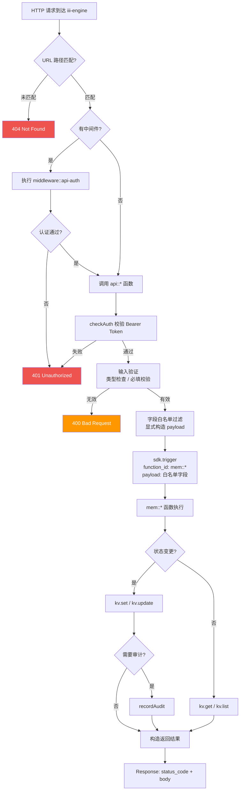
```mermaid
flowchart TD
    A[HTTP 请求到达 iii-engine] --> B{URL 路径匹配?}
    B -->|未匹配| C[404 Not Found]
    B -->|匹配| D{有中间件?}

    D -->|是| E[执行 middleware::api-auth]
    E --> F{认证通过?}
    F -->|否| G[401 Unauthorized]
    F -->|是| H[调用 api::* 函数]

    D -->|否| H

    H --> I[checkAuth 校验 Bearer Token]
    I -->|失败| G
    I -->|通过| J[输入验证<br/>类型检查 / 必填校验]
    J -->|无效| K[400 Bad Request]
    J -->|有效| L[字段白名单过滤<br/>显式构造 payload]
    L --> M[sdk.trigger<br/>function_id: mem::*<br/>payload: 白名单字段]

    M --> N[mem::* 函数执行]
    N --> O{状态变更?}
    O -->|是| P[kv.set / kv.update]
    O -->|否| Q[kv.get / kv.list]

    P --> R{需要审计?}
    R -->|是| S[recordAudit]
    R -->|否| T[构造返回结果]
    S --> T
    Q --> T

    T --> U[Response: status_code + body]

    style G fill:#ef5350,color:#fff
    style K fill:#ff9800,color:#fff
    style C fill:#ef5350,color:#fff
```

---

### 2.4 Hooks 与集成层

#### 2.4.1 Hook 生命周期时序图

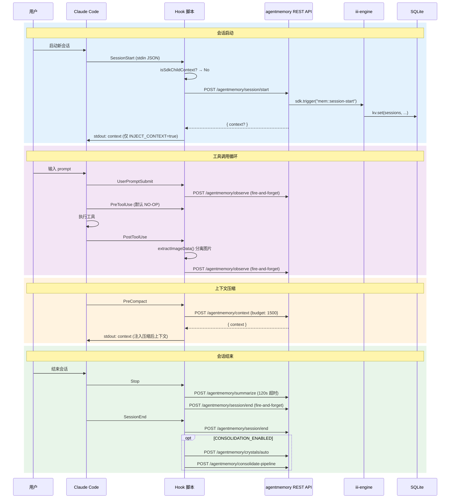
```mermaid
sequenceDiagram
    participant User as 用户
    participant CC as Claude Code
    participant Hook as Hook 脚本
    participant REST as agentmemory REST API
    participant Engine as iii-engine
    participant DB as SQLite

    rect rgb(227, 242, 253)
        Note over User,DB: 会话启动
        User->>CC: 启动新会话
        CC->>Hook: SessionStart (stdin JSON)
        Hook->>Hook: isSdkChildContext? → No
        Hook->>REST: POST /agentmemory/session/start
        REST->>Engine: sdk.trigger("mem::session-start")
        Engine->>DB: kv.set(sessions, ...)
        REST-->>Hook: { context? }
        Hook->>CC: stdout: context (仅 INJECT_CONTEXT=true)
    end

    rect rgb(243, 229, 245)
        Note over User,DB: 工具调用循环
        User->>CC: 输入 prompt
        CC->>Hook: UserPromptSubmit
        Hook->>REST: POST /agentmemory/observe (fire-and-forget)

        CC->>Hook: PreToolUse (默认 NO-OP)
        CC->>CC: 执行工具
        CC->>Hook: PostToolUse
        Hook->>Hook: extractImageData() 分离图片
        Hook->>REST: POST /agentmemory/observe (fire-and-forget)
    end

    rect rgb(255, 243, 224)
        Note over User,DB: 上下文压缩
        CC->>Hook: PreCompact
        Hook->>REST: POST /agentmemory/context {budget: 1500}
        REST-->>Hook: { context }
        Hook->>CC: stdout: context (注入压缩后上下文)
    end

    rect rgb(232, 245, 233)
        Note over User,DB: 会话结束
        User->>CC: 结束会话
        CC->>Hook: Stop
        Hook->>REST: POST /agentmemory/summarize (120s 超时)
        Hook->>REST: POST /agentmemory/session/end (fire-and-forget)

        CC->>Hook: SessionEnd
        Hook->>REST: POST /agentmemory/session/end
        opt CONSOLIDATION_ENABLED
            Hook->>REST: POST /agentmemory/crystals/auto
            Hook->>REST: POST /agentmemory/consolidate-pipeline
        end
    end
```

#### 2.4.2 Agent 连接器架构图

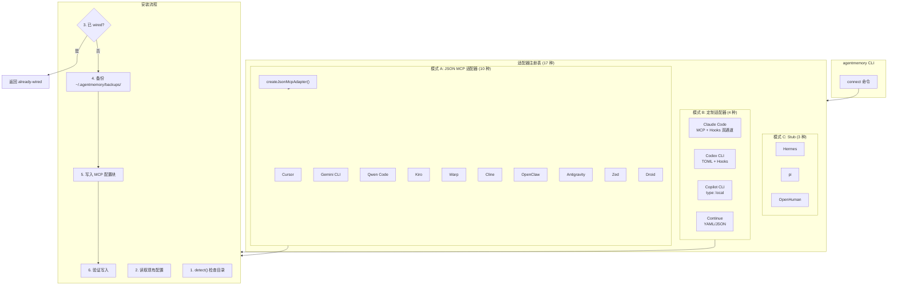
```mermaid
flowchart TB
    subgraph CLI["agentmemory CLI"]
        CMD["connect 命令"]
    end

    subgraph Adapters["适配器注册表 (17 种)"]

        subgraph ModeA["模式 A: JSON MCP 适配器 (10 种)"]
            JMA["createJsonMcpAdapter()"]
            CUR["Cursor"]
            GEM["Gemini CLI"]
            QWE["Qwen Code"]
            KIR["Kiro"]
            WAR["Warp"]
            CLI2["Cline"]
            OCL["OpenClaw"]
            ANT["Antigravity"]
            ZED["Zed"]
            DRO["Droid"]
        end

        subgraph ModeB["模式 B: 定制适配器 (4 种)"]
            CC["Claude Code<br/>MCP + Hooks 双通道"]
            CODEX["Codex CLI<br/>TOML + Hooks"]
            COPILOT["Copilot CLI<br/>type: local"]
            CONT["Continue<br/>YAML/JSON"]
        end

        subgraph ModeC["模式 C: Stub (3 种)"]
            HER["Hermes"]
            PI["pi"]
            OHU["OpenHuman"]
        end
    end

    subgraph Install["安装流程"]
        DETECT["1. detect() 检查目录"]
        READ["2. 读取现有配置"]
        CHECK{"3. 已 wired?"}
        BACKUP["4. 备份 ~/.agentmemory/backups/"]
        WRITE["5. 写入 MCP 配置块"]
        VERIFY["6. 验证写入"]
    end

    CMD --> Adapters
    JMA --> ModeA
    ModeA & ModeB --> Install

    CHECK -->|是| SKIP["返回 already-wired"]
    CHECK -->|否| BACKUP --> WRITE --> VERIFY
```

#### 2.4.3 上下文注入流程图

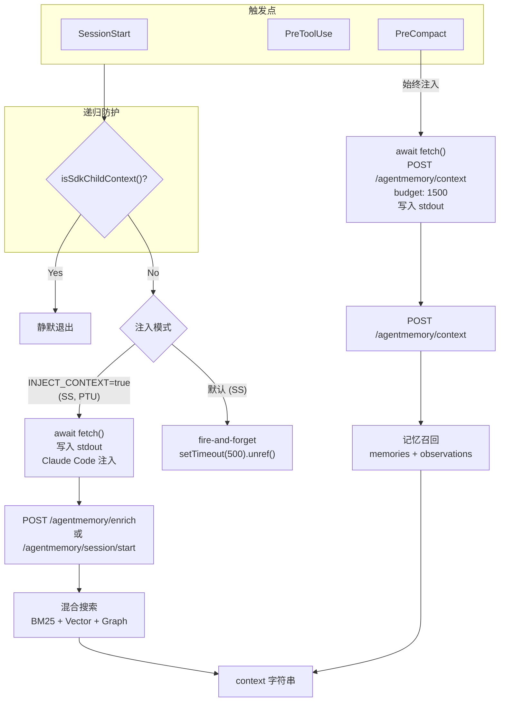
```mermaid
flowchart TB
    subgraph Triggers["触发点"]
        SS["SessionStart"]
        PTU["PreToolUse"]
        PC["PreCompact"]
    end

    subgraph Guard["递归防护"]
        SDK_CHECK{"isSdkChildContext()?"}
    end

    Triggers --> SDK_CHECK
    SDK_CHECK -->|Yes| SKIP["静默退出"]
    SDK_CHECK -->|No| MODE{"注入模式"}

    MODE -->|"INJECT_CONTEXT=true<br/>(SS, PTU)"| INJECT_PATH["await fetch()<br/>写入 stdout<br/>Claude Code 注入"]
    MODE -->|"默认 (SS)"| TELEMETRY["fire-and-forget<br/>setTimeout(500).unref()"]
    PC -->|"始终注入"| COMPACT_PATH["await fetch()<br/>POST /agentmemory/context<br/>budget: 1500<br/>写入 stdout"]

    INJECT_PATH --> API_ENRICH["POST /agentmemory/enrich<br/>或 /agentmemory/session/start"]
    COMPACT_PATH --> API_CONTEXT["POST /agentmemory/context"]

    API_ENRICH --> SEARCH["混合搜索<br/>BM25 + Vector + Graph"]
    API_CONTEXT --> RECALL["记忆召回<br/>memories + observations"]

    SEARCH --> CTX["context 字符串"]
    RECALL --> CTX
```

---

### 2.5 Provider 与知识图谱层

#### 2.5.1 Provider 降级链时序图

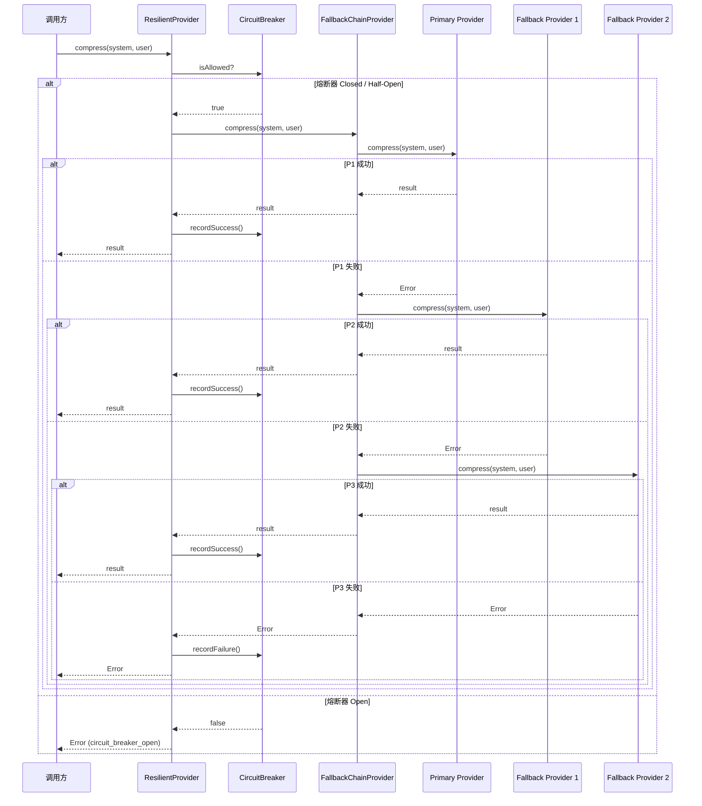
```mermaid
sequenceDiagram
    participant Caller as 调用方
    participant RP as ResilientProvider
    participant CB as CircuitBreaker
    participant FC as FallbackChainProvider
    participant P1 as Primary Provider
    participant P2 as Fallback Provider 1
    participant P3 as Fallback Provider 2

    Caller->>RP: compress(system, user)
    RP->>CB: isAllowed?

    alt 熔断器 Closed / Half-Open
        CB-->>RP: true
        RP->>FC: compress(system, user)

        FC->>P1: compress(system, user)
        alt P1 成功
            P1-->>FC: result
            FC-->>RP: result
            RP->>CB: recordSuccess()
            RP-->>Caller: result
        else P1 失败
            P1-->>FC: Error
            FC->>P2: compress(system, user)
            alt P2 成功
                P2-->>FC: result
                FC-->>RP: result
                RP->>CB: recordSuccess()
                RP-->>Caller: result
            else P2 失败
                P2-->>FC: Error
                FC->>P3: compress(system, user)
                alt P3 成功
                    P3-->>FC: result
                    FC-->>RP: result
                    RP->>CB: recordSuccess()
                    RP-->>Caller: result
                else P3 失败
                    P3-->>FC: Error
                    FC-->>RP: Error
                    RP->>CB: recordFailure()
                    RP-->>Caller: Error
                end
            end
        end
    else 熔断器 Open
        CB-->>RP: false
        RP-->>Caller: Error (circuit_breaker_open)
    end
```

#### 2.5.2 熔断器状态机

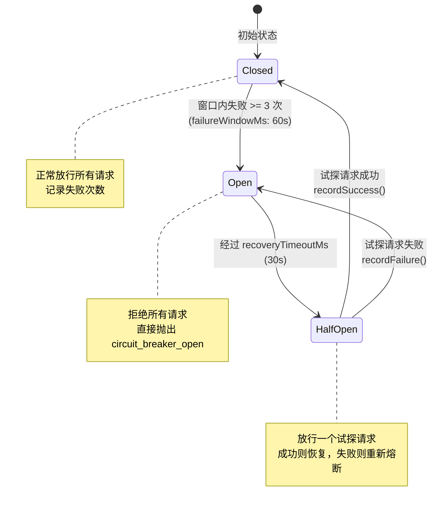
```mermaid
stateDiagram-v2
    [*] --> Closed: 初始状态

    Closed --> Open: 窗口内失败 >= 3 次<br/>(failureWindowMs: 60s)
    Open --> HalfOpen: 经过 recoveryTimeoutMs (30s)

    HalfOpen --> Closed: 试探请求成功<br/>recordSuccess()
    HalfOpen --> Open: 试探请求失败<br/>recordFailure()

    note right of Closed
        正常放行所有请求
        记录失败次数
    end note

    note right of Open
        拒绝所有请求
        直接抛出 circuit_breaker_open
    end note

    note right of HalfOpen
        放行一个试探请求
        成功则恢复，失败则重新熔断
    end note
```

#### 2.5.3 知识图谱构建流程图

```mermaid
flowchart TD
    A[CompressedObservation] --> B[格式化观察内容]
    B --> C[LLM Provider.compress<br/>GRAPH_EXTRACTION_SYSTEM 提示词]
    C --> D{LLM 成功?}
    D -->|否| E[返回错误]
    D -->|是| F[parseGraphXml<br/>解析 XML 响应]

    F --> G[提取 entity 节点]
    F --> H[提取 relationship 边]

    G --> I{graphNameIndex<br/>type|name 已存在?}
    I -->|是| J[mergeNode<br/>合并属性 + 观察ID]
    I -->|否| K[新建节点<br/>写入 graphNodes + nameIndex]

    H --> L{graphEdgeKey<br/>src|tgt|type 已存在?}
    L -->|是| M[mergeEdge<br/>合并观察ID]
    L -->|否| N[新建边<br/>写入 graphEdges + edgeKey]

    N --> O[applyDegreeDelta<br/>增量更新端点度数]
    O --> P{进入 top-500?}
    P -->|是| Q[更新 snapshot.topNodes/Edges/Degrees]
    P -->|否| R[仅更新 nodeDegree]

    J --> S[更新 snapshot]
    K --> S
    M --> S
    Q --> S
    R --> S

    S --> T[kv.set graphSnapshot]
    T --> U[recordAudit]
    U --> V[返回结果]
```

#### 2.5.4 图谱检索与查询扩展流程图

```mermaid
flowchart TD
    A[用户查询] --> B{查询类型}

    B -->|直接图谱查询| C[mem::graph-query]
    B -->|语义检索| D[mem::expand-query]

    D --> D1[LLM 生成语义改写<br/>reformulations + entities]
    D1 --> D2[extractEntitiesFromQuery<br/>规则提取: 引号短语 + 大写词]

    C --> C1{查询模式}
    C1 -->|空查询/nodeType| C2[读取快照<br/>O(1) 复杂度]
    C1 -->|文本查询| C3[枚举节点 + 子串匹配<br/>6s 超时保护]
    C1 -->|startNodeId| C4[BFS 遍历<br/>maxDepth <= 5]

    C3 -->|超时| C5[回退快照]
    C3 -->|正常| C6[分页返回]
    C4 --> C6
    C2 --> C7[返回结果]
    C5 --> C7

    D2 --> E[GraphRetrieval.searchByEntities]
    E --> E1[模糊匹配起始节点]
    E1 --> E2[Dijkstra 加权最短路径]
    E2 --> E3[收集 sourceObservationIds]
    E3 --> E4[评分: avgWeight * 1/pathLength]

    D2 --> F[GraphRetrieval.expandFromChunks]
    F --> F1[从 obsIds 反查关联节点]
    F1 --> F2[Dijkstra 遍历发现新节点]
    F2 --> F3[评分: 0.5 * 1/(pathLength+1)]

    C7 --> G{需要时序信息?}
    G -->|是| H[temporalQuery<br/>按 asOf 时间过滤边]
    G -->|否| I[最终结果集]

    E4 --> I
    F3 --> I
    H --> I
```

---

## 3. 关键设计决策

### 3.1 双入口、单执行架构

MCP 工具和 REST 端点共享同一业务逻辑层（`mem::*` 函数），通过 `sdk.trigger()` 统一调用。这确保了：
- 行为一致性：无论通过哪种入口访问，业务逻辑完全相同
- 单一维护点：业务逻辑变更只需修改 `mem::*` 函数
- 灵活路由：MCP 和 REST 可以独立演进

### 3.2 零 LLM 默认模式

自 v0.8.8 起，默认使用合成压缩（synthetic compression）而非 LLM 压缩：
- **原因**: 每次 PostToolUse 观察发送到 LLM 会消耗大量 API token（#138）
- **实现**: `compressSynthetic()` 从观察中提取结构化字段，无需 LLM 调用
- **权衡**: 压缩质量略低，但零 token 消耗

### 3.3 上下文注入默认关闭

自 v0.8.10 起，PreToolUse 和 SessionStart 的上下文注入默认关闭（#143）：
- **原因**: 每次工具调用注入约 4000 字符会快速耗尽 Claude Pro 配额
- **替代**: Hook 仍捕获观察数据，但不写入 stdout
- **opt-in**: `AGENTMEMORY_INJECT_CONTEXT=true` 显式启用

### 3.4 图快照优化 (#814)

大语料库（>25K 节点）下全量枚举会超出 iii-engine 调用超时：
- **方案**: 维护 top-500 节点快照，增量更新
- **索引**: nameIndex / edgeKey / nodeDegree 三个 O(1) 查找索引
- **回退**: 文本查询超时（6s）自动回退到快照

### 3.5 Hook 递归防护 (#149)

Agent SDK 子会话中的 Hook 会触发无限递归：
- **检测**: `isSdkChildContext()` 检查环境变量和 entrypoint
- **阻断**: SDK 子会话中的 Hook 静默退出
- **标记**: `AGENTMEMORY_SDK_CHILD=1` 环境变量

### 3.6 向量维度守卫

Embedding Provider 切换后，旧向量维度不匹配会导致搜索静默失败：
- **检测**: `validateDimensions()` 校验每个向量维度
- **策略**: 不匹配时拒绝加载，或 `AGENTMEMORY_DROP_STALE_INDEX=true` 丢弃旧索引

---

## 4. 数据流总览

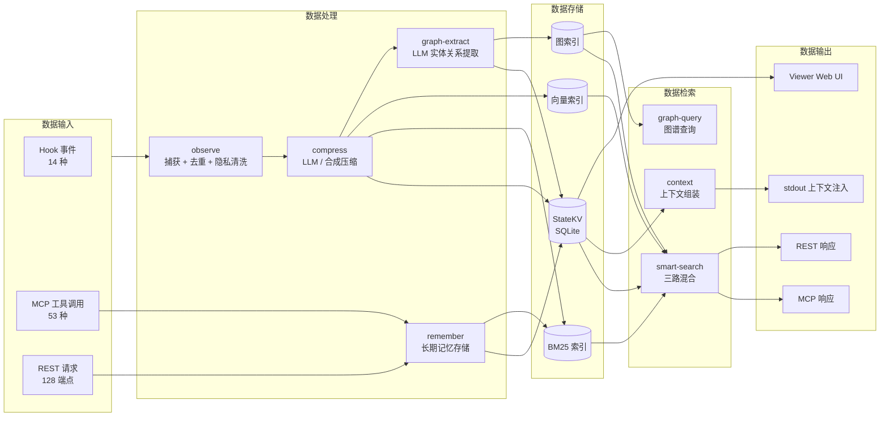
```mermaid
flowchart LR
    subgraph Input["数据输入"]
        HOOK_IN[Hook 事件<br/>14 种]
        MCP_IN[MCP 工具调用<br/>53 种]
        REST_IN[REST 请求<br/>128 端点]
    end

    subgraph Processing["数据处理"]
        OBSERVE[observe<br/>捕获 + 去重 + 隐私清洗]
        COMPRESS[compress<br/>LLM / 合成压缩]
        REMEMBER[remember<br/>长期记忆存储]
        GRAPH_EXT[graph-extract<br/>LLM 实体关系提取]
    end

    subgraph Storage["数据存储"]
        KV[(StateKV<br/>SQLite)]
        BM25[(BM25 索引)]
        VEC[(向量索引)]
        GRAPH[(图索引)]
    end

    subgraph Retrieval["数据检索"]
        SEARCH[smart-search<br/>三路混合]
        CONTEXT[context<br/>上下文组装]
        GRAPH_Q[graph-query<br/>图谱查询]
    end

    subgraph Output["数据输出"]
        MCP_OUT[MCP 响应]
        REST_OUT[REST 响应]
        STDOUT[stdout 上下文注入]
        VIEWER_OUT[Viewer Web UI]
    end

    Input --> OBSERVE
    OBSERVE --> COMPRESS
    COMPRESS --> KV & BM25 & VEC
    MCP_IN --> REMEMBER
    REST_IN --> REMEMBER
    REMEMBER --> KV & BM25
    COMPRESS --> GRAPH_EXT
    GRAPH_EXT --> KV & GRAPH

    KV & BM25 & VEC & GRAPH --> SEARCH
    KV --> CONTEXT
    GRAPH --> GRAPH_Q

    SEARCH --> MCP_OUT & REST_OUT
    CONTEXT --> STDOUT
    KV --> VIEWER_OUT
```

---

## 5. 模块依赖关系

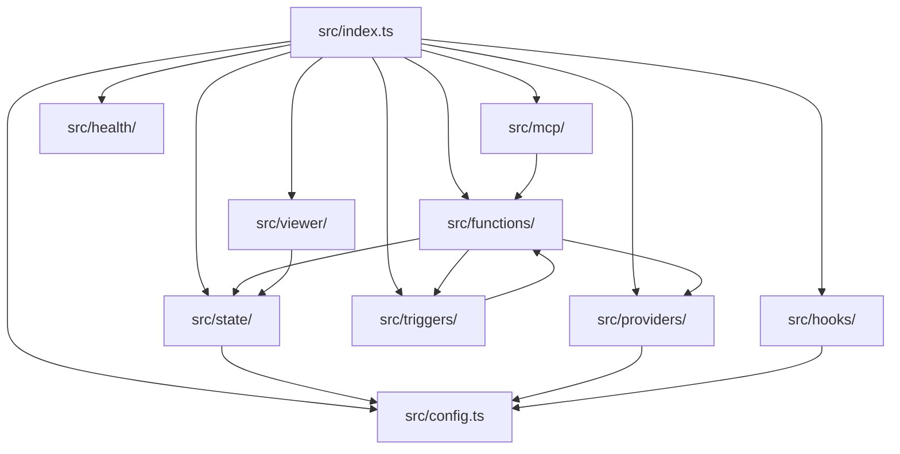
```mermaid
flowchart TD
    INDEX[src/index.ts] --> CONFIG[src/config.ts]
    INDEX --> PROVIDERS[src/providers/]
    INDEX --> STATE[src/state/]
    INDEX --> FUNCTIONS[src/functions/]
    INDEX --> TRIGGERS[src/triggers/]
    INDEX --> MCP[src/mcp/]
    INDEX --> HOOKS[src/hooks/]
    INDEX --> VIEWER[src/viewer/]
    INDEX --> HEALTH[src/health/]

    FUNCTIONS --> STATE
    FUNCTIONS --> PROVIDERS
    FUNCTIONS --> TRIGGERS

    TRIGGERS --> FUNCTIONS
    MCP --> FUNCTIONS

    STATE --> CONFIG

    PROVIDERS --> CONFIG

    HOOKS --> CONFIG

    VIEWER --> STATE
```

---

## 6. 目录结构映射

```
src/
├── index.ts              # Worker 入口，注册所有函数/触发器
├── config.ts             # 配置加载，环境变量解析
├── types.ts              # 全局类型定义
├── auth.ts               # 认证（timingSafeCompare, CSP）
├── logger.ts             # 日志
├── version.ts            # 版本常量
│
├── state/                # 存储层
│   ├── kv.ts             # StateKV（iii-sdk KV 封装）
│   ├── schema.ts         # KV scope 定义 + ID 生成
│   ├── search-index.ts   # BM25 全文索引
│   ├── vector-index.ts   # 向量索引（余弦相似度）
│   ├── hybrid-search.ts  # 混合搜索（BM25+Vector+Graph RRF 融合）
│   ├── index-persistence.ts  # 索引持久化（分片 + 防抖）
│   ├── reranker.ts       # Cross-Encoder 重排序
│   ├── keyed-mutex.ts    # 互斥锁
│   ├── stemmer.ts        # Porter Stemmer
│   ├── cjk-segmenter.ts  # CJK 分词
│   ├── synonyms.ts       # 同义词扩展
│   └── memory-utils.ts   # 内存工具
│
├── functions/            # 业务逻辑层（50+ 函数）
│   ├── observe.ts        # 观察捕获
│   ├── compress.ts       # LLM 压缩
│   ├── compress-synthetic.ts  # 零 LLM 合成压缩
│   ├── remember.ts       # 长期记忆
│   ├── search.ts         # BM25/向量搜索
│   ├── smart-search.ts   # 混合搜索
│   ├── context.ts        # 上下文组装
│   ├── consolidate.ts    # 概念整合
│   ├── consolidation-pipeline.ts  # 四阶段整合管道
│   ├── crystallize.ts    # Action 结晶化
│   ├── reflect.ts        # 反思 → Insight
│   ├── graph.ts          # 知识图谱构建
│   ├── graph-retrieval.ts  # 图谱检索（Dijkstra）
│   ├── temporal-graph.ts # 时序图谱
│   ├── query-expansion.ts  # 查询扩展
│   ├── retention.ts      # 保留评分
│   ├── auto-forget.ts    # 自动遗忘
│   ├── evict.ts          # 驱逐
│   ├── dedup.ts          # 去重
│   └── ...               # 编排、诊断、导出等
│
├── mcp/                  # MCP 协议层
│   ├── server.ts         # MCP 端点注册（6 个函数）
│   ├── tools-registry.ts # 工具定义（53 个）
│   ├── standalone.ts     # 独立 MCP 模式
│   ├── transport.ts      # stdio 传输（JSON-RPC 2.0）
│   ├── rest-proxy.ts     # REST 代理 + 自动降级
│   └── in-memory-kv.ts   # 内存 KV（本地回退）
│
├── triggers/             # 触发器层
│   ├── api.ts            # REST API（128 端点）
│   └── events.ts         # 事件触发器（5 种）
│
├── hooks/                # Hook 脚本
│   ├── session-start.ts  # 会话启动
│   ├── pre-tool-use.ts   # 工具调用前
│   ├── post-tool-use.ts  # 工具调用后
│   ├── pre-compact.ts    # 压缩前
│   ├── stop.ts           # 会话停止
│   ├── session-end.ts    # 会话结束
│   ├── sdk-guard.ts      # 递归防护
│   └── ...               # 其他 7 种 Hook
│
├── providers/            # LLM/Embedding Provider
│   ├── index.ts          # 工厂 + 降级链
│   ├── resilient.ts      # 弹性 Provider（熔断器装饰器）
│   ├── circuit-breaker.ts  # 熔断器
│   ├── fallback-chain.ts   # 降级链
│   ├── anthropic.ts      # Anthropic
│   ├── openai.ts         # OpenAI
│   ├── openrouter.ts     # OpenRouter (+ Gemini)
│   ├── minimax.ts        # MiniMax
│   ├── noop.ts           # No-op
│   ├── agent-sdk.ts      # Claude Agent SDK
│   └── embedding/        # Embedding Provider
│       ├── index.ts      # 工厂 + 维度守卫
│       ├── openai.ts     # OpenAI Embedding
│       ├── local.ts      # 本地 Xenova
│       └── ...           # Gemini/Voyage/Cohere/CLIP
│
├── prompts/              # LLM 提示词模板
├── cli/                  # CLI 工具
│   └── connect/          # Agent 适配器（17 种）
├── viewer/               # Web Viewer
├── health/               # 健康监控
├── eval/                 # 评估框架
└── telemetry/            # OpenTelemetry 集成
```
