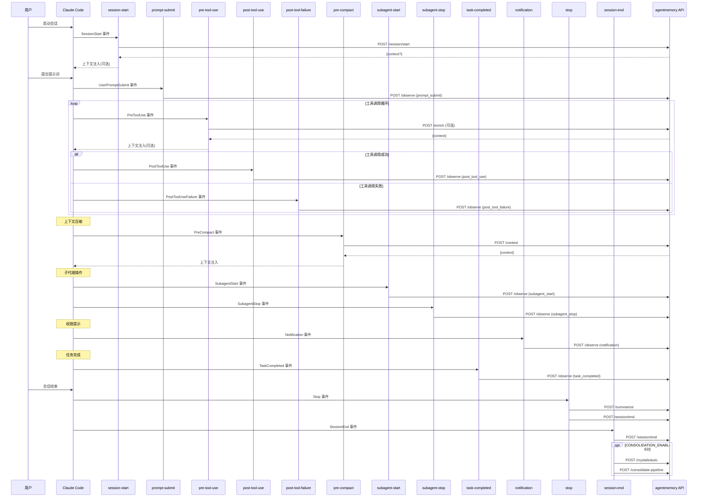
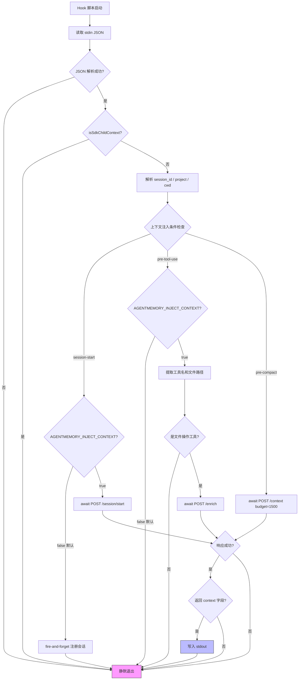
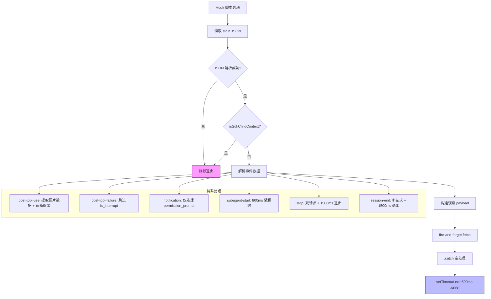
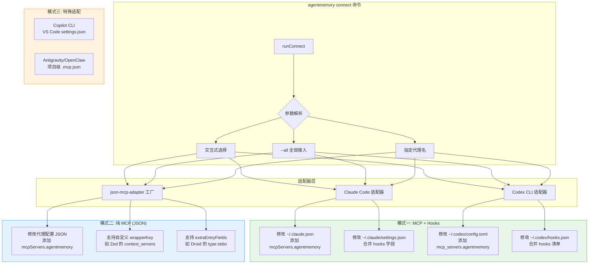
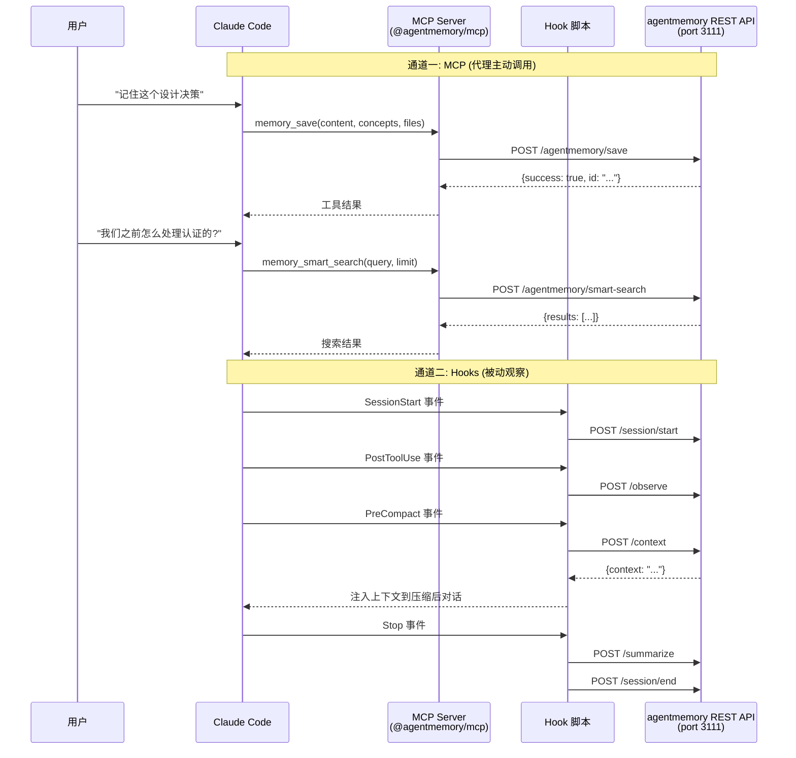
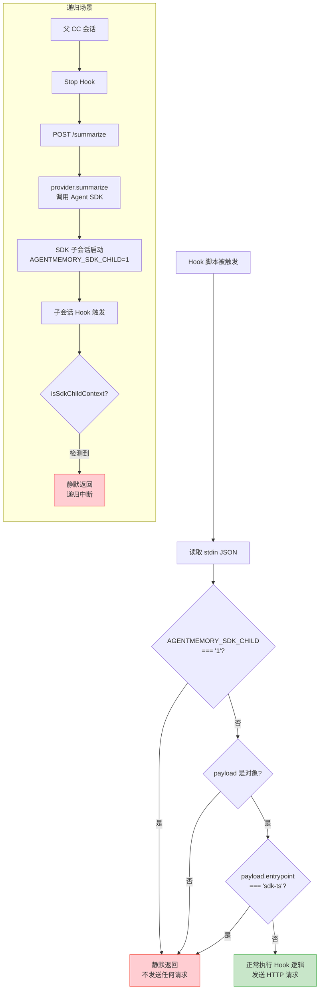
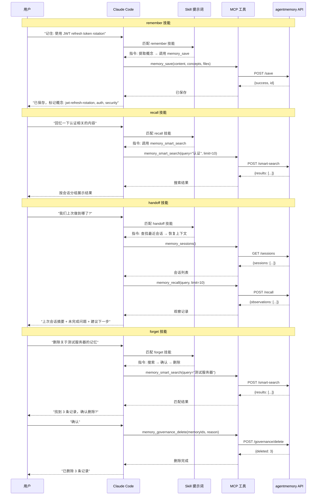

# Hooks 与集成层模块分析

## 1. 模块概述

agentmemory 的 Hooks 与集成层是连接 AI 编码代理（如 Claude Code、Codex CLI、Cursor 等）与 agentmemory 持久化记忆服务的桥梁。该层由三个核心子系统组成：

- **Hook 脚本**：独立 Node.js 脚本，由宿主代理在特定生命周期事件中触发，通过 HTTP REST API 与 agentmemory 服务通信
- **CLI 连接器**：`agentmemory connect` 命令的实现，自动将 agentmemory 接入各种 AI 代理的配置文件
- **Skills 定义**：Claude Code 插件技能描述文件，指导代理何时及如何调用 agentmemory 的 MCP 工具

### 架构定位

```
┌─────────────────────────────────────────────────────────┐
│                    AI 编码代理                           │
│  (Claude Code / Codex / Cursor / Gemini CLI / ...)      │
│                                                         │
│  ┌──────────┐  ┌──────────────┐  ┌──────────────────┐  │
│  │ MCP 工具  │  │ Hook 脚本触发 │  │ Skills 技能提示  │  │
│  └────┬─────┘  └──────┬───────┘  └────────┬─────────┘  │
└───────┼───────────────┼───────────────────┼─────────────┘
        │               │                   │
        │ stdio MCP     │ HTTP REST         │ 提示词注入
        ▼               ▼                   ▼
┌─────────────────────────────────────────────────────────┐
│              agentmemory 服务 (port 3111)                │
│         REST API / MCP Server / iii-engine              │
└─────────────────────────────────────────────────────────┘
```

### 设计原则

1. **零阻塞**：Hook 脚本绝不能阻塞宿主代理的执行流——上下文注入型 Hook 使用 `AbortSignal.timeout` 限制等待时间，纯遥测型 Hook 使用 fire-and-forget + `setTimeout.unref()` 立即退出
2. **自包含**：每个 Hook 脚本编译为独立 `.mjs` 文件，无外部依赖（iii-sdk 等通过 HTTP 间接调用）
3. **递归防护**：所有 Hook 内联 `isSdkChildContext()` 检查，防止 SDK 子会话中的无限递归
4. **优雅降级**：服务不可达时静默失败，不干扰宿主代理正常工作

---

## 2. Hook 脚本详解

### 2.1 通信模式分类

Hook 脚本按通信模式分为两类：

| 类型 | Hook | stdout 输出 | 通信模式 | 退出策略 |
|------|------|------------|---------|---------|
| 上下文注入型 | session-start, pre-tool-use, pre-compact | ✅ 写入上下文 | `await fetch` + try/catch | 等待响应后自然退出 |
| 纯遥测型 | post-tool-use, post-tool-failure, prompt-submit, notification, stop, session-end, subagent-start, subagent-stop, task-completed | ❌ 无输出 | fire-and-forget `fetch` | `setTimeout(() => process.exit(0), N).unref()` |

### 2.2 session-start

**触发时机**：Claude Code 会话启动时（`SessionStart` 事件）

**核心逻辑**：
1. 从 stdin 读取 JSON 数据，解析 `session_id`、`cwd`
2. 调用 `resolveProject()` 解析项目名称
3. 调用 `isSdkChildContext()` 检查递归防护
4. 向 `/agentmemory/session/start` 发送 POST 请求，注册会话
5. 根据 `AGENTMEMORY_INJECT_CONTEXT` 环境变量决定是否注入上下文：
   - **默认关闭**（0.8.10 起，#143）：纯遥测路径，fire-and-forget
   - **开启时**：await 响应，将返回的 `context` 写入 stdout

**通信模式**：
- `INJECT_CONTEXT=false`（默认）：fire-and-forget，超时 800ms
- `INJECT_CONTEXT=true`：await + try/catch，超时 1500ms

**超时设置**：
- `REGISTER_TIMEOUT_MS = 800`（纯遥测注册）
- `INJECT_TIMEOUT_MS = 1500`（上下文注入）

**关键设计**：默认关闭上下文注入是因为早期版本在每次会话启动时注入约 1000 token，导致 Claude Pro 用户配额快速耗尽（#143）。

### 2.3 pre-tool-use

**触发时机**：Claude Code 执行工具调用前（`PreToolUse` 事件），仅匹配 `Edit|Write|Read|Glob|Grep` 工具

**核心逻辑**：
1. **默认为空操作**（0.8.10 起，#143）——若 `AGENTMEMORY_INJECT_CONTEXT !== "true"`，立即退出，甚至不读取 stdin
2. 开启时：解析 `tool_name`、`tool_input`，提取文件路径和搜索词
3. 对 Grep/Glob 工具额外提取 `pattern` 作为搜索词
4. 调用 `/agentmemory/enrich` 获取上下文增强信息
5. 将返回的 `context` 写入 stdout

**通信模式**：await + try/catch（上下文注入型）

**超时设置**：`AbortSignal.timeout(2000)`

**文件路径提取策略**：
- Grep 工具：从 `path`、`file` 字段提取
- 其他工具：从 `file_path`、`path`、`file`、`pattern` 字段提取

### 2.4 post-tool-use

**触发时机**：Claude Code 工具调用完成后（`PostToolUse` 事件）

**核心逻辑**：
1. 解析 `tool_name`、`tool_input`、`tool_output`
2. 调用 `extractImageData()` 从输出中分离 base64 图片数据
3. 将清理后的输出截断至 8000 字符
4. 向 `/agentmemory/observe` 发送观察记录

**通信模式**：fire-and-forget

**超时设置**：`AbortSignal.timeout(3000)`，`setTimeout(() => process.exit(0), 500).unref()`

**图片数据处理**：
- 检测 `data:image/`、`iVBORw0KGgo`（PNG）、`/9j/`（JPEG）前缀
- 将图片数据提取到 `image_data` 字段，原位置替换为 `"[image data extracted]"`
- 支持顶层字符串和嵌套对象中的图片字段

**输出截断**：字符串超 8000 字符时截断并追加 `[...truncated]`，对象序列化后超限同样截断

### 2.5 post-tool-failure

**触发时机**：Claude Code 工具调用失败后（`PostToolUseFailure` 事件）

**核心逻辑**：
1. 解析 `tool_name`、`tool_input`、`error`
2. 若 `is_interrupt` 或 `isInterrupt` 为真则跳过（用户中断不算失败）
3. 将 `tool_input` 和 `error` 各截断至 4000 字符
4. 向 `/agentmemory/observe` 发送失败观察记录

**通信模式**：fire-and-forget

**超时设置**：`AbortSignal.timeout(3000)`，`setTimeout(() => process.exit(0), 500).unref()`

### 2.6 prompt-submit

**触发时机**：用户提交提示词时（`UserPromptSubmit` 事件）

**核心逻辑**：
1. 解析 `session_id`、`prompt`
2. 向 `/agentmemory/observe` 发送提示词观察记录

**通信模式**：fire-and-forget

**超时设置**：`AbortSignal.timeout(3000)`，`setTimeout(() => process.exit(0), 500).unref()`

### 2.7 notification

**触发时机**：Claude Code 发出通知时（`Notification` 事件）

**核心逻辑**：
1. 仅处理 `permission_prompt` 类型的通知（过滤掉其他通知类型）
2. 解析 `notification_type`、`title`、`message`
3. 向 `/agentmemory/observe` 发送通知观察记录

**通信模式**：fire-and-forget

**超时设置**：`AbortSignal.timeout(2000)`，`setTimeout(() => process.exit(0), 500).unref()`

### 2.8 pre-compact

**触发时机**：Claude Code 压缩上下文前（`PreCompact` 事件）

**核心逻辑**：
1. 若 `CLAUDE_MEMORY_BRIDGE=true`，先同步 Claude Bridge（await，超时 5000ms）
2. 调用 `/agentmemory/context` 获取上下文，budget 为 1500 字符
3. 将返回的 `context` 写入 stdout，注入到压缩后的上下文中

**通信模式**：await + try/catch（上下文注入型）

**超时设置**：`AbortSignal.timeout(5000)`

**关键设计**：这是上下文连续性的关键 Hook——当 Claude Code 压缩对话历史时，pre-compact 将关键记忆重新注入，确保压缩不会丢失重要上下文。

### 2.9 stop

**触发时机**：Claude Code 代理停止时（`Stop` 事件）

**核心逻辑**：
1. 向 `/agentmemory/summarize` 发送会话摘要请求（fire-and-forget，超时 120000ms）
2. 向 `/agentmemory/session/end` 发送会话结束通知（fire-and-forget，超时 5000ms）
3. 使用 1500ms 的 setTimeout 退出（多请求 Hook 需要更长等待）

**通信模式**：fire-and-forget（多请求）

**超时设置**：
- summarize: `AbortSignal.timeout(120000)`（摘要可能涉及 LLM 调用，耗时较长）
- session/end: `AbortSignal.timeout(5000)`
- 退出延迟: `1500ms`（确保两个请求都有时间发出）

### 2.10 session-end

**触发时机**：Claude Code 会话结束时（`SessionEnd` 事件）

**核心逻辑**：
1. 向 `/agentmemory/session/end` 发送会话结束通知
2. 若 `CONSOLIDATION_ENABLED=true`，触发两个额外操作：
   - `/agentmemory/crystals/auto`：自动结晶化（超时 60000ms）
   - `/agentmemory/consolidate-pipeline`：合并流水线（超时 120000ms）
3. 若 `CLAUDE_MEMORY_BRIDGE=true`，同步 Claude Bridge（超时 30000ms）

**通信模式**：fire-and-forget（多请求）

**超时设置**：
- session/end: `AbortSignal.timeout(30000)`
- crystals/auto: `AbortSignal.timeout(60000)`
- consolidate-pipeline: `AbortSignal.timeout(120000)`
- claude-bridge/sync: `AbortSignal.timeout(30000)`
- 退出延迟: `1500ms`

### 2.11 subagent-start

**触发时机**：子代理启动时（`SubagentStart` 事件）

**核心逻辑**：
1. 解析 `agent_id`、`agent_type`（从 `agent_id`/`agentName`、`agent_type`/`agentDisplayName`/`agentName` 多字段兼容）
2. 向 `/agentmemory/observe` 发送子代理启动观察记录

**通信模式**：fire-and-forget

**超时设置**：`AbortSignal.timeout(800)`，`setTimeout(() => process.exit(0), 500).unref()`

**关键设计**：超时从 2000ms 收紧至 800ms（#221），因为并发子代理启动时慢/不可达的服务器会导致超时叠加，形成正反馈循环最终 OOM。

### 2.12 subagent-stop

**触发时机**：子代理停止时（`SubagentStop` 事件）

**核心逻辑**：
1. 解析 `agent_id`、`agent_type`、`last_assistant_message`
2. 将 `last_assistant_message` 截断至 4000 字符
3. 向 `/agentmemory/observe` 发送子代理停止观察记录

**通信模式**：fire-and-forget

**超时设置**：`AbortSignal.timeout(2000)`，`setTimeout(() => process.exit(0), 500).unref()`

### 2.13 task-completed

**触发时机**：任务完成时（`TaskCompleted` 事件）

**核心逻辑**：
1. 解析 `task_id`、`task_subject`、`task_description`、`teammate_name`、`team_name`
2. 将 `task_description` 截断至 2000 字符
3. 向 `/agentmemory/observe` 发送任务完成观察记录

**通信模式**：fire-and-forget

**超时设置**：`AbortSignal.timeout(2000)`，`setTimeout(() => process.exit(0), 500).unref()`

### 2.14 post-commit

**触发时机**：Git 提交后（可通过 Claude Code Hook 或 `.git/hooks/post-commit` 触发）

**核心逻辑**：
1. 从 stdin JSON 或环境变量获取 `cwd`、`session_id`、`commit SHA`
2. 通过 `git` 命令收集提交元数据：
   - `git rev-parse HEAD`：获取 SHA
   - `git rev-parse --abbrev-ref HEAD`：获取分支名
   - `git config --get remote.origin.url`：获取仓库 URL
   - `git log -1 --pretty=%B`：获取提交消息
   - `git log -1 --pretty=%an <%ae>`：获取作者
   - `git log -1 --pretty=%aI`：获取作者时间
   - `git diff-tree --no-commit-id --name-only -r`：获取变更文件列表
3. 向 `/agentmemory/session/commit` 发送提交记录

**通信模式**：await + try/catch（best-effort）

**超时设置**：`AbortSignal.timeout(1500)`，每个 git 命令超时 1500ms

**关键设计**：
- 唯一使用 `child_process.execFile` 的 Hook（调用 git 命令）
- 支持无 stdin 的直接调用（`.git/hooks/post-commit` 场景）
- SHA 可通过 `AGENTMEMORY_COMMIT_SHA` 环境变量预置

### 2.15 公共模块

#### _project.ts

项目名称解析工具，解析优先级：
1. `AGENTMEMORY_PROJECT_NAME` 环境变量
2. `git rev-parse --show-toplevel` 的 basename（超时 500ms）
3. `cwd` 的 basename

#### sdk-guard.ts

递归防护函数 `isSdkChildContext()`，检测两种信号：
1. `AGENTMEMORY_SDK_CHILD=1` 环境变量——由 agent-sdk provider 在 `query()` 前设置
2. `payload.entrypoint === "sdk-ts"`——Claude Code 写入 Hook stdin 的标识

每个 Hook 脚本将此函数内联（而非 import），确保 tsdown 编译为独立 `.mjs` 文件，避免共享 chunk 导致 diff 抖动。

---

## 3. CLI 连接器详解

### 3.1 架构概览

`agentmemory connect` 命令支持 17 种 AI 代理的自动接入，采用适配器模式：

| 适配器 | 接入方式 | 配置文件 |
|--------|---------|---------|
| Claude Code | MCP + Hooks | `~/.claude.json` + `~/.claude/settings.json` |
| Codex CLI | MCP + Hooks | `~/.codex/config.toml` + `~/.codex/hooks.json` |
| Cursor | MCP (json-mcp-adapter) | `~/.cursor/mcp.json` |
| Gemini CLI | MCP (json-mcp-adapter) | `~/.gemini/settings.json` |
| Qwen | MCP (json-mcp-adapter) | `~/.qwen/mcp.json` |
| Copilot CLI | MCP | VS Code settings.json |
| Cline | MCP (json-mcp-adapter) | `~/.cline/mcp.json` |
| Continue | MCP (json-mcp-adapter) | `~/.continue/config.json` |
| Zed | MCP (json-mcp-adapter, context_servers) | `~/.config/zed/settings.json` |
| Droid | MCP (json-mcp-adapter, type:stdio) | `~/.droid/mcp.json` |
| Antigravity | MCP (json-mcp-adapter) | 项目级 `.mcp.json` |
| Kiro | MCP (json-mcp-adapter) | `~/.kiro/mcp.json` |
| Warp | MCP (json-mcp-adapter) | `~/.warp/mcp.json` |
| OpenClaw | MCP (json-mcp-adapter) | 项目级 `.mcp.json` |
| Hermes | MCP (json-mcp-adapter) | 项目级 `.mcp.json` |
| Pi | MCP (json-mcp-adapter) | `~/.pi/mcp.json` |
| OpenHuman | MCP (json-mcp-adapter) | 项目级 `.mcp.json` |

### 3.2 Claude Code 连接器

**接入方式**：双通道（MCP + 可选 Hooks）

**MCP 接入**：
- 修改 `~/.claude.json`，在 `mcpServers` 中添加 `agentmemory` 条目
- MCP 条目使用 `npx -y @agentmemory/mcp` 命令启动 stdio MCP 服务器
- 环境变量使用 `${VAR:-default}` 扩展语法，确保未设置时也有默认值

**Hooks 接入**（`--with-hooks` 标志）：
- 修改 `~/.claude/settings.json`，合并 `hooks` 字段
- 将 `${CLAUDE_PLUGIN_ROOT}` 替换为绝对路径（解决 #508——版本升级后路径失效）
- 重新安装时自动清除旧的 `<pluginRoot>/scripts/` 前缀条目

**安全措施**：
- 写入前备份原文件至 `~/.agentmemory/backups/`
- 原子写入（先写 `.tmp` 文件再 `rename`）
- 写入后验证（重新读取确认条目存在）

### 3.3 Codex CLI 连接器

**接入方式**：MCP（TOML 配置）+ 可选 Hooks

**MCP 接入**：
- 修改 `~/.codex/config.toml`，添加 `[mcp_servers.agentmemory]` 段
- 重新安装时先剥离已有 agentmemory 段再追加

**Hooks 接入**（`--with-hooks` 标志）：
- 修改 `~/.codex/hooks.json`，解决 openai/codex#16430（Codex Desktop 不分发 plugin-local hooks）
- 使用 `codex-hooks.ts` 中的 `buildMergedHooks()` 构建合并后的 hooks 清单

### 3.4 json-mcp-adapter 通用连接器

**设计模式**：工厂函数 `createJsonMcpAdapter(config)`

**可配置项**：
- `name`/`displayName`：适配器标识
- `detectDir`：检测目录是否存在以判断代理是否安装
- `configPath`：MCP 配置文件路径
- `wrapperKey`：MCP 服务器条目的包装键（默认 `mcpServers`，Zed 使用 `context_servers`）
- `extraEntryFields`：额外字段（Droid 需要 `type: "stdio"`）

**接入流程**：
1. 检测代理安装（`detectDir` 是否存在）
2. 读取现有配置（`readJsonSafe`）
3. 检查是否已接入（`entryMatches`）
4. 备份原文件
5. 合并 MCP 条目
6. 原子写入
7. 验证写入结果

### 3.5 连接器公共工具 (util.ts)

**AGENTMEMORY_MCP_BLOCK**：标准 MCP 条目模板
```json
{
  "command": "npx",
  "args": ["-y", "@agentmemory/mcp"],
  "env": {
    "AGENTMEMORY_URL": "${AGENTMEMORY_URL:-http://localhost:3111}",
    "AGENTMEMORY_SECRET": "${AGENTMEMORY_SECRET:-}",
    "AGENTMEMORY_TOOLS": "${AGENTMEMORY_TOOLS:-all}"
  }
}
```

**关键设计**：环境变量使用 `${VAR:-default}` 扩展语法（#510），因为 Claude Code 在必需环境变量未设置且无默认值时会静默丢弃整个 MCP 服务器配置。

### 3.6 codex-hooks.ts

**功能**：为 Codex/Claude Code 构建 hooks.json 合并内容

**核心函数**：
- `findPluginRoot()`：从模块位置向上遍历，定位 `plugin/scripts/` + `plugin/hooks/` 目录
- `buildMergedHooks()`：合并策略——先清除旧的 agentmemory 条目（命令包含 `<pluginRoot>/scripts/` 前缀），再追加新条目（`${CLAUDE_PLUGIN_ROOT}` 替换为绝对路径）

---

## 4. Skills 定义详解

Skills 是 Claude Code 插件的技能描述文件，以 Markdown 格式定义，包含 YAML 前置元数据和指令正文。它们指导代理何时及如何调用 agentmemory 的 MCP 工具。

### 4.1 session-history

| 属性 | 值 |
|------|-----|
| 名称 | session-history |
| 触发词 | "what did we do last time", "session history", "past sessions" |
| 用户可调用 | ✅ |
| 核心工具 | `memory_sessions` |

**功能**：展示当前项目最近的会话历史，以时间线形式呈现会话 ID、项目、时间、状态和关键观察。

### 4.2 remember

| 属性 | 值 |
|------|-----|
| 名称 | remember |
| 触发词 | "remember this", "save this" |
| 参数提示 | "[what to remember]" |
| 用户可调用 | ✅ |
| 核心工具 | `memory_save` |

**功能**：将用户指定的洞察、决策或学习保存到长期记忆。自动提取 2-5 个可搜索概念和相关文件路径。

### 4.3 recall

| 属性 | 值 |
|------|-----|
| 名称 | recall |
| 触发词 | "recall", "remember", "what did we do" |
| 参数提示 | "[search query]" |
| 用户可调用 | ✅ |
| 核心工具 | `memory_smart_search` |

**功能**：混合搜索（BM25 + 向量 + 图扩展）过去观察、会话和学习。按会话分组展示，高亮重要观察（importance >= 7）。

### 4.4 recap

| 属性 | 值 |
|------|-----|
| 名称 | recap |
| 触发词 | "recap", "what have we been doing", "this week", "today" |
| 参数提示 | "[last N | today | this week]" |
| 用户可调用 | ✅ |
| 核心工具 | `memory_sessions` + `memory_recall` |

**功能**：按日期分组汇总最近的代理会话。支持时间窗口解析（today / this week / last N）。HTTP 降级备用。

### 4.5 forget

| 属性 | 值 |
|------|-----|
| 名称 | forget |
| 触发词 | "forget this", "delete memory" |
| 参数提示 | "[what to forget]" |
| 用户可调用 | ✅ |
| 核心工具 | `memory_smart_search` + `memory_governance_delete` |

**功能**：删除特定观察或会话。**必须用户明确确认后才执行删除**。先搜索匹配项，展示后确认，再按 memory ID 删除。

### 4.6 commit-history

| 属性 | 值 |
|------|-----|
| 名称 | commit-history |
| 触发词 | "show agent commits", "what has the agent shipped" |
| 参数提示 | "[branch=... repo=... limit=...]" |
| 用户可调用 | ✅ |
| 核心工具 | `memory_commits` |

**功能**：列出与代理会话关联的 Git 提交。支持分支、仓库和数量过滤。HTTP 降级备用。

### 4.7 handoff

| 属性 | 值 |
|------|-----|
| 名称 | handoff |
| 触发词 | "where were we", "resume", "handoff", "pick up where I left off" |
| 参数提示 | "[optional cwd override]" |
| 用户可调用 | ✅ |
| 核心工具 | `memory_sessions` + `memory_recall` |

**功能**：恢复最近的项目会话。使用目录边界检查匹配项目（避免路径前缀误匹配）。优先选择 `completed` 状态的会话。若会话以未回答问题结束，优先展示该问题。

### 4.8 commit-context

| 属性 | 值 |
|------|-----|
| 名称 | commit-context |
| 触发词 | "why is this code here", "what was the agent doing when this changed" |
| 参数提示 | "[file, function, or line]" |
| 用户可调用 | ✅ |
| 核心工具 | `memory_commit_lookup` + `memory_recall` |

**功能**：追溯代码变更到产生它的代理会话。先通过 git blame/log 获取 SHA，再查找关联会话。HTTP 降级备用。

---

## 5. 递归防护机制分析

### 5.1 问题背景

当 Claude Code 通过 `@anthropic-ai/claude-agent-sdk` 生成子会话时，子会话继承父会话的插件 Hook。如果 Hook 脚本回调 `/agentmemory/*`（例如 Stop → /summarize → provider.summarize() → 又一个子会话），就会形成无限递归循环，消耗 token 并在 `.claude/projects/` 中产生幽灵会话（#149, v0.9.1）。

### 5.2 防护机制

**双重检测信号**：

1. **环境变量** `AGENTMEMORY_SDK_CHILD=1`：
   - 由 agent-sdk provider 在调用 `query()` 前设置
   - 通过进程环境变量继承给所有子进程
   - 检测最快，无需解析 payload

2. **Payload 字段** `entrypoint === "sdk-ts"`：
   - Claude Code 在 Hook stdin JSON 中写入此字段
   - 标识会话由 Agent SDK 生成
   - 作为环境变量检测的补充

**执行流程**：
```
Hook 脚本启动
  → 读取 stdin JSON
  → isSdkChildContext(payload)?
    → true: 静默返回，不发送任何 HTTP 请求
    → false: 正常执行 Hook 逻辑
```

### 5.3 内联策略

`isSdkChildContext()` 在每个 Hook 脚本中内联定义，而非从 `sdk-guard.ts` import。原因：
- tsdown 编译时，import 会导致生成共享 hashed chunk
- 共享 chunk 在每次重建时 diff 抖动
- 内联确保每个 Hook 编译为独立 `.mjs` 文件

### 5.4 防护覆盖范围

所有 14 个 Hook 脚本均包含 `isSdkChildContext()` 检查，覆盖全部生命周期事件，确保无论在哪个阶段触发 SDK 子会话，都不会产生递归。

---

## 6. 关键设计模式

### 6.1 双通道通信模式

agentmemory 通过两个独立通道与 AI 代理通信：

- **MCP 通道**：代理主动调用工具（`memory_save`、`memory_recall` 等），同步请求-响应模式
- **Hook 通道**：代理被动触发事件，异步观察和上下文注入

两个通道互补：MCP 提供精确的按需查询能力，Hook 提供自动化的全生命周期观察。

### 6.2 Fire-and-Forget 模式

纯遥测型 Hook 使用此模式避免阻塞宿主代理：

```typescript
fetch(url, { ...init, signal: AbortSignal.timeout(N) }).catch(() => {});
setTimeout(() => process.exit(0), 500).unref();
```

关键点：
- `fetch` 不 await，请求在后台发出
- `.catch(() => {})` 吞掉所有错误
- `setTimeout.unref()` 允许 Node.js 在请求发出后立即退出事件循环
- 不使用 `setTimeout.unref()` 时，Node 会等待所有 in-flight fetch 完成，导致 Hook 阻塞宿主代理的下一个 prompt 边界

### 6.3 环境变量默认值扩展

MCP 配置中的环境变量使用 `${VAR:-default}` 语法：

```
AGENTMEMORY_URL: "${AGENTMEMORY_URL:-http://localhost:3111}"
```

这解决了 Claude Code 在必需环境变量未设置时静默丢弃 MCP 服务器的问题（#510），同时支持远程部署（Kubernetes/反向代理）场景（#375）。

### 6.4 原子写入与验证

所有配置文件写入采用原子操作：
1. 写入 `.tmp` 临时文件
2. `rename` 为目标文件（原子操作）
3. 重新读取验证内容正确

### 6.5 项目解析策略

`resolveProject()` 使用三级降级策略：
1. 显式环境变量（最可靠）
2. Git 仓库顶层目录名（最常用）
3. cwd 的 basename（最后手段）

Git 命令设置 500ms 超时，避免在大型仓库或网络挂载文件系统上阻塞。

### 6.6 适配器工厂模式

`json-mcp-adapter.ts` 使用工厂函数 `createJsonMcpAdapter()` 生成适配器实例，通过配置对象差异化：
- `wrapperKey`：适配不同的 JSON 结构（Zed 使用 `context_servers`）
- `extraEntryFields`：适配特殊要求（Droid 需要 `type: "stdio"`）

这种模式使得新增 MCP-only 代理只需几行配置代码。

---

## 7. Mermaid 图表

### 7.1 Hook 生命周期完整时序图



### 7.2 上下文注入型 Hook 工作流程图



### 7.3 纯遥测型 Hook 工作流程图



### 7.4 Agent 连接器三种模式架构图



### 7.5 Claude Code 双通道连接时序图



### 7.6 递归防护决策流程图



### 7.7 Skills 调用链时序图


