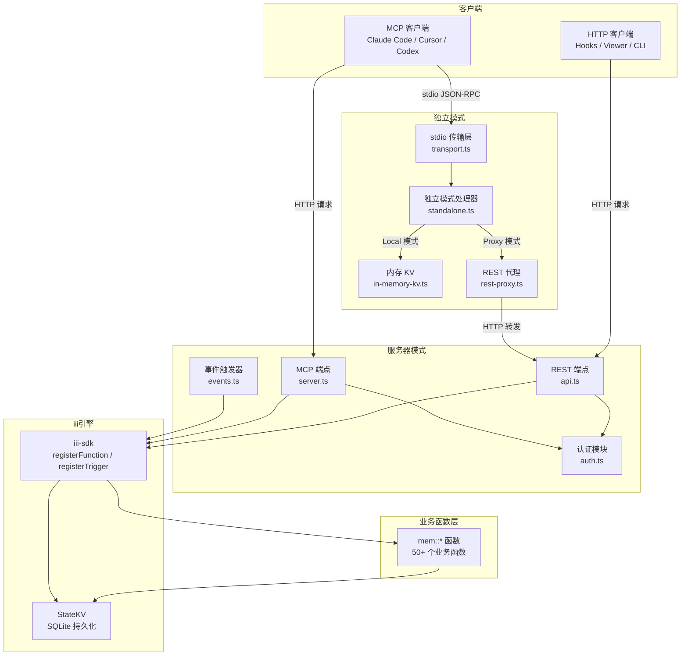
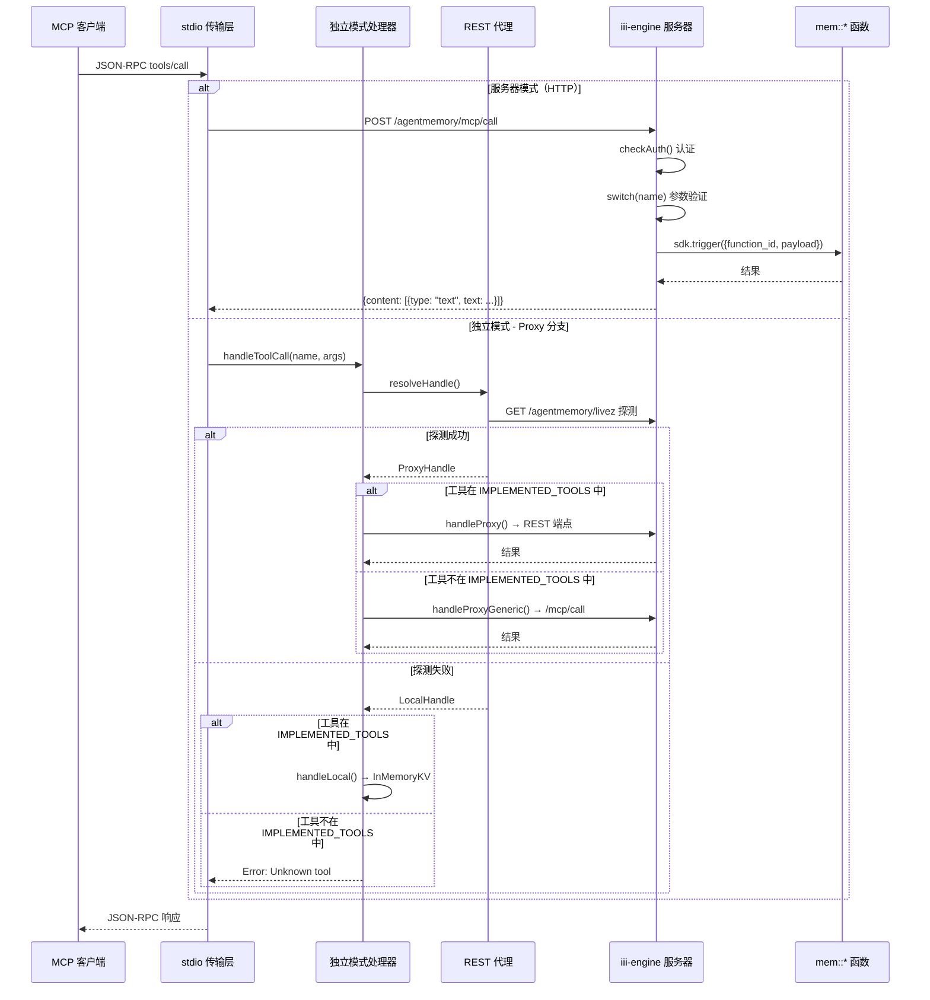
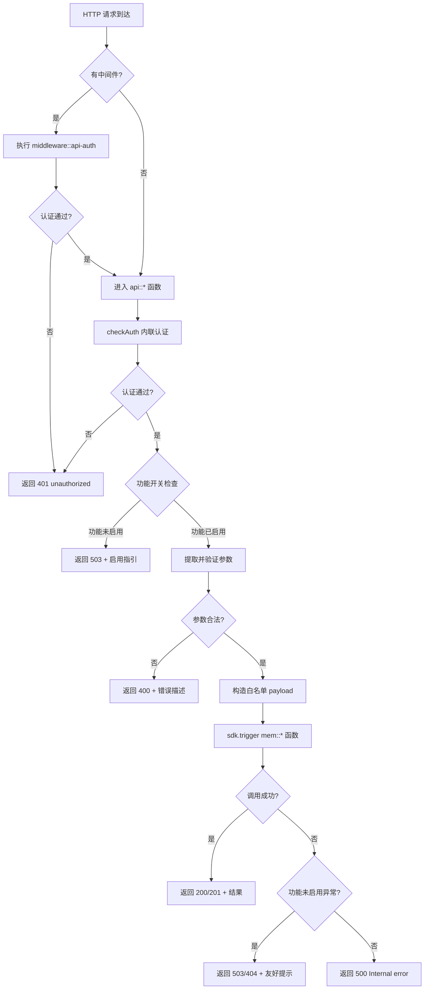
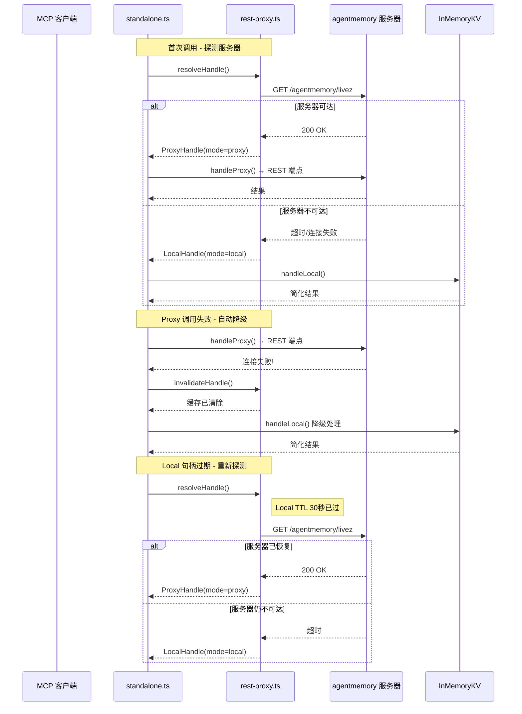
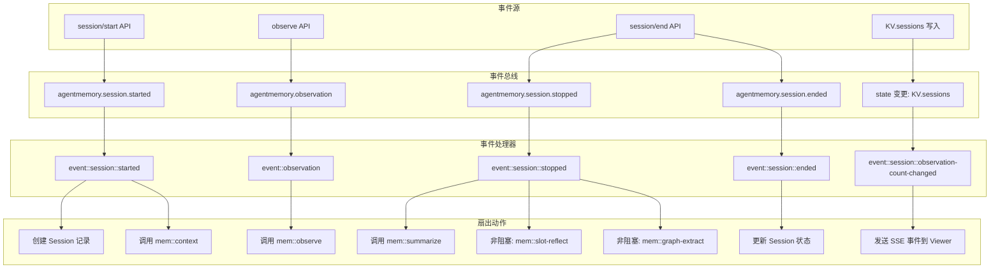
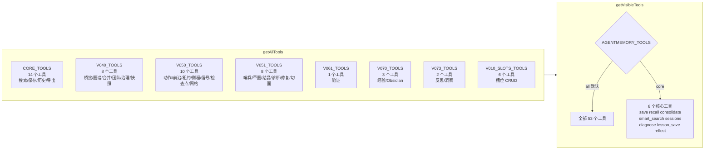
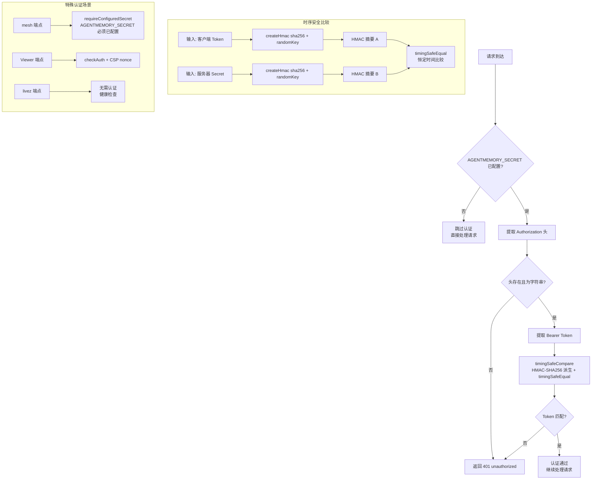

# agentmemory MCP 与 REST API 层模块分析

## 1. 模块概述

agentmemory 的 API 层由两大子系统构成：**MCP（Model Context Protocol）层**和 **REST API 层**。两者均建立在 iii-engine 的 `registerFunction` / `registerTrigger` 原语之上，通过统一的 `sdk.trigger()` 调用底层 `mem::*` 函数，形成「双入口、单后端」的架构。

- **MCP 层**：面向 AI 代理客户端（Claude Code、Cursor、Codex CLI 等），通过 stdio JSON-RPC 传输协议暴露工具（tools）、资源（resources）和提示（prompts）。支持两种运行模式——独立模式（standalone，进程内 InMemoryKV）和服务器代理模式（proxy，转发至 iii-engine 后端）。
- **REST API 层**：面向 HTTP 客户端（Hooks 脚本、Viewer 仪表盘、CLI 命令、第三方集成），通过 iii-engine 的 HTTP 触发器注册 128 个端点，覆盖会话管理、记忆 CRUD、知识图谱、编排、诊断等全部功能。
- **事件触发器层**：基于 iii-engine 的 `durable:subscriber` 和 `state` 触发器，实现会话生命周期事件（启动/停止/结束）的异步处理。
- **认证层**：通过 `timingSafeCompare` 实现时序安全的 Bearer Token 校验，保护所有需要认证的端点。

---

## 2. 核心组件详解

### 2.1 `src/mcp/server.ts` — MCP 服务器端点

**职责**：在 iii-engine 服务器模式下注册 MCP 协议的 HTTP 端点，包括工具列表、工具调用、资源列表/读取、提示列表/获取。

**关键接口**：

```typescript
export function registerMcpEndpoints(sdk: ISdk, kv: StateKV, secret?: string): void
```

**注册的 HTTP 端点**：

| 端点路径 | 方法 | 函数 ID | 说明 |
|---|---|---|---|
| `/agentmemory/mcp/tools` | GET | `mcp::tools::list` | 列出可见 MCP 工具 |
| `/agentmemory/mcp/call` | POST | `mcp::tools::call` | 调用 MCP 工具 |
| `/agentmemory/mcp/resources` | GET | `mcp::resources::list` | 列出 MCP 资源 |
| `/agentmemory/mcp/resources/read` | POST | `mcp::resources::read` | 读取 MCP 资源 |
| `/agentmemory/mcp/prompts` | GET | `mcp::prompts::list` | 列出 MCP 提示 |
| `/agentmemory/mcp/prompts/get` | POST | `mcp::prompts::get` | 获取 MCP 提示 |

**核心逻辑**：

- `mcp::tools::call` 是核心分发器，通过 `switch(name)` 将 53 个 MCP 工具名路由到对应的 `mem::*` 函数调用。每个 case 均执行严格的输入验证（类型检查、范围约束），然后构造白名单 payload 调用 `sdk.trigger()`。
- 工具调用结果统一包装为 `{ content: [{ type: "text", text: ... }] }` 格式，符合 MCP 协议规范。
- 部分功能（graph、consolidation、team、snapshot 等）在 catch 块中返回功能未启用的友好提示而非 500 错误。
- 6 个 MCP 资源通过 URI 模式匹配（`agentmemory://status`、`agentmemory://project/{name}/profile` 等）提供只读数据访问。
- 3 个 MCP 提示（`recall_context`、`session_handoff`、`detect_patterns`）通过 `sdk.trigger()` 调用后端函数并组装对话消息。

**辅助函数**：

- `asNonEmptyString()` — 安全提取非空字符串
- `asNumber()` — 安全解析数字（含回退值）
- `parseCsvList()` — 解析逗号分隔列表（支持字符串和数组输入）

---

### 2.2 `src/mcp/tools-registry.ts` — MCP 工具注册表

**职责**：定义所有 MCP 工具的元数据（名称、描述、输入 Schema），按版本分组管理。

**关键类型**：

```typescript
export type McpToolDef = {
  name: string;
  description: string;
  inputSchema: {
    type: "object";
    properties: Record<string, { type: string; description: string }>;
    required?: string[];
  };
};
```

**版本分组**：

| 常量 | 版本 | 工具数 | 代表性工具 |
|---|---|---|---|
| `CORE_TOOLS` | 初始 | 14 | memory_recall, memory_save, memory_file_history, memory_smart_search, memory_vision_search, memory_timeline, memory_profile, memory_export, memory_relations, memory_commit_lookup, memory_commits |
| `V040_TOOLS` | v0.4.0 | 8 | memory_claude_bridge_sync, memory_graph_query, memory_consolidate, memory_team_share/feed, memory_audit, memory_governance_delete, memory_snapshot_create |
| `V050_TOOLS` | v0.5.0 | 10 | memory_action_create/update, memory_frontier, memory_next, memory_lease, memory_routine_run, memory_signal_send/read, memory_checkpoint, memory_mesh_sync |
| `V051_TOOLS` | v0.5.1 | 8 | memory_sentinel_create/trigger, memory_sketch_create/promote, memory_crystallize, memory_diagnose, memory_heal, memory_facet_tag/query |
| `V061_TOOLS` | v0.6.1 | 1 | memory_verify |
| `V070_TOOLS` | v0.7.0 | 3 | memory_lesson_save/recall, memory_obsidian_export |
| `V073_TOOLS` | v0.7.3 | 2 | memory_reflect, memory_insight_list |
| `V010_SLOTS_TOOLS` | v0.10.0 | 6 | memory_slot_list/get/create/append/replace/delete |

**可见性控制**：

```typescript
export function getVisibleTools(): McpToolDef[] {
  const mode = process.env["AGENTMEMORY_TOOLS"] || "all";
  if (mode === "core") return getAllTools().filter((t) => ESSENTIAL_TOOLS.has(t.name));
  return getAllTools();
}
```

- 默认暴露全部 53 个工具（`mode === "all"`）。
- `AGENTMEMORY_TOOLS=core` 时仅暴露 8 个核心工具（`ESSENTIAL_TOOLS`：memory_save, memory_recall, memory_consolidate, memory_smart_search, memory_sessions, memory_diagnose, memory_lesson_save, memory_reflect）。

---

### 2.3 `src/mcp/standalone.ts` — 独立 MCP 模式

**职责**：作为 `npx @agentmemory/mcp` 的入口，实现不依赖 iii-engine 的独立 MCP 服务器。通过 stdio 传输与 MCP 客户端通信，支持代理模式（转发至服务器）和本地模式（InMemoryKV 降级）。

**关键常量**：

```typescript
const IMPLEMENTED_TOOLS = new Set([
  "memory_save", "memory_recall", "memory_smart_search",
  "memory_sessions", "memory_export", "memory_audit",
  "memory_governance_delete",
]);
```

**核心函数**：

- `handleToolCall(toolName, args, kvInstance)` — 工具调用主入口，流程如下：
  1. 调用 `resolveHandle()` 获取 Proxy/Local 句柄
  2. 若工具不在 `IMPLEMENTED_TOOLS` 中：
     - Proxy 模式：通过 `handleProxyGeneric()` 转发至服务器 `/agentmemory/mcp/call`
     - Local 模式：抛出 "Unknown tool" 错误
  3. 若工具在 `IMPLEMENTED_TOOLS` 中：
     - Proxy 模式：通过 `handleProxy()` 调用对应 REST 端点
     - Proxy 失败时：`invalidateHandle()` 清除缓存，降级到 Local
     - Local 模式：通过 `handleLocal()` 使用 InMemoryKV 处理

- `handleToolsList()` — 工具列表入口：
  - Proxy 模式：从服务器 `/agentmemory/mcp/tools` 获取
  - 获取失败：降级到本地 `IMPLEMENTED_TOOLS` 列表

- `handleProxyGeneric(toolName, args, handle)` — 通用代理转发，将任意工具调用以 `{ name, arguments }` 格式 POST 到 `/agentmemory/mcp/call`，使非 Claude 客户端也能访问全部 53 个工具。

- `handleProxy(v, handle)` — 针对已实现工具的专用代理，直接调用对应的 REST 端点（如 `/agentmemory/search`、`/agentmemory/remember`）。

- `handleLocal(v, kvInstance)` — 本地 InMemoryKV 处理，实现 7 个核心工具的简化逻辑（关键词匹配搜索、内存存储等）。

**传输层集成**：

```typescript
const transport = createStdioTransport(async (method, params) => {
  switch (method) {
    case "initialize": ...
    case "notifications/initialized": ...
    case "tools/list": return handleToolsList();
    case "tools/call": return handleToolCall(toolName, toolArgs);
  }
});
```

---

### 2.4 `src/mcp/transport.ts` — MCP 传输层

**职责**：实现 MCP 协议的 stdio 传输，支持两种消息帧格式——换行分隔 JSON 和 Content-Length 头帧格式。

**关键接口**：

```typescript
export interface JsonRpcRequest {
  jsonrpc: "2.0";
  id?: string | number;
  method: string;
  params?: Record<string, unknown>;
}

export interface JsonRpcResponse {
  jsonrpc: "2.0";
  id: string | number | null;
  result?: unknown;
  error?: { code: number; message: string; data?: unknown };
}
```

**核心组件**：

- `processLine(line, handler, writeOut)` — 处理单行 JSON-RPC 消息：
  - JSON 解析失败 → 返回 -32700 Parse error
  - 非法请求格式 → 返回 -32600 Invalid Request
  - 非法 id 类型 → 返回 -32600 Invalid Request
  - 通知（无 id）→ 执行 handler 但不返回响应
  - 正常请求 → 执行 handler 并返回结果

- `createMessageParser(onMessage)` — 创建消息解析器，自动检测帧格式：
  - 以 `Content-Length:` 开头 → 帧格式解析（提取长度头 + 读取指定字节数）
  - 否则 → 换行分隔格式（逐行解析）

- `createStdioTransport(handler)` — 创建 stdio 传输实例：
  - 从 `process.stdin` 读取数据
  - 通过消息解析器处理
  - 请求按序执行（queue 串行化）
  - 响应写入 `process.stdout`

**JSON-RPC 错误码**：

| 错误码 | 含义 |
|---|---|
| -32700 | Parse error（JSON 解析失败） |
| -32600 | Invalid Request（请求格式非法） |
| -32603 | Internal error（handler 抛出异常） |

---

### 2.5 `src/mcp/rest-proxy.ts` — REST 代理

**职责**：管理独立模式下的代理/本地句柄，实现自动探测、缓存和降级逻辑。

**关键类型**：

```typescript
export interface ProxyHandle {
  mode: "proxy";
  baseUrl: string;
  call: (path: string, init?: RequestInit) => Promise<unknown>;
}

export interface LocalHandle {
  mode: "local";
}

export type Handle = ProxyHandle | LocalHandle;
```

**核心逻辑**：

- `resolveHandle()` — 解析句柄（核心入口）：
  1. 检查缓存：若已有句柄且未过期则直接返回
  2. Local 句柄的 TTL 为 30 秒（`LOCAL_MODE_TTL_MS`），过期后重新探测
  3. 防止并发探测：`probeInFlight` 保证同时只有一个探测请求
  4. 探测流程：向 `{baseUrl}/agentmemory/livez` 发送 GET 请求
  5. 探测成功 → 返回 ProxyHandle（含 `call` 方法，15 秒超时）
  6. 探测失败 → 返回 LocalHandle

- `invalidateHandle()` — 清除缓存句柄，强制下次调用重新探测

- `resolveEnvOrEmpty(name)` — 解析环境变量，过滤 `${VAR}` 形式的未展开占位符

- `forceProxy()` — `AGENTMEMORY_FORCE_PROXY=1` 时跳过探测，直接信任配置的 URL

**配置项**：

| 环境变量 | 默认值 | 说明 |
|---|---|---|
| `AGENTMEMORY_URL` | `http://localhost:3111` | 服务器地址 |
| `AGENTMEMORY_SECRET` | — | Bearer Token |
| `AGENTMEMORY_PROBE_TIMEOUT_MS` | 2000 | 探测超时 |
| `AGENTMEMORY_FORCE_PROXY` | false | 跳过探测强制代理 |

---

### 2.6 `src/mcp/in-memory-kv.ts` — 内存 KV

**职责**：为独立模式的本地降级提供基于内存的键值存储，支持文件持久化。

**核心接口**：

```typescript
class InMemoryKV {
  get<T>(scope: string, key: string): Promise<T | null>
  set<T>(scope: string, key: string, data: T): Promise<T>
  delete(scope: string, key: string): Promise<void>
  list<T>(scope: string): Promise<T[]>
  persist(): void
}
```

**实现细节**：

- 内部使用 `Map<string, Map<string, unknown>>` 双层 Map 结构（scope → key → value）
- 构造时从 `persistPath` 加载已有数据（JSON 格式）
- `persist()` 将整个 store 序列化为 JSON 写入文件
- 独立模式在 SIGINT/SIGTERM 信号时调用 `kv.persist()` 保存数据

---

### 2.7 `src/triggers/api.ts` — REST API 触发器

**职责**：注册所有 REST API 端点，是 agentmemory 最大的单文件模块（3100+ 行），覆盖 128 个 HTTP 端点。

**关键函数**：

```typescript
export function registerApiTriggers(
  sdk: ISdk, kv: StateKV, secret?: string,
  metricsStore?: MetricsStore,
  provider?: ResilientProvider | { circuitState?: unknown },
): void
```

**端点分类**：

| 分类 | 端点数 | 路径前缀 | 示例 |
|---|---|---|---|
| 基础/健康 | 3 | `/agentmemory/livez`, `/agentmemory/health`, `/agentmemory/config/flags` | |
| 会话管理 | 6 | `/agentmemory/session/*` | start, end, commit, by-commit |
| 观测/上下文 | 5 | `/agentmemory/observe`, `/agentmemory/context`, `/agentmemory/enrich` | |
| 搜索/回忆 | 4 | `/agentmemory/search`, `/agentmemory/smart-search`, `/agentmemory/vision-search` | |
| 记忆 CRUD | 8 | `/agentmemory/remember`, `/agentmemory/forget`, `/agentmemory/memories`, `/agentmemory/evolve` | |
| 知识图谱 | 7 | `/agentmemory/graph/*` | query, stats, extract, build, snapshot-rebuild, reset |
| 合并/模式 | 4 | `/agentmemory/consolidate*`, `/agentmemory/patterns`, `/agentmemory/generate-rules` | |
| 团队 | 3 | `/agentmemory/team/*` | share, feed, profile |
| 治理 | 3 | `/agentmemory/governance/*` | memories (DELETE), bulk-delete |
| 快照 | 3 | `/agentmemory/snapshot*`, `/agentmemory/snapshots` | create, restore, list |
| 编排-动作 | 5 | `/agentmemory/actions*` | create, update, list, get, edges |
| 编排-前沿/下一 | 2 | `/agentmemory/frontier`, `/agentmemory/next` | |
| 编排-租约 | 3 | `/agentmemory/leases/*` | acquire, release, renew |
| 编排-例程 | 4 | `/agentmemory/routines*` | create, list, run, status |
| 编排-信号 | 2 | `/agentmemory/signals*` | send, read |
| 编排-检查点 | 3 | `/agentmemory/checkpoints*` | create, resolve, list |
| 编排-网格 | 5 | `/agentmemory/mesh/*` | register, list, sync, receive, export |
| 哨兵 | 5 | `/agentmemory/sentinels*` | create, trigger, check, cancel, list |
| 草图 | 6 | `/agentmemory/sketches*` | create, add, promote, discard, list, gc |
| 结晶 | 3 | `/agentmemory/crystals*` | create, list, auto |
| 诊断/修复 | 2 | `/agentmemory/diagnostics*` | diagnose, heal |
| 切面 | 5 | `/agentmemory/facets*` | tag, untag, query, get, stats |
| 验证/级联 | 2 | `/agentmemory/verify`, `/agentmemory/cascade-update` | |
| 经验 | 4 | `/agentmemory/lessons*` | save, list, search, strengthen |
| 反思/洞察 | 3 | `/agentmemory/reflect`, `/agentmemory/insights*` | list, search |
| Obsidian | 1 | `/agentmemory/obsidian/export` | |
| 槽位 | 7 | `/agentmemory/slot*`, `/agentmemory/slots` | list, get, create, append, replace, delete, reflect |
| 提交 | 2 | `/agentmemory/commits`, `/agentmemory/session/commit` | |
| 导出/导入 | 2 | `/agentmemory/export`, `/agentmemory/import` | |
| 其他 | 7 | `/agentmemory/compress-file`, `/agentmemory/migrate`, `/agentmemory/evict`, `/agentmemory/auto-forget`, `/agentmemory/claude-bridge/*`, `/agentmemory/flow/compress`, `/agentmemory/branch/*`, `/agentmemory/viewer`, `/agentmemory/diagnostics/followup` | |

**认证模式**：

- **内联认证**：大多数端点在函数体开头调用 `checkAuth(req, secret)` 进行认证
- **中间件认证**：部分端点通过 `middleware_function_ids: ["middleware::api-auth"]` 配置中间件
- **无需认证**：`/agentmemory/livez`、`/agentmemory/sessions`、`/agentmemory/observations` 等少量端点
- **双重认证**：mesh 相关端点额外要求 `AGENTMEMORY_SECRET` 已配置（`requireConfiguredSecret`）

**输入验证模式**：

所有端点均采用白名单字段提取，**绝不**将原始 `req.body` 直接传递给 `sdk.trigger()`：

```typescript
const payload = {
  query: req.body?.query,
  limit: req.body?.limit,
  project: req.body?.project,
  // 仅包含已知字段
};
const result = await sdk.trigger({ function_id: "mem::smart-search", payload });
```

---

### 2.8 `src/triggers/events.ts` — 事件触发器

**职责**：注册基于 iii-engine 事件总线的异步触发器，处理会话生命周期事件。

**注册的事件**：

| 函数 ID | 触发器类型 | 主题/配置 | 说明 |
|---|---|---|---|
| `event::session::started` | `durable:subscriber` | `agentmemory.session.started` | 会话启动：创建 Session 记录 + 调用 `mem::context` |
| `event::observation` | `durable:subscriber` | `agentmemory.observation` | 观测事件：转发至 `mem::observe` |
| `event::session::stopped` | `durable:subscriber` | `agentmemory.session.stopped` | 会话停止：摘要 + 可选 slot-reflect + 可选 graph-extract |
| `event::session::ended` | `durable:subscriber` | `agentmemory.session.ended` | 会话结束：更新状态为 completed |
| `event::session::observation-count-changed` | `state` | `scope: KV.sessions` | 观测数变化：发送 SSE 事件到 Viewer |

**`event::session::stopped` 的扇出逻辑**：

1. 调用 `mem::summarize` 生成会话摘要
2. 若 `AGENTMEMORY_REFLECT=true`：非阻塞触发 `mem::slot-reflect`
3. 若 `GRAPH_EXTRACTION_ENABLED=true`：提取压缩观测，非阻塞触发 `mem::graph-extract`

---

### 2.9 `src/auth.ts` — 认证

**职责**：提供时序安全的字符串比较和 Viewer 安全相关工具。

**核心函数**：

```typescript
export function timingSafeCompare(a: string, b: string): boolean {
  const hmacA = createHmac("sha256", hmacKey).update(a).digest();
  const hmacB = createHmac("sha256", hmacKey).update(b).digest();
  return timingSafeEqual(hmacA, hmacB);
}
```

- 使用 HMAC-SHA256 派生后再做 `timingSafeEqual`，防止时序攻击
- `hmacKey` 在进程启动时通过 `randomBytes(32)` 生成，每次重启不同
- `createViewerNonce()` — 生成 Viewer CSP nonce
- `buildViewerCsp(nonce)` — 构建 Viewer 的 Content-Security-Policy 头

---

## 3. MCP 工具与 REST 端点的映射关系表

| MCP 工具名 | REST 端点 | HTTP 方法 | 底层函数 |
|---|---|---|---|
| `memory_recall` | `/agentmemory/search` | POST | `mem::search` |
| `memory_compress_file` | `/agentmemory/compress-file` | POST | `mem::compress-file` |
| `memory_save` | `/agentmemory/remember` | POST | `mem::remember` |
| `memory_file_history` | `/agentmemory/file-context` | POST | `mem::file-context` |
| `memory_patterns` | `/agentmemory/patterns` | POST | `mem::patterns` |
| `memory_sessions` | `/agentmemory/sessions` | GET | `kv.list(KV.sessions)` |
| `memory_smart_search` | `/agentmemory/smart-search` | POST | `mem::smart-search` |
| `memory_vision_search` | `/agentmemory/vision-search` | POST | `mem::vision-search` |
| `memory_timeline` | `/agentmemory/timeline` | POST | `mem::timeline` |
| `memory_profile` | `/agentmemory/profile` | GET | `mem::profile` |
| `memory_export` | `/agentmemory/export` | GET | `mem::export` |
| `memory_relations` | `/agentmemory/relations` | POST | `mem::relate` / `mem::get-related` |
| `memory_commit_lookup` | `/agentmemory/session/by-commit` | GET | `kv.get(KV.commits)` |
| `memory_commits` | `/agentmemory/commits` | GET | `kv.list(KV.commits)` |
| `memory_claude_bridge_sync` | `/agentmemory/claude-bridge/sync` | POST | `mem::claude-bridge-sync` / `mem::claude-bridge-read` |
| `memory_graph_query` | `/agentmemory/graph/query` | POST | `mem::graph-query` |
| `memory_consolidate` | `/agentmemory/consolidate-pipeline` | POST | `mem::consolidate-pipeline` |
| `memory_team_share` | `/agentmemory/team/share` | POST | `mem::team-share` |
| `memory_team_feed` | `/agentmemory/team/feed` | GET | `mem::team-feed` |
| `memory_audit` | `/agentmemory/audit` | GET | `mem::audit-query` |
| `memory_governance_delete` | `/agentmemory/governance/memories` | DELETE | `mem::governance-delete` |
| `memory_snapshot_create` | `/agentmemory/snapshot/create` | POST | `mem::snapshot-create` |
| `memory_action_create` | `/agentmemory/actions` | POST | `mem::action-create` |
| `memory_action_update` | `/agentmemory/actions/update` | POST | `mem::action-update` |
| `memory_frontier` | `/agentmemory/frontier` | GET | `mem::frontier` |
| `memory_next` | `/agentmemory/next` | GET | `mem::next` |
| `memory_lease` | `/agentmemory/leases/acquire\|release\|renew` | POST | `mem::lease-acquire\|release\|renew` |
| `memory_routine_run` | `/agentmemory/routines/run` | POST | `mem::routine-run` |
| `memory_signal_send` | `/agentmemory/signals/send` | POST | `mem::signal-send` |
| `memory_signal_read` | `/agentmemory/signals` | GET | `mem::signal-read` |
| `memory_checkpoint` | `/agentmemory/checkpoints*` | POST/GET | `mem::checkpoint-create\|resolve\|list` |
| `memory_mesh_sync` | `/agentmemory/mesh/sync` | POST | `mem::mesh-sync` |
| `memory_sentinel_create` | `/agentmemory/sentinels` | POST | `mem::sentinel-create` |
| `memory_sentinel_trigger` | `/agentmemory/sentinels/trigger` | POST | `mem::sentinel-trigger` |
| `memory_sketch_create` | `/agentmemory/sketches` | POST | `mem::sketch-create` |
| `memory_sketch_promote` | `/agentmemory/sketches/promote` | POST | `mem::sketch-promote` |
| `memory_crystallize` | `/agentmemory/crystals/create` | POST | `mem::crystallize` |
| `memory_diagnose` | `/agentmemory/diagnostics` | POST | `mem::diagnose` |
| `memory_heal` | `/agentmemory/diagnostics/heal` | POST | `mem::heal` |
| `memory_facet_tag` | `/agentmemory/facets` | POST | `mem::facet-tag` |
| `memory_facet_query` | `/agentmemory/facets/query` | POST | `mem::facet-query` |
| `memory_verify` | `/agentmemory/verify` | POST | `mem::verify` |
| `memory_lesson_save` | `/agentmemory/lessons` | POST | `mem::lesson-save` |
| `memory_lesson_recall` | `/agentmemory/lessons/search` | POST | `mem::lesson-recall` |
| `memory_reflect` | `/agentmemory/reflect` | POST | `mem::reflect` |
| `memory_insight_list` | `/agentmemory/insights` | GET | `mem::insight-list` |
| `memory_obsidian_export` | `/agentmemory/obsidian/export` | POST | `mem::obsidian-export` |
| `memory_slot_list` | `/agentmemory/slots` | GET | `mem::slot-list` |
| `memory_slot_get` | `/agentmemory/slot` | GET | `mem::slot-get` |
| `memory_slot_create` | `/agentmemory/slot` | POST | `mem::slot-create` |
| `memory_slot_append` | `/agentmemory/slot/append` | POST | `mem::slot-append` |
| `memory_slot_replace` | `/agentmemory/slot/replace` | POST | `mem::slot-replace` |
| `memory_slot_delete` | `/agentmemory/slot` | DELETE | `mem::slot-delete` |

---

## 4. 请求处理流程分析

### 4.1 MCP 工具调用流程（服务器模式）

1. MCP 客户端发送 HTTP POST 到 `/agentmemory/mcp/call`
2. iii-engine 接收请求，路由到 `mcp::tools::call` 函数
3. `checkAuth()` 校验 Bearer Token
4. 验证 `req.body.name` 是否为字符串
5. 进入 `switch(name)` 分支：
   - 对参数进行类型检查和范围验证
   - 构造白名单 payload
   - 调用 `sdk.trigger({ function_id: "mem::*", payload })`
6. 将结果包装为 MCP content 格式返回

### 4.2 REST 请求处理流程

1. HTTP 客户端发送请求到 `/agentmemory/*`
2. iii-engine 接收请求，若有 `middleware_function_ids` 则先执行中间件链
3. 路由到对应的 `api::*` 函数
4. `checkAuth()` 校验 Bearer Token（内联或中间件）
5. 从 `req.body` / `req.query_params` / `req.path_params` 提取参数
6. 验证必填字段和类型
7. 构造白名单 payload，调用 `sdk.trigger()`
8. 返回 `{ status_code, body }` 响应

### 4.3 独立模式 MCP 工具调用流程

1. MCP 客户端通过 stdio 发送 JSON-RPC `tools/call` 请求
2. `createStdioTransport` 接收并解析消息
3. 路由到 `handleToolCall(toolName, toolArgs)`
4. `resolveHandle()` 探测服务器可用性：
   - 服务器可达 → ProxyHandle
   - 服务器不可达 → LocalHandle
5. 根据工具是否在 `IMPLEMENTED_TOOLS` 中分支：
   - **已实现工具**：Proxy 模式调用 `handleProxy()` → REST 端点；失败则降级 `handleLocal()` → InMemoryKV
   - **未实现工具**：Proxy 模式调用 `handleProxyGeneric()` → `/agentmemory/mcp/call`；Local 模式抛出错误

---

## 5. 独立模式 vs 服务器模式对比

| 维度 | 独立模式（Standalone） | 服务器模式（Server） |
|---|---|---|
| **入口** | `npx @agentmemory/mcp` | `agentmemory start`（iii-engine worker） |
| **传输** | stdio JSON-RPC | HTTP REST + MCP HTTP 端点 |
| **存储** | InMemoryKV（内存 + 文件持久化） | StateKV（iii-engine SQLite） |
| **工具数** | 7 个本地实现 + 代理转发全部 53 个 | 全部 53 个 |
| **搜索** | 关键词匹配（`String.includes`） | BM25 + 向量 + 图混合搜索 |
| **认证** | 无（本地进程） | Bearer Token（`AGENTMEMORY_SECRET`） |
| **LLM 依赖** | 无 | 可选（压缩、合并、图谱提取等需要 LLM） |
| **事件系统** | 无 | `durable:subscriber` + `state` 触发器 |
| **Viewer** | 无 | 内置 Web Viewer |
| **适用场景** | 轻量级本地使用、CI/CD、无服务器环境 | 长期运行服务、多代理协作、完整功能 |
| **降级策略** | Proxy → Local 自动降级 | 无降级（直接返回错误） |
| **数据持久化** | JSON 文件（`persist()` 调用） | SQLite（iii-engine 管理） |

---

## 6. 关键设计模式

### 6.1 双入口单后端

MCP 和 REST 两条入口路径最终都通过 `sdk.trigger()` 调用同一组 `mem::*` 函数。业务逻辑集中在函数层，API 层仅负责参数验证、白名单提取和响应格式化。

### 6.2 白名单字段提取

所有 API 端点（MCP 和 REST）均采用显式字段白名单，绝不将原始请求体传递给 `sdk.trigger()`：

```typescript
const payload = {
  query: req.body?.query,
  limit: req.body?.limit,
  project: req.body?.project,
};
```

这防止了未知字段注入下游逻辑。

### 6.3 自动降级（Graceful Degradation）

独立模式实现了三级降级：

1. **Proxy 模式**：转发至服务器，访问全部功能
2. **Proxy 失败降级**：`invalidateHandle()` 清除缓存，对已实现工具降级到 Local
3. **Local 模式**：InMemoryKV 提供基础功能，关键词搜索替代语义搜索

### 6.4 时序安全认证

使用 HMAC-SHA256 派生 + `timingSafeEqual` 的双重保护，防止通过响应时间差异推断 Token 内容。

### 6.5 功能开关（Feature Flags）

大量功能通过环境变量控制启用状态，未启用时返回友好的 503 响应和启用指引：

- `GRAPH_EXTRACTION_ENABLED` — 知识图谱
- `CONSOLIDATION_ENABLED` — 记忆合并
- `AGENTMEMORY_SLOTS` — 内存槽位
- `AGENTMEMORY_REFLECT` — 槽位反思
- `CLAUDE_MEMORY_BRIDGE` — Claude 桥接
- `TEAM_ID` + `USER_ID` — 团队记忆
- `SNAPSHOT_ENABLED` — Git 快照

### 6.6 非阻塞扇出

事件触发器中使用 `TriggerAction.Void()` 实现非阻塞触发，避免扇出操作阻塞主流程：

```typescript
sdk.trigger({
  function_id: "event::session::stopped",
  payload: { sessionId },
  action: TriggerAction.Void(),
});
```

### 6.7 句柄缓存与 TTL

`rest-proxy.ts` 通过缓存 Proxy/Local 句柄避免每次调用都探测服务器。Local 句柄设置 30 秒 TTL，过期后重新探测，实现服务器恢复后的自动重连。

---

## 7. Mermaid 图表

### 7.1 API 层整体架构图



### 7.2 MCP 工具调用完整时序图



### 7.3 REST 请求处理流程图



### 7.4 独立模式 Proxy/Local 自动降级时序图



### 7.5 事件触发器工作流程图



### 7.6 MCP 工具注册表版本分组图



### 7.7 认证安全流程图



---

## 附录：关键数据统计

| 指标 | 数值 |
|---|---|
| MCP 工具总数 | 53 |
| MCP 核心工具（`AGENTMEMORY_TOOLS=core`） | 8 |
| MCP 资源 | 6 |
| MCP 提示 | 3 |
| REST 端点总数 | 128 |
| 独立模式本地实现工具 | 7 |
| 事件触发器 | 5 |
| 版本分组数 | 8 |
| 认证方式 | Bearer Token（时序安全比较） |
