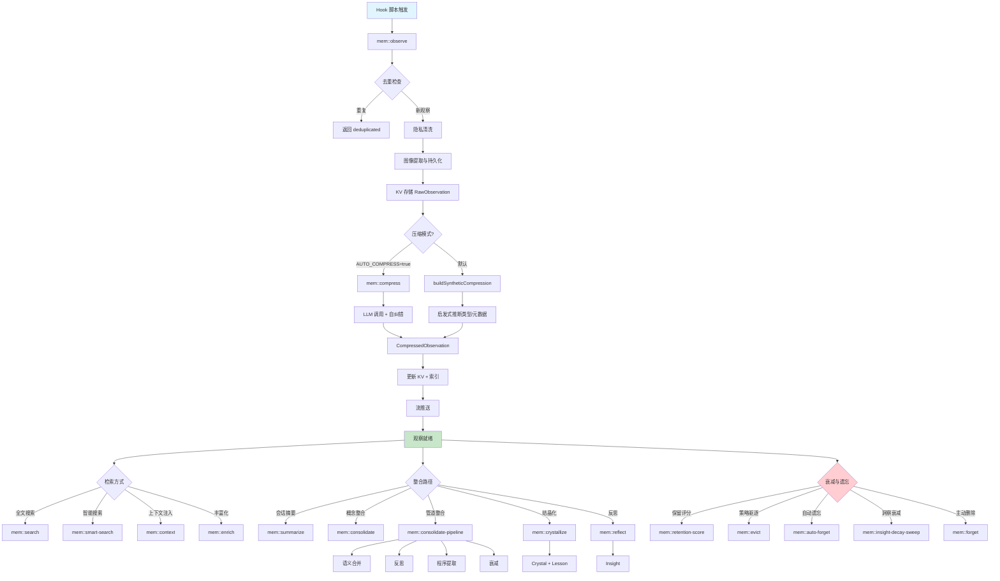
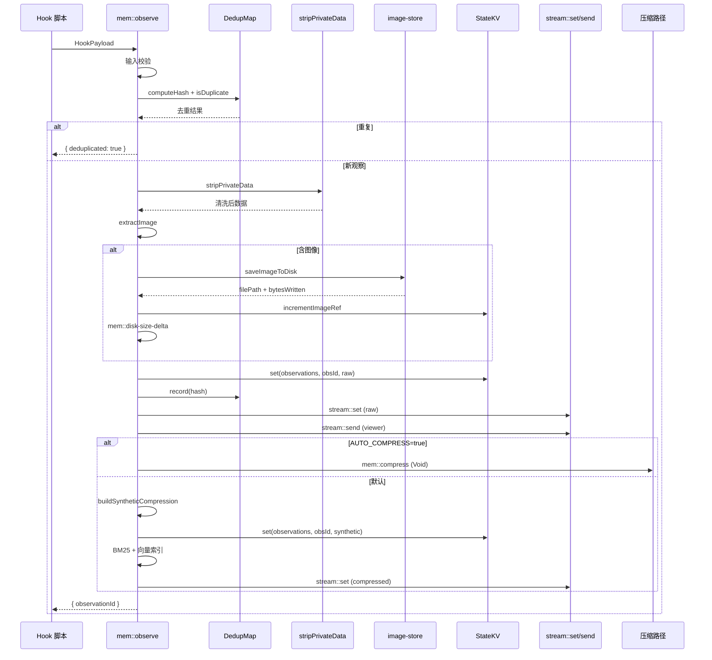
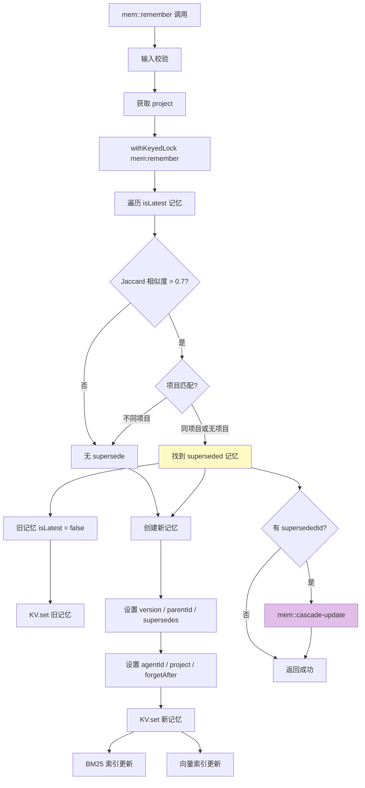
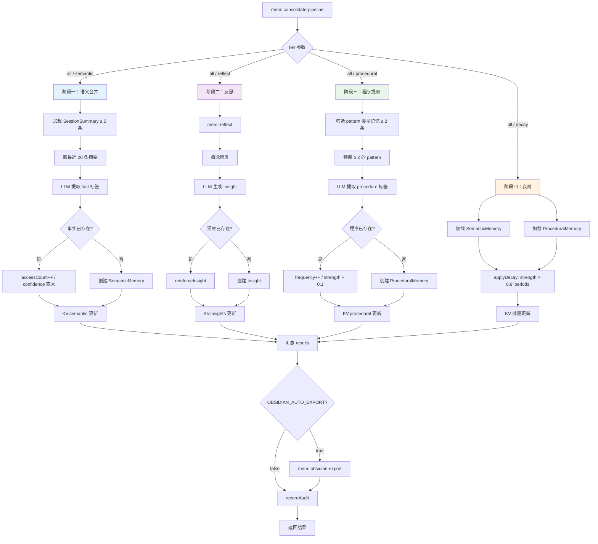
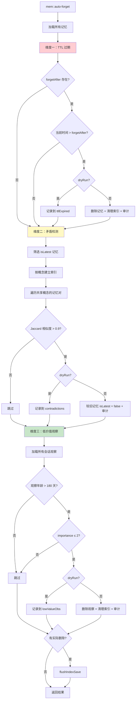
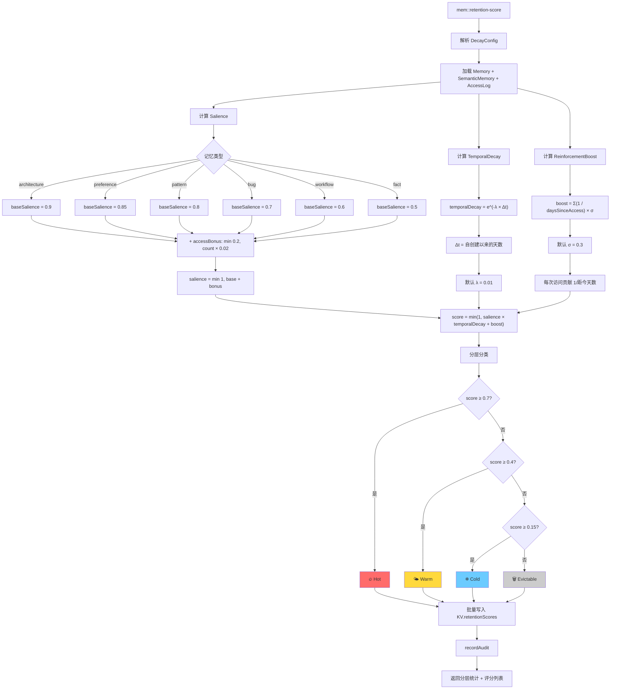
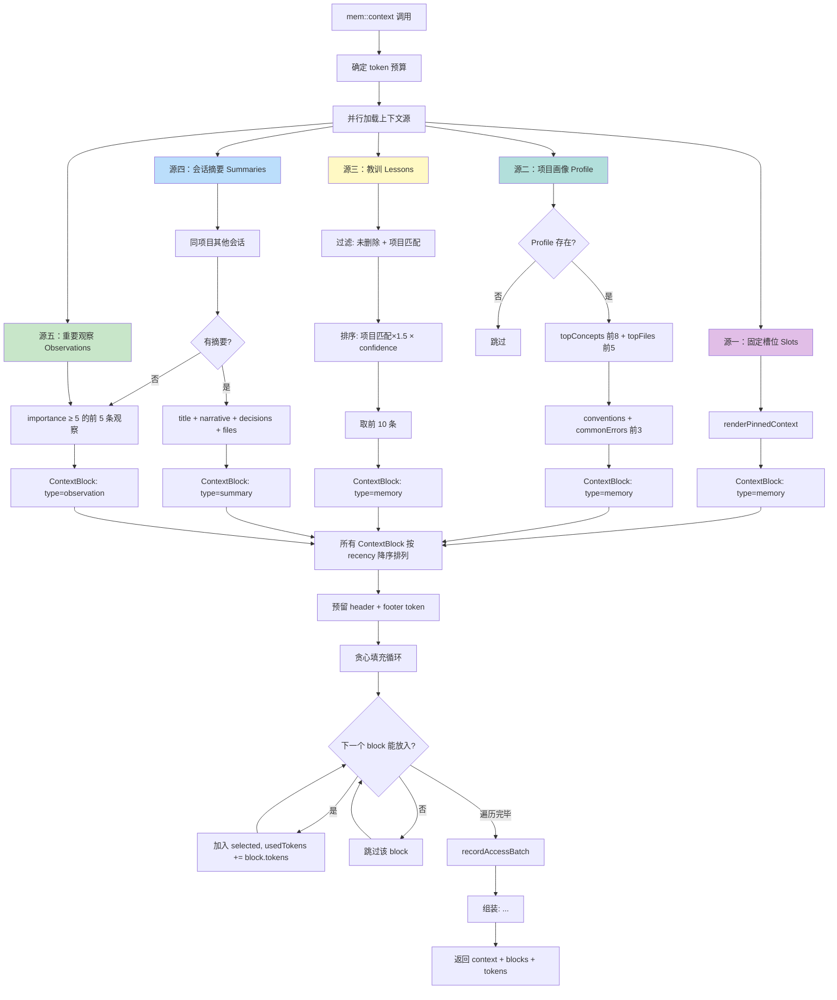

# 记忆函数层（Memory Functions Layer）模块分析

## 1. 模块概述

记忆函数层是 agentmemory 的核心业务逻辑层，位于 iii-sdk 引擎之上、MCP/REST 接口之下。它通过 `sdk.registerFunction()` 注册 50+ 个 `mem::` 命名空间的函数，覆盖记忆的完整生命周期：**观察捕获 → 压缩 → 存储 → 搜索 → 整合 → 结晶 → 上下文注入 → 遗忘/驱逐**。

所有函数遵循统一范式：
- 通过 `sdk.registerFunction(functionId, handler)` 注册
- 通过 `sdk.trigger({ function_id, payload })` 跨函数调用
- 状态读写通过 `StateKV`（底层为 iii-engine 的 StateModule，文件型 SQLite）
- 结构性变更通过 `recordAudit()` 记录审计日志
- 并发安全通过 `withKeyedLock()` 保证

### 模块文件清单

| 文件 | 核心函数 ID | 职责 |
|------|------------|------|
| `observe.ts` | `mem::observe` | 观察捕获 |
| `remember.ts` | `mem::remember`, `mem::forget` | 记忆存储与删除 |
| `compress.ts` | `mem::compress` | LLM 压缩 |
| `compress-synthetic.ts` | —（被 observe 调用） | 零 LLM 合成压缩 |
| `consolidate.ts` | `mem::consolidate` | 记忆整合 |
| `consolidation-pipeline.ts` | `mem::consolidate-pipeline` | 整合管道 |
| `search.ts` | `mem::search` | 搜索（BM25 + 向量） |
| `smart-search.ts` | `mem::smart-search` | 智能搜索 |
| `context.ts` | `mem::context` | 上下文注入 |
| `summarize.ts` | `mem::summarize` | 会话摘要 |
| `crystallize.ts` | `mem::crystallize`, `mem::crystal-list`, `mem::crystal-get`, `mem::auto-crystallize` | 结晶化 |
| `reflect.ts` | `mem::reflect`, `mem::insight-list`, `mem::insight-search`, `mem::insight-decay-sweep` | 反思 |
| `enrich.ts` | `mem::enrich` | 丰富化 |
| `evict.ts` | `mem::evict` | 驱逐 |
| `auto-forget.ts` | `mem::auto-forget` | 自动遗忘 |
| `retention.ts` | `mem::retention-score`, `mem::retention-evict` | 保留评分 |
| `dedup.ts` | —（类 DedupMap） | 去重 |
| `privacy.ts` | `mem::privacy` | 隐私清洗 |
| `audit.ts` | —（工具函数） | 审计 |

---

## 2. 核心函数详解

### 2.1 observe — 观察捕获

**职责**：从 Hook 脚本接收原始观察数据，完成去重、隐私清洗、图像提取、KV 持久化、流推送和压缩触发。

**注册函数 ID**：`mem::observe`

**输入**（HookPayload）：
```typescript
{
  sessionId: string;      // 必需
  hookType: string;       // 必需，如 "post_tool_use"、"prompt_submit"
  timestamp: string;      // 必需，ISO 8601
  data: unknown;          // 原始观察数据
  project?: string;
  cwd?: string;
}
```

**输出**：
```typescript
{ observationId: string }  // 成功
{ deduplicated: true, sessionId: string }  // 去重跳过
{ success: false, error: string }  // 失败
```

**核心算法**：
1. **输入校验**：验证 sessionId、hookType、timestamp 必需字段
2. **去重检查**：通过 DedupMap 计算 SHA-256 哈希（sessionId + toolName + toolInput 前 500 字符），5 分钟 TTL 内重复则跳过
3. **隐私清洗**：`stripPrivateData()` 移除 `<private>` 标签和密钥模式（API Key、Bearer Token、JWT 等）
4. **图像提取**：递归搜索 `image_data`、`imageBase64` 等字段，base64 图像存入磁盘并记录引用计数
5. **会话感知**：继承已有会话的 agentId，无会话记录时从环境变量获取
6. **KV 持久化**：写入 `KV.observations(sessionId)` 作用域
7. **流推送**：通过 `stream::set` 和 `stream::send` 推送原始观察到实时查看器
8. **压缩分支**：
   - `AGENTMEMORY_AUTO_COMPRESS=true` → 触发 `mem::compress`（LLM 压缩）
   - 默认 → `buildSyntheticCompression()`（零 LLM 合成压缩），直接更新 KV 并索引

### 2.2 remember — 记忆存储

**职责**：将结构化内容保存为长期记忆，支持版本演进（supersede）和级联更新。

**注册函数 ID**：`mem::remember`、`mem::forget`

**输入**（remember）：
```typescript
{
  content: string;           // 必需
  type?: string;             // pattern|preference|architecture|bug|workflow|fact，默认 fact
  concepts?: string[];
  files?: string[];
  ttlDays?: number;          // 生存天数，过期后 forgetAfter 生效
  sourceObservationIds?: string[];
  agentId?: string;
  project?: string;
}
```

**输出**：`{ success: true, memory: Memory }` 或 `{ success: false, error: string }`

**核心算法**：
1. **输入校验**：content 必需且非空，files/concepts 必须为数组
2. **版本演进检测**：遍历所有 `isLatest` 记忆，计算 Jaccard 相似度（> 0.7 阈值），同项目内匹配则标记旧记忆为 `isLatest=false`，新记忆 `version = oldVersion + 1`
3. **项目隔离**：显式 project 字段的记忆不会跨项目 supersede
4. **Agent 标记**：优先使用请求中的 agentId，回退到环境变量 `AGENT_ID`
5. **TTL 设置**：`ttlDays` 转换为 `forgetAfter` 绝对时间戳
6. **索引更新**：同步写入 BM25 索引和向量索引
7. **级联更新**：supersede 时触发 `mem::cascade-update`

**mem::forget** 支持三种粒度删除：
- 按 `memoryId` 删除单条记忆
- 按 `sessionId + observationIds` 删除指定观察
- 按 `sessionId` 删除整个会话（含所有观察 + 摘要）

### 2.3 compress — LLM 压缩

**职责**：将原始观察通过 LLM 调用压缩为结构化 CompressedObservation。

**注册函数 ID**：`mem::compress`

**输入**：
```typescript
{
  observationId: string;
  sessionId: string;
  raw: RawObservation;
}
```

**输出**：`{ success: true, compressed: CompressedObservation, qualityScore: number }` 或 `{ success: false, error: string }`

**核心算法**：
1. **图像描述**：若观察含图像且 provider 支持 `describeImage`，先调用视觉模型生成描述
2. **Prompt 构建**：`buildCompressionPrompt()` 组装 hookType、toolName、toolInput/Output、userPrompt
3. **LLM 调用 + 自纠错**：`compressWithRetry()` 调用 LLM，验证器检查 XML 解析和 schema 合规性，失败则重试一次
4. **XML 解析**：提取 type、title、subtitle、facts、narrative、concepts、files、importance
5. **质量评分**：`scoreCompression()` 计算压缩质量分数（0-100）
6. **持久化 + 索引**：更新 KV、BM25 索引、向量索引
7. **流推送**：推送压缩结果到实时查看器
8. **指标记录**：延迟和成功率写入 MetricsStore

### 2.4 compress-synthetic — 零 LLM 合成压缩

**职责**：不调用 LLM，通过启发式规则将 RawObservation 转换为 CompressedObservation。自 v0.8.8 起为默认压缩路径。

**注册函数 ID**：无（被 `mem::observe` 直接调用）

**核心算法**：
1. **类型推断** `inferType()`：根据 hookType 和 toolName 模式匹配推断观察类型（如 `post_tool_failure` → error，含 "fetch" 的工具 → web_fetch）
2. **文件提取** `extractFiles()`：从 toolInput 对象中提取 `file_path`、`filepath`、`path` 等字段
3. **叙事拼接**：将 userPrompt + toolInput + toolOutput 用 `|` 连接，截断至 400 字符
4. **置信度**：固定 0.3（vs LLM 压缩的质量评分 / 100）
5. **重要性**：固定 5

### 2.5 consolidate — 记忆整合

**职责**：将相关观察按概念分组，通过 LLM 合成为长期记忆，支持新记忆创建和已有记忆演进。

**注册函数 ID**：`mem::consolidate`

**输入**：
```typescript
{
  project?: string;          // 项目过滤
  minObservations?: number;  // 最少观察数，默认 10
}
```

**输出**：`{ consolidated: number, totalObservations: number }` 或 `{ consolidated: 0, reason: "insufficient_observations" }`

**核心算法**：
1. **观察收集**：按项目过滤会话，批量加载观察（每批 10 个会话），筛选 importance ≥ 5
2. **概念分组**：按 concept 字段分组，仅保留 ≥ 3 条观察的组
3. **LLM 调用**：每组取 importance 最高的 8 条观察，30 秒超时，最多 10 次 LLM 调用
4. **XML 解析**：提取 type、title、content、concepts、files、strength
5. **去重检查**：与已有记忆按 title 匹配（同项目内），匹配则演进（version + 1），否则新建
6. **审计记录**：演进记录为 "evolve"，新建记录为 "remember"

### 2.6 consolidation-pipeline — 整合管道

**职责**：编排四阶段整合流程：语义合并 → 反思 → 程序提取 → 衰减。

**注册函数 ID**：`mem::consolidate-pipeline`

**输入**：
```typescript
{
  tier?: string;    // "all"|"semantic"|"reflect"|"procedural"|"decay"
  force?: boolean;  // 跳过启用检查
  project?: string;
}
```

**输出**：`{ success: true, results: Record<string, unknown> }`

**核心算法（四阶段）**：

**阶段一：语义合并（semantic）**
- 前提：≥ 5 条会话摘要
- 取最近 20 条摘要，LLM 提取 `<fact confidence="...">` 标签
- 已有事实：增加 accessCount，取最大 confidence
- 新事实：创建 SemanticMemory 条目

**阶段二：反思（reflect）**
- 委托 `mem::reflect` 函数

**阶段三：程序提取（procedural）**
- 前提：≥ 2 条频率 ≥ 2 的 pattern 类型记忆
- LLM 提取 `<procedure name="..." trigger="...">` 标签
- 已有程序：增加 frequency，提升 strength
- 新程序：创建 ProceduralMemory 条目

**阶段四：衰减（decay）**
- 对语义记忆和程序记忆应用指数衰减：`strength *= 0.9^decayPeriods`
- 衰减周期 = 自上次访问以来的天数 / decayDays

**可选**：若 `OBSIDIAN_AUTO_EXPORT=true`，触发 Obsidian 导出

### 2.7 search — 搜索

**职责**：BM25 全文搜索 + 向量语义搜索，支持项目/目录过滤和 token 预算控制。

**注册函数 ID**：`mem::search`

**输入**：
```typescript
{
  query: string;           // 必需
  limit?: number;          // 默认 20，上限 100
  project?: string;
  cwd?: string;
  format?: string;         // "full"|"compact"|"narrative"
  token_budget?: number;
}
```

**核心算法**：
1. **索引懒加载**：若 BM25 索引为空，触发 `rebuildIndex()` 重建
2. **过度获取**：有项目/目录过滤时，获取 10× limit 的候选结果
3. **后过滤**：按 session.project / session.cwd 过滤，记忆条目回查 KV.memories 获取 project
4. **结果丰富**：并行加载观察详情，记忆条目通过 `memoryToObservation()` 转换
5. **访问追踪**：`recordAccessBatch()` 记录被访问的条目 ID
6. **Token 预算**：按 `JSON.stringify().length / 3` 估算 token 数，超预算截断

**辅助功能**：
- `rebuildIndex()`：全量重建 BM25 + 向量索引，批量嵌入（默认 32 条/批）
- `vectorIndexAddGuarded()`：单条向量写入，维度不匹配或嵌入失败时软降级
- `vectorIndexAddBatchGuarded()`：批量向量写入，单次 embedBatch 调用

### 2.8 smart-search — 智能搜索

**职责**：混合搜索（BM25 + 向量 + Lesson 回忆），支持 Agent 作用域隔离和 followup 率诊断。

**注册函数 ID**：`mem::smart-search`

**输入**：
```typescript
{
  query?: string;
  expandIds?: Array<string | { obsId: string; sessionId: string }>;
  limit?: number;
  project?: string;
  includeLessons?: boolean;
  agentId?: string;        // "*" 表示全部
  sessionId?: string;      // followup 诊断锚点
  source?: string;         // "viewer" 排除诊断
}
```

**核心算法**：
1. **expandIds 分支**：直接按 ID 加载观察，应用 agentId 过滤
2. **混合搜索**：调用外部 `searchFn`（BM25 + 向量混合），过度获取 3× limit 后按 agentId 过滤
3. **Lesson 回忆**：并行调用 `mem::lesson-recall`，项目匹配的 lesson 权重 ×1.5
4. **Followup 诊断**（#771）：
   - 仅 agent 发起的搜索（source ≠ "viewer"）且有 sessionId
   - 与同 session 上次搜索比较：窗口内（默认 60s）、不同查询、结果集无交集 → 计为 followup
   - 指标用于检测 "检索失败 → 重新搜索" 模式

### 2.9 context — 上下文注入

**职责**：根据项目上下文组装记忆块，在 token 预算内注入到 Agent 提示词中。

**注册函数 ID**：`mem::context`

**输入**：
```typescript
{
  sessionId: string;
  project: string;
  budget?: number;         // token 预算，覆盖默认值
}
```

**输出**：`{ context: string, blocks: number, tokens: number }`

**核心算法**：
1. **并行加载**：固定槽位（slots）、项目画像（profile）、教训（lessons）
2. **槽位内容**：`renderPinnedContext()` 渲染用户固定的高优先级记忆
3. **项目画像**：topConcepts（前 8）、topFiles（前 5）、conventions、commonErrors（前 3）
4. **教训排序**：项目匹配 ×1.5 权重 × confidence，取前 10
5. **会话摘要**：同项目其他会话的摘要，无摘要则取 importance ≥ 5 的前 5 条观察
6. **预算分配**：按 recency 降序排列所有块，贪心填充直到 token 预算耗尽
7. **XML 包装**：`<agentmemory-context project="...">...</agentmemory-context>`

### 2.10 summarize — 摘要

**职责**：将会话的压缩观察汇总为结构化 SessionSummary。

**注册函数 ID**：`mem::summarize`

**输入**：`{ sessionId: string }`

**输出**：`{ success: true, summary: SessionSummary, qualityScore: number }` 或 `{ success: false, error: string }`

**核心算法**：
1. **分块处理**：观察数 > chunkSize（默认 400）时，分块并行处理（并发度默认 6）
2. **块级重试**：每块最多 2 次尝试（LLM 调用 + XML 解析）
3. **跳过率熔断**：跳过块 > 50% 时整体失败
4. **Reduce 合并**：所有块摘要通过 `REDUCE_SYSTEM` prompt 合并为最终摘要
5. **顶层重试**：最终解析失败时重试一次（处理 markdown 包裹等格式问题）
6. **质量验证**：`validateOutput()` + `scoreSummary()` 评估摘要质量
7. **noop 降级**：无 LLM provider 时返回明确错误

### 2.11 crystallize — 结晶化

**职责**：将已完成的 Action 链压缩为 Crystal 摘要，自动提取教训。

**注册函数 ID**：`mem::crystallize`、`mem::crystal-list`、`mem::crystal-get`、`mem::auto-crystallize`

**核心算法**（crystallize）：
1. **Action 校验**：所有 actionId 必须存在且状态为 done/cancelled
2. **依赖图构建**：加载 ActionEdge，筛选相关边
3. **LLM 摘要**：生成 JSON 格式的 digest（narrative、keyOutcomes、filesAffected、lessons）
4. **教训保存**：每条 lesson 触发 `mem::lesson-save`（confidence 0.6）
5. **Action 标记**：更新 `crystallizedInto` 字段

**auto-crystallize**：
- 按 parentId/project 分组已完成但未结晶的 Action
- 支持 dryRun 模式预览

### 2.12 reflect — 反思

**职责**：从知识图谱和语义记忆中发现概念聚类，通过 LLM 生成洞察（Insight），支持衰减清扫。

**注册函数 ID**：`mem::reflect`、`mem::insight-list`、`mem::insight-search`、`mem::insight-decay-sweep`

**核心算法**（reflect）：
1. **聚类策略**：
   - 优先：基于知识图谱（GraphNode + GraphEdge）的 BFS 聚类，深度 ≤ 2
   - 回退：基于 Jaccard 相似度的语义记忆聚类（阈值 0.3）
2. **LLM 洞察生成**：每簇最多 5 条洞察，总上限 50 条
3. **去重**：`fingerprintId("ins", content)` 内容寻址
4. **强化**：已有洞察被再次发现时，confidence 按 `min(1.0, confidence + 0.1 * (1 - confidence))` 提升

**insight-decay-sweep**：
- 每周衰减：`confidence -= decayRate * weeksSince`
- confidence ≤ 0.1 且无强化 → 软删除

### 2.13 enrich — 丰富化

**职责**：为当前工作上下文补充相关记忆信息（文件上下文 + 搜索结果 + Bug 记忆）。

**注册函数 ID**：`mem::enrich`

**输入**：
```typescript
{
  sessionId: string;
  files: string[];
  terms?: string[];
  toolName?: string;
  project?: string;
}
```

**核心算法**：
1. **并行三路获取**：
   - `mem::file-context`：文件级上下文
   - `mem::search`：按文件名 + 术语搜索
   - Bug 记忆：匹配文件路径的 type=bug 记忆（前 3 条）
2. **XML 包装**：搜索结果 → `<agentmemory-relevant-context>`，Bug → `<agentmemory-past-errors>`
3. **截断**：总长度上限 4000 字符

### 2.14 evict — 驱逐

**职责**：按多维度策略清理过期和低价值数据。

**注册函数 ID**：`mem::evict`

**输入**：`{ dryRun?: boolean }`

**核心算法（四维度清理）**：
1. **过期会话**：超过 staleSessionDays（默认 30 天）且无摘要的会话
   - 有压缩观察 → 先尝试恢复（`event::session::stopped`）再驱逐
   - 恢复后触发 `mem::consolidate-pipeline`
2. **低重要性观察**：超过 lowImportanceMaxDays（默认 90 天）且 importance < 3
3. **项目观察上限**：超过 maxObservationsPerProject（默认 10000）时按 importance 升序驱逐
4. **过期记忆**：forgetAfter 已过期的记忆 + isLatest=false 且超过 90 天的旧版本记忆

### 2.15 auto-forget — 自动遗忘

**职责**：三维度自动清理：TTL 过期、矛盾检测、低价值观察。

**注册函数 ID**：`mem::auto-forget`

**输入**：`{ dryRun?: boolean }`

**核心算法**：
1. **TTL 过期**：forgetAfter 已过期的记忆直接删除
2. **矛盾检测**：共享概念的最新记忆对，Jaccard 相似度 > 0.9 时标记较旧的为 `isLatest=false`
3. **低价值观察**：超过 180 天且 importance ≤ 2 的观察删除

### 2.16 retention — 保留评分

**职责**：基于指数衰减模型计算记忆保留分数，支持分层驱逐。

**注册函数 ID**：`mem::retention-score`、`mem::retention-evict`

**核心算法**：

**保留分数公式**：
```
score = min(1, salience × e^(-λ × Δt) + reinforcementBoost)
```

- **salience**（显著性）：基于记忆类型权重（architecture=0.9, preference=0.85, pattern=0.8, bug=0.7, workflow=0.6, fact=0.5）+ 访问次数加成（最多 +0.2）
- **temporalDecay**（时间衰减）：`e^(-λ × daysSinceCreation)`，默认 λ=0.01
- **reinforcementBoost**（强化提升）：`Σ(1/daysSinceAccess) × σ`，默认 σ=0.3

**分层阈值**：
- hot：≥ 0.7
- warm：≥ 0.4
- cold：≥ 0.15
- evictable：< 0.15

**retention-evict**：驱逐 score < threshold 的记忆，自动路由到 episodic（KV.memories）或 semantic（KV.semantic）作用域。

### 2.17 dedup — 去重

**职责**：基于 SHA-256 哈希的短期去重映射，防止同一会话内重复观察。

**核心实现**（DedupMap 类）：
- **哈希计算**：`SHA-256(sessionId:toolName:toolInput[:500])`
- **TTL**：5 分钟
- **清理**：每 60 秒定时清理过期条目（`unref()` 不阻塞进程退出）

### 2.18 privacy — 隐私清洗

**职责**：移除原始数据中的敏感信息。

**注册函数 ID**：`mem::privacy`

**核心算法**：
1. **私有标签移除**：`<private>...</private>` → `[REDACTED]`
2. **密钥模式匹配**（12 种模式）：
   - API Key / Secret / Token / Password 模式
   - Bearer Token
   - OpenAI `sk-proj-` / `sk-` / `pk-` / `rk-` / `ak-`
   - Anthropic `sk-ant-`
   - GitHub `ghp_` / `ghs_` / `ghu_` / `ghp_` / `github_pat_`
   - Slack `xoxb-`
   - AWS `AKIA`
   - Google `AIza`
   - JWT `eyJ...`
   - npm `npm_`
   - GitLab `glpat-`
   - Doppler `dop_v1_`

### 2.19 audit — 审计

**职责**：记录所有结构性变更的审计日志。

**核心函数**：
- `recordAudit()`：写入 AuditEntry 到 KV.audit，包含 id、timestamp、operation、functionId、targetIds、details
- `safeAudit()`：try/catch 包装，审计写入失败不影响主流程
- `queryAudit()`：按 operation、日期范围查询审计记录

**审计覆盖策略**（#125）：
- 作用域删除：每次调用一条审计记录，targetIds 列出所有被删除项
- 批量删除：每次调用一条批量审计记录，details.evicted 记录数量

---

## 3. 函数调用链与依赖关系

### 3.1 核心调用链

```
Hook 脚本 → mem::observe
              ├→ dedup.DedupMap（去重检查）
              ├→ privacy.stripPrivateData（隐私清洗）
              ├→ image-store.saveImageToDisk（图像持久化）
              ├→ mem::disk-size-delta（磁盘配额追踪）
              ├→ mem::vision-embed（图像嵌入，可选）
              ├→ stream::set / stream::send（实时推送）
              ├→ [AGENTMEMORY_AUTO_COMPRESS=true]
              │   └→ mem::compress
              │       ├→ provider.compress（LLM 调用）
              │       ├→ compressWithRetry（自纠错重试）
              │       └→ stream::set / stream::send
              └→ [默认] buildSyntheticCompression
                  ├→ search.getSearchIndex().add（BM25 索引）
                  └→ search.vectorIndexAddGuarded（向量索引）

mem::remember → search.getSearchIndex().add
              → search.vectorIndexAddGuarded
              → mem::cascade-update（supersede 时）

mem::consolidate-pipeline
  ├→ [semantic] provider.summarize → KV.semantic
  ├→ [reflect]  mem::reflect
  │               ├→ buildGraphClusters / buildJaccardClusters
  │               └→ provider.summarize → KV.insights
  ├→ [procedural] provider.summarize → KV.procedural
  └→ [decay] applyDecay → KV.semantic + KV.procedural

mem::context → slots.renderPinnedContext
             → KV.profiles（项目画像）
             → KV.lessons（教训）
             → KV.summaries（会话摘要）
             → KV.observations（观察回退）

mem::smart-search → searchFn（混合搜索）
                 → mem::lesson-recall
                 → detectFollowup（诊断）

mem::evict → event::session::stopped（恢复过期会话）
           → mem::consolidate-pipeline（恢复后整合）

mem::crystallize → mem::lesson-save（教训提取）
```

### 3.2 模块间依赖图

```
observe ──────→ compress-synthetic
  │                 │
  ├──────→ compress │
  │                 │
  ├──────→ privacy  │
  │                 │
  ├──────→ dedup    │
  │                 │
  └──────→ search ←─┘ (BM25 + 向量索引)
              ↑
remember ─────┘
  │
  └──→ audit

consolidate-pipeline ──→ reflect
  │                        │
  └──→ audit ←─────────────┘

context ──→ slots
  │
  └──→ access-tracker

smart-search ──→ search
  │
  └──→ access-tracker

evict ──→ audit
  │
  └──→ access-tracker

auto-forget ──→ search (索引清理)
  │
  └──→ audit

retention ──→ search (索引清理)
  │
  └──→ audit

crystallize ──→ lesson-save
  │
  └──→ audit
```

---

## 4. 记忆生命周期分析

记忆在 agentmemory 中经历以下完整生命周期：

### 阶段一：捕获（Capture）
- Hook 脚本将 Agent 行为事件发送到 `mem::observe`
- 原始观察（RawObservation）包含 sessionId、hookType、timestamp、raw data
- 去重（DedupMap 5 分钟窗口）和隐私清洗（stripPrivateData）在此阶段完成

### 阶段二：压缩（Compression）
- **默认路径**：零 LLM 合成压缩（buildSyntheticCompression），启发式推断类型和元数据
- **可选路径**：LLM 压缩（mem::compress），生成更丰富的结构化摘要
- 压缩后更新 KV、BM25 索引和向量索引

### 阶段三：存储（Storage）
- 压缩观察存储在 `KV.observations(sessionId)` 作用域
- 显式记忆通过 `mem::remember` 存储在 `KV.memories` 作用域
- 记忆支持版本演进（supersede）和 TTL（forgetAfter）

### 阶段四：检索（Retrieval）
- `mem::search`：BM25 + 向量混合搜索
- `mem::smart-search`：增强搜索 + Lesson 回忆 + Agent 作用域
- `mem::enrich`：上下文丰富化（文件 + 搜索 + Bug 记忆）
- 每次检索触发访问追踪（recordAccessBatch）

### 阶段五：整合（Consolidation）
- `mem::summarize`：会话级摘要
- `mem::consolidate`：概念聚类 → 长期记忆
- `mem::consolidate-pipeline`：四阶段管道（语义 + 反思 + 程序 + 衰减）
- `mem::crystallize`：Action 链 → Crystal 摘要 + Lesson
- `mem::reflect`：概念聚类 → Insight

### 阶段六：注入（Injection）
- `mem::context`：按 token 预算组装上下文块
- 优先级：固定槽位 > 项目画像 > 教训 > 会话摘要 > 重要观察

### 阶段七：衰减与遗忘（Decay & Forgetting）
- `mem::retention-score`：指数衰减评分
- `mem::evict`：多维度策略驱逐
- `mem::auto-forget`：TTL 过期 + 矛盾检测 + 低价值清理
- `mem::insight-decay-sweep`：洞察衰减清扫
- `mem::forget`：用户主动删除

---

## 5. 关键设计模式

### 5.1 双路径压缩策略
observe 函数根据 `AGENTMEMORY_AUTO_COMPRESS` 环境变量选择压缩路径：
- **零 LLM 路径**（默认）：`buildSyntheticCompression()` 纯启发式，零 token 消耗，confidence=0.3
- **LLM 路径**（opt-in）：`mem::compress` 调用 LLM 生成高质量摘要，带自纠错重试

这种设计确保默认安装不依赖 LLM API Key 即可运行，同时为需要更丰富摘要的用户提供升级路径。

### 5.2 内容寻址去重
- 记忆（Memory）使用 `generateId("mem")` 生成唯一 ID
- 洞察（Insight）使用 `fingerprintId("ins", content)` 内容寻址 ID
- 观察（Observation）使用 DedupMap 的 SHA-256 哈希短期去重

### 5.3 版本演进链
记忆通过 `parentId` / `supersedes` / `version` / `isLatest` 四个字段维护版本链：
- Jaccard 相似度 > 0.7 触发 supersede
- 旧版本标记 `isLatest=false`
- 新版本 `version = oldVersion + 1`
- `mem::cascade-update` 处理级联更新

### 5.4 软降级模式
- 向量索引写入失败（维度不匹配、嵌入服务不可用）→ 跳过，仅 BM25 生效
- LLM 压缩失败 → 返回 `{ success: false }`，不影响观察存储
- 审计写入失败 → `safeAudit()` 静默吞错
- 搜索索引为空 → 自动触发 `rebuildIndex()`

### 5.5 键锁并发控制
`withKeyedLock(key, fn)` 提供细粒度互斥：
- `mem::remember` 使用 `mem:remember` 锁保护版本演进检测
- `mem::observe` 使用 `obs:{sessionId}` 锁保护会话内观察计数
- `smart-search` 使用 `recent-searches:{sessionId}` 锁保护 followup 检测

### 5.6 分层衰减模型
- **语义/程序记忆**：`strength *= 0.9^decayPeriods`（consolidation-pipeline 的 decay 阶段）
- **洞察**：`confidence -= decayRate * weeksSince`（insight-decay-sweep）
- **保留评分**：`score = salience × e^(-λΔt) + reinforcementBoost`（retention-score）

### 5.7 项目隔离
- 记忆的 `project` 字段实现跨项目隔离
- supersede、consolidate、search、enrich 均尊重项目边界
- 无 project 字段的记忆（遗留数据）视为通配，可被任何项目访问

---

## 6. Mermaid 图表

### 6.1 记忆生命周期全流程图



### 6.2 observe 函数内部时序图



### 6.3 remember 函数版本演进流程图



### 6.4 consolidation-pipeline 四阶段数据流图



### 6.5 auto-forget 三维度清理决策树



### 6.6 retention-score 指数衰减模型图



### 6.7 上下文组装 token 预算分配图


