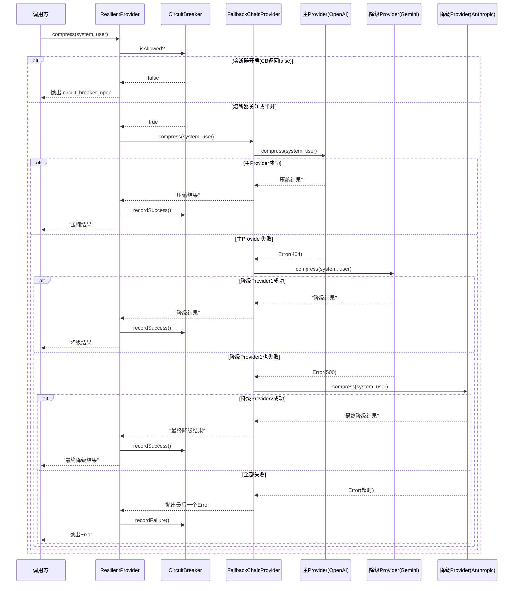
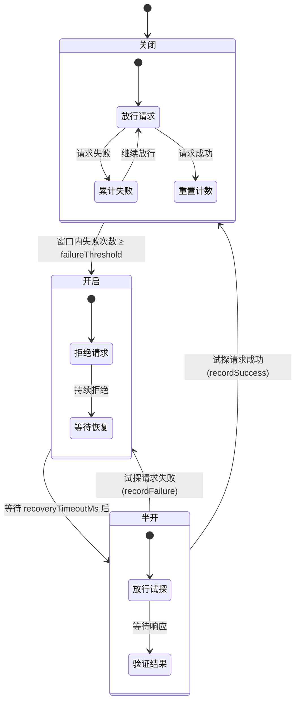
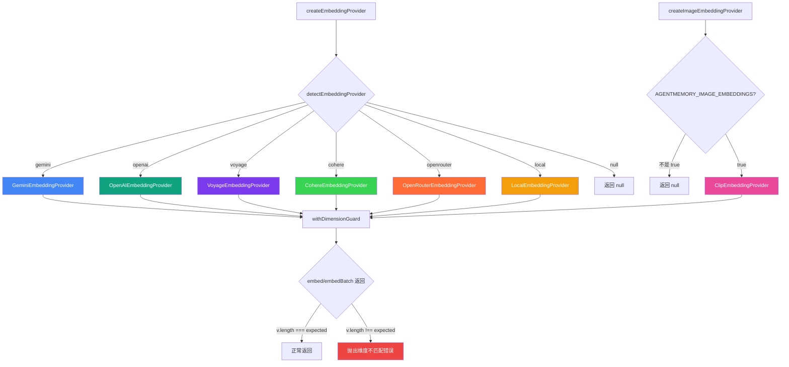
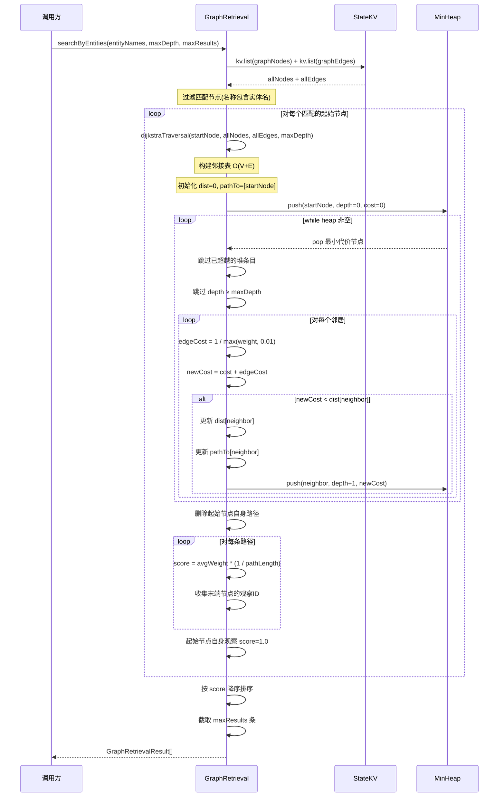
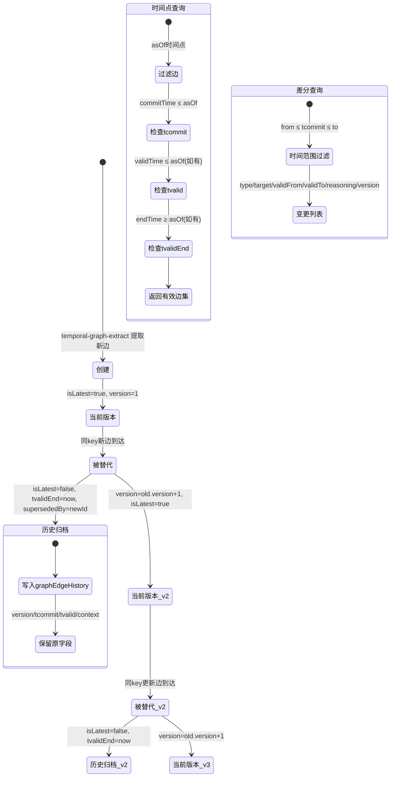

# Provider 与知识图谱层 — 模块分析文档

## 1. 模块概述

agentmemory 的 Provider 与知识图谱层是系统的两大核心基础设施：

- **Provider 层**：为 LLM 调用和向量嵌入提供统一抽象，通过工厂模式创建具体 Provider，再以装饰器链（降级链 → 熔断器 → 弹性 Provider）叠加可靠性保障。支持 6 种 LLM Provider 和 7 种 Embedding Provider，覆盖从云端 API 到本地推理的全场景。
- **知识图谱层**：从编码会话观察中提取实体与关系，构建持久化知识图谱，提供 Dijkstra 加权遍历检索、时序版本化边、查询扩展等能力，为混合检索提供图结构上下文。

两大层通过 `MemoryProvider` 接口耦合——图谱提取和查询扩展均依赖 Provider 的 `compress` 方法调用 LLM 完成结构化信息提取。

---

## 2. Provider 架构详解

### 2.1 三层装饰器架构

Provider 的创建遵循 **工厂 + 装饰器** 模式，形成三层嵌套结构：

| 层次 | 类 | 职责 |
|------|------|------|
| 内层（基础） | `AnthropicProvider` / `OpenAIProvider` / ... | 直接调用 LLM API，返回文本结果 |
| 中层（降级） | `FallbackChainProvider` | 持有多个基础 Provider，按序尝试直到成功 |
| 外层（弹性） | `ResilientProvider` | 内嵌 `CircuitBreaker`，在熔断器开启时直接拒绝请求 |

创建入口在 `src/providers/index.ts`：

- `createProvider(config)` → `new ResilientProvider(createBaseProvider(config))`
- `createFallbackProvider(config, fallbackConfig)` → 当降级列表非空时，`new ResilientProvider(new FallbackChainProvider([primary, ...fallbacks]))`

### 2.2 工厂方法

`createBaseProvider(config)` 根据 `config.provider` 分发到具体 Provider 构造函数：

| provider 值 | 创建的类 | 必需环境变量 |
|-------------|---------|-------------|
| `openai` | `OpenAIProvider` | `OPENAI_API_KEY` |
| `anthropic` | `AnthropicProvider` | `ANTHROPIC_API_KEY` |
| `gemini` | `OpenRouterProvider`（复用，指向 Google 端点） | `GEMINI_API_KEY` 或 `GOOGLE_API_KEY` |
| `openrouter` | `OpenRouterProvider` | `OPENROUTER_API_KEY` |
| `minimax` | `MinimaxProvider` | `MINIMAX_API_KEY` |
| `agent-sdk` | `AgentSDKProvider` | 无（使用 `@anthropic-ai/claude-agent-sdk`） |
| `noop` | `NoopProvider` | 无 |

**关键设计**：Gemini Provider 复用了 `OpenRouterProvider`，仅将 `baseUrl` 指向 Google 的 OpenAI 兼容端点。`name` 属性根据 URL 中是否包含 `openrouter` 动态决定。

### 2.3 降级链（FallbackChainProvider）

`FallbackChainProvider` 持有一个有序 Provider 数组，`tryAll()` 方法按序调用：

1. 对第一个 Provider 调用 `fn(provider)`
2. 成功则直接返回
3. 失败则记录错误，尝试下一个 Provider
4. 全部失败则抛出最后一个错误

**#778 修复**：降级 Provider 继承主 Provider 的 model 名称（如 Gemini 降级被调用 `gpt-4o-mini`），导致 404 并触发熔断。修复后每个降级 Provider 通过 `defaultModelFor()` 解析自己的默认模型。

### 2.4 熔断器（CircuitBreaker）

三态状态机，保护下游免受级联故障：

| 状态 | 行为 |
|------|------|
| **Closed**（关闭） | 正常放行所有请求，累计失败次数 |
| **Open**（开启） | 拒绝所有请求（`isAllowed` 返回 `false`），等待恢复超时 |
| **Half-Open**（半开） | 放行一次试探请求；成功则回 Closed，失败则回 Open |

参数默认值：

| 参数 | 默认值 | 含义 |
|------|--------|------|
| `failureThreshold` | 3 | 窗口内失败次数达到此值触发 Open |
| `failureWindowMs` | 60,000 | 失败计数窗口（1 分钟） |
| `recoveryTimeoutMs` | 30,000 | Open 状态持续时间（30 秒） |

### 2.5 弹性 Provider（ResilientProvider）

`ResilientProvider` 是最外层装饰器，将熔断器与基础 Provider 组合：

- 每次调用前检查 `breaker.isAllowed`
- 成功后调用 `breaker.recordSuccess()`
- 失败后调用 `breaker.recordFailure()`
- 熔断器开启时直接抛出 `circuit_breaker_open` 错误

---

## 3. 各 LLM Provider 实现对比

| 特性 | Anthropic | OpenAI | OpenRouter | MiniMax | AgentSDK | Noop |
|------|-----------|--------|------------|---------|----------|------|
| **传输方式** | Anthropic SDK | 原生 fetch | 原生 fetch | 原生 fetch | Claude Agent SDK | 无 |
| **消息格式** | system + messages | system/user roles | system/user roles | system + messages（Anthropic 兼容） | prompt + systemPrompt | — |
| **图片支持** | ✅ `describeImage` | ❌ | ❌ | ❌ | ❌ | ❌ |
| **Azure 支持** | ❌ | ✅ 自动检测 | ❌ | ❌ | ❌ | ❌ |
| **超时控制** | SDK 内置 | `OPENAI_TIMEOUT_MS` / `AGENTMEMORY_LLM_TIMEOUT_MS` | 全局 60s | 全局 60s | SDK 内置 | — |
| **Reasoning 模型** | ❌ | ✅ `reasoning_effort` + `reasoning_content` 回退 | ❌ | ❌ | ❌ | — |
| **Base URL 可配** | ✅ | ✅ | 硬编码 | ✅ `MINIMAX_BASE_URL` | ❌ | — |
| **默认模型** | `claude-sonnet-4-20250514` | `gpt-4o-mini` | `anthropic/claude-sonnet-4-20250514` | `MiniMax-M2.7` | `claude-sonnet-4-20250514` | `noop` |

**特殊实现细节**：

- **OpenAI Provider**：支持 Azure OpenAI（自动检测 `.openai.azure.com` 域名）、DeepSeek、硅基流动、vLLM/LM Studio/Ollama 等兼容端点。显式发送 `stream: false` 以兼容非标准代理。对 reasoning 模型（DeepSeek V4/Qwen3/GLM/Kimi）回退到 `reasoning_content` 或 `reasoning` 字段。
- **MiniMax Provider**：使用 Anthropic 兼容 API（`x-api-key` + `anthropic-version` 头），绕过 Anthropic SDK 的 `x-stainless-*` 头（MiniMax 会 403 拒绝）。
- **AgentSDK Provider**：使用 `AsyncLocalStorage` 做进程内递归守卫（解决 Promise.all 并行 chunk 的互相干扰），使用引用计数的 `process.env.AGENTMEMORY_SDK_CHILD` 做跨进程递归守卫（防止 hook 脚本回调导致无限递归）。

---

## 4. Embedding Provider 详解

### 4.1 Embedding 工厂

`createEmbeddingProvider()` 通过 `detectEmbeddingProvider()` 检测环境变量，返回对应的 Embedding Provider 实例。`createImageEmbeddingProvider()` 仅在 `AGENTMEMORY_IMAGE_EMBEDDINGS=true` 时激活 CLIP Provider。

### 4.2 各 Embedding Provider 对比

| Provider | 默认模型 | 维度 | 传输方式 | 特殊能力 |
|----------|---------|------|---------|---------|
| **OpenAI** | `text-embedding-3-small` | 1536（可配） | 原生 fetch | Azure 支持、独立 base URL / API key |
| **Gemini** | `gemini-embedding-001` | 768 | 原生 fetch | L2 归一化、100 条批量限制 |
| **Voyage** | `voyage-code-3` | 1024 | 原生 fetch | 代码优化 |
| **Cohere** | `embed-english-v3.0` | 1024 | 原生 fetch | `search_document` 输入类型 |
| **OpenRouter** | `openai/text-embedding-3-small` | 1536 | 原生 fetch | 模型可配 |
| **Local** | `Xenova/all-MiniLM-L6-v2` | 384 | 本地推理 | 零网络依赖 |
| **CLIP** | `Xenova/clip-vit-base-patch32` | 512 | 本地推理 | 图片嵌入 |

### 4.3 维度守卫（withDimensionGuard）

`withDimensionGuard()` 是一个关键防护装饰器，解决向量索引静默损坏问题：

**问题**：`vector-index.ts` 的 `cosineSimilarity` 在向量长度不匹配时返回 0 而非抛错，导致错误维度的向量被存储后永远不会被检索到，记忆变为"不可见"。

**方案**：用 `Object.create(provider)` 创建原型链保留的代理对象，在 `embed` / `embedBatch` / `embedImage` 返回时检查 `v.length !== expected`，不匹配则抛出明确错误。

```typescript
const wrapped = Object.create(provider) as EmbeddingProvider;
wrapped.embed = async (t) => check(await provider.embed(t), "embed");
wrapped.embedBatch = async (ts) => {
  const out = await provider.embedBatch(ts);
  out.forEach((v, i) => check(v, `embedBatch[${i}]`));
  return out;
};
```

---

## 5. 知识图谱构建流程

### 5.1 核心函数

`mem::graph-extract` 是图谱构建的入口，流程如下：

1. **输入**：一组 `CompressedObservation`（含 title、narrative、concepts、files、type）
2. **LLM 提取**：调用 `provider.compress(GRAPH_EXTRACTION_SYSTEM, prompt)`，让 LLM 输出 XML 格式的实体和关系
3. **XML 解析**：`parseGraphXml()` 解析 LLM 返回的 XML，支持自闭合 `<entity/>` 和带 body 的 `<entity>...<property>...</entity>` 两种格式
4. **节点合并**：通过 `nameIndexKey(type, name)` 做 O(1) 查找，已存在则合并属性和观察 ID
5. **边合并**：通过 `edgeIndexKey(sourceId, targetId, type)` 做 O(1) 查找，已存在则合并观察 ID
6. **快照更新**：增量更新 `GraphSnapshot`（topNodes/topEdges/degree/stats）

### 5.2 O(1) 索引查找

为解决 75K+ 节点语料下 `kv.list` 超时问题（#814），引入三个辅助 KV scope：

| KV Scope | Key 格式 | Value | 用途 |
|----------|---------|-------|------|
| `graphNameIndex` | `{type}\|{name}` | nodeId | 按 type+name O(1) 查找节点 |
| `graphEdgeKey` | `{sourceId}\|{targetId}\|{type}` | edgeId | 按三元组 O(1) 查找边 |
| `graphNodeDegree` | nodeId | degree 数值 | 增量度数计数 |

### 5.3 快照机制

`GraphSnapshot` 存储在 `KV.graphSnapshot["current"]`，包含：

- **topNodes**：按度数降序排列的 Top-N 节点（N=500）
- **topEdges**：两端点均在 topNodes 中的边
- **topDegrees**：topNodes 中每个节点的度数缓存（避免排序时异步 kv.get）
- **stats**：全局统计（totalNodes/totalEdges/nodesByType/edgesByType）

快照在每次 `graph-extract` 时增量更新，通过 `applyDegreeDelta()` 维护 top-N 排名。

### 5.4 图谱查询（mem::graph-query）

三条查询路径：

| 路径 | 触发条件 | 数据源 |
|------|---------|--------|
| 快照路径 | 无 query 且无 startNodeId | 仅读快照 |
| 文本搜索 | 有 query | 实时枚举（有超时保护） |
| BFS 遍历 | 有 startNodeId | 实时枚举（有超时保护） |

实时枚举路径有 6 秒超时保护（`LIVE_ENUMERATION_BUDGET_MS`），超时后降级到快照。

---

## 6. 图谱检索算法（Dijkstra 加权遍历）

### 6.1 算法概述

`GraphRetrieval.dijkstraTraversal()` 实现加权最短路径遍历，替代了原先忽略边权重的 BFS：

- **代价函数**：`cost = 1 / weight`（权重越高，代价越低，关系越强）
- **数据结构**：自实现二叉最小堆（`MinHeap`），O(log V) 弹出
- **邻接表**：O(V+E) 一次性构建，替代原先 O(V·E) 的逐节点过滤

### 6.2 评分公式

```typescript
score = avgWeight * (1 / pathLength)
```

- `avgWeight`：路径上所有边权重的平均值
- `pathLength`：路径长度（节点数）
- 起始节点自身的观察直接赋予 `score = 1.0`

### 6.3 两种检索模式

| 方法 | 入口 | 场景 |
|------|------|------|
| `searchByEntities(entityNames)` | 实体名称匹配 | 从用户查询中提取的实体出发检索 |
| `expandFromChunks(obsIds)` | 观察ID | 从已有检索结果的关联节点扩展 |

### 6.4 时序查询

`temporalQuery(entityName, asOf?)` 支持时间点查询：

- 无 `asOf`：返回当前最新边 + 历史边
- 有 `asOf`：过滤 `tcommit` / `tvalid` / `tvalidEnd` 符合时间点的边

---

## 7. 时序图谱版本化机制

### 7.1 版本化边模型

`GraphEdge` 的时序字段：

| 字段 | 含义 |
|------|------|
| `tcommit` | 事务提交时间（何时被记录到系统） |
| `tvalid` | 有效起始时间（何时成为事实） |
| `tvalidEnd` | 有效结束时间（何时不再为事实） |
| `version` | 版本号（从 1 递增） |
| `isLatest` | 是否为最新版本 |
| `supersededBy` | 被哪条边替代（指向新版本的 edgeId） |

### 7.2 版本化流程（mem::temporal-graph-extract）

1. 解析 LLM 返回的时序 XML（含 `valid_from` / `valid_to` / `<reasoning>` / `<sentiment>` / `<alternatives>`）
2. 节点合并：按 name+type 匹配，合并 aliases
3. 边版本化：
   - 找到同 key（`sourceId|targetId|type`）的已有边
   - 将已有边标记为 `isLatest: false`，设置 `tvalidEnd` 和 `supersededBy`
   - 将旧边副本写入 `KV.graphEdgeHistory`
   - 新边 `version = old.version + 1`，`isLatest = true`

### 7.3 时序查询（mem::temporal-query）

返回 `TemporalState`：

- `entity`：匹配的节点
- `currentEdges`：当前有效的边（`isLatest !== false`）
- `historicalEdges`：历史版本边
- `timeline`：按 `tcommit` 排序的时间线

### 7.4 差分状态（mem::differential-state）

比较两个时间点之间的变化：

- 过滤 `[from, to]` 时间范围内的边
- 返回每条变化的 `type`、`target`、`validFrom`、`validTo`、`reasoning`、`sentiment`、`version`、`isLatest`

---

## 8. 查询扩展策略

### 8.1 LLM 驱动扩展（mem::expand-query）

通过 LLM 生成多样化的查询改写，输出 XML 格式：

```xml
<expansion>
  <reformulations>
    <query>语义改写 1</query>
    <query>语义改写 2</query>
    <query>语义改写 3</query>
  </reformulations>
  <temporal>
    <query>时间具体化版本</query>
  </temporal>
  <entities>
    <entity>提取的实体名 1</entity>
    <entity>提取的实体名 2</entity>
  </entities>
</expansion>
```

规则：
- 生成 3-5 条改写，覆盖不同解读
- 包含释义、领域特定重述、抽象/具体变体
- 提取命名实体（人名、文件、项目、库、概念）
- 对时间相关查询生成时间具体化版本
- 每条改写不超过 100 字符

### 8.2 规则实体提取（extractEntitiesFromQuery）

不依赖 LLM 的轻量实体提取：

1. **引号提取**：匹配 `"..."` 中的内容
2. **大写词提取**：匹配 `[A-Z][a-zA-Z0-9_.-]+`，排除停用词（The/This/How/Why 等 30+ 个）

两种策略互补：LLM 扩展提供语义深度，规则提取提供确定性和低延迟。

---

## 9. 关键设计模式

### 9.1 装饰器链模式

Provider 三层嵌套是经典的装饰器模式，每层只关注一个横切关注点：

- 基础层：API 调用逻辑
- 降级层：多 Provider 容错
- 弹性层：熔断保护

### 9.2 工厂方法模式

`createBaseProvider()` / `createEmbeddingProvider()` / `createImageEmbeddingProvider()` 封装了创建逻辑，调用方只需传入配置即可获得完整装饰的 Provider。

### 9.3 状态机模式

`CircuitBreaker` 的三态转换是典型的有限状态机，状态转换由 `recordSuccess()` / `recordFailure()` / `isAllowed` 驱动。

### 9.4 O(1) 索引 + 增量快照

图谱的 `nameIndex` / `edgeKey` / `nodeDegree` 三个辅助索引将合并查找从 O(n) 降到 O(1)，快照增量更新避免全量重建。

### 9.5 递归守卫（AgentSDK Provider）

双层递归守卫：
- 进程内：`AsyncLocalStorage` 隔离并发调用树
- 跨进程：引用计数的 `process.env` 标记

### 9.6 维度守卫（Embedding Provider）

`withDimensionGuard()` 使用 `Object.create()` 保留原型链，在嵌入结果返回时校验维度一致性。

### 9.7 超时预算模式

图谱查询的 `LIVE_ENUMERATION_BUDGET_MS` 和 Provider 的 `fetchWithTimeout` 都采用超时预算模式，避免长时间阻塞 iii-engine 的调用超时。

---

## 10. Mermaid 图表

### 10.1 Provider 三层装饰器架构图

```mermaid
classDiagram
    class MemoryProvider {
        <<interface>>
        +name: string
        +compress(systemPrompt, userPrompt) Promise~string~
        +summarize(systemPrompt, userPrompt) Promise~string~
    }

    class AnthropicProvider {
        +name: anthropic
        -client: Anthropic
        -model: string
        -maxTokens: number
        +compress(systemPrompt, userPrompt) Promise~string~
        +summarize(systemPrompt, userPrompt) Promise~string~
        +describeImage(imageData, mimeType, prompt) Promise~string~
    }

    class OpenAIProvider {
        +name: openai
        -apiKey: string
        -model: string
        -baseUrl: string
        -isAzure: boolean
        -reasoningEffort: string
        -timeoutMs: number
        +compress(systemPrompt, userPrompt) Promise~string~
        +summarize(systemPrompt, userPrompt) Promise~string~
    }

    class OpenRouterProvider {
        +name: openrouter|gemini
        -apiKey: string
        -model: string
        -baseUrl: string
        +compress(systemPrompt, userPrompt) Promise~string~
        +summarize(systemPrompt, userPrompt) Promise~string~
    }

    class MinimaxProvider {
        +name: minimax
        -apiKey: string
        -model: string
        -baseUrl: string
        +compress(systemPrompt, userPrompt) Promise~string~
        +summarize(systemPrompt, userPrompt) Promise~string~
    }

    class AgentSDKProvider {
        +name: agent-sdk
        -sdkPromise: Promise
        +compress(systemPrompt, userPrompt) Promise~string~
        +summarize(systemPrompt, userPrompt) Promise~string~
    }

    class NoopProvider {
        +name: noop
        +compress() Promise~string~
        +summarize() Promise~string~
    }

    class FallbackChainProvider {
        +name: fallback(A -> B -> C)
        -providers: MemoryProvider[]
        +compress(systemPrompt, userPrompt) Promise~string~
        +summarize(systemPrompt, userPrompt) Promise~string~
        -tryAll(fn) Promise~string~
    }

    class ResilientProvider {
        +name: resilient(inner.name)
        -inner: MemoryProvider
        -breaker: CircuitBreaker
        +compress(systemPrompt, userPrompt) Promise~string~
        +summarize(systemPrompt, userPrompt) Promise~string~
        +circuitState: CircuitBreakerState
        -call(fn) Promise~string~
    }

    class CircuitBreaker {
        -state: closed|open|half-open
        -failures: number
        -failureThreshold: number
        -failureWindowMs: number
        -recoveryTimeoutMs: number
        +isAllowed: boolean
        +recordSuccess() void
        +recordFailure() void
        +getState() CircuitBreakerState
    }

    MemoryProvider <|.. AnthropicProvider
    MemoryProvider <|.. OpenAIProvider
    MemoryProvider <|.. OpenRouterProvider
    MemoryProvider <|.. MinimaxProvider
    MemoryProvider <|.. AgentSDKProvider
    MemoryProvider <|.. NoopProvider
    MemoryProvider <|.. FallbackChainProvider
    MemoryProvider <|.. ResilientProvider

    FallbackChainProvider o-- MemoryProvider : providers[]
    ResilientProvider o-- MemoryProvider : inner
    ResilientProvider *-- CircuitBreaker : breaker
```



### 10.2 Provider 降级链完整时序图



### 10.3 熔断器三态状态机



### 10.4 Embedding Provider 选择决策树



### 10.5 知识图谱构建流程图

```mermaid
flowchart TD
    A[观察数据 CompressedObservation] --> B[buildGraphExtractionPrompt]
    B --> C[provider.compress 提取系统提示词 + 用户提示词]
    C --> D[LLM 返回 XML]
    D --> E[parseGraphXml 解析]

    E --> F[遍历解析出的节点]
    F --> G{nameIndexKey: type|name}
    G --> H[kv.get graphNameIndex]
    H -->|找到 existingId| I[kv.get graphNodes 获取已有节点]
    I --> J[mergeNode 合并属性+观察ID]
    J --> K[kv.set graphNodes 更新]
    H -->|未找到| L[kv.set graphNodes 新建]
    L --> M[kv.set graphNameIndex 写入索引]
    L --> N[kv.set graphNodeDegree 初始化度数=0]

    E --> O[遍历解析出的边]
    O --> P{edgeIndexKey: srcId|tgtId|type}
    P --> Q[kv.get graphEdgeKey]
    Q -->|找到 existingId| R[kv.get graphEdges 获取已有边]
    R --> S[mergeEdge 合并观察ID]
    S --> T[kv.set graphEdges 更新]
    Q -->|未找到| U[kv.set graphEdges 新建]
    U --> V[kv.set graphEdgeKey 写入索引]
    U --> W[applyDegreeDelta srcNode +1]
    U --> X[applyDegreeDelta tgtNode +1]

    K --> Y[增量更新 GraphSnapshot]
    T --> Y
    N --> Y
    W --> Y
    X --> Y
    Y --> Z[kv.set graphSnapshot 持久化快照]

    style G fill:#3b82f6,color:#fff
    style P fill:#3b82f6,color:#fff
    style H fill:#10b981,color:#fff
    style Q fill:#10b981,color:#fff
```

### 10.6 Dijkstra 加权遍历检索时序图



### 10.7 时序图谱版本化边生命周期图



### 10.8 查询扩展与实体提取流程图

```mermaid
flowchart TD
    A[用户查询] --> B(mem::expand-query)
    A --> C(extractEntitiesFromQuery)

    B --> D[provider.compress 扩展系统提示词]
    D --> E[LLM 返回 XML]
    E --> F[parseExpansionXml 解析]

    F --> G[reformulations: 3-5条语义改写]
    F --> H[temporalConcretizations: 时间具体化]
    F --> I[entityExtractions: LLM提取实体]

    C --> J{引号匹配}
    J -->|找到 "..."| K[提取引号内内容]
    C --> L{大写词匹配}
    L -->|找到 [A-Z][a-zA-Z0-9_.-]+| M{是否停用词?}
    M -->|是| N[跳过]
    M -->|否| O[提取为实体]

    G --> P[合并结果]
    H --> P
    I --> P
    K --> P
    O --> P

    P --> Q[去重]
    Q --> R[输出: QueryExpansion]

    style D fill:#8b5cf6,color:#fff
    style J fill:#f59e0b,color:#fff
    style L fill:#f59e0b,color:#fff
    style P fill:#10b981,color:#fff
```
