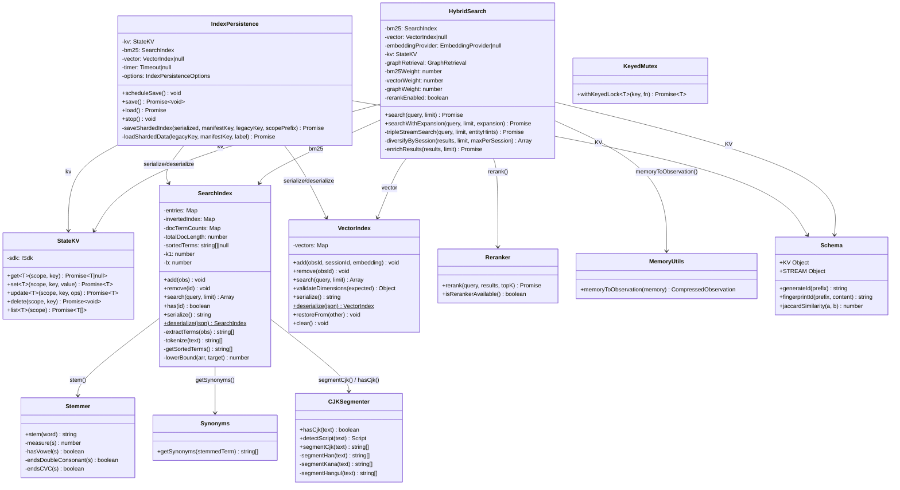
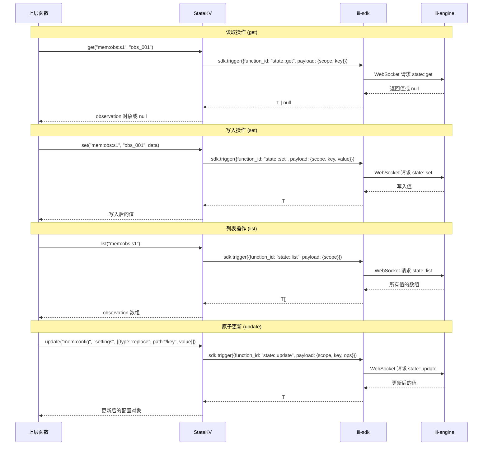
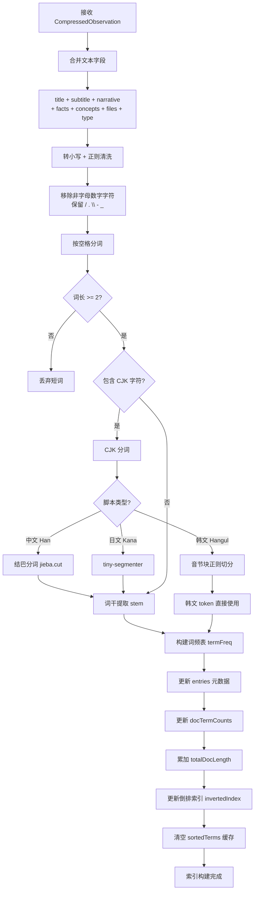
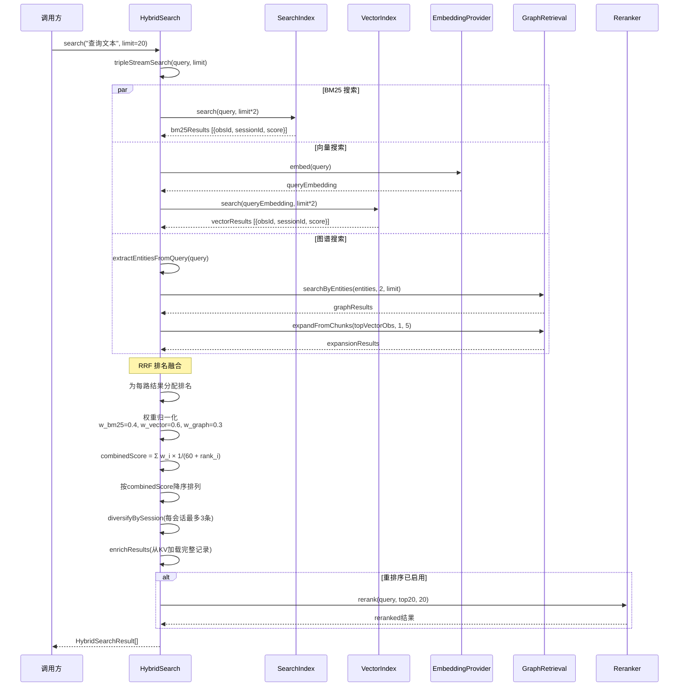
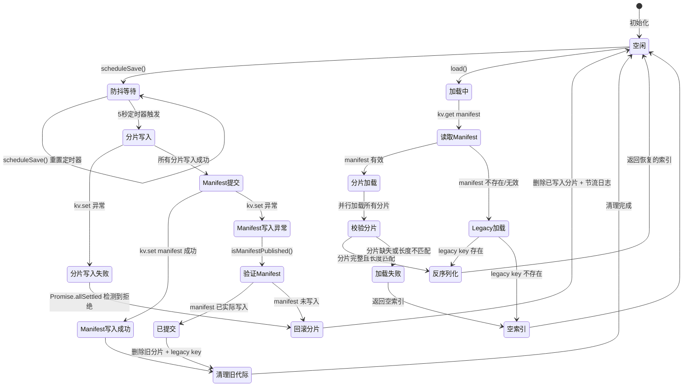
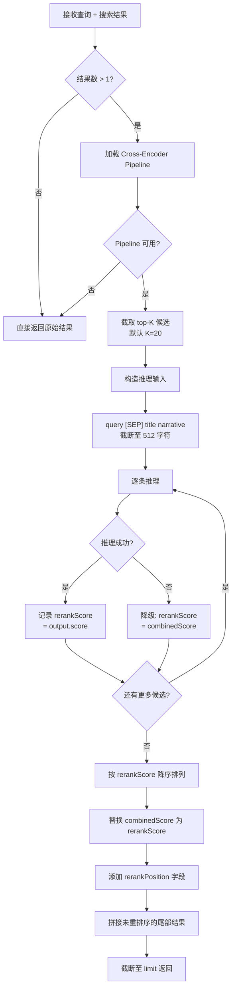

# 存储层（State & Storage Layer）模块分析

## 1. 模块概述

存储层是 agentmemory 系统的底座，负责所有持久化状态的管理、索引构建与搜索。它基于 iii-engine 的 StateModule（文件型 SQLite）提供 KV 存储，并在其上构建了 BM25 全文索引、向量语义索引、知识图谱检索三路混合搜索能力。整个存储层采用纯内存索引 + 定期持久化的策略，在保证搜索性能的同时通过分片（sharding）和代际（generation）机制实现可靠的索引持久化。

核心设计原则：
- **KV 抽象**：所有持久化操作通过 `StateKV` 类统一封装，底层委托给 iii-engine 的 `state::get/set/delete/list` 函数
- **内存索引 + 延迟持久化**：BM25 和向量索引常驻内存，变更后通过 5 秒防抖定时器异步刷盘
- **三路检索融合**：BM25 关键词搜索 + 向量语义搜索 + 知识图谱实体搜索，通过 RRF（Reciprocal Rank Fusion）算法融合排序
- **可选重排序**：融合结果可经过 Cross-Encoder 重排序模型精排
- **CJK 友好**：内置中文（结巴分词）、日文（tiny-segmenter）、韩文分词支持

---

## 2. 核心组件详解

### 2.1 StateKV（`src/state/kv.ts`）

**职责**：对 iii-sdk 的 `state::*` 函数族的类型安全封装，提供统一的 KV 存储访问接口。

**关键接口**：

| 方法 | 签名 | 说明 |
|------|------|------|
| `get` | `get<T>(scope, key): Promise<T \| null>` | 按 scope + key 读取值，不存在返回 null |
| `set` | `set<T>(scope, key, value): Promise<T>` | 写入值并返回写入的值 |
| `update` | `update<T>(scope, key, ops): Promise<T>` | 原子局部更新（JSON Patch 风格） |
| `delete` | `delete(scope, key): Promise<void>` | 删除指定 key |
| `list` | `list<T>(scope): Promise<T[]>` | 列出 scope 下所有值 |

**核心设计**：
- 所有方法内部通过 `sdk.trigger()` 调用 iii-engine 的 `state::get/set/update/delete/list` 函数
- 泛型参数 `<T>` 提供类型推断，调用方无需手动断言
- `update` 方法支持 JSON Patch 风格的 ops 数组（`{ type, path, value }`），实现原子局部更新

### 2.2 Schema（`src/state/schema.ts`）

**职责**：定义所有 KV scope 的命名规范，提供 ID 生成和文本相似度工具函数。

**KV Scope 命名规范**：

| Scope | 命名 | 说明 |
|-------|------|------|
| 会话 | `mem:sessions` | 会话元数据 |
| 观察 | `mem:obs:${sessionId}` | 按会话分 scope 的观察记录 |
| 记忆 | `mem:memories` | 持久化记忆 |
| 摘要 | `mem:summaries` | 会话摘要 |
| 配置 | `mem:config` | 系统配置 |
| 嵌入 | `mem:emb:${obsId}` | 按观察 ID 分 scope 的嵌入向量 |
| BM25 索引 | `mem:index:bm25` | 全文搜索索引 |
| 关系 | `mem:relations` | 实体关系 |
| 图节点 | `mem:graph:nodes` | 知识图谱节点 |
| 图边 | `mem:graph:edges` | 知识图谱边 |
| 图快照 | `mem:graph:snapshot` | 预计算的高度子图快照 |
| 图名索引 | `mem:graph:name-index` | 节点名称反查索引 |
| 图边键 | `mem:graph:edge-key` | 边去重索引 |
| 图节点度 | `mem:graph:node-degree` | 节点度数索引 |
| 语义记忆 | `mem:semantic` | 语义记忆 |
| 程序记忆 | `mem:procedural` | 程序记忆 |
| 团队共享 | `mem:team:${teamId}:shared` | 按团队分 scope |
| 审计 | `mem:audit` | 审计日志 |
| 动作 | `mem:actions` | 动作记录 |
| 租约 | `mem:leases` | 分布式锁租约 |
| 晶体 | `mem:crystals` | 晶体化记忆 |
| 槽位 | `mem:slots` | 工作记忆槽位 |

**工具函数**：

- `generateId(prefix)` — 基于时间戳（36 进制）+ 随机 UUID 生成唯一 ID，格式：`${prefix}_${ts}_${rand}`
- `fingerprintId(prefix, content)` — 基于 SHA-256 哈希的内容寻址 ID，格式：`${prefix}_${hash.slice(0,16)}`，用于去重
- `jaccardSimilarity(a, b)` — 基于 Jaccard 系数的文本相似度计算，将文本按空格分词后计算集合交集/并集比

### 2.3 VectorIndex（`src/state/vector-index.ts`）

**职责**：内存向量索引，支持向量添加、删除、余弦相似度搜索、序列化/反序列化。

**关键接口**：

| 方法 | 签名 | 说明 |
|------|------|------|
| `add` | `add(obsId, sessionId, embedding): void` | 添加向量到索引 |
| `remove` | `remove(obsId): void` | 从索引中移除向量 |
| `search` | `search(query, limit): Array<{obsId, sessionId, score}>` | 余弦相似度搜索，返回 top-K |
| `validateDimensions` | `validateDimensions(expected): {mismatches, seenDimensions}` | 校验所有向量维度一致性 |
| `serialize` | `serialize(): string` | 序列化为 JSON（Base64 编码向量） |
| `deserialize` | `static deserialize(json): VectorIndex` | 从 JSON 反序列化 |
| `restoreFrom` | `restoreFrom(other): void` | 从另一个实例深拷贝恢复 |

**核心算法 — 余弦相似度搜索**：
- 暴力扫描所有向量，计算余弦相似度
- 维护一个大小为 `limit` 的最小堆：当结果未满时直接插入，满后仅替换最低分项
- 每次替换后重新排序以维护堆性质
- 最终按分数降序返回

**序列化设计**：
- 向量数据使用 Base64 编码存储，避免 JSON 数字数组的精度和体积问题
- 显式传递 `byteOffset` 和 `byteLength` 解决 Node.js Buffer 池切片问题（#455/#469/#584/#587）

**维度校验**：
- `validateDimensions()` 用于启动时检查磁盘加载的索引是否与当前嵌入模型维度匹配
- 防止混合维度向量导致搜索结果异常

### 2.4 SearchIndex（`src/state/search-index.ts`）

**职责**：BM25 全文搜索索引，支持文档添加、删除、搜索、序列化/反序列化。

**关键接口**：

| 方法 | 签名 | 说明 |
|------|------|------|
| `add` | `add(obs: CompressedObservation): void` | 索引一条观察记录 |
| `remove` | `remove(id): void` | 移除索引条目 |
| `search` | `search(query, limit): Array<{obsId, sessionId, score}>` | BM25 搜索 |
| `has` | `has(id): boolean` | 检查条目是否存在 |
| `serialize` | `serialize(): string` | 序列化为 JSON（v2 格式） |
| `deserialize` | `static deserialize(json): SearchIndex` | 反序列化 |

**核心数据结构**：

```
entries:        Map<obsId, IndexEntry>          // 文档元数据
invertedIndex:  Map<term, Set<obsId>>           // 倒排索引
docTermCounts:  Map<obsId, Map<term, number>>   // 文档词频
totalDocLength: number                           // 全局文档长度总和
sortedTerms:    string[] | null                  // 排序后的词项列表（懒计算）
```

**核心算法 — BM25 评分**：

参数：`k1 = 1.2`，`b = 0.75`

```
IDF(q) = log((N - df(q) + 0.5) / (df(q) + 0.5) + 1)
TF_component = tf(q,d) * (k1 + 1) / (tf(q,d) + k1 * (1 - b + b * |d| / avgdl))
score(d,q) = Σ IDF(qi) * TF_component(qi,d) * weight(qi)
```

**搜索增强**：
1. **同义词扩展**：查询词通过 `getSynonyms()` 获取同义词，同义词权重降为 0.7
2. **前缀匹配**：利用排序词项列表 + 二分查找（`lowerBound`），对查询词的前缀匹配项给予 0.5 倍 IDF 权重
3. **CJK 分词**：中文走结巴分词，日文走 tiny-segmenter，韩文按音节块切分

**文本处理流程**：
1. 合并 `title + subtitle + narrative + facts + concepts + files + type`
2. 转小写，正则清洗非字母数字字符
3. 按空格分词，短词（< 2 字符）过滤
4. CJK 文本走 `segmentCjk()`，非 CJK 文本走 `stem()` 词干提取

### 2.5 HybridSearch（`src/state/hybrid-search.ts`）

**职责**：三路混合搜索引擎，融合 BM25、向量、知识图谱三路检索结果。

**构造参数**：

| 参数 | 默认值 | 说明 |
|------|--------|------|
| `bm25Weight` | 0.4 | BM25 路权重 |
| `vectorWeight` | 0.6 | 向量路权重 |
| `graphWeight` | 0.3 | 图谱路权重 |
| `rerankEnabled` | `RERANK_ENABLED === "true"` | 是否启用重排序 |

**核心算法 — RRF（Reciprocal Rank Fusion）**：

```
RRF_K = 60
combinedScore = w_bm25 * 1/(RRF_K + rank_bm25)
             + w_vector * 1/(RRF_K + rank_vector)
             + w_graph  * 1/(RRF_K + rank_graph)
```

权重归一化：当某路无结果时，其权重置零，剩余权重按比例归一化，确保总分可比。

**搜索流程（`tripleStreamSearch`）**：

1. **BM25 搜索**：`bm25.search(query, limit * 2)`
2. **向量搜索**：若向量索引非空且有嵌入提供者，先获取查询嵌入，再 `vector.search(embedding, limit * 2)`
3. **图谱搜索**：
   - 从查询中提取实体 → `graphRetrieval.searchByEntities(entities, 2, limit)`
   - 取向量搜索 top-5 结果 → `graphRetrieval.expandFromChunks(topVectorObs, 1, 5)` 扩展关联节点
4. **RRF 融合**：三路结果按排名计算 RRF 分数，权重归一化后加权求和
5. **会话多样性**：`diversifyBySession()` 限制每个会话最多 3 条结果，避免单会话霸占
6. **结果丰富**：`enrichResults()` 从 KV 加载完整观察记录（优先 observations scope，回退 memories scope）
7. **重排序**：若启用，对 top-20 结果调用 Cross-Encoder 重排序

**查询扩展搜索（`searchWithExpansion`）**：
- 接收查询改写、时间具体化、实体提取等扩展信息
- 对所有查询变体并行执行 `tripleStreamSearch`
- 合并结果集，相同 obsId 取最高 combinedScore
- 按分数降序截断至 limit

### 2.6 IndexPersistence（`src/state/index-persistence.ts`）

**职责**：索引的持久化管理，包括防抖保存、分片写入、代际切换、加载恢复。

**关键常量**：

| 常量 | 值 | 说明 |
|------|-----|------|
| `DEBOUNCE_MS` | 5000 | 防抖间隔（5 秒） |
| `FAILURE_LOG_THROTTLE_MS` | 60000 | 失败日志节流间隔 |
| `DEFAULT_INDEX_SHARD_CHARS` | 2,000,000 | 默认分片大小（约 2MB 字符） |

**分片持久化协议**：

```
IndexShardManifest = {
  v: 1,
  generation: string,      // 代际 ID（idx_开头）
  shards: Array<{
    scope: string,          // 分片 KV scope
    key: string,            // 分片 KV key
    chars: number           // 分片字符数
  }>,
  chars: number             // 总字符数
}
```

**保存流程（`saveShardedIndex`）**：

1. 读取旧 manifest
2. 生成新代际 ID
3. 将序列化数据按 `shardChars` 切分为多个 chunk
4. 并行写入所有分片（`Promise.allSettled`）
5. 若任一分片写入失败，回滚删除已写入分片
6. 写入新 manifest（原子提交点）
7. 若 manifest 写入异常，验证是否已实际写入（`isManifestPublished`）
8. 清理旧格式 legacy key
9. 清理上一代际的废弃分片

**加载流程（`loadShardedData`）**：

1. 尝试读取 manifest
2. 若 manifest 存在且有效，按 manifest 加载所有分片
3. 校验每个分片的字符数与 manifest 记录一致
4. 校验总字符数与 manifest 记录一致
5. 拼接所有分片返回完整数据
6. 若 manifest 不存在，回退到 legacy 单 key 加载

**防抖机制**：
- `scheduleSave()` 设置 5 秒定时器，重复调用会重置定时器
- 定时器触发时执行 `save()`，异常通过 `logFailure()` 吞没（不抛出）
- 失败日志 60 秒节流，避免高负载下日志洪泛

### 2.7 Reranker（`src/state/reranker.ts`）

**职责**：基于 Cross-Encoder 模型的搜索结果重排序。

**核心设计**：
- 懒加载 `@xenova/transformers` 的 `text-classification` pipeline
- 模型：`Xenova/ms-marco-MiniLM-L-6-v2`（量化版）
- 加载失败后标记 `pipelineUnavailable = true`，后续不再尝试
- 使用 `pipelineLoading` Promise 防止并发加载

**重排序流程**：

1. 检查结果数量 > 1
2. 加载 pipeline（懒加载 + 单例）
3. 截取 top-K 候选
4. 对每个候选构造输入：`${query} [SEP] ${title} ${narrative}`（截断至 512 字符）
5. 逐条推理获取相关性分数
6. 按分数降序重排，`combinedScore` 替换为 `rerankScore`
7. 添加 `rerankPosition` 字段标记重排位置

**降级策略**：
- pipeline 不可用时直接返回原始结果
- 单条推理失败时使用原始 `combinedScore` 作为 `rerankScore`

### 2.8 KeyedMutex（`src/state/keyed-mutex.ts`）

**职责**：基于 key 的互斥锁，保证同一 key 下的异步操作串行执行。

**核心算法**：

```typescript
function withKeyedLock<T>(key: string, fn: () => Promise<T>): Promise<T>
```

- 维护全局 `Map<string, Promise<void>>` 作为锁队列
- 新请求链接到前一个 Promise 的 `.then()`，形成链式等待
- 无论前一个操作成功或失败，后续操作都会执行
- 操作完成后清理 Map 条目（仅当 Map 中的值仍是当前 Promise 时才删除，防止误删）

**适用场景**：
- 图谱提取的读-改-写操作
- 索引持久化的保存操作
- 任何需要按 key 串行化的并发操作

### 2.9 Stemmer（`src/state/stemmer.ts`）

**职责**：Porter Stemmer 算法的 TypeScript 实现，用于英文词干提取。

**算法步骤**：

1. **Step 1a**：处理复数后缀（sses → ss, ies → i, s → 删除）
2. **Step 1b**：处理过去式/进行式（eed → ee, ed/ing → 删除 + 补偿规则）
3. **Step 1c**：y → i（当前面有元音时）
4. **Step 2**：双后缀映射（ational → ate, ization → ize 等 20 条规则）
5. **Step 3**：三后缀映射（icate → ic, alize → al 等 7 条规则）
6. **Step 4**：四后缀删除（移除 al/ance/ence/er/ic 等后缀，measure > 1 时）
7. **Step 5a**：删除末尾 e（measure > 1 或 measure = 1 且非 CVC 结尾）
8. **Step 5b**：双写 l 去重（ll → l，measure > 1 时）

**辅助函数**：
- `measure(s)` — 计算辅音-元音序列数（VC 对数）
- `hasVowel(s)` — 检查是否包含元音
- `endsDoubleConsonant(s)` — 检查是否以双辅音结尾
- `endsCVC(s)` — 检查是否以 辅音-元音-辅音 结尾（且最后辅音非 w/x/y）

### 2.10 Synonyms（`src/state/synonyms.ts`）

**职责**：同义词映射表，用于 BM25 搜索时的查询扩展。

**设计**：
- 定义 46 组同义词组，涵盖开发领域常见缩写和全称
- 初始化时对所有同义词进行词干提取（`stem()`），构建 `Map<stemmedTerm, Set<stemmedSynonym>>`
- `getSynonyms(stemmedTerm)` 返回给定词干的所有同义词词干

**典型同义词组**：
- `auth / authentication / authn`
- `db / database / datastore`
- `k8s / kubernetes / kube`
- `ts / typescript`
- `api / endpoint / endpoints`

### 2.11 CJK Segmenter（`src/state/cjk-segmenter.ts`）

**职责**：CJK（中日韩）文本分词器，支持中文、日文、韩文三种文字系统。

**脚本检测**：

| 函数 | 说明 |
|------|------|
| `hasCjk(text)` | 检测文本是否包含 CJK 字符 |
| `detectScript(text)` | 识别主要脚本类型（han/kana/hangul/other） |

**分词策略**：

| 脚本 | 分词器 | 依赖包 | 降级策略 |
|------|--------|--------|----------|
| 中文（Han） | 结巴分词 | `@node-rs/jieba` | 整串作为一个 token |
| 日文（Kana） | tiny-segmenter | `tiny-segmenter` | 整串作为一个 token |
| 韩文（Hangul） | 音节块正则 | 无外部依赖 | — |

**分词流程（`segmentCjk`）**：

1. 用 `CJK_RUN_RE` 正则匹配所有 CJK 连续片段
2. 对每个片段按脚本类型分发到对应分词器
3. 非 CJK 片段保留为独立 token
4. 拼接所有 token 返回

**懒加载设计**：
- 所有分词器实例均为懒加载单例
- 加载失败后仅提示一次，后续不再尝试
- `__resetCjkSegmenterStateForTests()` 提供测试重置入口

### 2.12 Memory Utils（`src/state/memory-utils.ts`）

**职责**：将 `Memory` 类型记录转换为 `CompressedObservation` 类型，使记忆记录可被搜索索引和向量索引统一处理。

**转换规则**：

| Memory 字段 | CompressedObservation 字段 | 说明 |
|-------------|---------------------------|------|
| `id` | `id` | 直接映射 |
| `sessionIds[0] ?? "memory"` | `sessionId` | 合成会话 ID |
| `createdAt` | `timestamp` | 时间戳 |
| — | `type` | 固定为 `"decision"` |
| `title` | `title` | 直接映射 |
| `[content]` | `facts` | 内容包装为数组 |
| `content` | `narrative` | 直接映射 |
| `concepts` | `concepts` | 直接映射 |
| `files` | `files` | 直接映射 |
| `strength` | `importance` | 重要性映射 |

---

## 3. 组件间依赖关系

```
HybridSearch
  ├── SearchIndex (BM25)
  │     ├── stemmer (词干提取)
  │     ├── synonyms (同义词扩展)
  │     └── cjk-segmenter (CJK 分词)
  ├── VectorIndex (向量索引)
  ├── StateKV (KV 存储)
  │     └── iii-sdk (WebSocket → iii-engine)
  ├── GraphRetrieval (图谱检索)
  │     └── StateKV
  ├── query-expansion (查询扩展)
  └── reranker (重排序)
        └── @xenova/transformers

IndexPersistence
  ├── SearchIndex (序列化)
  ├── VectorIndex (序列化)
  ├── StateKV (持久化读写)
  └── audit (审计日志)

StateKV
  └── iii-sdk

keyed-mutex (独立工具，被上层函数引用)

memory-utils (独立工具，被 HybridSearch 和上层函数引用)

schema (独立工具，被所有组件引用)
```

---

## 4. 数据流分析

### 4.1 写入数据流

```
观察记录写入
  │
  ├─→ StateKV.set(KV.observations(sessionId), obsId, observation)
  │
  ├─→ SearchIndex.add(observation)
  │     └─→ extractTerms → tokenize → stem/segmentCjk
  │     └─→ 更新 invertedIndex / docTermCounts / entries
  │
  ├─→ VectorIndex.add(obsId, sessionId, embedding)
  │
  └─→ IndexPersistence.scheduleSave()
        └─→ 5秒防抖后 → save()
              ├─→ SearchIndex.serialize() → 分片写入 KV
              └─→ VectorIndex.serialize() → 分片写入 KV
```

### 4.2 搜索数据流

```
查询请求
  │
  ├─→ BM25 路径
  │     └─→ SearchIndex.search(query, limit*2)
  │           └─→ tokenize → stem + synonyms + prefix match
  │           └─→ BM25 评分 → 排序
  │
  ├─→ 向量路径
  │     └─→ EmbeddingProvider.embed(query)
  │     └─→ VectorIndex.search(embedding, limit*2)
  │           └─→ cosineSimilarity 暴力扫描 → 排序
  │
  ├─→ 图谱路径
  │     └─→ extractEntitiesFromQuery(query)
  │     └─→ GraphRetrieval.searchByEntities(entities)
  │     └─→ GraphRetrieval.expandFromChunks(topVectorObs)
  │
  └─→ 融合
        ├─→ RRF 排名融合（权重归一化）
        ├─→ diversifyBySession（会话多样性）
        ├─→ enrichResults（KV 加载完整记录）
        └─→ rerank（可选 Cross-Encoder 重排序）
```

### 4.3 索引恢复数据流

```
启动加载
  │
  └─→ IndexPersistence.load()
        ├─→ loadBm25Data()
        │     ├─→ 读取 manifest → 加载分片 → 拼接
        │     └─→ 回退 legacy 单 key
        │     └─→ SearchIndex.deserialize(data)
        │
        └─→ loadVectorData()
              ├─→ 读取 manifest → 加载分片 → 拼接
              └─→ 回退 legacy 单 key
              └─→ VectorIndex.deserialize(data)
                    └─→ validateDimensions(expected)
```

---

## 5. 关键设计模式

### 5.1 代理模式（Proxy Pattern）

`StateKV` 是 iii-sdk `state::*` 函数族的代理层，隐藏了 `sdk.trigger()` 的调用细节，提供类型安全的 KV 接口。上层组件只依赖 `StateKV`，不直接接触 iii-sdk。

### 5.2 策略模式（Strategy Pattern）

`HybridSearch` 中的三路搜索（BM25/向量/图谱）是可插拔的策略。当某路搜索不可用（如无嵌入提供者、图谱无实体）时，该路权重自动归零，剩余权重归一化，保证系统降级可用。

### 5.3 懒加载单例（Lazy Singleton）

- `Reranker` 的 pipeline 加载
- `CJK Segmenter` 的分词器实例

两者都采用"首次使用时加载 + 加载失败后标记不可用"的模式，避免启动时阻塞和重复加载。

### 5.4 防抖持久化（Debounced Persistence）

`IndexPersistence.scheduleSave()` 使用 5 秒防抖，高频索引变更只触发最后一次保存。异常被吞没并节流日志，保证主流程不受持久化失败影响。

### 5.5 分片 + 代际（Sharding + Generation）

索引持久化采用分片写入 + 代际切换策略：
- 新数据写入新代际的分片
- manifest 写入是原子提交点
- 旧代际分片在新代际提交后才清理
- 保证任何时刻磁盘上都有完整可用的索引

### 5.6 键化互斥锁（Keyed Mutex）

`withKeyedLock()` 通过 Promise 链实现轻量级互斥，同一 key 下的异步操作串行执行，不同 key 并行执行。适用于读-改-写场景的并发控制。

### 5.7 降级容错（Graceful Degradation）

整个存储层贯穿降级设计：
- 向量搜索失败 → BM25 单路搜索
- 图谱搜索失败 → 双路搜索
- 重排序失败 → 返回原始排序
- CJK 分词器不可用 → 整串 token
- 索引持久化失败 → 内存索引继续工作，下次防抖重试

---

## 6. Mermaid 图表

### 6.1 存储层整体架构图



### 6.2 StateKV 操作时序图



### 6.3 BM25 索引构建流程图



### 6.4 混合搜索 RRF 融合时序图



### 6.5 索引持久化状态机



### 6.6 向量搜索流程图

```mermaid
flowchart TD
    A[接收查询文本] --> B{向量索引非空?}
    B -->|否| C[跳过向量搜索<br/>vectorResults = []]
    B -->|是| D{嵌入提供者可用?}
    D -->|否| C
    D -->|是| E[调用 EmbeddingProvider.embed<br/>获取查询向量]
    E --> E1{嵌入生成成功?}
    E1 -->|否| C
    E1 -->|是| F[调用 VectorIndex.search<br/>queryEmbedding, limit*2]

    F --> G[遍历所有已索引向量]
    G --> H[计算余弦相似度<br/>dot / sqrt_normA * sqrt_normB]
    H --> I{结果集未满?}
    I -->|是| J[直接插入结果]
    I -->|否| K{分数 > 最低分?}
    K -->|否| L[跳过]
    K -->|是| M[替换最低分项<br/>重新排序]
    J --> N{还有更多向量?}
    M --> N
    L --> N
    N -->|是| G
    N -->|否| O[按分数降序排列]
    O --> P[返回 top-K 结果]
```

### 6.7 Reranker 工作流程图


