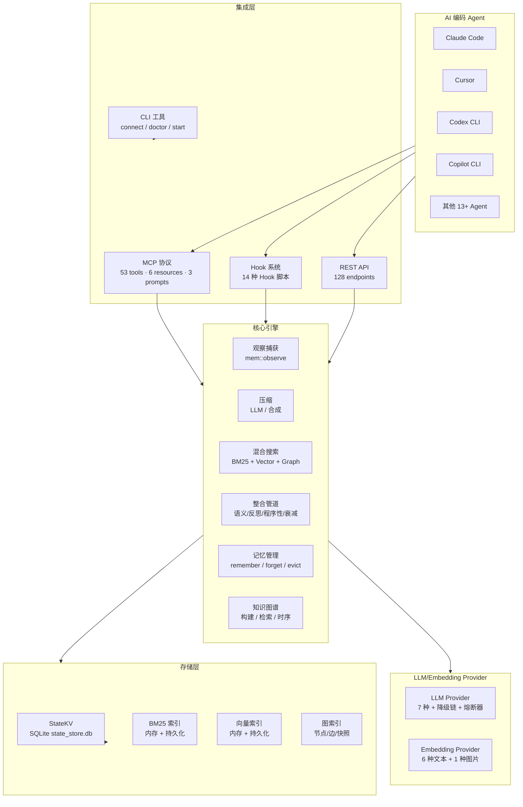

# agentmemory 规格说明书 (Specification)

> 版本: v0.9.27 | 更新日期: 2026-06-06

## 1. 项目概述

agentmemory 是一个面向 AI 编码 Agent 的持久化记忆系统，基于 iii-engine 的三个原语（Worker/Function/Trigger）构建。它为 Claude Code、Cursor、Codex CLI 等 AI 编码助手提供跨会话的记忆能力，使 Agent 能够记住项目上下文、用户偏好、历史决策和经验教训。

### 1.1 核心定位

- **持久化记忆**: 将 Agent 的观察、决策和经验持久化到 SQLite，跨会话可检索
- **智能检索**: 三路混合搜索（BM25 + 向量 + 知识图谱），支持查询扩展和神经重排序
- **多 Agent 集成**: 通过 MCP 协议和 Hook 系统与 17+ 种 AI 编码 Agent 无缝集成
- **认知架构**: 完整的记忆生命周期——捕获、压缩、检索、整合、评估、遗忘

### 1.2 技术栈

| 维度 | 技术 |
|------|------|
| 语言 | TypeScript (ESM only) |
| 运行时 | Node.js >= 20.0.0 |
| 引擎 | iii-sdk (WebSocket → iii-engine :49134) |
| 存储 | SQLite (via iii-engine StateModule, `./data/state_store.db`) |
| 构建 | tsdown → dist/ (ESM) |
| 测试 | vitest (950+ tests) |
| LLM | Anthropic / OpenAI / Gemini / OpenRouter / MiniMax / Agent SDK |

## 2. 系统架构总览

## 3. 功能规格

### 3.1 观察捕获 (Observation)

| 功能 | 描述 |
|------|------|
| Hook 事件捕获 | 通过 14 种 Hook 捕获 Agent 行为事件（工具调用、prompt、通知等） |
| 去重 | DedupMap 基于 SHA256 哈希，5 分钟 TTL 窗口内去重 |
| 隐私清洗 | `stripPrivateData` 移除敏感信息 |
| 图片提取 | 自动检测 base64 图片数据，分离存储到磁盘 |
| 双路径压缩 | LLM 压缩（高质量，消耗 token）或零 LLM 合成压缩（默认，零 token） |

### 3.2 记忆管理 (Memory)

| 功能 | 描述 |
|------|------|
| 显式记忆 | `mem::remember` 保存长期 Memory，支持 6 种类型 |
| 版本演进 | Jaccard 相似度 > 0.7 时自动取代旧记忆，维护 supersedes 链 |
| TTL 过期 | 支持 `ttlDays` 设置记忆生存期 |
| 主动遗忘 | `mem::forget` 删除指定记忆/观察/会话 |
| 自动遗忘 | `mem::auto-forget` 三维度自动清理（TTL/矛盾/低价值） |
| 多策略驱逐 | `mem::evict` 五种驱逐策略（过期会话/低重要性/上限/TTL/旧版） |
| 保留评分 | `mem::retention-score` 基于指数衰减模型的保留评分 |

### 3.3 搜索与检索 (Search & Retrieval)

| 功能 | 描述 |
|------|------|
| BM25 全文搜索 | Porter Stemmer + CJK 分词 + 同义词扩展 + 前缀匹配 |
| 向量语义搜索 | 余弦相似度 Top-K，支持 6 种 Embedding Provider |
| 知识图谱检索 | Dijkstra 加权最短路径遍历，实体匹配 + 图扩展 |
| 混合搜索 | RRF 融合三路结果，权重归一化 + 会话多样化 |
| 查询扩展 | LLM 生成语义改写 + 规则实体提取 |
| 神经重排序 | 可选 Cross-Encoder 重排序（Xenova/ms-marco-MiniLM-L-6-v2） |
| 上下文注入 | `mem::context` 在 token 预算内组装相关记忆 |

### 3.4 整合与知识提取 (Consolidation)

| 功能 | 描述 |
|------|------|
| 会话摘要 | `mem::summarize` LLM 生成 SessionSummary，支持分块并行 |
| 概念整合 | `mem::consolidate` 按概念聚类，LLM 合成 Memory |
| 四层管道 | `mem::consolidate-pipeline` 语义/反思/程序性/衰减四阶段 |
| Action 结晶化 | `mem::crystallize` 将 Action 链结晶为 Crystal + Lesson |
| 洞察生成 | `mem::reflect` 从知识图谱/语义记忆聚类生成 Insight |
| 知识图谱构建 | `mem::graph-extract` LLM 提取实体和关系，增量合并 |
| 时序图谱 | 版本化边 + 差分查询，支持知识的时间演进追踪 |

### 3.5 编排层 (Orchestration)

| 功能 | 描述 |
|------|------|
| Actions | 任务管理（创建/更新/依赖/状态机） |
| Frontier | 下一步推荐 |
| Leases | 分布式锁（获取/续约/释放） |
| Routines | 可复用工作流模板 |
| Signals | Agent 间消息传递 |
| Checkpoints | 门控与审批 |
| Sentinels | 条件监控与触发 |
| Sketches | 探索性工作草稿 |
| Facets | 多维标签系统 |
| Mesh | 多实例同步 |
| Branch-aware | Git worktree 感知 |

### 3.6 MCP 协议

| 原语 | 数量 | 描述 |
|------|------|------|
| Tools | 53 | 8 个默认可见，`AGENTMEMORY_TOOLS=all` 显示全部 |
| Resources | 6 | 项目画像、会话列表、图谱统计等 |
| Prompts | 3 | recall、remember、smart-search 模板 |

### 3.7 REST API

128 个 HTTP 端点，覆盖会话管理、观察、搜索、记忆、图谱、编排、诊断、导入导出等全部功能。

### 3.8 Hook 系统

14 种 Hook 脚本，分为两类：
- **上下文注入型**: session-start、pre-tool-use、pre-compact（`await fetch()` + 写入 stdout）
- **纯遥测型**: post-tool-use、prompt-submit、notification 等（fire-and-forget + setTimeout 退出）

### 3.9 CLI 工具

| 命令 | 描述 |
|------|------|
| `agentmemory start` | 启动守护进程 |
| `agentmemory stop` | 停止守护进程 |
| `agentmemory connect <agent>` | 连接 AI Agent（17+ 种适配器） |
| `agentmemory doctor` | 诊断检查 |
| `agentmemory remove` | 卸载 |

## 4. 数据模型

### 4.1 核心实体

| 实体 | KV Scope | 描述 |
|------|----------|------|
| Session | `mem:sessions` | 会话记录 |
| RawObservation | `mem:obs:{sessionId}` | 原始观察 |
| CompressedObservation | `mem:obs:{sessionId}` | 压缩后观察 |
| Memory | `mem:memories` | 长期记忆（6 种类型） |
| SessionSummary | `mem:summaries` | 会话摘要 |
| SemanticMemory | `mem:semantic` | 语义事实 |
| ProceduralMemory | `mem:procedural` | 程序性知识 |
| GraphNode | `mem:graph:nodes` | 知识图谱节点（13 种类型） |
| GraphEdge | `mem:graph:edges` | 知识图谱边（16 种类型） |
| Action | `mem:actions` | 任务 |
| Lesson | `mem:lessons` | 经验教训 |
| Insight | `mem:insights` | 洞察 |
| Crystal | `mem:crystals` | 结晶 |
| Sketch | `mem:sketches` | 草稿 |
| Sentinel | `mem:sentinels` | 哨兵 |
| Signal | `mem:signals` | 信号 |
| Checkpoint | `mem:checkpoints` | 检查点 |
| Facet | `mem:facets` | 分面标签 |
| MemorySlot | `mem:slots` / `mem:slots:global` | 可编辑记忆单元 |

### 4.2 索引存储

| 索引 | KV Scope | 描述 |
|------|----------|------|
| BM25 索引 | `mem:index:bm25` (分片) | 倒排索引，序列化持久化 |
| 向量索引 | 内存 + `mem:emb:{obsId}` | 余弦相似度，序列化持久化 |
| 图名索引 | `mem:graph:name-index` | `type\|name` → nodeId，O(1) 查找 |
| 图边键索引 | `mem:graph:edge-key` | `src\|tgt\|type` → edgeId，O(1) 查找 |
| 图节点度数 | `mem:graph:node-degree` | nodeId → 度数，增量更新 |
| 图快照 | `mem:graph:snapshot` | Top-500 节点 + 关联边 + 统计 |
| 访问日志 | `mem:access` | 记忆访问计数与时间 |
| 保留评分 | `mem:retention` | 记忆保留评分 |

### 4.3 记忆类型

| Memory Type | 用途 | 保留权重 |
|-------------|------|---------|
| architecture | 架构决策 | 0.9 |
| preference | 用户偏好 | 0.85 |
| pattern | 代码模式 | 0.8 |
| bug | Bug 记录 | 0.7 |
| workflow | 工作流 | 0.6 |
| fact | 事实 | 0.5 |

## 5. 非功能规格

### 5.1 性能

| 指标 | 目标 |
|------|------|
| 观察捕获延迟 | < 50ms（不含 LLM 压缩） |
| BM25 搜索 | < 100ms（10 万条记录） |
| 向量搜索 | < 200ms（10 万向量） |
| 混合搜索 | < 500ms（三路并行 + RRF 融合） |
| Hook 脚本超时 | 800ms - 5000ms（按类型） |
| 索引持久化 | 5 秒防抖，分片写入（2MB/片） |

### 5.2 可靠性

| 机制 | 描述 |
|------|------|
| 熔断器 | 三态模型（Closed/Open/Half-Open），3 次连续失败触发，30s 恢复 |
| 降级链 | 多 Provider 顺序重试，全部失败才报错 |
| 索引持久化 | 分片 + manifest 原子写入，崩溃后可恢复 |
| 维度守卫 | 向量维度不一致时拒绝加载，防止搜索静默降级 |
| 递归防护 | `isSdkChildContext()` 防止 Hook 无限递归 |
| 优雅关闭 | SIGINT/SIGTERM 时保存索引、关闭连接 |

### 5.3 安全

| 机制 | 描述 |
|------|------|
| 认证 | Bearer Token + `timingSafeCompare` 防时序攻击 |
| 字段白名单 | REST 端点显式构造 payload，不传递原始 body |
| 隐私清洗 | `stripPrivateData` 移除敏感信息 |
| CSP | Viewer 使用 nonce-based Content-Security-Policy |
| 图片存储 | base64 图片分离存储，输出替换为占位符 |

### 5.4 可观测性

| 维度 | 实现 |
|------|------|
| 审计日志 | `recordAudit()` 记录所有状态变更操作（30+ 种操作类型） |
| 健康监控 | `HealthMonitor` 定期检查连接、内存、CPU、事件循环 |
| 诊断 | `mem::diagnose` 自检 + `mem::heal` 自愈 |
| OpenTelemetry | 可选集成，metrics + traces |
| 实时流 | WebSocket stream 推送观察事件到 Viewer |

## 6. 配置规格

### 6.1 环境变量

| 变量 | 默认值 | 描述 |
|------|--------|------|
| `ANTHROPIC_API_KEY` | - | Anthropic API Key |
| `GEMINI_API_KEY` | - | Gemini API Key |
| `OPENAI_API_KEY` | - | OpenAI API Key |
| `OPENROUTER_API_KEY` | - | OpenRouter API Key |
| `MINIMAX_API_KEY` | - | MiniMax API Key |
| `EMBEDDING_PROVIDER` | 自动检测 | Embedding Provider 类型 |
| `AGENTMEMORY_AUTO_COMPRESS` | `false` | 是否启用 LLM 压缩 |
| `AGENTMEMORY_INJECT_CONTEXT` | `false` | 是否启用上下文注入 |
| `AGENTMEMORY_TOOLS` | `core` | MCP 工具可见性（`core` / `all`） |
| `AGENTMEMORY_SECRET` | - | REST API 认证密钥 |
| `GRAPH_EXTRACTION_ENABLED` | `false` | 是否启用知识图谱提取 |
| `CONSOLIDATION_ENABLED` | 自动检测 | 是否启用自动整合 |
| `III_REST_PORT` | `3111` | REST API 端口 |
| `TOKEN_BUDGET` | `2000` | 上下文注入 token 预算 |
| `BM25_WEIGHT` | `0.4` | BM25 搜索权重 |
| `VECTOR_WEIGHT` | `0.6` | 向量搜索权重 |
| `AGENT_ID` | - | Agent ID（多 Agent 隔离） |
| `AGENTMEMORY_AGENT_SCOPE` | `shared` | Agent 作用域模式（`shared` / `isolated`） |

### 6.2 端口分配

| 端口 | 用途 |
|------|------|
| 3111 | REST API |
| 3112 | WebSocket Streams |
| 3113 | Viewer Web UI |
| 49134 | iii-engine WebSocket |

## 7. 统计数据

| 指标 | 数值 |
|------|------|
| MCP Tools | 53 |
| REST Endpoints | 128 |
| MCP Resources | 6 |
| MCP Prompts | 3 |
| Hook 类型 | 14 |
| Skills | 8 |
| iii Functions | 50+ |
| 测试用例 | 950+ |
| Agent 适配器 | 17 |
| KV Scopes | 75+ |
| LLM Providers | 7 |
| Embedding Providers | 6 文本 + 1 图片 |
