# Basic Memory 系统设计文档

> 基于 MCP（Model Context Protocol）的本地优先知识管理系统

---

## 目录

1. [系统整体架构](#1-系统整体架构)
2. [三入口组合根设计](#2-三入口组合根设计)
3. [运行时模式](#3-运行时模式)
4. [项目路由机制](#4-项目路由机制)
5. [类型化客户端模式](#5-类型化客户端模式)
6. [同步协调器](#6-同步协调器)
7. [文件同步设计](#7-文件同步设计)
8. [搜索设计](#8-搜索设计)
9. [Markdown 知识表示](#9-markdown-知识表示)
10. [项目解析设计](#10-项目解析设计)
11. [配置管理](#11-配置管理)
12. [链接解析多策略](#12-链接解析多策略)
13. [上下文构建](#13-上下文构建)
14. [工作区上下文](#14-工作区上下文)
15. [数据库模型关系](#15-数据库模型关系)

---

## 1. 系统整体架构

### 动机

Basic Memory 需要同时支持三种不同的使用场景：作为 MCP 服务器供 LLM 调用、作为 REST API 供前端/第三方集成、作为 CLI 工具供终端用户使用。这三种场景共享同一套业务逻辑，但入口、初始化方式和运行时行为各不相同。

### 方案

采用三入口架构，每个入口拥有独立的组合根（Composition Root），组合根是唯一读取全局配置的地方，下游模块通过参数接收依赖。

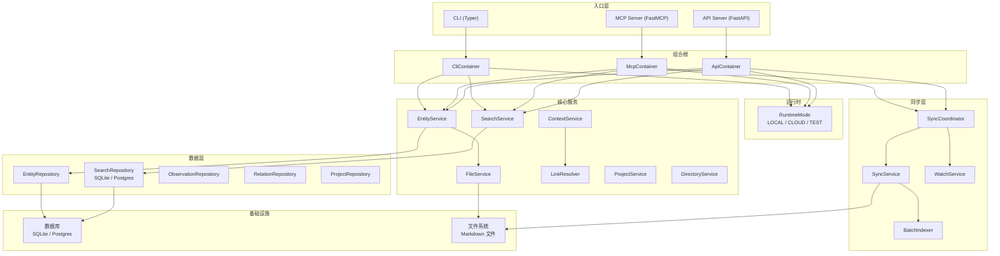
```mermaid
graph TB
    subgraph 入口层
        CLI["CLI (Typer)"]
        MCP["MCP Server (FastMCP)"]
        API["API Server (FastAPI)"]
    end

    subgraph 组合根
        CC["CliContainer"]
        MC["McpContainer"]
        AC["ApiContainer"]
    end

    subgraph 运行时
        RM["RuntimeMode<br/>LOCAL / CLOUD / TEST"]
    end

    subgraph 核心服务
        ES["EntityService"]
        SS["SearchService"]
        CS["ContextService"]
        FS["FileService"]
        LR["LinkResolver"]
        PS["ProjectService"]
        DS["DirectoryService"]
    end

    subgraph 数据层
        ER["EntityRepository"]
        SR["SearchRepository<br/>SQLite / Postgres"]
        OR["ObservationRepository"]
        RR["RelationRepository"]
        PR["ProjectRepository"]
    end

    subgraph 同步层
        SC["SyncCoordinator"]
        SyncS["SyncService"]
        WS["WatchService"]
        BI["BatchIndexer"]
    end

    subgraph 基础设施
        DB["数据库<br/>SQLite / Postgres"]
        FS2["文件系统<br/>Markdown 文件"]
    end

    CLI --> CC
    MCP --> MC
    API --> AC

    CC --> RM
    MC --> RM
    AC --> RM

    CC --> ES
    CC --> SS
    MC --> ES
    MC --> SS
    AC --> ES
    AC --> SS

    ES --> ER
    ES --> FS
    SS --> SR
    CS --> LR

    MC --> SC
    AC --> SC
    SC --> SyncS
    SC --> WS
    SyncS --> BI

    ER --> DB
    SR --> DB
    FS --> FS2
    SyncS --> FS2
```

### 权衡

| 决策 | 优势 | 代价 |
|------|------|------|
| 三入口独立组合根 | 各入口可独立初始化，避免不必要依赖 | 需要维护三套容器定义 |
| 组合根集中读配置 | 配置读取点唯一，易于追踪 | 下游模块必须通过参数接收配置 |
| 共享核心服务层 | 业务逻辑复用，行为一致 | 服务层需同时满足同步/异步调用需求 |

---

## 2. 三入口组合根设计

### 动机

不同入口对同步、数据库初始化、日志等有不同需求。MCP 服务器不应启动文件同步（云模式下），CLI 可能需要即时同步，API 需要完整的生命周期管理。

### 方案

每个入口的 Container 是一个 `dataclass`，持有 `BasicMemoryConfig` 和 `RuntimeMode`，通过 `create()` 工厂方法从 `ConfigManager` 读取配置。

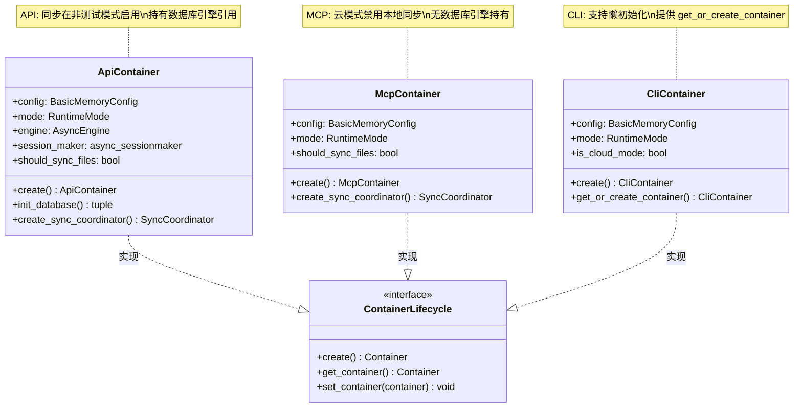
```mermaid
classDiagram
    class ApiContainer {
        +config: BasicMemoryConfig
        +mode: RuntimeMode
        +engine: AsyncEngine
        +session_maker: async_sessionmaker
        +should_sync_files: bool
        +create() ApiContainer
        +init_database() tuple
        +create_sync_coordinator() SyncCoordinator
    }

    class McpContainer {
        +config: BasicMemoryConfig
        +mode: RuntimeMode
        +should_sync_files: bool
        +create() McpContainer
        +create_sync_coordinator() SyncCoordinator
    }

    class CliContainer {
        +config: BasicMemoryConfig
        +mode: RuntimeMode
        +is_cloud_mode: bool
        +create() CliContainer
        +get_or_create_container() CliContainer
    }

    class ContainerLifecycle {
        <<interface>>
        +create() Container
        +get_container() Container
        +set_container(container) void
    }

    ApiContainer ..|> ContainerLifecycle : 实现
    McpContainer ..|> ContainerLifecycle : 实现
    CliContainer ..|> ContainerLifecycle : 实现

    note for ApiContainer "API: 同步在非测试模式启用\n持有数据库引擎引用"
    note for McpContainer "MCP: 云模式禁用本地同步\n无数据库引擎持有"
    note for CliContainer "CLI: 支持懒初始化\n提供 get_or_create_container"
```

### 各入口同步策略差异

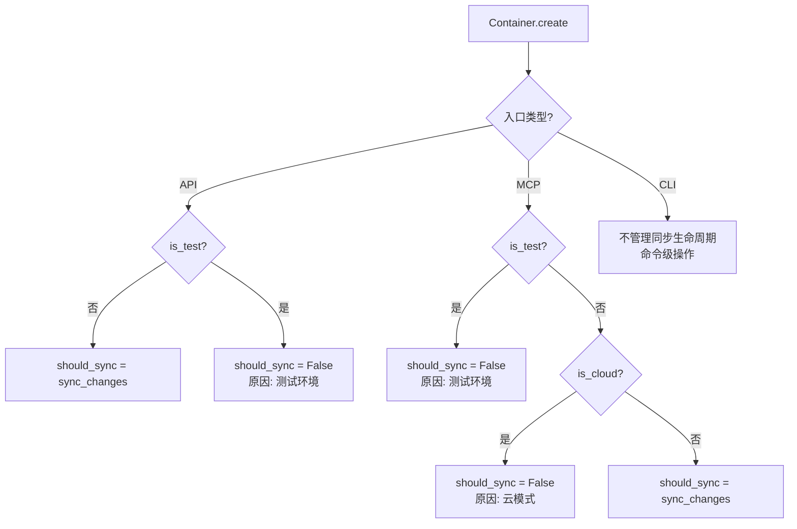
```mermaid
flowchart TD
    A[Container.create] --> B{入口类型?}

    B -->|API| C{is_test?}
    C -->|否| D[should_sync = sync_changes]
    C -->|是| E[should_sync = False<br/>原因: 测试环境]

    B -->|MCP| F{is_test?}
    F -->|是| G[should_sync = False<br/>原因: 测试环境]
    F -->|否| H{is_cloud?}
    H -->|是| I[should_sync = False<br/>原因: 云模式]
    H -->|否| J[should_sync = sync_changes]

    B -->|CLI| K[不管理同步生命周期<br/>命令级操作]
```

### 权衡

| 决策 | 优势 | 代价 |
|------|------|------|
| dataclass 而非框架容器 | 零依赖，简单直观 | 无自动依赖注入 |
| 模块级单例缓存 | 避免重复初始化 | 需要手动管理生命周期 |
| MCP 云模式禁用同步 | 避免云容器启动本地文件监视 | 云端同步由外部机制处理 |

---

## 3. 运行时模式

### 动机

系统需要在本地开发、云端部署和测试三种环境下运行，不同环境对文件同步、数据库连接、日志输出等有截然不同的需求。

### 方案

通过 `RuntimeMode` 枚举统一运行时模式，解析优先级为 TEST > CLOUD > LOCAL。

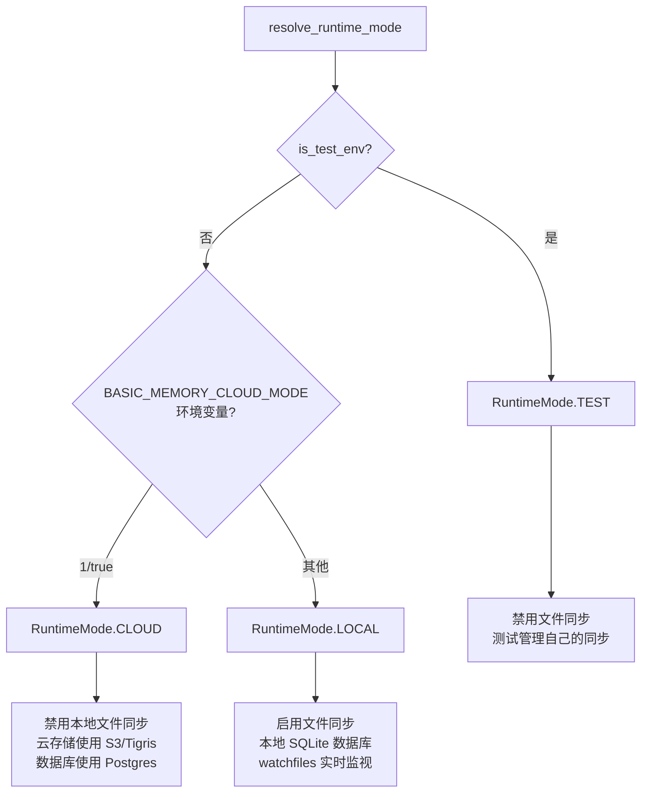
```mermaid
flowchart TD
    Start[resolve_runtime_mode] --> A{is_test_env?}
    A -->|是| TEST["RuntimeMode.TEST"]
    A -->|否| B{BASIC_MEMORY_CLOUD_MODE<br/>环境变量?}
    B -->|1/true| CLOUD["RuntimeMode.CLOUD"]
    B -->|其他| LOCAL["RuntimeMode.LOCAL"]

    TEST --> D["禁用文件同步<br/>测试管理自己的同步"]
    CLOUD --> E["禁用本地文件同步<br/>云存储使用 S3/Tigris<br/>数据库使用 Postgres"]
    LOCAL --> F["启用文件同步<br/>本地 SQLite 数据库<br/>watchfiles 实时监视"]
```

### 运行时模式属性

```mermaid
classDiagram
    class RuntimeMode {
        <<enumeration>>
        LOCAL
        CLOUD
        TEST
        +is_cloud: bool
        +is_local: bool
        +is_test: bool
    }

    class ProjectMode {
        <<enumeration>>
        LOCAL
        CLOUD
    }

    RuntimeMode --> "全局运行时" : 系统级
    ProjectMode --> "项目级" : 每个项目独立
```

### 权衡

| 决策 | 优势 | 代价 |
|------|------|------|
| TEST 最高优先级 | 测试永远不受环境变量干扰 | 测试需显式设置 is_test_env |
| 环境变量控制 CLOUD | 容器部署无需修改代码 | 环境变量可能被意外设置 |
| 全局模式 vs 项目模式分离 | 项目可独立选择本地/云路由 | 两层模式增加了理解复杂度 |

---

## 4. 项目路由机制

### 动机

每个项目可以独立选择 LOCAL 或 CLOUD 模式，MCP 工具需要根据项目模式获取正确的 HTTP 客户端（本地 ASGI 或远程云代理）。存在引导问题：需要项目名选择客户端，但需要客户端验证项目。

### 方案

`get_project_client()` 解决引导问题：先从配置解析项目名（无网络调用），创建正确路由的客户端，再通过 API 验证项目。

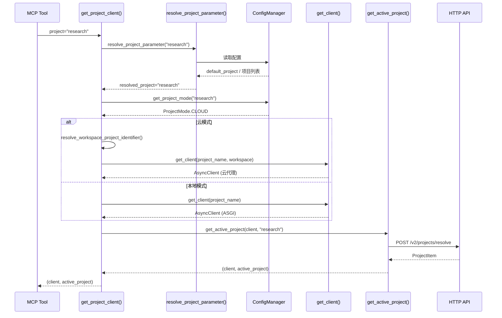
```mermaid
sequenceDiagram
    participant Tool as MCP Tool
    participant GPC as get_project_client()
    participant RPP as resolve_project_parameter()
    participant CM as ConfigManager
    participant GC as get_client()
    participant GAP as get_active_project()
    participant API as HTTP API

    Tool->>GPC: project="research"
    GPC->>RPP: resolve_project_parameter("research")
    RPP->>CM: 读取配置
    CM-->>RPP: default_project / 项目列表
    RPP-->>GPC: resolved_project="research"

    GPC->>CM: get_project_mode("research")
    CM-->>GPC: ProjectMode.CLOUD

    alt 云模式
        GPC->>GPC: resolve_workspace_project_identifier()
        GPC->>GC: get_client(project_name, workspace)
        GC-->>GPC: AsyncClient (云代理)
    else 本地模式
        GPC->>GC: get_client(project_name)
        GC-->>GPC: AsyncClient (ASGI)
    end

    GPC->>GAP: get_active_project(client, "research")
    GAP->>API: POST /v2/projects/resolve
    API-->>GAP: ProjectItem
    GAP-->>GPC: (client, active_project)
    GPC-->>Tool: (client, active_project)
```

### 客户端路由决策流程

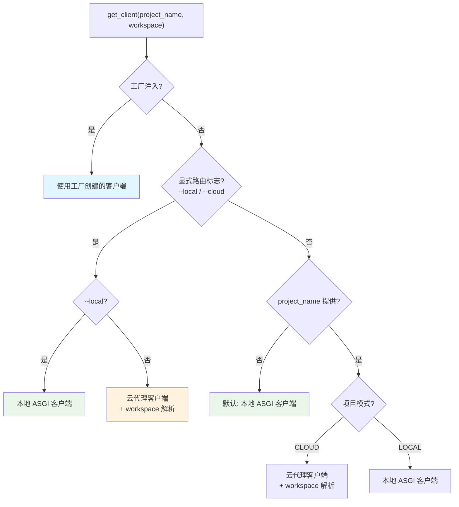
```mermaid
flowchart TD
    Start["get_client(project_name, workspace)"] --> A{工厂注入?}
    A -->|是| FACTORY["使用工厂创建的客户端"]
    A -->|否| B{显式路由标志?<br/>--local / --cloud}

    B -->|是| C{--local?}
    C -->|是| LOCAL_ASGI["本地 ASGI 客户端"]
    C -->|否| CLOUD_PROXY["云代理客户端<br/>+ workspace 解析"]

    B -->|否| D{project_name 提供?}
    D -->|否| DEFAULT["默认: 本地 ASGI 客户端"]
    D -->|是| E{项目模式?}

    E -->|CLOUD| F["云代理客户端<br/>+ workspace 解析"]
    E -->|LOCAL| G["本地 ASGI 客户端"]

    style FACTORY fill:#e1f5fe
    style LOCAL_ASGI fill:#e8f5e9
    style CLOUD_PROXY fill:#fff3e0
    style DEFAULT fill:#e8f5e9
```

### 权衡

| 决策 | 优势 | 代价 |
|------|------|------|
| 先配置后验证 | 无需网络调用即可路由 | 配置可能与数据库不同步 |
| 工厂注入最高优先级 | 云应用可直接注入客户端 | 需要理解工厂模式 |
| 项目级路由 | 混合本地/云项目 | 路由逻辑复杂 |

---

## 5. 类型化客户端模式

### 动机

MCP 工具直接构造 HTTP 请求容易出错（URL 拼接、参数传递、响应解析），需要类型安全的客户端封装。

### 方案

MCP 工具通过类型化客户端调用 HTTP API，客户端封装路径构造、请求发送和响应解析。

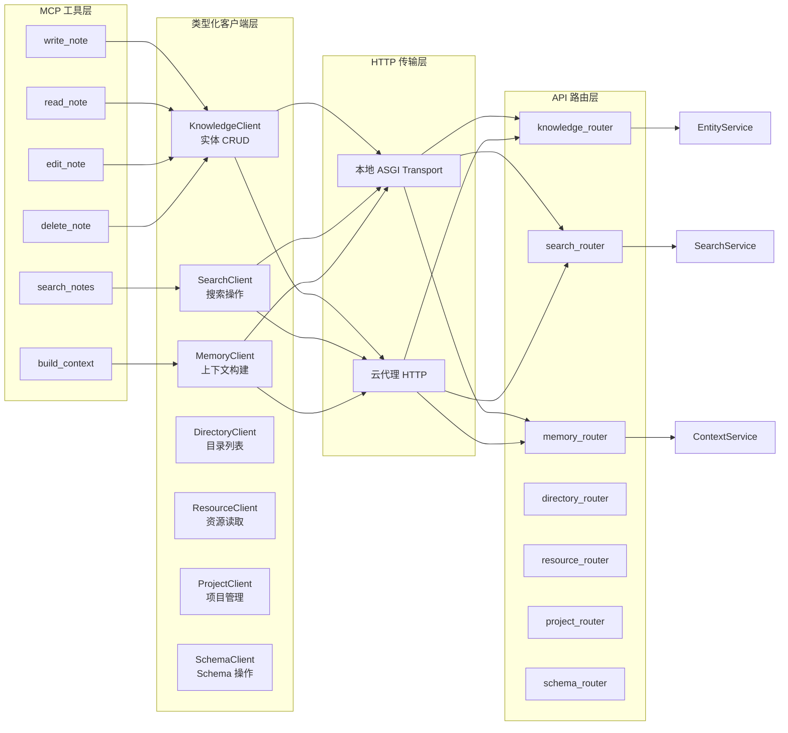
```mermaid
flowchart LR
    subgraph "MCP 工具层"
        WN["write_note"]
        SN["search_notes"]
        BC["build_context"]
        RN["read_note"]
        EN["edit_note"]
        DN["delete_note"]
    end

    subgraph "类型化客户端层"
        KC["KnowledgeClient<br/>实体 CRUD"]
        SC["SearchClient<br/>搜索操作"]
        MC["MemoryClient<br/>上下文构建"]
        DC["DirectoryClient<br/>目录列表"]
        RC["ResourceClient<br/>资源读取"]
        PC["ProjectClient<br/>项目管理"]
        SC2["SchemaClient<br/>Schema 操作"]
    end

    subgraph "HTTP 传输层"
        ASGI["本地 ASGI Transport"]
        CLOUD["云代理 HTTP"]
    end

    subgraph "API 路由层"
        KR["knowledge_router"]
        SR["search_router"]
        MR["memory_router"]
        DR["directory_router"]
        RR2["resource_router"]
        PR2["project_router"]
        SR2["schema_router"]
    end

    WN --> KC
    RN --> KC
    EN --> KC
    DN --> KC
    SN --> SC
    BC --> MC
    KC --> ASGI
    KC --> CLOUD
    SC --> ASGI
    SC --> CLOUD
    MC --> ASGI
    MC --> CLOUD

    ASGI --> KR
    ASGI --> SR
    ASGI --> MR
    CLOUD --> KR
    CLOUD --> SR
    CLOUD --> MR

    KR --> ES2["EntityService"]
    SR --> SS2["SearchService"]
    MR --> CS2["ContextService"]
```

### MCP Tool 完整调用时序图 — write_note

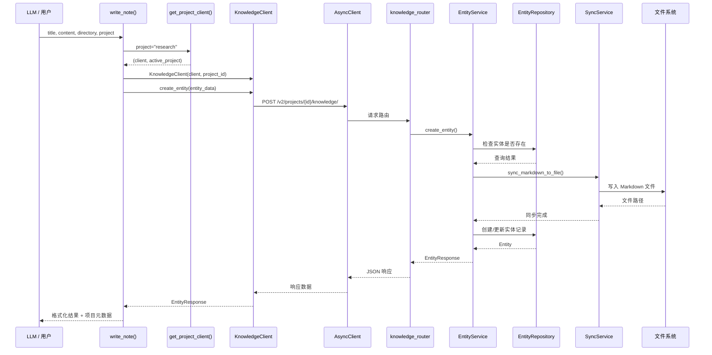
```mermaid
sequenceDiagram
    participant LLM as LLM / 用户
    participant Tool as write_note()
    participant GPC as get_project_client()
    participant KC as KnowledgeClient
    participant Client as AsyncClient
    participant Router as knowledge_router
    participant Svc as EntityService
    participant Repo as EntityRepository
    participant Sync as SyncService
    participant FS as 文件系统

    LLM->>Tool: title, content, directory, project
    Tool->>GPC: project="research"
    GPC-->>Tool: (client, active_project)

    Tool->>KC: KnowledgeClient(client, project_id)
    Tool->>KC: create_entity(entity_data)
    KC->>Client: POST /v2/projects/{id}/knowledge/
    Client->>Router: 请求路由
    Router->>Svc: create_entity()
    Svc->>Repo: 检查实体是否存在
    Repo-->>Svc: 查询结果
    Svc->>Sync: sync_markdown_to_file()
    Sync->>FS: 写入 Markdown 文件
    FS-->>Sync: 文件路径
    Sync-->>Svc: 同步完成
    Svc->>Repo: 创建/更新实体记录
    Repo-->>Svc: Entity
    Svc-->>Router: EntityResponse
    Router-->>Client: JSON 响应
    Client-->>KC: 响应数据
    KC-->>Tool: EntityResponse
    Tool-->>LLM: 格式化结果 + 项目元数据
```

### MCP Tool 完整调用时序图 — search_notes

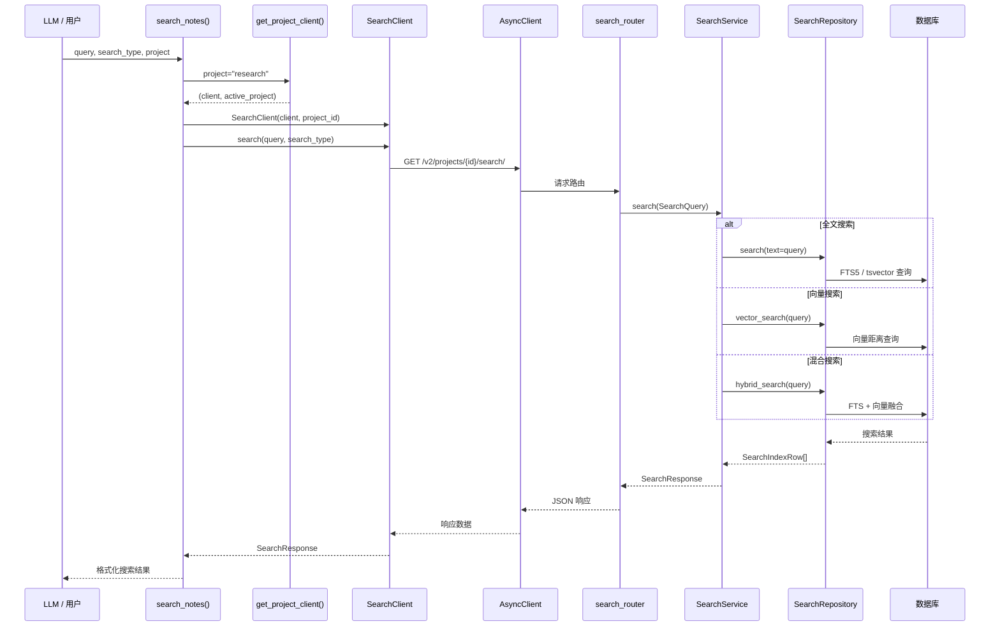
```mermaid
sequenceDiagram
    participant LLM as LLM / 用户
    participant Tool as search_notes()
    participant GPC as get_project_client()
    participant SC as SearchClient
    participant Client as AsyncClient
    participant Router as search_router
    participant Svc as SearchService
    participant Repo as SearchRepository
    participant DB as 数据库

    LLM->>Tool: query, search_type, project
    Tool->>GPC: project="research"
    GPC-->>Tool: (client, active_project)

    Tool->>SC: SearchClient(client, project_id)
    Tool->>SC: search(query, search_type)
    SC->>Client: GET /v2/projects/{id}/search/
    Client->>Router: 请求路由
    Router->>Svc: search(SearchQuery)

    alt 全文搜索
        Svc->>Repo: search(text=query)
        Repo->>DB: FTS5 / tsvector 查询
    else 向量搜索
        Svc->>Repo: vector_search(query)
        Repo->>DB: 向量距离查询
    else 混合搜索
        Svc->>Repo: hybrid_search(query)
        Repo->>DB: FTS + 向量融合
    end

    DB-->>Repo: 搜索结果
    Repo-->>Svc: SearchIndexRow[]
    Svc-->>Router: SearchResponse
    Router-->>Client: JSON 响应
    Client-->>SC: 响应数据
    SC-->>Tool: SearchResponse
    Tool-->>LLM: 格式化搜索结果
```

### MCP Tool 完整调用时序图 — build_context

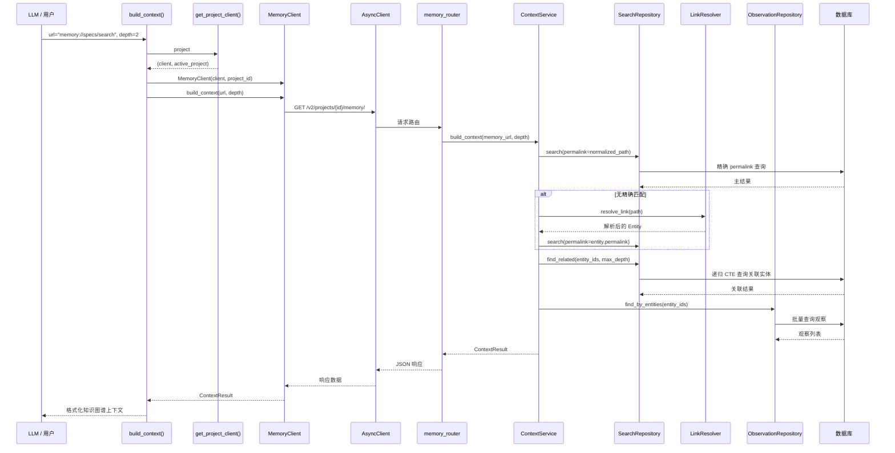
```mermaid
sequenceDiagram
    participant LLM as LLM / 用户
    participant Tool as build_context()
    participant GPC as get_project_client()
    participant MC as MemoryClient
    participant Client as AsyncClient
    participant Router as memory_router
    participant Svc as ContextService
    participant SR as SearchRepository
    participant LR as LinkResolver
    participant OR as ObservationRepository
    participant DB as 数据库

    LLM->>Tool: url="memory://specs/search", depth=2
    Tool->>GPC: project
    GPC-->>Tool: (client, active_project)

    Tool->>MC: MemoryClient(client, project_id)
    Tool->>MC: build_context(url, depth)
    MC->>Client: GET /v2/projects/{id}/memory/
    Client->>Router: 请求路由
    Router->>Svc: build_context(memory_url, depth)

    Svc->>SR: search(permalink=normalized_path)
    SR->>DB: 精确 permalink 查询
    DB-->>SR: 主结果

    alt 无精确匹配
        Svc->>LR: resolve_link(path)
        LR-->>Svc: 解析后的 Entity
        Svc->>SR: search(permalink=entity.permalink)
    end

    Svc->>SR: find_related(entity_ids, max_depth)
    SR->>DB: 递归 CTE 查询关联实体
    DB-->>SR: 关联结果

    Svc->>OR: find_by_entities(entity_ids)
    OR->>DB: 批量查询观察
    DB-->>OR: 观察列表

    Svc-->>Router: ContextResult
    Router-->>Client: JSON 响应
    Client-->>MC: 响应数据
    MC-->>Tool: ContextResult
    Tool-->>LLM: 格式化知识图谱上下文
```

### 权衡

| 决策 | 优势 | 代价 |
|------|------|------|
| 类型化客户端封装 | 类型安全，路径集中管理 | 额外的客户端类维护 |
| MCP → HTTP API → Service | 清晰分层，可独立测试 | 本地模式有 ASGI 开销 |
| 客户端路由透明 | 工具代码不感知本地/云 | 路由逻辑集中在 get_client() |

---

## 6. 同步协调器

### 动机

文件同步和监视服务的生命周期需要集中管理，确保正确启动、优雅停止和状态可观测。

### 方案

`SyncCoordinator` 使用状态机模式管理同步生命周期，提供统一的 start/stop 接口。

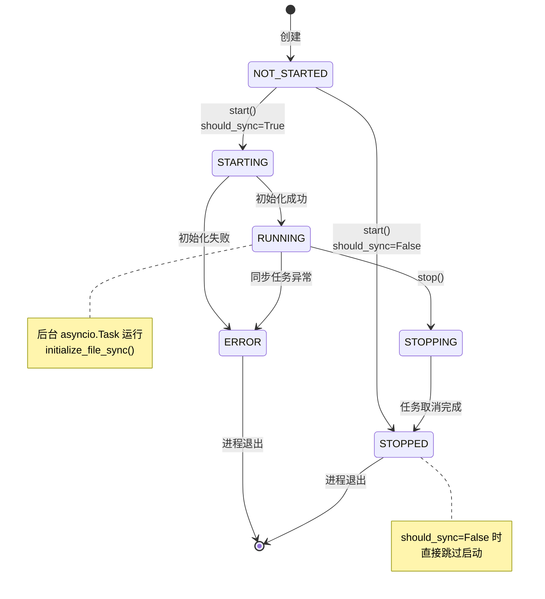
```mermaid
stateDiagram-v2
    [*] --> NOT_STARTED: 创建

    NOT_STARTED --> STARTING: start()<br/>should_sync=True
    NOT_STARTED --> STOPPED: start()<br/>should_sync=False

    STARTING --> RUNNING: 初始化成功
    STARTING --> ERROR: 初始化失败

    RUNNING --> STOPPING: stop()
    RUNNING --> ERROR: 同步任务异常

    STOPPING --> STOPPED: 任务取消完成

    ERROR --> [*]: 进程退出

    STOPPED --> [*]: 进程退出

    note right of RUNNING
        后台 asyncio.Task 运行
        initialize_file_sync()
    end note

    note right of STOPPED
        should_sync=False 时
        直接跳过启动
    end note
```

### 状态转换规则

| 当前状态 | 事件 | 目标状态 | 条件 |
|----------|------|----------|------|
| NOT_STARTED | start() | STARTING | should_sync=True |
| NOT_STARTED | start() | STOPPED | should_sync=False |
| STARTING | 初始化成功 | RUNNING | — |
| STARTING | 异常 | ERROR | — |
| RUNNING | stop() | STOPPING | — |
| RUNNING | 任务异常 | ERROR | — |
| STOPPING | 取消完成 | STOPPED | — |
| RUNNING/STARTING | start() | 无变化 | 幂等 |

### 权衡

| 决策 | 优势 | 代价 |
|------|------|------|
| 状态机模式 | 状态转换明确，可观测 | 需要维护状态枚举 |
| 非阻塞启动 | 不阻塞主服务启动 | 需要异步任务管理 |
| 集中协调 | 单一职责，易于测试 | 协调器本身需要正确管理 |

---

## 7. 文件同步设计

### 动机

Markdown 文件是知识的源真相（source of truth），数据库是索引。需要高效地将文件系统变更同步到数据库，支持全量扫描和增量监视两种模式。

### 方案

双模式同步：`SyncService` 负责全量扫描同步，`WatchService` 负责增量实时监视。引入熔断器防止反复失败的文件拖垮系统。

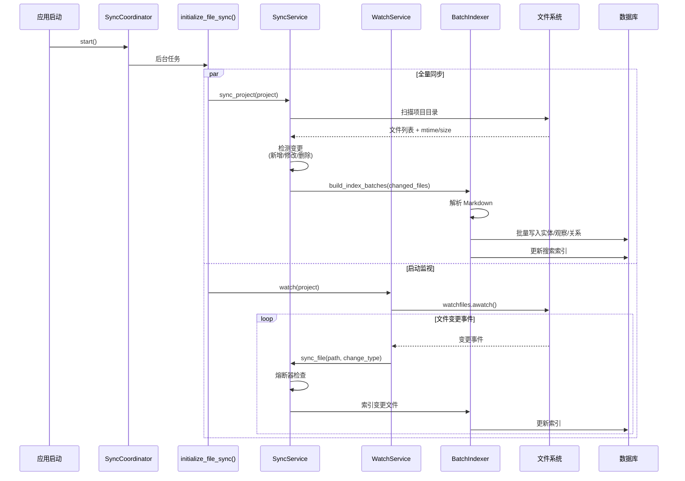
```mermaid
sequenceDiagram
    participant Init as 应用启动
    participant SC as SyncCoordinator
    participant IFS as initialize_file_sync()
    participant SS as SyncService
    participant WS as WatchService
    participant BI as BatchIndexer
    participant FS as 文件系统
    participant DB as 数据库

    Init->>SC: start()
    SC->>IFS: 后台任务

    par 全量同步
        IFS->>SS: sync_project(project)
        SS->>FS: 扫描项目目录
        FS-->>SS: 文件列表 + mtime/size
        SS->>SS: 检测变更<br/>(新增/修改/删除)
        SS->>BI: build_index_batches(changed_files)
        BI->>BI: 解析 Markdown
        BI->>DB: 批量写入实体/观察/关系
        BI->>DB: 更新搜索索引
    and 启动监视
        IFS->>WS: watch(project)
        WS->>FS: watchfiles.awatch()
        loop 文件变更事件
            FS-->>WS: 变更事件
            WS->>SS: sync_file(path, change_type)
            SS->>SS: 熔断器检查
            SS->>BI: 索引变更文件
            BI->>DB: 更新索引
        end
    end
```

### 熔断器机制

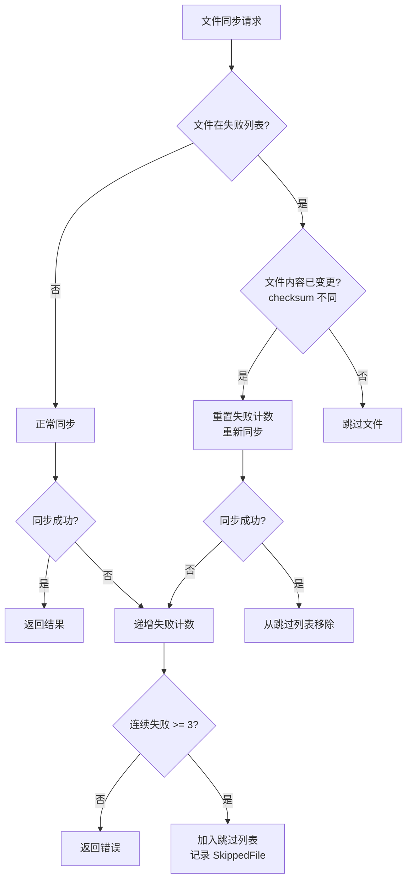
```mermaid
flowchart TD
    A[文件同步请求] --> B{文件在失败列表?}
    B -->|否| C[正常同步]
    B -->|是| D{文件内容已变更?<br/>checksum 不同}
    D -->|是| E[重置失败计数<br/>重新同步]
    D -->|否| F[跳过文件]

    C --> G{同步成功?}
    G -->|是| H[返回结果]
    G -->|否| I[递增失败计数]

    I --> J{连续失败 >= 3?}
    J -->|否| H2[返回错误]
    J -->|是| K[加入跳过列表<br/>记录 SkippedFile]

    E --> G2{同步成功?}
    G2 -->|是| L[从跳过列表移除]
    G2 -->|否| I
```

### 批量索引流程

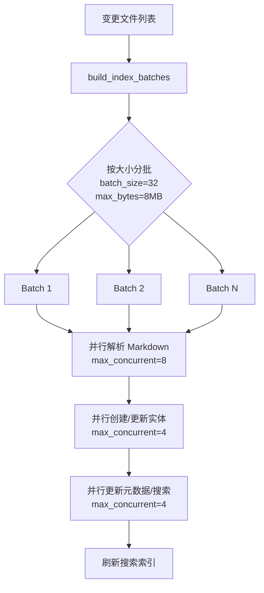
```mermaid
flowchart TD
    A[变更文件列表] --> B[build_index_batches]
    B --> C{按大小分批<br/>batch_size=32<br/>max_bytes=8MB}
    C --> D[Batch 1]
    C --> E[Batch 2]
    C --> F[Batch N]

    D --> G[并行解析 Markdown<br/>max_concurrent=8]
    G --> H[并行创建/更新实体<br/>max_concurrent=4]
    H --> I[并行更新元数据/搜索<br/>max_concurrent=4]
    I --> J[刷新搜索索引]

    E --> G
    F --> G
```

### 权衡

| 决策 | 优势 | 代价 |
|------|------|------|
| 文件为源真相 | 数据可从文件重建 | 文件系统是性能瓶颈 |
| 熔断器 MAX_FAILURES=3 | 防止反复失败拖垮系统 | 可能跳过可恢复的文件 |
| 批量索引 | 减少数据库往返 | 批次间可能丢失实时性 |
| mtime/size 变更检测 | 快速判断文件是否变更 | 粗粒度文件系统可能误判 |

---

## 8. 搜索设计

### 动机

知识库需要高效的全文搜索和语义搜索能力，同时支持 SQLite（本地）和 Postgres（云端）两种后端，且搜索策略需要在严格匹配失败时自动松弛。

### 方案

三层搜索架构：全文搜索（FTS）、向量搜索（语义）、混合搜索（融合）。通过 Protocol 接口统一搜索仓库契约，支持后端无关的搜索逻辑。

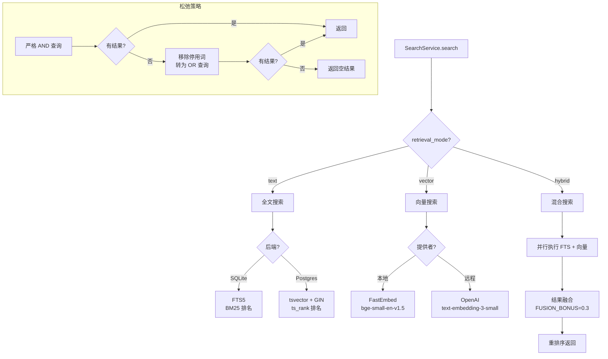
```mermaid
flowchart TD
    A[SearchService.search] --> B{retrieval_mode?}

    B -->|text| C[全文搜索]
    B -->|vector| D[向量搜索]
    B -->|hybrid| E[混合搜索]

    C --> F{后端?}
    F -->|SQLite| G["FTS5<br/>BM25 排名"]
    F -->|Postgres| H["tsvector + GIN<br/>ts_rank 排名"]

    D --> I{提供者?}
    I -->|本地| J["FastEmbed<br/>bge-small-en-v1.5"]
    I -->|远程| K["OpenAI<br/>text-embedding-3-small"]

    E --> L[并行执行 FTS + 向量]
    L --> M[结果融合<br/>FUSION_BONUS=0.3]
    M --> N[重排序返回]

    subgraph 松弛策略
        O[严格 AND 查询] --> P{有结果?}
        P -->|是| Q[返回]
        P -->|否| R[移除停用词<br/>转为 OR 查询]
        R --> S{有结果?}
        S -->|是| Q
        S -->|否| T[返回空结果]
    end
```

### 搜索策略决策流程

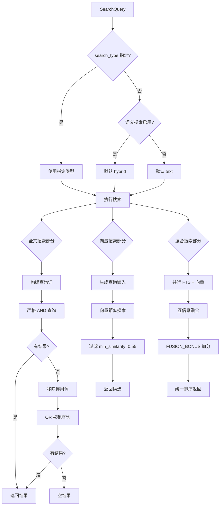
```mermaid
flowchart TD
    Start[SearchQuery] --> A{search_type 指定?}
    A -->|是| B[使用指定类型]
    A -->|否| C{语义搜索启用?}
    C -->|是| D[默认 hybrid]
    C -->|否| E[默认 text]

    B --> F[执行搜索]
    D --> F
    E --> F

    F --> G{全文搜索部分}
    G --> H[构建查询词]
    H --> I[严格 AND 查询]
    I --> J{有结果?}
    J -->|是| K[返回结果]
    J -->|否| L[移除停用词]
    L --> M[OR 松弛查询]
    M --> N{有结果?}
    N -->|是| K
    N -->|否| O[空结果]

    F --> P{向量搜索部分}
    P --> Q[生成查询嵌入]
    Q --> R[向量距离搜索]
    R --> S[过滤 min_similarity=0.55]
    S --> T[返回候选]

    F --> U{混合搜索部分}
    U --> V[并行 FTS + 向量]
    V --> W[互信息融合]
    W --> X[FUSION_BONUS 加分]
    X --> Y[统一排序返回]
```

### 双后端搜索仓库

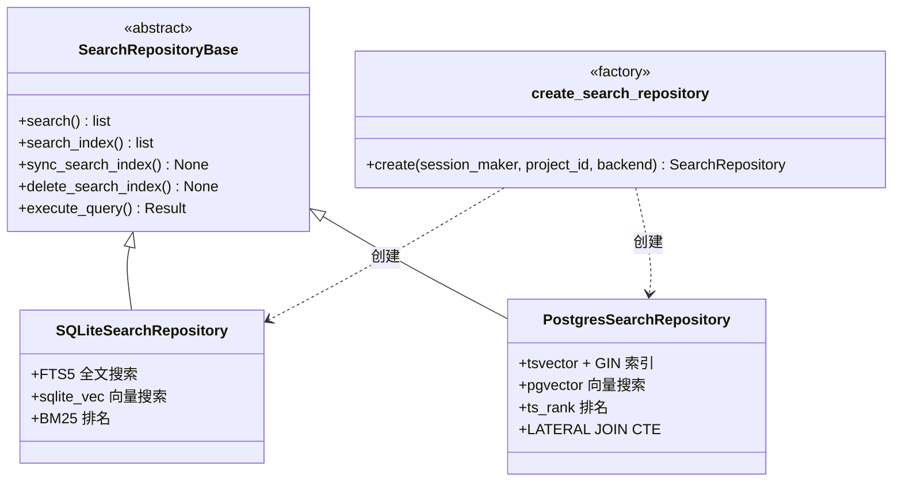
```mermaid
classDiagram
    class SearchRepositoryBase {
        <<abstract>>
        +search() list
        +search_index() list
        +sync_search_index() None
        +delete_search_index() None
        +execute_query() Result
    }

    class SQLiteSearchRepository {
        +FTS5 全文搜索
        +sqlite_vec 向量搜索
        +BM25 排名
    }

    class PostgresSearchRepository {
        +tsvector + GIN 索引
        +pgvector 向量搜索
        +ts_rank 排名
        +LATERAL JOIN CTE
    }

    class create_search_repository {
        <<factory>>
        +create(session_maker, project_id, backend) SearchRepository
    }

    SearchRepositoryBase <|-- SQLiteSearchRepository
    SearchRepositoryBase <|-- PostgresSearchRepository
    create_search_repository ..> SQLiteSearchRepository : 创建
    create_search_repository ..> PostgresSearchRepository : 创建
```

### 权衡

| 决策 | 优势 | 代价 |
|------|------|------|
| Protocol 接口统一 | 后端切换透明 | 需要维护两套实现 |
| 松弛策略 | 提高搜索召回率 | 可能返回不相关结果 |
| FastEmbed 本地嵌入 | 无需网络，隐私友好 | 模型加载耗时，精度有限 |
| 混合搜索融合 | 兼顾精确和语义 | 计算开销更大 |

---

## 9. Markdown 知识表示

### 动机

知识以 Markdown 文件形式存储，既是人类可读的源真相，也是机器可解析的结构化数据。需要定义清晰的语法规范来表示实体、观察和关系。

### 方案

采用 Frontmatter + 观察列表 + 关系列表的三段式 Markdown 结构。

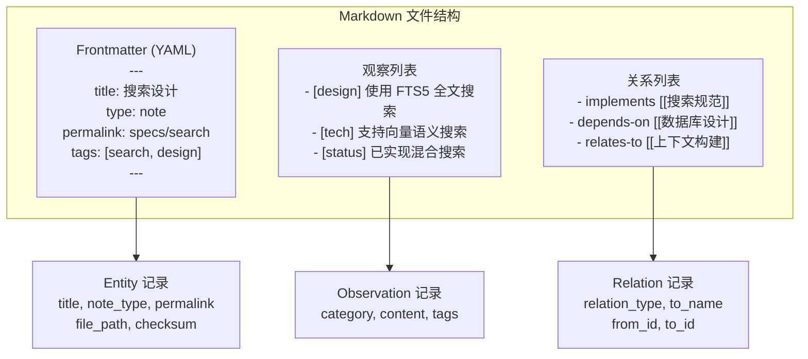
```mermaid
graph TB
    subgraph "Markdown 文件结构"
        FM["Frontmatter (YAML)<br/>---<br/>title: 搜索设计<br/>type: note<br/>permalink: specs/search<br/>tags: [search, design]<br/>---"]
        OBS["观察列表<br/>- [design] 使用 FTS5 全文搜索<br/>- [tech] 支持向量语义搜索<br/>- [status] 已实现混合搜索"]
        REL["关系列表<br/>- implements [[搜索规范]]<br/>- depends-on [[数据库设计]]<br/>- relates-to [[上下文构建]]"]
    end

    FM --> DB1["Entity 记录<br/>title, note_type, permalink<br/>file_path, checksum"]
    OBS --> DB2["Observation 记录<br/>category, content, tags"]
    REL --> DB3["Relation 记录<br/>relation_type, to_name<br/>from_id, to_id"]
```

### Markdown → 数据库映射

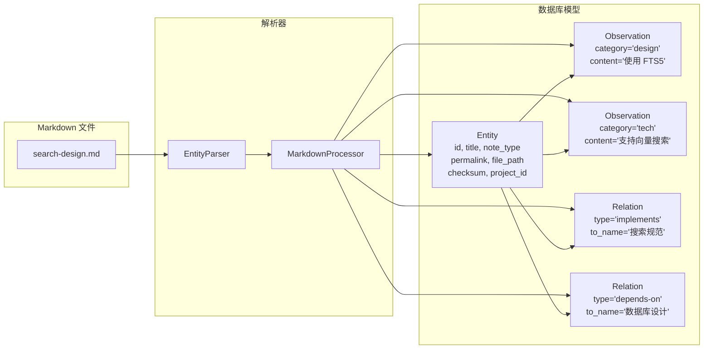
```mermaid
flowchart LR
    subgraph "Markdown 文件"
        MD["search-design.md"]
    end

    subgraph "解析器"
        EP["EntityParser"]
        MP["MarkdownProcessor"]
    end

    subgraph "数据库模型"
        E["Entity<br/>id, title, note_type<br/>permalink, file_path<br/>checksum, project_id"]
        O1["Observation<br/>category='design'<br/>content='使用 FTS5'"]
        O2["Observation<br/>category='tech'<br/>content='支持向量搜索'"]
        R1["Relation<br/>type='implements'<br/>to_name='搜索规范'"]
        R2["Relation<br/>type='depends-on'<br/>to_name='数据库设计'"]
    end

    MD --> EP
    EP --> MP
    MP --> E
    MP --> O1
    MP --> O2
    MP --> R1
    MP --> R2

    E --> O1
    E --> O2
    E --> R1
    E --> R2
```

### 权衡

| 决策 | 优势 | 代价 |
|------|------|------|
| Markdown 为源真相 | 人类可读，Git 友好 | 解析复杂度 |
| 观察用 [category] 前缀 | 结构化分类 | 需要严格遵守格式 |
| WikiLinks [[Target]] | 直觉化的链接语法 | 需要解析和消歧 |
| Frontmatter 元数据 | 机器可读的元信息 | 需要确保与文件内容同步 |

---

## 10. 项目解析设计

### 动机

MCP 工具需要知道操作哪个项目，但用户可能不总是显式指定。需要一套统一的解析逻辑，从环境变量、显式参数、配置默认值到发现模式逐级回退。

### 方案

`ProjectResolver` 实现线性优先链解析，从最高优先级到最低优先级依次尝试。

```mermaid
flowchart TD
    Start["resolve(project, allow_discovery)"] --> A{BASIC_MEMORY_MCP_PROJECT<br/>环境变量?}
    A -->|是| B["ENV_CONSTRAINT<br/>使用环境变量约束"]
    A -->|否| C{project 参数提供?}
    C -->|是| D["EXPLICIT<br/>使用显式参数"]
    C -->|否| E{default_project 配置?}
    E -->|是| F["DEFAULT<br/>使用配置默认项目"]
    E -->|否| G{allow_discovery?}
    G -->|是| H["DISCOVERY<br/>无项目，发现模式"]
    G -->|否| I["NONE<br/>无法解析"]

    B --> J["ResolvedProject<br/>project, mode, reason"]
    D --> J
    F --> J
    H --> J
    I --> J
```

### 项目解析决策流程（含缓存）

```mermaid
sequenceDiagram
    participant Tool as MCP Tool
    participant RPP as resolve_project_parameter()
    participant Cache as MCP Context Cache
    participant PR as ProjectResolver
    participant CM as ConfigManager
    participant API as Projects API

    Tool->>RPP: project=None
    RPP->>Cache: get_cached_active_project()
    Cache-->>RPP: cached_project (if any)

    alt 有缓存项目
        RPP->>RPP: 使用缓存项目名
    end

    alt 无默认项目
        RPP->>Cache: get_cached_default_project()
        Cache-->>RPP: cached_default (if any)
        alt 仍无默认
            RPP->>API: GET /v2/projects/
            API-->>RPP: default_project name
            RPP->>Cache: 缓存 default_project_name
        end
    end

    RPP->>CM: config.default_project
    RPP->>PR: ProjectResolver.from_env(default_project)
    PR->>PR: resolve(project)
    PR-->>RPP: ResolvedProject
    RPP-->>Tool: resolved_project_name
```

### 权衡

| 决策 | 优势 | 代价 |
|------|------|------|
| 线性优先链 | 逻辑清晰，可预测 | 优先级固定，不可配置 |
| 环境变量最高 | 运维可强制约束项目 | 可能覆盖用户意图 |
| MCP Context 缓存 | 避免重复 API 调用 | 缓存可能过期 |
| 发现模式 | 灵活，支持跨项目操作 | 需要工具显式允许 |

---

## 11. 配置管理

### 动机

配置需要在多进程间共享（CLI 修改配置后 MCP 服务器需感知），同时支持环境变量覆盖文件配置，且需要自动迁移遗留格式。

### 方案

`ConfigManager` 使用文件缓存 + mtime/size 跨进程失效检测，`BasicMemoryConfig` 基于 Pydantic Settings 实现环境变量优先。

```mermaid
sequenceDiagram
    participant Caller as 调用方
    participant CM as ConfigManager
    participant Cache as 模块级缓存
    participant FS as config.json
    participant Env as 环境变量

    Caller->>CM: load_config()
    CM->>Cache: 检查 _CONFIG_CACHE

    alt 缓存存在
        CM->>FS: stat() 获取 mtime + size
        alt mtime 和 size 未变
            Cache-->>CM: 返回缓存配置
        else mtime 或 size 变化
            CM->>CM: 清除缓存
            CM->>FS: 读取 config.json
        end
    else 无缓存
        CM->>FS: 读取 config.json
    end

    FS-->>CM: JSON 数据
    CM->>CM: 检测遗留格式
    CM->>Env: 读取环境变量覆盖
    CM->>CM: BasicMemoryConfig(**merged_data)
    CM->>CM: migrate_legacy_projects()
    CM->>Cache: 更新缓存 + mtime/size

    alt 遗留格式需要迁移
        CM->>FS: 备份 config.json.bak
        CM->>FS: 重写 config.json
    end

    CM-->>Caller: BasicMemoryConfig
```

### 配置加载与缓存时序

```mermaid
flowchart TD
    A[ConfigManager.load_config] --> B{_CONFIG_CACHE 存在?}
    B -->|否| C[读取 config.json]
    B -->|是| D[stat config.json]

    D --> E{mtime + size 未变?}
    E -->|是| F[返回缓存]
    E -->|否| G[清除缓存]
    G --> C

    C --> H[检测遗留格式]
    H --> I{旧格式?<br/>projects: name→path}
    I -->|是| J[迁移为 ProjectEntry]
    I -->|否| K[保持不变]

    J --> L[合并环境变量覆盖]
    K --> L

    L --> M[BasicMemoryConfig(**merged)]
    M --> N[model_validator: migrate_legacy_projects]
    N --> O[更新缓存 + mtime/size]

    O --> P{需要重写文件?}
    P -->|是| Q[备份 → 重写 config.json]
    P -->|否| R[返回配置]

    Q --> R
```

### ProjectEntry 统一配置

```mermaid
classDiagram
    class ProjectEntry {
        +path: str
        +mode: ProjectMode
        +workspace_id: str
        +local_sync_path: str
        +bisync_initialized: bool
        +last_sync: datetime
    }

    class BasicMemoryConfig {
        +projects: Dict~str, ProjectEntry~
        +default_project: str
        +database_backend: DatabaseBackend
        +database_url: str
        +cloud_api_key: str
        +cloud_host: str
        +default_workspace: str
        +semantic_search_enabled: bool
        +sync_changes: bool
        +permalinks_include_project: bool
        +get_project_mode(name) ProjectMode
        +set_project_mode(name, mode) void
    }

    BasicMemoryConfig *-- ProjectEntry
```

### 权衡

| 决策 | 优势 | 代价 |
|------|------|------|
| mtime/size 失效检测 | 跨进程感知配置变更 | 粗粒度文件系统可能误判 |
| 环境变量优先 | 部署灵活 | 可能意外覆盖文件配置 |
| 自动迁移遗留格式 | 升级无痛 | 迁移逻辑增加复杂度 |
| Pydantic Settings | 类型安全，验证自动 | 嵌套模型环境变量映射复杂 |

---

## 12. 链接解析多策略

### 动机

Markdown 中的 WikiLinks `[[Target]]` 可能引用 permalink、标题、文件路径或模糊匹配，需要一套从精确到模糊的渐进式解析策略。

### 方案

`LinkResolver` 实现五级解析策略，从最快最精确到最慢最模糊。

```mermaid
flowchart TD
    A["resolve_link(link_text)"] --> B[标准化链接文本<br/>去除 [[]], 处理别名]

    B --> C{external_id (UUID)?}
    C -->|是| D["1. 精确 external_id 匹配"]
    D -->|找到| Z[返回 Entity]

    C -->|否| E{项目命名空间?<br/>project::note}
    E -->|是| F[切换项目作用域]
    F --> G

    E -->|否| G["2. 精确 permalink 匹配<br/>build_permalink_resolution_candidates()"]
    G -->|找到| Z

    G -->|未找到| H["3. 精确标题匹配<br/>get_by_title()"]
    H -->|找到| Z

    H -->|未找到| I["4. 文件路径匹配<br/>get_by_file_path()"]
    I -->|找到| Z

    I -->|未找到| J{路径含 / ?}
    J -->|是| K["4b. 路径 + .md 扩展名"]
    K -->|找到| Z
    K -->|未找到| L

    J -->|否| L{strict 模式?}
    L -->|是| M[返回 None]
    L -->|否| N["5. 搜索模糊匹配<br/>SearchService.search()"]
    N -->|找到| Z
    N -->|未找到| M

    style D fill:#c8e6c9
    style G fill:#c8e6c9
    style H fill:#fff9c4
    style I fill:#ffccbc
    style N fill:#f8bbd0
```

### 上下文感知解析

```mermaid
flowchart TD
    A[有 source_path?] -->|是| B[收集所有候选]
    B --> C[permalink 匹配]
    B --> D[title 匹配]
    C --> E{多个候选?}
    D --> E
    E -->|1个| F[返回唯一候选]
    E -->|多个| G["_find_closest_entity()<br/>按路径邻近度排序"]

    G --> H["优先级:<br/>0: 同文件夹<br/>1-N: 祖先文件夹<br/>100+N: 后代文件夹<br/>1000: 无关路径"]
    H --> F

    A -->|否| I[标准解析<br/>permalink → title → path → search]
```

### 权衡

| 决策 | 优势 | 代价 |
|------|------|------|
| 五级渐进解析 | 精确优先，性能好 | 解析链较长 |
| 上下文感知 | 同名实体选择更智能 | 需要传递 source_path |
| 模糊搜索回退 | 高召回率 | 可能返回不相关结果 |
| strict 模式 | 关系解析可禁止模糊匹配 | 可能导致关系无法解析 |

---

## 13. 上下文构建

### 动机

LLM 需要从 `memory://` URI 构建知识图谱上下文，包括精确实体、模式匹配和关联遍历，以维持对话连续性。

### 方案

`ContextService` 支持三种上下文构建模式：精确实体、通配符模式、最近活动。使用递归 CTE 遍历知识图谱关联。

```mermaid
sequenceDiagram
    participant Tool as build_context()
    participant Svc as ContextService
    participant SR as SearchRepository
    participant LR as LinkResolver
    participant OR as ObservationRepository
    participant DB as 数据库

    Tool->>Svc: build_context("memory://specs/search", depth=2)

    alt 精确实体
        Svc->>SR: search(permalink=normalized_path)
        SR->>DB: 精确查询
        DB-->>SR: 主结果
    else 通配符模式
        Svc->>SR: search(permalink_match="specs/*")
        SR->>DB: LIKE 查询
        DB-->>SR: 匹配结果列表
    else 无匹配
        Svc->>LR: resolve_link(path)
        LR-->>Svc: 解析后的 Entity
        Svc->>SR: search(permalink=entity.permalink)
        SR->>DB: 精确查询
        DB-->>SR: 主结果
    end

    Svc->>SR: find_related(entity_ids, max_depth=4)
    SR->>DB: 递归 CTE<br/>遍历关系图
    DB-->>SR: 关联实体 + 关系

    Svc->>OR: find_by_entities(entity_ids)
    OR->>DB: 批量查询观察
    DB-->>OR: 观察列表

    Svc->>Svc: 组装 ContextResult<br/>primary + observations + related
    Svc-->>Tool: ContextResult
```

### 递归 CTE 关系遍历

```mermaid
flowchart TD
    A["种子实体 IDs"] --> B["递归 CTE: entity_graph"]
    B --> C["Base: 种子实体<br/>depth=0"]
    C --> D["Step 1: 查找关系<br/>depth+1"]
    D --> E["Step 2: 查找关系对端实体<br/>depth+1"]
    E --> D

    D --> F["SQLite: 双 UNION ALL 分支<br/>关系 + 实体"]
    E --> G["Postgres: CROSS JOIN LATERAL<br/>单递归引用"]

    F --> H["DISTINCT + GROUP BY<br/>去重 + 最小深度"]
    G --> H
    H --> I["ORDER BY depth<br/>LIMIT max_results"]
```

### 权衡

| 决策 | 优势 | 代价 |
|------|------|------|
| 递归 CTE 遍历 | 单次查询获取多跳关系 | 深度遍历可能性能差 |
| 双后端 CTE | 各自优化 SQL | 维护两套查询 |
| LinkResolver 回退 | 提高解析成功率 | 额外搜索开销 |
| 分页支持 | 大结果集可控 | 需要额外查询判断 has_more |

---

## 14. 工作区上下文

### 动机

云端部署需要区分不同工作区（个人/组织），permalink 需要包含工作区前缀以实现跨工作区唯一性，但本地模式不需要工作区概念。

### 方案

使用 `ContextVar` 传递工作区信息，中间件从请求头提取，permalink 生成时根据上下文决定是否添加前缀。

```mermaid
flowchart TD
    A["HTTP 请求"] --> B["workspace_permalink_context_middleware"]
    B --> C{"X-Basic-Memory-Workspace-Slug<br/>X-Basic-Memory-Workspace-Type<br/>请求头存在?"}
    C -->|是| D["设置 ContextVar<br/>workspace_permalink_context"]
    C -->|否| E["ContextVar = None"]

    D --> F["请求处理"]
    E --> F

    F --> G{"生成 permalink"}
    G --> H{"current_workspace_permalink_context()<br/>有值?"}
    H -->|是| I["permalink = <br/>workspace_slug/project/path"]
    H -->|否| J["permalink = <br/>project/path"]

    I --> K["写入数据库 + 搜索索引"]
    J --> K
```

### WorkspaceProjectIndex 会话缓存

```mermaid
flowchart TD
    A["MCP 会话开始"] --> B{"需要项目路由?"}
    B -->|是| C{"Context 中有缓存索引?"}
    C -->|是| D["使用缓存索引"]
    C -->|否| E["get_available_workspaces()"]

    E --> F{"workspace_provider 注入?"}
    F -->|是| G["使用注入的提供者"]
    F -->|否| H["HTTP 调用控制平面"]

    G --> I["并行获取各工作区项目"]
    H --> I

    I --> J["构建 WorkspaceProjectIndex<br/>entries_by_permalink<br/>entries_by_external_id"]
    J --> K["缓存到 MCP Context"]
    K --> D

    D --> L["项目名消歧<br/>qualified_name = workspace/project"]
```

### 权衡

| 决策 | 优势 | 代价 |
|------|------|------|
| ContextVar 传递 | 无侵入，异步安全 | 需要正确设置/重置 |
| 请求头传递 | HTTP 协议标准 | 本地 ASGI 也需传递 |
| 会话级缓存 | 避免重复发现 | 缓存可能过期 |
| 工作区消歧 | 跨工作区项目名唯一 | 增加用户输入复杂度 |

---

## 15. 数据库模型关系

### 动机

知识图谱需要实体、观察、关系三种核心概念，同时需要项目隔离和云端同步支持。

### 方案

以 Entity 为核心，Observation 和 Relation 为附属，Project 提供隔离边界，NoteContent 支持云端内容物化。

```mermaid
erDiagram
    Project ||--o{ Entity : "拥有"
    Project ||--o{ Observation : "拥有"
    Project ||--o{ Relation : "拥有"
    Project ||--o{ NoteContent : "拥有"

    Entity ||--o{ Observation : "拥有"
    Entity ||--o{ Relation : "发出(outgoing)"
    Entity ||--o{ Relation : "接收(incoming)"
    Entity ||--o| NoteContent : "物化内容"

    Entity {
        int id PK
        string external_id UK
        string title
        string note_type
        json entity_metadata
        string content_type
        int project_id FK
        string permalink
        string file_path
        string checksum
        float mtime
        int size
        datetime created_at
        datetime updated_at
        string created_by
        string last_updated_by
    }

    Observation {
        int id PK
        int project_id FK
        int entity_id FK
        string content
        string category
        string context
        json tags
    }

    Relation {
        int id PK
        int project_id FK
        int from_id FK
        int to_id FK
        string to_name
        string relation_type
        string context
    }

    Project {
        int id PK
        string external_id UK
        string name UK
        string permalink UK
        string path
        string description
        boolean is_active
        boolean is_default
        float last_scan_timestamp
        int last_file_count
        datetime created_at
        datetime updated_at
    }

    NoteContent {
        int entity_id PK_FK
        int project_id FK
        string external_id
        string file_path
        text markdown_content
        bigint db_version
        string db_checksum
        bigint file_version
        string file_checksum
        string file_write_status
        string last_source
        datetime updated_at
        datetime file_updated_at
        text last_materialization_error
    }
```

### 数据库后端对比

```mermaid
graph LR
    subgraph "SQLite (本地)"
        S1["FTS5 全文搜索"]
        S2["sqlite_vec 向量搜索"]
        S3["WAL 并发读写"]
        S4["单文件部署"]
        S5["BM25 排名"]
    end

    subgraph "Postgres (云端)"
        P1["tsvector + GIN 索引"]
        P2["pgvector 向量搜索"]
        P3["连接池 + 多并发"]
        P4["Neon Serverless"]
        P5["ts_rank 排名"]
        P6["LATERAL JOIN CTE"]
        P7["pg_trgm 模糊匹配"]
    end
```

### 权衡

| 决策 | 优势 | 代价 |
|------|------|------|
| Entity 为核心 | 模型简洁，关系清晰 | 大实体可能性能差 |
| Project 隔离 | 多租户安全 | 跨项目查询复杂 |
| NoteContent 物化 | 云端无需文件系统 | 需要同步状态管理 |
| external_id UUID | API 引用稳定 | 额外索引开销 |
| 双后端 | 部署灵活 | 维护两套 SQL |
