# Basic Memory 技术规格文档

> 版本：1.0 | 更新日期：2026-06-07
> 项目：Basic Memory —— 基于 MCP 的本地优先知识管理系统

---

## 目录

1. [系统概述](#1-系统概述)
2. [系统整体架构](#2-系统整体架构)
3. [核心模块详解](#3-核心模块详解)
   - 3.1 [MCP 模块](#31-mcp-模块)
   - 3.2 [同步模块](#32-同步模块)
   - 3.3 [服务层](#33-服务层)
   - 3.4 [仓库层](#34-仓库层)
   - 3.5 [API 层](#35-api-层)
   - 3.6 [CLI 层](#36-cli-层)
   - 3.7 [数据模型](#37-数据模型)
   - 3.8 [配置与运行时](#38-配置与运行时)
   - 3.9 [Markdown 解析](#39-markdown-解析)
   - 3.10 [索引模块](#310-索引模块)
   - 3.11 [Schema 推理](#311-schema-推理)
4. [核心交互时序图](#4-核心交互时序图)
5. [数据流图](#5-数据流图)
6. [状态机图](#6-状态机图)
7. [决策流程图](#7-决策流程图)
8. [类图](#8-类图)
9. [跨模块依赖关系](#9-跨模块依赖关系)

---

## 1. 系统概述

Basic Memory 是一个基于 Model Context Protocol (MCP) 的本地优先知识管理系统。它实现了 LLM 与 Markdown 文件之间的双向通信，构建了一个可通过文档间链接遍历的个人知识图谱。

### 核心设计原则

- **文件即真相**：Markdown 文件是数据的唯一权威来源，数据库仅作为索引层
- **本地优先**：所有核心功能在本地运行，云同步为可选增强
- **组合根模式**：每个入口点（MCP/API/CLI）拥有独立的组合根，统一读取配置
- **项目级隔离**：数据按项目隔离，每个项目可独立配置本地/云模式
- **原子操作**：文件写入采用原子操作，确保数据一致性

### 知识表示模型

```
Entity（实体）      → Markdown 文件，知识图谱的节点
Observation（观察） → 实体的分类事实，格式：- [category] content
Relation（关系）    → 实体间的有向链接，格式：- relation_type [[Target]]
Frontmatter（元数据）→ YAML 格式的实体元信息
```

---

## 2. 系统整体架构

### 2.1 C4 组件图

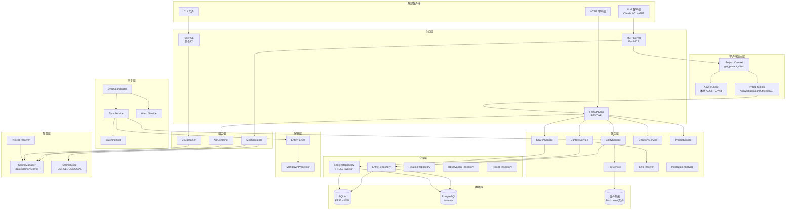
```mermaid
graph TB
    subgraph 外部客户端
        LLM[LLM 客户端<br/>Claude / ChatGPT]
        CLI_USER[CLI 用户]
        HTTP_CLIENT[HTTP 客户端]
    end

    subgraph 入口层
        MCP_SERVER[MCP Server<br/>FastMCP]
        API_APP[FastAPI App<br/>REST API]
        CLI_APP[Typer CLI<br/>命令行]
    end

    subgraph 组合根
        MCP_C[McpContainer]
        API_C[ApiContainer]
        CLI_C[CliContainer]
    end

    subgraph 客户端路由层
        PROJ_CTX[Project Context<br/>get_project_client]
        ASYNC_CLT[Async Client<br/>本地 ASGI / 云代理]
        TYPED_CLT[Typed Clients<br/>Knowledge/Search/Memory/...]
    end

    subgraph 服务层
        ENTITY_SVC[EntityService]
        SEARCH_SVC[SearchService]
        CONTEXT_SVC[ContextService]
        DIR_SVC[DirectoryService]
        FILE_SVC[FileService]
        LINK_RSV[LinkResolver]
        PROJ_SVC[ProjectService]
        INIT_SVC[InitializationService]
    end

    subgraph 同步层
        SYNC_COORD[SyncCoordinator]
        SYNC_SVC[SyncService]
        WATCH_SVC[WatchService]
        BATCH_IDX[BatchIndexer]
    end

    subgraph 仓库层
        ENTITY_REPO[EntityRepository]
        SEARCH_REPO[SearchRepository<br/>FTS5 / tsvector]
        RELATION_REPO[RelationRepository]
        OBS_REPO[ObservationRepository]
        PROJ_REPO[ProjectRepository]
    end

    subgraph 数据层
        SQLITE[(SQLite<br/>FTS5 + WAL)]
        POSTGRES[(PostgreSQL<br/>tsvector)]
        FS[(文件系统<br/>Markdown 文件)]
    end

    subgraph 解析层
        ENTITY_PARSER[EntityParser]
        MD_PROCESSOR[MarkdownProcessor]
    end

    subgraph 配置层
        CONFIG[ConfigManager<br/>BasicMemoryConfig]
        RUNTIME[RuntimeMode<br/>TEST/CLOUD/LOCAL]
        PROJ_RESOLVER[ProjectResolver]
    end

    LLM --> MCP_SERVER
    CLI_USER --> CLI_APP
    HTTP_CLIENT --> API_APP

    MCP_SERVER --> MCP_C
    API_APP --> API_C
    CLI_APP --> CLI_C

    MCP_C --> CONFIG
    API_C --> CONFIG
    CLI_C --> CONFIG
    MCP_C --> RUNTIME

    MCP_SERVER --> PROJ_CTX
    PROJ_CTX --> ASYNC_CLT
    PROJ_CTX --> TYPED_CLT
    TYPED_CLT --> API_APP

    API_APP --> ENTITY_SVC
    API_APP --> SEARCH_SVC
    API_APP --> CONTEXT_SVC
    API_APP --> DIR_SVC
    API_APP --> PROJ_SVC

    ENTITY_SVC --> ENTITY_REPO
    ENTITY_SVC --> FILE_SVC
    SEARCH_SVC --> SEARCH_REPO
    CONTEXT_SVC --> ENTITY_REPO
    CONTEXT_SVC --> LINK_RSV

    SYNC_COORD --> SYNC_SVC
    SYNC_COORD --> WATCH_SVC
    SYNC_SVC --> BATCH_IDX
    SYNC_SVC --> ENTITY_PARSER
    SYNC_SVC --> ENTITY_SVC

    ENTITY_REPO --> SQLITE
    ENTITY_REPO --> POSTGRES
    SEARCH_REPO --> SQLITE
    SEARCH_REPO --> POSTGRES
    FILE_SVC --> FS

    ENTITY_PARSER --> MD_PROCESSOR
    PROJ_RESOLVER --> CONFIG
```

### 2.2 分层架构概览

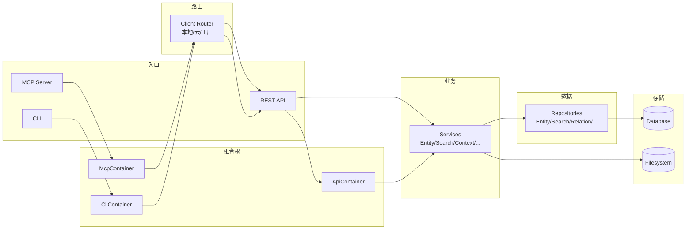
```mermaid
graph LR
    subgraph 入口
        MCP[MCP Server]
        API[REST API]
        CLI[CLI]
    end

    subgraph 组合根
        C1[McpContainer]
        C2[ApiContainer]
        C3[CliContainer]
    end

    subgraph 路由
        R[Client Router<br/>本地/云/工厂]
    end

    subgraph 业务
        S[Services<br/>Entity/Search/Context/...]
    end

    subgraph 数据
        D[Repositories<br/>Entity/Search/Relation/...]
    end

    subgraph 存储
        DB[(Database)]
        FS[(Filesystem)]
    end

    MCP --> C1 --> R --> API --> S --> D --> DB
    API --> C2 --> S
    CLI --> C3 --> R --> API
    S --> FS
```

---

## 3. 核心模块详解

### 3.1 MCP 模块

#### 职责

MCP 模块是 Basic Memory 与 LLM 交互的核心入口，负责：
- 暴露 MCP 工具和提示词供 LLM 调用
- 管理服务器生命周期（数据库初始化、同步启动/停止）
- 通过类型化客户端路由请求到正确的 API 端点
- 解决项目路由的"先有鸡还是先有蛋"引导问题

#### 核心组件

| 组件 | 文件 | 职责 |
|------|------|------|
| MCP Server | `mcp/server.py` | FastMCP 入口，lifespan 管理 |
| McpContainer | `mcp/container.py` | 组合根，唯一读取 ConfigManager |
| AsyncClient | `mcp/async_client.py` | HTTP 客户端路由（ASGI/云/工厂） |
| ProjectContext | `mcp/project_context.py` | 项目上下文，get_project_client() |
| Typed Clients | `mcp/clients/` | 类型化 API 客户端 |
| Tools | `mcp/tools/` | MCP 工具实现 |
| Prompts | `mcp/prompts/` | MCP 提示词 |

#### 核心接口

```python
# 最核心接口 —— MCP 工具必须使用
async def get_project_client(
    project: str | None = None,
    context: Context | None = None,
    project_id: str | None = None,
) -> AsyncIterator[Tuple[AsyncClient, ProjectItem]]: ...

# 非项目级代码使用
async def get_client(
    project_name: str | None = None,
    workspace: str | None = None,
) -> AsyncIterator[AsyncClient]: ...
```

#### 依赖关系

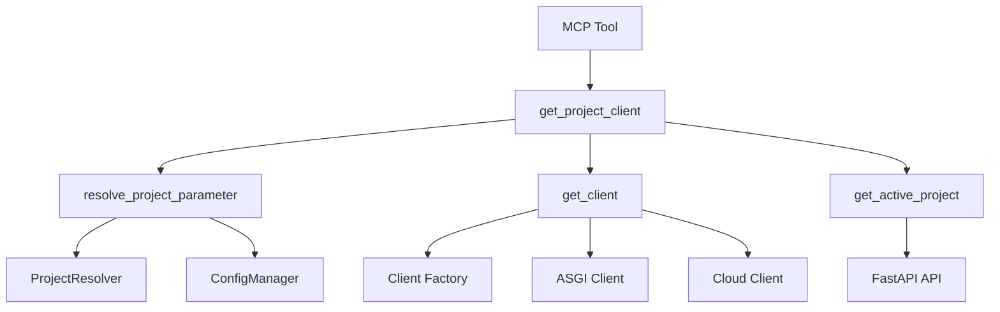
```mermaid
graph TD
    MCP_TOOL[MCP Tool] --> GPC[get_project_client]
    GPC --> RPP[resolve_project_parameter]
    GPC --> GC[get_client]
    RPP --> PR[ProjectResolver]
    RPP --> CM[ConfigManager]
    GC --> FACTORY[Client Factory]
    GC --> ASGI[ASGI Client]
    GC --> CLOUD[Cloud Client]
    GPC --> GAP[get_active_project]
    GAP --> API[FastAPI API]
```

---

### 3.2 同步模块

#### 职责

同步模块负责文件系统与数据库之间的双向同步，是"文件即真相"原则的执行者：
- 检测文件系统变更（新增/修改/删除/移动）
- 将变更同步到数据库索引
- 监视文件系统实时变更
- 管理同步生命周期

#### 核心组件

| 组件 | 文件 | 职责 |
|------|------|------|
| SyncCoordinator | `sync/coordinator.py` | 同步生命周期集中协调器 |
| SyncService | `sync/sync_service.py` | 文件系统与数据库双向同步 |
| WatchService | `sync/watch_service.py` | 基于 watchfiles 的文件监视 |
| BatchIndexer | `indexing/batch_indexer.py` | 批量索引器 |

#### 关键机制

**熔断器机制**：当单个文件连续失败超过 `MAX_CONSECUTIVE_FAILURES=3` 次时，跳过该文件，避免无限重试。文件变更后会重置计数。

**扫描策略**：
- 首次同步：全量扫描
- 增量同步：基于 `last_scan_timestamp` 水位线，使用 `find -newermt` 快速定位变更文件
- 文件数减少：触发全量扫描以检测删除
- 强制全量：`force_full=True` 绕过水位线优化

**移动检测**：通过 checksum 匹配检测文件移动（新路径的 checksum 与旧路径实体匹配，且旧路径文件不存在）。

#### 核心接口

```python
class SyncService:
    async def sync(directory, project_name, force_full, sync_embeddings, progress_callback) -> SyncReport
    async def sync_file(path, new) -> Tuple[Optional[Entity], Optional[str]]
    async def scan(directory, force_full) -> SyncReport
    async def handle_delete(file_path)
    async def handle_move(old_path, new_path)
    async def resolve_relations(entity_id) -> set[int]

class SyncCoordinator:
    async def start()
    async def stop()
    def get_status_info() -> dict

class WatchService:
    async def run()
    async def handle_changes(project, changes)
```

---

### 3.3 服务层

#### 职责

服务层是业务逻辑的核心，封装了所有领域操作：
- 实体 CRUD 与 Markdown 解析
- 全文搜索与语义搜索
- 知识图谱上下文构建
- 文件 I/O 操作
- 链接解析
- 项目管理

#### 核心组件

| 组件 | 文件 | 职责 |
|------|------|------|
| EntityService | `services/entity_service.py` | 实体 CRUD、Markdown 解析、Frontmatter 管理 |
| SearchService | `services/search_service.py` | 全文搜索（FTS5/tsvector）、语义搜索、混合搜索 |
| ContextService | `services/context_service.py` | 从 memory:// URI 构建知识图谱上下文 |
| DirectoryService | `services/directory_service.py` | 目录树结构管理 |
| FileService | `services/file_service.py` | 异步文件 I/O、并发控制、原子操作 |
| LinkResolver | `services/link_resolver.py` | 多策略链接解析 |
| ProjectService | `services/project_service.py` | 项目管理、配置与数据库对账 |
| InitializationService | `services/initialization.py` | 共享初始化服务 |

#### LinkResolver 解析策略

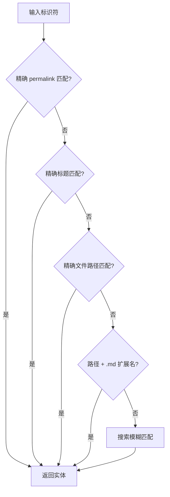
```mermaid
graph TD
    A[输入标识符] --> B{精确 permalink 匹配?}
    B -->|是| Z[返回实体]
    B -->|否| C{精确标题匹配?}
    C -->|是| Z
    C -->|否| D{精确文件路径匹配?}
    D -->|是| Z
    D -->|否| E{路径 + .md 扩展名?}
    E -->|是| Z
    E -->|否| F[搜索模糊匹配]
    F --> Z
```

#### ContextService 上下文构建模式

- **精确匹配**：直接通过 permalink 查找实体
- **模式匹配**：通过前缀匹配查找相关实体
- **最近活动**：按时间范围查找最近更新的实体

---

### 3.4 仓库层

#### 职责

仓库层是数据访问的抽象层，负责：
- 泛型 CRUD 操作
- 项目级数据隔离
- 搜索索引管理（SQLite FTS5 / PostgreSQL tsvector 双实现）

#### 核心组件

| 组件 | 文件 | 职责 |
|------|------|------|
| Repository[T] | `repository/repository.py` | 泛型基础仓库，项目级数据隔离 |
| EntityRepository | `repository/entity_repository.py` | 实体数据访问 |
| SearchRepository | `repository/search_repository.py` | 搜索仓库 Protocol 接口 |
| SqliteSearchRepository | `repository/sqlite_search_repository.py` | SQLite FTS5 实现 |
| PostgresSearchRepository | `repository/postgres_search_repository.py` | PostgreSQL tsvector 实现 |
| RelationRepository | `repository/relation_repository.py` | 关系数据访问 |
| ObservationRepository | `repository/observation_repository.py` | 观察数据访问 |

#### 项目级数据隔离

```python
class Repository[T]:
    def _add_project_filter(self, query: Select) -> Select:
        """所有查询自动添加 project_id 过滤"""
        if self.has_project_id and self.project_id is not None:
            query = query.filter(getattr(self.Model, "project_id") == self.project_id)
        return query
```

#### 搜索仓库双实现

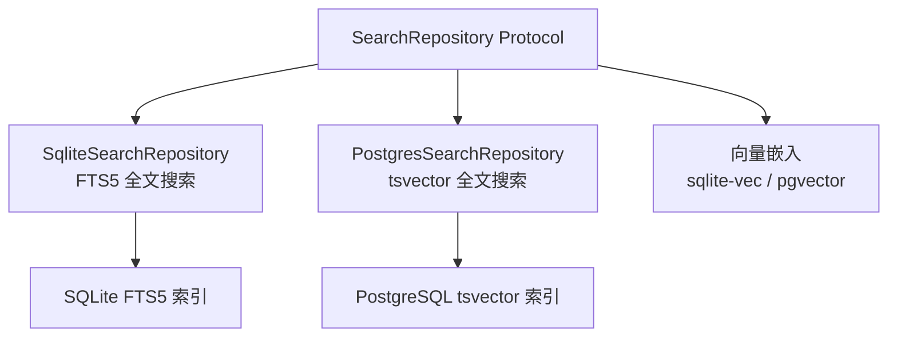
```mermaid
graph TD
    SR[SearchRepository Protocol] --> SQLITE_IMPL[SqliteSearchRepository<br/>FTS5 全文搜索]
    SR --> PG_IMPL[PostgresSearchRepository<br/>tsvector 全文搜索]
    SQLITE_IMPL --> FTS5[SQLite FTS5 索引]
    PG_IMPL --> TSVEC[PostgreSQL tsvector 索引]
    SR --> VEC[向量嵌入<br/>sqlite-vec / pgvector]
```

---

### 3.5 API 层

#### 职责

API 层提供 RESTful HTTP 接口，是所有客户端（MCP 工具、CLI、外部 HTTP 客户端）的统一后端：
- 请求路由与参数验证
- 工作空间 permalink 上下文中间件
- 数据库连接管理

#### 核心组件

| 组件 | 文件 | 职责 |
|------|------|------|
| FastAPI App | `api/app.py` | 应用入口，lifespan 管理 |
| ApiContainer | `api/container.py` | API 组合根 |
| Knowledge Router | `api/v2/routers/knowledge_router.py` | 实体 CRUD |
| Search Router | `api/v2/routers/search_router.py` | 搜索操作 |
| Memory Router | `api/v2/routers/memory_router.py` | 上下文构建 |
| Directory Router | `api/v2/routers/directory_router.py` | 目录管理 |
| Project Router | `api/v2/routers/project_router.py` | 项目管理 |
| Resource Router | `api/v2/routers/resource_router.py` | 资源读取 |
| Schema Router | `api/v2/routers/schema_router.py` | Schema 操作 |

#### 中间件

`workspace_permalink_context_middleware`：从请求头中提取工作空间 permalink 上下文，确保 memory:// URL 的规范化正确处理工作空间前缀。

---

### 3.6 CLI 层

#### 职责

CLI 层提供命令行交互界面：
- 项目管理命令
- 同步与诊断命令
- MCP 工具的 CLI 访问
- 云同步命令

#### 核心组件

| 组件 | 文件 | 职责 |
|------|------|------|
| Main | `cli/main.py` | Typer CLI 入口 |
| CliContainer | `cli/container.py` | CLI 组合根 |
| Doctor | `cli/commands/doctor.py` | 端到端诊断 |
| Status | `cli/commands/status.py` | 同步状态 |
| Project | `cli/commands/project.py` | 项目管理 |
| Tool | `cli/commands/tool.py` | MCP 工具 CLI 访问 |
| Cloud | `cli/commands/cloud/` | 云同步命令 |

#### 路由标志

CLI 支持 `--local` 和 `--cloud` 标志覆盖默认路由：
- `--local`：强制本地 ASGI 路由
- `--cloud`：强制云代理路由
- `BASIC_MEMORY_FORCE_LOCAL=true`：全局强制本地路由

---

### 3.7 数据模型

#### 核心实体关系

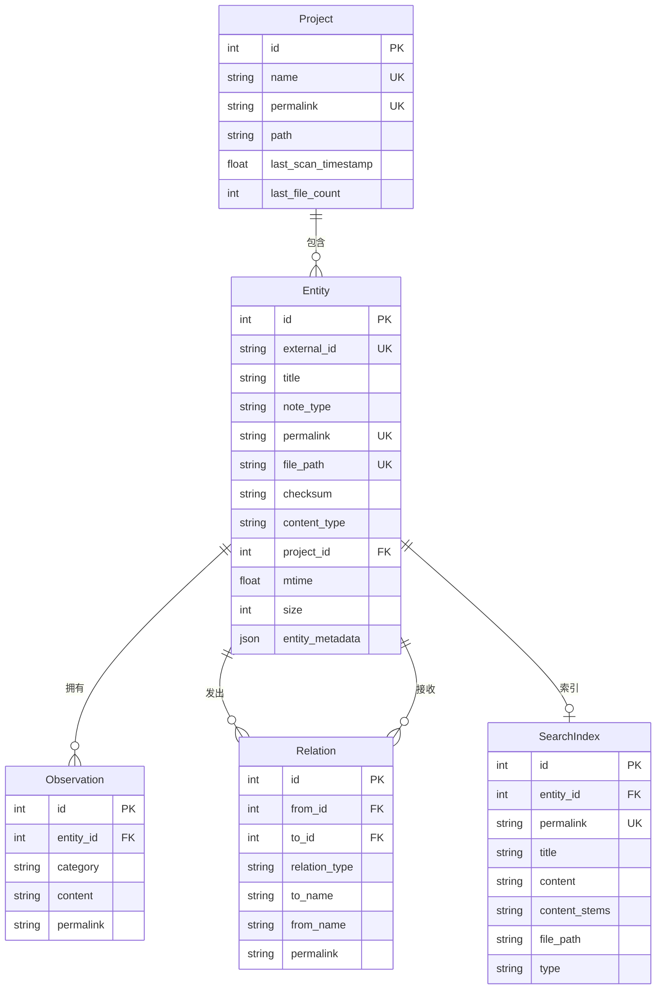
```mermaid
erDiagram
    Project ||--o{ Entity : "包含"
    Entity ||--o{ Observation : "拥有"
    Entity ||--o{ Relation : "发出"
    Entity ||--o{ Relation : "接收"
    Entity ||--o| SearchIndex : "索引"

    Project {
        int id PK
        string name UK
        string permalink UK
        string path
        float last_scan_timestamp
        int last_file_count
    }

    Entity {
        int id PK
        string external_id UK
        string title
        string note_type
        string permalink UK
        string file_path UK
        string checksum
        string content_type
        int project_id FK
        float mtime
        int size
        json entity_metadata
    }

    Observation {
        int id PK
        int entity_id FK
        string category
        string content
        string permalink
    }

    Relation {
        int id PK
        int from_id FK
        int to_id FK
        string relation_type
        string to_name
        string from_name
        string permalink
    }

    SearchIndex {
        int id PK
        int entity_id FK
        string permalink UK
        string title
        string content
        string content_stems
        string file_path
        string type
    }
```

---

### 3.8 配置与运行时

#### 职责

- 集中管理应用配置（Pydantic Settings）
- 运行时模式解析（TEST/CLOUD/LOCAL）
- 统一项目选择逻辑

#### 核心组件

| 组件 | 文件 | 职责 |
|------|------|------|
| BasicMemoryConfig | `config.py` | Pydantic Settings 配置模型 |
| ConfigManager | `config.py` | 配置文件读写管理器 |
| ProjectEntry | `config.py` | 项目配置条目（路径/模式/workspace） |
| ProjectMode | `config.py` | 项目模式枚举（LOCAL/CLOUD） |
| RuntimeMode | `runtime.py` | 运行时模式枚举（TEST/CLOUD/LOCAL） |
| ProjectResolver | `project_resolver.py` | 统一项目选择 |

#### 运行时模式解析

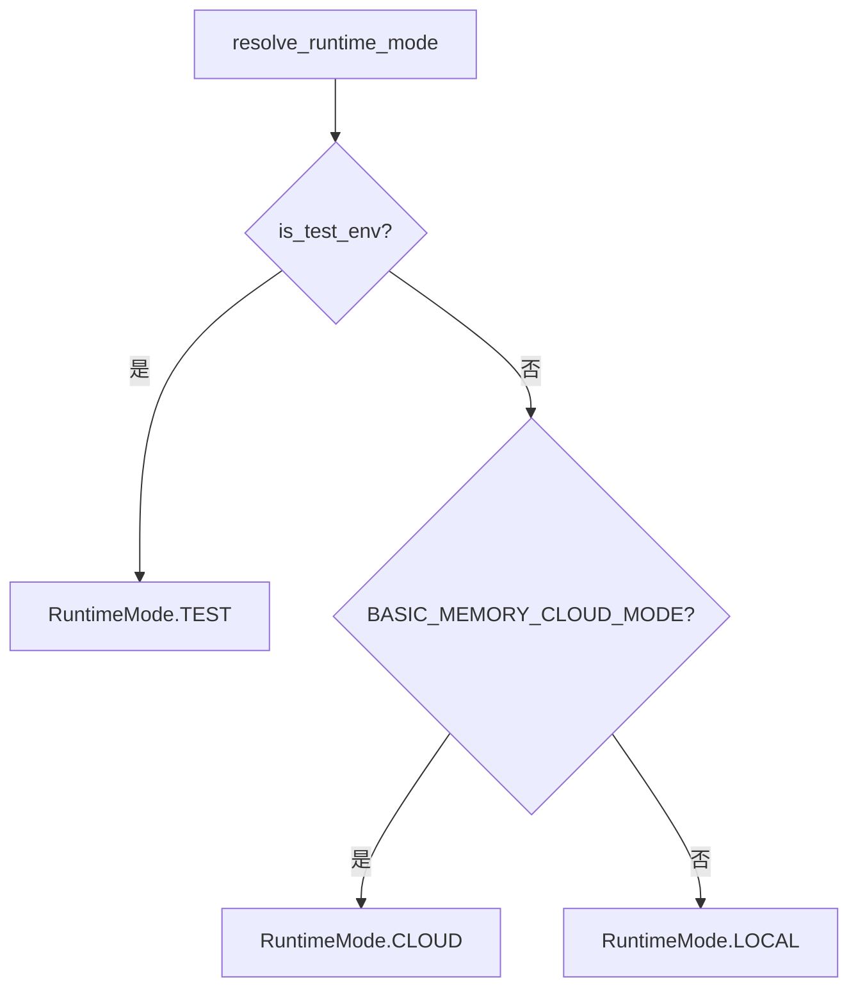
```mermaid
graph TD
    A[resolve_runtime_mode] --> B{is_test_env?}
    B -->|是| C[RuntimeMode.TEST]
    B -->|否| D{BASIC_MEMORY_CLOUD_MODE?}
    D -->|是| E[RuntimeMode.CLOUD]
    D -->|否| F[RuntimeMode.LOCAL]
```

#### 项目解析优先级链

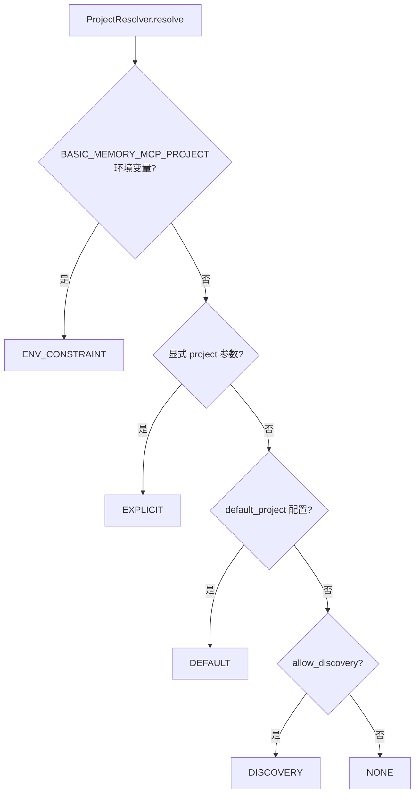
```mermaid
graph TD
    A[ProjectResolver.resolve] --> B{BASIC_MEMORY_MCP_PROJECT<br/>环境变量?}
    B -->|是| C[ENV_CONSTRAINT]
    B -->|否| D{显式 project 参数?}
    D -->|是| E[EXPLICIT]
    D -->|否| F{default_project 配置?}
    F -->|是| G[DEFAULT]
    F -->|否| H{allow_discovery?}
    H -->|是| I[DISCOVERY]
    H -->|否| J[NONE]
```

---

### 3.9 Markdown 解析

#### 职责

将 Markdown 文件解析为结构化的 Entity 对象：
- 解析 Frontmatter 元数据
- 提取 Observation（分类事实）
- 提取 Relation（WikiLinks 关系）
- 处理 Schema 标记

#### 核心组件

| 组件 | 文件 | 职责 |
|------|------|------|
| EntityParser | `markdown/entity_parser.py` | Markdown → Entity 解析 |
| MarkdownProcessor | `markdown/markdown_processor.py` | Markdown 内容处理 |
| Observation Plugin | `markdown/plugins/` | Observation 语法解析插件 |
| Relation Plugin | `markdown/plugins/` | Relation 语法解析插件 |

#### 解析流程

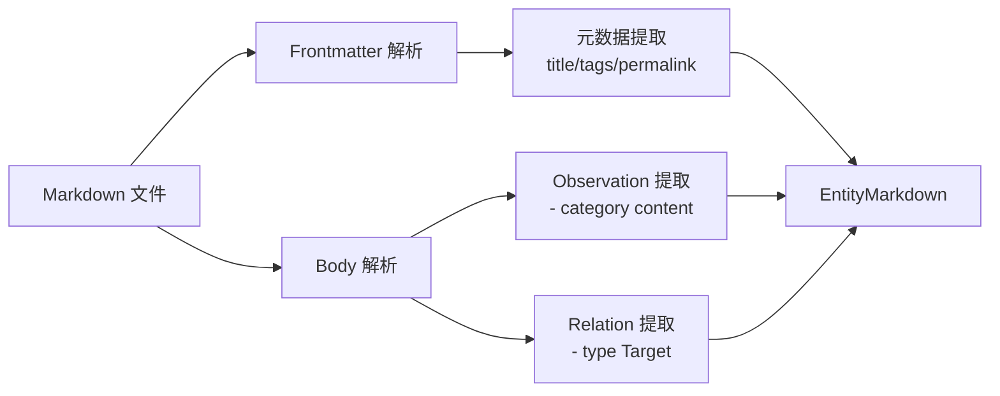
```mermaid
graph LR
    MD[Markdown 文件] --> FM[Frontmatter 解析]
    MD --> BODY[Body 解析]
    FM --> META[元数据提取<br/>title/tags/permalink]
    BODY --> OBS[Observation 提取<br/>- category content]
    BODY --> REL[Relation 提取<br/>- type Target]
    META --> EM[EntityMarkdown]
    OBS --> EM
    REL --> EM
```

---

### 3.10 索引模块

#### 职责

批量索引文件到数据库，支持高效的批量操作：
- 批量文件加载与解析
- 批量实体写入
- 批量搜索索引更新
- 进度回调

#### 核心组件

| 组件 | 文件 | 职责 |
|------|------|------|
| BatchIndexer | `indexing/batch_indexer.py` | 批量索引器 |
| build_index_batches | `indexing/batching.py` | 批量构建逻辑 |

#### 批量索引流程

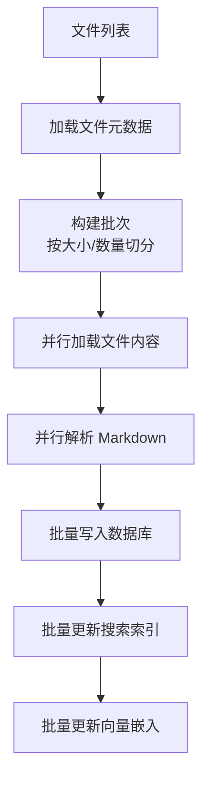
```mermaid
graph TD
    A[文件列表] --> B[加载文件元数据]
    B --> C[构建批次<br/>按大小/数量切分]
    C --> D[并行加载文件内容]
    D --> E[并行解析 Markdown]
    E --> F[批量写入数据库]
    F --> G[批量更新搜索索引]
    G --> H[批量更新向量嵌入]
```

---

### 3.11 Schema 推理

#### 职责

从 Markdown 文件中的结构化数据自动推理 Schema：
- 解析 Schema 标记
- 推理字段类型
- 解析 Schema 引用
- 验证 Schema 一致性
- 差异比较

#### 核心组件

| 组件 | 文件 | 职责 |
|------|------|------|
| Parser | `schema/parser.py` | Schema 解析 |
| Inference | `schema/inference.py` | 类型推理 |
| Resolver | `schema/resolver.py` | 引用解析 |
| Validator | `schema/validator.py` | 一致性验证 |
| Diff | `schema/diff.py` | 差异比较 |

---

## 4. 核心交互时序图

### 4.1 MCP 工具调用（write_note）

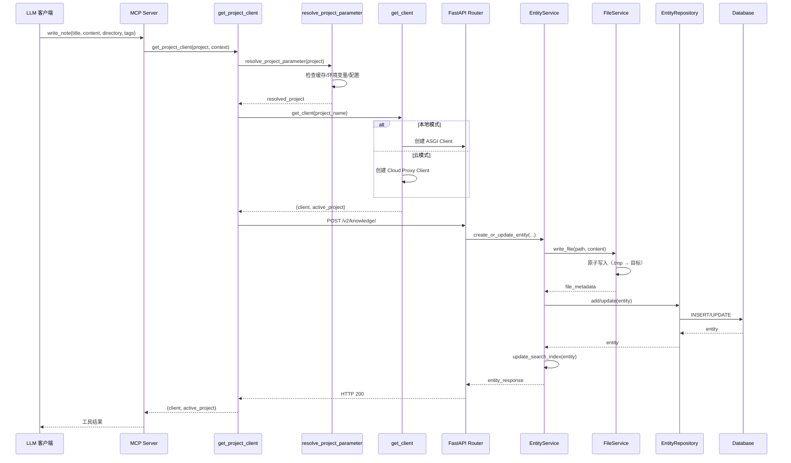
```mermaid
sequenceDiagram
    participant LLM as LLM 客户端
    participant MCP as MCP Server
    participant GPC as get_project_client
    participant RPP as resolve_project_parameter
    participant GC as get_client
    participant API as FastAPI Router
    participant ES as EntityService
    participant FS as FileService
    participant ER as EntityRepository
    participant DB as Database

    LLM->>MCP: write_note(title, content, directory, tags)
    MCP->>GPC: get_project_client(project, context)
    GPC->>RPP: resolve_project_parameter(project)
    RPP->>RPP: 检查缓存/环境变量/配置
    RPP-->>GPC: resolved_project
    GPC->>GC: get_client(project_name)
    
    alt 本地模式
        GC->>API: 创建 ASGI Client
    else 云模式
        GC->>GC: 创建 Cloud Proxy Client
    end
    
    GC-->>GPC: (client, active_project)
    
    GPC->>API: POST /v2/knowledge/
    API->>ES: create_or_update_entity(...)
    ES->>FS: write_file(path, content)
    FS->>FS: 原子写入（.tmp → 目标）
    FS-->>ES: file_metadata
    ES->>ER: add/update(entity)
    ER->>DB: INSERT/UPDATE
    DB-->>ER: entity
    ER-->>ES: entity
    ES->>ES: update_search_index(entity)
    ES-->>API: entity_response
    API-->>GPC: HTTP 200
    GPC-->>MCP: (client, active_project)
    MCP-->>LLM: 工具结果
```

### 4.2 文件同步启动流程

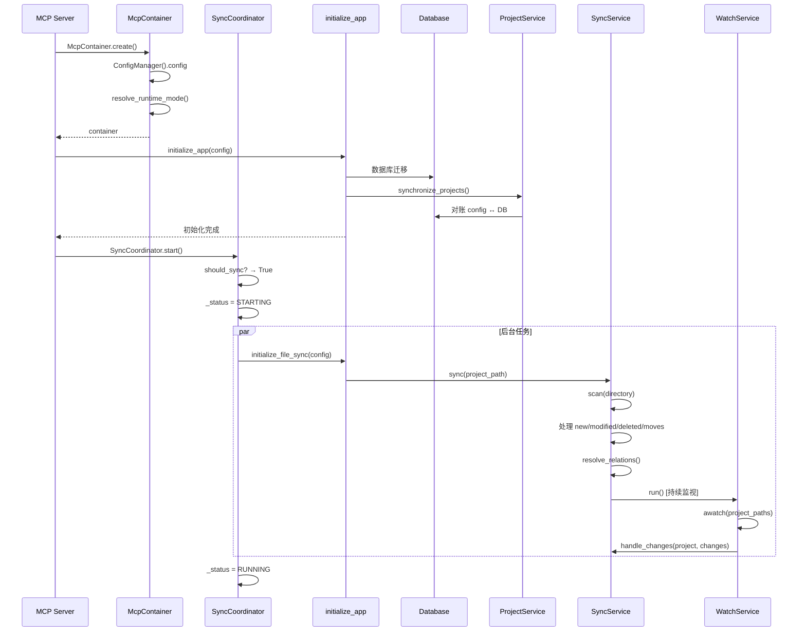
```mermaid
sequenceDiagram
    participant MCP as MCP Server
    participant MC as McpContainer
    participant SC as SyncCoordinator
    participant INIT as initialize_app
    participant DB as Database
    participant PS as ProjectService
    participant SS as SyncService
    participant WS as WatchService

    MCP->>MC: McpContainer.create()
    MC->>MC: ConfigManager().config
    MC->>MC: resolve_runtime_mode()
    MC-->>MCP: container

    MCP->>INIT: initialize_app(config)
    INIT->>DB: 数据库迁移
    INIT->>PS: synchronize_projects()
    PS->>DB: 对账 config ↔ DB
    INIT-->>MCP: 初始化完成

    MCP->>SC: SyncCoordinator.start()
    SC->>SC: should_sync? → True
    SC->>SC: _status = STARTING
    
    par 后台任务
        SC->>INIT: initialize_file_sync(config)
        INIT->>SS: sync(project_path)
        SS->>SS: scan(directory)
        SS->>SS: 处理 new/modified/deleted/moves
        SS->>SS: resolve_relations()
        SS->>WS: run() [持续监视]
        WS->>WS: awatch(project_paths)
        WS->>SS: handle_changes(project, changes)
    end
    
    SC->>SC: _status = RUNNING
```

### 4.3 文件变更处理（WatchService）

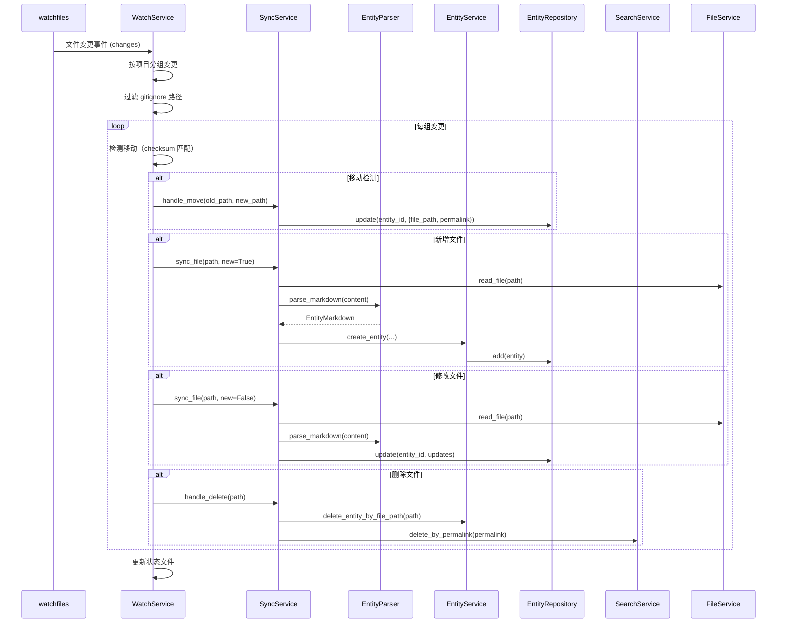
```mermaid
sequenceDiagram
    participant WF as watchfiles
    participant WS as WatchService
    participant SS as SyncService
    participant EP as EntityParser
    participant ES as EntityService
    participant ER as EntityRepository
    participant SEARCH as SearchService
    participant FS as FileService

    WF->>WS: 文件变更事件 (changes)
    WS->>WS: 按项目分组变更
    WS->>WS: 过滤 gitignore 路径

    loop 每组变更
        WS->>WS: 检测移动（checksum 匹配）
        
        alt 移动检测
            WS->>SS: handle_move(old_path, new_path)
            SS->>ER: update(entity_id, {file_path, permalink})
        end
        
        alt 新增文件
            WS->>SS: sync_file(path, new=True)
            SS->>FS: read_file(path)
            SS->>EP: parse_markdown(content)
            EP-->>SS: EntityMarkdown
            SS->>ES: create_entity(...)
            ES->>ER: add(entity)
        end
        
        alt 修改文件
            WS->>SS: sync_file(path, new=False)
            SS->>FS: read_file(path)
            SS->>EP: parse_markdown(content)
            SS->>ER: update(entity_id, updates)
        end
        
        alt 删除文件
            WS->>SS: handle_delete(path)
            SS->>ES: delete_entity_by_file_path(path)
            SS->>SEARCH: delete_by_permalink(permalink)
        end
    end
    
    WS->>WS: 更新状态文件
```

### 4.4 项目路由决策流程

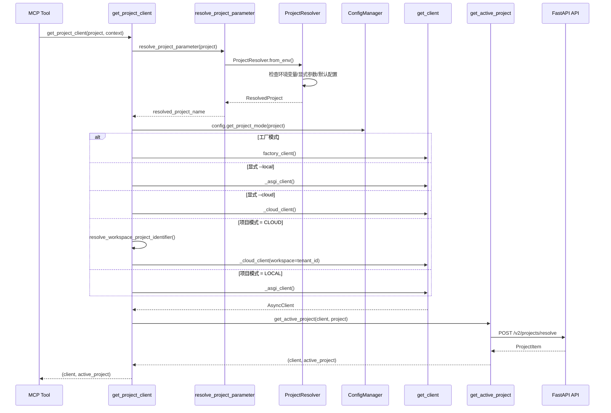
```mermaid
sequenceDiagram
    participant TOOL as MCP Tool
    participant GPC as get_project_client
    participant RPP as resolve_project_parameter
    participant PR as ProjectResolver
    participant CM as ConfigManager
    participant GC as get_client
    participant GAP as get_active_project
    participant API as FastAPI API

    TOOL->>GPC: get_project_client(project, context)
    GPC->>RPP: resolve_project_parameter(project)
    RPP->>PR: ProjectResolver.from_env()
    PR->>PR: 检查环境变量/显式参数/默认配置
    PR-->>RPP: ResolvedProject
    RPP-->>GPC: resolved_project_name
    
    GPC->>CM: config.get_project_mode(project)
    
    alt 工厂模式
        GPC->>GC: factory_client()
    else 显式 --local
        GPC->>GC: _asgi_client()
    else 显式 --cloud
        GPC->>GC: _cloud_client()
    else 项目模式 = CLOUD
        GPC->>GPC: resolve_workspace_project_identifier()
        GPC->>GC: _cloud_client(workspace=tenant_id)
    else 项目模式 = LOCAL
        GPC->>GC: _asgi_client()
    end
    
    GC-->>GPC: AsyncClient
    GPC->>GAP: get_active_project(client, project)
    GAP->>API: POST /v2/projects/resolve
    API-->>GAP: ProjectItem
    GAP-->>GPC: (client, active_project)
    GPC-->>TOOL: (client, active_project)
```

### 4.5 知识图谱上下文构建（build_context）

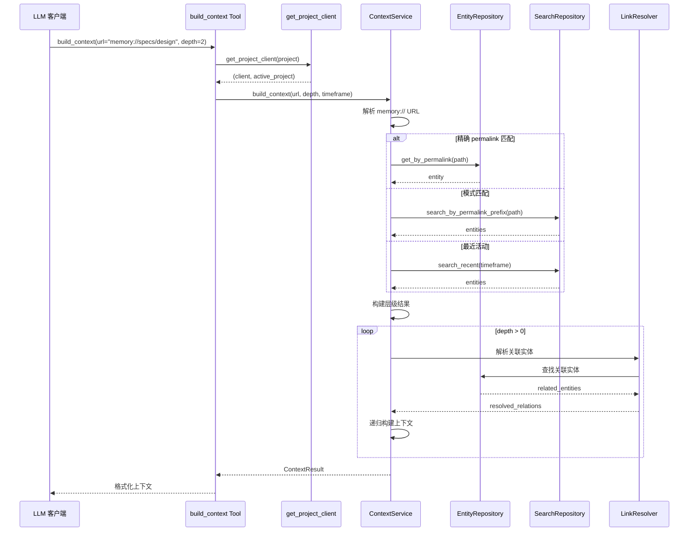
```mermaid
sequenceDiagram
    participant LLM as LLM 客户端
    participant TOOL as build_context Tool
    participant GPC as get_project_client
    participant CS as ContextService
    participant ER as EntityRepository
    participant SR as SearchRepository
    participant LR as LinkResolver

    LLM->>TOOL: build_context(url="memory://specs/design", depth=2)
    TOOL->>GPC: get_project_client(project)
    GPC-->>TOOL: (client, active_project)
    
    TOOL->>CS: build_context(url, depth, timeframe)
    CS->>CS: 解析 memory:// URL
    
    alt 精确 permalink 匹配
        CS->>ER: get_by_permalink(path)
        ER-->>CS: entity
    else 模式匹配
        CS->>SR: search_by_permalink_prefix(path)
        SR-->>CS: entities
    else 最近活动
        CS->>SR: search_recent(timeframe)
        SR-->>CS: entities
    end
    
    CS->>CS: 构建层级结果
    
    loop depth > 0
        CS->>LR: 解析关联实体
        LR->>ER: 查找关联实体
        ER-->>LR: related_entities
        LR-->>CS: resolved_relations
        CS->>CS: 递归构建上下文
    end
    
    CS-->>TOOL: ContextResult
    TOOL-->>LLM: 格式化上下文
```

### 4.6 搜索操作（search_notes）

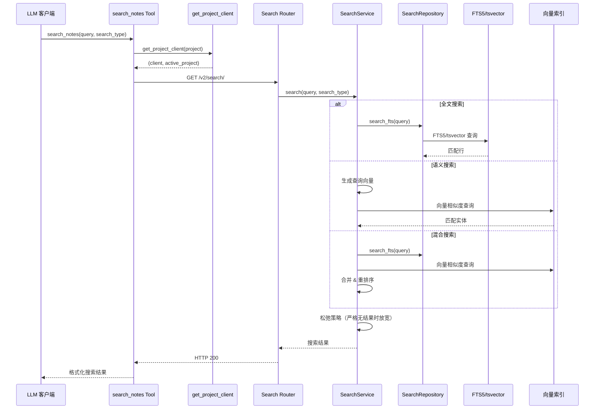
```mermaid
sequenceDiagram
    participant LLM as LLM 客户端
    participant TOOL as search_notes Tool
    participant GPC as get_project_client
    participant API as Search Router
    participant SS as SearchService
    participant SR as SearchRepository
    participant FTS as FTS5/tsvector
    participant VEC as 向量索引

    LLM->>TOOL: search_notes(query, search_type)
    TOOL->>GPC: get_project_client(project)
    GPC-->>TOOL: (client, active_project)
    
    TOOL->>API: GET /v2/search/
    API->>SS: search(query, search_type)
    
    alt 全文搜索
        SS->>SR: search_fts(query)
        SR->>FTS: FTS5/tsvector 查询
        FTS-->>SR: 匹配行
    else 语义搜索
        SS->>SS: 生成查询向量
        SS->>VEC: 向量相似度查询
        VEC-->>SS: 匹配实体
    else 混合搜索
        SS->>SR: search_fts(query)
        SS->>VEC: 向量相似度查询
        SS->>SS: 合并 & 重排序
    end
    
    SS->>SS: 松弛策略（严格无结果时放宽）
    SS-->>API: 搜索结果
    API-->>TOOL: HTTP 200
    TOOL-->>LLM: 格式化搜索结果
```

---

## 5. 数据流图

### 5.1 MCP Tool → Client → API → Service → Repository 主数据流

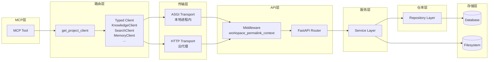
```mermaid
flowchart LR
    subgraph MCP层
        TOOL[MCP Tool]
    end

    subgraph 路由层
        GPC[get_project_client]
        TC[Typed Client<br/>KnowledgeClient<br/>SearchClient<br/>MemoryClient<br/>...]
    end

    subgraph 传输层
        ASGI[ASGI Transport<br/>本地进程内]
        HTTP[HTTP Transport<br/>云代理]
    end

    subgraph API层
        ROUTER[FastAPI Router]
        MW[Middleware<br/>workspace_permalink_context]
    end

    subgraph 服务层
        SVC[Service Layer]
    end

    subgraph 仓库层
        REPO[Repository Layer]
    end

    subgraph 存储层
        DB[(Database)]
        FS[(Filesystem)]
    end

    TOOL --> GPC
    GPC --> TC
    TC --> ASGI
    TC --> HTTP
    ASGI --> MW
    HTTP --> MW
    MW --> ROUTER
    ROUTER --> SVC
    SVC --> REPO
    SVC --> FS
    REPO --> DB
```

### 5.2 同步数据流

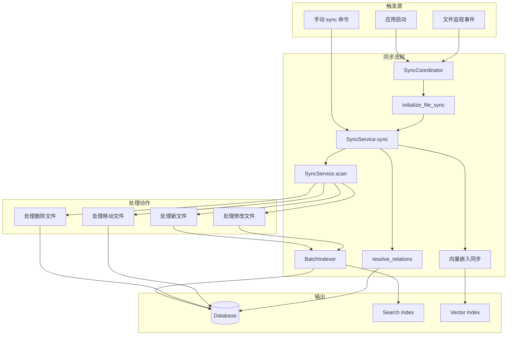
```mermaid
flowchart TD
    subgraph 触发源
        START[应用启动]
        WATCH[文件监视事件]
        MANUAL[手动 sync 命令]
    end

    subgraph 同步流程
        COORD[SyncCoordinator]
        INIT[initialize_file_sync]
        SYNC[SyncService.sync]
        SCAN[SyncService.scan]
        IDX[BatchIndexer]
        RESOLVE[resolve_relations]
        EMBED[向量嵌入同步]
    end

    subgraph 处理动作
        NEW[处理新文件]
        MOD[处理修改文件]
        DEL[处理删除文件]
        MOVE[处理移动文件]
    end

    subgraph 输出
        DB[(Database)]
        SEARCH[Search Index]
        VECTOR[Vector Index]
    end

    START --> COORD
    WATCH --> COORD
    MANUAL --> SYNC

    COORD --> INIT
    INIT --> SYNC
    SYNC --> SCAN
    SCAN --> NEW
    SCAN --> MOD
    SCAN --> DEL
    SCAN --> MOVE

    NEW --> IDX
    MOD --> IDX
    IDX --> DB
    IDX --> SEARCH

    DEL --> DB
    MOVE --> DB

    SYNC --> RESOLVE
    RESOLVE --> DB

    SYNC --> EMBED
    EMBED --> VECTOR
```

### 5.3 配置与初始化数据流

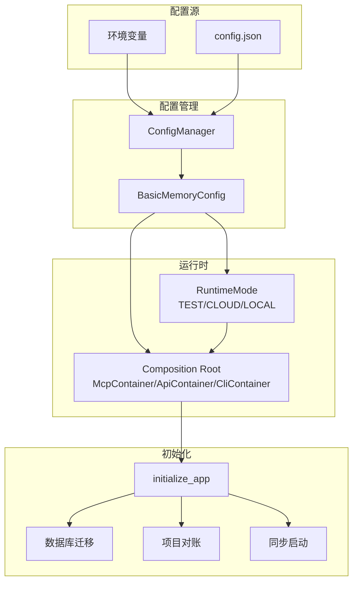
```mermaid
flowchart TD
    subgraph 配置源
        ENV[环境变量]
        FILE[config.json]
    end

    subgraph 配置管理
        CM[ConfigManager]
        CFG[BasicMemoryConfig]
    end

    subgraph 运行时
        RM[RuntimeMode<br/>TEST/CLOUD/LOCAL]
        CR[Composition Root<br/>McpContainer/ApiContainer/CliContainer]
    end

    subgraph 初始化
        INIT[initialize_app]
        MIG[数据库迁移]
        PROJ_SYNC[项目对账]
        SYNC_START[同步启动]
    end

    ENV --> CM
    FILE --> CM
    CM --> CFG
    CFG --> RM
    CFG --> CR
    RM --> CR

    CR --> INIT
    INIT --> MIG
    INIT --> PROJ_SYNC
    INIT --> SYNC_START
```

---

## 6. 状态机图

### 6.1 同步协调器状态机

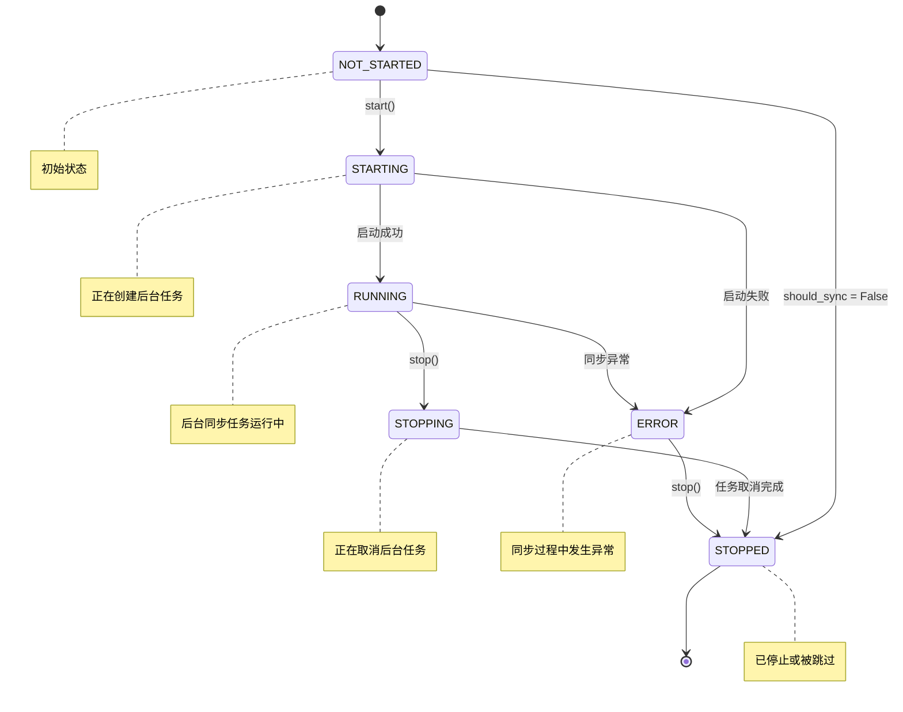
```mermaid
stateDiagram-v2
    [*] --> NOT_STARTED

    NOT_STARTED --> STOPPED : should_sync = False
    NOT_STARTED --> STARTING : start()

    STARTING --> RUNNING : 启动成功
    STARTING --> ERROR : 启动失败

    RUNNING --> STOPPING : stop()
    RUNNING --> ERROR : 同步异常

    STOPPING --> STOPPED : 任务取消完成

    ERROR --> STOPPED : stop()

    STOPPED --> [*]

    note right of NOT_STARTED : 初始状态
    note right of STARTING : 正在创建后台任务
    note right of RUNNING : 后台同步任务运行中
    note right of STOPPING : 正在取消后台任务
    note right of STOPPED : 已停止或被跳过
    note right of ERROR : 同步过程中发生异常
```

### 6.2 文件同步状态

```mermaid
stateDiagram-v2
    [*] --> SCANNING : sync() 调用

    SCANNING --> DETECTING : 扫描完成
    DETECTING : 检测变更类型

    DETECTING --> MOVES : 检测到移动
    DETECTING --> DELETES : 检测到删除
    DETECTING --> NEWS : 检测到新文件
    DETECTING --> MODS : 检测到修改
    DETECTING --> RESOLVING : 无变更

    MOVES --> DELETES : 移动处理完成
    DELETES --> INDEXING : 删除处理完成
    NEWS --> INDEXING
    MODS --> INDEXING

    INDEXING : 批量索引
    INDEXING --> RESOLVING : 索引完成

    RESOLVING : 解析关系
    RESOLVING --> EMBEDDING : 关系解析完成

    EMBEDDING : 同步向量嵌入
    EMBEDDING --> WATERMARK : 嵌入同步完成

    WATERMARK : 更新水位线
    WATERMARK --> [*] : 同步完成
```

### 6.3 项目路由状态

```mermaid
stateDiagram-v2
    [*] --> RESOLVE_PROJECT : 工具调用

    RESOLVE_PROJECT --> CHECK_FACTORY : 项目名已解析
    CHECK_FACTORY : 检查工厂注入

    CHECK_FACTORY --> FACTORY_ROUTE : 工厂已注入
    CHECK_FACTORY --> CHECK_EXPLICIT : 无工厂

    CHECK_EXPLICIT : 检查显式路由标志
    CHECK_EXPLICIT --> LOCAL_ROUTE : --local 标志
    CHECK_EXPLICIT --> CLOUD_ROUTE : --cloud 标志
    CHECK_EXPLICIT --> CHECK_PROJECT_MODE : 无显式标志

    CHECK_PROJECT_MODE : 检查项目模式
    CHECK_PROJECT_MODE --> CLOUD_ROUTE : 项目模式 = CLOUD
    CHECK_PROJECT_MODE --> LOCAL_ROUTE : 项目模式 = LOCAL

    FACTORY_ROUTE --> VALIDATE_PROJECT : 创建工厂客户端
    CLOUD_ROUTE --> VALIDATE_PROJECT : 创建云代理客户端
    LOCAL_ROUTE --> VALIDATE_PROJECT : 创建 ASGI 客户端

    VALIDATE_PROJECT : 验证项目存在
    VALIDATE_PROJECT --> [*] : (client, active_project)
```

---

## 7. 决策流程图

### 7.1 客户端路由决策（get_client）

```mermaid
flowchart TD
    START[get_client 调用] --> F1{工厂已注入?}
    
    F1 -->|是| FACTORY[使用工厂创建客户端]
    FACTORY --> END[返回 AsyncClient]
    
    F1 -->|否| F2{显式路由标志?}
    
    F2 -->|--local| LOCAL[ASGI Client<br/>本地进程内]
    LOCAL --> END
    
    F2 -->|--cloud| F2A{解析 workspace}
    F2A --> CLOUD[Cloud Proxy Client<br/>Bearer Token 认证]
    CLOUD --> END
    
    F2 -->|否| F3{project_name 已提供?}
    
    F3 -->|是| F4{项目模式 = CLOUD?}
    F4 -->|是| F4A[解析 workspace]
    F4A --> CLOUD
    F4 -->|否| LOCAL
    
    F3 -->|否| DEFAULT[默认本地 ASGI Client]
    DEFAULT --> END
```

### 7.2 项目解析决策（ProjectResolver）

```mermaid
flowchart TD
    START[resolve 调用] --> F1{BASIC_MEMORY_MCP_PROJECT<br/>环境变量?}
    
    F1 -->|是| R1[ENV_CONSTRAINT<br/>使用环境变量项目]
    R1 --> END[返回 ResolvedProject]
    
    F1 -->|否| F2{显式 project 参数?}
    
    F2 -->|是| R2[EXPLICIT<br/>使用显式参数]
    R2 --> END
    
    F2 -->|否| F3{default_project 配置?}
    
    F3 -->|是| R3[DEFAULT<br/>使用默认项目]
    R3 --> END
    
    F3 -->|否| F4{allow_discovery?}
    
    F4 -->|是| R4[DISCOVERY<br/>无项目，允许发现]
    R4 --> END
    
    F4 -->|否| R5[NONE<br/>无法解析]
    R5 --> END
```

### 7.3 扫描策略决策

```mermaid
flowchart TD
    START[scan 调用] --> F1{force_full?}
    
    F1 -->|是| FULL_FORCED[全量扫描<br/>bypass 水位线]
    FULL_FORCED --> SCAN[执行扫描]
    
    F1 -->|否| F2{last_file_count = None?}
    
    F2 -->|是| FULL_INITIAL[全量扫描<br/>首次同步]
    FULL_INITIAL --> SCAN
    
    F2 -->|否| F3{current_count < last_count?}
    
    F3 -->|是| FULL_DEL[全量扫描<br/>检测删除]
    FULL_DEL --> SCAN
    
    F3 -->|否| F4{last_scan_timestamp 存在?}
    
    F4 -->|是| INCR[增量扫描<br/>find -newermt]
    INCR --> SCAN
    
    F4 -->|否| FULL_FALLBACK[全量扫描<br/>无水位线]
    FULL_FALLBACK --> SCAN
    
    SCAN --> RESULT[SyncReport]
```

### 7.4 链接解析决策（LinkResolver）

```mermaid
flowchart TD
    START[resolve_link 调用] --> F1{精确 permalink 匹配?}
    
    F1 -->|是| FOUND[返回实体]
    
    F1 -->|否| F2{精确标题匹配?}
    F2 -->|是| FOUND
    F2 -->|否| F3{精确文件路径匹配?}
    
    F3 -->|是| FOUND
    F3 -->|否| F4{路径 + .md 扩展名?}
    
    F4 -->|是| FOUND
    F4 -->|否| F5[搜索模糊匹配]
    F5 --> FOUND
```

---

## 8. 类图

### 8.1 核心服务类关系

```mermaid
classDiagram
    class EntityService {
        -entity_parser: EntityParser
        -entity_repository: EntityRepository
        -observation_repository: ObservationRepository
        -relation_repository: RelationRepository
        -file_service: FileService
        -link_resolver: LinkResolver
        +create_or_update_entity(title, content, directory, tags) EntityWriteResult
        +delete_entity_by_file_path(path)
        +resolve_permalink(path, skip_conflict_check) str
        +move_entity(identifier, destination) Entity
        +delete_directory(path) DirectoryDeleteResult
    }

    class SearchService {
        -search_repository: SearchRepository
        -entity_repository: EntityRepository
        -file_service: FileService
        +search(query, search_type, page, page_size) SearchResult
        +index_entity(entity)
        +index_entity_data(entity, content)
        +delete_by_permalink(permalink)
        +sync_entity_vectors_batch(entity_ids) VectorSyncBatchResult
    }

    class ContextService {
        -entity_repository: EntityRepository
        -search_repository: SearchRepository
        -link_resolver: LinkResolver
        +build_context(url, depth, timeframe) ContextResult
    }

    class FileService {
        -project_path: Path
        -markdown_processor: MarkdownProcessor
        -app_config: BasicMemoryConfig
        +read_file(path) str
        +read_file_bytes(path) bytes
        +write_file(path, content) FileMetadata
        +update_frontmatter(path, metadata) str
        +compute_checksum(path) str
        +get_file_metadata(path) FileMetadata
    }

    class LinkResolver {
        -entity_repository: EntityRepository
        -search_service: SearchService
        +resolve_link(identifier) Entity
    }

    class SyncService {
        -app_config: BasicMemoryConfig
        -entity_service: EntityService
        -entity_parser: EntityParser
        -entity_repository: EntityRepository
        -relation_repository: RelationRepository
        -project_repository: ProjectRepository
        -search_service: SearchService
        -file_service: FileService
        -batch_indexer: BatchIndexer
        -_file_failures: OrderedDict
        +sync(directory, project_name, force_full) SyncReport
        +sync_file(path, new) Tuple
        +scan(directory, force_full) SyncReport
        +handle_delete(file_path)
        +handle_move(old_path, new_path)
        +resolve_relations(entity_id) set
    }

    class WatchService {
        -app_config: BasicMemoryConfig
        -project_repository: ProjectRepository
        -state: WatchServiceState
        -_sync_service_factory: SyncServiceFactory
        +run()
        +handle_changes(project, changes)
        +filter_changes(change, path) bool
    }

    class SyncCoordinator {
        +config: BasicMemoryConfig
        +should_sync: bool
        +skip_reason: str
        -_status: SyncStatus
        -_sync_task: Task
        +start()
        +stop()
        +get_status_info() dict
    }

    EntityService --> FileService
    EntityService --> LinkResolver
    SyncService --> EntityService
    SyncService --> FileService
    SyncService --> SearchService
    WatchService --> SyncService
    SyncCoordinator --> SyncService
    ContextService --> LinkResolver
```

### 8.2 仓库层类关系

```mermaid
classDiagram
    class Repository~T~ {
        #session_maker: async_sessionmaker
        #project_id: int
        #Model: Type~T~
        +add(model) T
        +update(id, data) T
        +delete(id) bool
        +find_by_id(id) T
        +find_all() List~T~
        #_add_project_filter(query) Select
    }

    class EntityRepository {
        +get_by_permalink(permalink) Entity
        +get_by_file_path(file_path) Entity
        +get_by_title(title) Entity
        +find_by_checksum(checksum) List~Entity~
        +get_all_file_paths() List~str~
        +get_file_path_to_permalink_map() Dict
    }

    class SearchRepository {
        <<Protocol>>
        +search(query, permalink, permalink_match, title, types, after_date, metadata_filters, retrieval_mode) Tuple
        +index_entity(entity, content) None
        +delete_by_permalink(permalink) None
        +delete_by_entity_id(entity_id) None
    }

    class SqliteSearchRepository {
        +search(...) Tuple
        +index_entity(entity, content) None
        -_build_fts_query(search_text) str
    }

    class PostgresSearchRepository {
        +search(...) Tuple
        +index_entity(entity, content) None
        -_build_tsquery(search_text) str
    }

    class RelationRepository {
        +find_unresolved_relations() List~Relation~
        +find_unresolved_relations_for_entity(entity_id) List~Relation~
    }

    class ObservationRepository {
        +get_by_permalink(permalink) Observation
    }

    class ProjectRepository {
        +find_by_name(name) Project
        +find_by_permalink(permalink) Project
        +get_active_projects() List~Project~
    }

    Repository <|-- EntityRepository
    Repository <|-- RelationRepository
    Repository <|-- ObservationRepository
    Repository <|-- ProjectRepository
    SearchRepository <|.. SqliteSearchRepository
    SearchRepository <|.. PostgresSearchRepository
```

### 8.3 配置与运行时类关系

```mermaid
classDiagram
    class BasicMemoryConfig {
        +projects: Dict~str, ProjectEntry~
        +default_project: str
        +database_backend: DatabaseBackend
        +sync_changes: bool
        +semantic_search_enabled: bool
        +cloud_api_key: str
        +cloud_host: str
        +permalinks_include_project: bool
        +index_batch_size: int
        +sync_delay: int
        +get_project_mode(project_name) ProjectMode
    }

    class ProjectEntry {
        +path: str
        +mode: ProjectMode
        +workspace_id: str
    }

    class ProjectMode {
        <<enumeration>>
        LOCAL
        CLOUD
    }

    class DatabaseBackend {
        <<enumeration>>
        SQLITE
        POSTGRES
    }

    class ConfigManager {
        +config: BasicMemoryConfig
        +projects: Dict~str, ProjectEntry~
        +default_project: str
    }

    class RuntimeMode {
        <<enumeration>>
        LOCAL
        CLOUD
        TEST
        +is_cloud: bool
        +is_local: bool
        +is_test: bool
    }

    class ProjectResolver {
        +default_project: str
        +constrained_project: str
        +resolve(project, allow_discovery) ResolvedProject
        +from_env(default_project) ProjectResolver
    }

    class ResolvedProject {
        +project: str
        +mode: ResolutionMode
        +reason: str
        +is_resolved: bool
        +is_discovery_mode: bool
    }

    class ResolutionMode {
        <<enumeration>>
        ENV_CONSTRAINT
        EXPLICIT
        DEFAULT
        DISCOVERY
        NONE
    }

    class McpContainer {
        +config: BasicMemoryConfig
        +mode: RuntimeMode
        +should_sync: bool
        +create_sync_coordinator() SyncCoordinator
        +create() McpContainer
    }

    BasicMemoryConfig --> ProjectEntry
    ProjectEntry --> ProjectMode
    ConfigManager --> BasicMemoryConfig
    McpContainer --> BasicMemoryConfig
    McpContainer --> RuntimeMode
    ProjectResolver --> ResolvedProject
    ResolvedProject --> ResolutionMode
```

### 8.4 MCP 客户端类关系

```mermaid
classDiagram
    class AsyncClient {
        <<httpx>>
    }

    class KnowledgeClient {
        -client: AsyncClient
        +create_entity(data) EntityResponse
        +get_entity(identifier) EntityResponse
        +update_entity(identifier, data) EntityResponse
        +delete_entity(identifier) None
        +move_entity(identifier, destination) EntityResponse
    }

    class SearchClient {
        -client: AsyncClient
        +search(query, params) SearchResponse
    }

    class MemoryClient {
        -client: AsyncClient
        +build_context(url, depth, timeframe) ContextResponse
        +recent_activity(type, depth, timeframe) ActivityResponse
    }

    class DirectoryClient {
        -client: AsyncClient
        +list_directory(dir_name, depth) DirectoryResponse
    }

    class ResourceClient {
        -client: AsyncClient
        +read_resource(path) ResourceResponse
    }

    class ProjectClient {
        -client: AsyncClient
        +list_projects() ProjectList
        +create_project(data) ProjectResponse
        +delete_project(name) None
        +resolve_project(identifier) ProjectResolveResponse
    }

    class SchemaClient {
        -client: AsyncClient
        +get_schema(path) SchemaResponse
    }

    KnowledgeClient --> AsyncClient
    SearchClient --> AsyncClient
    MemoryClient --> AsyncClient
    DirectoryClient --> AsyncClient
    ResourceClient --> AsyncClient
    ProjectClient --> AsyncClient
    SchemaClient --> AsyncClient
```

---

## 9. 跨模块依赖关系

### 9.1 模块依赖矩阵

```mermaid
graph TD
    subgraph 入口
        MCP[MCP Server]
        API[API App]
        CLI[CLI App]
    end

    subgraph 组合根
        MC[McpContainer]
        AC[ApiContainer]
        CC[CliContainer]
    end

    subgraph 基础设施
        CFG[Config]
        RUN[Runtime]
        DB[Database]
    end

    subgraph 核心
        SVC[Services]
        REPO[Repositories]
        SYNC[Sync]
        MD[Markdown]
    end

    subgraph 存储
        SQL[(SQL)]
        FS[(Files)]
    end

    MCP --> MC
    API --> AC
    CLI --> CC

    MC --> CFG
    AC --> CFG
    CC --> CFG
    MC --> RUN

    MCP --> SVC
    API --> SVC
    CLI --> SVC

    SVC --> REPO
    SVC --> MD
    SYNC --> SVC
    SYNC --> MD

    REPO --> DB
    DB --> SQL
    SVC --> FS
```

### 9.2 关键约束

| 约束 | 说明 |
|------|------|
| 组合根唯一性 | 每个入口点只有一个组合根读取 ConfigManager |
| 项目级隔离 | 所有仓库查询自动添加 project_id 过滤 |
| 文件即真相 | 数据库仅作为索引层，Markdown 文件是权威数据源 |
| 原子文件写入 | 所有文件写入通过 .tmp 临时文件 + rename 实现 |
| 熔断器 | 连续失败 3 次的文件被跳过，直到文件内容变更 |
| WAL 模式 | SQLite 使用 WAL 模式支持并发读写 |
| 异步优先 | 所有 I/O 操作使用 async/await 模式 |
| 工厂注入 | 云应用可通过 set_client_factory() 注入自定义客户端 |

### 9.3 数据一致性保证

```mermaid
flowchart TD
    subgraph 写入路径
        W1[MCP Tool 调用] --> W2[EntityService 处理]
        W2 --> W3[FileService 原子写入]
        W3 --> W4[数据库更新]
        W4 --> W5[搜索索引更新]
    end

    subgraph 同步路径
        S1[文件系统变更] --> S2[WatchService 检测]
        S2 --> S3[SyncService 处理]
        S3 --> S4[EntityParser 解析]
        S4 --> S5[数据库更新]
        S5 --> S6[搜索索引更新]
    end

    subgraph 一致性机制
        C1[Checksum 比对<br/>检测实际变更]
        C2[Mtime/Size 比对<br/>快速变更检测]
        C3[水位线追踪<br/>增量扫描优化]
        C4[关系延迟解析<br/>非阻塞启动]
    end

    W3 --> C1
    S3 --> C1
    S3 --> C2
    S3 --> C3
    S5 --> C4
```

---

> **文档维护说明**：本文档应随代码库演进持续更新。当核心模块接口或交互逻辑发生变更时，需同步更新对应的 Mermaid 图表和文字描述。
