# Graphiti 架构设计文档

## 1. 系统总体架构

### 1.1 分层架构总览

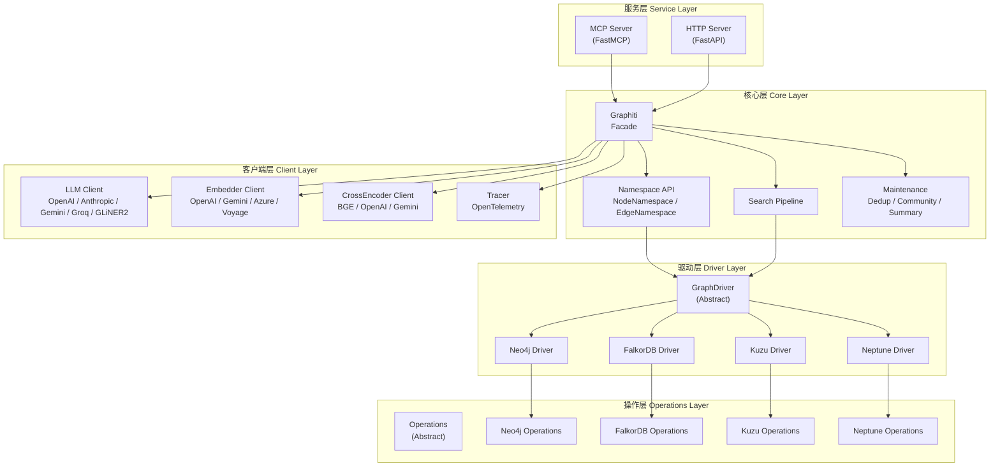

### 1.2 模块依赖关系

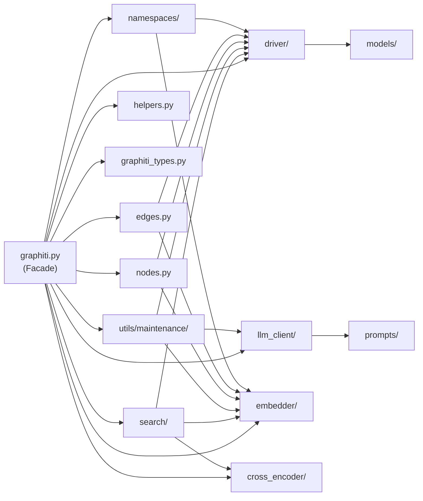

---

## 2. 核心数据模型

### 2.1 图数据模型

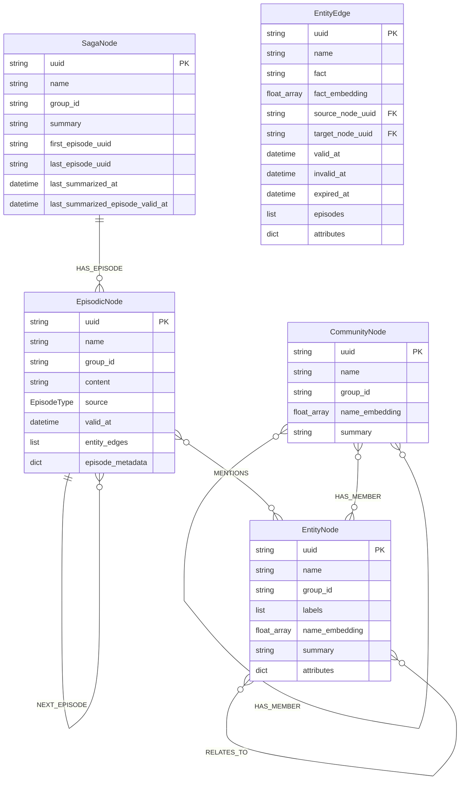

### 2.2 节点继承体系

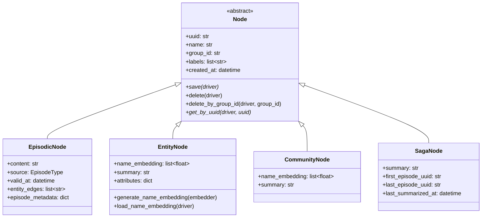

### 2.3 边继承体系

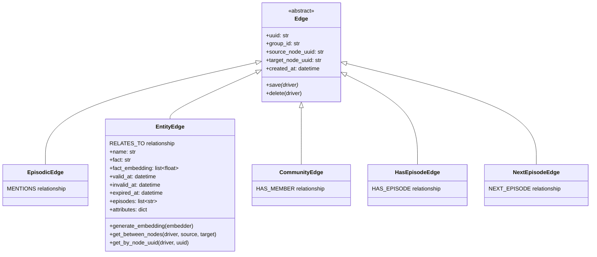

---

## 3. 知识摄入流水线

### 3.1 单条添加流程

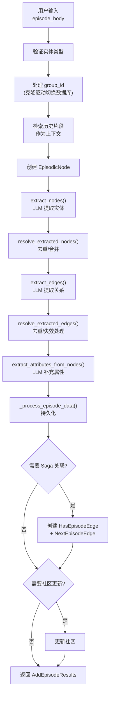

### 3.2 节点去重策略

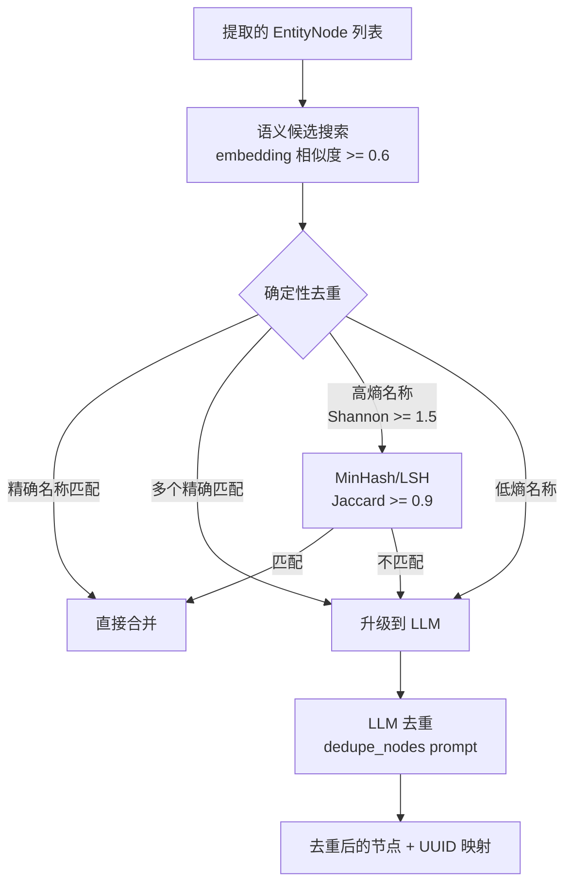

### 3.3 边去重与矛盾检测

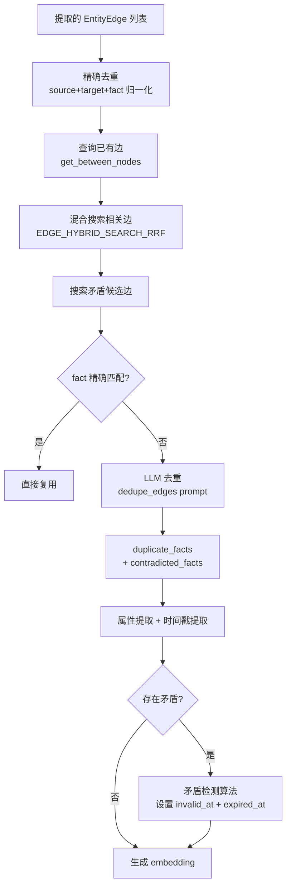

### 3.4 矛盾检测算法

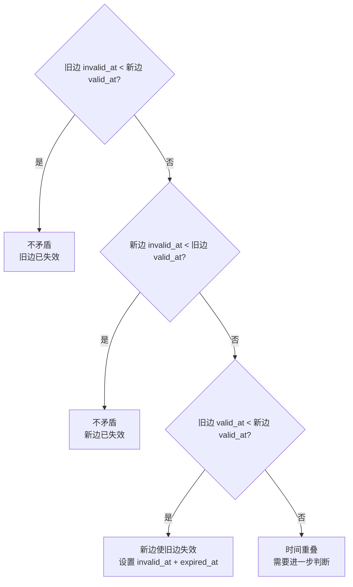

---

## 4. 搜索管线架构

### 4.1 搜索总流程

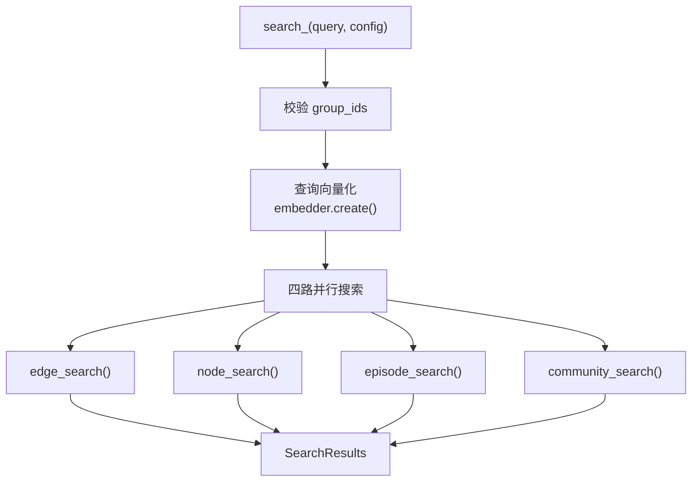

### 4.2 子搜索统一模式

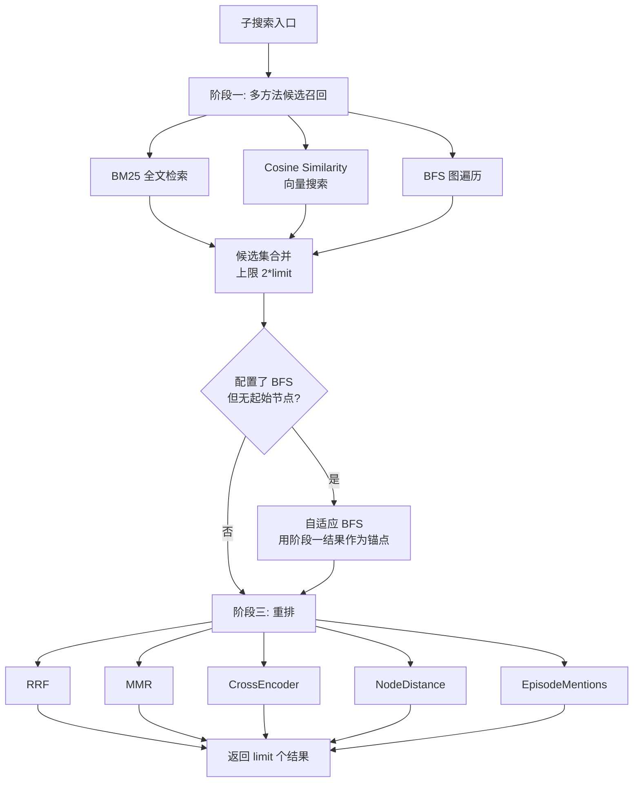

### 4.3 搜索方法与重排器矩阵

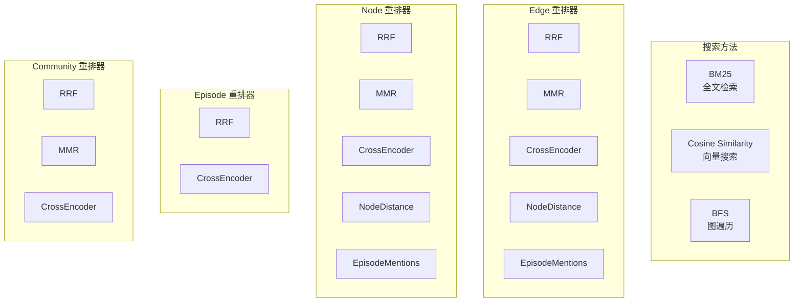

---

## 5. 驱动层架构

### 5.1 驱动继承体系

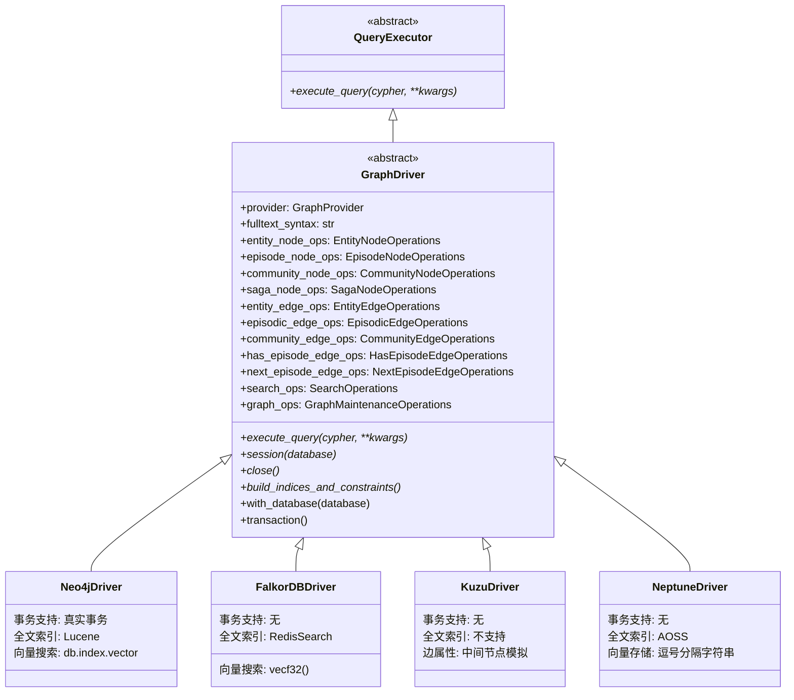

### 5.2 操作层组合模式

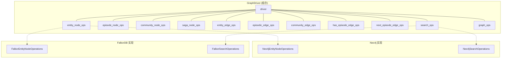

### 5.3 操作执行模式

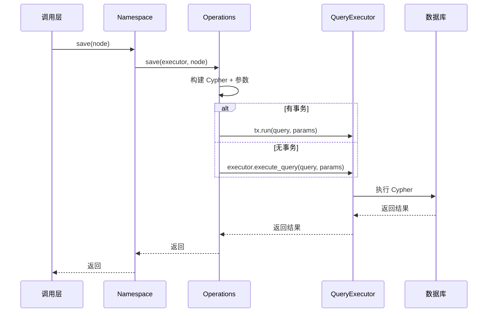

### 5.4 IoC 回退模式

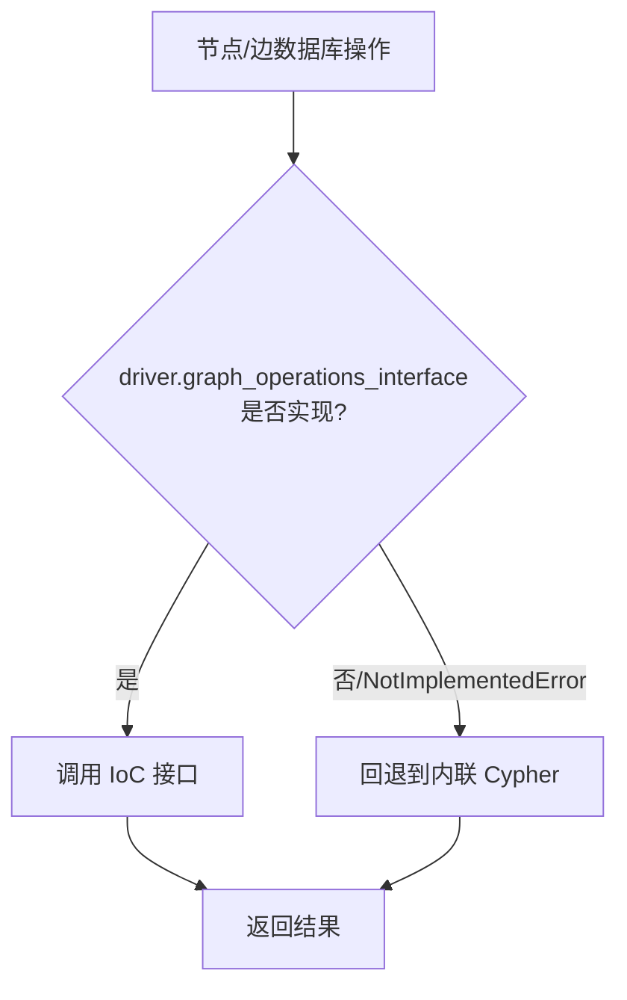

---

## 6. LLM 客户端架构

### 6.1 客户端继承体系

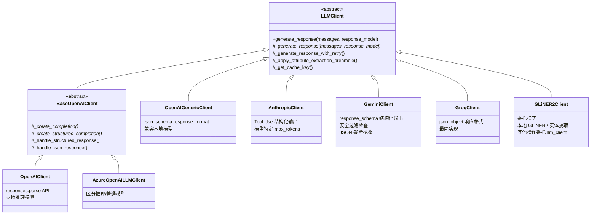

### 6.2 LLM 调用流程

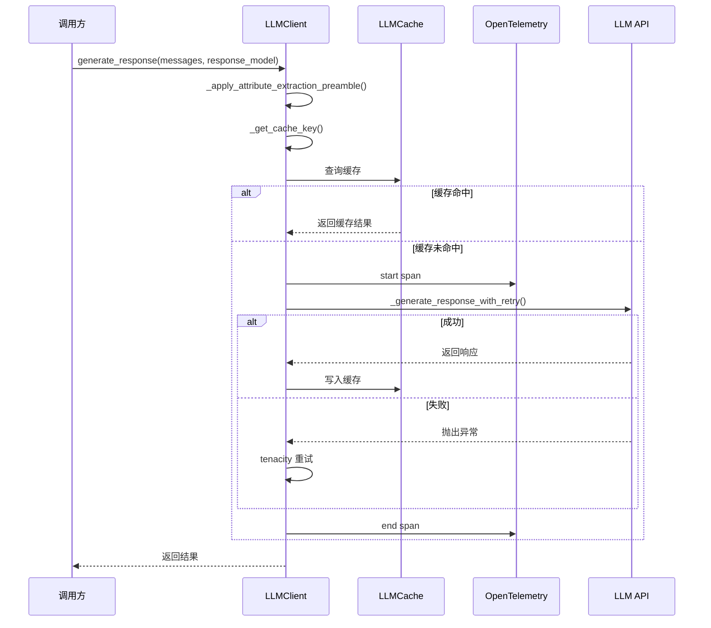

---

## 7. Prompt 模板系统

### 7.1 版本化 Prompt 库

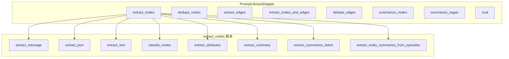

### 7.2 Prompt 调用链

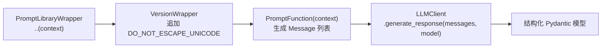

---

## 8. 服务层架构

### 8.1 MCP 服务器架构

```mermaid
flowchart TD
    subgraph "MCP Server"
        FMCP["FastMCP<br/>Graphiti Agent Memory"]

        subgraph "工具 Tools"
            T1["add_memory"]
            T2["search_nodes"]
            T3["search_memory_facts"]
            T4["delete_entity_edge"]
            T5["delete_episode"]
            T6["get_entity_edge"]
            T7["get_episodes"]
            T8["clear_graph"]
            T9["get_status"]
        end

        subgraph "服务层"
            GS["GraphitiService<br/>单例 + Semaphore"]
            QS["QueueService<br/>按 group_id 隔离"]
        end

        subgraph "工厂层"
            LF["LLMClientFactory"]
            EF["EmbedderFactory"]
            DF["DatabaseDriverFactory"]
        end

        subgraph "配置层"
            CFG["GraphitiConfig<br/>YAML + 环境变量 + CLI"]
        end
    end

    FMCP --> T1 & T2 & T3 & T4 & T5 & T6 & T7 & T8 & T9
    T1 --> QS
    QS --> GS
    T2 & T3 --> GS
    GS --> LF & EF & DF
    LF & EF & DF --> CFG
```

### 8.2 HTTP 服务器架构

```mermaid
flowchart TD
    subgraph "HTTP Server (FastAPI)"
        MAIN["main.py<br/>lifespan 启动"]

        subgraph "路由层"
            RI["/messages (POST)<br/>/entity-node (POST)<br/>/entity-edge/{uuid} (DELETE)<br/>/group/{group_id} (DELETE)<br/>/episode/{uuid} (DELETE)<br/>/clear (POST)"]
            RR["/search (POST)<br/>/entity-edge/{uuid} (GET)<br/>/episodes/{group_id} (GET)<br/>/get-memory (POST)"]
        end

        subgraph "业务层"
            ZG["ZepGraphiti<br/>继承 Graphiti"]
            AW["AsyncWorker<br/>全局单队列"]
        end

        subgraph "DTO 层"
            DTO_I["AddMessagesRequest<br/>AddEntityNodeRequest"]
            DTO_R["SearchQuery<br/>FactResult<br/>GetMemoryRequest<br/>GetMemoryResponse"]
        end
    end

    MAIN --> RI & RR
    RI --> ZG & AW
    RR --> ZG
    RI --> DTO_I
    RR --> DTO_R
```

### 8.3 MCP vs HTTP 对比

```mermaid
graph LR
    subgraph "MCP Server"
        direction TB
        M_P["协议: MCP"]
        M_F["框架: FastMCP"]
        M_T["目标: AI 代理"]
        M_S["搜索: 节点+事实"]
        M_Q["并发: Semaphore+队列"]
        M_L["生命周期: 全局单例"]
    end

    subgraph "HTTP Server"
        direction TB
        H_P["协议: REST HTTP"]
        H_F["框架: FastAPI"]
        H_T["目标: 通用客户端"]
        H_S["搜索: 仅事实"]
        H_Q["并发: AsyncWorker"]
        H_L["生命周期: 每请求"]
    end
```

---

## 9. 命名空间系统

### 9.1 命名空间层级

```mermaid
graph TB
    subgraph "NodeNamespace"
        N_ENT["nodes.entity<br/>EntityNodeNamespace"]
        N_EPI["nodes.episode<br/>EpisodeNodeNamespace"]
        N_COM["nodes.community<br/>CommunityNodeNamespace"]
        N_SAG["nodes.saga<br/>SagaNodeNamespace"]
    end

    subgraph "EdgeNamespace"
        E_ENT["edges.entity<br/>EntityEdgeNamespace"]
        E_EPI["edges.episodic<br/>EpisodicEdgeNamespace"]
        E_COM["edges.community<br/>CommunityEdgeNamespace"]
        E_HAS["edges.has_episode<br/>HasEpisodeEdgeNamespace"]
        E_NXT["edges.next_episode<br/>NextEpisodeEdgeNamespace"]
    end

    subgraph "驱动能力注册"
        DRV["GraphDriver"]
        DRV -->|"entity_node_ops != None"| N_ENT
        DRV -->|"episode_node_ops != None"| N_EPI
        DRV -->|"community_node_ops != None"| N_COM
        DRV -->|"entity_edge_ops != None"| E_ENT
    end
```

### 9.2 命名空间初始化与回退

```mermaid
flowchart TD
    A["访问 graphiti.nodes.entity"] --> B{"driver.entity_node_ops<br/>是否已注册?"}
    B -->|是| C["返回 EntityNodeNamespace"]
    B -->|否| D["__getattr__ 抛出<br/>NotImplementedError"]
    C --> E["调用 ops.save(executor, node)"]
    E --> F["生成 name_embedding"]
    F --> G["持久化到数据库"]
```

---

## 10. 社区检测算法

### 10.1 标签传播

```mermaid
flowchart TD
    A["初始化: 每个节点一个社区"] --> B["迭代"]
    B --> C["每个节点采用邻居中<br/>边数加权的多数社区"]
    C --> D["平局打破: 选择最大社区"]
    D --> E{有社区变化?}
    E -->|是| B
    E -->|否| F["收敛, 返回社区划分"]
```

### 10.2 层次化摘要合并

```mermaid
flowchart TD
    A["社区内所有实体摘要"] --> B["配对"]
    B --> C["每对通过 LLM<br/>summarize_pair 合并"]
    C --> D{剩余 > 1?}
    D -->|是| B
    D -->|否| E["最终摘要"]
    E --> F["generate_summary_description<br/>生成社区名称"]
```

---

## 11. 嵌入与重排架构

### 11.1 Embedder 客户端体系

```mermaid
classDiagram
    class EmbedderClient {
        <<abstract>>
        +embedding_dim: int
        +create(input_data)* list~float~
        +create_batch(input_data_list) list~list~float~~
    }

    class OpenAIEmbedder {
        model: text-embedding-3-small
        支持维度截断
    }

    class GeminiEmbedder {
        model: text-embedding-001
        batch_size=1 (特定模型)
    }

    class AzureOpenAIEmbedderClient {
        model: text-embedding-3-small
        无维度截断
    }

    class VoyageAIEmbedder {
        model: voyage-3
        支持维度截断
    }

    EmbedderClient <|-- OpenAIEmbedder
    EmbedderClient <|-- GeminiEmbedder
    EmbedderClient <|-- AzureOpenAIEmbedderClient
    EmbedderClient <|-- VoyageAIEmbedder
```

### 11.2 CrossEncoder 客户端体系

```mermaid
classDiagram
    class CrossEncoderClient {
        <<abstract>>
        +rank(query, passages)* list~tuple~str,float~~
    }

    class BGERerankerClient {
        model: BAAI/bge-reranker-v2-m3
        本地 sentence-transformers
        同步转异步
    }

    class OpenAIRerankerClient {
        model: gpt-4.1-nano
        logprob 布尔分类器
        logit_bias 限制输出
    }

    class GeminiRerankerClient {
        model: gemini-2.5-flash-lite
        直接评分 0-100
        正则提取数字
    }

    CrossEncoderClient <|-- BGERerankerClient
    CrossEncoderClient <|-- OpenAIRerankerClient
    CrossEncoderClient <|-- GeminiRerankerClient
```

---

## 12. 关键设计决策

### 12.1 QueryExecutor 解耦

操作类仅依赖 `QueryExecutor` 接口而非 `GraphDriver`，消除循环导入：

```mermaid
graph LR
    Ops["Operations<br/>(抽象操作类)"] -->|"依赖"| QE["QueryExecutor<br/>(最小接口)"]
    DRV["GraphDriver"] -->|"继承"| QE
    DRV -->|"组合"| Ops
```

### 12.2 操作组合优于继承

```mermaid
graph LR
    DRV["GraphDriver"] -->|"组合 11 个"| ENO["EntityNodeOperations"]
    DRV -->|"组合"| EEO["EntityEdgeOperations"]
    DRV -->|"组合"| SO["SearchOperations"]
    DRV -->|"组合"| GO["GraphMaintenanceOperations"]
    DRV -->|"组合"| "..."]
```

### 12.3 Kuzu 中间节点模式

```mermaid
graph LR
    E1["Entity"] -->|"RELATES_TO"| RN["RelatesToNode_<br/>(中间节点)"]
    RN -->|"RELATES_TO"| E2["Entity"]
```

### 12.4 Neptune 双存储架构

```mermaid
graph TB
    APP["应用层"] --> NPT["Neptune<br/>(图数据)"]
    APP --> AOSS["Amazon OpenSearch<br/>(全文索引)"]
    NPT -.->|"向量存储为<br/>逗号分隔字符串"| APP
    AOSS -.->|"4 个索引"| APP
```

### 12.5 GLiNER2 委托模式

```mermaid
flowchart TD
    A["GLiNER2Client.generate_response()"] --> B{"response_model ==<br/>ExtractedEntities?"}
    B -->|是| C["本地 GLiNER2<br/>模型推理"]
    B -->|否| D["委托给内部<br/>llm_client"]
```
