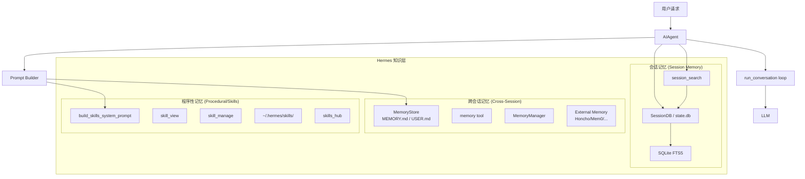
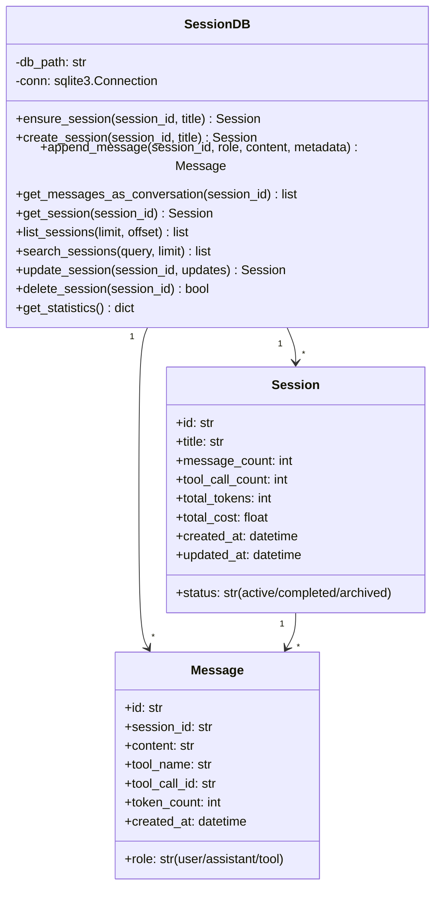
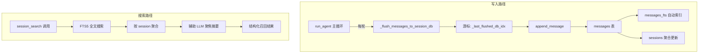
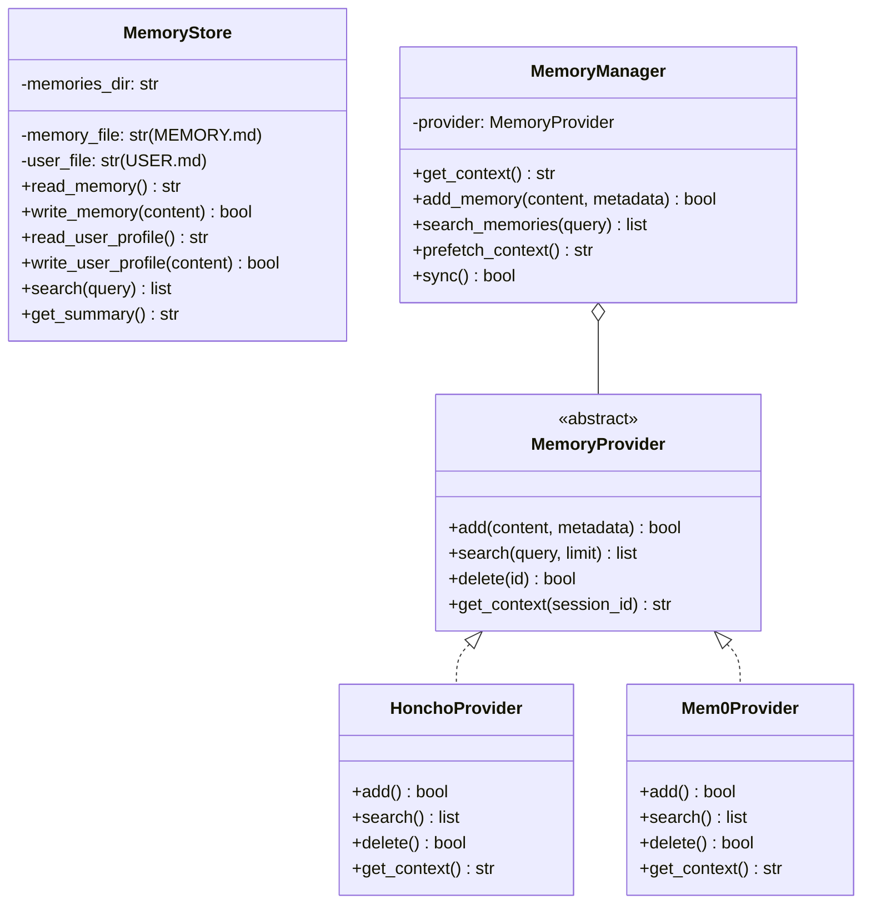
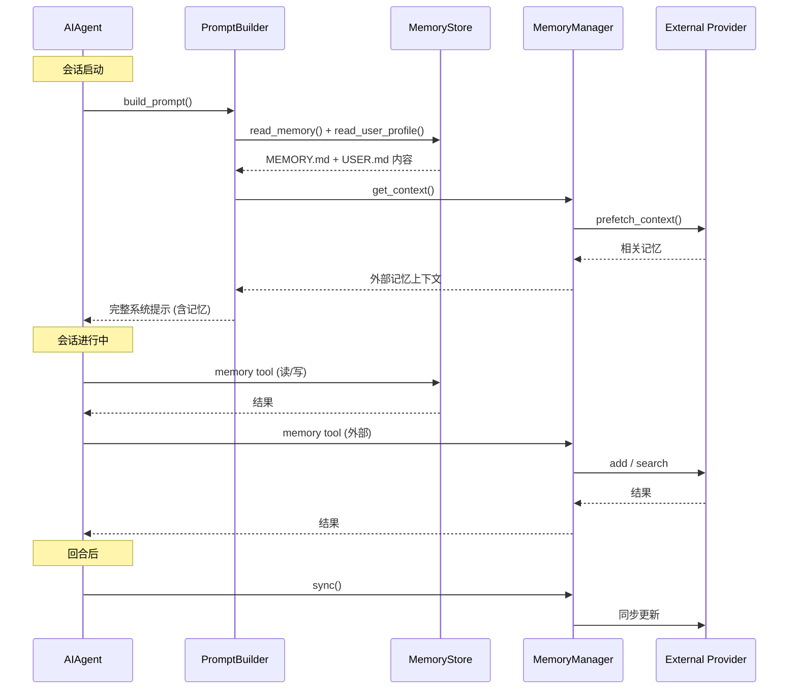
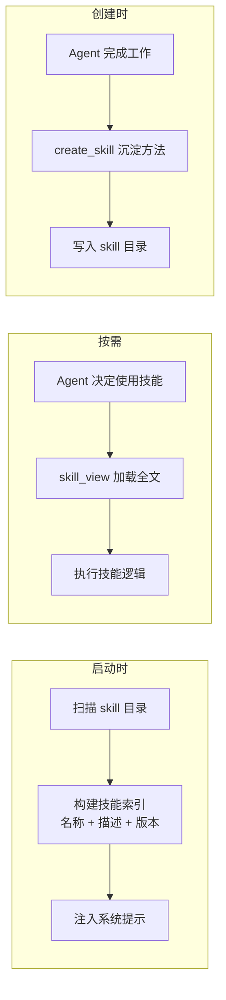
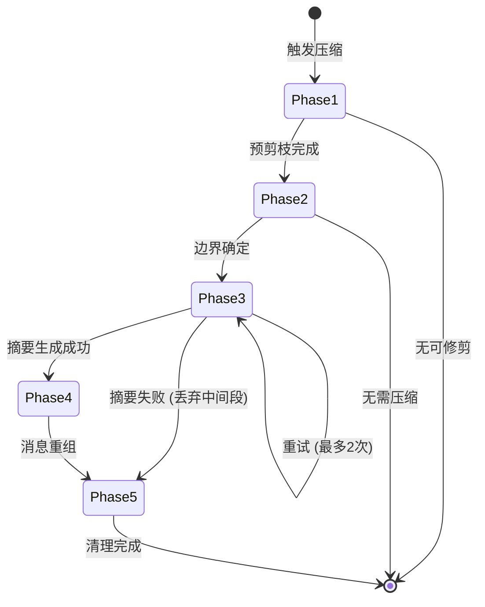
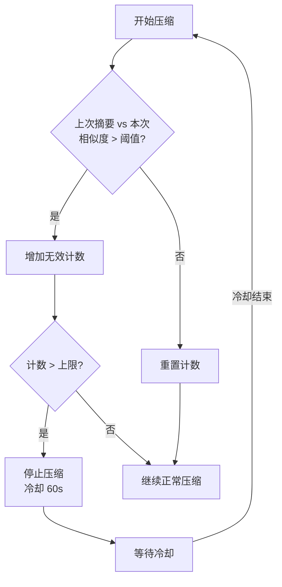
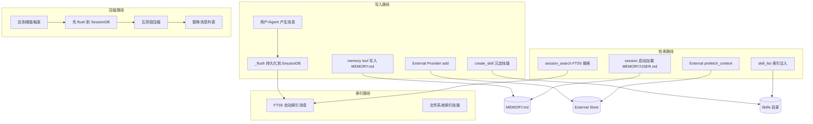

# Hermes Agent 记忆模块 — 设计文档 (Design)

> 版本: 基于 Hermes Agent 官方文档分析

---

## 一、三层知识层总架构



---

## 二、会话记忆：SessionDB 设计

### 2.1 模块职责



### 2.2 写入与搜索流程



---

## 三、跨会话记忆：MemoryStore 设计

### 3.1 内建记忆架构



### 3.2 记忆注入时机



---

## 四、技能记忆：Skill 系统设计

### 4.1 技能目录结构

```
~/.hermes/skills/
├── skill-name-1/
│   ├── SKILL.md          # 技能定义（必需）
│   ├── references/       # 参考文档
│   ├── templates/        # 代码模板
│   ├── scripts/          # 可执行脚本
│   └── assets/           # 静态资源
├── skill-name-2/
│   └── ...
```

### 4.2 技能注入策略



---

## 五、上下文压缩引擎设计

### 5.1 五阶段压缩流程



### 5.2 头尾保护示意图

```
┌─────────────────────────────────────────────────────────┐
│  头保护 (protect_first_n = 3)                            │
│  ├─ system prompt                                        │
│  ├─ 第一条 user message                                  │
│  └─ 第一条 assistant response                            │
├─────────────────────────────────────────────────────────┤
│  中间段 (可压缩区域)                                      │
│  ┌─────────────────────────────────────────────────────┐ │
│  │  10轮工具调用序列                                    │ │
│  │  → LLM 摘要为结构化文本                              │ │
│  │  assistant: [摘要占位符]                              │ │
│  └─────────────────────────────────────────────────────┘ │
├─────────────────────────────────────────────────────────┤
│  尾保护 (protect_last_n = 20)                            │
│  ├─ 最近的 user message                                  │
│  ├─ 最近的 tool calls                                    │
│  └─ 最近的 assistant responses                           │
└─────────────────────────────────────────────────────────┘
```

### 5.3 反抖动机制



---

## 六、三层记忆的数据流汇总



---

## 七、关键设计决策

| 决策 | 选择 | 理由 |
|------|------|------|
| 记忆分层 | 三层独立系统 | 不同类型的知识有不同的生命周期和访问模式，混在一起会导致注入成本失控 |
| 会话搜索 | FTS5 + 辅助 LLM 摘要 | 全文搜索快但缺乏语义理解，辅助 LLM 补充摘要能力 |
| 跨会话记忆 | 内建文件 + 外部 Provider | 文件提供透明性和可读性，Provider 提供 AI 原生语义搜索能力 |
| 技能存储 | 目录 + SKILL.md | 兼容版本控制 (git)，支持复杂的配套文件 |
| 压缩模型 | 独立辅助模型 | 不阻塞主模型推理，便宜的模型完成摘要任务 |
| 头尾保护 | 永远不压缩 | 系统提示和近期上下文是决策的关键输入，不能丢失 |
| 反抖动 | 相似度检测 + 冷却 | 防止无效压缩无限循环浪费 token |
