# Hermes Agent 项目架构分析

## 1. 文档目标

本文面向工程视角，对 `hermes-agent` 项目做以下拆解：

- 说明项目的整体架构与核心设计思想
- 按模块分析职责、初始化方式、输入接口、内部执行逻辑、输出结果
- 使用 Mermaid 绘制架构图、时序图、数据流图、实体关系图和“用例式”视图
- 总结 Hermes Agent 相比 OpenClaw 的工程优势与落地价值

本文分析主要基于以下代码入口与文档：

- `run_agent.py`
- `model_tools.py`
- `toolsets.py`
- `cli.py`
- `hermes_cli/main.py`
- `gateway/run.py`
- `tui_gateway/server.py`
- `tools/registry.py`
- `hermes_state.py`
- `agent/memory_manager.py`
- `agent/prompt_builder.py`
- `acp_adapter/entry.py`
- `acp_adapter/server.py`
- `cron/scheduler.py`
- `batch_runner.py`
- `website/docs/guides/migrate-from-openclaw.md`

---

## 2. 一句话结论

Hermes Agent 不是一个单纯的“聊天代理”，而是一个以 `AIAgent` 为执行核心、以 `tool registry` 为能力中心、以 `CLI/TUI/Gateway/ACP` 为多入口层、以“三层持久知识层 + Cron + MCP”为长期运行支撑的多界面智能代理平台。

它的核心特点不是“能调用工具”，而是：

- 同一个 agent 核心支撑多种交互界面
- 工具、技能、记忆、会话搜索、消息网关被统一到同一个运行时
- 既支持个人使用，也支持长期在线服务、编辑器接入、研究批处理和 RL 训练场景

---

## 3. 顶层架构图

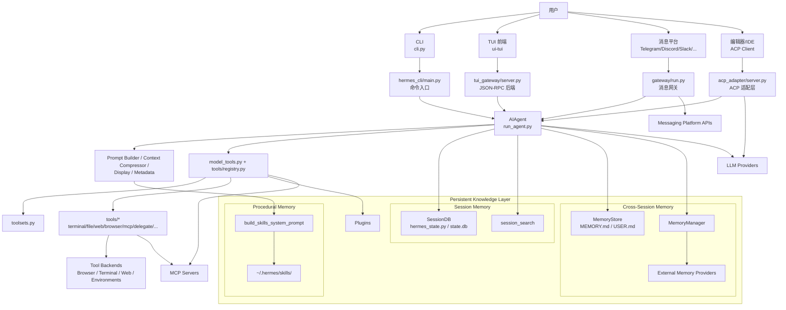

### 3.1 持久知识层说明

- `Session Memory`：由 `SessionDB + session_search` 组成，负责保存和检索完整对话历史。
- `Cross-Session Memory`：由 `MemoryStore(MEMORY.md / USER.md)` 和 `MemoryManager + External Memory Providers` 组成，负责长期事实、用户偏好和环境知识。
- `Procedural Memory`：由 `build_skills_system_prompt + ~/.hermes/skills/` 组成，负责方法论、流程和模板等程序性知识。
- `Plugins` 单独保留为扩展机制，不再与 memory 或 skills 混成同一节点。

### 3.2 技能子系统在整体架构中的位置

技能系统是 Hermes 里最“轻扩展、快接入”的能力层之一。它既属于上图里的 `Procedural Memory`，又横跨：

- `prompt_builder`：负责低成本发现和索引
- `skills_list / skill_view`：负责按需读取
- `skill_manage`：负责把经验回写为程序性记忆
- `skills_hub`：负责从外部生态接入 skill

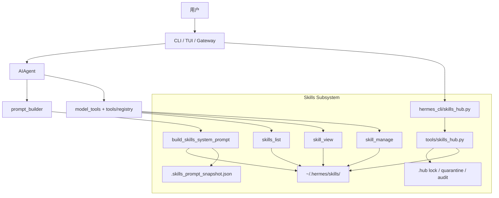

### 3.3 自生成技能与轻量快装主链

Hermes 的“技能很轻、还会自己长出来”不是一句抽象描述，而是由运行时链路共同形成的：

- session 启动时只构建技能索引，而不是加载所有技能全文
- 任务命中 skill 时再 `skill_view`
- 缺配置时在加载时补齐，而不是安装时强制配置
- 复杂任务后通过后台 review 和 `skill_manage` 沉淀新技能
- Hub 安装后清理索引缓存，让新技能快速进入能力面

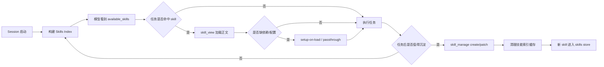

### 3.4 延伸阅读

- 文档目录页：`docs/README.md`
- 汇报核心图精选：`docs/hermes-presentation-core-diagrams.md`
- 知识层总图：`docs/hermes-knowledge-layer-analysis.md`
- 技能专题分析：`docs/hermes-skills-self-generation-and-fast-install.md`
- 记忆专题分析：`docs/hermes-memory-architecture-analysis.md`
- 使用方法与执行场景：`docs/hermes-usage-and-execution-scenarios.md`
- 用户快速使用手册：`docs/hermes-user-quickstart-guide.md`
- 研发场景索引表：`docs/hermes-engineering-scenario-index.md`
- 工具体系总览：`docs/hermes-tooling-architecture-analysis.md`
- 工具运行时拆解：`docs/hermes-tools-runtime-breakdown.md`
- 工具权限专题：`docs/hermes-tools-permissions-analysis.md`
- 工具权限代码索引：`docs/hermes-tools-permissions-callchain-index.md`
- 工具分类矩阵：`docs/hermes-tools-classification-matrix.md`
- 已注册工具总表：`docs/hermes-registered-tools-inventory.md`

---

## 4. 模块全景拆解

| 模块 | 角色定位 | 如何初始化 | 主要输入 | 内部核心逻辑 | 主要输出/接口 |
|---|---|---|---|---|---|
| `run_agent.py` | Agent 执行内核 | 由 CLI/TUI/Gateway/ACP 创建 `AIAgent` 实例 | 用户消息、会话历史、系统提示、模型配置、toolsets | 构造 system prompt、调用模型、接收 tool calls、执行工具、写回结果、上下文压缩、持久化会话 | `chat()`、`run_conversation()` |
| `model_tools.py` | 工具编排层 | import 时触发内建工具、MCP 工具、插件工具发现 | enabled/disabled toolsets、tool name、tool args | 解析 toolset、过滤 schema、同步/异步桥接、分发 handler | `get_tool_definitions()`、`handle_function_call()` |
| `toolsets.py` | 工具集合定义层 | 模块加载即注册静态 toolset 配置 | toolset 名称 | 将场景语义映射为工具清单，支持 includes/组合 | `resolve_toolset()`、`validate_toolset()` |
| `tools/` | 具体能力实现层 | 每个工具模块 import 时执行 `registry.register()` | JSON 参数、task_id、session 信息 | 执行文件、终端、浏览器、MCP、消息、图像、代码等能力 | 统一返回 JSON 字符串 |
| `tools/registry.py` | 工具注册中心 | 被 `model_tools.py` 导入后作为全局单例使用 | schema、handler、check_fn | 存储工具元信息、生成 schema、执行 dispatch | `register()`、`get_definitions()`、`dispatch()` |
| `agent/` | Agent 辅助能力层 | `AIAgent` 初始化/运行过程中按需使用 | 消息、模型、环境、记忆、技能 | prompt 组装、上下文压缩、模型元数据、记忆、显示、计费、重试 | 内部 helper API |
| `cli.py` | 经典交互式终端入口 | `hermes_cli/main.py` 触发 `HermesCLI` | CLI 参数、slash 命令、用户输入 | REPL、命令分发、agent 生命周期、交互式审批/澄清/语音 | `HermesCLI.run()` |
| `hermes_cli/` | CLI 命令与配置中心 | `hermes` 命令启动时加载 | 子命令、配置、环境变量、profiles | setup、config、model switch、skills/tools 开关、skin、migration、doctor | `hermes ...` 命令族 |
| `ui-tui/` | React/Ink TUI 前端 | `hermes --tui` 时启动 Node 侧 UI | JSON-RPC 事件流 | 负责屏幕渲染、输入体验、会话视图、交互 prompt | `prompt.submit` 等 RPC 调用 |
| `tui_gateway/` | TUI 的 Python 后端 | TUI 启动时作为子进程运行 | RPC 请求、slash 命令、session id | 会话管理、AIAgent 调用、把阻塞型操作放到线程池 | JSON-RPC 响应与事件 |
| `gateway/` | 多消息平台网关 | `hermes gateway` 启动 `GatewayRunner` | 平台消息事件、命令、附件、频道上下文 | 用户授权、配对、会话路由、Agent 缓存、平台适配、通知回投 | 发送平台回复、管理会话 |
| `acp_adapter/` | 编辑器协议适配层 | `hermes acp` 启动 | ACP 请求、session、内容块 | 将编辑器协议适配到 Hermes agent、模型选择、会话管理、审批回调 | ACP Agent 响应 |
| `hermes_state.py` | 会话状态存储 | CLI/Gateway/TUI 初始化时创建 `SessionDB` | session、message、usage、title | SQLite WAL、FTS5 搜索、会话链、写锁退避 | `state.db` 与查询接口 |
| `cron/` | 定时任务执行器 | Gateway 后台线程/独立调度触发 `tick()` | cron job、deliver 目标、当前时间 | 取到期任务、触发 agent、保存输出、路由投递 | 任务执行结果、消息投递 |
| `batch_runner.py` | 批处理/研究运行器 | 命令行直接运行 | dataset、toolset 分布、run 配置 | 多进程跑 agent、保存轨迹、统计工具使用 | trajectories、统计结果 |
| `environments/` | RL/训练环境 | 训练或环境选择时加载 | agent config、环境配置 | 将 agent 嵌入 RL 环境闭环 | 训练/推理接口 |
| `plugins/` | 插件扩展层 | 启动时发现用户/项目/pip 插件 | hook、memory provider、tool | 在不改核心代码前提下注入能力 | hooks、memory provider、tool 扩展 |
| `tests/` | 回归与行为验证 | 测试时加载 | pytest 用例 | 覆盖 CLI/Gateway/Agent/ACP/插件等行为 | CI 信心与回归保护 |

---

## 5. 初始化链路

### 5.1 总体启动流程

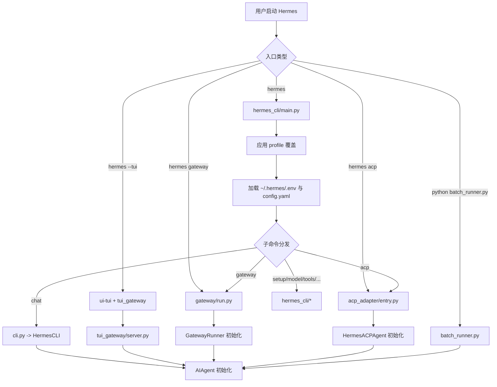

### 5.2 `hermes_cli/main.py` 初始化要点

- 最先执行的是 profile 解析 `_apply_profile_override()`，保证 `HERMES_HOME` 在其它模块 import 前就被设置好。
- 然后加载 `~/.hermes/.env` 和项目级 `.env`。
- 之后才进入子命令分发，例如：
  - `hermes` / `hermes chat` -> `cli.py`
  - `hermes gateway` -> `gateway/run.py`
  - `hermes acp` -> `acp_adapter/entry.py`
  - `hermes setup` / `hermes tools` / `hermes skills` -> `hermes_cli/*`

### 5.3 `AIAgent` 初始化要点

`AIAgent.__init__()` 的初始化逻辑比较重，核心包括：

- 解析 provider、`base_url`、`api_mode`
- 预热 transport
- 标准化 model
- 预热 OpenRouter model metadata
- 保存回调函数
- 初始化中断、并发工具线程、子 agent、预算与活动跟踪
- 解析 toolsets，获取有效工具
- 初始化 memory manager、todo store、session db、context compressor、prompt caching 等

这说明 Hermes 的设计不是“临时构建一个聊天对象”，而是“构建一个具备运行状态和生命周期管理的 agent runtime”。

---

## 6. 核心运行架构

### 6.1 Agent 核心执行图（含自演进）

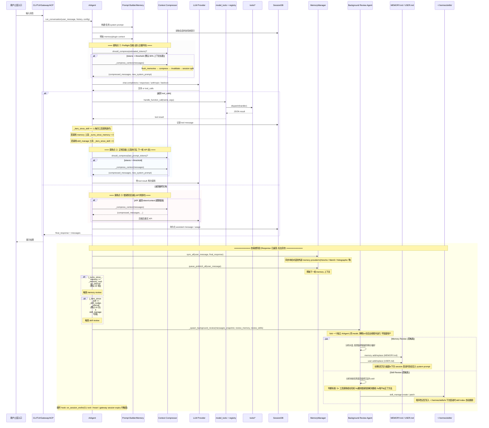

#### 6.1.1 自演进机制详解

上图中黄色高亮的"自演进阶段"是 Hermes Agent 区别于普通聊天代理的核心能力——agent 在每轮对话结束后，会在后台异步对自己执行"复盘"，将经验沉淀为长期记忆和可复用技能。

**自演进包含三条并行链路：**

| 链路 | 触发条件 | 执行方式 | 写入目标 | 后续影响 |
|---|---|---|---|---|
| ① Memory Provider 同步 | 每轮对话结束 | 同步调用 | 外部 memory provider (Honcho/Mem0 等) | 下一轮自动 prefetch 注入上下文 |
| ② Memory Review (长期记忆自演进) | `_turns_since_memory >= 10` (距上次 memory 工具调用满 10 轮) | 后台线程 fork 独立 AIAgent | `~/.hermes/memories/MEMORY.md` / `USER.md` | 下次 session 启动时自动注入 system prompt |
| ③ Skill Review (技能自生成) | `_iters_since_skill >= 10` (距上次 skill_manage 调用满 10 次工具迭代) **且** `skill_manage` 工具可用 | 后台线程 fork 独立 AIAgent | `~/.hermes/skills/<skill-name>/SKILL.md` | 下次 session 启动时 skill index 自动发现 |

**计数器管理机制：**

- `_turns_since_memory`：每个 `run_conversation()` 调用 +1；模型主动调用 `memory` 工具时归零。**跨 `run_conversation` 调用累积**（CLI 多轮对话模式下不重置）。
- `_iters_since_skill`：每次工具调用迭代（tool_calls 回合）+1；模型主动调用 `skill_manage` 工具时归零。同样跨调用累积。

这样设计的好处是：如果模型自己在任务中主动用了 `memory` 或 `skill_manage`，说明它已经自觉完成了记忆/技能沉淀，不需要后台再额外 review；只有模型"忘了"沉淀时，后台 review 才会在积累一定轮次后介入提醒。

**Background Review Agent 的特点：**

- fork 独立的 `AIAgent` 实例（同 model、同 provider），在 `threading.Thread` 中运行
- 设置 `quiet_mode=True`，stdout/stderr 重定向到 `/dev/null`，**用户完全无感知**
- 设置 `_memory_nudge_interval = 0`、`_skill_nudge_interval = 0`，**避免递归触发**
- review 的 prompt 是专门设计的"复盘提示词"，不是用户原始消息
- 写入操作直接作用在共享的 `MemoryStore` / `skills/` 目录上
- **最佳努力（best-effort）**：失败不影响主流程

**自演进的工程意义：**

> Hermes Agent 的"自演进"不是简单的记忆存储，而是将 agent 自身当作一个可被自身优化的系统——
> - 跨会话记忆让 agent "越来越懂你"
> - 技能自生成让 agent "越来越能干"
> - 后台异步 review 让演进"不打扰你"

---

### 6.2 工具发现与分发表达

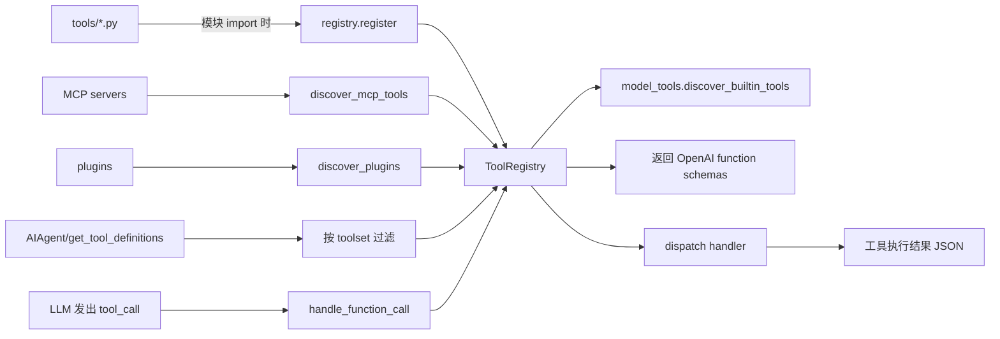

### 6.3 会话、记忆、工具、模型的数据流

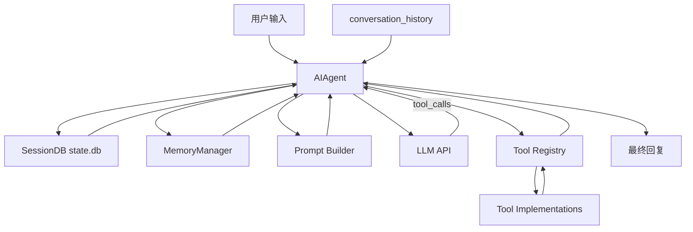

### 6.4 SessionDB 简化实体关系图

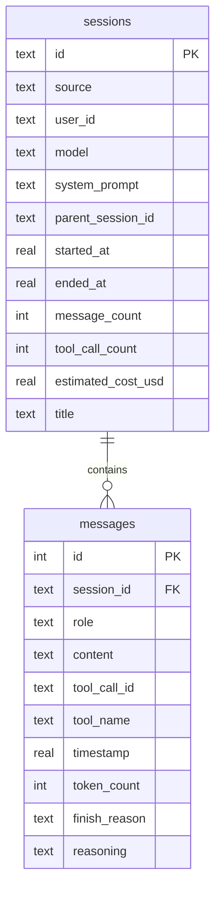

---

## 7. 模块级深入分析

## 7.1 `run_agent.py`：执行内核

### 模块职责

- 提供统一的 `AIAgent` 对话执行模型
- 隔离不同 provider/API 模式
- 在单轮对话中完成“模型调用 -> 工具执行 -> 再调用模型”的闭环
- 管理预算、中断、压缩、记忆、持久化、回调、fallback

### 初始化方式

- 上层入口创建 `AIAgent(...)`
- 典型调用方：
  - `cli.py`
  - `gateway/run.py`
  - `tui_gateway/server.py`
  - `acp_adapter/server.py`
  - `batch_runner.py`

### 输入接口

- 构造参数：
  - 模型和 provider 配置
  - toolsets 过滤
  - session 信息
  - 平台上下文
  - 各类 callback
- 运行参数：
  - `run_conversation(user_message, system_message, conversation_history, task_id, stream_callback, persist_user_message)`
  - `chat(message)` 用于简化调用

### 内部执行逻辑

1. 清理/标准化输入
2. 恢复或构建 system prompt
3. 处理 memory、plugin context、skills、context files
4. 进行 preflight compression
5. 进入主循环
6. 调用模型
7. 如果模型返回 `tool_calls`，则交给 `model_tools.handle_function_call`
8. 将 tool result 追加到 messages
9. 若模型返回文本则结束
10. 刷新 session db、usage、memory sync、prefetch queue

### 输出

- `{"final_response": ..., "messages": ...}` 形式的结果
- 对外表现为最终回答、会话记录、可搜索消息历史、计费/usage 元信息
 
### 关键工程观察

- `AIAgent` 不是单纯的模型调用器，而是把 prompt、memory、tool、state、callback 全部收口的运行时容器。
- 真正的复杂度来自“多轮工具闭环 + 多 provider 兼容 + 长会话治理”三件事叠加。
- 如果后续还要继续拆，优先可以把 `run_conversation()` 视作“预处理层、模型交互层、工具循环层、收尾持久化层”四段来读。

### 进一步拆解：AIAgent 运行时分层图

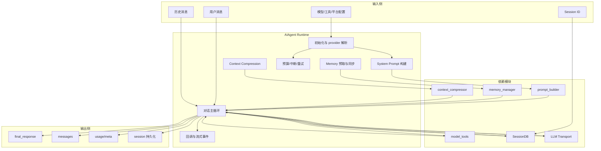

### 进一步拆解：一次对话回合的数据流

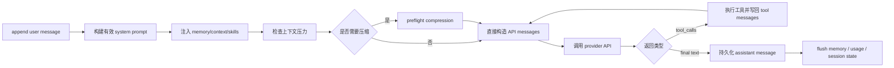

### 进一步拆解：工具调用循环时序图

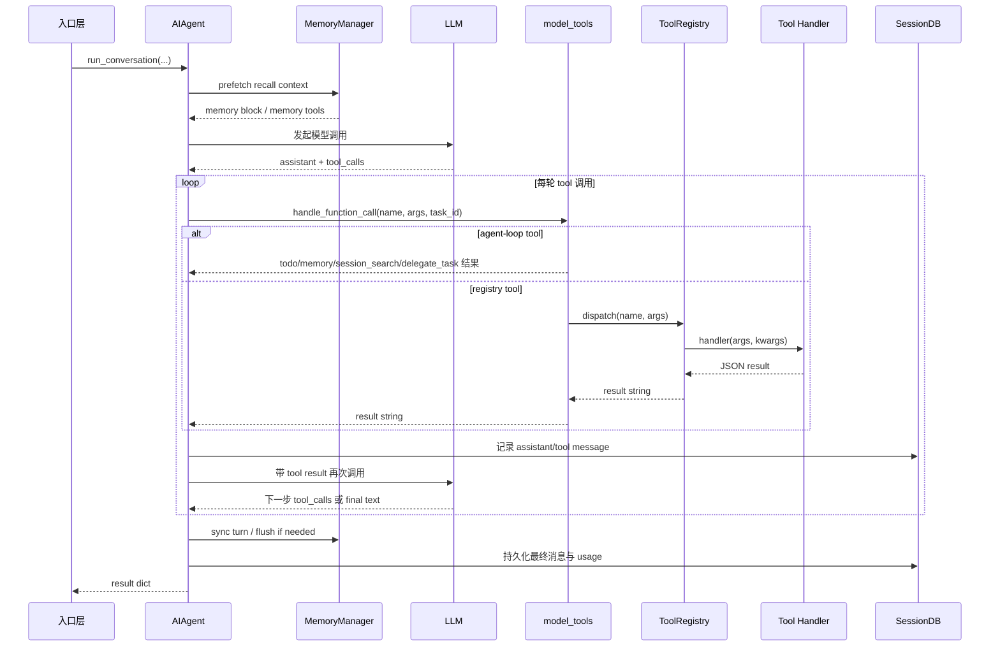

### 进一步拆解：AIAgent 简化类关系图

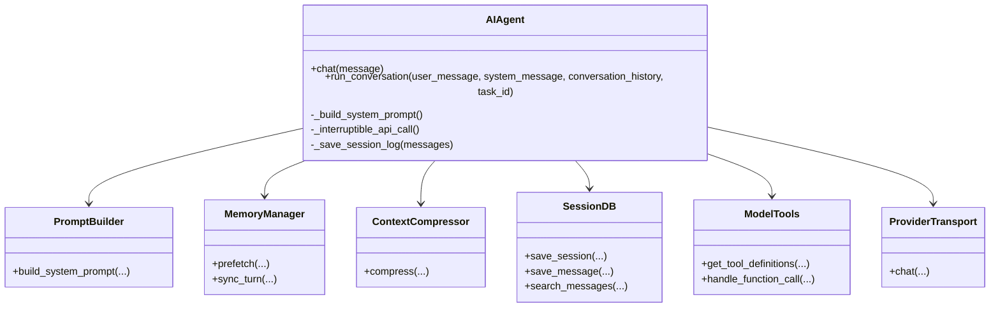

---

## 7.2 `model_tools.py`：工具编排层

### 模块职责

- 作为 `ToolRegistry` 的薄编排层
- 负责 builtin/MCP/plugin 工具发现
- 对上暴露稳定 API，避免调用方直接关心 registry 细节
- 负责 sync/async 工具的桥接

### 初始化方式

- import 时执行：
  - `discover_builtin_tools()`
  - `discover_mcp_tools()`
  - `discover_plugins()`

### 输入接口

- `get_tool_definitions(enabled_toolsets, disabled_toolsets, quiet_mode)`
- `handle_function_call(function_name, function_args, task_id, user_task)`
- `get_toolset_for_tool(name)`
- `check_toolset_requirements()`

### 内部执行逻辑

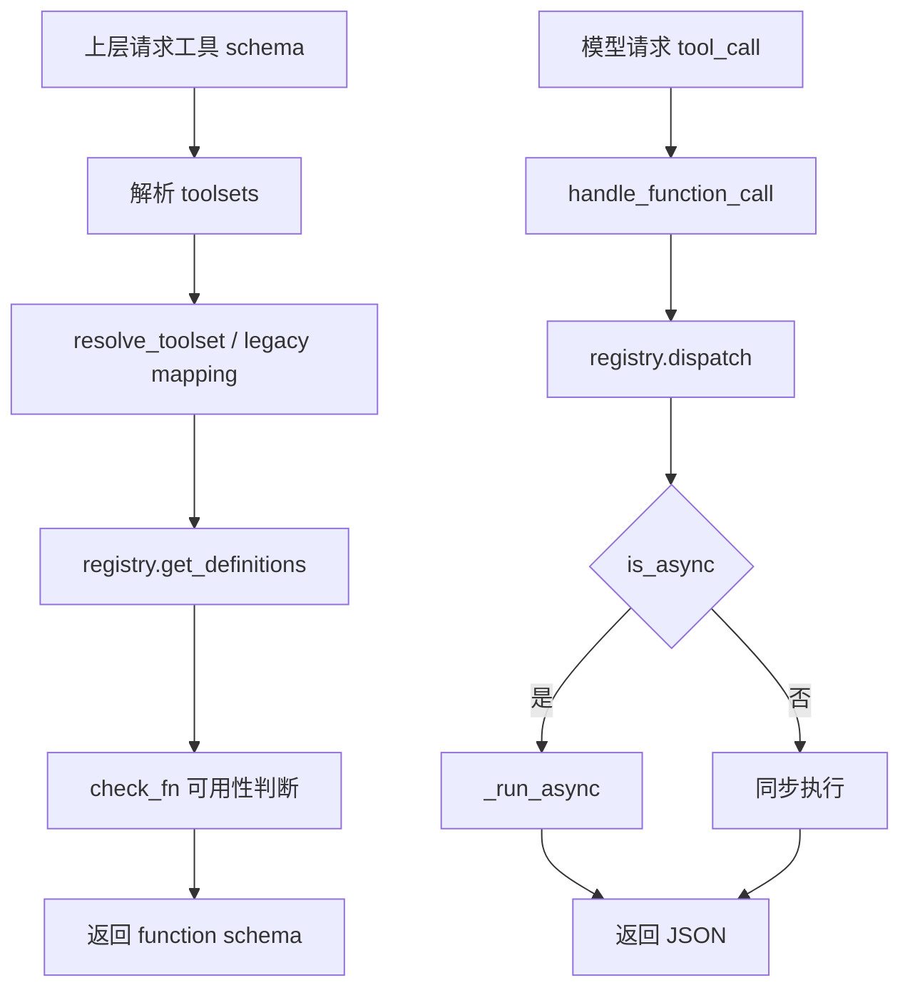

### 输出

- 给模型的 tool schema
- 给 agent 的 tool 执行结果

### 进一步拆解：工具编排职责图

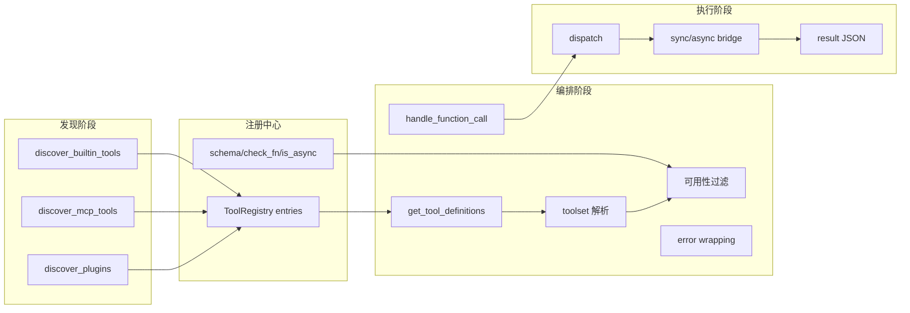

### 进一步拆解：schema 请求到 tool result 的数据流

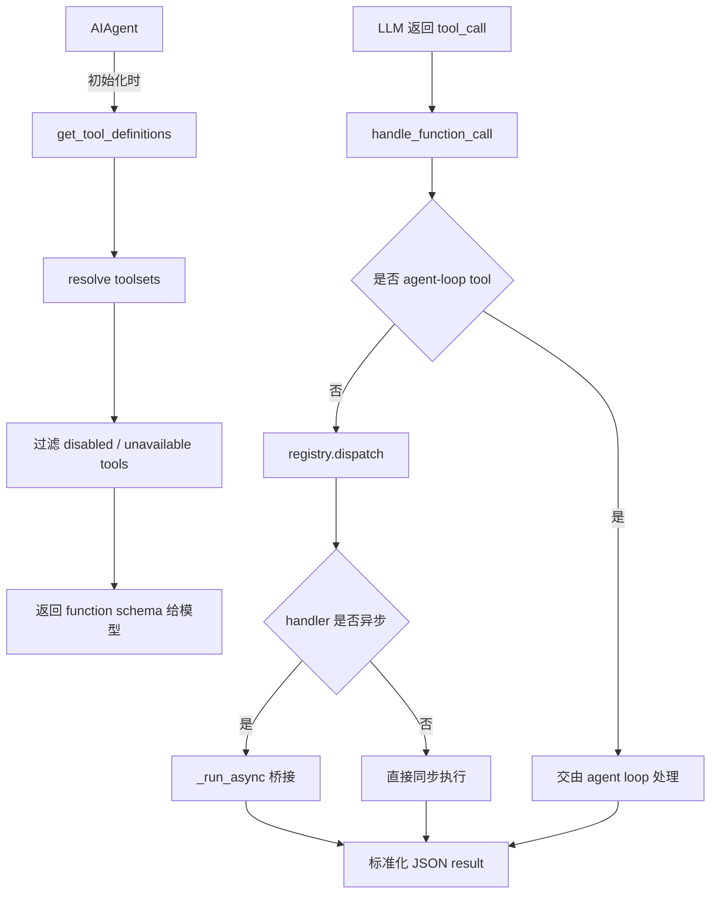

### 进一步拆解：工具执行时序图

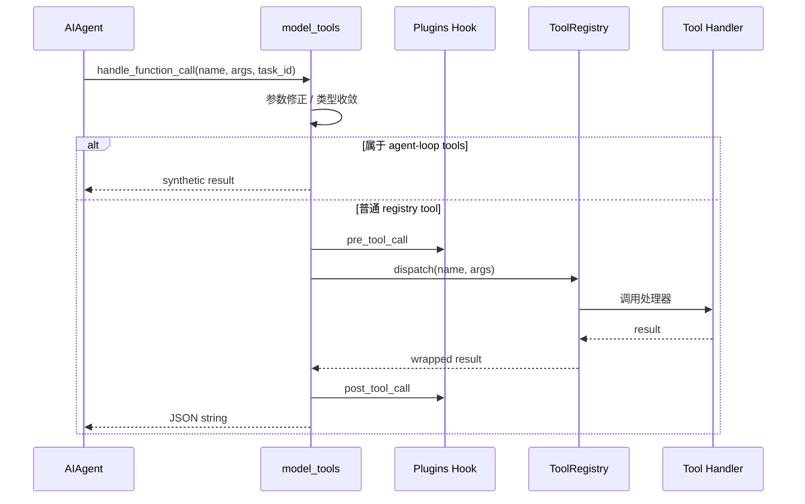

### 关键工程观察

- `model_tools.py` 不是工具实现层，而是 agent 与 registry 之间的协议适配层。
- 它把工具发现、toolset 过滤、异步桥接、错误包装收口，避免 `run_agent.py` 直接感知底层注册细节。
- 这里的一个关键设计点是：真正依赖 agent 本地状态的工具会被提前截获，因此 registry 只处理“通用工具执行”。

---

## 7.3 `toolsets.py`：工具组合层

### 模块职责

- 用场景语义组织工具，而不是让调用方直接拼接工具列表
- 提供 `web`、`browser`、`file`、`skills`、`delegation`、`hermes-acp` 等 toolset

### 初始化方式

- import 后使用静态 `TOOLSETS` 和 `_HERMES_CORE_TOOLS`

### 输入接口

- `resolve_toolset(name)`
- `validate_toolset(name)`
- `get_all_toolsets()`

### 内部执行逻辑

- 把一个 toolset 递归展开为具体 tool names
- 支持 `includes`
- 向上层提供“场景级别”启停，而不是“单工具级别”启停

### 价值

- 减少模型暴露的工具面
- 让不同入口复用同一套工具策略
- 为 ACP、Gateway、CLI 提供差异化能力集

### 进一步拆解：toolset 递归展开图

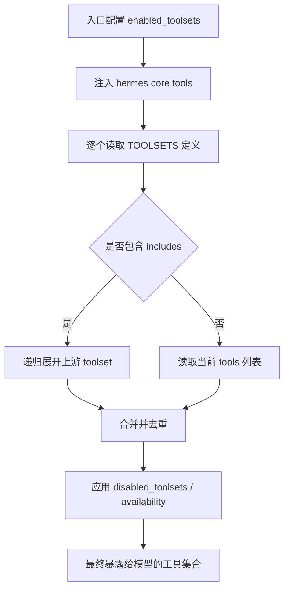

### 进一步拆解：toolset 配置与调用方关系图

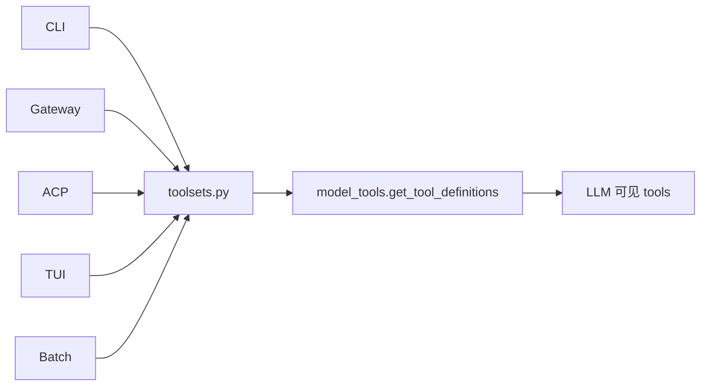

### 关键工程观察

- `toolsets.py` 把“平台策略”从“工具实现”里抽出来，使工具能力与暴露策略解耦。
- 这意味着 Hermes 可以在不改工具代码的前提下，为不同入口裁剪出不同能力面。
- 在大型 agent 系统中，这一层本质上是权限面、能力面、产品面的交汇点。

---

## 7.4 `tools/registry.py` 与 `tools/`

### 模块职责

- `registry.py` 是统一注册中心
- `tools/*` 是具体能力实现

### 初始化方式

- 每个 `tools/*.py` 顶层调用 `registry.register(...)`
- `model_tools.py` 在 import 时自动扫描并导入这些模块

### 输入接口

- 注册接口：
  - `registry.register(name, toolset, schema, handler, check_fn, requires_env, is_async, ...)`
- 运行接口：
  - `get_definitions(tool_names)`
  - `dispatch(name, args, **kwargs)`

### 内部执行逻辑

- AST 扫描模块中是否存在顶层 `registry.register(...)`
- 将工具元信息存入单例 registry
- `dispatch` 统一处理同步/异步和异常包装

### 代表性工具类型

- 文件类：`read_file`、`write_file`、`patch`、`search_files`
- 终端类：`terminal`、`process`
- Web 类：`web_search`、`web_extract`
- 浏览器类：`browser_*`
- 代理类：`delegate_task`、`execute_code`
- 集成类：`mcp_tool`、`send_message`
- 状态类：`todo`、`memory`、`session_search`

### 设计价值

- 工具扩展的接入点非常统一
- 适合后续继续增长工具数量
- 注册式设计让 MCP 和插件接入天然兼容

### 进一步拆解：注册中心架构图

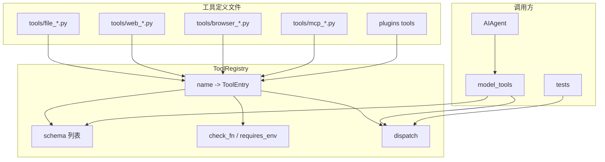

### 进一步拆解：registry dispatch 时序图

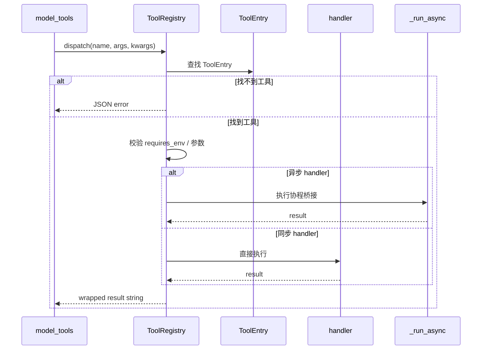

### 进一步拆解：工具元数据类图

```mermaid
classDiagram
    class ToolRegistry {
        +register(name, toolset, schema, handler, ...)
        +get_definitions(tool_names)
        +dispatch(name, args, kwargs)
    }

    class ToolEntry {
        +name
        +toolset
        +schema
        +handler
        +check_fn
        +requires_env
        +is_async
    }

    class ToolHandler {
        +__call__(args, kwargs)
    }

    ToolRegistry --> ToolEntry
    ToolEntry --> ToolHandler
```

### 关键工程观察

- `tools/registry.py` 是 Hermes 工具体系真正的“能力目录”，所有工具最终都要归档到这里。
- 注册式设计把扩展成本降得很低，但同时也要求 schema、一致性和错误包装足够稳定。
- 从阅读代码的角度，理解 registry 后，再看任意工具文件会非常快，因为它们遵循的是统一接入协议。

---

## 7.5 `agent/`：运行时辅助能力层

`agent/` 目录承担的是“支撑 `AIAgent` 工作的内脏逻辑”，不是入口层。

### 关键子模块

| 子模块 | 作用 |
|---|---|
| `prompt_builder.py` | 组装 system prompt、skills prompt、context files prompt、environment hints |
| `context_compressor.py` | 长会话压缩与 session 分叉 |
| `prompt_caching.py` | Anthropic prompt cache 控制 |
| `memory_manager.py` | 协调 builtin memory 与外部 memory provider |
| `model_metadata.py` | 上下文长度估算、token 估算、provider 元信息 |
| `display.py` | CLI/Gateway 中的活动展示与 tool preview |
| `skill_commands.py` | skill slash command 注入与调用支撑 |
| `trajectory.py` | 轨迹落盘，供训练或回放使用 |

### `prompt_builder.py`

- 输入：平台、skills、context files、SOUL.md、memory guidance
- 处理：拼装高稳定性 system prompt
- 输出：`AIAgent._build_system_prompt()` 使用的 prompt 文本

### `memory_manager.py`

- 输入：用户 query、session_id、tool call
- 处理：
  - prefetch recall context
  - sync turn
  - route memory tool calls
  - 限制最多一个外部 memory provider
- 输出：
  - memory context block
  - memory tool schemas

### `context_compressor.py`

- 输入：过长 messages + 当前 system prompt
- 处理：压缩中段消息、保护首尾消息、必要时切分新 session
- 输出：更短的对话上下文和更新后的 prompt/session 关系

### 设计评价

- `agent/` 的职责边界相对清晰
- 这是 Hermes 后续继续增强模型行为、缓存策略、压缩策略的主要演进位

### 进一步拆解：agent 辅助模块架构图

```mermaid
flowchart TB
    AGCORE[AIAgent]

    subgraph AgentInternals[agent/ 子模块]
        PB3[prompt_builder]
        MM3[memory_manager]
        CC3[context_compressor]
        PC3[prompt_caching]
        META3[model_metadata]
        DISP3[display]
        TRAJ3[trajectory]
        ERR3[error_classifier]
    end

    AGCORE --> PB3
    AGCORE --> MM3
    AGCORE --> CC3
    AGCORE --> PC3
    AGCORE --> META3
    AGCORE --> DISP3
    AGCORE --> TRAJ3
    AGCORE --> ERR3
```

### 进一步拆解：prompt + memory + compression 数据流图

```mermaid
flowchart LR
    USER3[用户消息] --> PBIN[Prompt Builder]
    SKILL3[skills/context files/SOUL] --> PBIN
    PBIN --> SYS3[system prompt]
    SYS3 --> AGLOOP[AIAgent loop]

    MEMREQ[session_id + query] --> MMIN[MemoryManager]
    MMIN --> MEMCTX[memory context]
    MEMCTX --> AGLOOP

    AGLOOP --> PRESSURE[context pressure estimation]
    PRESSURE --> COMPCHK{是否超窗}
    COMPCHK -->|是| COMP3[ContextCompressor]
    COMPCHK -->|否| MODEL3[直接送模型]
    COMP3 --> MODEL3
```

### 进一步拆解：辅助模块协作时序图

```mermaid
sequenceDiagram
    participant Agent as AIAgent
    participant PB as PromptBuilder
    participant MM as MemoryManager
    participant META as ModelMetadata
    participant CC as ContextCompressor
    participant Cache as PromptCaching

    Agent->>PB: build_system_prompt(...)
    PB-->>Agent: system prompt
    Agent->>MM: prefetch / memory guidance
    MM-->>Agent: memory context + memory tools
    Agent->>META: estimate context / token budget
    META-->>Agent: context pressure
    alt 上下文过长
        Agent->>CC: compress(messages, system_prompt)
        CC-->>Agent: compressed messages / new session lineage
    end
    Agent->>Cache: apply cache markers if supported
    Cache-->>Agent: cache-aware messages
```

### 关键工程观察

- `agent/` 不是一个杂项目录，而是把 prompt、memory、压缩、元数据、显示等横切关注点从 `run_agent.py` 中抽离出来的内脏层。
- 这一层越清晰，后续做模型切换、上下文治理、记忆策略迭代就越容易。
- 从系统设计看，它对应的是“可演进的 agent runtime 基础设施层”。

---

## 7.6 `cli.py` 与 `hermes_cli/`：终端产品层

### `cli.py` 的角色

- 提供交互式 REPL
- 维护当前会话状态
- 处理 slash commands
- 负责与用户的同步交互体验：审批、澄清、模型切换、语音等

### `HermesCLI` 初始化

- 读取全局配置 `CLI_CONFIG`
- 决定 model/provider/base_url/max_turns
- 初始化 `SessionDB`
- 初始化 session id
- 准备 deferred `AIAgent` 构造

### 输入接口

- 用户在 REPL 中的文本输入
- slash command，例如 `/model`、`/resume`、`/skills`、`/compress`

### 内部逻辑

```mermaid
flowchart TD
    A[用户输入] --> B{是否 slash command}
    B -->|是| C[process_command]
    B -->|否| D[交给 AIAgent]
    C --> E[命令路由到 _handle_xxx]
    D --> F[run_conversation]
    F --> G[流式展示/工具进度]
    G --> H[更新 conversation_history / SessionDB]
```

### `hermes_cli/` 的角色

- 命令入口和配置域模型
- setup/migrate/model/tools/skills/profiles/doctor 等完整 CLI 体系
- 对 Hermes 而言，它不仅是“命令集合”，也是“运维和产品能力的控制平面”

### 使用接口

- `hermes`
- `hermes setup`
- `hermes gateway`
- `hermes acp`
- `hermes claw migrate`
- `hermes skills`
- `hermes tools`
- `hermes config`

---

## 7.7 `ui-tui/` 与 `tui_gateway/`：前后端分离的终端 UI

这是 Hermes 很重要的工程特征：TUI 不是把 `cli.py` 包一层，而是一个真正的前后端分离架构。

### `ui-tui/` 前端职责

- 用 React/Ink 渲染终端 UI
- 管理 transcript、composer、prompt、status、progress
- 与 Python 后端通过 JSON-RPC 通讯

### `tui_gateway/server.py` 后端职责

- 管理 TUI session
- 把慢操作放进线程池
- 创建/复用 `AIAgent`
- 接收前端 RPC 调用并回推事件

### TUI 架构图

```mermaid
flowchart LR
    A[Ink UI\nui-tui/src/app.tsx] <-->|JSON-RPC over stdio| B[tui_gateway/server.py]
    B --> C[AIAgent]
    B --> D[SessionDB]
    B --> E[Slash Worker]
    C --> F[Tools / Providers]
```

### 典型输入接口

- `prompt.submit`
- `slash.exec`
- `session.resume`
- `approval.respond`

### 设计价值

- UI 状态与 agent 执行解耦
- 便于未来替换前端
- 适合更复杂的交互和异步操作

---

## 7.8 `gateway/`：多平台消息网关

### 模块职责

- 统一接入 Telegram、Discord、Slack、WhatsApp、Signal 等平台
- 处理消息授权、配对、session 路由、忙时中断/排队、平台回复
- 作为“长期在线代理服务”的运行容器

### 初始化方式

- `GatewayRunner(config)`
- 初始化：
  - `SessionStore`
  - `DeliveryRouter`
  - `SessionDB`
  - pairing store
  - hooks
  - agent cache
  - 平台 adapters

### 输入接口

- 平台 `MessageEvent`
- slash command
- voice/photo/附件等消息类型

### `_handle_message()` 处理链路

```mermaid
flowchart TD
    A[平台消息到达] --> B[用户授权检查]
    B --> C{是否 update/pairing 等特殊流}
    C -->|是| D[特殊处理]
    C -->|否| E{该 session 是否已有运行中 agent}
    E -->|是| F[中断/排队/steer/stop/approve 等处理]
    E -->|否| G[获取或创建 session]
    G --> H[获取或创建缓存 AIAgent]
    H --> I[run_conversation]
    I --> J[平台适配器发送回复]
```

### 核心价值

- 把“聊天机器人”提升为“多平台常驻代理”
- 支持一个统一运行时服务多个通信渠道
- 通过 agent cache 保持 prompt caching 效益

### 进一步拆解：Gateway 运行架构图

```mermaid
flowchart TB
    subgraph Platforms[平台适配层]
        TG[Telegram]
        DC[Discord]
        SL[Slack]
        WA[WhatsApp]
        SG[Signal]
        MX[Matrix]
    end

    subgraph GatewayCore[GatewayRunner]
        AUTH[授权/配对]
        ROUTE[session key 路由]
        CACHE[agent cache]
        RUNNING[running agent / interrupt]
        DELIVER[delivery router]
        HOOKS[hooks]
    end

    subgraph RuntimeDeps[运行依赖]
        AG4[AIAgent]
        SDB4[SessionDB]
        CRON4[cron tick]
    end

    Platforms --> AUTH
    AUTH --> ROUTE
    ROUTE --> CACHE
    CACHE --> RUNNING
    RUNNING --> AG4
    AG4 --> SDB4
    AG4 --> DELIVER
    HOOKS --> AG4
    CRON4 --> DELIVER
```

### 进一步拆解：平台消息处理时序图

```mermaid
sequenceDiagram
    participant Platform as 平台 Adapter
    participant Gateway as GatewayRunner
    participant Session as Session Routing
    participant Agent as AIAgent
    participant Delivery as Delivery Router

    Platform->>Gateway: on_message(event)
    Gateway->>Gateway: authorize / pairing / special commands
    Gateway->>Session: resolve session key
    Session-->>Gateway: session context
    Gateway->>Gateway: get or create cached agent
    Gateway->>Agent: run_conversation(message, history, callbacks)
    Agent-->>Gateway: result
    Gateway->>Delivery: send reply / updates
    Delivery-->>Platform: 平台消息回发
```

### 进一步拆解：Gateway 会话状态流图

```mermaid
flowchart LR
    EVENT[平台消息事件] --> AUTH2[授权检查]
    AUTH2 --> SPECIAL{是否特殊指令}
    SPECIAL -->|是| CONTROL[approve/stop/steer/pairing]
    SPECIAL -->|否| KEY[生成 session key]
    KEY --> RUNCHK{该 session 是否已有运行中 agent}
    RUNCHK -->|是| INTER[中断/排队/复用]
    RUNCHK -->|否| CREATE[创建或复用 agent]
    INTER --> AGENTRUN[继续执行]
    CREATE --> AGENTRUN
    AGENTRUN --> REPLY[发送平台回复]
```

### 关键工程观察

- `gateway/` 的本质不是“消息转发器”，而是一个长期在线的 agent 容器管理层。
- 它额外解决的是会话路由、用户授权、并发中断、平台回投这些 CLI 不需要面对的问题。
- 理解 Gateway 时，应该把它看成“多租户、多会话、多渠道”的运行壳层。

---

## 7.9 `acp_adapter/`：编辑器协议接入层

### 模块职责

- 把 Hermes 暴露为 ACP Agent
- 供 VS Code / Zed / JetBrains 等编辑器使用

### 初始化方式

- `acp_adapter/entry.py`：
  - 加载 `.env`
  - 配置 stderr logging
  - 创建 `HermesACPAgent`
  - `asyncio.run(acp.run_agent(...))`

### 输入接口

- ACP 的 initialize/session/prompt/model/mcp 等请求

### 内部执行逻辑

- 解析 ACP content blocks
- 维护 session state
- 把编辑器上下文转成 `AIAgent` 可消费的 prompt
- 把 Hermes 的消息/步骤/工具进度回推到 ACP client

### 价值

- 将 Hermes 从“终端/消息代理”扩展到“IDE coding agent”
- 接入点清晰，不污染 `run_agent.py`

### 进一步拆解：ACP 适配架构图

```mermaid
flowchart LR
    IDE[VS Code / Zed / JetBrains]
    ACPPROTO[ACP 协议消息]
    ACPSERVER[HermesACPAgent]
    SESSIONACP[ACP Session State]
    AG5[AIAgent]
    CB5[工具/步骤/流式回调]

    IDE --> ACPPROTO
    ACPPROTO --> ACPSERVER
    ACPSERVER --> SESSIONACP
    ACPSERVER --> AG5
    AG5 --> CB5
    CB5 --> ACPSERVER
    ACPSERVER --> IDE
```

### 进一步拆解：编辑器请求时序图

```mermaid
sequenceDiagram
    participant IDE as ACP Client
    participant ACP as HermesACPAgent
    participant Session as ACP Session
    participant Agent as AIAgent

    IDE->>ACP: initialize / new session
    ACP->>Session: 建立 session state
    IDE->>ACP: prompt / context blocks / model selection
    ACP->>ACP: 解析 content blocks
    ACP->>Agent: run_conversation(mapped prompt, callbacks)
    Agent-->>ACP: tokens / tool progress / final response
    ACP-->>IDE: 协议事件流
```

### 进一步拆解：编辑器上下文映射数据流

```mermaid
flowchart TD
    ACPPAYLOAD[ACP content blocks]
    FILECTX[编辑器文件/selection/cwd]
    MODELSEL[model/mcp/session options]
    NORMALIZEACP[规范化与会话绑定]
    PROMPTMAP[映射为 Hermes prompt]
    AGACP[AIAgent]
    EVENTSACP[steps/messages/tool progress]

    ACPPAYLOAD --> NORMALIZEACP
    FILECTX --> NORMALIZEACP
    MODELSEL --> NORMALIZEACP
    NORMALIZEACP --> PROMPTMAP
    PROMPTMAP --> AGACP
    AGACP --> EVENTSACP
```

### 关键工程观察

- ACP 层做的不是简单代理，而是把 IDE 协议中的 content block、session、模型与事件系统翻译成 Hermes runtime 语义。
- 这层存在的意义是“协议适配”和“交互模型适配”，因此它天然应该独立于 `run_agent.py`。
- 对代码阅读者来说，ACP 是理解 Hermes 如何进入 IDE 场景的关键桥接层。

---

## 7.10 `hermes_state.py`：统一会话状态层

### 模块职责

- 提供 SQLite + FTS5 的长期会话存储
- 让 CLI/Gateway/TUI 都能统一查询历史

### 初始化方式

- `SessionDB()` 在 CLI/Gateway/TUI 中被创建

### 输入接口

- session 元数据
- message 元数据
- title、usage、search query

### 内部逻辑

- WAL 模式支撑多读单写
- 自己处理 jitter retry，减少锁竞争
- 通过 `messages_fts` 做全文搜索
- 用 `parent_session_id` 表达压缩后的 session 链

### 输出

- `state.db`
- `session_search` 的底层支持
- resume/title/usage/insights 的底层支持

### 设计价值

- 比“按会话分散写 JSONL”更适合长期在线、多入口、可检索场景

---

## 7.11 `cron/`：自动化调度层

### 模块职责

- 让 agent 可以在无人交互时执行计划任务

### 初始化方式

- gateway 或其它调度入口定期调用 `tick()`
- 使用文件锁避免重复执行

### 输入接口

- cron job 定义
- deliver 目标
- 当前时间

### 内部逻辑

- 查询到期任务
- 解析投递目标
- 运行 agent
- 记录结果
- 如配置需要则回发消息平台

### 输出

- 本地 job 输出
- 平台消息投递

### 价值

- 让 Hermes 从“响应式 agent”变成“主动式 agent”

---

## 7.12 `batch_runner.py` 与 `environments/`

### `batch_runner.py`

- 面向评估、研究和数据生产
- 用多进程并行跑 prompt 数据集
- 聚合工具统计、保存 trajectories、支持 checkpoint/resume

### `environments/`

- 为 RL/Atropos 环境提供 agent loop 容器
- 支持把 Hermes 作为训练环境中的智能体

### 价值

- 这是 Hermes 与普通“应用型 AI 助手”明显不同的地方
- 它不仅可用，还可被研究、训练、评估、批量回放

---

## 7.13 AIAgent 与子 Agent 的父子关系：SubAgent 委托体系

### 模块定位

SubAgent 委托体系不是单个模块，而是横跨 `run_agent.py` 和 `tools/delegate_tool.py` 的**跨层运行时协作机制**。父 Agent 通过 `delegate_task` 工具调用将子任务分发给独立上下文的子 AIAgent 并行执行，仅接收摘要结果。

涉及的核心文件：

| 文件 | 角色 |
|------|------|
| `run_agent.py` | 父 Agent 侧：`_delegate_depth`、`_active_children`、`_current_task_id`、`interrupt()` 传播、`close()` 递归清理 |
| `tools/delegate_tool.py` | 委托引擎：`_build_child_agent()` 工厂、`_run_single_child()` 执行器、`delegate_task()` 调度门面、`_active_subagents` 全局注册表 |

### 7.13.1 父子 Agent 关系架构图

```mermaid
flowchart TD
    subgraph PARENT["父 Agent (AIAgent) — _delegate_depth=0"]
        P_LOOP["工具执行主循环 (run_conversation)"]
        P_DISPATCH["_dispatch_delegate_task()"]
        P_INTERRUPT["interrupt() → 递归传播"]
        P_CLEANUP["close() → 递归清理"]
        P_STATE["_active_children: list[AIAgent]<br/>_active_children_lock: Lock<br/>_current_task_id: str<br/>_delegate_spinner: Spinner"]
    end

    subgraph TOOL["tools/delegate_tool.py"]
        DT_MAIN["delegate_task() — 调度门面"]
        DT_BUILD["_build_child_agent() — 子 Agent 工厂"]
        DT_RUN["_run_single_child() — 子 Agent 执行器"]
        DT_PROMPT["_build_child_system_prompt()"]
        DT_PROGRESS["_build_child_progress_callback()"]
        DT_HEARTBEAT["心跳线程: _touch_activity()"]
    end

    subgraph GLOBAL["进程级全局状态"]
        G_REG["_active_subagents: Dict[id → {agent, depth, goal, status}]"]
        G_PAUSE["_spawn_paused: bool"]
        G_BLOCKED["DELEGATE_BLOCKED_TOOLS: frozenset"]
    end

    subgraph CHILDREN["子 Agent (AIAgent) — _delegate_depth=1,2,3"]
        C1["子 Agent-0<br/>skp_memory=True<br/>quiet_mode=True<br/>独立 IterationBudget<br/>独立终端 Session"]
        C2["子 Agent-1"]
        C3["子 Agent-N"]
    end

    P_LOOP -->|"tool_call: delegate_task"| P_DISPATCH
    P_DISPATCH -->|"parent_agent=self"| DT_MAIN
    DT_MAIN -->|"构建子 Agent"| DT_BUILD
    DT_MAIN -->|"执行子 Agent"| DT_RUN
    DT_BUILD -->|"注入系统提示词"| DT_PROMPT
    DT_BUILD -->|"注册回调"| DT_PROGRESS
    DT_BUILD -->|"构建 AIAgent 实例"| C1
    DT_BUILD -->|"构建 AIAgent 实例"| C2
    DT_BUILD -->|"构建 AIAgent 实例"| C3
    DT_BUILD -->|"parent._active_children.append(child)"| P_STATE
    DT_RUN -->|"启动心跳线程"| DT_HEARTBEAT
    DT_RUN -->|"注册到全局注册表"| G_REG
    DT_RUN -->|"child.run_conversation()"| C1
    DT_RUN -->|"child.run_conversation()"| C2
    DT_RUN -->|"child.run_conversation()"| C3
    P_INTERRUPT -->|"for child in _active_children: child.interrupt()"| C1
    P_INTERRUPT --> C2
    P_INTERRUPT --> C3
    P_CLEANUP -->|"for child in _active_children: child.close()"| C1
    P_CLEANUP --> C2
    P_CLEANUP --> C3
    C1 -->|"_active_children 递归"| C_CHILD["孙 Agent (orchestrator 模式)"]
```

### 7.13.2 父子 Agent 完整生命周期时序图

以下时序图覆盖子 Agent 从创建到销毁的**完整 7 阶段生命周期**：

```mermaid
sequenceDiagram
    autonumber
    participant PAR as 父 Agent (Worker Thread)
    participant DT as delegate_task()
    participant BUILD as _build_child_agent()
    participant CHILD as 子 Agent (独立线程)
    participant PROV as LLM Provider (子)
    participant HEART as 心跳线程
    participant REG as _active_subagents (全局)

    rect rgba(245, 245, 245, 0.35)
    Note over PAR,REG: ═══ 阶段 1: 触发委托 (父 Agent 工具循环) ═══

    PAR->>PAR: LLM 返回 tool_calls: [{delegate_task, args}]
    PAR->>PAR: _cap_delegate_task_calls(tool_calls)
    Note over PAR: 限制单轮 delegate_task 调用数 ≤ max_concurrent_children
    PAR->>PAR: _dispatch_delegate_task(args)
    PAR->>DT: delegate_task(goal, context, toolsets, parent_agent=self)

    DT->>DT: is_spawn_paused()? 检查全局暂停标志
    DT->>DT: depth 检查: parent._delegate_depth < max_spawn_depth?
    DT->>DT: 任务数 ≤ max_concurrent_children?
    DT->>DT: _load_config() → 加载 delegation.* 配置

    end
    rect rgba(235, 245, 255, 0.35)
    Note over PAR,REG: ═══ 阶段 2: 构建子 Agent (主线程, 线程安全) ═══

    DT->>BUILD: _build_child_agent(task_index, goal, context, toolsets)

    BUILD->>BUILD: Role 解析: leaf vs orchestrator
    Note over BUILD: orchestrator 需 depth < max_spawn + global enabled

    BUILD->>BUILD: 工具集继承与裁剪:
    Note over BUILD: 父 Agent toolsets → 交集 → 去除 blocked(delegation/clarify/memory/send/exec)
    Note over BUILD: orchestrator → re-add 'delegation' toolset

    BUILD->>BUILD: _build_child_system_prompt(goal, context, workspace)
    Note over BUILD: 极简系统提示词 ~800 tokens
    Note over BUILD: "You are a focused subagent..." + TASK + CONTEXT

    BUILD->>BUILD: _build_child_progress_callback(task_index, goal, ...)
    Note over BUILD: CLI: 树形视图; Gateway: 批量中继

    BUILD->>BUILD: 凭证解析: config override > parent inherit
    Note over BUILD: 子 Agent 可运行在完全不同的 Provider/Model

    BUILD->>BUILD: _resolve_child_credential_pool()
    Note over BUILD: 同 Provider → 共享池; 不同 Provider → 独立池

    BUILD->>CHILD: AIAgent(toolsets=裁剪后, quiet=True, skip_memory=True, ...)
    Note over CHILD: 独立 IterationBudget(50), 独立 session

    BUILD->>CHILD: child._delegate_depth = parent_depth + 1
    BUILD->>CHILD: child._delegate_role = effective_role
    BUILD->>CHILD: child._subagent_id = "sa-0-<uuid8>"
    BUILD->>CHILD: child._parent_subagent_id = parent._subagent_id

    BUILD->>PAR: parent._active_children.append(child)
    Note over PAR: 用于中断传播 → interrupt() 遍历此列表

    end
    rect rgba(245, 240, 255, 0.35)
    Note over PAR,REG: ═══ 阶段 3: 注册与启动 (子 Agent 执行前) ═══

    DT->>CHILD: _run_single_child(task_index, goal, child, parent)

    DT->>HEART: 启动心跳线程 (每 30s)
    Note over HEART: 定期调用 parent._touch_activity() → 防止 Gateway 超时杀父 Agent

    DT->>REG: _register_subagent({subagent_id, parent_id, depth, goal, model, status:"running"})
    Note over REG: TUI 树形视图 + interrupt_subagent() 精准控制

    DT->>DT: child_progress_cb("subagent.start", preview=goal)
    Note over DT: CLI 显示 "├─ 🔀 Debug why tests fail"

    DT->>DT: 快照 parent_task_id 的文件读取记录
    Note over DT: 用于子 Agent 完成后检查跨 Agent 文件写入冲突

    end
    rect rgba(240, 255, 245, 0.35)
    Note over PAR,REG: ═══ 阶段 4: 子 Agent 独立执行 (隔离上下文) ═══

    DT->>CHILD: ThreadPoolExecutor(1).submit(child.run_conversation, goal, child_task_id)
    Note over CHILD: 子 Agent 在独立线程中运行

    activate CHILD
    loop 子 Agent 内部工具调用闭环
        CHILD->>PROV: API call (含子 Agent 专用 system prompt)
        PROV-->>CHILD: tool_calls 或 文本

        alt 返回 tool_calls
            CHILD->>CHILD: 执行工具 (仅限于已裁剪的 toolset)
            Note over CHILD: 子 Agent 不可调用: clarify, memory, send_message, execute_code
            Note over CHILD: leaf 角色: 也不可调用 delegate_task
            CHILD->>CHILD: 附加 tool result → 继续循环
        else 返回最终文本
            Note over CHILD: 循环出口: final_response
        end
    end
    deactivate CHILD

    CHILD-->>DT: result = {final_response, completed, api_calls, messages, ...}

    end
    rect rgba(255, 248, 235, 0.35)
    Note over PAR,REG: ═══ 阶段 5: 结果收集与协调 ═══

    DT->>DT: 组装结果条目:
    Note over DT: {task_index, status, summary, api_calls, duration, tokens, tool_trace}

    DT->>DT: 文件状态协调 (file_state):
    Note over DT: 检查子 Agent 是否修改了父 Agent 已读取的文件
    Note over DT: 若冲突 → summary 追加 "[NOTE: re-read before editing: file1.py]"

    DT->>DT: 提取 tool_trace (工具调用追踪):
    Note over DT: [{tool, args_bytes, result_bytes, status}, ...]

    DT->>DT: _extract_output_tail() → 最近 8 条工具调用预览

    DT->>DT: 组装可观测性 payload:
    Note over DT: {input_tokens, output_tokens, cost_usd, files_read, files_written, output_tail}

    DT->>DT: child_progress_cb("subagent.complete", ...)
    Note over DT: Gateway: 通知子 Agent 完成 + 摘要

    end
    rect rgba(255, 240, 240, 0.35)
    Note over PAR,REG: ═══ 阶段 6: 回传父 Agent ═══

    DT-->>PAR: JSON({results: [{task_index, status, summary, ...}], total_duration})

    PAR->>PAR: 将 JSON 作为 delegate_task 的 tool result 附加到 messages
    Note over PAR: 父 Agent 上下文仅含 JSON 摘要数组<br/>不含子 Agent 的中间工具调用和推理

    PAR->>PAR: memory_provider.on_delegation(task, result, child_session_id)
    Note over PAR: 通知外部记忆提供者: "委托了什么, 得到了什么"

    PAR->>PROV: API call (含 delegate_task tool result)
    PROV-->>PAR: 父 Agent 综合所有子 Agent 摘要 → 生成最终回复

    end
    rect rgba(245, 245, 245, 0.35)
    Note over PAR,REG: ═══ 阶段 7: 清理与注销 ═══

    DT->>HEART: _heartbeat_stop.set() → 停止心跳
    DT->>HEART: join(timeout=5) → 等待心跳线程退出

    DT->>REG: _unregister_subagent(subagent_id)
    Note over REG: TUI 树中移除该子节点

    DT->>PAR: 从 _active_children 移除 child
    Note over PAR: 中断传播列表清理

    DT->>CHILD: child.close()
    Note over CHILD: 递归清理子 Agent 资源:
    Note over CHILD: process_registry.kill_all(task_id) → 终止后台进程
    Note over CHILD: cleanup_vm(task_id) → 清理终端沙箱
    Note over CHILD: cleanup_browser(task_id) → 清理浏览器会话
    Note over CHILD: 递归: child._active_children → child.close()

    DT->>DT: 触发 subagent_stop hooks → plugins 回调
    DT->>DT: 恢复 model_tools._last_resolved_tool_names (父 Agent 的工具名)
    end
```

### 7.13.3 父子 Agent 状态字段对照表

| 状态字段 | 父 Agent | 子 Agent | 说明 |
|----------|----------|----------|------|
| `_delegate_depth` | 0 | 1 / 2 / 3 | 委托深度, 限制递归层次 |
| `_active_children` | `[child0, child1, ...]` | `[]` (leaf) 或 `[grandchild, ...]` (orchestrator) | 运行中子 Agent 列表, 用于中断传播 |
| `_active_children_lock` | `Lock()` | `Lock()` | 线程安全保护 |
| `_subagent_id` | `None` | `"sa-0-a1b2c3d4"` | 全局注册表中的唯一标识 |
| `_parent_subagent_id` | `None` | `parent._subagent_id` | 用于 TUI 树形视图构建父子关系 |
| `_current_task_id` | 父 Agent session_id | `_subagent_id` (复用) | 用于 file_state 跨 Agent 文件变更追踪 |
| `IterationBudget` | 父预算 (默认 90) | 独立预算 (默认 50) | 父与子预算独立，互不影响 |
| `session_id` | 父会话 ID | 独立 session_id | 子 Agent 会话不与父 Agent 共享 |
| `valid_tool_names` | 完整工具列表 | 裁剪后工具列表 | 子 Agent 工具被限制 |
| `enabled_toolsets` | 完整 toolsets | 裁剪后 toolsets | 交集 + blocked 移除 + delegation 可选重注入 |
| `provider / base_url / api_key` | 父凭证 | 配置覆盖 or 继承 | 子 Agent 可运行在不同 Provider 上 |
| `credential_pool` | 父凭证池 | 共享池 (同 Provider) or 独立池 | 限流轮换同步 |
| `system_prompt` | 完整层次构建 | 极简子 Agent 提示词 | 子 Agent 不知道父 Agent 的对话历史 |

### 7.13.4 并行委托调度时序图 (ThreadPoolExecutor)

```mermaid
sequenceDiagram
    autonumber
    participant MAIN as delegate_task() (主线程)
    participant TP as ThreadPoolExecutor
    participant W0 as 子 Agent-0 (Worker)
    participant W1 as 子 Agent-1 (Worker)
    participant W2 as 子 Agent-2 (Worker)
    participant REG as _active_subagents

    ||--||
    Note over MAIN,REG: ═══ 并行提交 ═══

    MAIN->>TP: ThreadPoolExecutor(max_workers=3)
    MAIN->>TP: submit(_run_single_child, child=子0)
    MAIN->>TP: submit(_run_single_child, child=子1)
    MAIN->>TP: submit(_run_single_child, child=子2)

    par 子 Agent-0 (WebAssembly 研究)
        TP->>W0: _run_single_child(0, goal, child0, parent)
        W0->>REG: _register_subagent(child0)
        W0->>W0: 心跳线程启动
        W0->>W0: child0.run_conversation()
        Note over W0: web_search ×3 → 摘要生成
        W0-->>TP: result0 = {status:"completed", summary:"WASM趋势...", duration: 15.2}
    and 子 Agent-1 (代码审查)
        TP->>W1: _run_single_child(1, goal, child1, parent)
        W1->>REG: _register_subagent(child1)
        W1->>W1: 心跳线程启动
        W1->>W1: child1.run_conversation()
        Note over W1: read_file ×2 → write_file → terminal(pytest) → 摘要
        W1-->>TP: result1 = {status:"completed", summary:"审计...", duration: 32.1}
    and 子 Agent-2 (文档更新)
        TP->>W2: _run_single_child(2, goal, child2, parent)
        W2->>REG: _register_subagent(child2)
        W2->>W2: 心跳线程启动
        W2->>W2: child2.run_conversation()
        Note over W2: read_file ×3 → write_file ×3 → 摘要
        W2-->>TP: result2 = {status:"completed", summary:"文档更新...", duration: 22.7}
    end

    ||--||
    Note over MAIN,REG: ═══ 中断感知轮询收集 ═══

    loop 每 0.5s
        MAIN->>MAIN: wait(pending, timeout=0.5, FIRST_COMPLETED)
        alt parent._interrupt_requested == True
            Note over MAIN: 父 Agent 被中断!
            MAIN->>MAIN: 收集已完成 futures → 标记未完成 = "interrupted"
            Note over MAIN: 中断信号已在 _run_single_child 内传播到子 Agent
        else future done
            MAIN->>MAIN: 收集 result → 按 task_index 排序
        end
    end

    MAIN->>MAIN: 触发 subagent_stop hooks ×3
    MAIN->>MAIN: 关闭所有子 Agent (child.close())
    MAIN-->>MAIN: return JSON({results: [摘要0, 摘要1, 摘要2]})
```

### 7.13.5 中断传播在父子 Agent 间的级联过程

```mermaid
sequenceDiagram
    autonumber
    participant GATEWAY as Gateway / CLI
    participant PAR as 父 Agent
    participant C1 as 子 Agent-0
    participant C2 as 子 Agent-1
    participant GC1 as 孙 Agent-0 (orchestrator 模式)
    participant TOOL as 工具线程 (终端/文件)

    ||--||
    Note over GATEWAY,TOOL: ═══ 用户发送 /stop 或 Ctrl+C ═══

    GATEWAY->>PAR: agent.interrupt("User requested stop")
    Note over PAR: _interrupt_requested = True

    ||--||
    Note over GATEWAY,TOOL: ═══ 第一层: 父 Agent 自身 ═══

    PAR->>PAR: 工具执行循环检测 _interrupt_requested
    PAR->>PAR: 跳过当前及剩余工具调用
    PAR->>TOOL: _set_interrupt(True, worker_thread_id)
    Note over TOOL: 终止当前正在执行的长工具

    ||--||
    Note over GATEWAY,TOOL: ═══ 第二层: 父 → 子 递归传播 ═══

    PAR->>PAR: with _active_children_lock: children = list(_active_children)
    PAR->>C1: child0.interrupt("User requested stop")
    Note over C1: _interrupt_requested = True
    C1->>C1: 下次迭代边界检出 → 退出

    PAR->>C2: child1.interrupt("User requested stop")
    Note over C2: _interrupt_requested = True

    ||--||
    Note over GATEWAY,TOOL: ═══ 第三层: 子 → 孙 递归传播 ═══

    C2->>C2: with _active_children_lock: grandchildren = list(_active_children)
    C2->>GC1: grandchild.interrupt("User requested stop")
    Note over GC1: _interrupt_requested = True
    GC1->>GC1: 下次迭代边界检出 → 退出

    ||--||
    Note over GATEWAY,TOOL: ═══ 委托调度层也检测到中断 ═══

    NOTE over PAR: delegate_task 轮询循环: wait(timeout=0.5)
    PAR->>PAR: parent._interrupt_requested → 收集已完成 + 标记未完成

    NOTE over PAR: 所有子 Agent 逐渐退出
    C1-->>PAR: result = {status:"interrupted", ...}
    C2-->>PAR: result = {status:"interrupted", ...}
    GC1-->>C2: result = {status:"interrupted", ...}

    ||--||
    Note over GATEWAY,TOOL: ═══ 最终: 级联 close() ═══

    PAR->>PAR: close()
    PAR->>PAR: process_registry.kill_all(task_id)
    PAR->>PAR: cleanup_vm(task_id)
    PAR->>PAR: cleanup_browser(task_id)
    PAR->>C1: child0.close() → 递归清理子0资源
    PAR->>C2: child1.close() → 递归清理子1资源
    C2->>GC1: grandchild.close() → 递归清理孙资源

    Note over GATEWAY: ✅ 全部 Agent 树安全终止
```

### 7.13.6 上下文隔离与信息传递

子 Agent 与父 Agent 之间的信息隔离是 SubAgent 体系最核心的设计决策：

```mermaid
flowchart TD
    subgraph PARENT_CTX["父 Agent 上下文窗口"]
        P1["完整对话历史 (user + assistant + tool calls)"]
        P2["完整系统提示词 (SOUL.md + tools + memory + skills + ...)"]
        P3["delegate_task tool call"]
        P4["delegate_task tool result (JSON 摘要数组)"]
        P5["父 Agent 综合所有摘要→生成回复"]
    end

    subgraph WALL["═══ 上下文隔离墙 ═══"]
        W_DESC["子 Agent 看不到父 Agent 的对话历史<br/>父 Agent 看不到子 Agent 的中间过程"]
    end

    subgraph CHILD_CTX["子 Agent 上下文窗口"]
        C1["极简系统提示词: 'You are a focused subagent...'"]
        C2["goal: 子任务目标"]
        C3["context: 子任务上下文 (文件路径/项目结构/约束)"]
        C4["子 Agent 的独立工具调用 + 结果"]
        C5["子 Agent final_response (摘要)"]
    end

    P3 -->|"goal + context"| WALL
    WALL -->|"仅传递摘要"| P4

    WALL -->|"goal + context"| C2
    C2 --> C1
    C2 --> C3
    C4 --> C5

    NOTE1["父 → 子: 通过 goal + context 显式传递<br/>子 → 父: 通过 JSON results[n].summary 返回"]
```

### 7.13.7 子 Agent 生命周期状态机

```mermaid
stateDiagram-v2
    [*] --> SpawnPending: delegate_task() 被调用
    SpawnPending --> Building: _build_child_agent() 构造
    Building --> Spawned: AIAgent 实例创建完成

    Spawned --> Registered: _register_subagent() + 心跳启动
    Registered --> Running: child.run_conversation() 执行

    Running --> ToolExecuting: LLM 返回 tool_calls
    ToolExecuting --> Running: 工具执行完成, 继续循环
    ToolExecuting --> Interrupted: interrupt() 信号

    Running --> Completed: final_response 非空 + completed=True
    Running --> MaxIterations: 预算耗尽, completed=False
    Running --> Timeout: child_timeout 超时 (默认 300s)
    Running --> Failed: 异常抛出
    Running --> Interrupted: 父 Agent interrupt() 传播

    Completed --> Unregistering: 结果收集
    MaxIterations --> Unregistering
    Timeout --> Unregistering
    Failed --> Unregistering
    Interrupted --> Unregistering

    state Unregistering {
        [*] --> StopHeartbeat: _heartbeat_stop.set()
        StopHeartbeat --> Unregister: _unregister_subagent()
        Unregister --> RemoveFromParent: parent._active_children.remove()
        RemoveFromParent --> CloseChild: child.close()
        CloseChild --> FireHooks: subagent_stop hooks
        FireHooks --> [*]
    }

    Unregistering --> [*]: 返回 result dict 给父 Agent
```

### 7.13.8 心跳机制与停滞检测

```mermaid
flowchart TD
    START["_run_single_child() 启动"] --> START_HEART["启动心跳线程<br/>threading.Thread(target=_heartbeat_loop, daemon=True)"]

    subgraph HEARTBEAT["_heartbeat_loop()"]
        LOOP["while not _heartbeat_stop.wait(30)  # 每 30s"]
        LOOP --> CHECK_STATE["child.get_activity_summary()<br/>→ {current_tool, api_call_count, max_iterations}"]
        CHECK_STATE --> STALE{"child_iter <= _last_seen_iter?"}

        STALE -->|"YES 停滞"| INC["_stale_count += 1"]
        INC --> THRESH{"_stale_count >= 5?"}
        THRESH -->|"YES 150s 无进展"| STOP_MASK["停止心跳<br/>让 Gateway inactivity timeout 触发"]
        THRESH -->|"NO"| TOUCH

        STALE -->|"NO 有进展"| RESET["_last_seen_iter = child_iter<br/>_stale_count = 0"]
        RESET --> TOUCH

        TOUCH["parent._touch_activity(<br/>'delegate_task: subagent running terminal (iteration 7/50)')"]
        TOUCH --> LOOP
    end

    STOP_MASK --> GATEWAY_KILL["Gateway session_expiry_watcher<br/>检测父 Agent 超时 → 杀死"]
    START_HEART --> SUCCESS["子 Agent 正常完成 → _heartbeat_stop.set()"]
    SUCCESS --> JOIN["heartbeat_thread.join(timeout=5)"]
```

### 7.13.9 多级委托 (Orchestrator 模式) 深度嵌套

```mermaid
flowchart TD
    USER["用户请求: '重构整个项目'"] --> DEPTH0["父 Agent (depth=0)"]
    DEPTH0 -->|"delegate_task(role='orchestrator')"| DEPTH1["Orchestrator (depth=1)<br/>_delegate_depth=1<br/>_delegate_role='orchestrator'<br/>toolsets 含 'delegation'"]

    DEPTH1 -->|"分解为子任务"| SUBGOAL["计划:<br/>1. 重构 API 层<br/>2. 重构数据层<br/>3. 重构 UI 层"]

    DEPTH1 -->|"delegate_task(tasks=[{API重构}, {数据重构}, {UI重构}])"| L1["Leaf Worker (depth=2)<br/>role='leaf'<br/>不可再委托"]
    DEPTH1 -->|"delegate_task(tasks=[{API重构}, {数据重构}, {UI重构}])"| L2["Leaf Worker (depth=2)<br/>role='leaf'<br/>不可再委托"]
    DEPTH1 -->|"delegate_task(tasks=[{API重构}, {数据重构}, {UI重构}])"| L3["Leaf Worker (depth=2)<br/>role='leaf'<br/>不可再委托"]

    DEPTH1 -->|"综合 3 个子结果 → 生成总结 → 返回父 Agent"| SUMMARY["最终摘要"]

    NOTE1["深度限制:<br/>depth=2 >= max_spawn_depth=2<br/>→ orchestrator 降级为 leaf"]
    NOTE2["配置:<br/>delegation:<br/>  max_spawn_depth: 2<br/>  orchestrator_enabled: true"]

    style DEPTH0 fill:#e1f5fe
    style DEPTH1 fill:#f3e5f5
    style L1 fill:#e8f5e9
    style L2 fill:#e8f5e9
    style L3 fill:#e8f5e9
```

### 7.13.10 关键设计总结

| 设计要点 | 机制 | 意义 |
|----------|------|------|
| **上下文完全隔离** | 子 Agent 全新 AIAgent + 极简提示词 | 父 Agent 上下文不膨胀, 子 Agent 不受父历史偏见影响 |
| **仅返回摘要** | `results[n].summary` | 父 Agent 只看到子 Agent 的结论, 不暴露中间工具调用和推理 |
| **并行执行** | `ThreadPoolExecutor(max_workers=N)` | 多个子 Agent 同时运行, 总延迟 = max(各子延迟) |
| **中断级联传播** | `interrupt()` → `_active_children` 递归 | 用户 /stop 信号安全到达整棵 Agent 树 |
| **资源递归关闭** | `close()` → `_active_children` → `child.close()` | 后台进程/终端沙箱/浏览器会话 全部清理 |
| **心跳 + 停滞检测** | 30s 周期 → 5 周期停滞 = 停止心跳 | 防止卡死的子 Agent 无限期掩盖父 Agent 超时 |
| **文件状态协调** | `file_state` 跨 Agent 读写追踪 | 提醒父 Agent "子 Agent 修改了你之前读过的文件" |
| **凭证池共享** | 同 Provider 共享池, 不同 Provider 独立池 | 限流轮换同步, 避免子 Agent 被永久封禁 |
| **Orchestrator 递归** | `delegation` toolset 重注入 + `max_spawn_depth` | 支持有限深度的多层委托 (1-3 层) |
| **TUI 全局注册表** | `_active_subagents` 模块级 dict | 实时子 Agent 树形视图 + 精准单点中断控制 |

---

## 8. 项目使用接口总览

## 8.1 面向用户的接口

### CLI 接口

- `hermes`
- `hermes setup`
- `hermes gateway`
- `hermes acp`
- `hermes claw migrate`
- `hermes cron`
- `hermes tools`
- `hermes skills`

### Slash Commands

- CLI 与 Gateway 共用一部分 slash command 体系
- 由 `hermes_cli/commands.py` 的中心注册表驱动

### Messaging 接口

- Telegram
- Discord
- Slack
- WhatsApp
- Signal
- Matrix
- Mattermost
- 以及其它平台适配器

### ACP 接口

- 编辑器通过 ACP 与 Hermes 交互

---

## 8.2 面向程序/内部模块的接口

### Agent API

```python
from run_agent import AIAgent

agent = AIAgent(model="...")
result = agent.run_conversation("hello")
```

### Tool Registry API

```python
registry.register(
    name="example_tool",
    toolset="example",
    schema={...},
    handler=...,
)
```

### Tool Orchestration API

- `get_tool_definitions(...)`
- `handle_function_call(...)`
- `check_toolset_requirements()`

### TUI RPC 接口

- `prompt.submit`
- `slash.exec`
- `session.resume`
- `approval.respond`
- `clarify.respond`

### SessionDB 接口

- session 持久化
- message 持久化
- session_search
- title/resume/usage/insights

---

## 9. “用例图”式视图

Mermaid 没有标准 UML use case 图，这里用 flowchart 表达等价关系。

```mermaid
flowchart LR
    User[普通用户]
    Dev[开发者]
    Ops[运维/自动化]
    IDE[编辑器]

    UC1((CLI 对话))
    UC2((消息平台聊天))
    UC3((编辑器内编码))
    UC4((调用本地/远程工具))
    UC5((检索历史会话))
    UC6((长期记忆与技能积累))
    UC7((定时自动化))
    UC8((批量评估/训练))
    UC9((从 OpenClaw 迁移))

    User --> UC1
    User --> UC2
    User --> UC5
    User --> UC6
    User --> UC9

    Dev --> UC1
    Dev --> UC3
    Dev --> UC4
    Dev --> UC5

    Ops --> UC7
    Ops --> UC9

    IDE --> UC3

    UC1 --> UC4
    UC2 --> UC4
    UC3 --> UC4
    UC1 --> UC5
    UC2 --> UC5
    UC1 --> UC6
    UC2 --> UC6
```

---

## 10. 为什么说它是“平台型架构”

Hermes 的模块关系不是树状单向调用，而是一个“共享运行时 + 多入口”的平台型结构：

- `AIAgent` 是统一执行核心
- `ToolRegistry` 是统一能力目录
- `SessionDB` 是统一状态层
- `CLI/TUI/Gateway/ACP` 是不同的人机交互入口
- `Plugins/MCP/Skills/Memory` 是可扩展能力层

这意味着新增能力时，优先考虑的是“接到平台里”，而不是“只为某个入口单独做”。

---

## 11. Hermes Agent 相比 OpenClaw 的优势

以下对比基于本仓库中的 OpenClaw 迁移设计、兼容文档、入口能力和运行时实现来做工程分析。这里的“优势”更准确地说是“当前 Hermes 在架构和产品工程上的扩展点更多”。

### 11.1 多入口统一内核更完整

Hermes 不只保留了聊天入口，还把以下入口统一到同一个执行核心：

- 经典 CLI
- React/Ink TUI
- Messaging Gateway
- ACP 编辑器协议
- Batch / RL 环境

相比之下，Hermes 更像“一个 agent platform”，而不只是“一个消息型助手”。

### 11.2 工具系统更标准化

Hermes 的工具层具备以下优势：

- `registry.register()` 的统一注册接口
- `toolsets.py` 的场景级能力编排
- builtin + MCP + plugins 三类工具的统一发现路径
- sync/async 工具统一桥接

这会使后续扩展工具、做权限控制、做入口裁剪更容易。

### 11.3 上下文治理能力更强

Hermes 在 agent runtime 中显式实现了：

- prompt caching
- context compression
- memory prefetch/sync
- session search
- plugin context 注入
- session chain

这说明 Hermes 更关注“长时间运行、多轮持续、可控成本”的生产化场景。

### 11.4 状态层更工程化

Hermes 用 `SessionDB(SQLite + WAL + FTS5)` 统一管理会话历史。

这带来几个直接收益：

- 跨入口统一搜索
- 更适合长期在线运行
- 支持 resume/title/usage/insights/session_search
- 比散落式文本/JSON 会话更适合平台化能力积累

### 11.5 面向长期运行的能力更多

Hermes 不仅处理“当前这轮对话”，还显式支持：

- cron 调度
- background task
- process registry
- 平台消息回投
- profile 隔离
- gateway token 冲突防护

这使其更适合做长期在线 personal agent 或 small-team agent service。

### 11.6 编辑器和研发场景支持更强

通过 `acp_adapter/`、`ui-tui/`、`batch_runner.py` 和 `environments/`，Hermes 同时覆盖：

- IDE coding agent
- terminal-native AI
- 批量评估与轨迹生产
- RL 训练环境

这一点是 Hermes 从“应用”走向“平台”和“研究基础设施”的关键。

### 11.7 迁移与兼容策略更成熟

Hermes 明确提供了对 OpenClaw 的迁移路径：

- 配置迁移
- memory 迁移
- skills 迁移
- platform token 迁移
- MCP 配置映射
- archive 未兼容配置供人工处理

这说明它不仅在做新功能，还在认真处理生态承接问题。

### 11.8 风险与代价

优势并不意味着没有代价，Hermes 的代价也很明显：

- 模块很多，学习曲线更陡
- `run_agent.py` 和 `gateway/run.py` 的编排复杂度较高
- 平台化架构意味着更多配置面和状态面
- 对新贡献者来说，理解成本显著高于单入口 agent 项目

所以更准确的判断是：

- 如果目标是“轻量个人助手”，复杂度可能偏高
- 如果目标是“长期运行、可扩展、多入口、可研究的 agent 平台”，Hermes 的上限更高

---

## 12. 架构判断总结

### Hermes 的核心架构模式

- 执行内核模式：`AIAgent` 统一执行
- 注册中心模式：`ToolRegistry`
- 分层入口模式：CLI/TUI/Gateway/ACP
- 统一状态层模式：`SessionDB`
- 可插拔扩展模式：Plugins/MCP/Skills/Memory Providers
- 长期运行模式：Cron/Profiles/Gateway/Process Registry

### 最关键的设计优点

- 核心执行逻辑统一
- 入口层与能力层解耦
- 工具扩展机制成熟
- 长会话和长期运行支持到位
- 具备产品化与研究化双重属性

### 当前最值得继续优化的点

- 进一步拆分 `run_agent.py` 的编排责任
- 进一步抽象 `gateway/run.py` 的复杂命令/并发逻辑
- 把“平台配置面”和“执行面”继续清晰分层

---

## 13. 适合怎样理解这个项目

如果把 Hermes Agent 只看作“一个会调用工具的聊天机器人”，会低估它。

更准确的理解是：

> Hermes Agent 是一个以 `AIAgent` 为核心执行器、以 `ToolRegistry` 为能力中心、以 `CLI/TUI/Gateway/ACP` 为多入口、以“会话记忆 + 跨会话记忆 + 技能记忆”三层持久知识层为长期运行支撑的 agent 平台。

对于做产品的人，它是一个 AI 助手平台。

对于做工程的人，它是一个多入口、多协议、可扩展、可长期运行的 agent runtime。

对于做研究的人，它又是一个可以批处理、产轨迹、接 RL 环境的实验基础设施。
