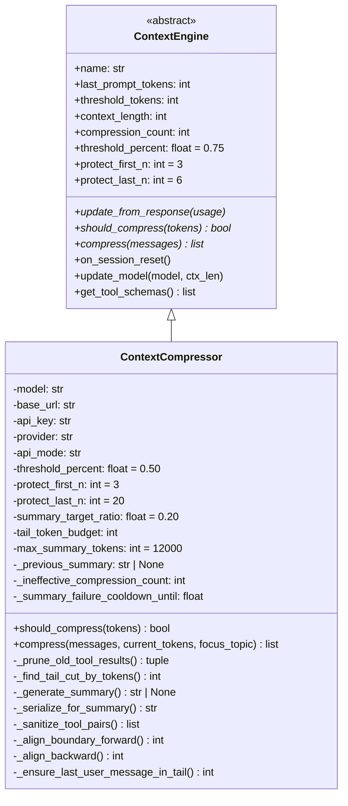
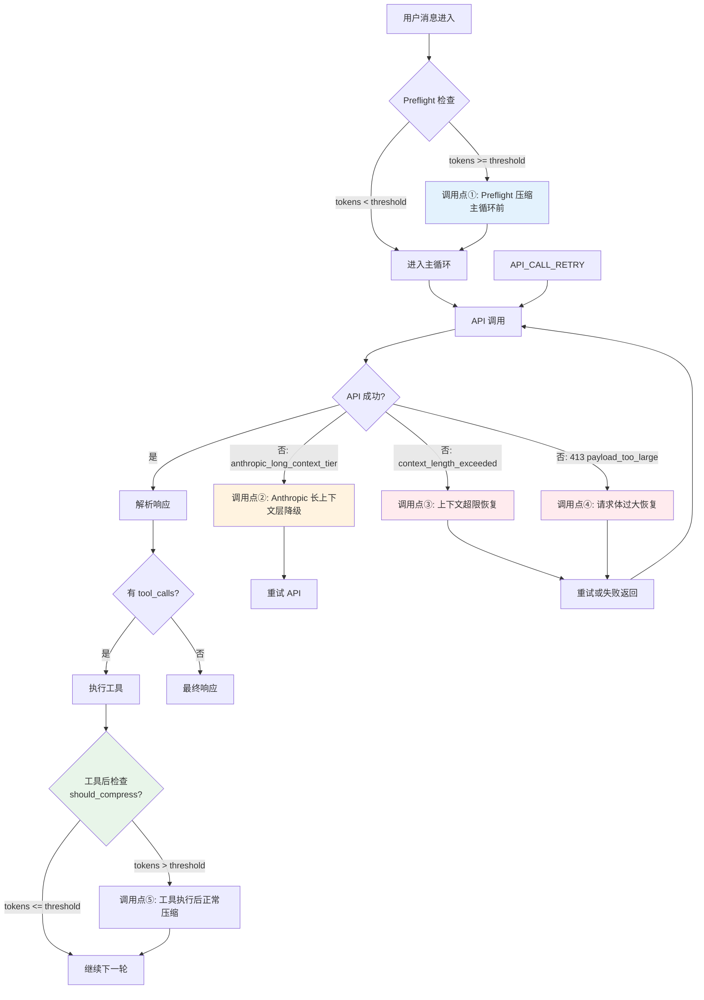
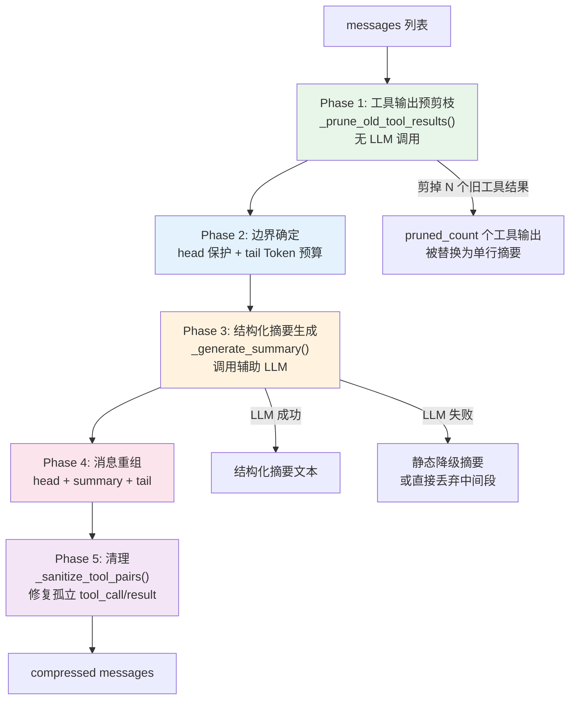
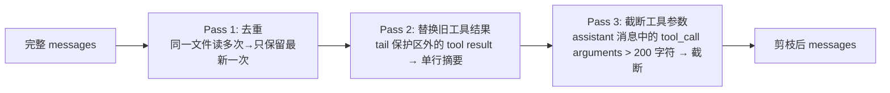
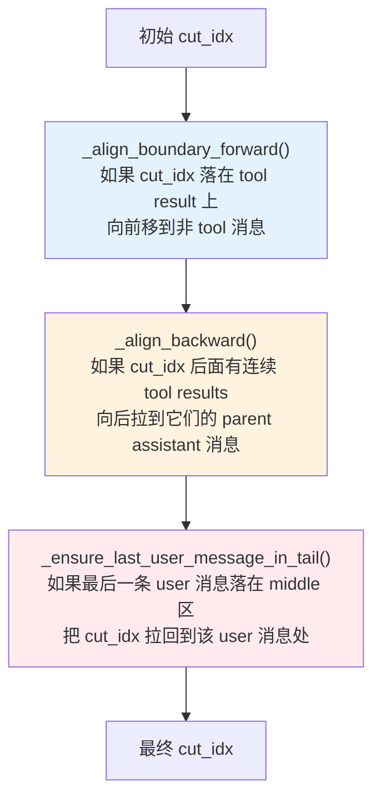
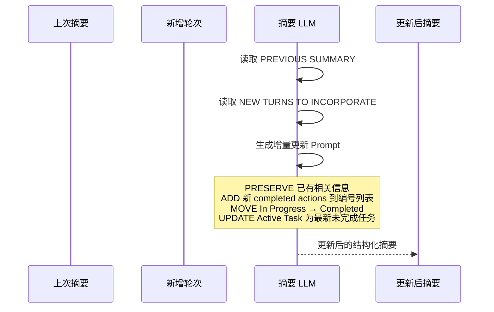
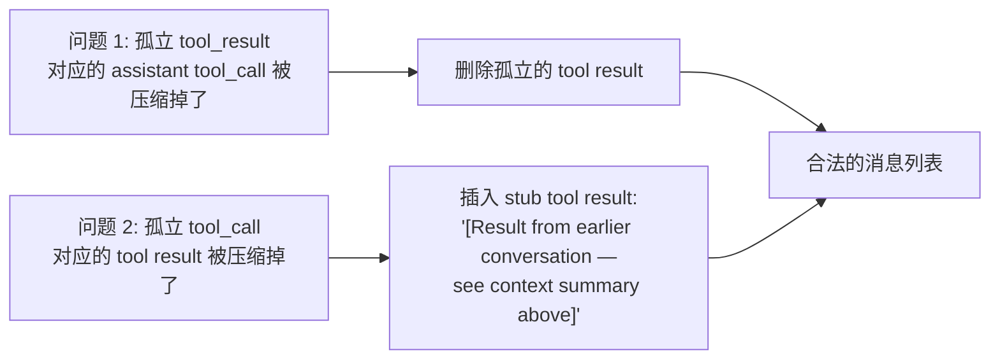
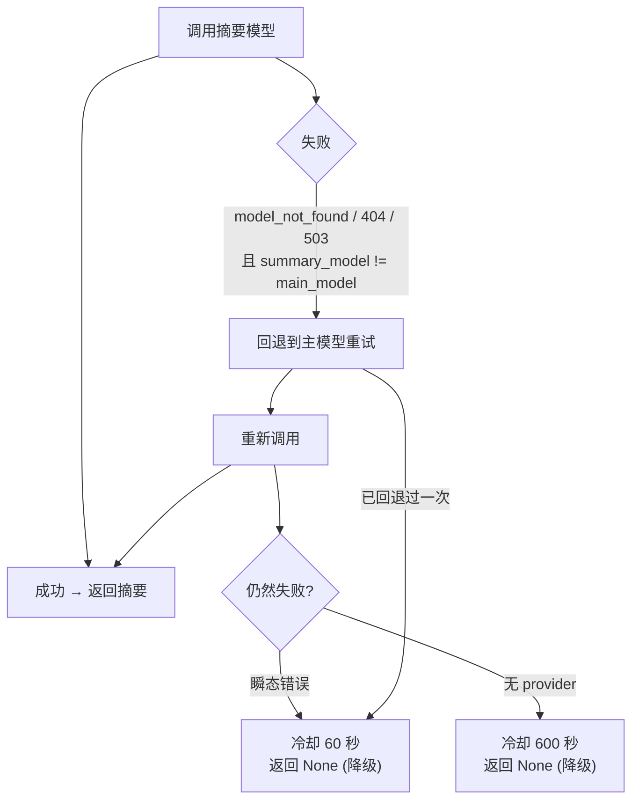
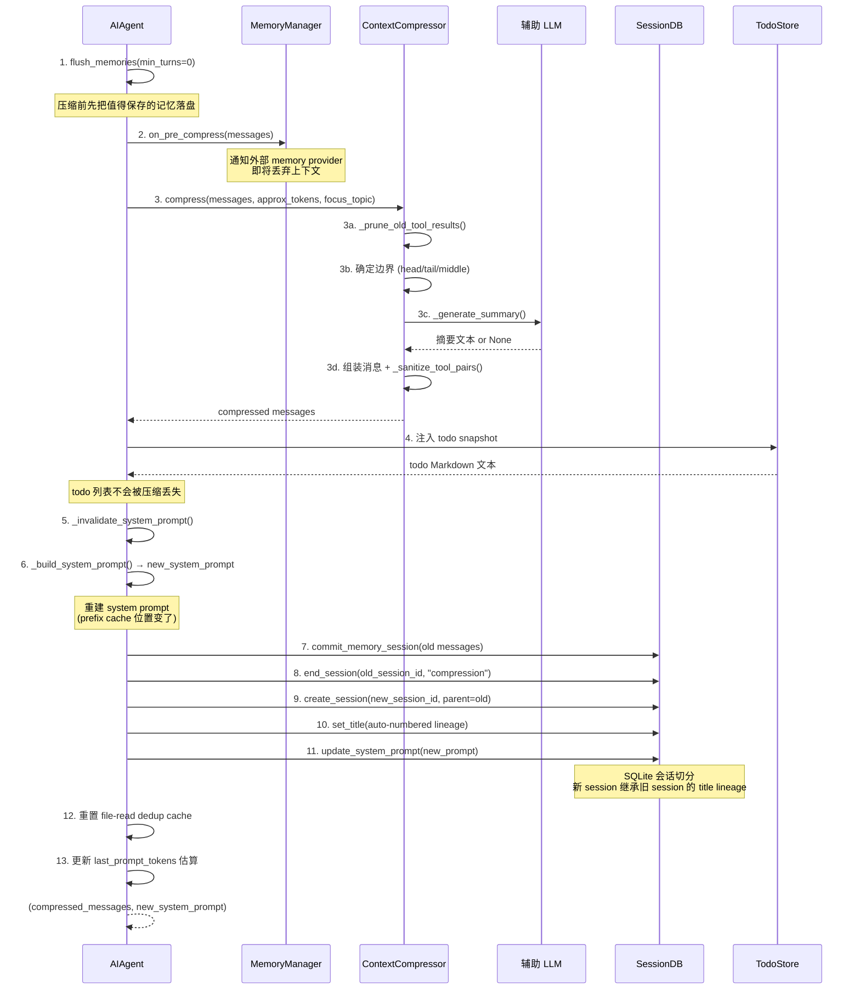
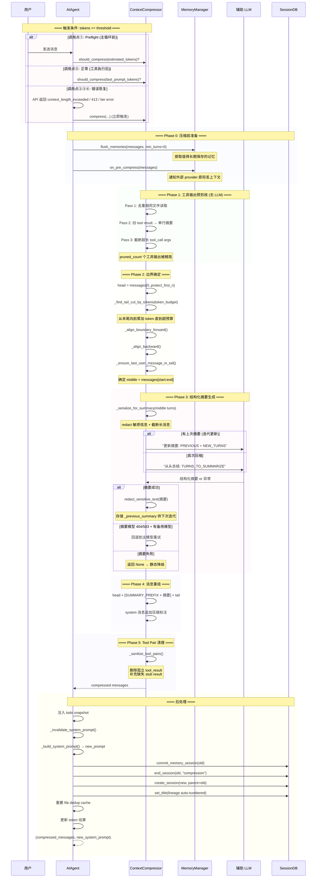

# Hermes 上下文压缩策略详解

> **核心文件**: [context_compressor.py](file:///Users/lixiangyang/Desktop/代码/hermes-agent-main/hermes-agent-main/agent/context_compressor.py)  
> **基类定义**: [ContextEngine](file:///Users/lixiangyang/Desktop/代码/hermes-agent-main/hermes-agent-main/agent/context_engine.py) (抽象基类，支持插件替换)  
> **调用入口**: [run_agent.py `_compress_context()`](file:///Users/lixiangyang/Desktop/代码/hermes-agent-main/hermes-agent-main/run_agent.py#L7519-L7638)  
> **辅助客户端**: [auxiliary_client.py `call_llm()`](file:///Users/lixiangyang/Desktop/代码/hermes-agent-main/hermes-agent-main/agent/auxiliary_client.py)

---

## 目录

1. [设计目标与核心思想](#1-设计目标与核心思想)
2. [架构总览](#2-架构总览)
3. [压缩触发机制 — 6 个调用点](#3-压缩触发机制--6-个调用点)
4. [五阶段压缩算法详解](#4-五阶段压缩算法详解)
5. [工具输出预剪枝（Phase 1）](#5-工具输出预剪枝phase-1)
6. [边界确定策略（Phase 2）](#6-边界确定策略phase-2)
7. [结构化摘要生成（Phase 3）](#7-结构化摘要生成phase-3)
8. [消息重组与清理（Phase 4 & 5）](#8-消息重组与清理phase-4--5)
9. [辅助模型选择与回退链](#9-辅助模型选择与回退链)
10. [反抖动与安全保护](#10-反抖动与安全保护)
11. [聚焦主题压缩（Focus Topic）](#11-聚焦主题压缩focus-topic)
12. [会话切分与持久化](#12-会话切分与持久化)
13. [配置参数一览](#13-配置参数一览)
14. [完整时序图](#14-完整时序图)

---

## 1. 设计目标与核心思想

### 1.1 问题背景

Hermes Agent 的对话是**多轮工具调用循环**：用户发一条消息 → 模型可能连续执行 10~90 轮工具调用 → 每轮都产生 assistant message + tool result。对于长任务（如大型重构、多文件调试），消息列表会迅速膨胀到超出模型的上下文窗口。

### 1.2 核心设计原则

| 原则 | 说明 |
|------|------|
| **有损但可控** | 压缩是有损的——中间轮次被 LLM 总结为摘要。但通过结构化模板和迭代更新最大化保留关键信息 |
| **头尾保护** | 系统提示（head）和最近上下文（tail）**永远不被压缩**，只压缩"中间段" |
| **先 flush 再压缩** | 压缩前先让 memory provider 提取有价值的信息，避免原始细节丢失 |
| **不阻塞主流程** | 压缩使用独立的**辅助模型**（便宜/快速），不影响主模型的推理质量 |
| **可恢复** | 压缩失败时优雅降级——丢弃中间轮次但不注入错误摘要 |
| **防抖动** | 连续多次压缩效果不佳时自动停止，避免无限压缩循环 |

### 1.3 与简单方案对比

```
简单聊天机器人:  滑动窗口 / 截断旧消息
                ↓ 缺点: 直接丢失信息

Hermes 方案:     结构化 LLM 摘要 + 迭代更新 + 头尾保护
                ↓ 优势: 保留决策过程、文件状态、待办事项等关键上下文
```

---

## 2. 架构总览



### 2.1 继承体系

`ContextEngine` 是抽象基类，定义了所有上下文引擎必须实现的接口。`ContextCompressor` 是内置实现。第三方引擎（如 LCM DAG 引擎）可以通过插件系统替换它：

```
config.yaml:
  context:
    engine: "compressor"   ← 默认（内置）
    # engine: "lcm"       ← 第三方插件
```

---

## 3. 压缩触发机制 — 6 个调用点

`run_agent.py` 中 `_compress_context()` 共被调用 **6 次**，分布在不同的场景中：

### 3.1 触发点总览



### 3.2 各调用点详情

| # | 调用位置 | 触发条件 | 场景说明 | 代码位置 |
|---|----------|----------|----------|----------|
| **①** | 主循环入口前 (Preflight) | `estimated_tokens >= threshold_tokens` | 会话历史很长，进入主循环前先压缩一轮 | [run_agent.py:8870](file:///Users/lixiangyang/Desktop/代码/hermes-agent-main/hermes-agent-main/run_agent.py#L8870) |
| **②** | API 错误恢复 (Anthropic) | Anthropic long-context tier 错误 | Anthropic 的 extended thinking 模式超出长上下文层级限制 | [run_agent.py:10381](file:///Users/lixiangyang/Desktop/代码/hermes-agent-main/hermes-agent-main/run_agent.py#L10381) |
| **③** | API 错误恢复 (通用) | `context_length_exceeded` 分类错误 | 模型返回 token 超限错误 | [run_agent.py:10615](file:///Users/lixiangyang/Desktop/代码/hermes-agent-main/hermes-agent-main/run_agent.py#L10615) |
| **④** | API 错误恢复 (413) | HTTP 413 Payload Too Large | 请求体过大（通常因消息过多） | [run_agent.py:10479](file:///Users/lixiangyang/Desktop/代码/hermes-agent-main/hermes-agent-main/run_agent.py#L10479) |
| **⑤** | 工具执行后 (正常路径) | `should_compress(last_prompt_tokens)` == True | 每轮工具执行后检查，最常见的触发方式 | [run_agent.py:11339](file:///Users/lixiangyang/Desktop/代码/hermes-agent-main/hermes-agent-main/run_agent.py#L11339) |

> **注意**: 调用点 ②③④ 属于**错误恢复路径**，最多重试 `max_compression_attempts`（默认 3 次）。调用点 ① 和 ⑤ 是**正常路径**。

---

## 4. 五阶段压缩算法详解

`ContextCompressor.compress()` 是核心入口，执行五阶段算法：



---

## 5. 工具输出预剪枝（Phase 1）

### 5.1 为什么需要预剪枝

工具调用的输出往往非常大：
- `read_file` 一个大文件 → 数万字符
- `terminal` 执行 `npm test` → 数千行输出
- `search_files` 全项目搜索 → 大量匹配内容

如果把这些原样送给摘要 LLM，会浪费大量 token 且降低摘要质量。

### 5.2 剪枝策略

**不是简单的 `[pruned]` 占位符**，而是生成**信息丰富的单行摘要**：

```python
def _summarize_tool_result(tool_name, tool_args, tool_content) -> str:
```

| 工具类型 | 摘要示例 |
|----------|----------|
| `terminal` | `[terminal] ran \`npm test\` -> exit 0, 47 lines output` |
| `read_file` | `[read_file] read config.py from line 1 (1,200 chars)` |
| `write_file` | `[write_file] wrote to auth.py (45 lines)` |
| `patch` | `[patch] replace in user.py (3,400 chars result)` |
| `search_files` | `[search_files] content search for 'compress' in agent/ -> 12 matches` |
| `execute_code` | `[execute_code] \`print("hello")\` (5 lines output)` |
| `delegate_task` | `[delegate_task] '重构认证模块' (2,100 chars result)` |
| `memory` | `[memory] add on preferences` |

### 5.3 三步预处理流程



#### Pass 1: 去重

当同一个文件被 `read_file` 读取了 5 次，只保留**最新一次的完整内容**，旧的替换为回引：

```
[read_file] config.py was read again — see latest result above
```

#### Pass 2: 替换旧工具结果

从消息末尾向前遍历，**跳过 tail 保护区**内的消息。保护区外的每个 `tool` role 消息的内容被替换为 `_summarize_tool_result()` 生成的单行摘要。

#### Pass 3: 截断工具参数

`assistant` 消息中的 `tool_call[].function.arguments` 如果超过 200 字符，会被截断（保持 JSON 合法性）：

```python
# 截断前: {"path": "/very/long/path/to/some/file.py", "content": "# very long markdown..."}
# 截断后: {"path": "/very/long/path/to/some/file.py", "content": "# very long mark...[truncated]"}
```

> **关键细节**: 使用 JSON 解析后递归截断字符串叶子节点再重新序列化，而不是盲目切片——避免产生非法 JSON（issue #11762）。

---

## 6. 边界确定策略（Phase 2）

### 6.1 三区域划分

```
messages[0..N]:
┌─────────────────────────────────────────────────────┐
│  HEAD (保护)          │  MIDDLE (压缩)    │ TAIL (保护) │
│  ─────────            │  ────────────     │  ─────────  │
│  system prompt        │  turn K           │  turn M     │
│  user msg 1           │  turn K+1         │  ...        │
│  assistant msg 1      │  ...              │  user msg   │
│  (前 protect_first_n │                    │  (Token预算) │
│   条消息)              │                    │             │
└─────────────────────────────────────────────────────┘
↑ compress_start=0      ↑ compress_start      ↑ compress_end
(固定)                  (_align_forward)     (_find_tail_cut_by_tokens)
```

### 6.2 Head 保护

固定保护前 `protect_first_n`（默认 **3**）条消息。通常是：
- `messages[0]`: system prompt
- `messages[1]`: 第一条 user 消息
- `messages[2]`: 第一条 assistant 回复

### 6.3 Tail 保护 — Token 预算模式（v3 改进）

旧版本使用**固定消息数**保护尾部（如最后 20 条），但这不合理——有些消息只有几个字符，有些有几万字符。

v3 改为 **Token 预算模式**：

```python
def _find_tail_cut_by_tokens(messages, head_end, token_budget=None):
    """从末尾向前累加 token，直到超过预算"""
```

**算法**:

1. 从 `messages` 末尾向前遍历
2. 累加每条消息的估算 token 数（`len(content) // 4 + 10`）
3. 当累计超过 `soft_ceiling = token_budget * 1.5` 时停止
4. **硬性最低保护**: 至少保留 3 条消息在 tail
5. **对齐修正**: 不在 tool_call/result 组中间切割
6. **用户消息锚定**: 最后一条 user 消息必须在 tail 内（修复 bug #10896）

**Tail 预算计算**:

```
tail_token_budget = threshold_tokens * summary_target_ratio
                   = (context_length * 0.50) * 0.20
                   ≈ context_length * 0.10

例如: 200K 上下文 → threshold=100K → tail_budget≈20K tokens
```

### 6.4 边界对齐规则



这三条对齐规则确保：
- 压缩不会从一组 tool_call/result 的**中间**开始
- 压缩不会丢失用户的**最新指令**
- API 收到的消息列表始终是**合法的**

---

## 7. 结构化摘要生成（Phase 3）

### 7.1 序列化

中间段消息先被序列化为纯文本，供摘要 LLM 消费：

```python
def _serialize_for_summary(self, turns) -> str:
```

**处理规则**:

| 角色 | 格式 | 截断限制 |
|------|------|----------|
| `user` | `[USER]: {content}` | 每条消息最多 6000 字符（头 4000 + 尾 1500） |
| `assistant` | `[ASSISTANT]: {content}\n[Tool calls:\n  name(args)\n]` | 同上 + tool call 参数最多 1500 字符 |
| `tool` | `[TOOL RESULT {id}]: {content}` | 同上 |

**所有内容经过 `redact_sensitive_text()` 处理**，防止 API key / password 泄露到摘要中。

### 7.2 摘要 Prompt 结构

使用**结构化模板**，包含以下字段：

```
## Active Task              ← 最重要！用户最新的未完成任务（逐字复制）
## Goal                     ← 用户总体目标
## Constraints & Preferences ← 用户偏好/约束
## Completed Actions        ← 编号列表: N. ACTION target — outcome [tool: name]
## Active State             ← 当前工作状态（目录/分支/文件/测试/进程）
## In Progress              ← 压缩时刻正在进行的工作
## Blocked                  ← 未解决的阻碍和精确错误信息
## Key Decisions            ← 重要技术决策及其原因
## Resolved Questions       ← 已回答的问题及答案
## Pending User Asks        ← 用户未满足的请求
## Relevant Files           ← 读/改/创建的文件清单
## Remaining Work           ← 待完成工作（作为上下文而非指令）
## Critical Context          ← 不能丢失的具体值/配置/数据
```

### 7.3 关键设计决策

#### (a) "Do Not Respond" 前言

```
You are a summarization agent creating a context checkpoint.
Your output will be injected as reference material for a DIFFERENT assistant.
Do NOT respond to any questions or requests in the conversation.
```

来源: OpenCode 项目。防止摘要 LLM "帮忙回答"用户之前的问题。

#### (b) Handoff Framing

```
This is a handoff from a previous context window — 
treat it as background reference, NOT as active instructions.
```

来源: Codex 项目。告诉下一个助手这是**参考材料**而非**当前指令**。

#### (c) "Remaining Work" 而非 "Next Steps"

避免下一个模型把 "Next Steps" 当作**需要执行的指令**来执行，造成重复操作。

#### (d) 语言一致性

```
Write the summary in the same language the user was using in the conversation.
```

### 7.4 迭代式摘要更新

第二次及以后的压缩**不是从头总结**，而是基于上次摘要做增量更新：



**好处**: 多次压缩后仍能保留早期的重要决策和上下文，不会因为每次都从零开始而丢失信息。

### 7.5 摘要 Budget 计算

```python
def _compute_summary_budget(self, turns_to_summarize) -> int:
    content_tokens = estimate_messages_tokens_rough(turns_to_summarize)
    budget = int(content_tokens * _SUMMARY_RATIO)  # _SUMMARY_RATIO = 0.20
    return max(_MIN_SUMMARY_TOKENS, min(budget, _SUMMARY_TOKENS_CEILING))
    # _MIN_SUMMARY_TOKENS = 2000
    # _SUMMARY_TOKENS_CEILING = 12000
```

即：摘要 token 数 = 被压缩内容的 **20%**，范围 **2000 ~ 12000 tokens**。

---

## 8. 消息重组与清理（Phase 4 & 5）

### 8.4 Phase 4: 组装压缩后的消息列表

```
压缩前: [sys][u1][a1][t1][u2][a2][t2][t3][u3][a3][t4][u4][a4][t5][u5]
                        ↑ start                       ↑ end
压缩后: [sys'][u1][a1][ SUMMARY_TEXT ][u4][a4][t4][u5]
         ↑ head   ↑        ↑ middle (summary)  ↑   tail
```

具体操作：
1. **Head 区域**原样保留，system 消息追加压缩标注
2. **Middle 区域**替换为一条 user 消息，内容 = `SUMMARY_PREFIX + 摘要文本`
3. **Tail 区域**原样保留

**System 消息标注**:

```
[Note: Some earlier conversation turns have been compacted into a handoff 
summary to preserve context space. The current session state may still 
reflect earlier work, so build on that summary and state rather than 
re-doing work.]
```

**摘要前缀 (SUMMARY_PREFIX)**:

```
[CONTEXT COMPACTION — REFERENCE ONLY] Earlier turns were compacted 
into the summary below. This is a handoff from a previous context 
window — treat it as background reference, NOT as active instructions. 
Do NOT answer questions or fulfill requests mentioned in this summary; 
they were already addressed. Your current task is identified in the 
'## Active Task' section of the summary — resume exactly from there. 
Respond ONLY to the latest user message that appears AFTER this summary.
```

### 8.5 Phase 5: Tool Pair 清理 (`_sanitize_tool_pairs`)

压缩可能导致 **tool_call / tool_result 配对断裂**：



如果不修复这两种情况，API 会返回错误：
- `"No tool call found for function call output with call_id ..."`
- `"Every tool_call must be followed by a matching tool result"`

---

## 9. 辅助模型选择与回退链

压缩使用的 LLM 不是主模型，而是**独立配置的辅助模型**（更便宜、更快）。

### 9.1 解析优先级

`call_llm()` 在 `auxiliary_client.py` 中的解析顺序（text 任务）：

| 优先级 | Provider | 默认模型 | 说明 |
|--------|----------|----------|------|
| 1 | OpenRouter | `google/gemini-3-flash-preview` | 聚合路由 |
| 2 | Nous Portal | `google/gemini-3-flash-preview` | Nous 推理服务 |
| 3 | Custom Endpoint | 用户配置 | `config.yaml model.base_url` |
| 4 | Codex OAuth | `gpt-5.2-codex` | ChatGPT Responses API |
| 5 | Native Anthropic | `claude-haiku-4-5` | 官方 Anthropic |
| 6 | Direct API Key providers | 见下表 | 按 provider 选择 |
| 7 | None | — | 无可用 provider |

**Direct Provider 默认辅助模型**:

| Provider | 默认辅助模型 |
|----------|-------------|
| Gemini | `gemini-3-flash-preview` |
| GLM (智谱) | `glm-4.5-flash` |
| Kimi/Moonshot | `kimi-k2-turbo-preview` |
| MiniMax | `MiniMax-M2.7` |
| Anthropic | `claude-haiku-4-5-20251001` |

### 9.2 可覆盖配置

```yaml
# config.yaml
auxiliary:
  compression:
    model: "gpt-4o-mini"          # 自定义压缩模型
    provider: "openrouter"        # 或指定 provider
    context_length: 128000        # 覆盖模型上下文长度
```

### 9.3 摘要模型回退

当专用摘要模型不可用时（404/503），自动回退到**主模型**：



---

## 10. 反抖动与安全保护

### 10.1 Anti-Thrashing（反抖动）

```python
def should_compress(self, prompt_tokens=None) -> bool:
    if tokens < self.threshold_tokens:
        return False
    if self._ineffective_compression_count >= 2:
        return False  # 连续两次压缩效果差 → 跳过
    return True
```

**判定标准**: 如果一次压缩节省的 token **不足 10%**，计为"无效压缩"。连续 **2 次**无效后暂停压缩。

**原因**: 某些场景下（如大量小消息），每轮压缩只能删掉 1-2 条消息，形成无限循环。

### 10.2 失败冷却

| 错误类型 | 冷却时间 | 行为 |
|----------|----------|------|
| 无可用 provider | 600 秒 (10 分钟) | 中间段直接丢弃，不注入摘要 |
| 瞬态错误 (超时/限流) | 60 秒 | 下次尝试前等待 |
| 模型不存在 (404/503) | 不冷却 | 立即回退到主模型重试 |

### 10.3 敏感信息脱敏

两层防护：
1. **序列化前**: `redact_sensitive_text()` 处理每条消息内容
2. **摘要后**: 对 LLM 输出的摘要再次 `redact_sensitive_text()`（防止 LLM 忽略指令回显密钥）

---

## 11. 聚焦主题压缩（Focus Topic）

灵感来自 Claude Code 的 `/compact <focus>` 命令。

### 11.1 用法

```python
# 通过 /compress <topic> 命令手动触发
messages, new_prompt = self._compress_context(
    messages, system_message,
    focus_topic="authentication module refactor"
)
```

### 11.2 效果

摘要 Prompt 末尾追加：

```
FOCUS TOPIC: "authentication module refactor"
The user has requested that this compaction PRIORITISE preserving all 
information related to the focus topic above. For content related to 
"authentication module refactor", include full detail — exact values, 
file paths, command outputs, error messages, and decisions. For content 
NOT related to the focus topic, summarise more aggressively (brief 
one-liners or omit if truly irrelevant). The focus topic sections should 
receive roughly 60-70% of the summary token budget.
```

### 11.3 典型场景

用户在一个长会话中完成了多个任务，现在想专注于其中一个继续深入：

```
用户: /compress JWT authentication
效果: 与 JWT/auth 相关的细节完整保留（文件路径、错误信息、决策原因）
      其他任务（如 UI 调整、日志配置）被激进压缩为一行概括
```

---

## 12. 会话切分与持久化

### 12.1 `_compress_context()` 完整流程

[`run_agent.py:_compress_context()`](file:///Users/lixiangyang/Desktop/代码/hermes-agent-main/hermes-agent-main/run_agent.py#L7519-L7638) 不仅调用压缩器，还负责完整的生命周期管理：



### 12.2 为什么要在压缩前 flush memories

这是一个关键设计决策：

```
时间线:
  t1: 用户说 "记住我喜欢用 JWT 认证"
  t2: agent 调用 memory add → 写入 MEMORY.md
  t3...tN: 大量工具调用 → 上下文膨胀
  tN+1: 触发压缩 → 中间段（含 t2 的 memory 调用结果）被总结
  
如果不在压缩前 flush:
  → t2 的 memory add 结果被 LLM 总结为 "[memory] add on preferences"
  → 具体的 "JWT 认证" 偏好细节丢失
  
如果在压缩前 flush:
  → memory provider 已经把 "JWT 认证偏好" 持久化了
  → 即使摘要丢失细节，MEMORY.md 里还有完整记录
```

### 12.3 Session Lineage（会话谱系）

压缩时会创建一个新的 SQLite session，并记录父子关系：

```
Session A (original)
  ├── title: "Refactor auth module"
  ├── messages: [sys][u1][a1]...[u50][a50]  (压缩前的完整历史)
  └── status: ended (compression)

Session B (child, auto-created by compression)
  ├── parent_session_id: A
  ├── title: "Refactor auth module (2)"  (自动编号)
  ├── messages: [sys'][u1][a1][SUMMARY][u48][a48][u50]  (压缩后)
  └── status: active
```

---

## 13. 配置参数一览

### 13.1 config.yaml 配置项

```yaml
compression:
  enabled: true                    # 是否启用自动压缩
  threshold: 0.50                  # 触发阈值 (占上下文窗口比例), 默认 50%
  target_ratio: 0.20               # 摘要预算比例 (相对阈值), 默认 20%
  protect_last_n: 20               # tail 保护最小消息数 (兼容旧版)
  # model: ""                      # 覆盖压缩模型 (留空=自动选择)

auxiliary:
  compression:
    model: ""                      # 覆盖辅助压缩模型
    provider: ""                   # 覆盖辅助压缩 provider
    context_length: null            # 覆盖辅助模型上下文长度

context:
  engine: "compressor"             # 上下文引擎选择
```

### 13.2 内部常量

| 常量 | 值 | 说明 |
|------|-----|------|
| `_SUMMARY_RATIO` | 0.20 | 摘要预算占被压缩内容的比例 |
| `_MIN_SUMMARY_TOKENS` | 2000 | 摘要最低 token 数 |
| `_SUMMARY_TOKENS_CEILING` | 12000 | 摘要最高 token 数 |
| `_CHARS_PER_TOKEN` | 4 | 粗略估算: 1 token ≈ 4 字符 |
| `_CONTENT_MAX` | 6000 | 摘要输入中每条消息最大字符数 |
| `_CONTENT_HEAD` | 4000 | 消息头部保留字符数 |
| `_CONTENT_TAIL` | 1500 | 消息尾部保留字符数 |
| `_TOOL_ARGS_MAX` | 1500 | tool call 参数最大字符数 |
| `_PRUNED_TOOL_PLACEHOLDER` | `[Old tool output cleared...]` | 降级占位符 |
| `_SUMMARY_FAILURE_COOLDOWN_SECONDS` | 600 | 无 provider 时冷却秒数 |
| `threshold_percent` (默认) | 0.50 | 压缩阈值 = 上下文长度 × 50% |
| `protect_first_n` (默认) | 3 | head 保护消息数 |
| `protect_last_n` (默认) | 20 | tail 保护最小消息数 |
| `summary_target_ratio` (默认) | 0.20 | tail token 预算比例 |
| `max_summary_tokens` (上限) | min(ctx×0.05, 12000) | 摘要绝对上限 |

### 13.3 参数影响示意

假设主模型上下文窗口为 **200K tokens**：

| 参数 | 值 | 结果 |
|------|-----|------|
| `threshold_percent` | 0.50 | **100K tokens** 时触发压缩 |
| `summary_target_ratio` | 0.20 | tail 保护约 **20K tokens** |
| `max_summary_tokens` | min(200K×0.05, 12K) = **12K** | 摘要最长 12K tokens |
| `_SUMMARY_RATIO` | 0.20 | 若压缩 80K tokens 内容 → 摘要预算 **16K** → 上限封顶 **12K** |

---

## 14. 完整时序图



---

## 附录: 常见问题

### Q1: 压缩会影响模型质量吗？

会有一定损失，但通过以下手段最小化：
- 结构化模板保留了**决策原因**而不仅是结论
- 迭代更新避免了多轮压缩的信息累积损失
- 头尾保护确保**系统指令**和**最新上下文**完整保留

### Q2: 压缩后为什么需要重建 system prompt？

因为压缩改变了消息列表中首条消息的位置，Anthropic 等 provider 的 **prefix cache** 基于 token 位置命中。重建确保缓存一致性。

### Q3: 可以手动触发压缩吗？

可以。通过 `/compress [topic]` 命令手动触发，支持可选的聚焦主题。

### Q4: 压缩和 memory 系统的关系？

它们互补：
- **Memory** (MEMORY.md): 长期、跨会话的持久记忆（用户偏好、项目知识）
- **Compression**: 会话内的中期上下文管理（本轮任务的中间状态）

压缩前会先 flush memory，确保重要信息已经落盘。
