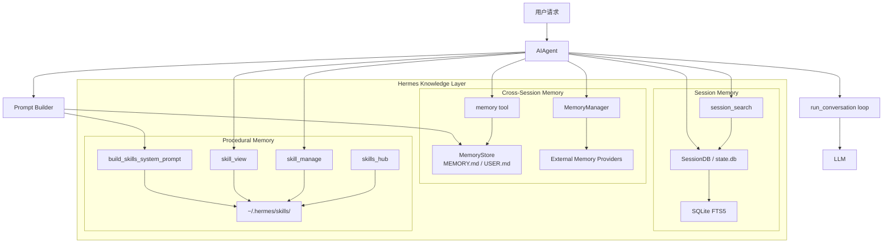
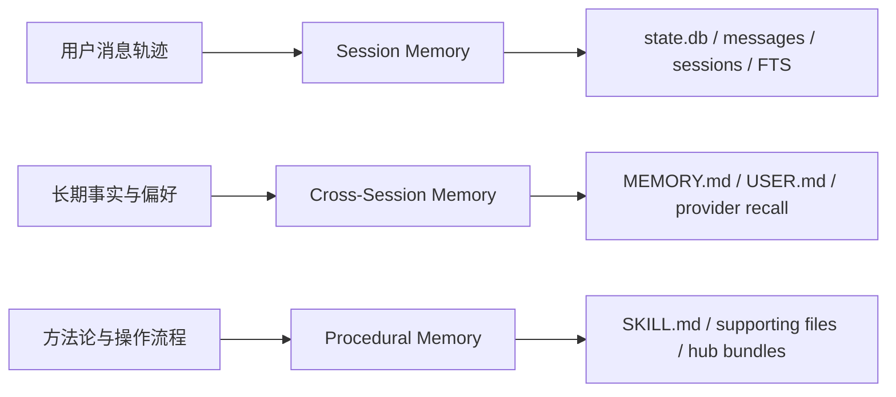
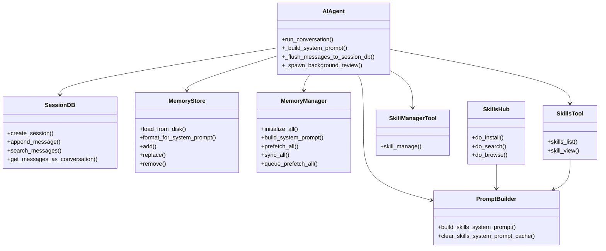
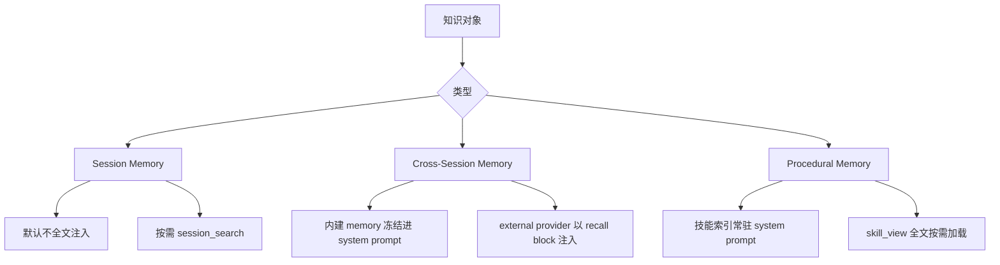
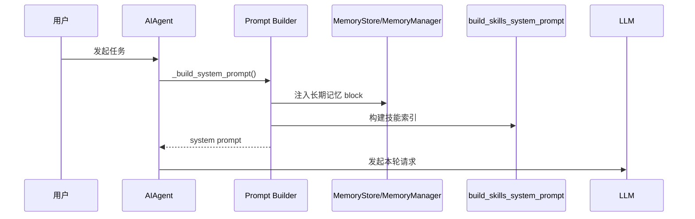
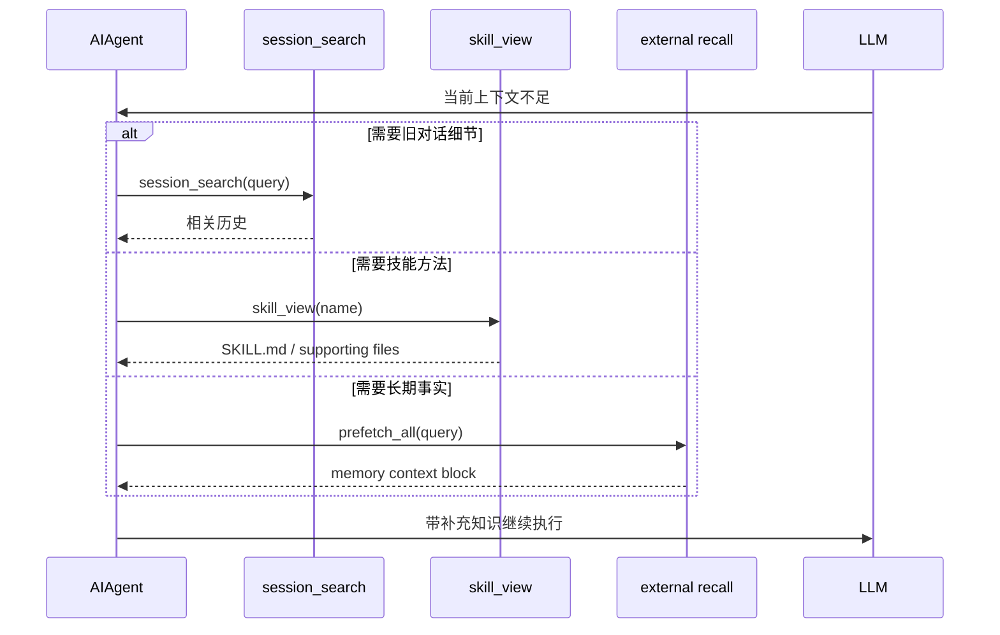
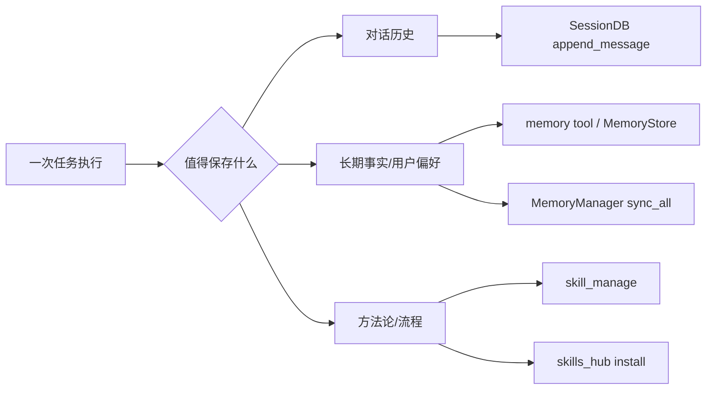
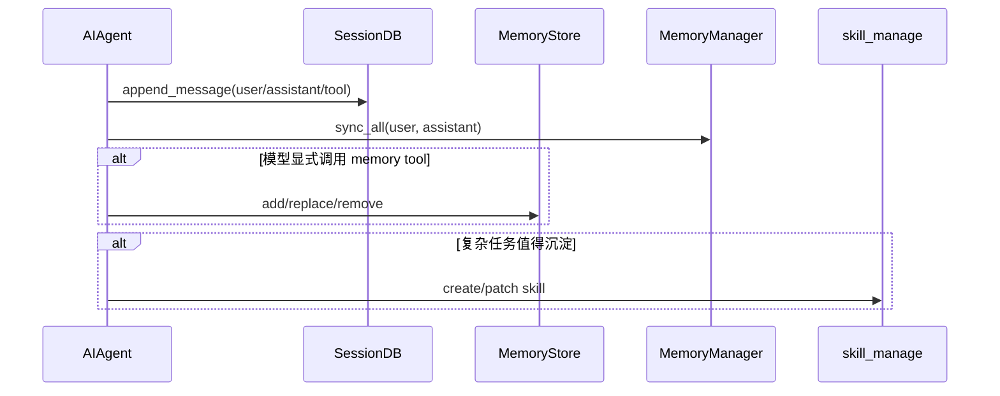
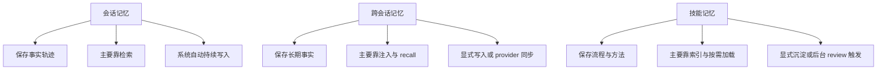
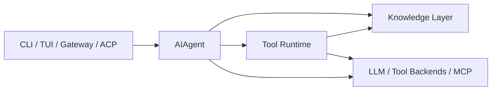

# Hermes Agent 知识层总图与职责分析

## 1. 这份文档的定位

前面的两份专题文档分别解决了：

- 三层持久记忆如何工作
- 自生成技能与轻量快装如何成立

这份文档再往上提一层，从“知识层”的角度统一看 Hermes：

- 会话记忆
- 跨会话记忆
- 技能记忆
- 它们与 `AIAgent`、`Prompt Builder`、`SessionDB`、`MemoryManager`、`skill tools` 的关系

目标是让你回答两个问题：

1. Hermes 的“知识”到底被拆成了哪几类对象？
2. 每一类知识在什么时候被读取、什么时候被写回、什么时候只做索引而不做全文注入？

---

## 2. 一句话结论

Hermes 的知识层不是一个“统一大记忆池”，而是一个分层知识运行时：

- 会话记忆：保存完整历史，按需检索
- 跨会话记忆：保存长期事实，低频更新、高频辅助
- 技能记忆：保存程序性方法，索引常驻、正文按需、支持自演化

真正重要的不只是“它们分别存在”，而是：

> Hermes 把 transcript、facts、procedures 三类知识拆开了，并且给每类知识设计了不同的注入时机、回写时机和 token 成本模型。

---

## 3. 知识层总架构图

---

## 4. 知识对象分层图

这张图不是按模块分，而是按“知识对象类型”分。

## 4.1 这张图的含义

- `Session Memory` 对应“发生过什么”
- `Cross-Session Memory` 对应“长期应该记住什么”
- `Procedural Memory` 对应“遇到类似任务该怎么做”

这三类知识看起来都叫“记忆”，但它们的工程处理方式完全不同。

---

## 5. 职责图

## 5.1 知识层职责图

## 5.2 职责解释

- `AIAgent`
  - 是知识层的总编排者，不是真正的知识存储者
- `SessionDB`
  - 是历史轨迹仓库
- `MemoryStore`
  - 是内建长期事实仓库
- `MemoryManager`
  - 是外部长期记忆协调器
- `PromptBuilder`
  - 是“把哪些知识放进 prompt”这件事的控制器
- `SkillsTool`
  - 是程序性知识读取器
- `SkillManagerTool`
  - 是程序性知识写入器
- `SkillsHub`
  - 是外部知识导入器

---

## 6. 知识注入策略图

这张图是理解 Hermes 的关键。

不是所有知识都会以同样方式进入模型上下文。

## 6.1 为什么这个策略重要

- 如果把会话记忆全文塞进 prompt，会爆 context
- 如果把所有技能全文塞进 prompt，会爆 token
- 如果把长期事实完全按需查，又会损失稳定个性和长期偏好

Hermes 的平衡方式是：

- 历史消息：默认不注入，只在需要时检索
- 长期事实：稳定部分放进系统提示，动态部分做 recall
- 技能方法：索引常驻，正文按需

---

## 7. 知识读路径图

## 7.1 用户任务开始时

## 7.2 模型需要更多知识时

## 7.3 读路径观察

- 会话记忆偏“搜索式读取”
- 跨会话记忆偏“预加载 + recall”
- 技能记忆偏“目录发现 + 正文按需”

---

## 8. 知识写路径图

## 8.1 总写路径

## 8.2 时序图：任务完成后的写回分工

## 8.3 写路径观察

- 会话历史几乎总会落 `SessionDB`
- 长期事实只有在明确被抽象出来时才进跨会话记忆
- 方法论只有在确认可复用时才进技能记忆

这说明 Hermes 在写回侧也做了“知识分层”，不是把一切都堆进一个地方。

---

## 9. 为什么说技能是“知识层的特殊成员”

技能既像记忆，又不像普通记忆。

## 9.1 对比图

## 9.2 解释

技能是知识层里最接近“可编程知识包”的对象，因为它同时具备：

- 结构化 frontmatter
- supporting files
- 条件显示
- setup-on-load
- 自生成与自修补
- 外部 Hub 安装

从这个角度看，技能不是普通记忆，而是“知识层里的轻量插件单元”。

---

## 10. 知识层与总架构的连接图

## 10.1 这张图想表达什么

- 知识层不是工具层的附属
- 知识层也不是入口层的附属
- 它是 `AIAgent` 运行时中的独立支撑层

这也是为什么总架构图里应该单独保留 `Persistent Knowledge Layer`。

---

## 11. 推荐阅读路径

如果你想把“知识层”一次读通，推荐按这个顺序：

1. [hermes-knowledge-layer-analysis.md](file:///Users/lixiangyang/Desktop/代码/hermes-agent-main/hermes-agent-main/docs/hermes-knowledge-layer-analysis.md)
2. [hermes-memory-architecture-analysis.md](file:///Users/lixiangyang/Desktop/代码/hermes-agent-main/hermes-agent-main/docs/hermes-memory-architecture-analysis.md)
3. [hermes-skills-self-generation-and-fast-install.md](file:///Users/lixiangyang/Desktop/代码/hermes-agent-main/hermes-agent-main/docs/hermes-skills-self-generation-and-fast-install.md)
4. [hermes-skills-callchain-index.md](file:///Users/lixiangyang/Desktop/代码/hermes-agent-main/hermes-agent-main/docs/hermes-skills-callchain-index.md)
5. [hermes-agent-architecture-analysis.md](file:///Users/lixiangyang/Desktop/代码/hermes-agent-main/hermes-agent-main/docs/hermes-agent-architecture-analysis.md)

---

## 12. 最后总结

如果只从“agent 会不会调用工具”来理解 Hermes，会错过它最有意思的一层。

Hermes 的真正工程亮点之一，是它把知识层拆成了：

- 可回放的历史
- 可长期保留的事实
- 可复用的做法

并且针对三类知识，分别设计了不同的：

- 存储介质
- 注入时机
- 检索方式
- 回写路径
- 成本控制策略

这也是 Hermes 相比很多“只会把上下文越堆越长”的 agent 系统，更容易长期演进的原因。
