# Hermes Agent 三层持久记忆分析

## 1. 分析目标

本文聚焦 Hermes Agent 的“三层持久记忆”：

- 会话记忆：当前/历史会话消息如何被持久化、恢复和检索
- 跨会话记忆：哪些事实会跨 session 被保留，何时注入 prompt，何时回写
- 技能记忆：如何把“做事方法”沉淀为可复用技能，以及何时仅索引、何时完整加载

本文同时会：

- 先用 Mermaid 图画出三层记忆的架构、时序和数据流
- 再按模块说明它们之间的逻辑关系
- 最后复核之前总架构图里的记忆相关逻辑是否有偏差，给出修改建议

---

## 2. 先给结论

Hermes 的“记忆”不是一个单一系统，而是三条并行但互补的持久化链路：

1. 会话记忆：`SessionDB(state.db)` 保存完整对话历史，偏“事实回放”和“检索召回”
2. 跨会话记忆：`MEMORY.md / USER.md` 加上可选 `MemoryProvider`，偏“长期事实与用户画像”
3. 技能记忆：`~/.hermes/skills/` 中的 `SKILL.md` 与配套文件，偏“程序性知识 / 操作方法”

这三者的定位不同：

- 会话记忆回答“我们以前聊过什么”
- 跨会话记忆回答“系统长期应该记住什么”
- 技能记忆回答“以后遇到类似任务应该怎么做”

---

## 3. 三层记忆总览图

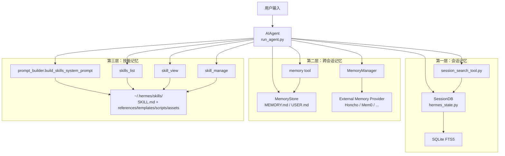

---

## 4. 三层记忆的职责边界

| 层级 | 存储介质 | 核心模块 | 触发方式 | 主要用途 | 是否自动注入当前上下文 |
|---|---|---|---|---|---|
| 会话记忆 | `~/.hermes/state.db` | `SessionDB`、`session_search_tool.py` | 每轮对话自动写入；需要时搜索 | 保存完整对话与工具调用历史 | 否，按需通过 `session_search` 检索 |
| 跨会话记忆 | `~/.hermes/memories/MEMORY.md`、`USER.md`；可选外部 provider | `MemoryStore`、`memory_tool.py`、`MemoryManager` | session 启动加载；中途用 `memory` 工具写入；回合后同步 provider | 长期事实、用户偏好、环境知识 | 是，内建 memory 在 session 开始时注入；外部 provider 可按 turn prefetch |
| 技能记忆 | `~/.hermes/skills/` | `prompt_builder.py`、`skills_tool.py`、`skill_manager_tool.py` | 启动时生成技能索引；使用时 `skill_view`；沉淀时 `skill_manage` | 把方法论、流程、模板保存为程序性知识 | 部分自动注入：只注入技能索引；全文按需加载 |

---

## 5. 第一层：会话记忆

## 5.1 架构图

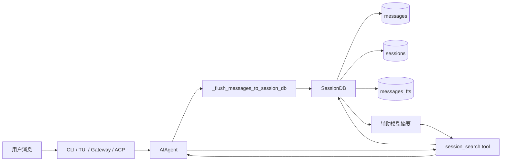

## 5.2 时序图

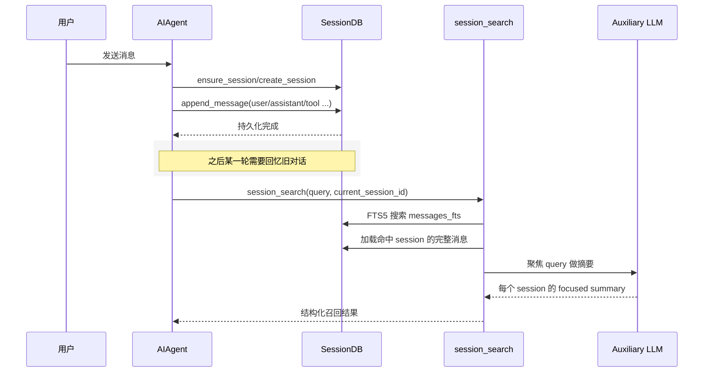

## 5.3 数据流图

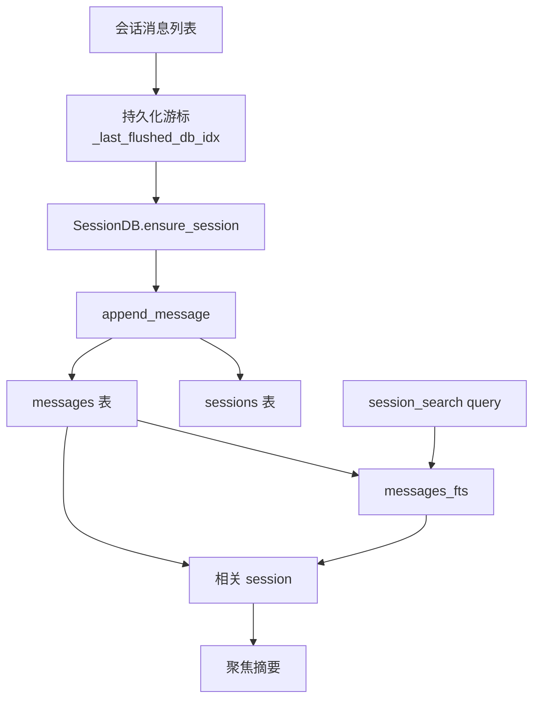

## 5.4 逻辑说明

### 关键模块

- `hermes_state.py`
- `run_agent.py`
- `tools/session_search_tool.py`

### 初始化

- `AIAgent.__init__()` 如果拿到了 `session_db`，会先调用 `create_session(...)`
- 失败也不会禁用 session 能力，后续 `_flush_messages_to_session_db()` 会通过 `ensure_session(...)` 兜底

### 写入逻辑

- 每轮对话结束或中途需要持久化时，`run_agent.py` 会调用 `_flush_messages_to_session_db(...)`
- 它使用 `_last_flushed_db_idx` 防止重复写入
- 每条 `user / assistant / tool` 消息都会写入 `messages`
- `sessions` 表同步维护 `message_count`、`tool_call_count`、token/cost 等聚合信息
- `messages_fts` 通过 SQLite trigger 自动维护全文索引

### 读取逻辑

- 普通恢复：通过 `SessionDB.get_messages_as_conversation(...)` 把历史消息恢复成对话格式
- 记忆召回：通过 `session_search(...)`
  - 先搜 `messages_fts`
  - 再按 session 聚合
  - 再把相关会话发给辅助模型做“面向 query 的摘要”

### 设计意图

- 会话记忆不是直接塞进每一轮上下文，而是做“按需回放”
- 这样可以保存无限增长的历史，同时避免把大段旧会话永久占满主模型上下文

### 这一层的本质

- 这是“可检索历史”
- 不是“始终在脑海里的长期事实”

---

## 6. 第二层：跨会话记忆

这一层又分成两部分：

- 内建跨会话记忆：`MEMORY.md + USER.md`
- 外部 memory provider：Honcho / Mem0 / Hindsight 等插件

需要特别注意：**当前代码里，内建 memory 和 external memory provider 是两套并行机制，不是一个统一 provider 体系的不同实例。**

## 6.1 架构图

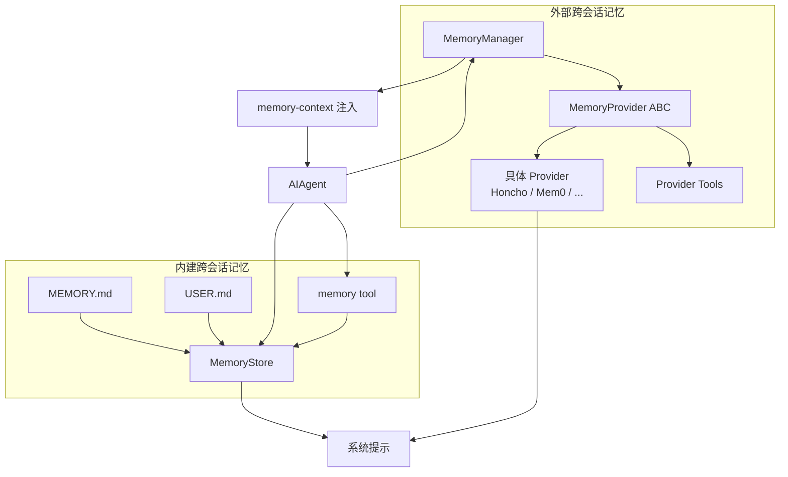

## 6.2 内建跨会话记忆时序图

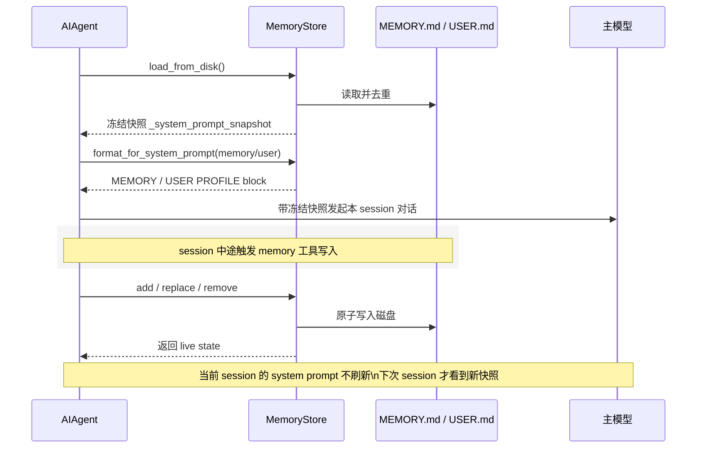

## 6.3 外部 provider 时序图

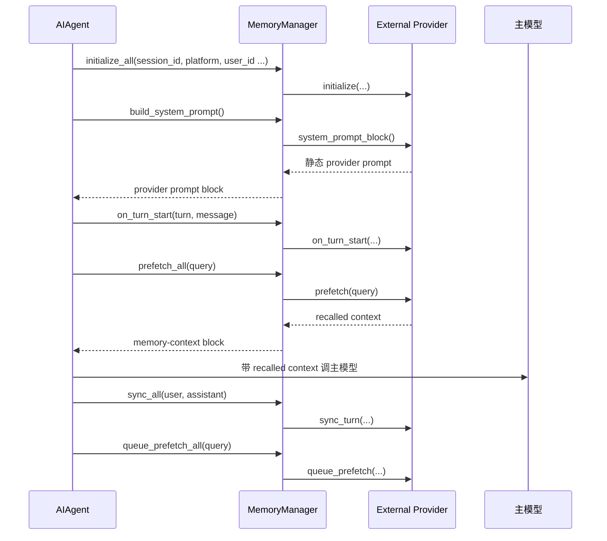

## 6.4 内建 memory 数据流

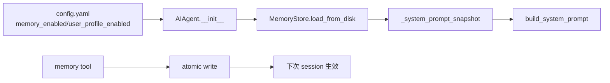

## 6.5 逻辑说明

### 关键模块

- `tools/memory_tool.py`
- `run_agent.py`
- `agent/memory_manager.py`
- `agent/memory_provider.py`
- `plugins/memory/*`

### 6.5.1 内建跨会话记忆：`MemoryStore`

#### 初始化

- `AIAgent.__init__()` 读取 `config.yaml` 里的：
  - `memory.memory_enabled`
  - `memory.user_profile_enabled`
  - `memory.memory_char_limit`
  - `memory.user_char_limit`
- 如果启用，则创建 `MemoryStore(...)` 并 `load_from_disk()`

#### 输入

- 文件输入：
  - `~/.hermes/memories/MEMORY.md`
  - `~/.hermes/memories/USER.md`
- 工具输入：
  - `memory(action, target, content, old_text)`

#### 内部执行逻辑

1. 从磁盘读取条目并按 `§` 分隔
2. 去重
3. 生成 `_system_prompt_snapshot`
4. 在构建系统提示时，通过 `format_for_system_prompt(...)` 注入冻结快照
5. 当模型调用 `memory` 工具时：
   - 做注入/泄露威胁扫描
   - 重新读取目标文件获得最新状态
   - 做增删改与字符数约束校验
   - 用原子写方式落盘

#### 关键工程语义

- 它是“冻结快照”模式，不是“实时 prompt 反映磁盘状态”
- 中途写入立即 durable，但不会刷新当前 session 的系统提示
- 这样做是为了保持 prefix cache 稳定

### 6.5.2 外部跨会话记忆：`MemoryManager + MemoryProvider`

#### 初始化

- `AIAgent.__init__()` 读取 `memory.provider`
- 若配置了 provider，则：
  - `plugins.memory.load_memory_provider(name)`
  - 创建 `MemoryManager()`
  - `add_provider(plugin_provider)`
  - `initialize_all(session_id=..., platform=..., user_id=..., gateway_session_key=...)`

#### 输入

- 当前用户消息
- 完整 turn 的 user/assistant 内容
- session/user/chat/thread/profile 等作用域元信息
- provider 自己暴露的工具调用

#### 内部执行逻辑

- `build_system_prompt()`：收集 provider 的静态提示
- `prefetch_all()`：每轮对话前召回相关记忆
- `sync_all()`：每轮结束后把本轮内容同步到 provider
- `queue_prefetch_all()`：为下一轮预热召回
- `handle_tool_call()`：把 provider tools 路由到具体 provider
- `on_memory_write()`：当内建 memory 写入时，镜像通知外部 provider

#### 关键工程语义

- 外部 provider 是“增强型长期记忆”
- 与 `MEMORY.md / USER.md` 并存，不替代它们
- 当前代码只允许一个 external provider 同时激活

### 6.5.3 这一层的本质

- 这是“长期事实、用户画像、环境知识”的承载层
- 它比会话记忆更浓缩，比技能记忆更偏 declarative facts

---

## 7. 第三层：技能记忆

技能记忆本质上是“程序性记忆”。

它保存的不是“事实”，而是：

- 什么时候该用什么方法
- 具体步骤怎么做
- 已验证流程是什么
- 常见坑和校验方法是什么

## 7.1 架构图

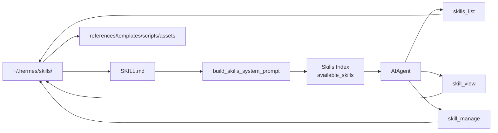

## 7.2 技能记忆时序图

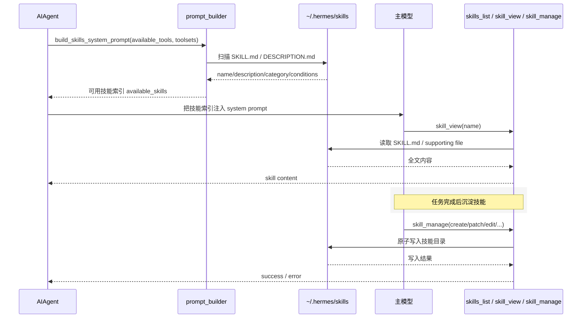

## 7.3 技能记忆数据流

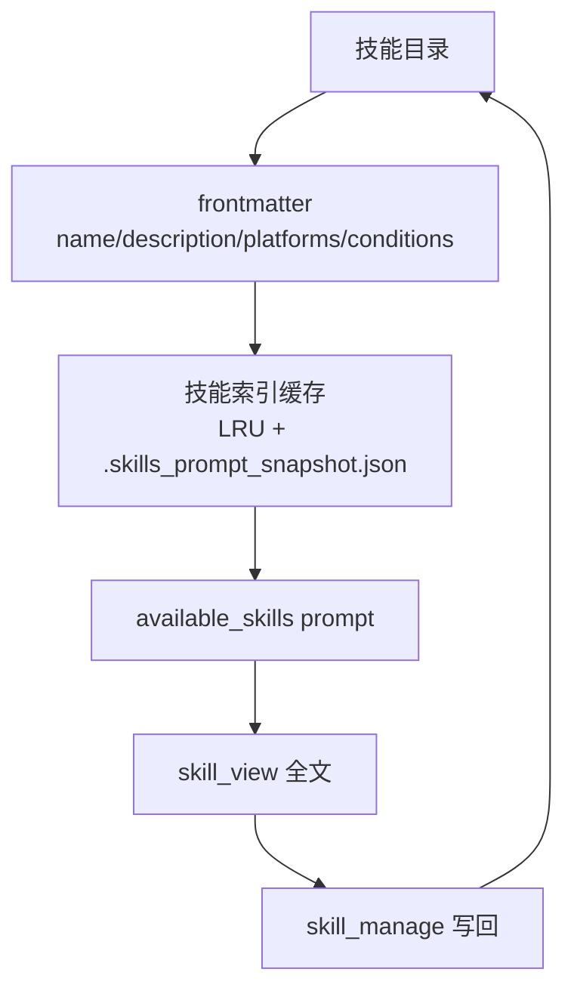

## 7.4 逻辑说明

### 关键模块

- `agent/prompt_builder.py`
- `tools/skills_tool.py`
- `tools/skill_manager_tool.py`
- `agent/skill_utils.py`

### 初始化

- 构建系统提示时，`AIAgent` 会判断当前工具集中是否有：
  - `skills_list`
  - `skill_view`
  - `skill_manage`
- 若存在，则调用 `build_skills_system_prompt(...)`

### `build_skills_system_prompt(...)` 做了什么

1. 扫描本地 `~/.hermes/skills/`
2. 再扫描 `skills.external_dirs`
3. 读取 `SKILL.md` frontmatter 中的：
   - `name`
   - `description`
   - `platforms`
   - `metadata.hermes` 条件字段
4. 根据当前 `available_tools / available_toolsets` 过滤 skill
5. 生成一个紧凑技能索引，注入到 system prompt
6. 同时使用：
   - 进程内 LRU cache
   - `.skills_prompt_snapshot.json`

### `skills_list`

- 返回元数据列表
- 目的是让模型低成本浏览“有哪些技能”
- 是 progressive disclosure 的第一层

### `skill_view`

- 真正加载某个 skill 的正文或 supporting file
- 这是模型获得“程序性知识全文”的时刻
- skill 可以来自：
  - 本地 skills 目录
  - external dirs
  - plugin skill

### `skill_manage`

- 创建、修改、删除技能
- 本质上是把本次任务中沉淀出的 working method 写回 skill 库
- 可以操作：
  - `SKILL.md`
  - supporting files

### 关键工程语义

- 技能不会像 `MEMORY.md` 一样全文自动注入
- 自动注入的是“技能目录索引”
- 只有模型判断相关时，才用 `skill_view` 读全文

### 这一层的本质

- 这是“如何做”的长期沉淀
- 是 declarative memory 之外的 procedural memory

---

## 8. 三层之间的关系

## 8.1 关系图

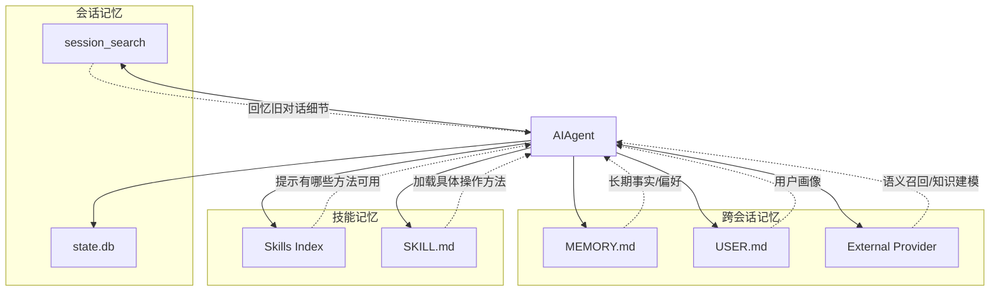

## 8.2 职责分工

- 会话记忆负责“历史对话轨迹”
- 跨会话记忆负责“必须长期保留的事实”
- 技能记忆负责“经过验证的方法论”

## 8.3 什么时候应该写到哪一层

| 信息类型 | 最适合写入哪层 | 原因 |
|---|---|---|
| 某次会话里用户问过什么、做过哪些尝试 | 会话记忆 | 需要的是可检索历史，不适合永久塞进 prompt |
| 用户偏好、环境信息、项目约定 | 跨会话记忆 | 这些事实应该长期稳定存在 |
| 反复可复用的工作流、排障步骤、模板 | 技能记忆 | 这些是“做法”，不是简单事实 |
| 某次任务的临时 TODO 状态 | 都不推荐 | 更适合 todo/store 或当前会话上下文 |

---

## 9. 代码层面的关键观察

## 9.1 `MemoryManager` 文档注释与当前实现存在偏差

`agent/memory_manager.py` 和 `agent/memory_provider.py` 的注释多次提到：

- built-in provider 总是注册为第一个 provider
- external provider 与 built-in provider 一起由 `MemoryManager` 编排

但当前代码路径实际是：

- 内建 memory：`MemoryStore`，由 `run_agent.py + tools/memory_tool.py` 直接处理
- external provider：`MemoryManager` 单独管理

也就是说，**当前运行时里并不存在一个真实的 `BuiltinMemoryProvider` 类被注册进 `MemoryManager`**。

这不是功能 bug，但它说明：

- 记忆架构已经演进过
- 文档语义和实际实现之间存在轻微漂移

## 9.2 会话记忆不等于长期记忆

很多项目会把“历史消息”直接当作长期记忆，但 Hermes 把这两件事分开了：

- 历史消息进 `state.db`
- 长期事实进 `MEMORY.md / USER.md / provider`

这是更清晰的设计。

## 9.3 技能记忆是“半自动注入”

Hermes 对技能使用了折中设计：

- 自动注入“技能索引”
- 按需注入“技能全文”

这兼顾了：

- 长期可发现性
- prompt token 控制
- 程序性知识的可复用性

---

## 10. 对原总架构图的复核

这里复核的是此前文档中的顶层图，也就是：

- [hermes-agent-architecture-analysis.md](file:///Users/lixiangyang/Desktop/代码/hermes-agent-main/hermes-agent-main/docs/hermes-agent-architecture-analysis.md) 里的“顶层架构图”

## 10.1 结论

原图作为“高层宣传图”是可以工作的，但如果从代码实现角度看，**记忆相关部分有 4 处容易误导的逻辑偏差**，建议你修改。

## 10.2 建议修改点

### 1. `MEM[Memory Providers / Skills / Plugins]` 这个节点混合了三种不同对象

问题：

- `Memory Providers` 是跨会话记忆增强层
- `Skills` 是程序性知识库
- `Plugins` 是扩展机制

这三者不是同一层，也不是同一种依赖关系。

建议：

- 把它拆成至少三个节点：
  - `Builtin Memory + External Memory Providers`
  - `Skills Index / Skill Store`
  - `Plugins / MCP Extensions`

### 2. `A --> MEM` 这条边太粗，掩盖了实际访问路径

问题：

- `AIAgent` 访问内建 memory 是直接通过 `MemoryStore`
- 访问 external provider 是通过 `MemoryManager`
- 访问 skills 是通过 `prompt_builder + skills tools`
- 访问 plugins 则更多通过 `model_tools` 或专门的插件扫描逻辑

建议：

- 把一条总边拆成：
  - `AIAgent --> MemoryStore`
  - `AIAgent --> MemoryManager --> External Providers`
  - `AIAgent --> prompt_builder --> Skills`
  - `model_tools --> plugins/tools`

### 3. `EXT[LLM Providers / MCP Servers / Browser / Terminal Backends / Messaging APIs]` 把外部依赖混成一个桶

问题：

- LLM provider 是 `AIAgent` 直接调用
- Browser / Terminal / MCP 大多是工具层调用
- Messaging APIs 是 `gateway` 平台适配器调用，不是 `AIAgent` 直接访问

把它们合成一个 `EXT` 后，`A --> EXT` 和 `M3 --> EXT` 会让读者误以为 agent 直接跟消息平台通信。

建议：

- 拆成四类外部系统：
  - `LLM Providers`
  - `Tool Backends`
  - `MCP Servers`
  - `Messaging Platforms`

### 4. 原图没有显式表现“会话记忆、跨会话记忆、技能记忆”的分层

问题：

- 当前架构图里，`DB`、`MEM`、`skills` 的关系没有被区分
- 读者容易误以为它们只是同类资源

建议：

- 在总架构图里单独画一个 `Persistent Knowledge Layer`
- 里面分三块：
  - `Session Memory: SessionDB + session_search`
  - `Cross-Session Memory: MEMORY.md / USER.md / MemoryProvider`
  - `Procedural Memory: Skills`

## 10.3 推荐替换版顶层记忆区域

你可以把原图中 `DB + MEM` 一段替换为下面这段结构：

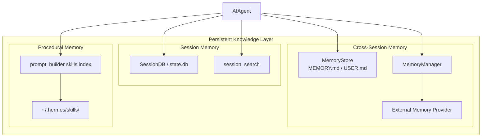

---

## 11. 建议你下一步怎么改总架构图

- 把“记忆”拆成三层，而不是一个 `MEM` 节点
- 把 skills 从 memory provider 体系里拆出去
- 把 external systems 从一个 `EXT` 节点拆成更清晰的几类
- 在 `AIAgent` 与 `Skills` 之间补 `prompt_builder` 这层
- 在 `AIAgent` 与 external memory provider 之间补 `MemoryManager` 这层

---

## 12. 总结

Hermes 的三层记忆并不是重复建设，而是刻意分工：

- 会话记忆解决“以前聊过什么”
- 跨会话记忆解决“长期应该记住什么”
- 技能记忆解决“以后该怎么做”

从架构上看，这种拆分是合理的，因为它把：

- transcript persistence
- durable facts
- procedural knowledge

这三类本来容易混淆的东西分开了。

如果你后面要继续优化总图，我建议优先围绕“记忆三层分离”来改，因为这是理解整个项目运行方式的关键切口。
