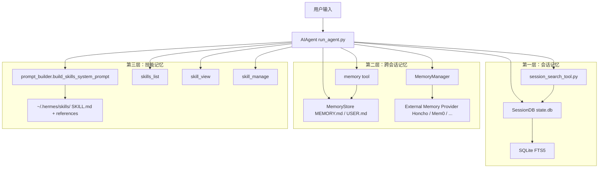
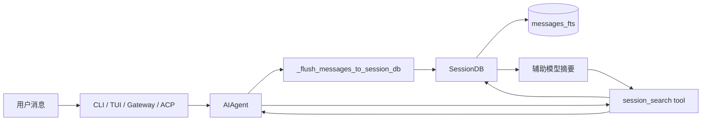
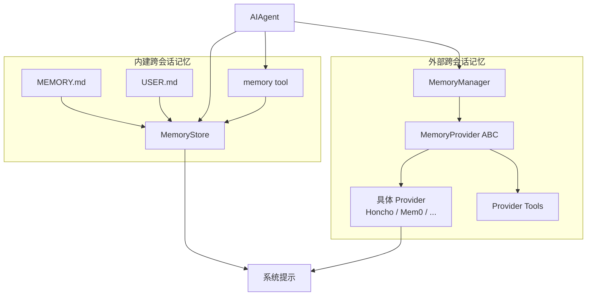
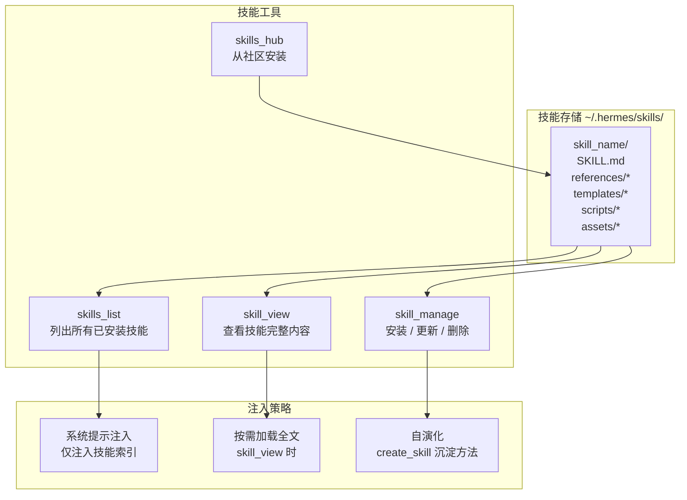
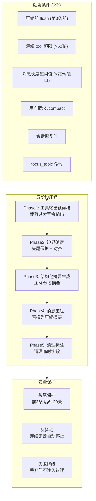
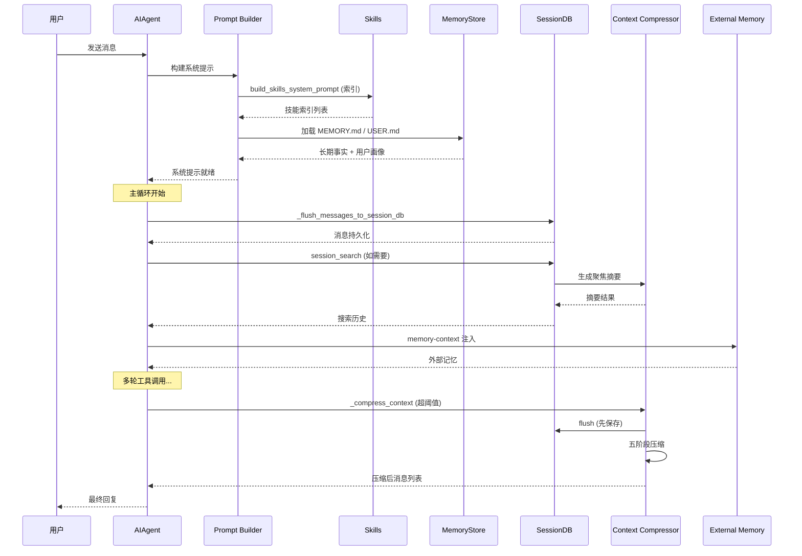

# Hermes Agent 记忆模块 — 规格说明书 (Specification)

> 版本: 基于 Hermes Agent 官方文档分析

---

## 一、概述

Hermes Agent 的记忆系统采用**三层分层架构**，将知识按用途分为三类独立但互补的持久化链路：

1. **会话记忆**：`SessionDB(state.db)` 保存完整对话历史，偏"事实回放"和"检索召回"
2. **跨会话记忆**：`MEMORY.md / USER.md` + 可选 `MemoryProvider`，偏"长期事实与用户画像"
3. **技能记忆**：`~/.hermes/skills/` 中的 `SKILL.md` 与配套文件，偏"程序性知识"和"操作方法"

### 核心设计原则

- **知识分层**：transcript、facts、procedures 三类知识拆开存储，各有独立的注入时机和 token 成本模型
- **有损但可控**：上下文压缩有损，但通过结构化模板和迭代更新最大化保留关键信息
- **头尾保护**：系统提示和最近上下文永远不被压缩
- **不阻塞主流程**：压缩和记忆操作使用独立的辅助模型，不影响主模型推理
- **外部 Provider 可插拔**：Honcho / Mem0 / Hindsight 等可当作 MemoryProvider 接入

---

## 二、三层记忆总览

### 三层定位对比

| 维度 | 会话记忆 | 跨会话记忆 | 技能记忆 |
|------|---------|-----------|---------|
| 回答 | 我们以前聊过什么 | 系统长期应该记住什么 | 以后遇到类似任务怎么做 |
| 存储方式 | SQLite 会话表和消息表 | Markdown 文件 + 外部 Provider | Skill 目录 + 索引 |
| 是否自动注入 | 否，按需检索 | 是，session 启动时加载 | 部分，索引常驻，正文按需 |
| 更新频率 | 每轮自动写入 | 低频更新 | 创建/更新时写入 |
| Token 成本 | 低（仅摘要时） | 中（全量注入） | 低（仅索引） |

---

## 三、第一层：会话记忆

### 3.1 架构图

### 3.2 核心流程

**写入流程**：
1. 每轮对话或中途需要持久化时，`_flush_messages_to_session_db()` 被调用
2. 使用 `_last_flushed_db_idx` 游标防止重复写入
3. 每条 `user / assistant / tool` 消息写入 `messages` 表
4. `sessions` 表同步维护 `message_count`、`tool_call_count`、token/cost 等聚合
5. `messages_fts` 通过 SQLite trigger 自动维护全文索引

**读取流程**：
1. 普通恢复：`get_messages_as_conversation()` 把历史还原为对话格式
2. 记忆召回：`session_search()` 先搜 FTS5，按 session 聚合，再发给辅助模型做 query 聚焦摘要

### 3.3 数据库 Schema

| 表 | 关键字段 | 用途 |
|-----|---------|------|
| sessions | id, title, status, message_count, tool_call_count, total_tokens, total_cost, created_at, updated_at, ended_at | 会话元数据 |
| messages | id, session_id, role, content, tool_name, tool_call_id, token_count, created_at | 完整消息历史 |
| messages_fts | SQLite FTS5 全文索引 | 全文搜索引擎 |

---

## 四、第二层：跨会话记忆

### 4.1 架构图

### 4.2 内建记忆

| 模块 | 文件 | 说明 |
|------|------|------|
| MemoryStore | `~/.hermes/memories/MEMORY.md` | 长期事实、决策、经验 |
| MemoryStore | `~/.hermes/memories/USER.md` | 用户画像、偏好、个人信息 |
| memory tool | `memory_tool.py` | 读取/写入内建记忆 |
| MemoryManager | `MemoryManager` | 外部 Provider 的统一管理器 |

### 4.3 外部 Provider (MemoryManager)

- **ABC 接口**：MemoryProvider 抽象基类，所有外部 provider 实现 `add` / `search` / `delete` 等方法
- **支持的 Provider**：Honcho / Mem0 / Hindsight 等
- **注入策略**：MemoryManager 可配置按 turn prefetch，将相关记忆注入到上下文

---

## 五、第三层：技能记忆

### 技能记忆的特点
- **索引常驻**：技能列表（名称+描述）始终注入系统提示，Agent 知道什么技能可用
- **正文按需**：`skill_view` 才加载完整 SKILL.md 内容
- **自演化**：Agent 完成任务后可自动 `create_skill` 沉淀方法为可复用技能

---

## 六、上下文压缩机制

### 压缩配置

| 参数 | 默认值 | 说明 |
|------|--------|------|
| threshold_percent | 0.50 | 触发压缩的 token 阈值（占比）|
| protect_first_n | 3 | 头部保护的消息数 |
| protect_last_n | 20 | 尾部保护的消息数 |
| summary_target_ratio | 0.20 | 摘要目标占比 |
| max_summary_tokens | 12000 | 摘要最大 token 数 |
| 辅助模型 | 默认 `gpt-4o-mini` | 回退链：`gpt-4o-mini` → `gemini-2.0-flash` |

---

## 七、知识层运行时

---

## 八、关键技术指标

| 指标 | 值 |
|------|-----|
| 记忆层级 | 3 层（会话/跨会话/技能） |
| 会话存储 | SQLite (state.db) |
| 跨会话存储 | Markdown 文件 + 外部 Provider |
| 技能存储 | Skill 目录 (SKILL.md + 配套文件) |
| 全文搜索 | SQLite FTS5 |
| 外部 Provider | Honcho / Mem0 / Hindsight 等 |
| 压缩策略 | 五阶段、头尾保护、防抖动 |
| 辅助模型 | gpt-4o-mini / gemini-2.0-flash |
| 头保护 | 前 3 条永远不压缩 |
| 尾保护 | 后 6~20 条永远不压缩 |
| 触发点 | 6 个（flush前/工具超限/超阈值/用户请求/会话恢复/focus） |
