# Khoj Content 模块设计文档

## 1. 模块概述

Content 模块是 Khoj 系统的核心数据处理管道，负责将用户的各种文档（Markdown、Org-mode、PDF、DOCX、纯文本、图片）以及外部数据源（GitHub、Notion）的内容提取、分块、生成嵌入向量并存入数据库，以支持语义搜索。

### 核心职责

| 职责 | 说明 |
|------|------|
| **内容提取** | 从不同格式的文件中提取结构化文本条目 |
| **智能分块** | 按语义边界（标题、段落）将长文本拆分为适合嵌入模型处理的片段 |
| **嵌入生成** | 调用嵌入模型将文本条目向量化 |
| **增量索引** | 基于哈希比对实现新增、更新、删除条目的增量索引 |
| **外部集成** | 通过 API 同步 GitHub 仓库和 Notion 页面的内容 |
| **日期索引** | 从条目内容中提取日期信息，支持日期范围过滤搜索 |

### 模块架构总览

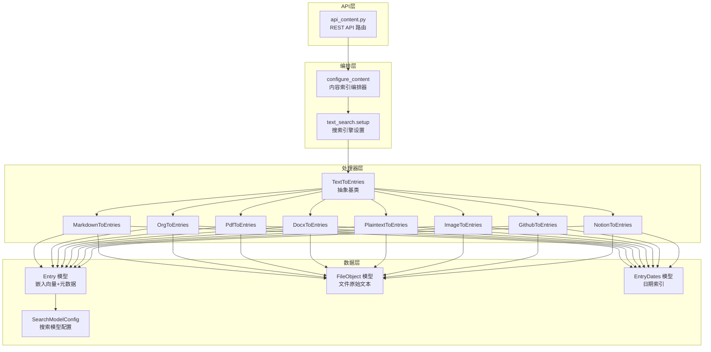

---

## 2. 核心组件

### 2.1 类与函数清单

| 组件 | 类型 | 位置 | 说明 |
|------|------|------|------|
| `TextToEntries` | 抽象基类 | `processor/content/text_to_entries.py` | 所有内容处理器的基类，定义模板方法模式 |
| `MarkdownToEntries` | 具体类 | `processor/content/markdown/markdown_to_entries.py` | Markdown 文件处理器 |
| `OrgToEntries` | 具体类 | `processor/content/org_mode/org_to_entries.py` | Org-mode 文件处理器 |
| `PdfToEntries` | 具体类 | `processor/content/pdf/pdf_to_entries.py` | PDF 文件处理器 |
| `DocxToEntries` | 具体类 | `processor/content/docx/docx_to_entries.py` | DOCX 文件处理器 |
| `PlaintextToEntries` | 具体类 | `processor/content/plaintext/plaintext_to_entries.py` | 纯文本/HTML 处理器 |
| `ImageToEntries` | 具体类 | `processor/content/images/image_to_entries.py` | 图片 OCR 处理器 |
| `GithubToEntries` | 具体类 | `processor/content/github/github_to_entries.py` | GitHub 仓库同步处理器 |
| `NotionToEntries` | 具体类 | `processor/content/notion/notion_to_entries.py` | Notion 页面同步处理器 |
| `configure_content` | 函数 | `routers/helpers.py` | 内容索引编排函数，根据类型分发到对应处理器 |
| `text_search.setup` | 函数 | `search_type/text_search.py` | 实例化处理器并调用 process |
| `Entry` | Pydantic 模型 | `utils/rawconfig.py` | 内存中的条目数据结构 |
| `Entry` (DbEntry) | Django 模型 | `database/models/__init__.py` | 数据库条目模型，含嵌入向量 |
| `FileObject` | Django 模型 | `database/models/__init__.py` | 文件原始文本存储 |
| `EntryDates` | Django 模型 | `database/models/__init__.py` | 条目日期索引 |

### 2.2 数据模型关系

```mermaid
erDiagram
    KhojUser ||--o{ Entry : "owns"
    KhojUser ||--o{ FileObject : "owns"
    KhojUser ||--o{ GithubConfig : "has"
    KhojUser ||--o{ NotionConfig : "has"
    Agent ||--o{ Entry : "owns"
    Agent ||--o{ FileObject : "owns"
    FileObject ||--o{ Entry : "has"
    Entry ||--o{ EntryDates : "has"
    SearchModelConfig ||--o{ Entry : "used_by"
    GithubConfig ||--o{ GithubRepoConfig : "contains"

    Entry {
        uuid id PK
        vector embeddings
        text raw
        text compiled
        varchar heading
        varchar file_source
        varchar file_type
        varchar file_path
        varchar url
        varchar hashed_value
        uuid corpus_id
        fk search_model_id
        fk file_object_id
    }

    FileObject {
        uuid id PK
        varchar file_name
        text raw_text
        fk user_id
        fk agent_id
    }

    EntryDates {
        uuid id PK
        date date
        fk entry_id
    }

    GithubConfig {
        uuid id PK
        varchar pat_token
        fk user_id
    }

    GithubRepoConfig {
        uuid id PK
        varchar name
        varchar owner
        varchar branch
        fk github_config_id
    }

    NotionConfig {
        uuid id PK
        varchar token
        fk user_id
    }

    SearchModelConfig {
        uuid id PK
        varchar name
        varchar bi_encoder
        varchar cross_encoder
        float bi_encoder_confidence_threshold
    }
```

---

## 3. 内容索引流程时序图

### 3.1 完整索引流程（从文件上传到内容入库）

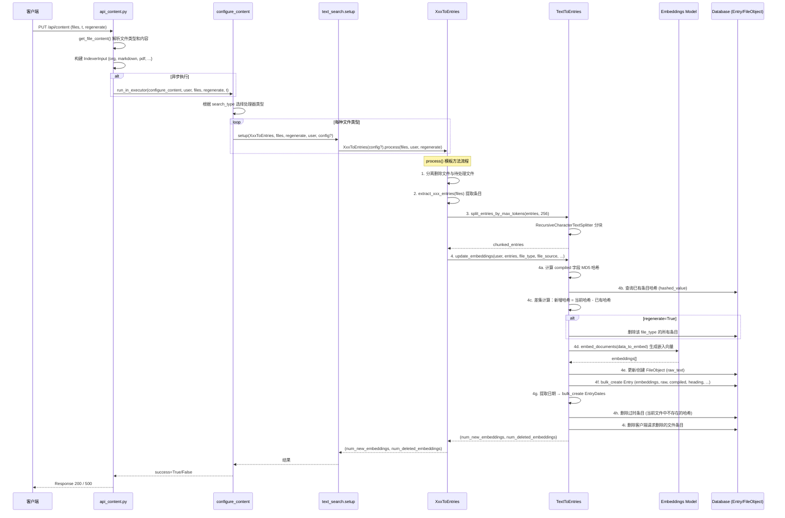

### 3.2 外部数据源同步流程

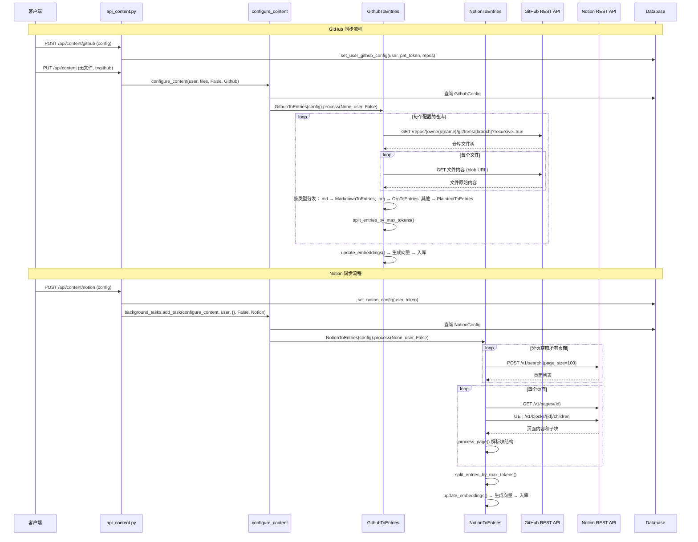

---

## 4. TextToEntries 基类设计

### 4.1 类图

```mermaid
classDiagram
    class TextToEntries {
        <<abstract>>
        +embeddings_model: dict
        +date_filter: DateFilter
        +process(files, user, regenerate)* Tuple~int, int~
        +update_embeddings(user, current_entries, file_type, file_source, key, logger, deletion_filenames, regenerate, file_to_text_map) Tuple~int, int~
        +hash_func(key: str) Callable
        +remove_long_words(text, max_word_length) str
        +tokenizer(text) List~str~
        +split_entries_by_max_tokens(entries, max_tokens, max_word_length, raw_is_compiled) List~Entry~
        +mark_entries_for_update(current_entries, previous_entries, key, logger, deletion_filenames) List~Tuple~
        +clean_field(field: str) str
    }

    class MarkdownToEntries {
        +process(files, user, regenerate) Tuple~int, int~
        +extract_markdown_entries(markdown_files, max_tokens) Tuple~Dict, List~Entry~~
        +process_single_markdown_file(content, file, entries, map, max_tokens, ancestry, start_line) Tuple
        +convert_markdown_entries_to_maps(entries, map) List~Entry~
    }

    class OrgToEntries {
        +process(files, user, regenerate) Tuple~int, int~
        +extract_org_entries(org_files, index_heading_entries, max_tokens) Tuple~Dict, List~Entry~~
        +extract_org_nodes(org_files, max_tokens) Tuple
        +process_single_org_file(content, file, entries, map, max_tokens, ancestry, start_line) Tuple
        +convert_org_nodes_to_entries(entries, map, index_heading_entries) List~Entry~
    }

    class PdfToEntries {
        -NULL_TRANSLATOR: Final
        +process(files, user, regenerate) Tuple~int, int~
        +extract_pdf_entries(pdf_files) Tuple~Dict, List~Entry~~
        +convert_pdf_entries_to_maps(entries, map) List~Entry~
        +extract_text(pdf_file) List~str~
        +clean_text(text) str
    }

    class DocxToEntries {
        +process(files, user, regenerate) Tuple~int, int~
        +extract_docx_entries(docx_files) Tuple~Dict, List~Entry~~
        +convert_docx_entries_to_maps(entries, map) List~Entry~
        +extract_text(docx_file) List~str~
    }

    class PlaintextToEntries {
        +process(files, user, regenerate) Tuple~int, int~
        +extract_plaintext_entries(text_files) Tuple~Dict, List~Entry~~
        +process_single_plaintext_file(content, file, entries, map) Tuple
        +convert_text_files_to_entries(entries, map) List~Entry~
        +extract_html_content(markup_content, markup_type) str
    }

    class ImageToEntries {
        +process(files, user, regenerate) Tuple~int, int~
        +extract_image_entries(image_files) Tuple~Dict, List~Entry~~
        +convert_image_entries_to_maps(entries, map) List~Entry~
    }

    class GithubToEntries {
        +config: GithubContentConfig
        +session: requests.Session
        +process(files, user, regenerate) Tuple~int, int~
        +process_repo(repo) List~Entry~
        +update_entries_with_ids(entries, user) Tuple~int, int~
        +get_files(repo_url, repo) Tuple
        +get_file_contents(file_url, decode) str
        +wait_for_rate_limit_reset(response, func, args, kwargs)
    }

    class NotionToEntries {
        +config: NotionContentConfig
        +session: requests.Session
        +process(files, user, regenerate) Tuple~int, int~
        +process_page(page) List~Entry~
        +process_heading(heading) str
        +process_nested_children(children, content, block_type) str
        +process_text(text, block_type) str
        +get_block_children(block_id) dict
        +get_page(page_id) dict
        +get_page_children(page_id) dict
        +get_page_content(page_id) Tuple
        +update_entries_with_ids(entries, user) Tuple~int, int~
    }

    TextToEntries <|-- MarkdownToEntries
    TextToEntries <|-- OrgToEntries
    TextToEntries <|-- PdfToEntries
    TextToEntries <|-- DocxToEntries
    TextToEntries <|-- PlaintextToEntries
    TextToEntries <|-- ImageToEntries
    TextToEntries <|-- GithubToEntries
    TextToEntries <|-- NotionToEntries
```

### 4.2 模板方法模式

`TextToEntries` 采用模板方法模式，`process()` 是抽象方法，由子类实现具体的提取逻辑，但所有子类遵循统一的三步处理流程：

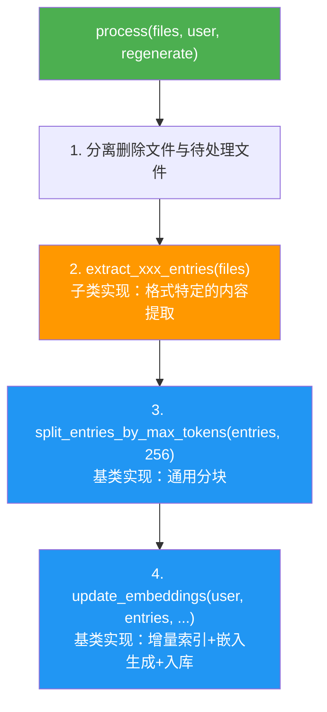

**关键设计点**：
- **步骤 2** 是子类的扩展点，不同格式有不同的提取策略
- **步骤 3、4** 由基类统一处理，保证一致的分块和索引行为
- `GithubToEntries` 和 `NotionToEntries` 略有不同：它们内部组合使用其他处理器（Markdown、Org、Plaintext），并自行管理 `update_entries_with_ids`

### 4.3 Entry 数据结构

内存中的 `Entry` 对象（`utils/rawconfig.py`）是处理器与数据库之间的数据传输对象：

| 字段 | 类型 | 说明 |
|------|------|------|
| `raw` | str | 原始文本内容 |
| `compiled` | str | 编译后文本（附加文件名/标题前缀），用于嵌入生成 |
| `heading` | str | 条目标题/首行 |
| `file` | str | 所属文件路径或 URL |
| `uri` | str | 条目定位 URI（如 `file://path#line=10`） |
| `corpus_id` | str | 同一分块组的 UUID（同一原始条目拆分出的多个 chunk 共享） |

---

## 5. 各格式处理器

### 5.1 处理器对比总览

| 处理器 | 输入类型 | 提取策略 | 分块依据 | 特殊处理 |
|--------|----------|----------|----------|----------|
| **MarkdownToEntries** | `str` | 递归按标题层级拆分 | `#` 标题层级 | 维护标题祖先链(ancestry)，递归直到 token ≤ 256 |
| **OrgToEntries** | `str` | 递归按 `*` 标题层级拆分 | `*` 标题层级 | 使用 orgnode 解析器，提取 TODO/标签/日期等元数据 |
| **PdfToEntries** | `bytes` | 按页提取 | 页边界 | PyMuPDFLoader，清理 null 字节 |
| **DocxToEntries** | `bytes` | 整文档提取 | 无自然分块 | Docx2txtLoader，整文档作为单一条目 |
| **PlaintextToEntries** | `str` | 整文件提取 | 无自然分块 | 支持 HTML/XML 自动提取文本，`raw_is_compiled=True` |
| **ImageToEntries** | `bytes` | OCR 识别 | 无自然分块 | RapidOCR，支持 PNG/JPG/WEBP |

### 5.2 Markdown 处理器 — 递归标题拆分

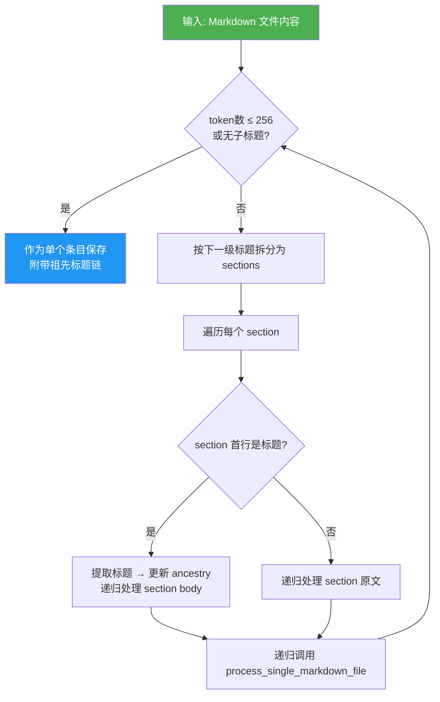

**关键特性**：
- **祖先链(ancestry)**：每个条目都携带完整的父标题链，如 `# 项目\n## 子模块\n### 具体内容`
- **行号追踪**：递归过程中精确计算每个条目在源文件中的起始行号，生成 `file://path#line=N` 的 URI
- **标题前缀**：编译后的条目在原始内容前添加文件名作为顶级标题，为嵌入模型提供上下文

### 5.3 Org-mode 处理器 — 递归标题拆分 + 元数据提取

与 Markdown 处理器结构相似，但有以下差异：

- 使用 `orgnode.makelist()` 解析 Org 节点，提取丰富的元数据
- 编译条目包含：TODO 状态、标签、关闭日期、计划日期
- 祖先链使用 `/` 分隔（如 `项目 / 子模块 / 具体内容`）

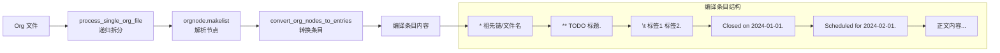

### 5.4 PDF 处理器 — 按页提取

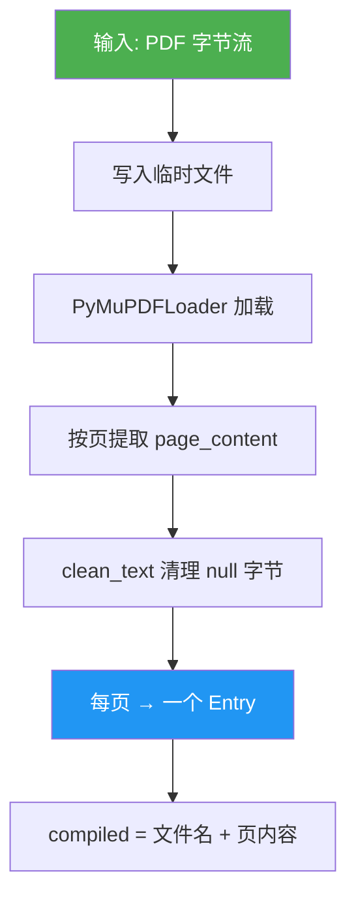

### 5.5 DOCX 处理器 — 整文档提取

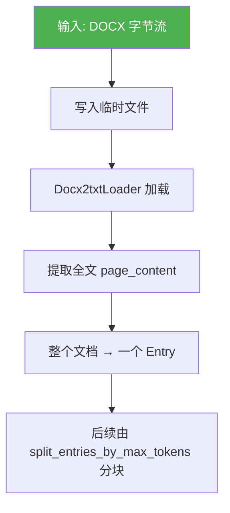

### 5.6 Plaintext 处理器 — 整文件提取 + HTML 支持

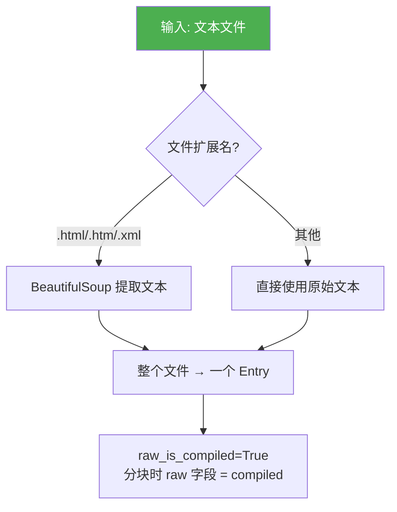

### 5.7 Image 处理器 — OCR 识别

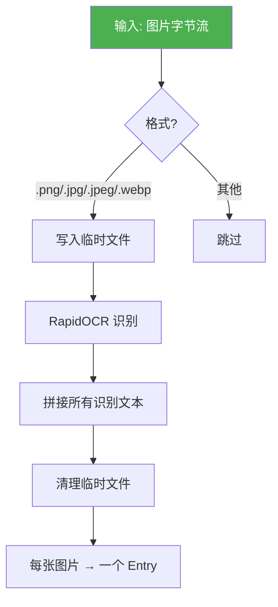

---

## 6. 外部数据源集成

### 6.1 GitHub 集成架构

```mermaid
flowchart TD
    A[GithubToEntries] --> B[读取 GithubConfig<br/>pat_token + repos]
    B --> C[创建 requests.Session<br/>设置 Authorization header]

    subgraph 仓库处理循环
        C --> D[GET /repos/{owner}/{name}/git/trees/{branch}?recursive=true]
        D --> E[遍历文件树]
        E --> F{文件类型?}
        F -->|.md| G[MarkdownToEntries.process_single_markdown_file]
        F -->|.org| H[OrgToEntries.process_single_org_file]
        F -->|其他| I{Magika 识别内容类型}
        I -->|text/code| J[PlaintextToEntries.process_single_plaintext_file]
        I -->|binary| K[跳过]
    end

    G & H & J --> L[合并所有条目]
    L --> M[split_entries_by_max_tokens]
    M --> N[update_embeddings<br/>EntryType=GITHUB<br/>EntrySource=GITHUB]

    style A fill:#4CAF50,color:white
```

**关键设计**：
- **速率限制处理**：监控 `X-RateLimit-Remaining` 响应头，当降为 0 时自动等待重置
- **Magika 内容识别**：使用 Google 的 Magika 库识别非扩展名文件的 MIME 类型，仅索引文本类文件
- **复用已有处理器**：GitHub 处理器不自行解析 Markdown/Org，而是直接调用对应处理器的静态方法
- **URL 作为文件路径**：使用 `https://github.com/{owner}/{name}/blob/{branch}/{path}` 作为条目的 file 字段

### 6.2 Notion 集成架构

```mermaid
flowchart TD
    A[NotionToEntries] --> B[读取 NotionConfig<br/>token]
    B --> C[创建 requests.Session<br/>设置 Bearer token + Notion-Version]

    subgraph 页面获取
        C --> D[POST /v1/search<br/>分页获取所有页面/数据库]
        D --> E{对象类型?}
        E -->|database| F[暂不处理 TODO]
        E -->|page| G[process_page]
    end

    subgraph 页面处理
        G --> H[GET /v1/pages/{id}<br/>获取页面属性/标题]
        H --> I[GET /v1/blocks/{id}/children<br/>获取页面块内容]
        I --> J[遍历块]
        J --> K{块类型?}
        K -->|heading_1/2/3| L[分隔前一段落<br/>记录当前标题]
        K -->|paragraph/list/todo| M[附加文本到当前条目]
        K -->|has_children| N[递归获取子块]
        L & M & N --> O[构建 Entry]
    end

    O --> P[split_entries_by_max_tokens]
    P --> Q[update_embeddings<br/>EntryType=NOTION<br/>EntrySource=NOTION]

    style A fill:#4CAF50,color:white
```

**NotionBlockType 枚举**涵盖 20+ 种块类型，分为三类处理：
- **显示类块**（paragraph, heading, list, todo, toggle, child_page）：提取富文本
- **不支持的块**（bookmark, divider, child_database, template, callout, unsupported）：跳过
- **媒体类块**（pdf, image, embed, video, file）：当前跳过

### 6.3 外部数据源对比

| 特性 | GitHub | Notion |
|------|--------|--------|
| **数据获取** | 主动拉取（GitHub REST API） | 主动拉取（Notion REST API） |
| **认证方式** | PAT Token | OAuth Bearer Token |
| **内容格式** | 复用 Markdown/Org/Plaintext 处理器 | 自定义块解析器 |
| **文件粒度** | 仓库中的单个文件 | Notion 页面 |
| **增量策略** | 基于哈希的增量索引 | 基于哈希的增量索引 |
| **速率限制** | 有（X-RateLimit 头） | 有（分页 page_size=100） |
| **触发方式** | 客户端无文件时自动触发 | 客户端无文件时自动触发 + 配置时后台任务 |

---

## 7. 嵌入向量生成

### 7.1 嵌入生成流程

```mermaid
flowchart TD
    A[update_embeddings] --> B[计算所有条目的 MD5 哈希<br/>hash_func = MD5(compiled)]
    B --> C[按文件分组哈希<br/>hashes_by_file]
    C --> D{regenerate=True?}
    D -->|是| E[删除该 file_type 所有条目]
    D -->|否| F[查询数据库已有哈希]
    E --> F
    F --> G[差集计算<br/>hashes_to_process = 当前哈希 - 已有哈希]
    G --> H[获取待处理条目<br/>entries_to_process]
    H --> I[提取 compiled 字段<br/>data_to_embed]
    I --> J["embeddings_model[model.name].embed_documents(data_to_embed)"]
    J --> K[获取嵌入向量列表]

    K --> L[更新 FileObject<br/>创建/更新 raw_text]
    L --> M[批量创建 Entry<br/>bulk_create(batch_size=200)]
    M --> N[提取日期<br/>date_filter.extract_dates]
    N --> O[批量创建 EntryDates]
    O --> P[删除过时条目<br/>当前文件中不存在的哈希]
    P --> Q[删除客户端请求删除的文件条目]

    style J fill:#FF5722,color:white
    style M fill:#2196F3,color:white
```

### 7.2 嵌入模型配置

嵌入模型通过 `SearchModelConfig` 数据库模型配置：

| 配置项 | 说明 | 默认值 |
|--------|------|--------|
| `bi_encoder` | 双编码器模型（sentence-transformer） | `thenlper/gte-small` |
| `cross_encoder` | 交叉编码器模型（重排序） | `mixedbread-ai/mxbai-rerank-xsmall-v1` |
| `embeddings_inference_endpoint` | 嵌入推理服务端点 | 本地 |
| `embeddings_inference_endpoint_type` | 推理服务类型 | `local` / `huggingface` / `openai` |
| `bi_encoder_confidence_threshold` | 双编码器置信度阈值 | 0.18 |

### 7.3 Entry 数据库模型关键字段

| 字段 | 类型 | 说明 |
|------|------|------|
| `embeddings` | `VectorField` (pgvector) | 嵌入向量，维度由模型决定 |
| `raw` | `TextField` | 原始文本 |
| `compiled` | `TextField` | 编译后文本（用于生成嵌入） |
| `heading` | `CharField(1000)` | 条目标题 |
| `file_source` | `CharField(30)` | 来源：computer / notion / github |
| `file_type` | `CharField(30)` | 类型：markdown / org / pdf / docx / plaintext / image / notion / github |
| `file_path` | `CharField(400)` | 文件路径 |
| `hashed_value` | `CharField(100)` | compiled 字段的 MD5 哈希，用于增量索引 |
| `corpus_id` | `UUIDField` | 同一分块组的标识 |
| `search_model` | `FK(SearchModelConfig)` | 使用的搜索模型 |
| `file_object` | `FK(FileObject)` | 关联的文件对象 |

---

## 8. 增量索引策略

### 8.1 增量索引核心算法

增量索引的核心思想是**基于内容哈希的差异比对**，避免每次全量重建嵌入向量。

```mermaid
flowchart TD
    A[当前批次的条目 current_entries] --> B[计算每个条目的 MD5(compiled) 哈希]
    B --> C[按文件分组: hashes_by_file]

    C --> D{regenerate 模式?}
    D -->|是| E[删除该 file_type 的所有已有条目<br/>所有当前条目都视为新增]
    D -->|否| F[增量模式]

    F --> G[对每个文件]
    G --> H[查询数据库中该文件的已有哈希<br/>existing_entry_hashes]
    H --> I["新增哈希 = 当前文件哈希 - 已有哈希<br/>hashes_to_process"]
    I --> J[仅为新增哈希生成嵌入向量]

    J --> K[批量创建新 Entry]
    K --> L[对每个文件]
    L --> M["过时哈希 = 已有哈希 - 当前文件哈希"]
    M --> N[删除过时条目]

    N --> O{deletion_filenames?}
    O -->|有| P[删除指定文件的条目和 FileObject]
    O -->|无| Q[完成]

    style E fill:#F44336,color:white
    style I fill:#4CAF50,color:white
    style M fill:#FF9800,color:white
```

### 8.2 增量索引状态转换

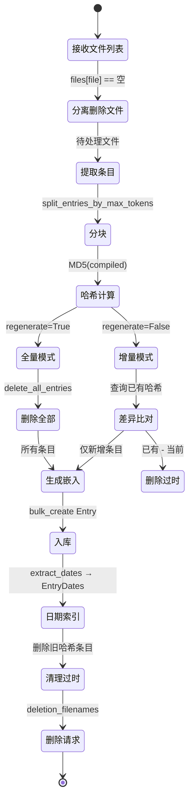

### 8.3 三种索引场景

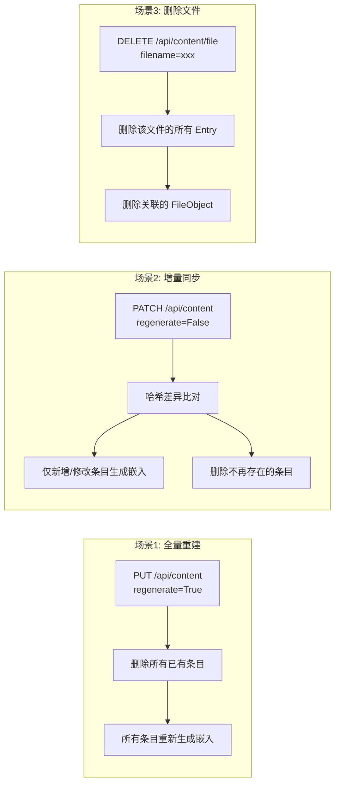

### 8.4 哈希函数与一致性保证

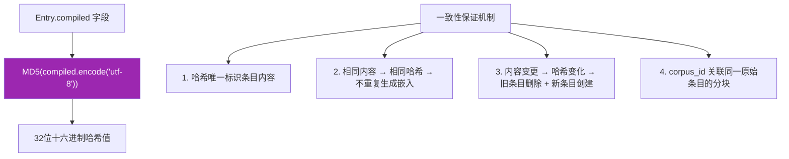

### 8.5 FileObject 与 Entry 的关系

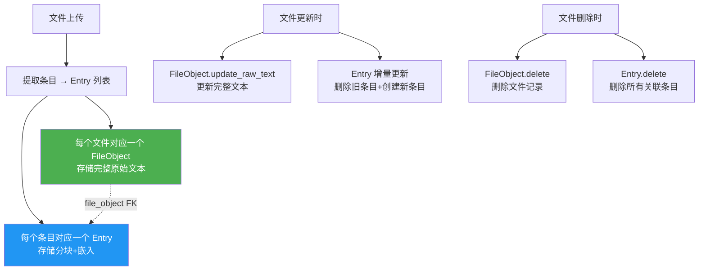

---

## 附录：API 端点一览

| 方法 | 路径 | 说明 |
|------|------|------|
| `PUT` | `/api/content` | 全量重建索引（regenerate=True） |
| `PATCH` | `/api/content` | 增量同步索引（regenerate=False） |
| `POST` | `/api/content/github` | 设置 GitHub 配置 |
| `GET` | `/api/content/github` | 获取 GitHub 配置 |
| `POST` | `/api/content/notion` | 设置 Notion 配置（触发后台同步） |
| `GET` | `/api/content/notion` | 获取 Notion 配置 |
| `DELETE` | `/api/content/file` | 删除单个文件 |
| `DELETE` | `/api/content/files` | 批量删除文件 |
| `DELETE` | `/api/content/type/{type}` | 删除某类型的所有内容 |
| `DELETE` | `/api/content/source/{source}` | 删除某来源的所有内容 |
| `GET` | `/api/content/size` | 获取索引数据大小 |
| `GET` | `/api/content/types` | 获取已配置的内容类型 |
| `GET` | `/api/content/files` | 分页获取所有文件 |
| `GET` | `/api/content/file` | 获取单个文件详情 |
| `GET` | `/api/content/{source}` | 获取某来源的文件名列表 |
| `POST` | `/api/content/convert` | 转换文档为纯文本（不入库） |
