# Khoj Conversation 模块设计文档

## 1. 模块概述

Conversation 模块是 Khoj 的核心对话引擎，负责处理用户从发送消息到接收完整响应的整个生命周期。该模块实现了以下关键职责：

- **多模型适配**：统一适配 OpenAI、Anthropic、Google 三大 LLM 提供商，以及兼容 OpenAI API 的第三方服务（DeepSeek、Groq、Cerebras 等）
- **工具编排**：根据用户查询智能选择数据源（笔记搜索、在线搜索、网页阅读、代码执行、浏览器操作、研究模式）和输出格式（文本、图像、图表）
- **流式响应**：支持 SSE（Server-Sent Events）和 WebSocket 两种流式传输协议，实现实时响应
- **上下文管理**：组装对话历史、搜索结果、在线结果、代码执行结果、用户记忆等多源上下文，并进行智能截断
- **对话持久化**：将对话消息、工具调用结果、推理过程等保存到数据库，支持中断恢复

### 模块架构总览

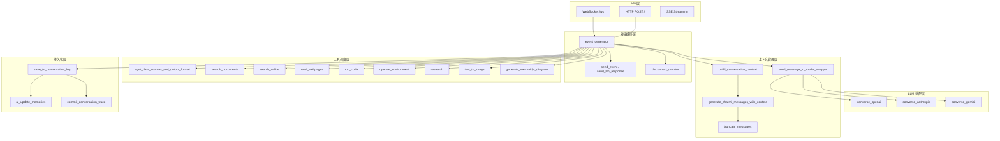

---

## 2. 核心组件

### 2.1 API 路由层

| 组件 | 文件 | 职责 |
|------|------|------|
| `api_chat` | `routers/api_chat.py` | FastAPI 路由器，提供 HTTP/WebSocket 对话端点 |
| `event_generator` | `routers/api_chat.py` | 核心异步生成器，编排整个对话处理流程 |
| `chat_ws` | `routers/api_chat.py` | WebSocket 端点，管理连接、中断和消息缓冲 |
| `process_chat_request` | `routers/api_chat.py` | WebSocket 请求处理器，实现消息缓冲和防抖 |

### 2.2 辅助函数层

| 组件 | 文件 | 职责 |
|------|------|------|
| `agenerate_chat_response` | `routers/helpers.py` | 构建上下文消息并调用对应 LLM 进行流式对话 |
| `send_message_to_model_wrapper` | `routers/helpers.py` | 带回退机制的模型调用封装（主模型失败后尝试备选模型） |
| `send_message_to_model` | `routers/helpers.py` | 根据模型类型分发到具体 LLM 提供商 |
| `aget_data_sources_and_output_format` | `routers/helpers.py` | 使用 LLM 推断用户查询需要的数据源和输出格式 |
| `build_conversation_context` | `routers/helpers.py` | 构建系统提示词、上下文消息和 ChatML 消息列表 |
| `ChatEvent` | `processor/conversation/utils.py` | 枚举类，定义流式事件类型 |

### 2.3 LLM 提供商适配层

| 组件 | 文件 | 职责 |
|------|------|------|
| `converse_openai` | `processor/conversation/openai/gpt.py` | OpenAI 流式对话（支持 Chat Completions API 和 Responses API） |
| `converse_anthropic` | `processor/conversation/anthropic/anthropic_chat.py` | Anthropic Claude 流式对话 |
| `converse_gemini` | `processor/conversation/google/gemini_chat.py` | Google Gemini 流式对话 |
| `*_send_message_to_model` | 各提供商目录 | 同步/非流式模型调用（用于工具推断等辅助任务） |

### 2.4 上下文与工具层

| 组件 | 文件 | 职责 |
|------|------|------|
| `generate_chatml_messages_with_context` | `processor/conversation/utils.py` | 组装完整 ChatML 消息列表（历史+上下文+当前查询） |
| `truncate_messages` | `processor/conversation/utils.py` | 按 token 预算截断消息 |
| `save_to_conversation_log` | `processor/conversation/utils.py` | 异步保存对话到数据库 |
| `prompts` | `processor/conversation/prompts.py` | 所有提示词模板集合 |

---

## 3. 对话流程时序图

### 3.1 完整对话处理流程

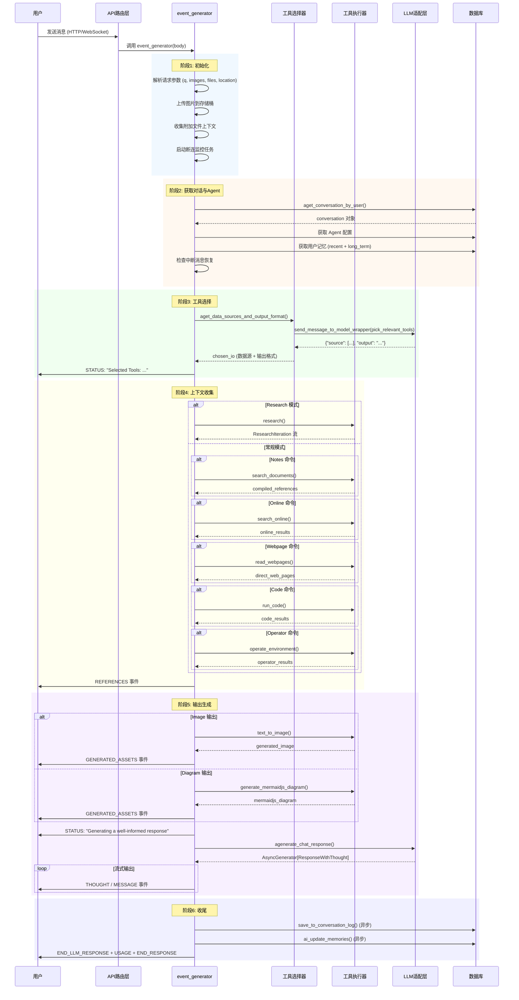

### 3.2 WebSocket 连接生命周期

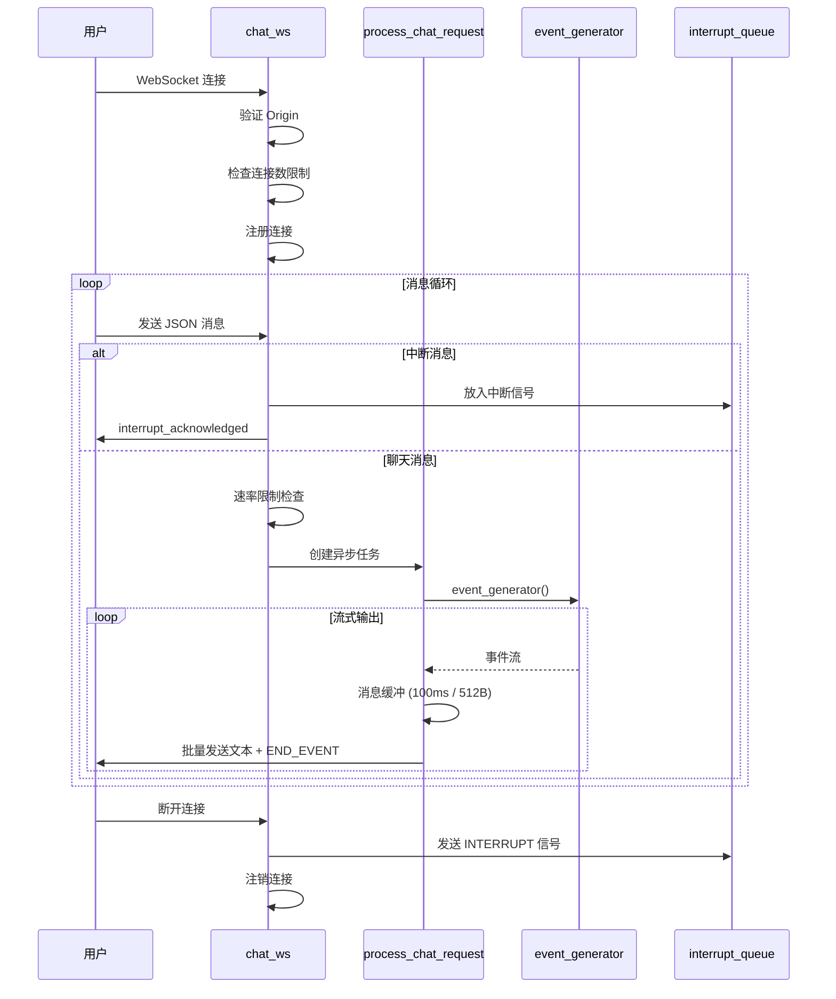

---

## 4. 多模型适配

### 4.1 模型分发架构

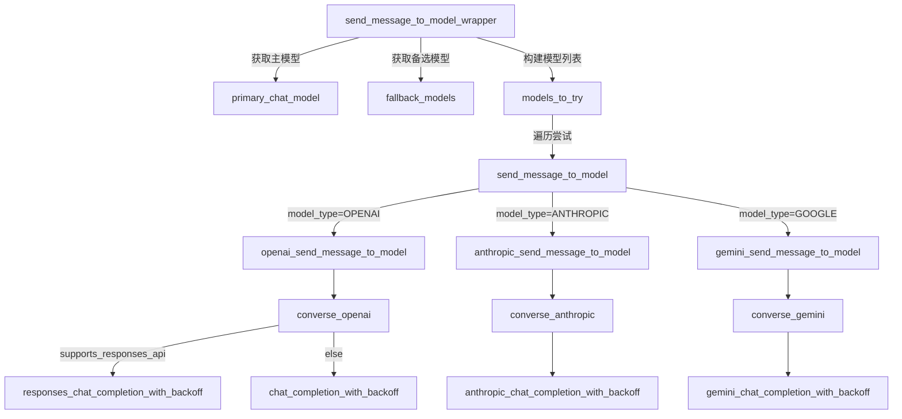

### 4.2 各提供商适配差异

```mermaid
graph LR
    subgraph "OpenAI 适配"
        O1[Chat Completions API] -->|标准模型| O2[completion_with_backoff]
        O3[Responses API] -->|o1/o3/o4/gpt-5| O4[responses_completion_with_backoff]
        O5[推理模型] -->|o1/o3/o4/gpt-5| O6[reasoning_effort 配置]
        O7[DeepSeek/Qwen] -->|流式思维| O8[in_stream_thought_processor]
    end

    subgraph "Anthropic 适配"
        A1[Messages API] --> A2[anthropic_completion_with_backoff]
        A3[推理模型] -->|claude-3-7/sonnet-4/opus-4| A4[thinking 配置]
        A5[JSON 输出] -->|prefill '{'| A6[assistant 消息预填充]
        A7[工具调用] -->|ToolParam| A8[Anthropic 工具格式]
    end

    subgraph "Google 适配"
        G1[Generate Content API] --> G2[gemini_completion_with_backoff]
        G3[推理模型] -->|gemini-2.5/3| G4[ThinkingConfig 配置]
        G5[安全过滤] -->|SafetySetting| G6[BLOCK_ONLY_HIGH]
        G7[速率限制] -->|retryDelay| G8[自定义等待策略]
    end
```

### 4.3 回退机制

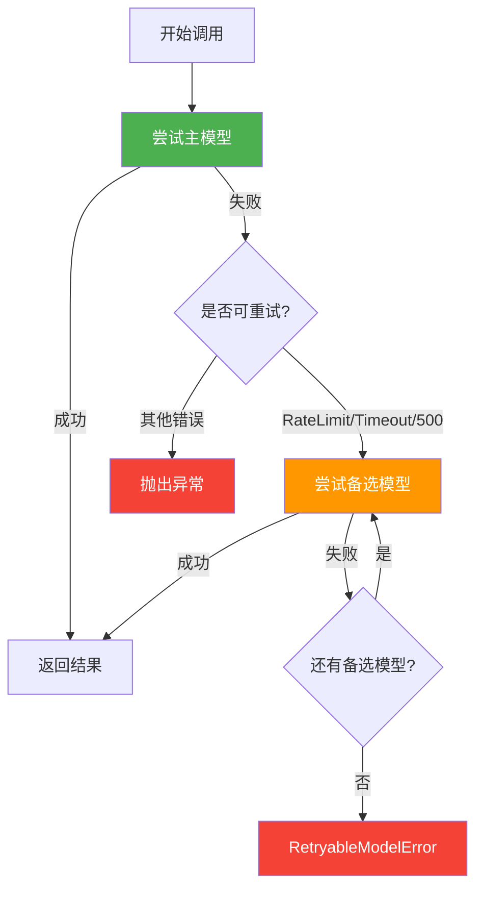

### 4.4 结构化输出支持等级

| 等级 | 值 | 说明 | 适用场景 |
|------|-----|------|---------|
| `NONE` | 0 | 不支持结构化输出 | deepseek-reasoner |
| `OBJECT` | 1 | 支持 JSON Object 模式 | Azure OpenAI, DeepInfra |
| `SCHEMA` | 2 | 支持 JSON Schema 约束 | 部分 OpenAI 兼容 API |
| `TOOL` | 3 | 支持工具调用方式 | OpenAI 官方 API |

---

## 5. 流式响应机制

### 5.1 两种流式传输协议

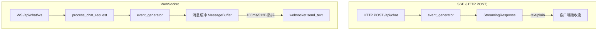

### 5.2 事件类型体系

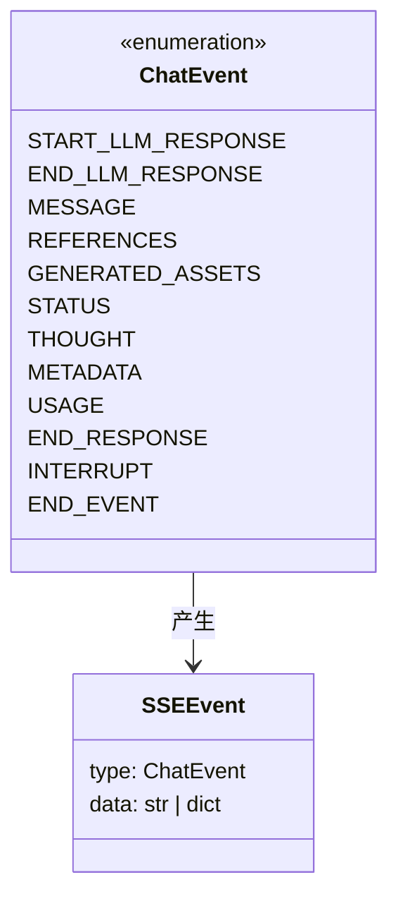

### 5.3 SSE 事件流格式

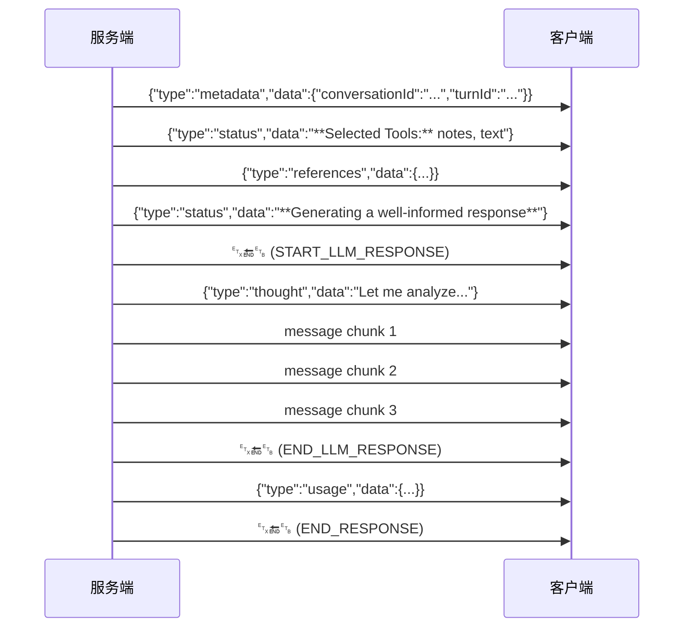

### 5.4 WebSocket 消息缓冲机制

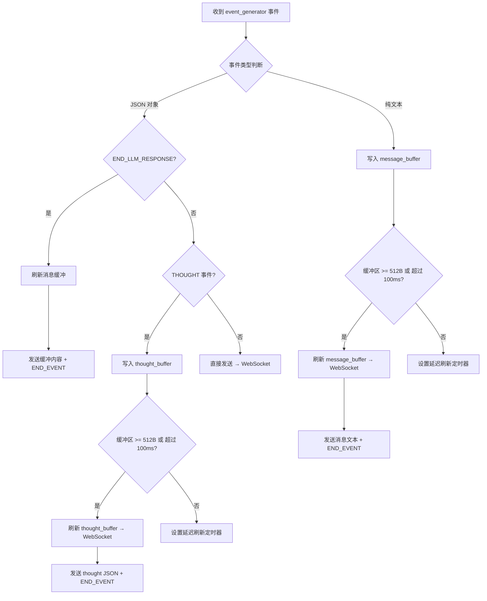

### 5.5 中断处理流程

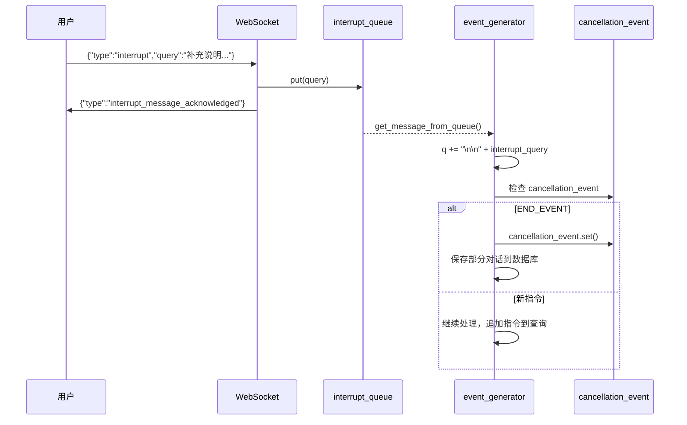

---

## 6. 上下文管理

### 6.1 上下文组装流程

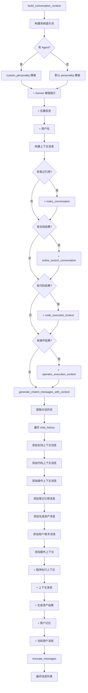

### 6.2 消息截断策略

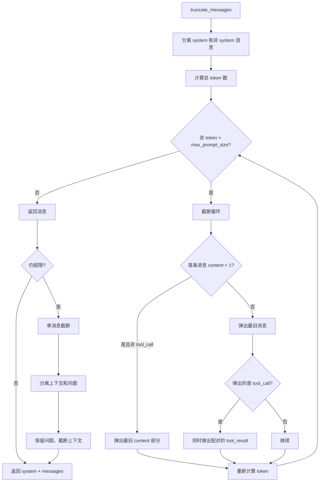

### 6.3 Token 预算分配

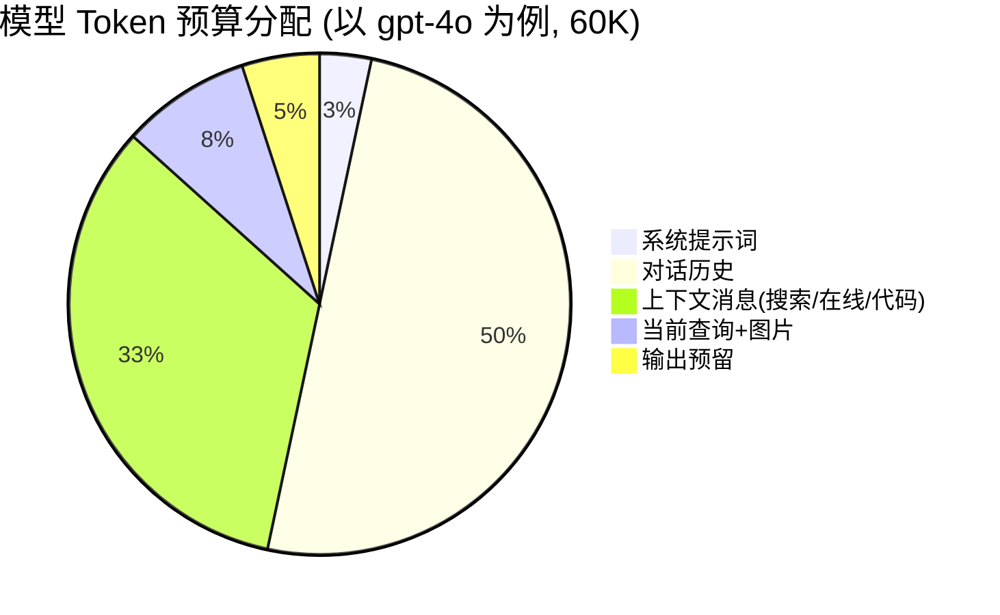

### 6.4 各模型上下文窗口配置

| 模型 | max_prompt_size | lookback_turns |
|------|----------------|----------------|
| gpt-4o | 60,000 | 80 |
| gpt-4.1-mini | 120,000 | 160 |
| o3 | 60,000 | 80 |
| claude-3-7-sonnet | 60,000 | 80 |
| gemini-2.5-flash | 120,000 | 160 |
| gemini-2.5-pro | 60,000 | 80 |

> `lookback_turns = max_prompt_size // 750`，用于限制从对话历史中提取的轮次数量。

---

## 7. 工具调用流程

### 7.1 工具选择流程

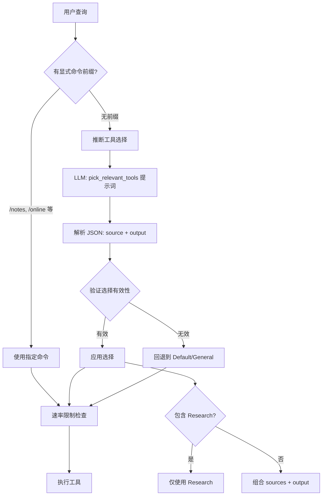

### 7.2 工具类型与执行流程

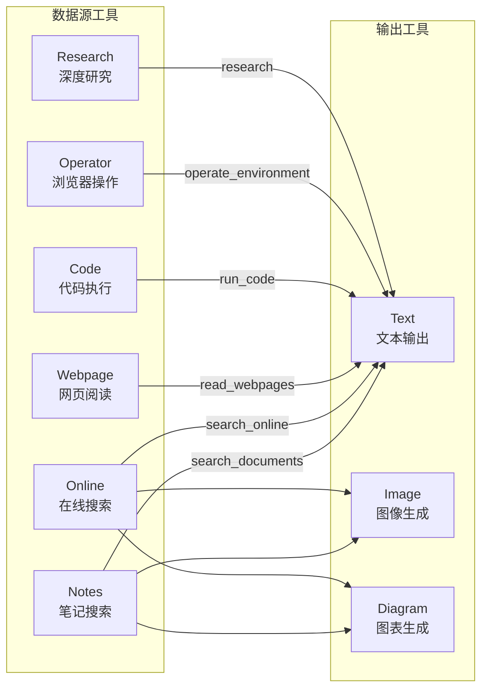

### 7.3 Research 模式详细流程

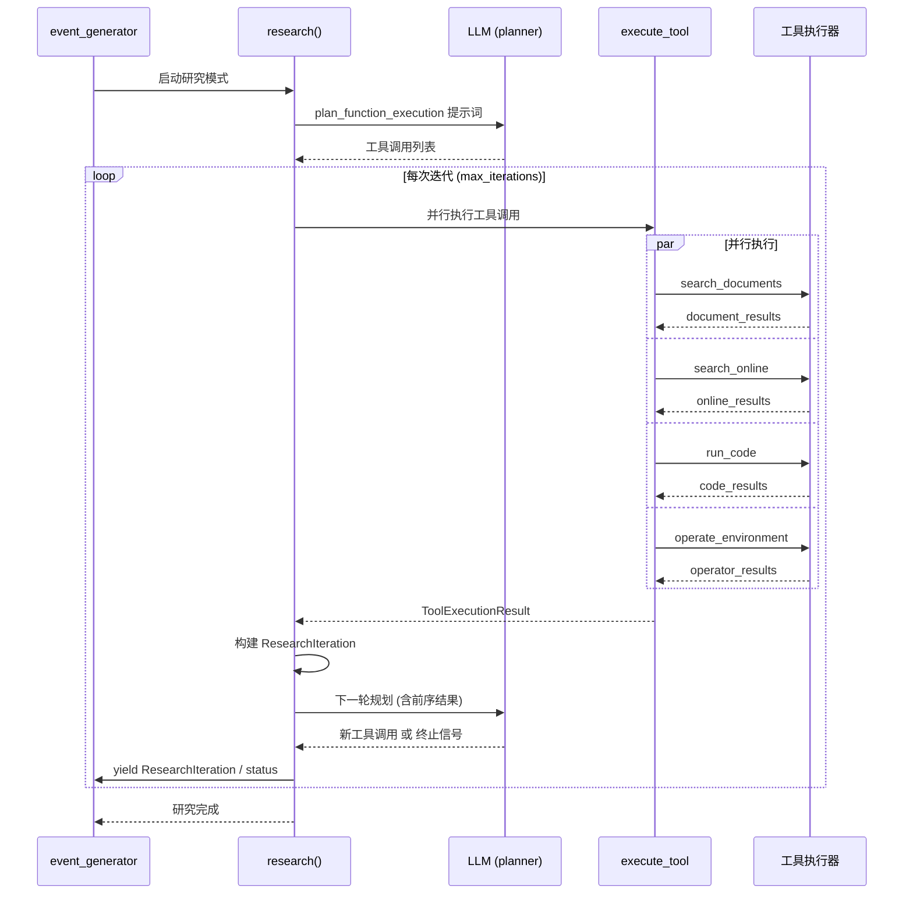

### 7.4 工具调用在 LLM 中的消息格式

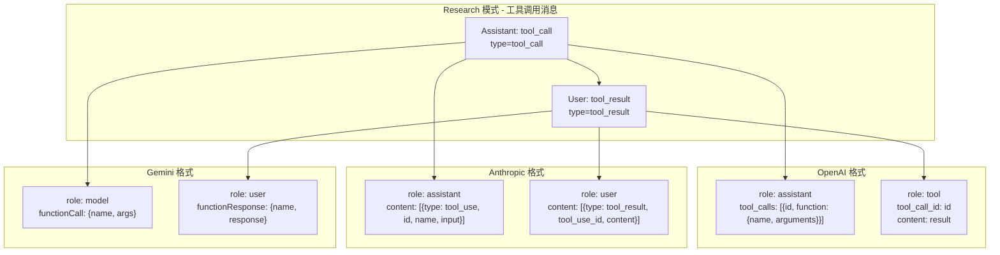

---

## 8. 关键数据结构

### 8.1 核心数据结构类图

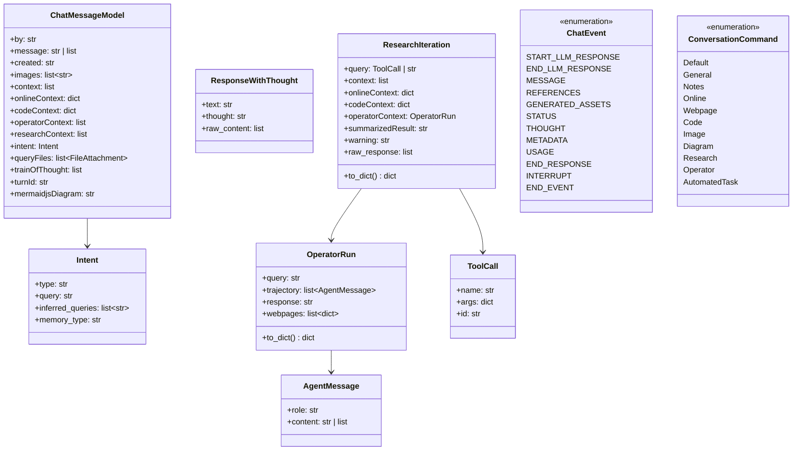

### 8.2 ChatMessageModel 详解

`ChatMessageModel` 是对话持久化的核心数据结构，每条消息包含：

| 字段 | 类型 | 说明 |
|------|------|------|
| `by` | `"you"` / `"khoj"` | 消息发送者 |
| `message` | `str` / `list` | 消息内容（文本或结构化内容） |
| `context` | `list` | 笔记搜索引用结果 |
| `onlineContext` | `dict` | 在线搜索结果 |
| `codeContext` | `dict` | 代码执行结果 |
| `operatorContext` | `list[dict]` | 浏览器操作结果 |
| `researchContext` | `list[dict]` | 研究迭代结果 |
| `intent` | `Intent` | 意图信息（类型、推断查询） |
| `queryFiles` | `list[FileAttachment]` | 用户附加文件 |
| `trainOfThought` | `list` | 推理过程记录 |
| `turnId` | `str` | 对话轮次 ID |
| `images` | `list[str]` | 生成的图像 URL |

### 8.3 ResponseWithThought 详解

`ResponseWithThought` 是 LLM 流式输出的统一封装：

| 字段 | 类型 | 说明 |
|------|------|------|
| `text` | `str` | 模型生成的文本内容（流式增量） |
| `thought` | `str` | 模型的推理/思考过程（流式增量） |
| `raw_content` | `list` | 原始响应内容（用于缓存命中） |

在流式模式下，每个 chunk 只包含 `text` 或 `thought` 其中之一，由 `event_generator` 分别路由为 `MESSAGE` 或 `THOUGHT` 事件。

### 8.4 ResearchIteration 详解

`ResearchIteration` 记录研究模式的每次迭代：

| 字段 | 类型 | 说明 |
|------|------|------|
| `query` | `ToolCall` / `str` | 工具调用描述或文本指令 |
| `context` | `list` | 本次迭代的笔记搜索结果 |
| `onlineContext` | `dict` | 本次迭代的在线搜索结果 |
| `codeContext` | `dict` | 本次迭代的代码执行结果 |
| `operatorContext` | `OperatorRun` | 本次迭代的浏览器操作结果 |
| `summarizedResult` | `str` | 工具执行结果的摘要 |
| `warning` | `str` | 警告信息 |
| `raw_response` | `list` | 原始 LLM 响应（用于多轮对话缓存） |

### 8.5 OperatorRun 详解

`OperatorRun` 记录浏览器操作的完整轨迹：

| 字段 | 类型 | 说明 |
|------|------|------|
| `query` | `str` | 操作任务描述 |
| `trajectory` | `list[AgentMessage]` | 操作轨迹（user/assistant/environment 消息序列） |
| `response` | `str` | 操作结果摘要 |
| `webpages` | `list[dict]` | 访问过的网页列表 |

---

## 9. 提示词体系

### 9.1 提示词分类

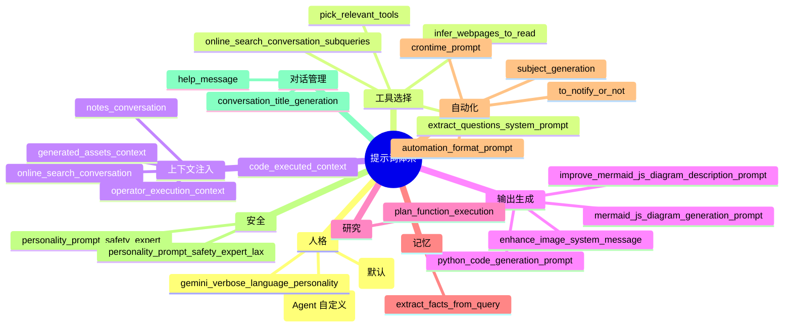

### 9.2 系统提示词组装

```mermaid
flowchart TD
    START[系统提示词构建] --> A{有 Agent?}
    A -->|是| B[custom_personality<br/>name + bio]
    A -->|否| C[personality<br/>Khoj 默认人格]

    B --> D{Google 模型?}
    C --> D
    D -->|是| E[+ gemini_verbose_language_personality]
    D -->|否| F[继续]

    E --> G{有位置信息?}
    F --> G
    G -->|是| H[+ user_location]
    G -->|否| I[继续]

    H --> J{有用户名?}
    I --> J
    J -->|是| K[+ user_name]
    J -->|否| L[完成]
    K --> L
```

---

## 10. 推理模型支持

### 10.1 各提供商推理模型配置

```mermaid
graph TB
    subgraph "OpenAI 推理模型"
        OR1[o1/o3/o4-mini/gpt-5] --> OR2["reasoning_effort: low/medium"]
        OR3[deepthought=true] --> OR4["reasoning_effort: medium"]
        OR5[temperature=1 固定]
    end

    subgraph "Anthropic 推理模型"
        AR1[claude-3-7/sonnet-4/opus-4] --> AR2["thinking: enabled"]
        AR3[deepthought=true] --> AR4["budget_tokens: 12000"]
        AR5[temperature=1 固定]
        AR6["betas: context-management"]
    end

    subgraph "Gemini 推理模型"
        GR1[gemini-2.5] --> GR2["thinking_budget: 512"]
        GR3[gemini-3] --> GR4["thinking_level: LOW/HIGH"]
        GR5[include_thoughts: true]
    end
```

### 10.2 思维过程提取方式

| 提供商 | 思维提取方式 | 处理器 |
|--------|-------------|--------|
| OpenAI (o系列) | `reasoning_content` 字段 | `astream_thought_processor` |
| OpenAI (Responses API) | `ResponseReasoningItem` | 直接提取 |
| DeepSeek/Qwen | `<think...</think` 标签 | `in_stream_thought_processor` |
| Anthropic | `thinking_delta` 事件 | 直接提取 |
| Gemini | `part.thought` 标记 | 直接提取 |

---

## 11. 错误处理与重试

### 11.1 重试策略

```mermaid
flowchart TD
    CALL[模型调用] --> RESULT{调用结果}
    RESULT -->|成功| OK[返回响应]
    RESULT -->|失败| ERR{错误类型}

    ERR -->|RateLimitError| RETRY1[指数退避重试]
    ERR -->|APITimeoutError| RETRY1
    ERR -->|InternalServerError| RETRY1
    ERR -->|ValueError 空响应| RETRY1
    ERR -->|NetworkError| RETRY1
    ERR -->|其他错误| RAISE[直接抛出]

    RETRY1 -->|重试成功| OK
    RETRY1 -->|重试耗尽| FALLBACK[尝试备选模型]
    FALLBACK -->|成功| OK
    FALLBACK -->|全部失败| FINAL[RetryableModelError]
```

### 11.2 各提供商重试配置

| 提供商 | 重试次数 | 等待策略 | 适用异常 |
|--------|---------|---------|---------|
| OpenAI (同步) | 2 | 随机指数退避 (1-10s) | Timeout, RateLimit, InternalServer, ValueError |
| OpenAI (异步) | 3 | 指数退避 (4-10s) | 同上 |
| Anthropic | 2 | 随机指数退避 (1-10s) | APIError, RateLimitError |
| Gemini | 2-3 | Gemini retryDelay + 指数退避 | 429, 502, 503, 504, ValueError |

---

## 12. 对话持久化

### 12.1 保存流程

```mermaid
sequenceDiagram
    participant EG as event_generator
    participant SCL as save_to_conversation_log
    participant MTL as message_to_log
    participant DB as ConversationAdapters
    participant MEM as ai_update_memories
    participant TRACE as commit_conversation_trace

    EG->>SCL: 异步调用 (asyncio.create_task)
    SCL->>SCL: 构建 user_message_metadata
    Note over SCL: created, images, turnId, queryFiles
    SCL->>SCL: 构建 khoj_message_metadata
    Note over SCL: context, intent, onlineContext,<br/>codeContext, operatorContext,<br/>researchContext, trainOfThought,<br/>images, mermaidjsDiagram

    SCL->>MTL: message_to_log()
    MTL->>MTL: 验证 ChatMessageModel
    MTL-->>SCL: [human_message, khoj_message]

    SCL->>DB: save_conversation()
    DB-->>SCL: db_conversation

    SCL->>MEM: ai_update_memories()
    Note over MEM: 非自动化任务时更新记忆

    SCL->>TRACE: commit_conversation_trace()
    Note over TRACE: 仅在 promptrace 启用时
```

### 12.2 中断恢复机制

当用户中断对话时，系统会保存部分上下文。下次对话时，`event_generator` 会检测并恢复中断消息的上下文：

```mermaid
flowchart TD
    START[对话开始] --> CHECK{有中断消息?}
    CHECK -->|是| RESTORE[恢复上下文]
    CHECK -->|否| NORMAL[正常流程]

    RESTORE --> R1[恢复 online_results]
    R1 --> R2[恢复 code_results]
    R2 --> R3[恢复 compiled_references]
    R3 --> R4[恢复 research_results]
    R4 --> R5[恢复 operator_results]
    R5 --> R6[恢复 train_of_thought]
    R6 --> NORMAL
```
